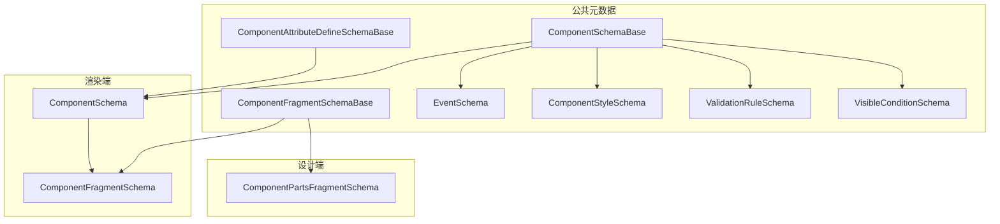
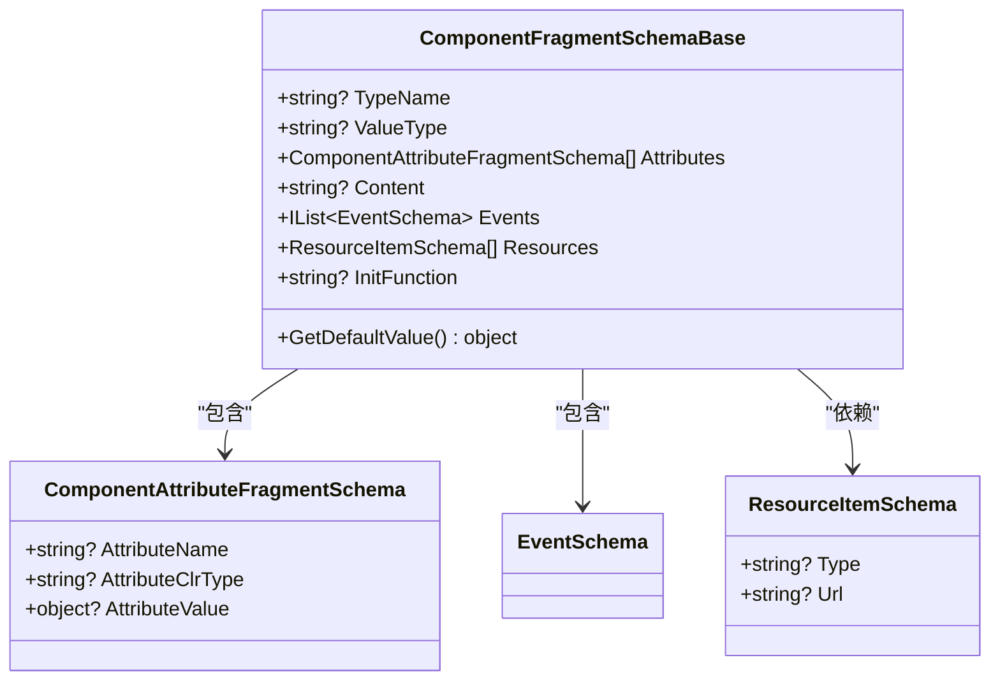
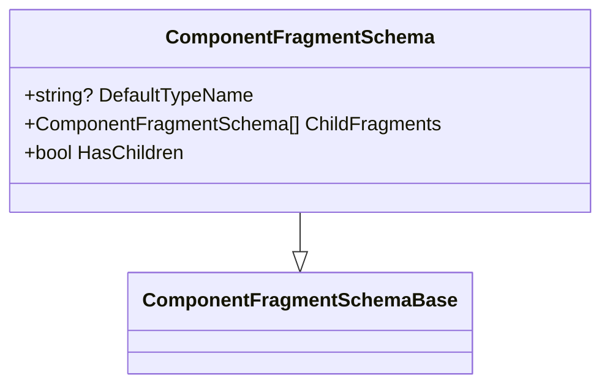
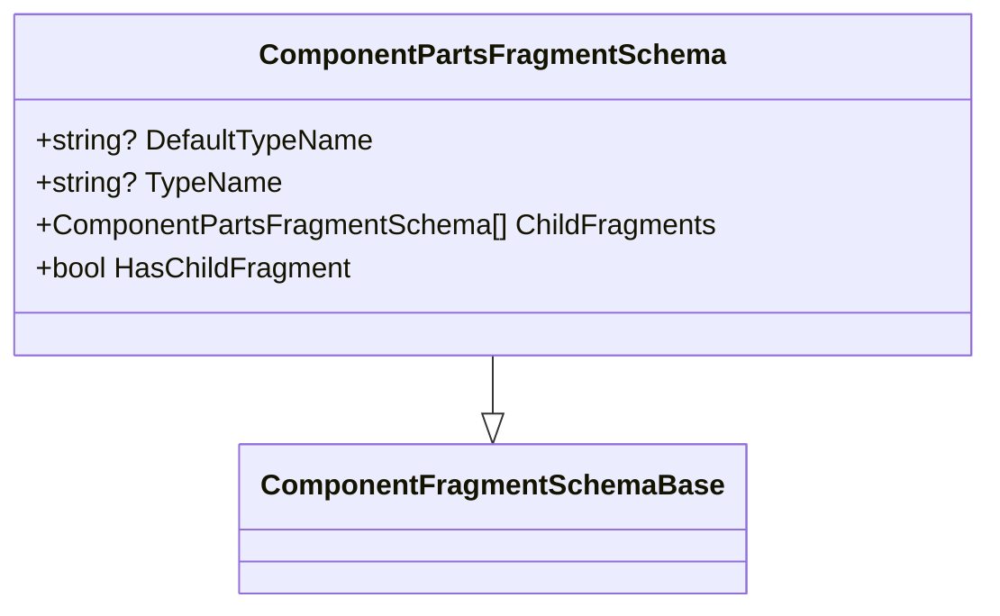
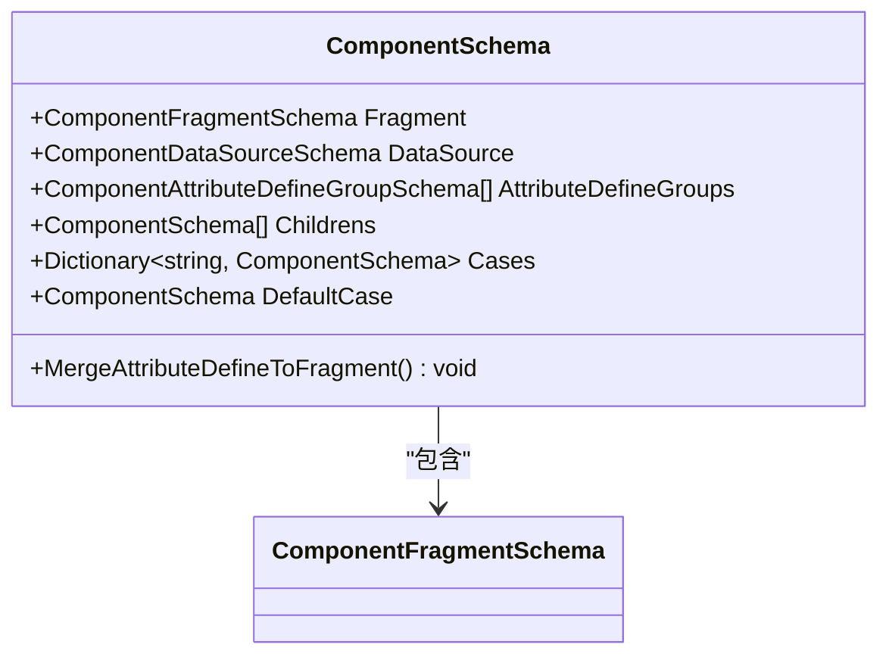
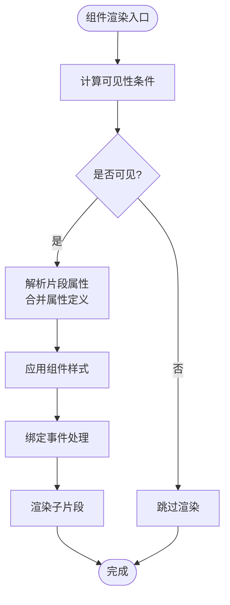
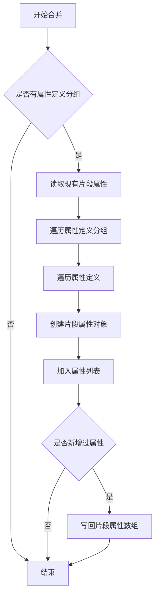

# 片段Schema规范

<cite>
**本文引用的文件**   
- [ComponentFragmentSchemaBase.cs](file://src/LowCode/Common/H.LowCode.MetaSchema/PropertySchemas/ComponentFragmentSchemaBase.cs)
- [ComponentFragmentSchema.cs](file://src/LowCode/Common/H.LowCode.MetaSchema.RenderEngine/PropertySchemas/ComponentFragmentSchema.cs)
- [ComponentPartsFragmentSchema.cs](file://src/LowCode/Common/H.LowCode.MetaSchema.DesignEngine/PropertySchemas/ComponentPartsFragmentSchema.cs)
- [ComponentSchema.cs](file://src/LowCode/Common/H.LowCode.MetaSchema.RenderEngine/ComponentSchema.cs)
- [EventSchema.cs](file://src/LowCode/Common/H.LowCode.MetaSchema/PropertySchemas/EventSchema.cs)
- [ComponentSchemaBase.cs](file://src/LowCode/Common/H.LowCode.MetaSchema/ComponentSchemaBase.cs)
- [ComponentStyleSchema.cs](file://src/LowCode/Common/H.LowCode.MetaSchema/PropertySchemas/ComponentStyleSchema.cs)
- [ValidationRuleSchema.cs](file://src/LowCode/Common/H.LowCode.MetaSchema/PropertySchemas/ValidationRuleSchema.cs)
- [VisibleConditionSchema.cs](file://src/LowCode/Common/H.LowCode.MetaSchema/PropertySchemas/VisibleConditionSchema.cs)
- [ComponentAttributeDefineSchemaBase.cs](file://src/LowCode/Common/H.LowCode.MetaSchema/PropertySchemas/ComponentAttributeDefineSchemaBase.cs)
</cite>

## 目录
1. [引言](#引言)
2. [项目结构与定位](#项目结构与定位)
3. [核心概念与职责划分](#核心概念与职责划分)
4. [片段基础 Schema：ComponentFragmentSchemaBase](#片段基础-schema-componentfragmentschemabase)
5. [渲染端片段：ComponentFragmentSchema](#渲染端片段componentfragmentschema)
6. [设计端片段：ComponentPartsFragmentSchema](#设计端片段componentpartsfragmentschema)
7. [组件 Schema 与片段的绑定关系](#组件-schema-与片段的绑定关系)
8. [属性、事件、样式和校验的完整规范](#属性事件样式和校验的完整规范)
9. [片段数据转换与合并机制](#片段数据转换与合并机制)
10. [复杂组件片段定义示例](#复杂组件片段定义示例)
11. [可复用性与模板化片段](#可复用性与模板化片段)
12. [性能优化与调试技巧](#性能优化与调试技巧)
13. [常见问题排查](#常见问题排查)
14. [结论](#结论)

## 引言
本文面向 H.AppLab 低代码平台的“组件片段 Schema”，系统性说明 ComponentFragmentSchemaBase 的设计理念，以及 Fragment 在设计时与运行时中的作用差异。文档覆盖片段属性、事件、样式、资源依赖、初始化函数、子片段、可见性条件、校验规则等完整规范，并给出属性绑定、事件处理、样式继承的工作机制说明，同时提供复杂组件的片段定义思路、可复用设计、模板化片段开发方法和性能优化建议。

## 项目结构与定位
片段相关类型主要位于 LowCode 公共元数据层和渲染端、设计端的扩展元数据层中：

- 公共元数据基础：
  - ComponentFragmentSchemaBase：片段的基础结构。
  - EventSchema：事件配置。
  - ComponentSchemaBase：组件实例级别元数据，包含样式、事件、校验、可见性等。
  - ComponentStyleSchema、ValidationRuleSchema、VisibleConditionSchema：样式、校验、显示条件。
  - ComponentAttributeDefineSchemaBase：属性定义的抽象基类。
- 渲染端片段：
  - ComponentFragmentSchema：运行时使用的片段类型，包含默认类型名和子片段数组。
  - ComponentSchema：组件渲染 Schema，持有 Fragment、数据源、属性定义分组、子组件、条件分支等。
- 设计端片段：
  - ComponentPartsFragmentSchema：设计端部件片段类型，用于部件编辑器中的片段建模。

**图示来源**
- [ComponentFragmentSchemaBase.cs:1-82](file://src/LowCode/Common/H.LowCode.MetaSchema/PropertySchemas/ComponentFragmentSchemaBase.cs#L1-L82)
- [ComponentFragmentSchema.cs:1-28](file://src/LowCode/Common/H.LowCode.MetaSchema.RenderEngine/PropertySchemas/ComponentFragmentSchema.cs#L1-L28)
- [ComponentPartsFragmentSchema.cs:1-38](file://src/LowCode/Common/H.LowCode.MetaSchema.DesignEngine/PropertySchemas/ComponentPartsFragmentSchema.cs#L1-L38)
- [ComponentSchema.cs:1-83](file://src/LowCode/Common/H.LowCode.MetaSchema.RenderEngine/ComponentSchema.cs#L1-L83)
- [ComponentSchemaBase.cs:1-110](file://src/LowCode/Common/H.LowCode.MetaSchema/ComponentSchemaBase.cs#L1-L110)
- [ComponentStyleSchema.cs:1-38](file://src/LowCode/Common/H.LowCode.MetaSchema/PropertySchemas/ComponentStyleSchema.cs#L1-L38)
- [ValidationRuleSchema.cs:1-172](file://src/LowCode/Common/H.LowCode.MetaSchema/PropertySchemas/ValidationRuleSchema.cs#L1-L172)
- [VisibleConditionSchema.cs:1-49](file://src/LowCode/Common/H.LowCode.MetaSchema/PropertySchemas/VisibleConditionSchema.cs#L1-L49)
- [EventSchema.cs:1-66](file://src/LowCode/Common/H.LowCode.MetaSchema/PropertySchemas/EventSchema.cs#L1-L66)
- [ComponentAttributeDefineSchemaBase.cs:1-25](file://src/LowCode/Common/H.LowCode.MetaSchema/PropertySchemas/ComponentAttributeDefineSchemaBase.cs#L1-L25)

**章节来源**
- [ComponentFragmentSchemaBase.cs:1-82](file://src/LowCode/Common/H.LowCode.MetaSchema/PropertySchemas/ComponentFragmentSchemaBase.cs#L1-L82)
- [ComponentFragmentSchema.cs:1-28](file://src/LowCode/Common/H.LowCode.MetaSchema.RenderEngine/PropertySchemas/ComponentFragmentSchema.cs#L1-L28)
- [ComponentPartsFragmentSchema.cs:1-38](file://src/LowCode/Common/H.LowCode.MetaSchema.DesignEngine/PropertySchemas/ComponentPartsFragmentSchema.cs#L1-L38)
- [ComponentSchema.cs:1-83](file://src/LowCode/Common/H.LowCode.MetaSchema.RenderEngine/ComponentSchema.cs#L1-L83)
- [ComponentSchemaBase.cs:1-110](file://src/LowCode/Common/H.LowCode.MetaSchema/ComponentSchemaBase.cs#L1-L110)

## 核心概念与职责划分
- ComponentFragmentSchemaBase：定义所有片段共享的结构，包括组件类型名、值类型、属性数组、内容文本、事件、静态资源依赖和初始化函数。它是片段体系的核心抽象。
- ComponentFragmentSchema：渲染端使用，描述具体要渲染的组件片段，包含默认类型名和子片段数组，供渲染引擎将 JSON 转为 Blazor 组件树。
- ComponentPartsFragmentSchema：设计端使用，用于部件编辑器和设计器中对片段进行建模；它与渲染端片段在字段语义上保持一致，但设计端会强制 TypeName 为空，而使用 DefaultTypeName 作为落盘和回退策略。
- ComponentSchema：组件级元数据，除了 Fragment，还包含数据源、属性定义分组、子组件、条件分支等。它负责把“属性定义”转换为“片段属性”，并在渲染前完成合并。

这种分层使得“片段”既可以承载简单组件的属性与事件，也可以表达容器组件的子节点树；同时，“组件 Schema”可以管理更高层的布局、数据、校验、可见性等元信息。

**章节来源**
- [ComponentFragmentSchemaBase.cs:1-82](file://src/LowCode/Common/H.LowCode.MetaSchema/PropertySchemas/ComponentFragmentSchemaBase.cs#L1-L82)
- [ComponentFragmentSchema.cs:1-28](file://src/LowCode/Common/H.LowCode.MetaSchema.RenderEngine/PropertySchemas/ComponentFragmentSchema.cs#L1-L28)
- [ComponentPartsFragmentSchema.cs:1-38](file://src/LowCode/Common/H.LowCode.MetaSchema.DesignEngine/PropertySchemas/ComponentPartsFragmentSchema.cs#L1-L38)
- [ComponentSchema.cs:1-83](file://src/LowCode/Common/H.LowCode.MetaSchema.RenderEngine/ComponentSchema.cs#L1-L83)

## 片段基础 Schema：ComponentFragmentSchemaBase
ComponentFragmentSchemaBase 是所有片段类型的根，其字段设计围绕“如何把一个组件实例用 JSON 表示”展开。

### 字段语义
- TypeName：组件类型名。渲染端可用于最终解析类型；当为空时，渲染端或设计端可使用默认类型名回退。
- ValueType：值的 CLR 类型字符串，用于 GetDefaultValue 获取该类型默认值。
- Attributes：片段属性数组，每个元素表示一个组件属性的名称、CLR 类型和值。
- Content：片段文本内容，适合富文本、按钮文案等场景。
- Events：事件列表，支持标准事件、自定义脚本和数据操作事件。
- Resources：静态资源清单，用于编辑器或纯物料组件加载外部 JS/CSS。
- InitFunction：资源加载完成后调用的初始化函数名，配合挂载点 id 和组件选项调用。

### 关键行为
- GetDefaultValue：根据 ValueType 反射得到对应类型的默认值，便于在缺少显式值时使用合理默认值。
- ResourceItemSchema：资源项包含类型和地址，支持外部 URL、_content 路径或已上传文件访问地址。
- ComponentAttributeFragmentSchema：片段属性条目，包含属性名、CLR 类型和属性值。

**图示来源**
- [ComponentFragmentSchemaBase.cs:1-82](file://src/LowCode/Common/H.LowCode.MetaSchema/PropertySchemas/ComponentFragmentSchemaBase.cs#L1-L82)
- [EventSchema.cs:1-66](file://src/LowCode/Common/H.LowCode.MetaSchema/PropertySchemas/EventSchema.cs#L1-L66)

**章节来源**
- [ComponentFragmentSchemaBase.cs:1-82](file://src/LowCode/Common/H.LowCode.MetaSchema/PropertySchemas/ComponentFragmentSchemaBase.cs#L1-L82)

## 渲染端片段：ComponentFragmentSchema
ComponentFragmentSchema 是运行时渲染使用的片段类型，它在基础片段之上增加了：

- DefaultTypeName：默认组件类型名，用于设计端落盘和渲染端回退。普通 .NET 组件使用全名，原生 HTML 元素使用 “html:{标签}” 形式。
- ChildFragments：子片段数组，表示容器组件的子节点树。
- HasChildren：便捷判断是否存在子片段。

渲染端片段强调“可被渲染为真实组件树”，因此它的子片段数组直接对应 UI 层级结构。

**图示来源**
- [ComponentFragmentSchema.cs:1-28](file://src/LowCode/Common/H.LowCode.MetaSchema.RenderEngine/PropertySchemas/ComponentFragmentSchema.cs#L1-L28)
- [ComponentFragmentSchemaBase.cs:1-82](file://src/LowCode/Common/H.LowCode.MetaSchema/PropertySchemas/ComponentFragmentSchemaBase.cs#L1-L82)

**章节来源**
- [ComponentFragmentSchema.cs:1-28](file://src/LowCode/Common/H.LowCode.MetaSchema.RenderEngine/PropertySchemas/ComponentFragmentSchema.cs#L1-L28)

## 设计端片段：ComponentPartsFragmentSchema
ComponentPartsFragmentSchema 是设计端部件模型中的片段类型，它同样继承自 ComponentFragmentSchemaBase，但有以下设计差异：

- DefaultTypeName：设计端默认类型名，语义与渲染端一致。
- TypeName：设计端重写后，保存 JSON 时会被强制设为空，因为设计端优先使用 DefaultTypeName。
- ChildFragments：设计端子片段数组。
- HasChildFragment：便捷判断是否包含子片段。

设计端片段更偏向“建模和编辑”，而渲染端片段更偏向“执行和渲染”。两者通过一致的字段语义保持兼容。

**图示来源**
- [ComponentPartsFragmentSchema.cs:1-38](file://src/LowCode/Common/H.LowCode.MetaSchema.DesignEngine/PropertySchemas/ComponentPartsFragmentSchema.cs#L1-L38)
- [ComponentFragmentSchemaBase.cs:1-82](file://src/LowCode/Common/H.LowCode.MetaSchema/PropertySchemas/ComponentFragmentSchemaBase.cs#L1-L82)

**章节来源**
- [ComponentPartsFragmentSchema.cs:1-38](file://src/LowCode/Common/H.LowCode.MetaSchema.DesignEngine/PropertySchemas/ComponentPartsFragmentSchema.cs#L1-L38)

## 组件 Schema 与片段的绑定关系
ComponentSchema 是组件级元数据，它不仅包含 Fragment，还包含数据源、属性定义分组、子组件和条件分支。

- Fragment：组件渲染片段，包含属性和子片段。
- DataSource：组件数据源配置。
- AttributeDefineGroups：属性定义分组，用于声明组件支持哪些属性及默认值。
- Childrens：子组件列表，属于组件 Schema 层级。
- Cases/default：条件分支配置，用于条件渲染组件。
- MergeAttributeDefineToFragment：将属性定义分组转换为片段属性，并与已有片段属性合并。

这个设计让“组件能力定义”与“组件实例片段”分离：前者描述组件能接收什么属性，后者描述某个实例实际传了什么属性。

**图示来源**
- [ComponentSchema.cs:1-83](file://src/LowCode/Common/H.LowCode.MetaSchema.RenderEngine/ComponentSchema.cs#L1-L83)

**章节来源**
- [ComponentSchema.cs:1-83](file://src/LowCode/Common/H.LowCode.MetaSchema.RenderEngine/ComponentSchema.cs#L1-L83)

## 属性、事件、样式和校验的完整规范

### 片段属性
片段属性由 ComponentAttributeFragmentSchema 表示，关键字段如下：

| 字段 | 含义 | 说明 |
|---|---|---|
| attrn | 属性名 | 对应目标组件上的属性名，必须存在 |
| attrt | CLR 类型 | 属性值的 .NET 类型字符串 |
| attrv | 属性值 | 运行时传给组件的实际值 |

片段属性来自两个来源：
- 直接写在 Fragment.Attributes 中的实例级属性。
- 由 ComponentSchema.AttributeDefineGroups 转换而来的属性定义。

### 事件
EventSchema 支持三类事件：

| 类别 | 关键字段 | 用途 |
|---|---|---|
| 标准事件 | en、eht、etid、eta | 指定事件名、处理器类型、目标组件 ID 和目标动作 |
| 自定义事件 | ecl、ecs | 使用自定义脚本语言和内容 |
| 数据操作事件 | edat | 对数据进行增删改查等操作 |

此外，事件还支持 EventArgs 和 RowDataParams，用于传递通用参数和行数据映射。

### 样式
组件样式由 ComponentStyleSchema 描述，常用字段如下：

| 字段 | 含义 | 默认值或说明 |
|---|---|---|
| itemw | 组件宽度 | 有效值 4-24，例如 12/24*100=50% |
| itemh | 组件高度 | 单位 px，默认 85px |
| labelw | 标签宽度 | 默认 180px |
| dfstl | 默认样式 | 内置默认样式字符串 |
| ctstl | 自定义样式 | 用户自定义样式字符串 |

样式属于组件 Schema 层级，不是片段内部字段；片段可以通过属性影响组件表现，但布局尺寸和样式控制通常在组件实例元数据中定义。

### 校验规则
ValidationRuleSchema 定义表单或输入类组件的校验逻辑，支持必填、长度、数值范围、正则、邮箱、手机号、URL、身份证号、自定义表达式等规则，并可配置触发时机和错误消息。

### 可见性条件
VisibleConditionSchema 控制组件是否渲染，支持值表达式、比较操作符和期望值表达式，常用于联动显隐和按数据字段分支渲染。

**图示来源**
- [ComponentSchemaBase.cs:1-110](file://src/LowCode/Common/H.LowCode.MetaSchema/ComponentSchemaBase.cs#L1-L110)
- [ComponentStyleSchema.cs:1-38](file://src/LowCode/Common/H.LowCode.MetaSchema/PropertySchemas/ComponentStyleSchema.cs#L1-L38)
- [ValidationRuleSchema.cs:1-172](file://src/LowCode/Common/H.LowCode.MetaSchema/PropertySchemas/ValidationRuleSchema.cs#L1-L172)
- [VisibleConditionSchema.cs:1-49](file://src/LowCode/Common/H.LowCode.MetaSchema/PropertySchemas/VisibleConditionSchema.cs#L1-L49)
- [EventSchema.cs:1-66](file://src/LowCode/Common/H.LowCode.MetaSchema/PropertySchemas/EventSchema.cs#L1-L66)

**章节来源**
- [ComponentFragmentSchemaBase.cs:1-82](file://src/LowCode/Common/H.LowCode.MetaSchema/PropertySchemas/ComponentFragmentSchemaBase.cs#L1-L82)
- [EventSchema.cs:1-66](file://src/LowCode/Common/H.LowCode.MetaSchema/PropertySchemas/EventSchema.cs#L1-L66)
- [ComponentSchemaBase.cs:1-110](file://src/LowCode/Common/H.LowCode.MetaSchema/ComponentSchemaBase.cs#L1-L110)
- [ComponentStyleSchema.cs:1-38](file://src/LowCode/Common/H.LowCode.MetaSchema/PropertySchemas/ComponentStyleSchema.cs#L1-L38)
- [ValidationRuleSchema.cs:1-172](file://src/LowCode/Common/H.LowCode.MetaSchema/PropertySchemas/ValidationRuleSchema.cs#L1-L172)
- [VisibleConditionSchema.cs:1-49](file://src/LowCode/Common/H.LowCode.MetaSchema/PropertySchemas/VisibleConditionSchema.cs#L1-L49)

## 片段数据转换与合并机制
ComponentSchema.MergeAttributeDefineToFragment 实现了“属性定义到片段属性”的转换与合并流程：

1. 如果 AttributeDefineGroups 为空，则直接返回。
2. 读取 Fragment.Attributes 现有属性列表。
3. 遍历每个属性定义分组和其中的属性定义。
4. 将属性定义转换为 ComponentAttributeFragmentSchema。
5. 追加到属性列表中。
6. 如果有新增属性，则将新的属性数组写回 Fragment.Attributes。

这个机制保证“组件能力定义”和“实例片段属性”可以协同工作：组件作者声明属性定义，实例定义提供具体值。

**图示来源**
- [ComponentSchema.cs:1-83](file://src/LowCode/Common/H.LowCode.MetaSchema.RenderEngine/ComponentSchema.cs#L1-L83)

**章节来源**
- [ComponentSchema.cs:1-83](file://src/LowCode/Common/H.LowCode.MetaSchema.RenderEngine/ComponentSchema.cs#L1-L83)
- [ComponentAttributeDefineSchemaBase.cs:1-25](file://src/LowCode/Common/H.LowCode.MetaSchema/PropertySchemas/ComponentAttributeDefineSchemaBase.cs#L1-L25)

## 复杂组件片段定义示例
以下以“复杂表单组合组件”为例，说明如何组织片段 Schema。这里不展示具体 JSON 内容，只描述结构和字段选择。

- 外层组件：
  - ComponentSchema.Fragment.DefaultTypeName：组件类型全名。
  - ComponentSchema.Fragment.Attributes：包含标题、布局模式、数据绑定键等属性。
  - ComponentSchema.Fragment.Events：包含提交、重置等事件。
  - ComponentSchema.DataSource：表单数据源。
  - ComponentSchema.Childrens：包含多个子组件，如输入框、下拉框、日期选择器。
- 子组件：
  - 每个子组件有自己的 ComponentSchema.Fragment，包含自身属性和事件。
  - 子组件也可拥有自己的 Fragment.ChildFragments，例如 Tab 页签下的面板、表格内的操作列等。
- 样式：
  - 使用 ComponentSchemaBase.Style 设置宽度、高度、标签宽度和样式字符串。
- 校验：
  - 使用 ValidationRuleSchema 配置必填、长度、格式等规则。
- 可见性：
  - 使用 VisibleConditionSchema 实现联动显示隐藏。

对于容器型组件，应重点维护 Fragment.ChildFragments；对于原子组件，应重点维护 Fragment.Attributes 和 Fragment.Events。

**章节来源**
- [ComponentSchema.cs:1-83](file://src/LowCode/Common/H.LowCode.MetaSchema.RenderEngine/ComponentSchema.cs#L1-L83)
- [ComponentFragmentSchema.cs:1-28](file://src/LowCode/Common/H.LowCode.MetaSchema.RenderEngine/PropertySchemas/ComponentFragmentSchema.cs#L1-L28)
- [ComponentSchemaBase.cs:1-110](file://src/LowCode/Common/H.LowCode.MetaSchema/ComponentSchemaBase.cs#L1-L110)
- [ValidationRuleSchema.cs:1-172](file://src/LowCode/Common/H.LowCode.MetaSchema/PropertySchemas/ValidationRuleSchema.cs#L1-L172)
- [VisibleConditionSchema.cs:1-49](file://src/LowCode/Common/H.LowCode.MetaSchema/PropertySchemas/VisibleConditionSchema.cs#L1-L49)

## 可复用性与模板化片段
片段的可复用性体现在三个层面：

1. 组件级复用：
   - 通过 ComponentSchema 定义组件能力，包括属性定义、事件、数据源、样式、校验、可见性条件等。
   - 同一组件可以在不同页面重复使用，仅实例化的 Fragment.Attributes 不同。

2. 片段级复用：
   - 将常见 UI 块定义为独立片段，例如搜索栏、分页条、统计卡片。
   - 这些片段可以作为 Container 的子片段，形成稳定的 UI 组合。

3. 模板化片段：
   - 设计端使用 ComponentPartsFragmentSchema 建模片段，DefaultTypeName 指向模板组件。
   - 渲染端使用 ComponentFragmentSchema 实例化片段，ChildFragments 承载模板的具体子节点。
   - 模板与实例之间通过一致的 Attributes 和 Events 契约对接。

自定义片段开发建议：
- 明确组件是原子组件还是容器组件。
- 使用 ComponentSchemaBase 管理样式、事件、校验、可见性。
- 使用 Fragment.Attributes 传递属性，避免滥用 Content。
- 使用 Fragment.Events 暴露交互能力，并通过 EventSchema 绑定目标动作。
- 使用 Fragment.Resources 和 InitFunction 加载外部资源，并在初始化函数中结合挂载点 id 执行第三方库初始化。

**章节来源**
- [ComponentPartsFragmentSchema.cs:1-38](file://src/LowCode/Common/H.LowCode.MetaSchema.DesignEngine/PropertySchemas/ComponentPartsFragmentSchema.cs#L1-L38)
- [ComponentFragmentSchema.cs:1-28](file://src/LowCode/Common/H.LowCode.MetaSchema.RenderEngine/PropertySchemas/ComponentFragmentSchema.cs#L1-L28)
- [ComponentSchemaBase.cs:1-110](file://src/LowCode/Common/H.LowCode.MetaSchema/ComponentSchemaBase.cs#L1-L110)
- [ComponentFragmentSchemaBase.cs:1-82](file://src/LowCode/Common/H.LowCode.MetaSchema/PropertySchemas/ComponentFragmentSchemaBase.cs#L1-L82)

## 性能优化与调试技巧

### 性能优化
- 控制片段树深度：避免过深的嵌套，尤其是频繁变化的子片段。
- 减少不必要的样式重算：尽量使用稳定样式，避免大量动态样式字符串。
- 合理使用可见性条件：不在高频率更新的数据上做复杂可见性计算。
- 控制资源加载：Fragment.Resources 只在需要时加载 JS/CSS，避免全局污染。
- 使用 InitFunction 懒加载第三方库：仅在组件挂载且资源加载完成后执行初始化。
- 合并属性定义：利用 MergeAttributeDefineToFragment 统一属性来源，避免冗余属性数组。

### 调试技巧
- 检查 TypeName 和 DefaultTypeName：确保渲染端能正确解析组件类型。
- 检查 ValueType：确保 GetDefaultValue 能反射出合法类型。
- 检查 Attributes 的 attrn 和 attrt：属性名和类型必须与目标组件一致。
- 检查 Events 的 etid 和 eta：目标组件 ID 和动作是否正确。
- 检查 VisibleConditionSchema：确认表达式语法和比较操作符是否符合预期。
- 检查 ValidationRuleSchema：确认触发时机、错误消息和规则类型是否合理。
- 检查 Resources 和 InitFunction：确认资源路径和初始化函数签名是否与宿主环境匹配。

**章节来源**
- [ComponentFragmentSchemaBase.cs:1-82](file://src/LowCode/Common/H.LowCode.MetaSchema/PropertySchemas/ComponentFragmentSchemaBase.cs#L1-L82)
- [ComponentFragmentSchema.cs:1-28](file://src/LowCode/Common/H.LowCode.MetaSchema.RenderEngine/PropertySchemas/ComponentFragmentSchema.cs#L1-L28)
- [ComponentPartsFragmentSchema.cs:1-38](file://src/LowCode/Common/H.LowCode.MetaSchema.DesignEngine/PropertySchemas/ComponentPartsFragmentSchema.cs#L1-L38)
- [ComponentSchema.cs:1-83](file://src/LowCode/Common/H.LowCode.MetaSchema.RenderEngine/ComponentSchema.cs#L1-L83)
- [EventSchema.cs:1-66](file://src/LowCode/Common/H.LowCode.MetaSchema/PropertySchemas/EventSchema.cs#L1-L66)
- [VisibleConditionSchema.cs:1-49](file://src/LowCode/Common/H.LowCode.MetaSchema/PropertySchemas/VisibleConditionSchema.cs#L1-L49)
- [ValidationRuleSchema.cs:1-172](file://src/LowCode/Common/H.LowCode.MetaSchema/PropertySchemas/ValidationRuleSchema.cs#L1-L172)

## 常见问题排查
- 片段没有渲染：检查 Fragment.DefaultTypeName 是否为空且无法回退；检查 TypeName 是否误设为空。
- 子组件未显示：检查 ChildFragments 是否为空；检查父容器组件是否正确渲染子片段。
- 属性未生效：检查 Attributes 中 attrn 是否与组件属性同名；检查 attrt 类型是否匹配；确认 MergeAttributeDefineToFragment 是否被调用。
- 事件无响应：检查 EventSchema 的 etid 是否指向存在的目标组件；检查 eta 动作是否被目标组件支持。
- 样式异常：检查 ComponentStyleSchema 的 itemw、itemh、labelw 是否在有效范围内；检查 dfstl 和 ctstl 是否有冲突。
- 校验不触发：检查 ValidationRuleSchema 的 Trigger 配置；确认 RuleType 和表达式是否合理。
- 组件忽隐忽现：检查 VisibleConditionSchema 的 ValueExpr、Op、ExpectExpr 是否随数据变化产生不稳定结果。

**章节来源**
- [ComponentFragmentSchema.cs:1-28](file://src/LowCode/Common/H.LowCode.MetaSchema.RenderEngine/PropertySchemas/ComponentFragmentSchema.cs#L1-L28)
- [ComponentPartsFragmentSchema.cs:1-38](file://src/LowCode/Common/H.LowCode.MetaSchema.DesignEngine/PropertySchemas/ComponentPartsFragmentSchema.cs#L1-L38)
- [ComponentSchema.cs:1-83](file://src/LowCode/Common/H.LowCode.MetaSchema.RenderEngine/ComponentSchema.cs#L1-L83)
- [ComponentStyleSchema.cs:1-38](file://src/LowCode/Common/H.LowCode.MetaSchema/PropertySchemas/ComponentStyleSchema.cs#L1-L38)
- [ValidationRuleSchema.cs:1-172](file://src/LowCode/Common/H.LowCode.MetaSchema/PropertySchemas/ValidationRuleSchema.cs#L1-L172)
- [VisibleConditionSchema.cs:1-49](file://src/LowCode/Common/H.LowCode.MetaSchema/PropertySchemas/VisibleConditionSchema.cs#L1-L49)
- [EventSchema.cs:1-66](file://src/LowCode/Common/H.LowCode.MetaSchema/PropertySchemas/EventSchema.cs#L1-L66)

## 结论
H.AppLab 的片段 Schema 通过 ComponentFragmentSchemaBase 统一了片段的基础结构，再通过 ComponentFragmentSchema 和 ComponentPartsFragmentSchema 分别服务渲染端与设计端。ComponentSchema 将“组件能力定义”与“实例片段”解耦，并提供属性定义到片段属性的转换与合并机制。事件、样式、校验、可见性条件和静态资源共同构成了完整的片段运行时契约。理解这一体系后，开发者可以更清晰地设计可复用组件、模板化片段和复杂组合界面，同时在性能和调试方面获得更好的可控性。