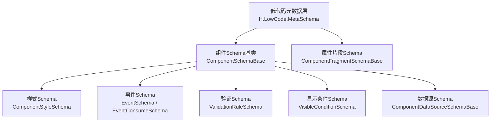
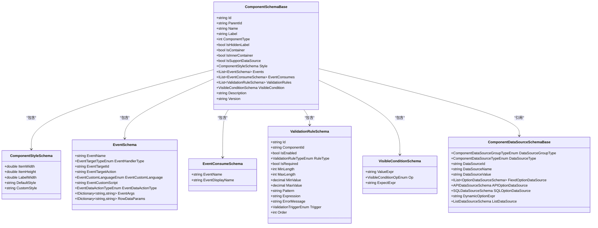
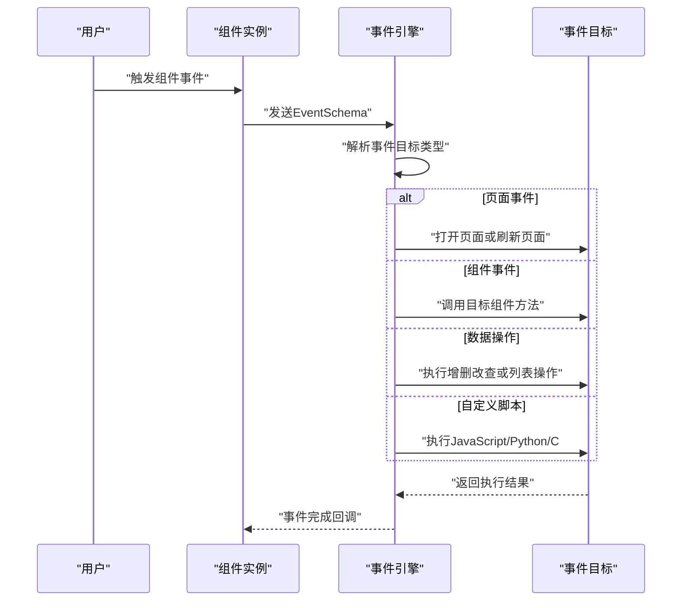
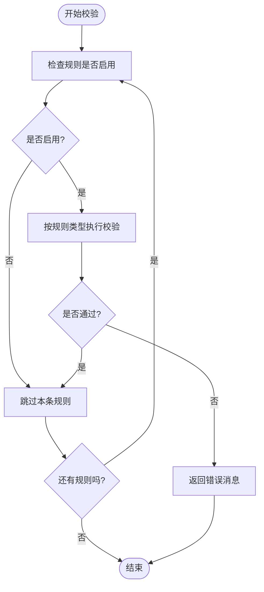
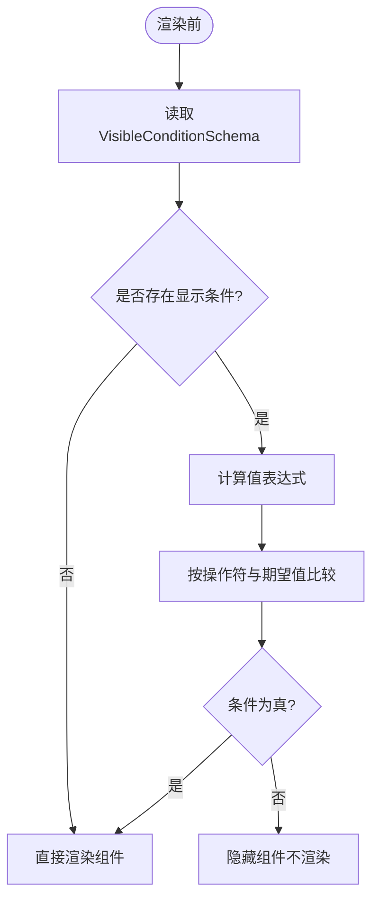
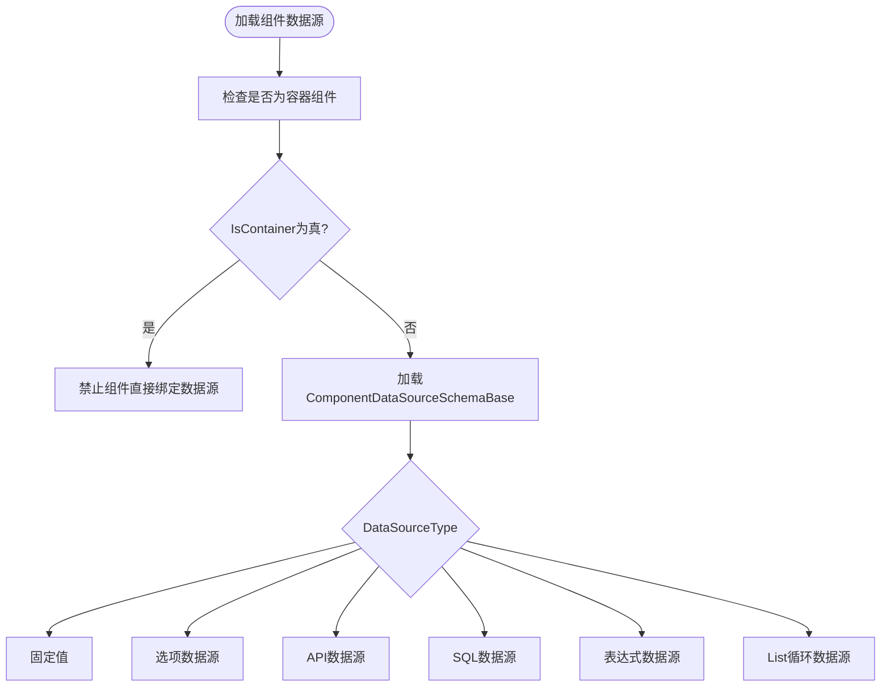
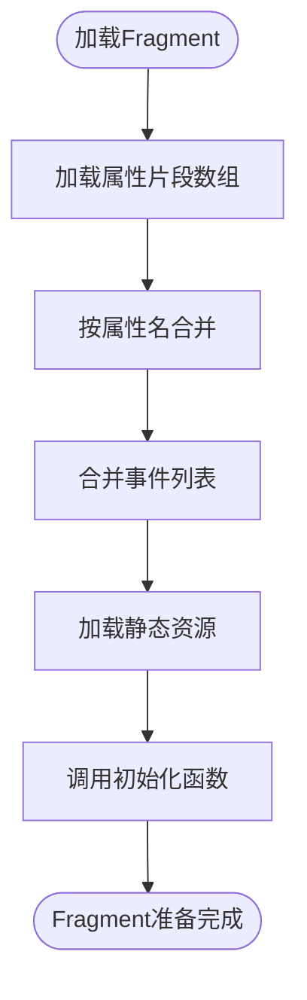
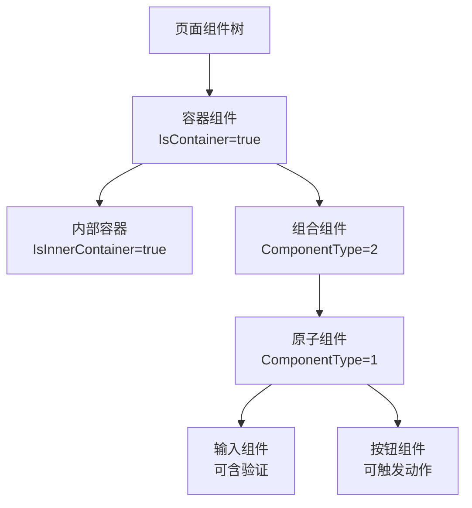
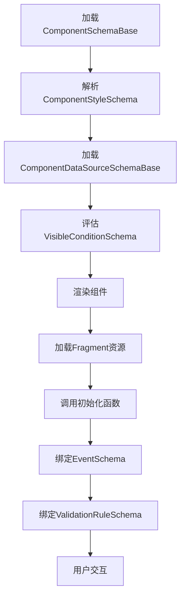
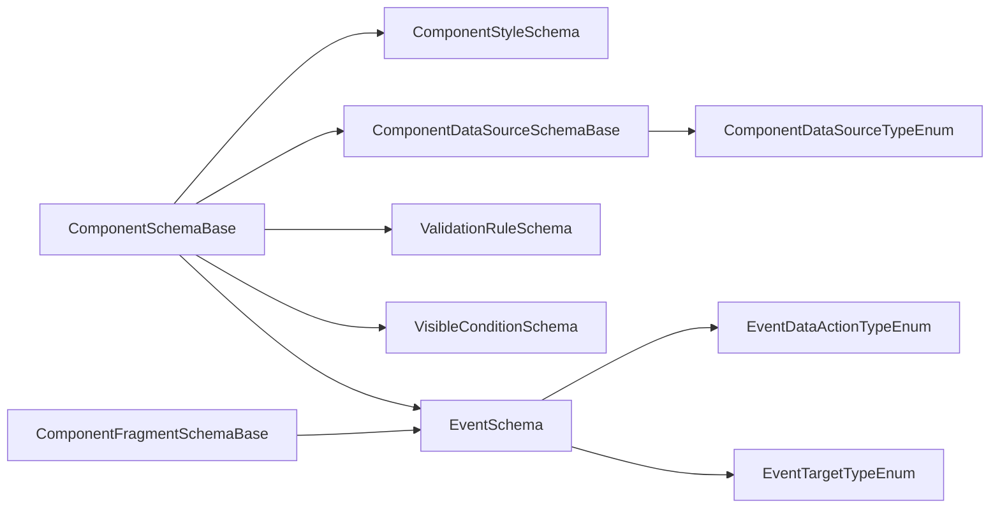

# 组件Schema规范

<cite>
**本文引用的文件**   
- [ComponentSchemaBase.cs](file://src/LowCode/Common/H.LowCode.MetaSchema/ComponentSchemaBase.cs)
- [ComponentStyleSchema.cs](file://src/LowCode/Common/H.LowCode.MetaSchema/PropertySchemas/ComponentStyleSchema.cs)
- [EventSchema.cs](file://src/LowCode/Common/H.LowCode.MetaSchema/PropertySchemas/EventSchema.cs)
- [ValidationRuleSchema.cs](file://src/LowCode/Common/H.LowCode.MetaSchema/PropertySchemas/ValidationRuleSchema.cs)
- [VisibleConditionSchema.cs](file://src/LowCode/Common/H.LowCode.MetaSchema/PropertySchemas/VisibleConditionSchema.cs)
- [ComponentFragmentSchemaBase.cs](file://src/LowCode/Common/H.LowCode.MetaSchema/PropertySchemas/ComponentFragmentSchemaBase.cs)
- [ComponentDataSourceSchemaBase.cs](file://src/LowCode/Common/H.LowCode.MetaSchema/DataSourceSchemas/ComponentDataSourceSchema.cs)
- [ComponentDataSourceTypeEnum.cs](file://src/LowCode/Common/H.LowCode.MetaSchema/Enums/ComponentDataSourceTypeEnum.cs)
- [EventTargetTypeEnum.cs](file://src/LowCode/Common/H.LowCode.MetaSchema/Enums/EventTargetTypeEnum.cs)
- [EventDataActionTypeEnum.cs](file://src/LowCode/Common/H.LowCode.MetaSchema/Enums/EventDataActionTypeEnum.cs)
- [ComponentValueTypeEnum.cs](file://src/LowCode/Common/H.LowCode.MetaSchema/Enums/ComponentValueTypeEnum.cs)
</cite>

## 目录

1. [引言](#引言)
2. [项目结构与定位](#项目结构与定位)
3. [核心概念与总览](#核心概念与总览)
4. [架构总览图](#架构总览图)
5. [基础组件Schema：ComponentSchemaBase](#基础组件schemacomponent schemabase)
6. [样式配置：ComponentStyleSchema](#样式配置componentstyleschema)
7. [事件定义与消费：EventSchema 与 EventConsumeSchema](#事件定义与消费eventschema-与-eventconsumeschema)
8. [验证规则：ValidationRuleSchema](#验证规则validationruleschema)
9. [显示条件：VisibleConditionSchema](#显示条件visibleconditionschema)
10. [数据源与动态控制：ComponentDataSourceSchemaBase](#数据源与动态控制componentdatasourceschemabase)
11. [属性片段与Fragment合并策略](#属性片段与fragment合并策略)
12. [原子组件、组合组件与容器组件](#原子组件组合组件与容器组件)
13. [完整Schema示例](#完整schema示例)
14. [生命周期、事件处理与验证实战流程](#生命周期事件处理与验证实战流程)
15. [依赖关系分析](#依赖关系分析)
16. [性能与扩展建议](#性能与扩展建议)
17. [故障排查指南](#故障排查指南)
18. [结论](#结论)

## 引言

H.AppLab 低代码平台通过一套稳定的组件元数据 Schema 描述页面中的每一个组件。该 Schema 不仅用于设计器编辑，还负责渲染引擎解析、事件分发、验证执行和动态显示控制。本文聚焦于组件 Schema 的核心类型：`ComponentSchemaBase` 及其相关属性 Schema，包括样式、事件、验证、显示条件和数据源，并说明原子组件、组合组件、容器组件的设计差异及 Fragment 的合并机制。

## 项目结构与定位

组件 Schema 位于低代码公共元数据模块中，主要属于 `H.LowCode.MetaSchema` 命名空间。其职责是统一描述组件的结构、行为、样式、事件、校验、显示条件和数据源，而不直接绑定具体 UI 框架实现。

**图示来源**
- [ComponentSchemaBase.cs:1-110](file://src/LowCode/Common/H.LowCode.MetaSchema/ComponentSchemaBase.cs#L1-L110)
- [ComponentStyleSchema.cs:1-38](file://src/LowCode/Common/H.LowCode.MetaSchema/PropertySchemas/ComponentStyleSchema.cs#L1-L38)
- [EventSchema.cs:1-66](file://src/LowCode/Common/H.LowCode.MetaSchema/PropertySchemas/EventSchema.cs#L1-L66)
- [ValidationRuleSchema.cs:1-172](file://src/LowCode/Common/H.LowCode.MetaSchema/PropertySchemas/ValidationRuleSchema.cs#L1-L172)
- [VisibleConditionSchema.cs:1-49](file://src/LowCode/Common/H.LowCode.MetaSchema/PropertySchemas/VisibleConditionSchema.cs#L1-L49)
- [ComponentDataSourceSchemaBase.cs:1-58](file://src/LowCode/Common/H.LowCode.MetaSchema/DataSourceSchemas/ComponentDataSourceSchema.cs#L1-L58)
- [ComponentFragmentSchemaBase.cs:1-82](file://src/LowCode/Common/H.LowCode.MetaSchema/PropertySchemas/ComponentFragmentSchemaBase.cs#L1-L82)

**章节来源**
- [ComponentSchemaBase.cs:1-110](file://src/LowCode/Common/H.LowCode.MetaSchema/ComponentSchemaBase.cs#L1-L110)

## 核心概念与总览

组件 Schema 以“实例化组件”为建模单元，每个组件实例拥有唯一 ID、可选父节点、名称、标签、类型、容器标识、样式、事件、验证规则和显示条件。同时，组件还可以声明是否支持数据源，以及自身的数据源配置。

关键概念如下：

| 概念 | 含义 | 对应字段或结构 |
|---|---|---|
| 组件实例ID | 页面中组件的唯一标识 | `Id` |
| 父子关系 | 组件在页面树中的父节点 | `ParentId` |
| 组件类型 | 原子组件或组合组件 | `ComponentType` |
| 容器组件 | 可包含子组件的布局或业务容器 | `IsContainer` |
| 内部容器 | 容器内部的嵌套容器 | `IsInnerContainer` |
| 样式 | 宽度、高度、标签宽度、默认样式、自定义样式 | `Style` |
| 事件 | 组件对外暴露或绑定的交互行为 | `Events` |
| 事件消费 | 组件对外暴露的事件名与展示名 | `EventConsumes` |
| 验证规则 | 表单或输入类组件的数据校验 | `ValidationRules` |
| 显示条件 | 根据表达式决定组件是否渲染 | `VisibleCondition` |
| 数据源 | 固定值、API、SQL、选项、列表循环等 | `ComponentDataSourceSchemaBase` |

**章节来源**
- [ComponentSchemaBase.cs:1-110](file://src/LowCode/Common/H.LowCode.MetaSchema/ComponentSchemaBase.cs#L1-L110)

## 架构总览图

**图示来源**
- [ComponentSchemaBase.cs:1-110](file://src/LowCode/Common/H.LowCode.MetaSchema/ComponentSchemaBase.cs#L1-L110)
- [ComponentStyleSchema.cs:1-38](file://src/LowCode/Common/H.LowCode.MetaSchema/PropertySchemas/ComponentStyleSchema.cs#L1-L38)
- [EventSchema.cs:1-66](file://src/LowCode/Common/H.LowCode.MetaSchema/PropertySchemas/EventSchema.cs#L1-L66)
- [ValidationRuleSchema.cs:1-172](file://src/LowCode/Common/H.LowCode.MetaSchema/PropertySchemas/ValidationRuleSchema.cs#L1-L172)
- [VisibleConditionSchema.cs:1-49](file://src/LowCode/Common/H.LowCode.MetaSchema/PropertySchemas/VisibleConditionSchema.cs#L1-L49)
- [ComponentDataSourceSchemaBase.cs:1-58](file://src/LowCode/Common/H.LowCode.MetaSchema/DataSourceSchemas/ComponentDataSourceSchema.cs#L1-L58)

## 基础组件Schema：ComponentSchemaBase

`ComponentSchemaBase` 是所有组件元数据的抽象基类，它继承自 `StateHasChangeSchema`，表示组件状态变化时会触发界面刷新。该基类定义了组件实例最核心的通用字段。

### 组件实例ID与父子关系

- `Id`：组件实例唯一标识，序列化键为 `id`。它是页面中组件树的根索引，也是事件目标、验证规则关联、数据源绑定等场景的重要标识。
- `ParentId`：父组件ID，序列化键为 `pid`。为空时表示顶层组件或根节点。

这两个字段共同构成页面组件树的拓扑关系。渲染引擎可根据父子关系构建组件层级，设计器可用于拖拽排序、选择高亮、路径提示和层级预览。

### 组件基本信息

- `Name`：组件逻辑名称，序列化键为 `n`。
- `Label`：组件显示名称，序列化键为 `lb`，常用于设计器面板和属性面板。
- `Description`：组件描述，序列化键为 `desc`，适合用于帮助文档、元数据注册和编辑器提示。
- `Version`：组件Schema版本，默认值为 `0.0.1`，序列化键为 `v`。

### 组件类型与容器标识

- `ComponentType`：组件类型，序列化键为 `ct`。枚举语义为 `1` 表示原子组件，`2` 表示组合组件。
- `IsHiddenLabel`：是否隐藏标题，序列化键为 `hlb`。
- `IsContainer`：是否为容器组件，序列化键为 `container`。
- `IsInnerContainer`：是否为内部容器组件，序列化键为 `incontainer`。

容器组件通常承载其他组件，例如布局容器、卡片容器、表格容器等；内部容器用于容器内部再划分区域，避免单层容器结构过于扁平。

### 数据源支持控制

`IsSupportDataSource` 是一个受控布尔属性：

- 当 `IsContainer` 为真时，读取该属性始终返回 `false`，写入也强制设为 `false`。
- 非容器组件可按正常逻辑设置是否支持数据源。

这意味着：**容器组件本身不直接绑定数据源**，但其子组件仍可各自声明数据源。该设计避免了容器误用数据源导致渲染歧义。

### 样式、事件、验证与显示条件

- `Style`：样式对象，默认创建空样式。
- `Events`：事件定义列表。
- `EventConsumes`：事件消费列表，用于向外部暴露组件事件。
- `ValidationRules`：验证规则列表。
- `VisibleCondition`：显示条件对象。

这些字段共同构成组件的行为元数据，由设计器生成，由渲染引擎消费。

**章节来源**
- [ComponentSchemaBase.cs:1-110](file://src/LowCode/Common/H.LowCode.MetaSchema/ComponentSchemaBase.cs#L1-L110)

## 样式配置：ComponentStyleSchema

`ComponentStyleSchema` 描述组件的基础布局与样式信息。

| 字段 | JSON键 | 类型 | 默认值 | 含义 |
|---|---|---|---|---|
| `ItemWidth` | `itemw` | `double` | `4` | 组件宽度，注释说明有效值为 `4-24`，并与栅格布局配合 |
| `ItemHeight` | `itemh` | `double` | `85` | 组件高度，单位为像素 |
| `LabelWidth` | `labelw` | `double` | `180` | 标签宽度，单位通常为像素 |
| `DefaultStyle` | `dfstl` | `string?` | 空 | 默认样式字符串 |
| `CustomStyle` | `ctstl` | `string?` | 空 | 用户自定义样式字符串 |

### 使用建议

- 栅格系统中，`ItemWidth` 常以 `1-24` 表示列宽比例。
- 表单类组件应同时关注 `LabelWidth`，保证标签与输入对齐。
- `DefaultStyle` 适合组件库统一主题样式。
- `CustomStyle` 适合用户在可视化编辑器中微调外观。

**章节来源**
- [ComponentStyleSchema.cs:1-38](file://src/LowCode/Common/H.LowCode.MetaSchema/PropertySchemas/ComponentStyleSchema.cs#L1-L38)

## 事件定义与消费：EventSchema 与 EventConsumeSchema

事件是低代码组件交互能力的核心。`EventSchema` 描述一个事件如何被触发、传递给谁、执行什么动作；`EventConsumeSchema` 描述组件向外暴露的事件名和展示名。

### EventSchema 字段

| 字段 | JSON键 | 类型 | 含义 |
|---|---|---|---|
| `EventName` | `en` | `string` | 事件名称 |
| `EventHandlerType` | `eht` | `EventTargetTypeEnum` | 事件目标类型 |
| `EventTargetId` | `etid` | `string` | 事件目标ID，如页面ID或组件ID |
| `EventTargetAction` | `eta` | `string` | 事件目标动作 |
| `EventCustomLanguage` | `ecl` | `EventCustomLanguageEnum` | 自定义脚本语言 |
| `EventCustomScript` | `ecs` | `string` | 自定义脚本内容 |
| `EventDataActionType` | `edat` | `EventDataActionTypeEnum` | 数据操作类型 |
| `EventArgs` | 无固定JSON键 | `IDictionary<string, string>` | 事件参数映射 |
| `RowDataParams` | `rowparams` | `IDictionary<string, string>` | 行数据参数映射 |

### 事件目标类型

`EventTargetTypeEnum` 支持以下目标：

| 值 | 含义 |
|---|---|
| `None` | 无目标 |
| `Page` | 打开页面 |
| `Component` | 触发另一个组件 |
| `Data` | 数据操作 |
| `Custom` | 自定义事件 |

### 数据操作类型

`EventDataActionTypeEnum` 提供常见数据操作语义，包括：

| 值 | 含义 |
|---|---|
| `EditRow` | 编辑行 |
| `DeleteRow` | 删除行 |
| `SaveRow` | 保存行 |
| `CancelEdit` | 取消编辑 |
| `AddRow` | 添加行 |
| `RefreshData` | 刷新数据 |
| `MoveUp` | 上移 |
| `MoveDown` | 下移 |
| `CopyRow` | 复制行 |
| `SaveForm` | 收集表单状态写入页面数据源 |
| `SaveList` | List 数据按保存映射持久化 |
| `UpdateRow` | 按事件参数更新当前行字段 |
| `ShowDetail` | 弹窗查看行数据详情 |

### 事件消费

`EventConsumeSchema` 仅包含事件名和展示名，主要用于向调用方暴露组件能力。例如按钮组件可以暴露“点击”事件，供外部页面或其他组件订阅。

**图示来源**
- [EventSchema.cs:1-66](file://src/LowCode/Common/H.LowCode.MetaSchema/PropertySchemas/EventSchema.cs#L1-L66)
- [EventTargetTypeEnum.cs:1-27](file://src/LowCode/Common/H.LowCode.MetaSchema/Enums/EventTargetTypeEnum.cs#L1-L27)
- [EventDataActionTypeEnum.cs:1-23](file://src/LowCode/Common/H.LowCode.MetaSchema/Enums/EventDataActionTypeEnum.cs#L1-L23)

**章节来源**
- [EventSchema.cs:1-66](file://src/LowCode/Common/H.LowCode.MetaSchema/PropertySchemas/EventSchema.cs#L1-L66)
- [EventTargetTypeEnum.cs:1-27](file://src/LowCode/Common/H.LowCode.MetaSchema/Enums/EventTargetTypeEnum.cs#L1-L27)
- [EventDataActionTypeEnum.cs:1-23](file://src/LowCode/Common/H.LowCode.MetaSchema/Enums/EventDataActionTypeEnum.cs#L1-L23)

## 验证规则：ValidationRuleSchema

`ValidationRuleSchema` 用于描述组件输入值的校验规则，尤其适用于表单组件、下拉框、数字输入等需要数据约束的场景。

### 字段说明

| 字段 | JSON键 | 类型 | 含义 |
|---|---|---|---|
| `Id` | `id` | `string` | 校验规则ID |
| `ComponentId` | `cid` | `string` | 关联组件ID |
| `IsEnabled` | `enabled` | `bool` | 是否启用 |
| `RuleType` | `type` | `ValidationRuleTypeEnum` | 校验规则类型 |
| `IsRequired` | `required` | `bool` | 是否必填 |
| `MinLength` | `minlen` | `int?` | 最小长度 |
| `MaxLength` | `maxlen` | `int?` | 最大长度 |
| `MinValue` | `minval` | `decimal?` | 最小值 |
| `MaxValue` | `maxval` | `decimal?` | 最大值 |
| `Pattern` | `pattern` | `string?` | 正则表达式 |
| `Expression` | `expr` | `string?` | 自定义表达式 |
| `ErrorMessage` | `errmsg` | `string?` | 错误消息 |
| `Trigger` | `trigger` | `ValidationTriggerEnum` | 校验触发时机 |
| `Order` | `order` | `int` | 排序 |

### 校验规则类型

| 值 | 含义 |
|---|---|
| `Required` | 必填校验 |
| `MinLength` | 最小长度校验 |
| `MaxLength` | 最大长度校验 |
| `MinValue` | 最小值校验 |
| `MaxValue` | 最大值校验 |
| `Pattern` | 正则表达式校验 |
| `Email` | 邮箱格式校验 |
| `Phone` | 手机号格式校验 |
| `Url` | URL格式校验 |
| `IdCard` | 身份证号格式校验 |
| `Custom` | 自定义表达式校验 |

### 校验触发时机

| 值 | 含义 |
|---|---|
| `Blur` | 失去焦点时校验 |
| `Change` | 值改变时校验 |
| `Submit` | 提交时校验 |

### 执行顺序

多个验证规则可通过 `Order` 控制执行顺序。渲染引擎应在触发校验时按顺序执行，并在遇到错误时返回对应 `ErrorMessage`。

**图示来源**
- [ValidationRuleSchema.cs:1-172](file://src/LowCode/Common/H.LowCode.MetaSchema/PropertySchemas/ValidationRuleSchema.cs#L1-L172)

**章节来源**
- [ValidationRuleSchema.cs:1-172](file://src/LowCode/Common/H.LowCode.MetaSchema/PropertySchemas/ValidationRuleSchema.cs#L1-L172)

## 显示条件：VisibleConditionSchema

`VisibleConditionSchema` 控制组件是否在运行时渲染。只有条件求值为真时，组件才会出现在页面中。这适用于问题联动、角色权限控制、字段分支渲染等场景。

### 字段说明

| 字段 | JSON键 | 类型 | 含义 |
|---|---|---|---|
| `ValueExpr` | `vexpr` | `string?` | 值来源表达式 |
| `Op` | `op` | `VisibleConditionOpEnum` | 比较操作符 |
| `ExpectExpr` | `eexpr` | `string?` | 期望值表达式 |

### 支持的操作符

| 值 | 含义 |
|---|---|
| `Equals` | 等于 |
| `NotEquals` | 不等于 |
| `Contains` | 包含 |
| `NotEmpty` | 非空 |
| `IsEmpty` | 为空 |
| `In` | 值在期望值列表中，期望值为逗号分隔列表 |

### 表达式能力

注释说明 `ValueExpr` 与 `ExpectExpr` 均支持表达式，例如：

- `$(item.f_x)`
- `$(form.key)`
- `$(form[...])`
- `$query(x)`

这意味着显示条件不是简单静态判断，而是基于运行时上下文进行表达式求值。

**图示来源**
- [VisibleConditionSchema.cs:1-49](file://src/LowCode/Common/H.LowCode.MetaSchema/PropertySchemas/VisibleConditionSchema.cs#L1-L49)

**章节来源**
- [VisibleConditionSchema.cs:1-49](file://src/LowCode/Common/H.LowCode.MetaSchema/PropertySchemas/VisibleConditionSchema.cs#L1-L49)

## 数据源与动态控制：ComponentDataSourceSchemaBase

组件数据源由 `ComponentDataSourceSchemaBase` 描述，它继承自 `StateHasChangeSchema`，表示数据源变化也会触发界面刷新。该基类支持多种数据源类型，并通过枚举统一控制。

### 核心字段

| 字段 | JSON键 | 类型 | 含义 |
|---|---|---|---|
| `DataSourceGroupType` | `dsgt` | `ComponentDataSourceGroupTypeEnum` | 数据源分组类型 |
| `DataSourceType` | `dst` | `ComponentDataSourceTypeEnum` | 数据源类型 |
| `DataSourceId` | `dsid` | `string?` | 数据源ID |
| `DataSourceName` | `dsn` | `string?` | 数据源名称 |
| `DataSourceValue` | `dsv` | `string?` | 数据源值 |
| `FiexdOptionDataSource` | `fxopds` | `IList<OptionDataSourceSchema>?` | 固定选项数据源 |
| `APIOptionDataSource` | `apiopds` | `APIDataSourceSchema?` | API选项数据源 |
| `SQLOptionDataSource` | `sqlopds` | `SQLDataSourceSchema?` | SQL选项数据源 |
| `DynamicOptionExpr` | `dynopexpr` | `string?` | 动态选项表达式 |
| `ListDataSource` | `listds` | `ListDataSourceSchema?` | List 循环数据源配置 |

### 数据源类型

`ComponentDataSourceTypeEnum` 支持以下类型：

| 值 | 含义 |
|---|---|
| `None` | 无数据源 |
| `DB` | 数据库 |
| `API` | API |
| `Option` | 选项 |
| `SQL` | SQL |
| `Expression` | 表达式 |
| `Fiexd` | 固定值 |

### 动态选项表达式

`DynamicOptionExpr` 允许运行时从字段值解析选项。注释示例表明，表达式结果可按换行拆分为选项。这使得组件选项可以在不修改Schema的情况下动态变化。

### 容器组件与数据源的关系

结合 `ComponentSchemaBase.IsSupportDataSource` 的逻辑，容器组件不支持直接绑定数据源。但容器内的子组件可以各自绑定自己的数据源。因此，数据源的动态控制主要在非容器组件上生效。

**图示来源**
- [ComponentSchemaBase.cs:1-110](file://src/LowCode/Common/H.LowCode.MetaSchema/ComponentSchemaBase.cs#L1-L110)
- [ComponentDataSourceSchemaBase.cs:1-58](file://src/LowCode/Common/H.LowCode.MetaSchema/DataSourceSchemas/ComponentDataSourceSchema.cs#L1-L58)
- [ComponentDataSourceTypeEnum.cs:1-15](file://src/LowCode/Common/H.LowCode.MetaSchema/Enums/ComponentDataSourceTypeEnum.cs#L1-L15)

**章节来源**
- [ComponentDataSourceSchemaBase.cs:1-58](file://src/LowCode/Common/H.LowCode.MetaSchema/DataSourceSchemas/ComponentDataSourceSchema.cs#L1-L58)
- [ComponentDataSourceTypeEnum.cs:1-15](file://src/LowCode/Common/H.LowCode.MetaSchema/Enums/ComponentDataSourceTypeEnum.cs#L1-L15)
- [ComponentSchemaBase.cs:1-110](file://src/LowCode/Common/H.LowCode.MetaSchema/ComponentSchemaBase.cs#L1-L110)

## 属性片段与Fragment合并策略

`ComponentFragmentSchemaBase` 是组件属性片段的抽象基类，用于描述组件属性的结构化片段，包括属性名、CLR类型、属性值、内容、事件和静态资源依赖。

### 字段说明

| 字段 | JSON键 | 类型 | 含义 |
|---|---|---|---|
| `TypeName` | `t` | `string?` | 组件类型名 |
| `ValueType` | `valt` | `string?` | 值类型 |
| `Attributes` | `attrs` | `ComponentAttributeFragmentSchema[]` | 属性片段数组 |
| `Content` | `content` | `string?` | 片段内容 |
| `Events` | `evs` | `IList<EventSchema>?` | 片段内事件 |
| `Resources` | `res` | `ResourceItemSchema[]?` | 静态资源依赖 |
| `InitFunction` | `init` | `string?` | 初始化函数名 |

### 属性片段结构

`ComponentAttributeFragmentSchema` 描述单个属性片段：

| 字段 | JSON键 | 类型 | 含义 |
|---|---|---|---|
| `AttributeName` | `attrn` | `string?` | 属性名 |
| `AttributeClrType` | `attrt` | `string?` | CLR类型 |
| `AttributeValue` | `attrv` | `object?` | 属性值 |

### 静态资源与初始化

`ResourceItemSchema` 描述静态资源项：

| 字段 | JSON键 | 类型 | 含义 |
|---|---|---|---|
| `Type` | `t` | `string?` | 资源类型，如 `css` 或 `js` |
| `Url` | `url` | `string?` | 资源地址，支持外部URL、内容路径或上传文件访问地址 |

`InitFunction` 表示资源加载完成后调用的初始化函数名，渲染引擎应以挂载点ID和组件选项作为参数调用该函数。

### 默认值获取

`GetDefaultValue()` 根据 `ValueType` 的类型名反射获取默认值。若未设置类型，则返回空。

### Fragment 合并策略说明

虽然代码中未直接给出完整的 Fragment 合并算法实现，但从数据结构可以看出：

1. 每个 Fragment 可包含一组属性片段。
2. 属性片段包含属性名、CLR类型和属性值。
3. Fragment 可携带事件和资源依赖。
4. 渲染引擎在加载组件时，应按顺序加载资源，然后调用初始化函数。
5. 属性转换时应将 JSON 属性值转换为目标 CLR 类型。

推荐合并策略：

- 按属性名去重。
- 后定义的 Fragment 覆盖先定义的 Fragment。
- 类型不一致时优先保留强类型值。
- 事件列表合并时保留重复事件名，由上层决定优先级。
- 资源列表按顺序加载，避免重复加载同一资源。

**图示来源**
- [ComponentFragmentSchemaBase.cs:1-82](file://src/LowCode/Common/H.LowCode.MetaSchema/PropertySchemas/ComponentFragmentSchemaBase.cs#L1-L82)

**章节来源**
- [ComponentFragmentSchemaBase.cs:1-82](file://src/LowCode/Common/H.LowCode.MetaSchema/PropertySchemas/ComponentFragmentSchemaBase.cs#L1-L82)

## 原子组件、组合组件与容器组件

### 原子组件

原子组件是不可再分的UI基础组件，例如文本、图片、按钮、输入框等。它们通常：

- `ComponentType` 为 `1`。
- 不一定支持数据源。
- 可能包含验证规则和事件。
- 不需要 `IsContainer`。

### 组合组件

组合组件是由多个原子组件或子组合组件构成的业务组件，例如搜索表单、统计卡片、订单摘要等。它们通常：

- `ComponentType` 为 `2`。
- 可能包含子组件树。
- 可暴露事件供外部调用。
- 可组合多个数据源或只消费父级数据。

### 容器组件

容器组件主要用于布局和组织子组件，例如页面容器、卡片、表格容器、表单容器等。它们的特点：

- `IsContainer` 为真。
- 不直接支持数据源。
- 子组件可独立绑定数据源。
- 可能设置 `IsInnerContainer` 表示内部嵌套容器。

### 三类组件的关系

**图示来源**
- [ComponentSchemaBase.cs:1-110](file://src/LowCode/Common/H.LowCode.MetaSchema/ComponentSchemaBase.cs#L1-L110)

**章节来源**
- [ComponentSchemaBase.cs:1-110](file://src/LowCode/Common/H.LowCode.MetaSchema/ComponentSchemaBase.cs#L1-L110)

## 完整Schema示例

以下示例以文字形式描述不同类型组件的Schema结构，便于理解字段组合方式。实际JSON字段名应与源码中的 `JsonPropertyName` 一致。

### 文本输入组件示例

- `id`：唯一组件ID。
- `pid`：父组件ID。
- `n`：组件名称。
- `lb`：显示标签。
- `ct`：组件类型为原子组件。
- `container`：不为容器。
- `sptds`：是否支持数据源，取决于组件能力。
- `stl.itemw`：栅格宽度。
- `stl.itemh`：高度。
- `stl.labelw`：标签宽度。
- `evs`：可能包含失焦、变更等事件。
- `valrules`：必填、长度、正则等验证规则。
- `vcond`：显示条件。

### 按钮组件示例

- `id`：按钮ID。
- `ct`：原子组件。
- `container`：不为容器。
- `evs`：点击事件，目标可为页面、组件或数据操作。
- `evt.targettype`：事件目标类型。
- `evt.targetid`：目标组件或页面ID。
- `evt.action`：目标动作。
- `evt.dataactiontype`：数据操作类型，如保存、刷新、删除。

### 组合组件示例

- `id`：组合组件ID。
- `ct`：组合组件。
- `container`：可能为容器。
- `children`：由上层页面Schema组织，不在单组件Schema内。
- `evs`：组合组件可聚合子组件事件并向上暴露。
- `evcs`：事件消费列表，用于向外部暴露事件。

### 容器组件示例

- `id`：容器ID。
- `container`：为容器。
- `incontainer`：可为内部容器。
- `sptds`：强制为不支持数据源。
- `stl.itemw`：容器宽度。
- `stl.itemh`：容器高度。
- 子组件通过页面Schema的父子关系组织。

### 带数据源的下拉组件示例

- `id`：下拉组件ID。
- `ct`：原子组件。
- `sptds`：支持数据源。
- `dsgt`：数据源分组类型。
- `dst`：数据源类型，如选项、API、SQL、表达式。
- `dsv`：固定值或表达式。
- `fxopds`：固定选项。
- `apiopds`：API选项数据源。
- `sqlopds`：SQL选项数据源。
- `dynopexpr`：动态选项表达式。
- `listds`：List循环数据源。

注意：上述示例仅描述字段组合，不展开完整JSON文本。

**章节来源**
- [ComponentSchemaBase.cs:1-110](file://src/LowCode/Common/H.LowCode.MetaSchema/ComponentSchemaBase.cs#L1-L110)
- [ComponentDataSourceSchemaBase.cs:1-58](file://src/LowCode/Common/H.LowCode.MetaSchema/DataSourceSchemas/ComponentDataSourceSchema.cs#L1-L58)

## 生命周期、事件处理与验证实战流程

### 组件渲染生命周期

组件在渲染过程中的关键阶段包括：

1. 加载组件Schema。
2. 解析样式。
3. 解析数据源。
4. 评估显示条件。
5. 渲染组件DOM或Blazor节点。
6. 加载Fragment资源。
7. 调用初始化函数。
8. 绑定事件。
9. 绑定验证规则。
10. 响应用户交互。

**图示来源**
- [ComponentSchemaBase.cs:1-110](file://src/LowCode/Common/H.LowCode.MetaSchema/ComponentSchemaBase.cs#L1-L110)
- [ComponentStyleSchema.cs:1-38](file://src/LowCode/Common/H.LowCode.MetaSchema/PropertySchemas/ComponentStyleSchema.cs#L1-L38)
- [ComponentDataSourceSchemaBase.cs:1-58](file://src/LowCode/Common/H.LowCode.MetaSchema/DataSourceSchemas/ComponentDataSourceSchema.cs#L1-L58)
- [VisibleConditionSchema.cs:1-49](file://src/LowCode/Common/H.LowCode.MetaSchema/PropertySchemas/VisibleConditionSchema.cs#L1-L49)
- [ComponentFragmentSchemaBase.cs:1-82](file://src/LowCode/Common/H.LowCode.MetaSchema/PropertySchemas/ComponentFragmentSchemaBase.cs#L1-L82)
- [EventSchema.cs:1-66](file://src/LowCode/Common/H.LowCode.MetaSchema/PropertySchemas/EventSchema.cs#L1-L66)
- [ValidationRuleSchema.cs:1-172](file://src/LowCode/Common/H.LowCode.MetaSchema/PropertySchemas/ValidationRuleSchema.cs#L1-L172)

### 事件处理实战

假设有一个“保存”按钮，点击后应保存表单数据并刷新列表：

1. 按钮组件的 `Events` 中定义点击事件。
2. `EventHandlerType` 为数据操作。
3. `EventDataActionType` 为保存表单或保存列表。
4. `EventTargetId` 指向目标组件或页面。
5. `EventArgs` 传入必要参数。
6. 渲染引擎根据事件类型执行对应动作。

### 验证规则实战

假设有一个邮箱输入框：

1. 添加一条必填规则。
2. 添加一条邮箱格式规则。
3. 设置 `Trigger` 为失焦或变更。
4. 设置 `ErrorMessage` 提示用户。
5. 用户输入无效邮箱时，渲染引擎阻止提交并显示错误。

### 显示条件实战

假设一个高级搜索字段只在特定模式下显示：

1. 设置 `VisibleCondition.ValueExpr` 为模式字段表达式。
2. 设置 `Op` 为等于。
3. 设置 `VisibleCondition.ExpectExpr` 为高级模式值。
4. 当模式不匹配时，组件不渲染。

**章节来源**
- [EventSchema.cs:1-66](file://src/LowCode/Common/H.LowCode.MetaSchema/PropertySchemas/EventSchema.cs#L1-L66)
- [ValidationRuleSchema.cs:1-172](file://src/LowCode/Common/H.LowCode.MetaSchema/PropertySchemas/ValidationRuleSchema.cs#L1-L172)
- [VisibleConditionSchema.cs:1-49](file://src/LowCode/Common/H.LowCode.MetaSchema/PropertySchemas/VisibleConditionSchema.cs#L1-L49)

## 依赖关系分析

组件Schema之间的依赖关系如下：

- `ComponentSchemaBase` 依赖样式、事件、验证、显示条件和数据源。
- `EventSchema` 依赖事件目标类型和数据操作类型枚举。
- `ValidationRuleSchema` 依赖校验规则类型和触发时机枚举。
- `VisibleConditionSchema` 依赖显示条件操作符枚举。
- `ComponentDataSourceSchemaBase` 依赖数据源类型枚举。
- `ComponentFragmentSchemaBase` 依赖属性片段结构和资源结构。

**图示来源**
- [ComponentSchemaBase.cs:1-110](file://src/LowCode/Common/H.LowCode.MetaSchema/ComponentSchemaBase.cs#L1-L110)
- [EventSchema.cs:1-66](file://src/LowCode/Common/H.LowCode.MetaSchema/PropertySchemas/EventSchema.cs#L1-L66)
- [ValidationRuleSchema.cs:1-172](file://src/LowCode/Common/H.LowCode.MetaSchema/PropertySchemas/ValidationRuleSchema.cs#L1-L172)
- [VisibleConditionSchema.cs:1-49](file://src/LowCode/Common/H.LowCode.MetaSchema/PropertySchemas/VisibleConditionSchema.cs#L1-L49)
- [ComponentDataSourceSchemaBase.cs:1-58](file://src/LowCode/Common/H.LowCode.MetaSchema/DataSourceSchemas/ComponentDataSourceSchema.cs#L1-L58)
- [ComponentFragmentSchemaBase.cs:1-82](file://src/LowCode/Common/H.LowCode.MetaSchema/PropertySchemas/ComponentFragmentSchemaBase.cs#L1-L82)
- [EventTargetTypeEnum.cs:1-27](file://src/LowCode/Common/H.LowCode.MetaSchema/Enums/EventTargetTypeEnum.cs#L1-L27)
- [EventDataActionTypeEnum.cs:1-23](file://src/LowCode/Common/H.LowCode.MetaSchema/Enums/EventDataActionTypeEnum.cs#L1-L23)
- [ComponentDataSourceTypeEnum.cs:1-15](file://src/LowCode/Common/H.LowCode.MetaSchema/Enums/ComponentDataSourceTypeEnum.cs#L1-L15)

**章节来源**
- [ComponentSchemaBase.cs:1-110](file://src/LowCode/Common/H.LowCode.MetaSchema/ComponentSchemaBase.cs#L1-L110)
- [EventSchema.cs:1-66](file://src/LowCode/Common/H.LowCode.MetaSchema/PropertySchemas/EventSchema.cs#L1-L66)
- [ValidationRuleSchema.cs:1-172](file://src/LowCode/Common/H.LowCode.MetaSchema/PropertySchemas/ValidationRuleSchema.cs#L1-L172)
- [VisibleConditionSchema.cs:1-49](file://src/LowCode/Common/H.LowCode.MetaSchema/PropertySchemas/VisibleConditionSchema.cs#L1-L49)
- [ComponentDataSourceSchemaBase.cs:1-58](file://src/LowCode/Common/H.LowCode.MetaSchema/DataSourceSchemas/ComponentDataSourceSchema.cs#L1-L58)
- [ComponentFragmentSchemaBase.cs:1-82](file://src/LowCode/Common/H.LowCode.MetaSchema/PropertySchemas/ComponentFragmentSchemaBase.cs#L1-L82)

## 性能与扩展建议

### 性能建议

1. **减少不必要的渲染**：合理使用 `VisibleConditionSchema`，避免渲染大量隐藏组件。
2. **限制验证规则数量**：复杂表单应避免过多自定义表达式校验，以免频繁求值影响交互体验。
3. **数据源缓存**：对于静态选项数据源，应缓存结果，避免每次渲染都请求API或SQL。
4. **事件批量处理**：高频事件应做防抖或节流处理。
5. **Fragment资源按需加载**：只加载当前组件所需的JS和CSS。

### 扩展建议

1. 新增校验类型时，扩展 `ValidationRuleTypeEnum`。
2. 新增事件目标类型时，扩展 `EventTargetTypeEnum`。
3. 新增数据源类型时，扩展 `ComponentDataSourceTypeEnum`。
4. 新增显示条件操作符时，扩展 `VisibleConditionOpEnum`。
5. 新增属性值类型时，扩展 `ComponentValueTypeEnum`。
6. 对容器组件的数据源支持应保持谨慎，避免破坏容器语义。

## 故障排查指南

### 组件无法显示

可能原因：

- `VisibleCondition` 条件为假。
- 父组件未渲染。
- `ParentId` 指向不存在组件。
- 组件被容器隐藏。

排查步骤：

1. 检查 `VisibleConditionSchema` 的表达式和比较操作符。
2. 检查页面组件树中父组件是否存在。
3. 检查 `Id` 与 `ParentId` 是否匹配。

**章节来源**
- [VisibleConditionSchema.cs:1-49](file://src/LowCode/Common/H.LowCode.MetaSchema/PropertySchemas/VisibleConditionSchema.cs#L1-L49)
- [ComponentSchemaBase.cs:1-110](file://src/LowCode/Common/H.LowCode.MetaSchema/ComponentSchemaBase.cs#L1-L110)

### 事件未触发

可能原因：

- 事件目标类型配置错误。
- 事件目标ID不存在。
- 事件参数缺失。
- 目标组件未订阅事件。

排查步骤：

1. 检查 `EventSchema.EventHandlerType`。
2. 检查 `EventTargetId`。
3. 检查 `EventArgs` 是否传参。
4. 检查目标组件是否暴露对应事件消费。

**章节来源**
- [EventSchema.cs:1-66](file://src/LowCode/Common/H.LowCode.MetaSchema/PropertySchemas/EventSchema.cs#L1-L66)
- [EventTargetTypeEnum.cs:1-27](file://src/LowCode/Common/H.LowCode.MetaSchema/Enums/EventTargetTypeEnum.cs#L1-L27)

### 验证不生效

可能原因：

- 规则未启用。
- 触发时机配置不当。
- 校验规则类型与字段不匹配。
- 自定义表达式语法错误。

排查步骤：

1. 检查 `IsEnabled`。
2. 检查 `Trigger`。
3. 检查 `RuleType`。
4. 检查 `Expression` 或 `Pattern`。

**章节来源**
- [ValidationRuleSchema.cs:1-172](file://src/LowCode/Common/H.LowCode.MetaSchema/PropertySchemas/ValidationRuleSchema.cs#L1-L172)

### 数据源不加载

可能原因：

- 容器组件尝试绑定数据源。
- 数据源类型未正确配置。
- 动态选项表达式返回空或格式不正确。
- API或SQL数据源连接失败。

排查步骤：

1. 确认组件不是容器组件。
2. 检查 `DataSourceType`。
3. 检查 `DynamicOptionExpr`。
4. 检查后端服务可用性。

**章节来源**
- [ComponentSchemaBase.cs:1-110](file://src/LowCode/Common/H.LowCode.MetaSchema/ComponentSchemaBase.cs#L1-L110)
- [ComponentDataSourceSchemaBase.cs:1-58](file://src/LowCode/Common/H.LowCode.MetaSchema/DataSourceSchemas/ComponentDataSourceSchema.cs#L1-L58)

## 结论

H.AppLab 低代码平台的组件Schema以 `ComponentSchemaBase` 为核心，围绕样式、事件、验证、显示条件和数据源构建了完整的组件元数据模型。该模型既支持简单原子组件，也支持复杂组合组件和容器组件；既能表达静态配置，也能驱动运行时动态行为。

在实际使用中，应重点关注：

- 组件ID与父子关系的正确性。
- 容器组件不直接绑定数据源。
- 事件目标类型与目标ID的准确性。
- 验证规则的触发时机和错误消息。
- 显示条件的表达式语义。
- Fragment资源的加载顺序和初始化函数调用。

这套Schema规范为设计器、渲染引擎、事件系统、验证系统和数据源系统提供了统一的契约，是低代码平台可扩展性的基础。