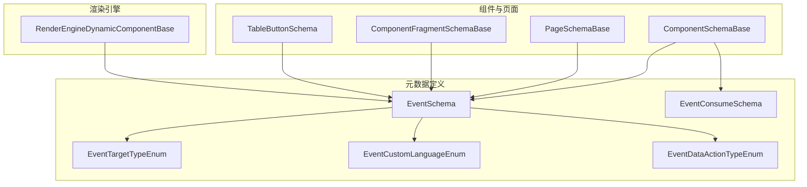
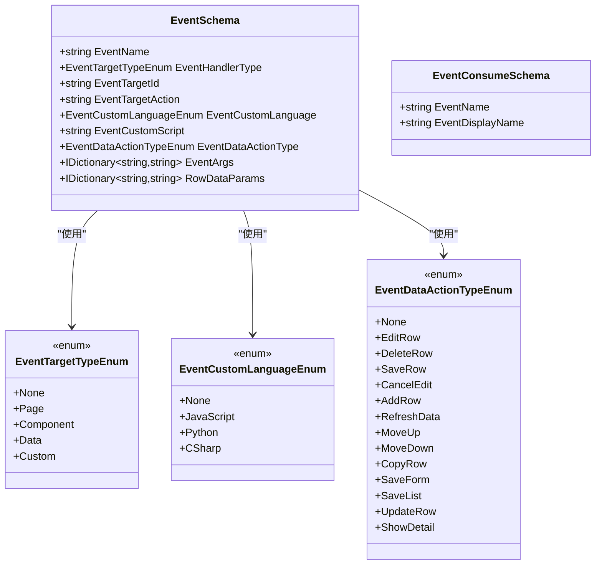
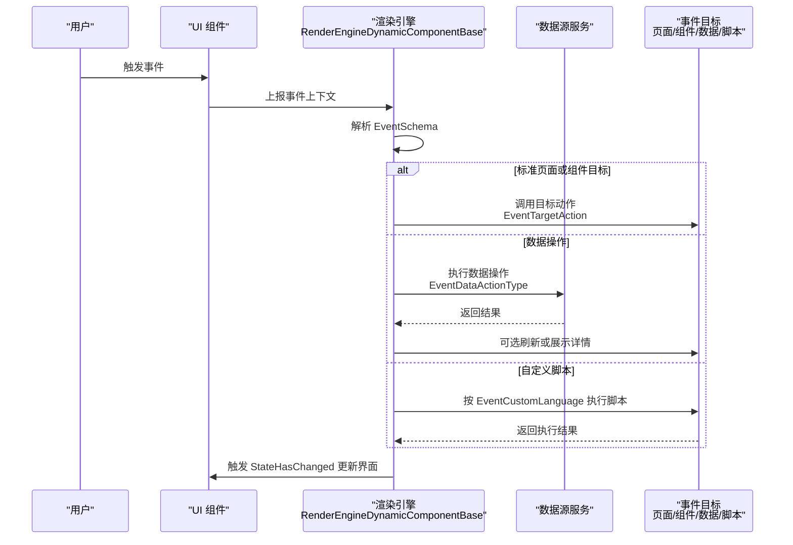
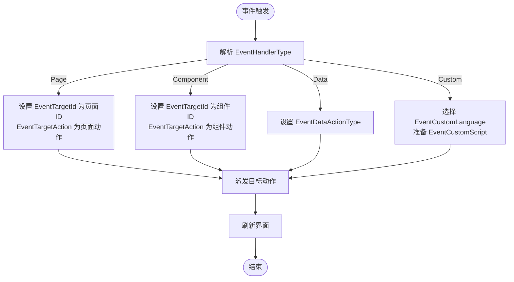
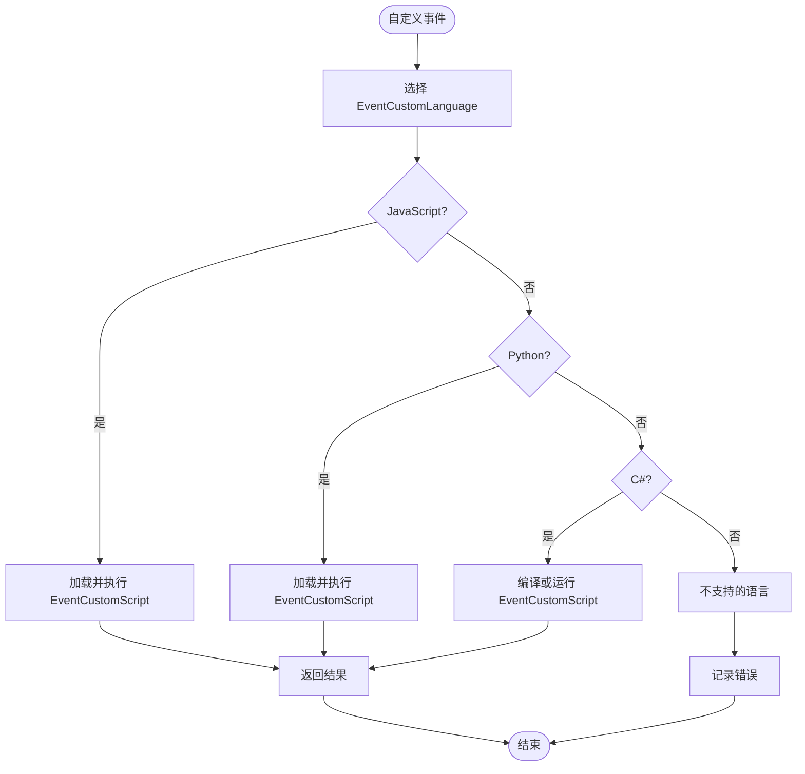
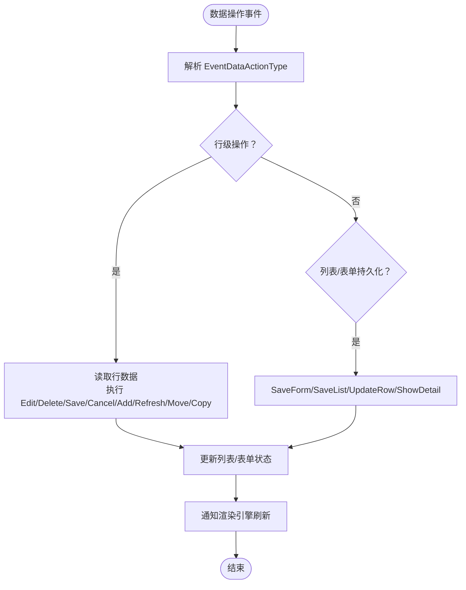
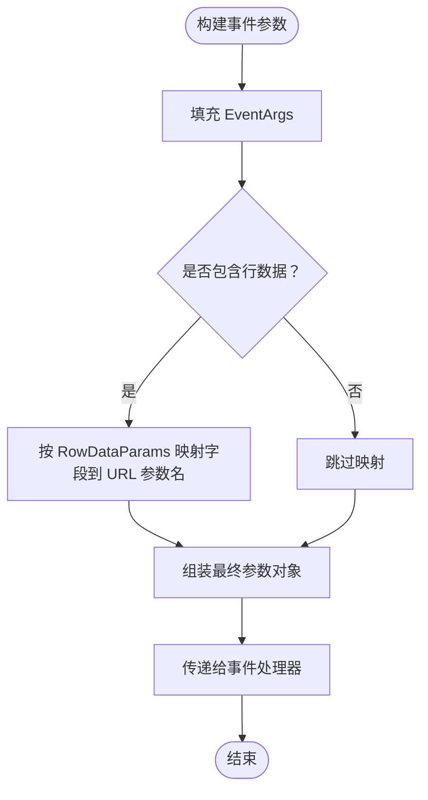
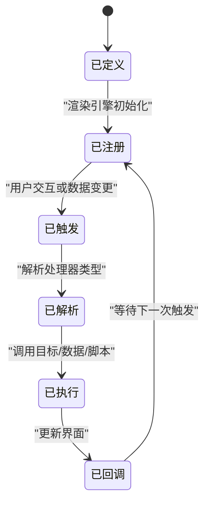
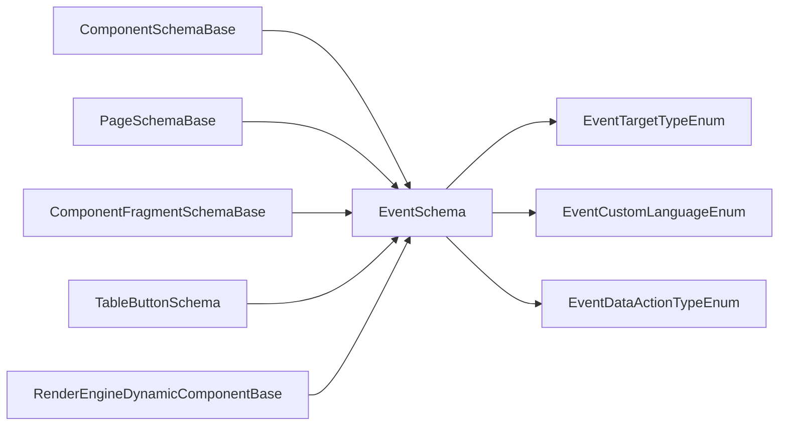

# 组件事件Schema

<cite>
**本文引用的文件**   
- [EventSchema.cs](file://src/LowCode/Common/H.LowCode.MetaSchema/PropertySchemas/EventSchema.cs)
- [EventTargetTypeEnum.cs](file://src/LowCode/Common/H.LowCode.MetaSchema/Enums/EventTargetTypeEnum.cs)
- [EventDataActionTypeEnum.cs](file://src/LowCode/Common/H.LowCode.MetaSchema/Enums/EventDataActionTypeEnum.cs)
- [ComponentSchemaBase.cs](file://src/LowCode/Common/H.LowCode.MetaSchema/ComponentSchemaBase.cs)
- [PageSchemaBase.cs](file://src/LowCode/Common/H.LowCode.MetaSchema/PageSchemaBase.cs)
- [ComponentFragmentSchemaBase.cs](file://src/LowCode/Common/H.LowCode.MetaSchema/PropertySchemas/ComponentFragmentSchemaBase.cs)
- [TableButtonSchema.cs](file://src/LowCode/Common/H.LowCode.MetaSchema/PropertySchemas/TableSchemas/TableButtonSchema.cs)
- [RenderEngineDynamicComponentBase.cs](file://src/LowCode/RenderEngine/H.LowCode.RenderEngineBase/RenderEngineDynamicComponentBase.cs)
</cite>

## 目录
1. [引言](#引言)
2. [项目结构中的事件定义位置](#项目结构中的事件定义位置)
3. [核心概念与数据模型](#核心概念与数据模型)
4. [架构总览：事件从定义到执行](#架构总览事件从定义到执行)
5. [详细组件分析](#详细组件分析)
6. [依赖关系分析](#依赖关系分析)
7. [性能与稳定性考虑](#性能与稳定性考虑)
8. [故障排查指南](#故障排查指南)
9. [结论](#结论)
10. [附录：完整事件定义示例与使用场景](#附录完整事件定义示例与使用场景)

## 引言
本文面向 H.AppLab 低代码平台的“组件事件 Schema”，目标是帮助开发者理解 EventSchema 的事件定义体系，包括事件名称、处理器类型、标准事件目标通信机制、自定义脚本语言支持、数据操作事件类型、事件参数传递、行数据参数映射，以及事件消费定义 EventConsumeSchema。文档同时给出架构图、流程图和典型使用场景，便于设计器配置、渲染引擎执行和运行时排错。

## 项目结构中的事件定义位置
事件相关元数据集中在 LowCode MetaSchema 层，并由设计器和渲染引擎共同消费：
- 事件本体定义：EventSchema、EventConsumeSchema
- 事件处理器类型枚举：EventTargetTypeEnum、EventCustomLanguageEnum
- 数据操作事件枚举：EventDataActionTypeEnum
- 组件与页面 Schema 挂载事件列表：ComponentSchemaBase、PageSchemaBase
- 片段级事件挂载：ComponentFragmentSchemaBase、TableButtonSchema
- 渲染引擎动态组件基类：RenderEngineDynamicComponentBase（负责订阅表单状态、列表数据变化并驱动 UI 更新）

**图表来源**
- [EventSchema.cs:1-66](file://src/LowCode/Common/H.LowCode.MetaSchema/PropertySchemas/EventSchema.cs#L1-L66)
- [EventTargetTypeEnum.cs:1-27](file://src/LowCode/Common/H.LowCode.MetaSchema/Enums/EventTargetTypeEnum.cs#L1-L27)
- [EventDataActionTypeEnum.cs:1-23](file://src/LowCode/Common/H.LowCode.MetaSchema/Enums/EventDataActionTypeEnum.cs#L1-L23)
- [ComponentSchemaBase.cs:1-110](file://src/LowCode/Common/H.LowCode.MetaSchema/ComponentSchemaBase.cs#L1-L110)
- [PageSchemaBase.cs:1-40](file://src/LowCode/Common/H.LowCode.MetaSchema/PageSchemaBase.cs#L1-L40)
- [ComponentFragmentSchemaBase.cs:1-82](file://src/LowCode/Common/H.LowCode.MetaSchema/PropertySchemas/ComponentFragmentSchemaBase.cs#L1-L82)
- [TableButtonSchema.cs:1-48](file://src/LowCode/Common/H.LowCode.MetaSchema/PropertySchemas/TableSchemas/TableButtonSchema.cs#L1-L48)
- [RenderEngineDynamicComponentBase.cs:1-200](file://src/LowCode/RenderEngine/H.LowCode.RenderEngineBase/RenderEngineDynamicComponentBase.cs#L1-L200)

**章节来源**
- [EventSchema.cs:1-66](file://src/LowCode/Common/H.LowCode.MetaSchema/PropertySchemas/EventSchema.cs#L1-L66)
- [ComponentSchemaBase.cs:1-110](file://src/LowCode/Common/H.LowCode.MetaSchema/ComponentSchemaBase.cs#L1-L110)
- [PageSchemaBase.cs:1-40](file://src/LowCode/Common/H.LowCode.MetaSchema/PageSchemaBase.cs#L1-L40)
- [ComponentFragmentSchemaBase.cs:1-82](file://src/LowCode/Common/H.LowCode.MetaSchema/PropertySchemas/ComponentFragmentSchemaBase.cs#L1-L82)
- [TableButtonSchema.cs:1-48](file://src/LowCode/Common/H.LowCode.MetaSchema/PropertySchemas/TableSchemas/TableButtonSchema.cs#L1-L48)
- [RenderEngineDynamicComponentBase.cs:1-200](file://src/LowCode/RenderEngine/H.LowCode.RenderEngineBase/RenderEngineDynamicComponentBase.cs#L1-L200)

## 核心概念与数据模型
### EventSchema：事件定义的核心
EventSchema 是单个事件的完整描述，包含以下关键维度：
- 事件名称：EventName，用于标识一个具体事件。
- 事件处理器类型：EventHandlerType，表示该事件由哪类目标处理，例如页面、组件、数据操作或自定义逻辑。
- 标准事件目标：
  - EventTargetId：目标实例的 ID，如页面 ID 或组件 ID。
  - EventTargetAction：目标动作，如打开页面、刷新、弹窗等。
- 自定义事件：
  - EventCustomLanguage：脚本语言，当前支持 JavaScript、Python、C#。
  - EventCustomScript：脚本内容字符串，供对应语言环境执行。
- 数据操作事件：
  - EventDataActionType：如编辑行、删除行、保存行、取消编辑、新增行、刷新数据、上移/下移/复制行、保存表单、保存列表、更新行字段、查看详情等。
- 事件参数：
  - EventArgs：键值对字典，用于向处理器传递额外参数。
- 行数据参数映射：
  - RowDataParams：URL 参数名到行数据字段名的映射，常用于将表格选中行的字段作为 URL 参数传给目标动作。

此外，EventConsumeSchema 描述组件对外暴露的“事件消费”能力，包括事件名称与显示名称，供设计器或其他组件发现与绑定。

**图表来源**
- [EventSchema.cs:1-66](file://src/LowCode/Common/H.LowCode.MetaSchema/PropertySchemas/EventSchema.cs#L1-L66)
- [EventTargetTypeEnum.cs:1-27](file://src/LowCode/Common/H.LowCode.MetaSchema/Enums/EventTargetTypeEnum.cs#L1-L27)
- [EventDataActionTypeEnum.cs:1-23](file://src/LowCode/Common/H.LowCode.MetaSchema/Enums/EventDataActionTypeEnum.cs#L1-L23)

**章节来源**
- [EventSchema.cs:1-66](file://src/LowCode/Common/H.LowCode.MetaSchema/PropertySchemas/EventSchema.cs#L1-L66)
- [EventTargetTypeEnum.cs:1-27](file://src/LowCode/Common/H.LowCode.MetaSchema/Enums/EventTargetTypeEnum.cs#L1-L27)
- [EventDataActionTypeEnum.cs:1-23](file://src/LowCode/Common/H.LowCode.MetaSchema/Enums/EventDataActionTypeEnum.cs#L1-L23)

## 架构总览：事件从定义到执行
在 H.AppLab 中，事件定义通常出现在组件 Schema 或页面 Schema 的 Events 列表中；部分片段（如按钮）也可通过 ComponentFragmentSchemaBase 或 TableButtonSchema 挂载事件。渲染引擎在初始化时订阅表单状态与列表数据变更，当事件触发后，根据 EventHandlerType 分发到页面、组件、数据操作或自定义脚本执行。

**图表来源**
- [RenderEngineDynamicComponentBase.cs:1-200](file://src/LowCode/RenderEngine/H.LowCode.RenderEngineBase/RenderEngineDynamicComponentBase.cs#L1-L200)
- [EventSchema.cs:1-66](file://src/LowCode/Common/H.LowCode.MetaSchema/PropertySchemas/EventSchema.cs#L1-L66)

**章节来源**
- [RenderEngineDynamicComponentBase.cs:1-200](file://src/LowCode/RenderEngine/H.LowCode.RenderEngineBase/RenderEngineDynamicComponentBase.cs#L1-L200)

## 详细组件分析

### 事件处理器类型与标准事件
- 处理器类型 EventTargetTypeEnum 区分了四类目标：
  - Page：打开页面、刷新、弹窗、当前页、空白页等。
  - Component：调用其他组件的方法或行为。
  - Data：触发数据操作，如增删改查、排序、持久化。
  - Custom：交由自定义脚本处理。
- 标准事件通过 EventTargetId 与 EventTargetAction 组合完成目标定位与动作调度。
- 典型流程：事件触发 → 解析处理器类型 → 查找目标 → 执行动作 → 刷新视图。

**图表来源**
- [EventTargetTypeEnum.cs:1-27](file://src/LowCode/Common/H.LowCode.MetaSchema/Enums/EventTargetTypeEnum.cs#L1-L27)
- [EventSchema.cs:1-66](file://src/LowCode/Common/H.LowCode.MetaSchema/PropertySchemas/EventSchema.cs#L1-L66)

**章节来源**
- [EventTargetTypeEnum.cs:1-27](file://src/LowCode/Common/H.LowCode.MetaSchema/Enums/EventTargetTypeEnum.cs#L1-L27)
- [EventSchema.cs:1-66](file://src/LowCode/Common/H.LowCode.MetaSchema/PropertySchemas/EventSchema.cs#L1-L66)

### 自定义事件与脚本执行环境
- EventCustomLanguage 指定脚本语言，目前支持 JavaScript、Python、C#。
- EventCustomScript 是待执行的脚本内容字符串。
- 执行环境通常由渲染引擎根据语言选择对应的解释器或宿主环境，并将 EventArgs 等参数注入脚本上下文。
- 建议：
  - 控制脚本体积与复杂度，避免主线程阻塞。
  - 对异常进行捕获与日志记录。
  - 避免直接访问敏感数据，必要时通过服务端接口完成。

**图表来源**
- [EventSchema.cs:1-66](file://src/LowCode/Common/H.LowCode.MetaSchema/PropertySchemas/EventSchema.cs#L1-L66)
- [EventTargetTypeEnum.cs:1-27](file://src/LowCode/Common/H.LowCode.MetaSchema/Enums/EventTargetTypeEnum.cs#L1-L27)

**章节来源**
- [EventSchema.cs:1-66](file://src/LowCode/Common/H.LowCode.MetaSchema/PropertySchemas/EventSchema.cs#L1-L66)

### 数据操作事件类型与处理流程
- EventDataActionTypeEnum 覆盖常见的行级与列表级数据操作：
  - 行级：编辑行、删除行、保存行、取消编辑、新增行、刷新数据、上移、下移、复制行。
  - 表单/列表持久化：保存表单、保存列表、更新行字段、查看详情。
- 处理流程：
  1. 解析 EventDataActionType。
  2. 获取当前行或列表上下文。
  3. 根据动作执行数据服务调用或本地状态变更。
  4. 必要时触发页面或组件刷新。

**图表来源**
- [EventDataActionTypeEnum.cs:1-23](file://src/LowCode/Common/H.LowCode.MetaSchema/Enums/EventDataActionTypeEnum.cs#L1-L23)
- [EventSchema.cs:1-66](file://src/LowCode/Common/H.LowCode.MetaSchema/PropertySchemas/EventSchema.cs#L1-L66)

**章节来源**
- [EventDataActionTypeEnum.cs:1-23](file://src/LowCode/Common/H.LowCode.MetaSchema/Enums/EventDataActionTypeEnum.cs#L1-L23)
- [EventSchema.cs:1-66](file://src/LowCode/Common/H.LowCode.MetaSchema/PropertySchemas/EventSchema.cs#L1-L66)

### 事件参数与行数据参数映射
- EventArgs：通用键值对，用于传递业务参数，例如筛选条件、分页信息、用户输入等。
- RowDataParams：URL 参数名到行数据字段名的映射，常用于将选中行的字段作为 URL 参数传递给跳转目标或 API。
- 推荐用法：
  - 对复杂对象使用 JSON 序列化后放入 EventArgs。
  - 对需要跨页面共享的轻量字段使用 RowDataParams。
  - 在目标侧对参数做校验与默认值处理。

**图表来源**
- [EventSchema.cs:1-66](file://src/LowCode/Common/H.LowCode.MetaSchema/PropertySchemas/EventSchema.cs#L1-L66)

**章节来源**
- [EventSchema.cs:1-66](file://src/LowCode/Common/H.LowCode.MetaSchema/PropertySchemas/EventSchema.cs#L1-L66)

### 事件生命周期
事件生命周期大致分为：
- 定义阶段：在设计器或配置中声明 EventSchema，并关联到组件或页面。
- 注册阶段：渲染引擎在组件初始化时扫描 Events 列表。
- 触发阶段：用户交互或数据变更触发事件。
- 解析阶段：根据 EventHandlerType 选择处理器路径。
- 执行阶段：调用目标动作、数据服务或脚本。
- 回调阶段：更新界面状态，必要时再次触发子事件。

[本图为概念性生命周期示意，不直接映射具体源码文件]

### 错误处理与健壮性
- 目标不存在：当 EventTargetId 为空或无法解析时，应记录错误并跳过执行。
- 动作非法：EventTargetAction 未实现时应返回明确的错误提示。
- 脚本异常：自定义脚本执行需捕获异常并输出日志。
- 数据操作失败：数据服务调用失败时需回滚或降级，避免状态不一致。
- 渲染引擎订阅与释放：确保在组件销毁时移除事件订阅，防止内存泄漏。

**章节来源**
- [RenderEngineDynamicComponentBase.cs:1-200](file://src/LowCode/RenderEngine/H.LowCode.RenderEngineBase/RenderEngineDynamicComponentBase.cs#L1-L200)

## 依赖关系分析
事件定义与使用的依赖关系如下：
- 组件与页面 Schema 通过 Events 属性持有事件列表。
- 片段级 Schema（如按钮）同样支持 Events。
- 渲染引擎基于 EventSchema 的处理器类型分派执行。
- 数据操作事件依赖数据服务与列表管理器。

**图表来源**
- [ComponentSchemaBase.cs:1-110](file://src/LowCode/Common/H.LowCode.MetaSchema/ComponentSchemaBase.cs#L1-L110)
- [PageSchemaBase.cs:1-40](file://src/LowCode/Common/H.LowCode.MetaSchema/PageSchemaBase.cs#L1-L40)
- [ComponentFragmentSchemaBase.cs:1-82](file://src/LowCode/Common/H.LowCode.MetaSchema/PropertySchemas/ComponentFragmentSchemaBase.cs#L1-L82)
- [TableButtonSchema.cs:1-48](file://src/LowCode/Common/H.LowCode.MetaSchema/PropertySchemas/TableSchemas/TableButtonSchema.cs#L1-L48)
- [EventSchema.cs:1-66](file://src/LowCode/Common/H.LowCode.MetaSchema/PropertySchemas/EventSchema.cs#L1-L66)
- [EventTargetTypeEnum.cs:1-27](file://src/LowCode/Common/H.LowCode.MetaSchema/Enums/EventTargetTypeEnum.cs#L1-L27)
- [EventDataActionTypeEnum.cs:1-23](file://src/LowCode/Common/H.LowCode.MetaSchema/Enums/EventDataActionTypeEnum.cs#L1-L23)
- [RenderEngineDynamicComponentBase.cs:1-200](file://src/LowCode/RenderEngine/H.LowCode.RenderEngineBase/RenderEngineDynamicComponentBase.cs#L1-L200)

**章节来源**
- [ComponentSchemaBase.cs:1-110](file://src/LowCode/Common/H.LowCode.MetaSchema/ComponentSchemaBase.cs#L1-L110)
- [PageSchemaBase.cs:1-40](file://src/LowCode/Common/H.LowCode.MetaSchema/PageSchemaBase.cs#L1-L40)
- [ComponentFragmentSchemaBase.cs:1-82](file://src/LowCode/Common/H.LowCode.MetaSchema/PropertySchemas/ComponentFragmentSchemaBase.cs#L1-L82)
- [TableButtonSchema.cs:1-48](file://src/LowCode/Common/H.LowCode.MetaSchema/PropertySchemas/TableSchemas/TableButtonSchema.cs#L1-L48)
- [EventSchema.cs:1-66](file://src/LowCode/Common/H.LowCode.MetaSchema/PropertySchemas/EventSchema.cs#L1-L66)

## 性能与稳定性考虑
- 减少不必要的刷新：仅在必要节点调用状态更新，避免全量重绘。
- 批量操作：对列表数据进行批量更新后再统一刷新。
- 防抖与节流：对高频事件（如滚动、输入）进行防抖或节流。
- 脚本执行隔离：自定义脚本尽量异步执行，避免阻塞主线程。
- 资源与依赖管理：按需加载外部资源，避免重复加载。

[本节为通用优化建议，不直接分析具体文件]

## 故障排查指南
- 事件未触发：
  - 检查组件是否正确注册 Events。
  - 确认 EventName 与触发源匹配。
- 目标找不到：
  - 核对 EventTargetId 是否存在于页面或组件树中。
  - 检查 EventTargetAction 是否在该目标上实现。
- 数据操作无效果：
  - 检查 EventDataActionType 是否与当前上下文匹配。
  - 查看数据服务调用是否成功。
- 脚本执行失败：
  - 确认 EventCustomLanguage 是否为受支持语言。
  - 检查 EventCustomScript 语法与依赖。
- 界面不刷新：
  - 确认渲染引擎是否正确订阅并触发 StateHasChanged。

**章节来源**
- [RenderEngineDynamicComponentBase.cs:1-200](file://src/LowCode/RenderEngine/H.LowCode.RenderEngineBase/RenderEngineDynamicComponentBase.cs#L1-L200)

## 结论
H.AppLab 的事件 Schema 以 EventSchema 为核心，围绕处理器类型、标准目标通信、自定义脚本和数据操作形成完整的事件体系。通过在组件与页面 Schema 中集中声明事件，并在渲染引擎中统一解析与分发，平台实现了灵活且可扩展的低代码交互能力。配合合理的参数传递、行数据映射与健壮的错误处理，可支撑复杂业务场景下的稳定运行。

[本节为总结性内容，不直接分析具体文件]

## 附录：完整事件定义示例与使用场景

### 示例一：打开页面
- 用途：点击按钮打开新页面。
- 关键字段：
  - EventName：标识事件。
  - EventHandlerType：Page。
  - EventTargetId：目标页面 ID。
  - EventTargetAction：打开页面动作。
  - EventArgs：可选传递页面参数。
  - RowDataParams：可选将行数据映射为 URL 参数。

**章节来源**
- [EventSchema.cs:1-66](file://src/LowCode/Common/H.LowCode.MetaSchema/PropertySchemas/EventSchema.cs#L1-L66)
- [EventTargetTypeEnum.cs:1-27](file://src/LowCode/Common/H.LowCode.MetaSchema/Enums/EventTargetTypeEnum.cs#L1-L27)

### 示例二：组件方法调用
- 用途：调用另一个组件的方法。
- 关键字段：
  - EventHandlerType：Component。
  - EventTargetId：目标组件 ID。
  - EventTargetAction：目标组件方法名。
  - EventArgs：调用参数。

**章节来源**
- [EventSchema.cs:1-66](file://src/LowCode/Common/H.LowCode.MetaSchema/PropertySchemas/EventSchema.cs#L1-L66)
- [EventTargetTypeEnum.cs:1-27](file://src/LowCode/Common/H.LowCode.MetaSchema/Enums/EventTargetTypeEnum.cs#L1-L27)

### 示例三：数据操作
- 用途：编辑或删除表格行。
- 关键字段：
  - EventHandlerType：Data。
  - EventDataActionType：EditRow/DeleteRow/SaveRow 等。
  - EventArgs：携带行标识或筛选条件。
  - RowDataParams：将选中行字段映射为 URL 参数。

**章节来源**
- [EventSchema.cs:1-66](file://src/LowCode/Common/H.LowCode.MetaSchema/PropertySchemas/EventSchema.cs#L1-L66)
- [EventDataActionTypeEnum.cs:1-23](file://src/LowCode/Common/H.LowCode.MetaSchema/Enums/EventDataActionTypeEnum.cs#L1-L23)

### 示例四：自定义脚本
- 用途：执行 JavaScript、Python 或 C# 脚本。
- 关键字段：
  - EventHandlerType：Custom。
  - EventCustomLanguage：JavaScript/Python/C#。
  - EventCustomScript：脚本内容。
  - EventArgs：脚本上下文参数。

**章节来源**
- [EventSchema.cs:1-66](file://src/LowCode/Common/H.LowCode.MetaSchema/PropertySchemas/EventSchema.cs#L1-L66)
- [EventTargetTypeEnum.cs:1-27](file://src/LowCode/Common/H.LowCode.MetaSchema/Enums/EventTargetTypeEnum.cs#L1-L27)

### 示例五：事件消费定义
- 用途：声明组件对外暴露的事件，供设计器或其他组件发现。
- 关键字段：
  - EventName：消费事件名称。
  - EventDisplayName：显示名称。

**章节来源**
- [EventSchema.cs:1-66](file://src/LowCode/Common/H.LowCode.MetaSchema/PropertySchemas/EventSchema.cs#L1-L66)