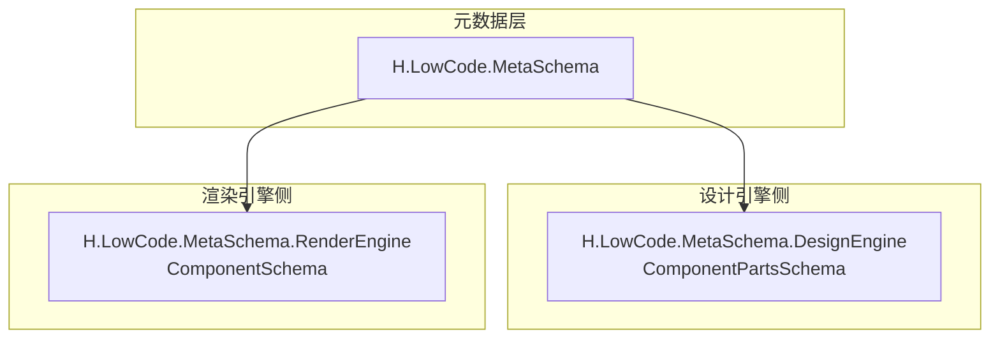
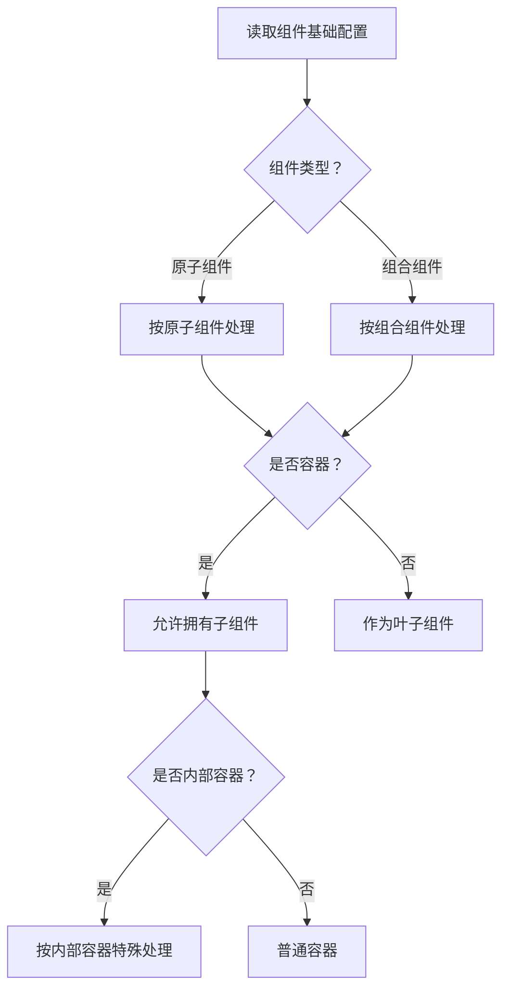
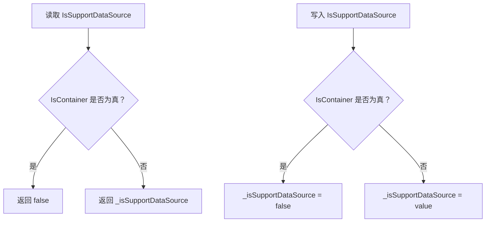
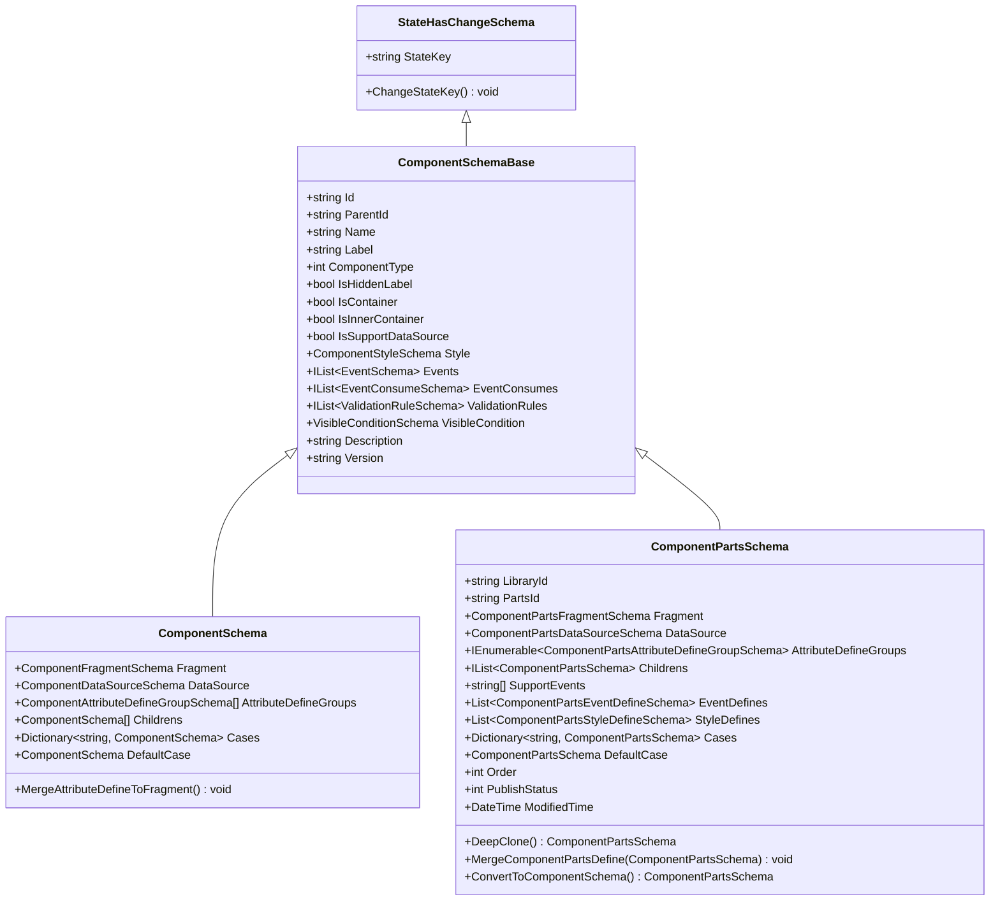
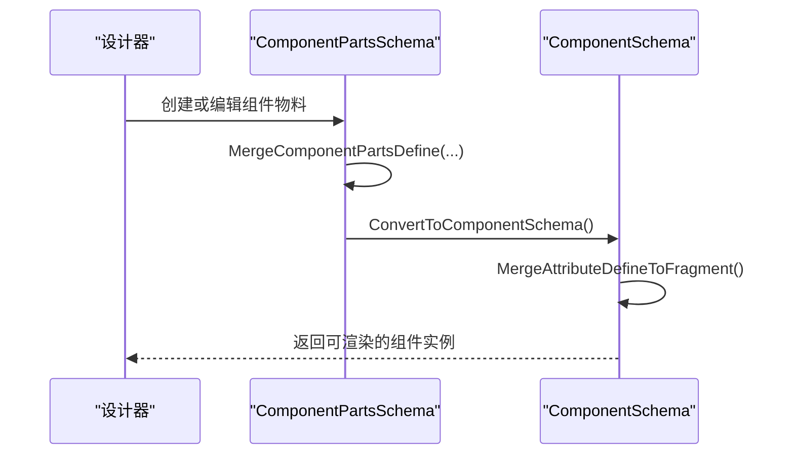
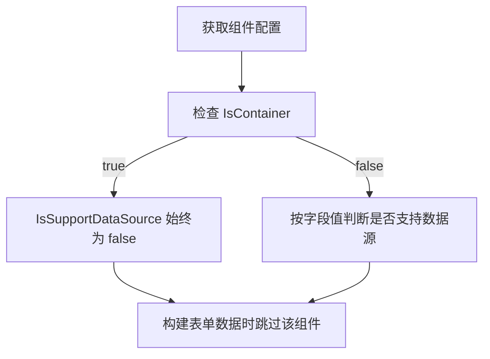
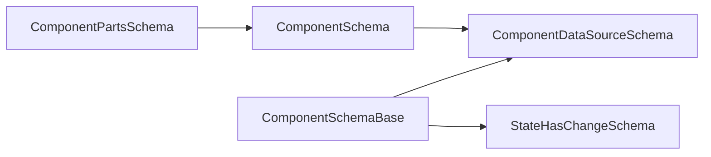

# 组件基础Schema结构

<cite>
**本文引用的文件**   
- [ComponentSchemaBase.cs](file://src/LowCode/Common/H.LowCode.MetaSchema/ComponentSchemaBase.cs)
- [StateHasChangeSchema.cs](file://src/LowCode/Common/H.LowCode.MetaSchema/StateHasChangeSchema.cs)
- [MetaSchemaBase.cs](file://src/LowCode/Common/H.LowCode.MetaSchema/MetaSchemaBase.cs)
- [ComponentSchema.cs](file://src/LowCode/Common/H.LowCode.MetaSchema.RenderEngine/ComponentSchema.cs)
- [ComponentPartsSchema.cs](file://src/LowCode/Common/H.LowCode.MetaSchema.DesignEngine/ComponentPartsSchema.cs)
- [ComponentDataSourceSchema.cs](file://src/LowCode/Common/H.LowCode.MetaSchema/DataSourceSchemas/ComponentDataSourceSchema.cs)
- [FormDataAppService.cs](file://src/LowCode/RenderEngine/H.LowCode.RenderEngine.Application/DataAppServices/FormDataAppService.cs)
</cite>

## 目录
1. [引言](#引言)
2. [项目结构与定位](#项目结构与定位)
3. [核心概念与标识体系](#核心概念与标识体系)
4. [组件类型与容器语义](#组件类型与容器语义)
5. [数据源支持机制](#数据源支持机制)
6. [版本管理与描述信息](#版本管理与描述信息)
7. [继承关系与序列化配置](#继承关系与序列化配置)
8. [运行时与编辑器模型差异](#运行时与编辑器模型差异)
9. [实战示例与最佳实践](#实战示例与最佳实践)
10. [依赖关系分析](#依赖关系分析)
11. [性能与扩展建议](#性能与扩展建议)
12. [常见问题排查](#常见问题排查)
13. [结论](#结论)

## 引言
本文面向 H.AppLab 低代码平台的组件基础 Schema 结构，重点解释 `ComponentSchemaBase` 的设计目标、标识体系、组件类型区分、容器语义、数据源支持控制、版本与描述字段，以及设计期与运行期模型之间的关系。文档以源码为依据，配合类图、流程图和序列图帮助读者建立系统级理解。

## 项目结构与定位
组件基础 Schema 位于元数据层，是设计引擎与渲染引擎共同遵循的契约基类。其职责包括：
- 定义组件实例的唯一标识、父节点关系、名称与显示名。
- 统一组件类型、容器标记、样式、事件、校验规则、可见条件等通用能力。
- 为运行时组件对象与设计期组件物料提供公共语义基础。

**图表来源**
- [ComponentSchemaBase.cs:1-110](file://src/LowCode/Common/H.LowCode.MetaSchema/ComponentSchemaBase.cs#L1-L110)
- [ComponentPartsSchema.cs:1-229](file://src/LowCode/Common/H.LowCode.MetaSchema.DesignEngine/ComponentPartsSchema.cs#L1-L229)
- [ComponentSchema.cs:1-83](file://src/LowCode/Common/H.LowCode.MetaSchema.RenderEngine/ComponentSchema.cs#L1-L83)

**章节来源**
- [ComponentSchemaBase.cs:1-110](file://src/LowCode/Common/H.LowCode.MetaSchema/ComponentSchemaBase.cs#L1-L110)

## 核心概念与标识体系
`ComponentSchemaBase` 定义了组件在页面树中的最小可识别单元。关键字段如下：

| 字段 | JSON 键 | 类型 | 含义与行为 |
|---|---|---|---|
| `Id` | `id` | 字符串 | 组件实例唯一 Id，用于页面树定位、事件路由、属性绑定等。 |
| `ParentId` | `pid` | 可选字符串 | 父组件 Id，表示组件在页面树中的父子关系。 |
| `Name` | `n` | 可选字符串 | 组件逻辑名称，通常由开发者或生成器设定。 |
| `Label` | `lb` | 可选字符串 | 组件显示名称，常用于界面展示、调试面板、日志输出。 |

这些字段构成“组件实例标识体系”：
- `Id` 是全局唯一标识，应跨页面稳定或在重建时重新分配。
- `ParentId` 形成树形拓扑，便于遍历子节点、查找祖先、计算层级。
- `Name` 偏向内部语义，适合脚本引用、调试、自动化测试。
- `Label` 偏向用户可见文案，适合 UI 展示、国际化扩展。

**章节来源**
- [ComponentSchemaBase.cs:1-110](file://src/LowCode/Common/H.LowCode.MetaSchema/ComponentSchemaBase.cs#L1-L110)

## 组件类型与容器语义
### 组件类型
`ComponentType` 使用整型枚举表达组件分类：
- `1` 表示原子组件，如按钮、输入框、表格列等不可再拆分的 UI 单元。
- `2` 表示组合组件，由多个原子或组合组件构成的业务组件。

该设计使平台可以在设计器和渲染器中根据类型选择不同行为，例如：
- 对组合组件优先渲染其子节点集合。
- 对原子组件直接映射到具体渲染 Fragment。

### 容器标记
- `IsContainer`：表示该组件是否承载子组件。
- `IsInnerContainer`：表示是否为内部容器，通常用于布局容器或框架内嵌容器。

这两个布尔标记不是互斥关系，而是正交维度：
- 一个组件可以同时是容器和内部容器。
- 非容器组件一般不应有子节点；但容器不一定必须是内部容器。

**图表来源**
- [ComponentSchemaBase.cs:1-110](file://src/LowCode/Common/H.LowCode.MetaSchema/ComponentSchemaBase.cs#L1-L110)

**章节来源**
- [ComponentSchemaBase.cs:1-110](file://src/LowCode/Common/H.LowCode.MetaSchema/ComponentSchemaBase.cs#L1-L110)

## 数据源支持机制
`IsSupportDataSource` 是一个动态控制开关，核心规则如下：
- 如果组件是容器（`IsContainer` 为真），则无论设置如何，访问该属性时始终返回假。
- 如果组件不是容器，则读写底层 `_isSupportDataSource` 字段。
- 当给容器组件赋值时，底层字段会被强制设为假，避免持久化错误状态。

这一机制确保：
- 容器组件不会错误暴露数据源能力。
- 设计器仍可保存配置，但运行时数据源能力被安全屏蔽。

**图表来源**
- [ComponentSchemaBase.cs:1-110](file://src/LowCode/Common/H.LowCode.MetaSchema/ComponentSchemaBase.cs#L1-L110)

此外，运行时表单数据处理会排除容器组件，只收集非容器组件的字段。这进一步体现容器组件不直接参与表单数据绑定的语义。

**章节来源**
- [ComponentSchemaBase.cs:1-110](file://src/LowCode/Common/H.LowCode.MetaSchema/ComponentSchemaBase.cs#L1-L110)
- [FormDataAppService.cs:33-33](file://src/LowCode/RenderEngine/H.LowCode.RenderEngine.Application/DataAppServices/FormDataAppService.cs#L33-L33)

## 版本管理与描述信息
- `Version`：组件 Schema 的版本号，默认值为 `0.0.1`。可用于向后兼容、迁移策略、升级提示等。
- `Description`：组件描述文本，常用于设计器元数据、帮助文档、发布说明。

版本管理建议：
- 当组件结构发生破坏性变更时，递增版本号。
- 保留旧版本解析逻辑，实现渐进式迁移。
- 将 `Description` 与组件库发布流程结合，提升可维护性。

**章节来源**
- [ComponentSchemaBase.cs:1-110](file://src/LowCode/Common/H.LowCode.MetaSchema/ComponentSchemaBase.cs#L1-L110)

## 继承关系与序列化配置
### 继承链
`ComponentSchemaBase` 继承自 `StateHasChangeSchema`，后者又通过共享抽象基类模式与元数据生命周期解耦。

**图表来源**
- [StateHasChangeSchema.cs:1-15](file://src/LowCode/Common/H.LowCode.MetaSchema/StateHasChangeSchema.cs#L1-L15)
- [ComponentSchemaBase.cs:1-110](file://src/LowCode/Common/H.LowCode.MetaSchema/ComponentSchemaBase.cs#L1-L110)
- [ComponentSchema.cs:1-83](file://src/LowCode/Common/H.LowCode.MetaSchema.RenderEngine/ComponentSchema.cs#L1-L83)
- [ComponentPartsSchema.cs:1-229](file://src/LowCode/Common/H.LowCode.MetaSchema.DesignEngine/ComponentPartsSchema.cs#L1-L229)

### JSON 序列化约定
所有关键属性都通过 `[JsonPropertyName]` 指定短键，以降低传输体积并提高可读性。常见键包括：
- `id`、`pid`、`n`、`lb`、`ct`、`hlb`、`container`、`incontainer`、`sptds`、`stl`、`evs`、`evcs`、`valrules`、`vcond`、`desc`、`v`。
- 运行时组件还包含 `frag`、`ds`、`attrdefgroups`、`childs`、`cases`、`default`。
- 设计期组件还包含 `libid`、`partsId`、`stydefs`、`sptevs`、`evdefs`、`order`、`pub`、`mt`。

### 状态键机制
`StateHasChangeSchema` 提供 `StateKey`，用于 Blazor 状态刷新场景。该字段不参与 JSON 序列化，仅在运行时用于触发视图更新。

**章节来源**
- [ComponentSchemaBase.cs:1-110](file://src/LowCode/Common/H.LowCode.MetaSchema/ComponentSchemaBase.cs#L1-L110)
- [StateHasChangeSchema.cs:1-15](file://src/LowCode/Common/H.LowCode.MetaSchema/StateHasChangeSchema.cs#L1-L15)
- [ComponentSchema.cs:1-83](file://src/LowCode/Common/H.LowCode.MetaSchema.RenderEngine/ComponentSchema.cs#L1-L83)
- [ComponentPartsSchema.cs:1-229](file://src/LowCode/Common/H.LowCode.MetaSchema.DesignEngine/ComponentPartsSchema.cs#L1-L229)

## 运行时与编辑器模型差异
### 运行时组件模型：`ComponentSchema`
- 强调实际渲染所需的 Fragment、数据源、属性定义分组。
- 支持子组件列表、条件分支渲染。
- 提供 `MergeAttributeDefineToFragment`，将设计期定义的属性合并到运行时 Fragment 属性中。

### 设计期组件模型：`ComponentPartsSchema`
- 强调组件物料定义，包括库 ID、部件 ID、排序、发布状态、修改时间。
- 支持事件定义、样式定义、支持事件列表。
- 提供 `DeepClone`、`MergeComponentPartsDefine`、`ConvertToComponentSchema` 等设计期工具方法。

**图表来源**
- [ComponentPartsSchema.cs:1-229](file://src/LowCode/Common/H.LowCode.MetaSchema.DesignEngine/ComponentPartsSchema.cs#L1-L229)
- [ComponentSchema.cs:1-83](file://src/LowCode/Common/H.LowCode.MetaSchema.RenderEngine/ComponentSchema.cs#L1-L83)

**章节来源**
- [ComponentSchema.cs:1-83](file://src/LowCode/Common/H.LowCode.MetaSchema.RenderEngine/ComponentSchema.cs#L1-L83)
- [ComponentPartsSchema.cs:1-229](file://src/LowCode/Common/H.LowCode.MetaSchema.DesignEngine/ComponentPartsSchema.cs#L1-L229)

## 实战示例与最佳实践
以下示例以字段结构说明为主，不直接粘贴源码内容。

### 原子组件基础结构
- 设置 `ComponentType` 为 `1`。
- 设置 `IsContainer` 为 `false`。
- 根据需要启用 `IsSupportDataSource`。
- 填写 `Name`、`Label`、`Description`、`Version`。
- 配置 `Style`、`Events`、`ValidationRules`、`VisibleCondition`。

### 组合组件基础结构
- 设置 `ComponentType` 为 `2`。
- 设置 `IsContainer` 为 `true`。
- 根据布局需求设置 `IsInnerContainer`。
- 容器组件的 `IsSupportDataSource` 在访问时会返回假。
- 配置 `Childrens` 或 `Cases`、`DefaultCase`。

### 容器组件禁用数据源的验证流程

**图表来源**
- [ComponentSchemaBase.cs:1-110](file://src/LowCode/Common/H.LowCode.MetaSchema/ComponentSchemaBase.cs#L1-L110)
- [FormDataAppService.cs:33-33](file://src/LowCode/RenderEngine/H.LowCode.RenderEngine.Application/DataAppServices/FormDataAppService.cs#L33-L33)

### 属性访问模式建议
- 优先通过属性访问组件标识，而不是直接操作 JSON 字符串。
- 修改 `IsSupportDataSource` 时注意容器语义。
- 在设计器中合并属性定义后，应在运行时调用属性合并方法，确保 Fragment 属性完整。

**章节来源**
- [ComponentSchemaBase.cs:1-110](file://src/LowCode/Common/H.LowCode.MetaSchema/ComponentSchemaBase.cs#L1-L110)
- [ComponentSchema.cs:1-83](file://src/LowCode/Common/H.LowCode.MetaSchema.RenderEngine/ComponentSchema.cs#L1-L83)
- [ComponentPartsSchema.cs:1-229](file://src/LowCode/Common/H.LowCode.MetaSchema.DesignEngine/ComponentPartsSchema.cs#L1-L229)
- [FormDataAppService.cs:33-33](file://src/LowCode/RenderEngine/H.LowCode.RenderEngine.Application/DataAppServices/FormDataAppService.cs#L33-L33)

## 依赖关系分析
组件基础 Schema 依赖以下关键点：
- JSON 序列化：基于 System.Text.Json，使用短键降低负载。
- 状态刷新：基于 `StateHasChangeSchema.StateKey`，配合 Blazor 渲染机制。
- 数据源结构：通过 `ComponentDataSourceSchema` 及其子类描述数据源类型、ID、名称、值、选项和列表循环。
- 设计期与运行期转换：通过 `ComponentPartsSchema.ConvertToComponentSchema` 完成物料到实例的映射。

**图表来源**
- [ComponentSchemaBase.cs:1-110](file://src/LowCode/Common/H.LowCode.MetaSchema/ComponentSchemaBase.cs#L1-L110)
- [ComponentDataSourceSchema.cs:1-58](file://src/LowCode/Common/H.LowCode.MetaSchema/DataSourceSchemas/ComponentDataSourceSchema.cs#L1-L58)
- [ComponentPartsSchema.cs:1-229](file://src/LowCode/Common/H.LowCode.MetaSchema.DesignEngine/ComponentPartsSchema.cs#L1-L229)
- [ComponentSchema.cs:1-83](file://src/LowCode/Common/H.LowCode.MetaSchema.RenderEngine/ComponentSchema.cs#L1-L83)
- [StateHasChangeSchema.cs:1-15](file://src/LowCode/Common/H.LowCode.MetaSchema/StateHasChangeSchema.cs#L1-L15)

**章节来源**
- [ComponentSchemaBase.cs:1-110](file://src/LowCode/Common/H.LowCode.MetaSchema/ComponentSchemaBase.cs#L1-L110)
- [ComponentDataSourceSchema.cs:1-58](file://src/LowCode/Common/H.LowCode.MetaSchema/DataSourceSchemas/ComponentDataSourceSchema.cs#L1-L58)
- [ComponentPartsSchema.cs:1-229](file://src/LowCode/Common/H.LowCode.MetaSchema.DesignEngine/ComponentPartsSchema.cs#L1-L229)
- [ComponentSchema.cs:1-83](file://src/LowCode/Common/H.LowCode.MetaSchema.RenderEngine/ComponentSchema.cs#L1-L83)
- [StateHasChangeSchema.cs:1-15](file://src/LowCode/Common/H.LowCode.MetaSchema/StateHasChangeSchema.cs#L1-L15)

## 性能与扩展建议
- 使用短 JSON 键减少网络传输和存储体积。
- 对大型组件树，优先懒加载子组件 Fragment，避免一次性渲染。
- 在合并属性定义时，避免重复添加同名属性，已存在时应覆盖或合并必要字段。
- 对容器组件的数据源能力进行静态屏蔽，减少运行时无效绑定尝试。
- 通过 `Version` 字段配合迁移服务，避免历史页面 Schema 无法解析。

[本节为通用优化建议，不直接分析具体文件]

## 常见问题排查
| 问题 | 可能原因 | 排查与修复 |
|---|---|---|
| 容器组件仍然出现数据源配置 | 设计期误设 `IsSupportDataSource` | 确认运行时访问 `IsSupportDataSource` 会返回假；必要时清理配置。 |
| 表单数据缺少容器组件字段 | 容器组件不参与表单字段收集 | 这是预期行为；如需绑定，应将字段放入非容器子组件。 |
| 子组件找不到父组件 | `ParentId` 未正确设置 | 检查组件树构建逻辑，确保父子关系一致。 |
| 运行时属性缺失 | 未执行属性合并 | 在运行时调用 `MergeAttributeDefineToFragment`。 |
| 设计器复制组件后 ID 冲突 | 未重新生成实例 Id | 使用 `DeepClone` 或手动重置 `Id`、`ParentId`。 |

**章节来源**
- [ComponentSchemaBase.cs:1-110](file://src/LowCode/Common/H.LowCode.MetaSchema/ComponentSchemaBase.cs#L1-L110)
- [ComponentSchema.cs:1-83](file://src/LowCode/Common/H.LowCode.MetaSchema.RenderEngine/ComponentSchema.cs#L1-L83)
- [ComponentPartsSchema.cs:1-229](file://src/LowCode/Common/H.LowCode.MetaSchema.DesignEngine/ComponentPartsSchema.cs#L1-L229)
- [FormDataAppService.cs:33-33](file://src/LowCode/RenderEngine/H.LowCode.RenderEngine.Application/DataAppServices/FormDataAppService.cs#L33-L33)

## 结论
`ComponentSchemaBase` 是 H.AppLab 低代码平台组件模型的基石。它通过统一的标识体系、组件类型、容器语义和数据源开关，为设计期与运行期提供了清晰契约。容器组件自动禁用数据源、运行时表单忽略容器字段、JSON 短键序列化、状态键刷新机制共同构成了可扩展且高效的组件基础结构。在使用时，应严格区分原子组件与组合组件，合理设置容器标记，并在设计期与运行期之间做好属性与数据源的合并与转换。

[本节为总结性内容，不直接分析具体文件]