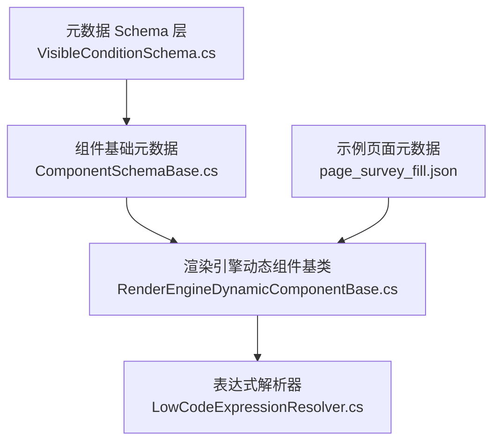
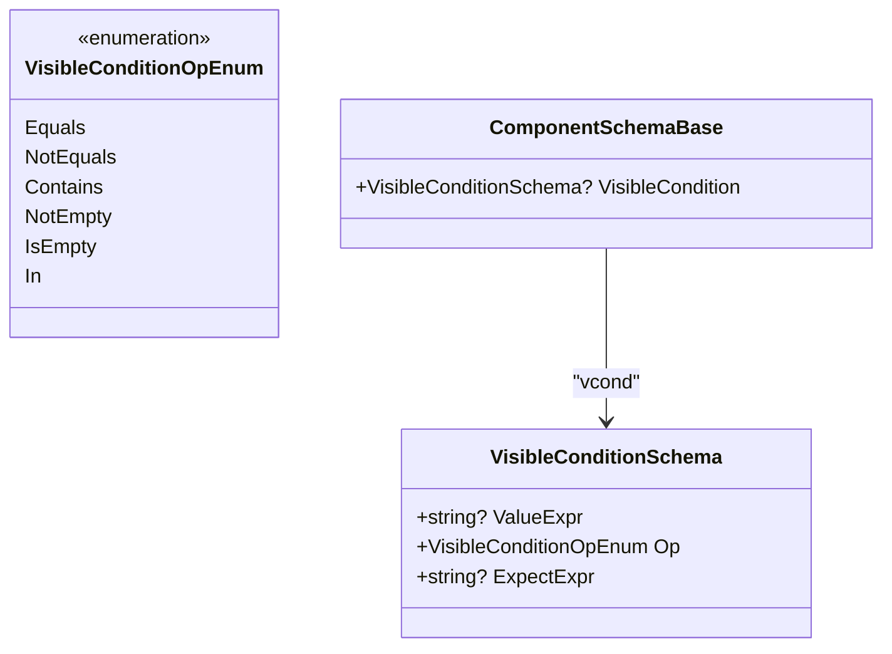
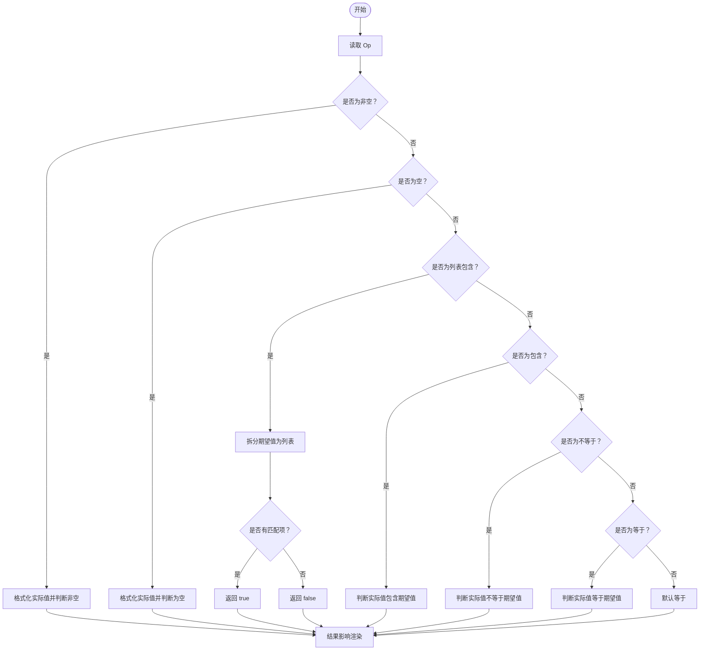
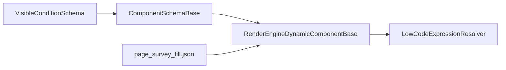

# 组件显示条件 Schema

<cite>
**本文引用的文件**
- [VisibleConditionSchema.cs](file://src/LowCode/Common/H.LowCode.MetaSchema/PropertySchemas/VisibleConditionSchema.cs)
- [ComponentSchemaBase.cs](file://src/LowCode/Common/H.LowCode.MetaSchema/ComponentSchemaBase.cs)
- [LowCodeExpressionResolver.cs](file://src/LowCode/RenderEngine/H.LowCode.RenderEngineBase/LowCodeExpressionResolver.cs)
- [RenderEngineDynamicComponentBase.cs](file://src/LowCode/RenderEngine/H.LowCode.RenderEngineBase/RenderEngineDynamicComponentBase.cs)
- [page_survey_fill.json](file://src/LowCode/meta/apps/survey/page/page_survey_fill.json)
</cite>

## 目录
1. [简介](#简介)
2. [项目结构定位](#项目结构定位)
3. [核心概念与数据模型](#核心概念与数据模型)
4. [架构总览](#架构总览)
5. [详细组件分析](#详细组件分析)
6. [依赖关系分析](#依赖关系分析)
7. [性能与渲染时机](#性能与渲染时机)
8. [实战配置示例](#实战配置示例)
9. [表达式语法规范](#表达式语法规范)
10. [错误处理与调试技巧](#错误处理与调试技巧)
11. [结论](#结论)

## 简介
本技术文档围绕 H.AppLab 低代码平台中“组件显示条件”机制展开，重点说明 `VisibleConditionSchema` 的可见性判断逻辑、表达式求值环境、比较操作符语义、性能优化方式以及典型显隐联动场景。该机制用于在运行时根据表单状态、当前行数据、URL 查询参数等动态决定是否渲染某个组件，从而实现复杂的页面交互控制。

## 项目结构定位
显示条件相关代码分布在元数据 Schema 定义层与渲染引擎实现层：
- 元数据 Schema 层负责定义 `VisibleConditionSchema` 及比较操作枚举。
- 组件基类将 `VisibleCondition` 挂载到每个组件元数据上。
- 渲染引擎在递归渲染组件时调用可见性判断方法，并结合表达式解析器完成条件求值。
- 示例应用问卷页 JSON 中展示了基于题目类型和关联答案的动态显隐配置。



**图表来源**
- [VisibleConditionSchema.cs:1-49](file://src/LowCode/Common/H.LowCode.MetaSchema/PropertySchemas/VisibleConditionSchema.cs#L1-L49)
- [ComponentSchemaBase.cs:95-110](file://src/LowCode/Common/H.LowCode.MetaSchema/ComponentSchemaBase.cs#L95-L110)
- [RenderEngineDynamicComponentBase.cs:180-345](file://src/LowCode/RenderEngine/H.LowCode.RenderEngineBase/RenderEngineDynamicComponentBase.cs#L180-L345)
- [LowCodeExpressionResolver.cs:1-270](file://src/LowCode/RenderEngine/H.LowCode.RenderEngineBase/LowCodeExpressionResolver.cs#L1-L270)
- [page_survey_fill.json](file://src/LowCode/meta/apps/survey/page/page_survey_fill.json)

**章节来源**
- [VisibleConditionSchema.cs:1-49](file://src/LowCode/Common/H.LowCode.MetaSchema/PropertySchemas/VisibleConditionSchema.cs#L1-L49)
- [ComponentSchemaBase.cs:95-110](file://src/LowCode/Common/H.LowCode.MetaSchema/ComponentSchemaBase.cs#L95-L110)

## 核心概念与数据模型
`VisibleConditionSchema` 是组件显示条件的核心数据结构，包含三个关键部分：
- 值来源表达式 `ValueExpr`：用于获取待比较的实际值。
- 比较操作符 `Op`：决定如何比较实际值与期望值。
- 期望值表达式 `ExpectExpr`：用于获取期望比较的目标值。

`VisibleConditionOpEnum` 定义了六类比较模式：等于、不等于、包含、非空、为空、列表包含。



**图表来源**
- [VisibleConditionSchema.cs:1-49](file://src/LowCode/Common/H.LowCode.MetaSchema/PropertySchemas/VisibleConditionSchema.cs#L1-L49)
- [ComponentSchemaBase.cs:95-110](file://src/LowCode/Common/H.LowCode.MetaSchema/ComponentSchemaBase.cs#L95-L110)

**章节来源**
- [VisibleConditionSchema.cs:1-49](file://src/LowCode/Common/H.LowCode.MetaSchema/PropertySchemas/VisibleConditionSchema.cs#L1-L49)
- [ComponentSchemaBase.cs:95-110](file://src/LowCode/Common/H.LowCode.MetaSchema/ComponentSchemaBase.cs#L95-L110)

## 架构总览
组件显示条件的执行流程从渲染引擎开始，最终落到表达式求值和比较操作。

```mermaid
sequenceDiagram
    participant Renderer as "渲染引擎<br/>RenderEngineDynamicComponentBase"
    participant Condition as "显示条件<br/>VisibleConditionSchema"
    participant ExprCtx as "表达式上下文<br/>LowCodeExpressionContext"
    participant Resolver as "表达式解析器<br/>LowCodeExpressionResolver"
    participant Form as "表单状态服务<br/>PageFormStateService"
    participant Query as "URL 查询参数提供器"

    Renderer->>Renderer: "递归渲染组件"
    Renderer->>Condition: "读取 vcond"
    alt "存在显示条件"
        Renderer->>ExprCtx: "创建表达式上下文"
        ExprCtx->>Resolver: "求值 ValueExpr"
        Resolver->>Form: "读取 form.key / form[expr]"
        Resolver->>Query: "读取 $query(name)"
        Resolver-->>Renderer: "返回实际值"
        Renderer->>Renderer: "按 Op 比较实际值与期望值"
        opt "条件为真"
            Renderer-->>Renderer: "继续渲染子节点"
        else "条件为假"
            Renderer-->>Renderer: "跳过渲染该组件"
        end
    else "无显示条件"
        Renderer-->>Renderer: "默认渲染组件"
    end
```

**图表来源**
- [RenderEngineDynamicComponentBase.cs:180-345](file://src/LowCode/RenderEngine/H.LowCode.RenderEngineBase/RenderEngineDynamicComponentBase.cs#L180-L345)
- [LowCodeExpressionResolver.cs:1-270](file://src/LowCode/RenderEngine/H.LowCode.RenderEngineBase/LowCodeExpressionResolver.cs#L1-L270)

**章节来源**
- [RenderEngineDynamicComponentBase.cs:180-345](file://src/LowCode/RenderEngine/H.LowCode.RenderEngineBase/RenderEngineDynamicComponentBase.cs#L180-L345)
- [LowCodeExpressionResolver.cs:1-270](file://src/LowCode/RenderEngine/H.LowCode.RenderEngineBase/LowCodeExpressionResolver.cs#L1-L270)

## 详细组件分析

### 显示条件数据模型
`VisibleConditionSchema` 使用 JSON 序列化属性映射：
- `vexpr`：值来源表达式。
- `op`：比较操作符。
- `eexpr`：期望值表达式。

`VisibleConditionOpEnum` 包括：
- 等于（Equals）
- 不等于（NotEquals）
- 包含（Contains）
- 非空（NotEmpty）
- 为空（IsEmpty）
- 列表包含（In）

**章节来源**
- [VisibleConditionSchema.cs:1-49](file://src/LowCode/Common/H.LowCode.MetaSchema/PropertySchemas/VisibleConditionSchema.cs#L1-L49)

### 组件元数据挂载点
每个组件的基础元数据中包含 `VisibleCondition`，其 JSON 键名为 `vcond`。渲染引擎会读取该字段并决定是否渲染组件。

**章节来源**
- [ComponentSchemaBase.cs:95-110](file://src/LowCode/Common/H.LowCode.MetaSchema/ComponentSchemaBase.cs#L95-L110)

### 表达式求值与环境
表达式解析器支持以下变量引用：
- `$query(name)`：读取 URL 查询参数；支持多候选名回退。
- `$(item.field)`：读取当前行数据字段。
- `$(form.key)`：读取表单状态值。
- `$(form[innerExpr])`：先对 innerExpr 求值作为 key，再读取表单状态值。
- `$(now)`：返回格式化后的当前时间字符串。
- `$(formjson(listId,compName))`：聚合指定列表实例的组件值，返回 JSON 数组字符串。

当整个表达式串为单一表达式时，解析器返回原始类型值；否则进行插值拼接后返回字符串。布尔值格式化为 `true`/`false`，日期时间格式化为 `yyyy-MM-dd HH:mm:ss`。

**章节来源**
- [LowCodeExpressionResolver.cs:1-270](file://src/LowCode/RenderEngine/H.LowCode.RenderEngineBase/LowCodeExpressionResolver.cs#L1-L270)

### 比较操作符语义
渲染引擎根据 `Op` 执行以下逻辑：
- 非空：实际值的字符串形式非空则显示。
- 为空：实际值的字符串形式为空则显示。
- 列表包含：将期望值按逗号拆分并去除空白项，判断实际值是否与其中某一项相等（忽略大小写）。
- 包含：判断实际值字符串是否包含期望值字符串。
- 不等于：判断实际值与期望值不相等（忽略大小写）。
- 等于：判断实际值与期望值相等（忽略大小写）。



**图表来源**
- [RenderEngineDynamicComponentBase.cs:301-345](file://src/LowCode/RenderEngine/H.LowCode.RenderEngineBase/RenderEngineDynamicComponentBase.cs#L301-L345)

**章节来源**
- [RenderEngineDynamicComponentBase.cs:301-345](file://src/LowCode/RenderEngine/H.LowCode.RenderEngineBase/RenderEngineDynamicComponentBase.cs#L301-L345)

### 渲染时机与事件驱动
渲染引擎在初始化阶段订阅表单状态变化和列表数据变化。当表单状态或列表数据更新时，触发 Blazor 的 `StateHasChanged`，从而重新计算组件可见性与渲染树。这样可实现：
- 表单输入变更驱动的显隐联动。
- 列表增删行、排序等数据变更驱动的显隐联动。
- 隐藏组件不实例化、不参与渲染，降低 UI 开销。

**章节来源**
- [RenderEngineDynamicComponentBase.cs:40-120](file://src/LowCode/RenderEngine/H.LowCode.RenderEngineBase/RenderEngineDynamicComponentBase.cs#L40-L120)
- [RenderEngineDynamicComponentBase.cs:180-210](file://src/LowCode/RenderEngine/H.LowCode.RenderEngineBase/RenderEngineDynamicComponentBase.cs#L180-L210)

## 依赖关系分析
显示条件机制依赖以下模块：
- 元数据 Schema：定义条件结构与比较操作。
- 组件基础元数据：挂载 `VisibleCondition`。
- 表达式解析器：提供变量解析、类型格式化、混合表达式求值。
- 渲染引擎：在渲染管线中调用可见性判断，并根据结果决定是否渲染组件。
- 示例页面 JSON：展示真实业务中的显隐联动配置。



**图表来源**
- [VisibleConditionSchema.cs:1-49](file://src/LowCode/Common/H.LowCode.MetaSchema/PropertySchemas/VisibleConditionSchema.cs#L1-L49)
- [ComponentSchemaBase.cs:95-110](file://src/LowCode/Common/H.LowCode.MetaSchema/ComponentSchemaBase.cs#L95-L110)
- [RenderEngineDynamicComponentBase.cs:180-345](file://src/LowCode/RenderEngine/H.LowCode.RenderEngineBase/RenderEngineDynamicComponentBase.cs#L180-L345)
- [LowCodeExpressionResolver.cs:1-270](file://src/LowCode/RenderEngine/H.LowCode.RenderEngineBase/LowCodeExpressionResolver.cs#L1-L270)
- [page_survey_fill.json](file://src/LowCode/meta/apps/survey/page/page_survey_fill.json)

**章节来源**
- [VisibleConditionSchema.cs:1-49](file://src/LowCode/Common/H.LowCode.MetaSchema/PropertySchemas/VisibleConditionSchema.cs#L1-L49)
- [ComponentSchemaBase.cs:95-110](file://src/LowCode/Common/H.LowCode.MetaSchema/ComponentSchemaBase.cs#L95-L110)
- [RenderEngineDynamicComponentBase.cs:180-345](file://src/LowCode/RenderEngine/H.LowCode.RenderEngineBase/RenderEngineDynamicComponentBase.cs#L180-L345)
- [LowCodeExpressionResolver.cs:1-270](file://src/LowCode/RenderEngine/H.LowCode.RenderEngineBase/LowCodeExpressionResolver.cs#L1-L270)

## 性能与渲染时机
- 条件为假时直接跳过渲染：避免不必要的组件实例化和渲染树构建。
- 表达式求值仅在可见性判断时发生：减少重复计算。
- 表单状态与列表数据变化通过事件驱动刷新：只在必要时触发重渲染。
- 混合表达式模式下，非表达式文本直接拼接，避免额外解析开销。

这些特性共同保证了复杂显隐联动场景下的渲染性能。

**章节来源**
- [RenderEngineDynamicComponentBase.cs:180-210](file://src/LowCode/RenderEngine/H.LowCode.RenderEngineBase/RenderEngineDynamicComponentBase.cs#L180-L210)
- [LowCodeExpressionResolver.cs:1-120](file://src/LowCode/RenderEngine/H.LowCode.RenderEngineBase/LowCodeExpressionResolver.cs#L1-L120)

## 实战配置示例

### 示例一：按题目类型显示不同控件
问卷填写页面中，多个题目控件分别通过 `ValueExpr` 引用 `$(item.f_question_type)`，并以等于操作符匹配不同的题型编号，从而只显示对应类型的输入控件。

- 值来源表达式：`$(item.f_question_type)`
- 比较操作符：等于
- 期望值表达式：各题型编号

这种配置实现了“选择填空题型后，仅渲染对应控件”的显隐联动。

**章节来源**
- [page_survey_fill.json](file://src/LowCode/meta/apps/survey/page/page_survey_fill.json)

### 示例二：按关联答案显示当前题目
另一个条件通过 `ValueExpr` 指向特定列表实例的组件值，并使用包含或不等于等逻辑控制显示。例如，当某题的答案包含特定关键词时，显示补充说明字段。

- 值来源表达式：`$(form[q_list|$(item.f_link_qid)|answer])`
- 比较操作符：包含或不等于
- 期望值表达式：`$(item.f_link_value)`

该配置体现了跨列表、跨组件的显隐联动能力。

**章节来源**
- [page_survey_fill.json](file://src/LowCode/meta/apps/survey/page/page_survey_fill.json)

### 示例三：组合 URL 参数与表单状态
可通过 `$query(surveyId)` 与 `$(form.xxx)` 组合，实现根据页面来源参数和表单输入共同决定组件显示。例如，新增模式下显示某些编辑字段，查看模式下隐藏。

**章节来源**
- [LowCodeExpressionResolver.cs:1-270](file://src/LowCode/RenderEngine/H.LowCode.RenderEngineBase/LowCodeExpressionResolver.cs#L1-L270)

## 表达式语法规范

### 支持的表达式语法
- `$query(name)`：读取 URL 查询参数；支持 `name1|name2` 依次回退取第一个非空值。
- `$(item.field)`：读取当前行数据字段，支持字典键与反射属性访问。
- `$(form.key)`：读取表单状态值。
- `$(form[innerExpr])`：先求值 innerExpr 得到 key，再读取表单状态值。
- `$(formjson(listId,compName))`：返回 JSON 数组字符串，元素包含 `id` 与 `value`。
- `$(now)`：返回格式化后的当前时间字符串。

### 混合表达式与返回值类型
- 若整个字符串为单一表达式，返回原始类型值。
- 若为普通文本与表达式的混合，返回插值后的字符串。
- 布尔值格式化为 `true`/`false`。
- 日期时间格式化为 `yyyy-MM-dd HH:mm:ss`。

### 变量与作用域
- `item`：列表渲染时的当前行数据。
- `form`：页面表单状态服务。
- `$query`：页面 URL 查询参数。

**章节来源**
- [LowCodeExpressionResolver.cs:1-270](file://src/LowCode/RenderEngine/H.LowCode.RenderEngineBase/LowCodeExpressionResolver.cs#L1-L270)

## 错误处理与调试技巧

### 常见错误
- 表达式未识别：未知表达式会被保留原文，不会抛异常，可能导致显示不符合预期。
- 表单键为空：`$(form[expr])` 中 innerExpr 求值为空时，返回 null。
- 缺少查询参数：`$query(name)` 在没有提供查询值时返回 null。
- 列表实例不存在：`$(formjson(listId,compName))` 参数错误或服务不可用时返回 null。

### 调试建议
- 先用简单表达式验证：例如用 `$(form.key)` 或 `$query(name)` 单独测试。
- 检查表单键路径：确认 `$(form[key])` 或 `$(form.key)` 与实际组件名称一致。
- 观察列表上下文：确保 `$(item.field)` 在当前列表数据中存在。
- 利用包含与非空判断：先用 `NotEmpty` 或 `Contains` 快速定位值是否存在。
- 结合日志与示例页面：对照问卷页面的 JSON 配置理解复杂联动逻辑。

**章节来源**
- [LowCodeExpressionResolver.cs:1-270](file://src/LowCode/RenderEngine/H.LowCode.RenderEngineBase/LowCodeExpressionResolver.cs#L1-L270)
- [RenderEngineDynamicComponentBase.cs:301-345](file://src/LowCode/RenderEngine/H.LowCode.RenderEngineBase/RenderEngineDynamicComponentBase.cs#L301-L345)
- [page_survey_fill.json](file://src/LowCode/meta/apps/survey/page/page_survey_fill.json)

## 结论
H.AppLab 低代码平台的组件显示条件机制通过 `VisibleConditionSchema` 与表达式解析器协同工作，提供了灵活且高性能的条件渲染能力。开发者可以使用 `ValueExpr` 与 `ExpectExpr` 组合多种比较操作，实现基于表单状态、列表数据和 URL 参数的复杂显隐联动。渲染引擎在关键渲染路径中短路隐藏组件，有效降低 UI 开销；同时通过事件驱动刷新保证交互响应性。掌握该机制有助于构建更智能、可配置的页面行为。