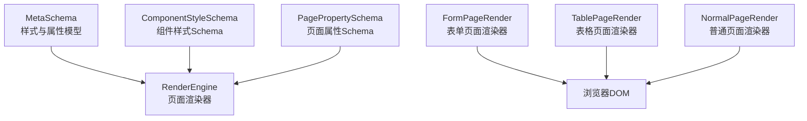
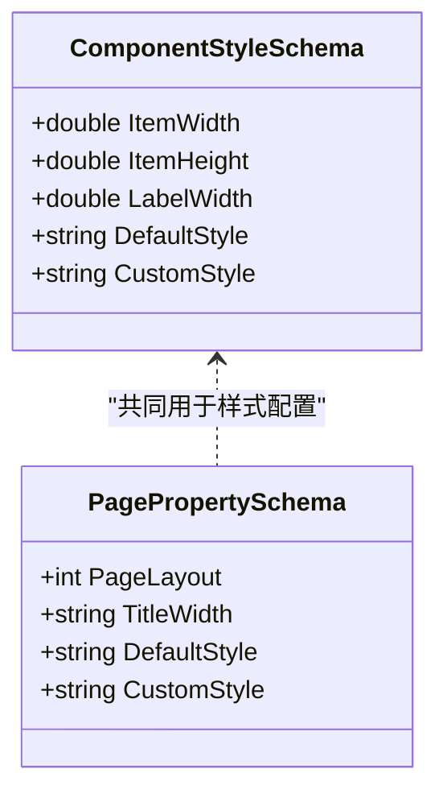
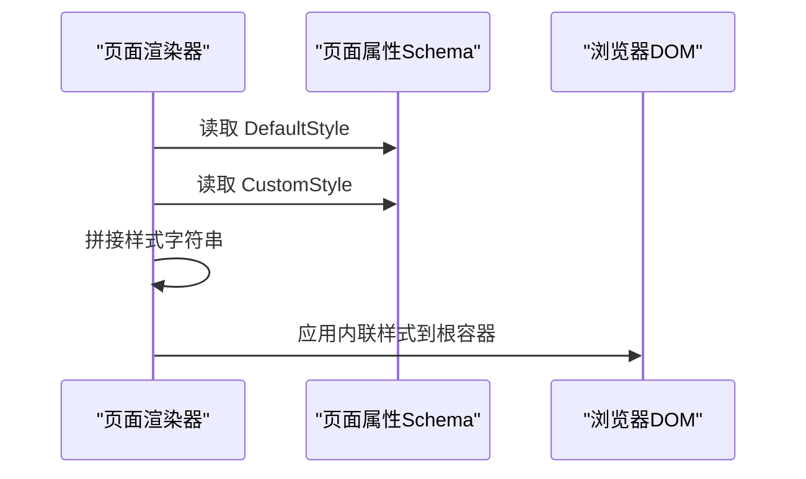
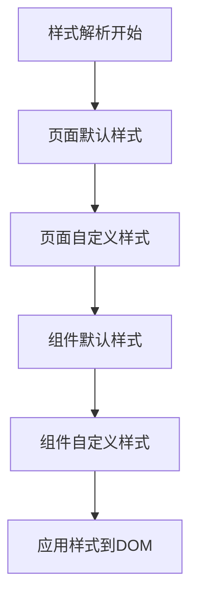
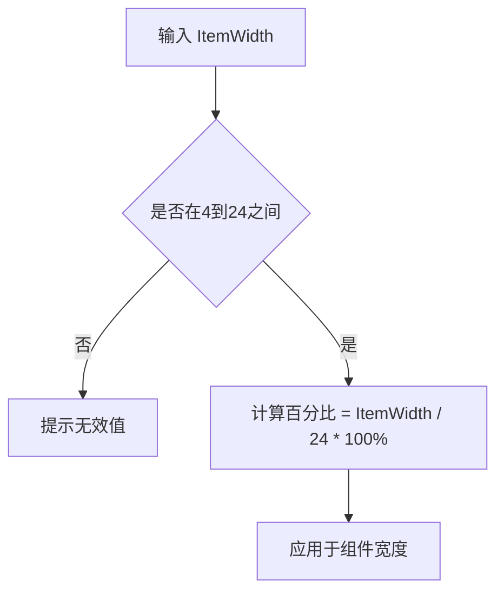
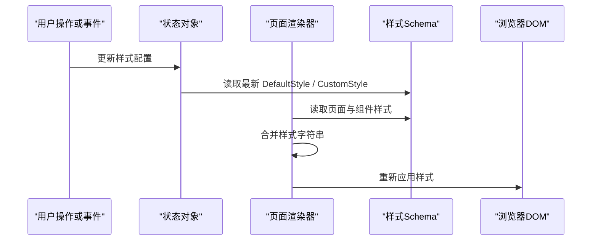
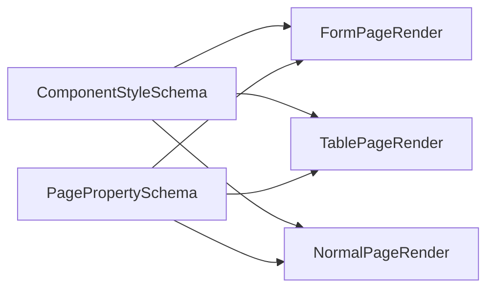

# 组件样式Schema

<cite>
**本文引用的文件**   
- [ComponentStyleSchema.cs](file://src/LowCode/Common/H.LowCode.MetaSchema/PropertySchemas/ComponentStyleSchema.cs)
- [PagePropertySchema.cs](file://src/LowCode/Common/H.LowCode.MetaSchema/PropertySchemas/PagePropertySchema.cs)
- [FormPageRender.razor](file://src/LowCode/RenderEngine/H.LowCode.RenderEngine/PageRender/FormPageRender.razor)
- [TablePageRender.razor](file://src/LowCode/RenderEngine/H.LowCode.RenderEngine/PageRender/TablePageRender.razor)
- [NormalPageRender.razor](file://src/LowCode/RenderEngine/H.LowCode.RenderEngine/PageRender/NormalPageRender.razor)
</cite>

## 目录
1. [引言](#引言)
2. [项目结构定位](#项目结构定位)
3. [核心数据结构](#核心数据结构)
4. [架构总览](#架构总览)
5. [组件样式字段详解](#组件样式字段详解)
6. [样式优先级与继承规则](#样式优先级与继承规则)
7. [响应式布局与栅格宽度计算](#响应式布局与栅格宽度计算)
8. [配置示例与实践指南](#配置示例与实践指南)
9. [动态样式更新流程](#动态样式更新流程)
10. [依赖关系分析](#依赖关系分析)
11. [性能与可维护性建议](#性能与可维护性建议)
12. [故障排查](#故障排查)
13. [结论](#结论)

## 引言
本文面向 H.AppLab 低代码平台的“组件样式 Schema”，重点解释 ComponentStyleSchema 的样式配置体系，包括：
- 组件宽度 ItemWidth 的栅格系统、有效值范围与百分比计算方式
- 组件高度 ItemHeight 的单位规范与默认值
- 标签宽度 LabelWidth 的默认值及在表单布局中的作用
- 默认样式 DefaultStyle 与自定义样式 CustomStyle 的区别与使用场景
- 样式优先级、样式继承与动态样式更新的实战方法

## 项目结构定位
组件样式 Schema 定义位于 MetaSchema 层，渲染逻辑位于 RenderEngine 层。页面级样式由 PagePropertySchema 提供，组件级样式由 ComponentStyleSchema 提供；具体页面渲染器将两者的样式合并后注入到根容器元素上。

**图表来源**
- [ComponentStyleSchema.cs:1-38](file://src/LowCode/Common/H.LowCode.MetaSchema/PropertySchemas/ComponentStyleSchema.cs#L1-L38)
- [PagePropertySchema.cs:1-36](file://src/LowCode/Common/H.LowCode.MetaSchema/PropertySchemas/PagePropertySchema.cs#L1-L36)
- [FormPageRender.razor:1-20](file://src/LowCode/RenderEngine/H.LowCode.RenderEngine/PageRender/FormPageRender.razor#L1-L20)
- [TablePageRender.razor:1-17](file://src/LowCode/RenderEngine/H.LowCode.RenderEngine/PageRender/TablePageRender.razor#L1-L17)
- [NormalPageRender.razor:1-17](file://src/LowCode/RenderEngine/H.LowCode.RenderEngine/PageRender/NormalPageRender.razor#L1-L17)

**章节来源**
- [ComponentStyleSchema.cs:1-38](file://src/LowCode/Common/H.LowCode.MetaSchema/PropertySchemas/ComponentStyleSchema.cs#L1-L38)
- [PagePropertySchema.cs:1-36](file://src/LowCode/Common/H.LowCode.MetaSchema/PropertySchemas/PagePropertySchema.cs#L1-L36)
- [FormPageRender.razor:1-20](file://src/LowCode/RenderEngine/H.LowCode.RenderEngine/PageRender/FormPageRender.razor#L1-L20)
- [TablePageRender.razor:1-17](file://src/LowCode/RenderEngine/H.LowCode.RenderEngine/PageRender/TablePageRender.razor#L1-L17)
- [NormalPageRender.razor:1-17](file://src/LowCode/RenderEngine/H.LowCode.RenderEngine/PageRender/NormalPageRender.razor#L1-L17)

## 核心数据结构
ComponentStyleSchema 是组件级样式配置的核心类型，包含以下关键属性：
- ItemWidth：组件宽度（栅格单位）
- ItemHeight：组件高度（px）
- LabelWidth：标签宽度（px）
- DefaultStyle：默认样式字符串
- CustomStyle：自定义样式字符串

PagePropertySchema 是页面级样式配置的核心类型，包含：
- PageLayout：页面布局列数
- TitleWidth：标题宽度
- DefaultStyle：页面默认样式字符串
- CustomStyle：页面自定义样式字符串

**图表来源**
- [ComponentStyleSchema.cs:1-38](file://src/LowCode/Common/H.LowCode.MetaSchema/PropertySchemas/ComponentStyleSchema.cs#L1-L38)
- [PagePropertySchema.cs:1-36](file://src/LowCode/Common/H.LowCode.MetaSchema/PropertySchemas/PagePropertySchema.cs#L1-L36)

**章节来源**
- [ComponentStyleSchema.cs:1-38](file://src/LowCode/Common/H.LowCode.MetaSchema/PropertySchemas/ComponentStyleSchema.cs#L1-L38)
- [PagePropertySchema.cs:1-36](file://src/LowCode/Common/H.LowCode.MetaSchema/PropertySchemas/PagePropertySchema.cs#L1-L36)

## 架构总览
页面渲染时，页面渲染器会读取 PagePropertySchema.DefaultStyle 和 PagePropertySchema.CustomStyle，并拼接为最终的内联样式。组件渲染过程中，组件自身的样式通常由组件实现决定，但样式优先级遵循“自定义样式覆盖默认样式”的规则。

**图表来源**
- [FormPageRender.razor:1-20](file://src/LowCode/RenderEngine/H.LowCode.RenderEngine/PageRender/FormPageRender.razor#L1-L20)
- [TablePageRender.razor:1-17](file://src/LowCode/RenderEngine/H.LowCode.RenderEngine/PageRender/TablePageRender.razor#L1-L17)
- [NormalPageRender.razor:1-17](file://src/LowCode/RenderEngine/H.LowCode.RenderEngine/PageRender/NormalPageRender.razor#L1-L17)

**章节来源**
- [FormPageRender.razor:1-20](file://src/LowCode/RenderEngine/H.LowCode.RenderEngine/PageRender/FormPageRender.razor#L1-L20)
- [TablePageRender.razor:1-17](file://src/LowCode/RenderEngine/H.LowCode.RenderEngine/PageRender/TablePageRender.razor#L1-L17)
- [NormalPageRender.razor:1-17](file://src/LowCode/RenderEngine/H.LowCode.RenderEngine/PageRender/NormalPageRender.razor#L1-L17)

## 组件样式字段详解

### 组件宽度 ItemWidth
- 语义：以栅格为单位控制组件宽度
- 有效值：4–24
- 百分比计算：ItemWidth / 24 × 100%
- 行为：有值时以当前值为准；无值时回退到页面布局规则

推荐实践：
- 单列布局：ItemWidth = 24
- 双列布局：ItemWidth = 12
- 三列布局：ItemWidth ≈ 8
- 四列布局：ItemWidth = 6

**章节来源**
- [ComponentStyleSchema.cs:6-15](file://src/LowCode/Common/H.LowCode.MetaSchema/PropertySchemas/ComponentStyleSchema.cs#L6-L15)

### 组件高度 ItemHeight
- 语义：组件高度
- 单位：像素（px）
- 默认值：85

说明：
- 该字段直接作为高度值参与渲染或布局计算
- 建议在需要固定高度的卡片、预览区、统计面板中使用

**章节来源**
- [ComponentStyleSchema.cs:16-22](file://src/LowCode/Common/H.LowCode.MetaSchema/PropertySchemas/ComponentStyleSchema.cs#L16-L22)

### 标签宽度 LabelWidth
- 语义：表单标签宽度
- 默认值：180px
- 作用：控制表单中 label 列的宽度，影响输入控件的对齐与留白

说明：
- 当表单采用左右对齐布局时，LabelWidth 直接影响表单项整体宽度分配
- 若业务字段较长，可适当增大 LabelWidth 避免换行

**章节来源**
- [ComponentStyleSchema.cs:23-29](file://src/LowCode/Common/H.LowCode.MetaSchema/PropertySchemas/ComponentStyleSchema.cs#L23-L29)

### 默认样式 DefaultStyle 与自定义样式 CustomStyle
- DefaultStyle：框架或页面提供的默认样式字符串
- CustomStyle：用户或设计器追加的自定义样式字符串
- 组合顺序：先 DefaultStyle，再 CustomStyle
- 覆盖规则：CustomStyle 中的样式优先于 DefaultStyle

页面级样式由 PagePropertySchema.DefaultStyle 和 PagePropertySchema.CustomStyle 提供；组件级样式由 ComponentStyleSchema.DefaultStyle 和 ComponentStyleSchema.CustomStyle 提供。

**章节来源**
- [ComponentStyleSchema.cs:30-38](file://src/LowCode/Common/H.LowCode.MetaSchema/PropertySchemas/ComponentStyleSchema.cs#L30-L38)
- [PagePropertySchema.cs:10-36](file://src/LowCode/Common/H.LowCode.MetaSchema/PropertySchemas/PagePropertySchema.cs#L10-L36)

## 样式优先级与继承规则
样式优先级从低到高如下：
1. 页面默认样式 PagePropertySchema.DefaultStyle
2. 页面自定义样式 PagePropertySchema.CustomStyle
3. 组件默认样式 ComponentStyleSchema.DefaultStyle
4. 组件自定义样式 ComponentStyleSchema.CustomStyle

实际生效顺序取决于渲染器如何拼接样式以及 CSS 选择器特异性。就页面根容器而言，FormPageRender、TablePageRender、NormalPageRender 都会将页面的 DefaultStyle 与 CustomStyle 拼接并应用到根节点，因此 CustomStyle 能够覆盖 DefaultStyle。

**图表来源**
- [FormPageRender.razor:1-20](file://src/LowCode/RenderEngine/H.LowCode.RenderEngine/PageRender/FormPageRender.razor#L1-L20)
- [TablePageRender.razor:1-17](file://src/LowCode/RenderEngine/H.LowCode.RenderEngine/PageRender/TablePageRender.razor#L1-L17)
- [NormalPageRender.razor:1-17](file://src/LowCode/RenderEngine/H.LowCode.RenderEngine/PageRender/NormalPageRender.razor#L1-L17)

**章节来源**
- [FormPageRender.razor:1-20](file://src/LowCode/RenderEngine/H.LowCode.RenderEngine/PageRender/FormPageRender.razor#L1-L20)
- [TablePageRender.razor:1-17](file://src/LowCode/RenderEngine/H.LowCode.RenderEngine/PageRender/TablePageRender.razor#L1-L17)
- [NormalPageRender.razor:1-17](file://src/LowCode/RenderEngine/H.LowCode.RenderEngine/PageRender/NormalPageRender.razor#L1-L17)

## 响应式布局与栅格宽度计算
栅格系统基于 24 列网格。ItemWidth 的有效值为 4–24，表示占用的栅格列数。

计算公式：
- 百分比宽度 = ItemWidth ÷ 24 × 100%

示例映射：
- 4 → 约 16.67%
- 6 → 25%
- 8 → 约 33.33%
- 12 → 50%
- 16 → 约 66.67%
- 24 → 100%

注意事项：
- 若未设置 ItemWidth，则回退到页面布局策略
- 多列布局下应保证同一行的 ItemWidth 之和不超过 24

**图表来源**
- [ComponentStyleSchema.cs:6-15](file://src/LowCode/Common/H.LowCode.MetaSchema/PropertySchemas/ComponentStyleSchema.cs#L6-L15)

**章节来源**
- [ComponentStyleSchema.cs:6-15](file://src/LowCode/Common/H.LowCode.MetaSchema/PropertySchemas/ComponentStyleSchema.cs#L6-L15)

## 配置示例与实践指南

### 页面级样式配置要点
- 通过 PagePropertySchema.DefaultStyle 设置基础背景、字体、边距等全局样式
- 通过 PagePropertySchema.CustomStyle 覆盖主题色、间距、阴影等个性化样式
- 页面渲染器会将两者拼接后应用到页面根容器

参考位置：
- [FormPageRender.razor:1-20](file://src/LowCode/RenderEngine/H.LowCode.RenderEngine/PageRender/FormPageRender.razor#L1-L20)
- [TablePageRender.razor:1-17](file://src/LowCode/RenderEngine/H.LowCode.RenderEngine/PageRender/TablePageRender.razor#L1-L17)
- [NormalPageRender.razor:1-17](file://src/LowCode/RenderEngine/H.LowCode.RenderEngine/PageRender/NormalPageRender.razor#L1-L17)

### 组件级样式配置要点
- 使用 ItemWidth 控制栅格宽度
- 使用 ItemHeight 设置固定高度
- 使用 LabelWidth 调整表单标签宽度
- 使用 DefaultStyle 声明通用样式
- 使用 CustomStyle 覆盖主题或交互样式

参考位置：
- [ComponentStyleSchema.cs:6-38](file://src/LowCode/Common/H.LowCode.MetaSchema/PropertySchemas/ComponentStyleSchema.cs#L6-L38)

### 响应式布局建议
- 桌面端：合理划分 12/24 或 8/24 等多列布局
- 平板端：适当减少列数，或将大组件设置为全宽
- 移动端：优先使用 ItemWidth = 24，确保可读性

### 自定义CSS样式建议
- 使用 CSS 变量管理主题色、字号、圆角等
- 将常用样式封装为类名，再通过 CustomStyle 引用
- 避免过度依赖内联样式，保持可维护性

**章节来源**
- [ComponentStyleSchema.cs:6-38](file://src/LowCode/Common/H.LowCode.MetaSchema/PropertySchemas/ComponentStyleSchema.cs#L6-L38)
- [FormPageRender.razor:1-20](file://src/LowCode/RenderEngine/H.LowCode.RenderEngine/PageRender/FormPageRender.razor#L1-L20)
- [TablePageRender.razor:1-17](file://src/LowCode/RenderEngine/H.LowCode.RenderEngine/PageRender/TablePageRender.razor#L1-L17)
- [NormalPageRender.razor:1-17](file://src/LowCode/RenderEngine/H.LowCode.RenderEngine/PageRender/NormalPageRender.razor#L1-L17)

## 动态样式更新流程
动态样式更新通常发生在运行时数据变化、主题切换或用户交互触发时。渲染器根据最新的 PagePropertySchema 和 ComponentStyleSchema 重新计算并应用样式。

注意：
- 页面渲染器负责拼接页面级的 DefaultStyle 与 CustomStyle
- 组件级样式的动态更新由具体组件实现决定
- 应避免频繁重复渲染，必要时结合状态缓存或条件渲染

**图表来源**
- [FormPageRender.razor:1-20](file://src/LowCode/RenderEngine/H.LowCode.RenderEngine/PageRender/FormPageRender.razor#L1-L20)
- [TablePageRender.razor:1-17](file://src/LowCode/RenderEngine/H.LowCode.RenderEngine/PageRender/TablePageRender.razor#L1-L17)
- [NormalPageRender.razor:1-17](file://src/LowCode/RenderEngine/H.LowCode.RenderEngine/PageRender/NormalPageRender.razor#L1-L17)

**章节来源**
- [FormPageRender.razor:1-20](file://src/LowCode/RenderEngine/H.LowCode.RenderEngine/PageRender/FormPageRender.razor#L1-L20)
- [TablePageRender.razor:1-17](file://src/LowCode/RenderEngine/H.LowCode.RenderEngine/PageRender/TablePageRender.razor#L1-L17)
- [NormalPageRender.razor:1-17](file://src/LowCode/RenderEngine/H.LowCode.RenderEngine/PageRender/NormalPageRender.razor#L1-L17)

## 依赖关系分析
- ComponentStyleSchema 定义组件样式字段，被渲染引擎与设计器共用
- PagePropertySchema 定义页面样式字段，被页面渲染器消费
- FormPageRender、TablePageRender、NormalPageRender 消费 PagePropertySchema 的样式
- 组件自身可能消费 ComponentStyleSchema 的样式字段进行布局

**图表来源**
- [ComponentStyleSchema.cs:1-38](file://src/LowCode/Common/H.LowCode.MetaSchema/PropertySchemas/ComponentStyleSchema.cs#L1-L38)
- [PagePropertySchema.cs:1-36](file://src/LowCode/Common/H.LowCode.MetaSchema/PropertySchemas/PagePropertySchema.cs#L1-L36)
- [FormPageRender.razor:1-20](file://src/LowCode/RenderEngine/H.LowCode.RenderEngine/PageRender/FormPageRender.razor#L1-L20)
- [TablePageRender.razor:1-17](file://src/LowCode/RenderEngine/H.LowCode.RenderEngine/PageRender/TablePageRender.razor#L1-L17)
- [NormalPageRender.razor:1-17](file://src/LowCode/RenderEngine/H.LowCode.RenderEngine/PageRender/NormalPageRender.razor#L1-L17)

**章节来源**
- [ComponentStyleSchema.cs:1-38](file://src/LowCode/Common/H.LowCode.MetaSchema/PropertySchemas/ComponentStyleSchema.cs#L1-L38)
- [PagePropertySchema.cs:1-36](file://src/LowCode/Common/H.LowCode.MetaSchema/PropertySchemas/PagePropertySchema.cs#L1-L36)
- [FormPageRender.razor:1-20](file://src/LowCode/RenderEngine/H.LowCode.RenderEngine/PageRender/FormPageRender.razor#L1-L20)
- [TablePageRender.razor:1-17](file://src/LowCode/RenderEngine/H.LowCode.RenderEngine/PageRender/TablePageRender.razor#L1-L17)
- [NormalPageRender.razor:1-17](file://src/LowCode/RenderEngine/H.LowCode.RenderEngine/PageRender/NormalPageRender.razor#L1-L17)

## 性能与可维护性建议
- 避免在 CustomStyle 中写入过多内联样式，优先使用类名
- 合理使用 ItemWidth 与 ItemHeight，减少重排与重绘
- 将常用样式抽象为 CSS 变量或主题类
- 在动态更新时合并多次样式变更，降低渲染次数
- 对长列表或复杂页面，优先通过组件虚拟化或分页优化性能

[本节为通用指导，不直接分析具体文件]

## 故障排查
常见问题与建议：
- 组件宽度异常：检查 ItemWidth 是否超出 4–24 范围
- 高度显示不正确：确认 ItemHeight 单位为 px，且未被父容器限制
- 表单标签错位：调整 LabelWidth，使其与内容长度匹配
- 样式未生效：确认 CustomStyle 是否被正确拼接，并检查 CSS 选择器优先级
- 页面样式冲突：检查 PagePropertySchema.DefaultStyle 与 CustomStyle 的顺序，确保 CustomStyle 在后

参考位置：
- [ComponentStyleSchema.cs:6-38](file://src/LowCode/Common/H.LowCode.MetaSchema/PropertySchemas/ComponentStyleSchema.cs#L6-L38)
- [FormPageRender.razor:1-20](file://src/LowCode/RenderEngine/H.LowCode.RenderEngine/PageRender/FormPageRender.razor#L1-L20)
- [TablePageRender.razor:1-17](file://src/LowCode/RenderEngine/H.LowCode.RenderEngine/PageRender/TablePageRender.razor#L1-L17)
- [NormalPageRender.razor:1-17](file://src/LowCode/RenderEngine/H.LowCode.RenderEngine/PageRender/NormalPageRender.razor#L1-L17)

**章节来源**
- [ComponentStyleSchema.cs:6-38](file://src/LowCode/Common/H.LowCode.MetaSchema/PropertySchemas/ComponentStyleSchema.cs#L6-L38)
- [FormPageRender.razor:1-20](file://src/LowCode/RenderEngine/H.LowCode.RenderEngine/PageRender/FormPageRender.razor#L1-L20)
- [TablePageRender.razor:1-17](file://src/LowCode/RenderEngine/H.LowCode.RenderEngine/PageRender/TablePageRender.razor#L1-L17)
- [NormalPageRender.razor:1-17](file://src/LowCode/RenderEngine/H.LowCode.RenderEngine/PageRender/NormalPageRender.razor#L1-L17)

## 结论
ComponentStyleSchema 提供了组件级样式的标准化配置入口，配合 PagePropertySchema 的页面级样式，形成清晰的样式分层。ItemWidth 基于 24 列栅格，ItemHeight 使用 px 单位，LabelWidth 控制表单标签宽度；DefaultStyle 与 CustomStyle 的组合顺序决定了样式优先级。通过页面渲染器将页面样式应用到根容器，并在组件层面按需消费组件样式，从而实现稳定、可扩展的低代码样式体系。

[本节为总结性内容，不直接分析具体文件]