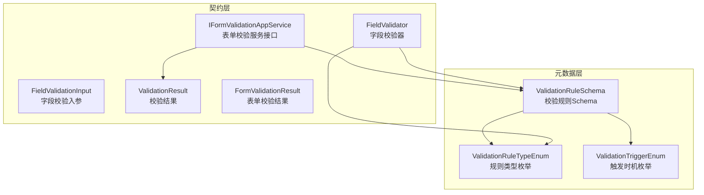
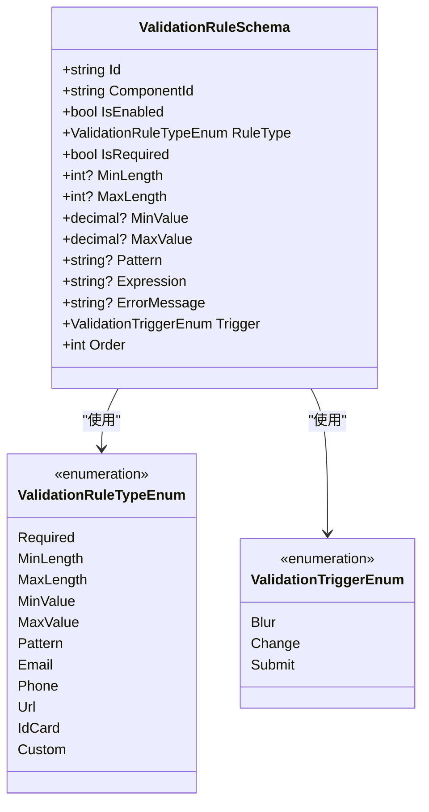
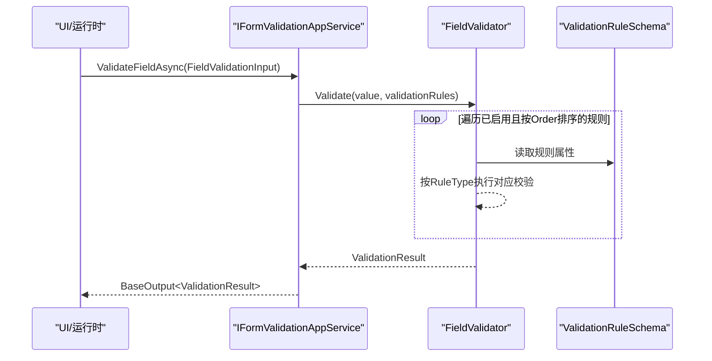
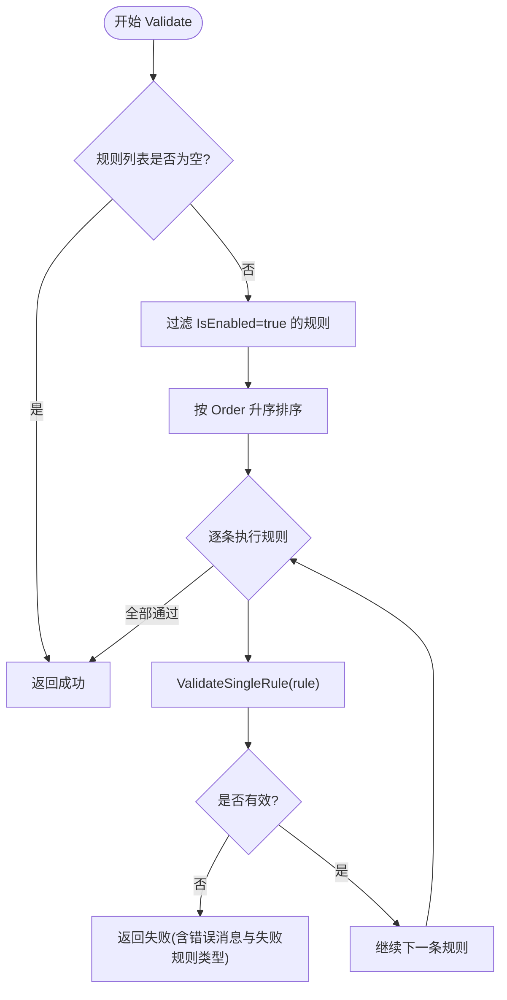
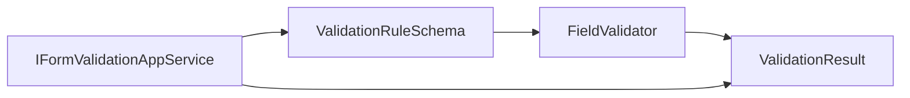
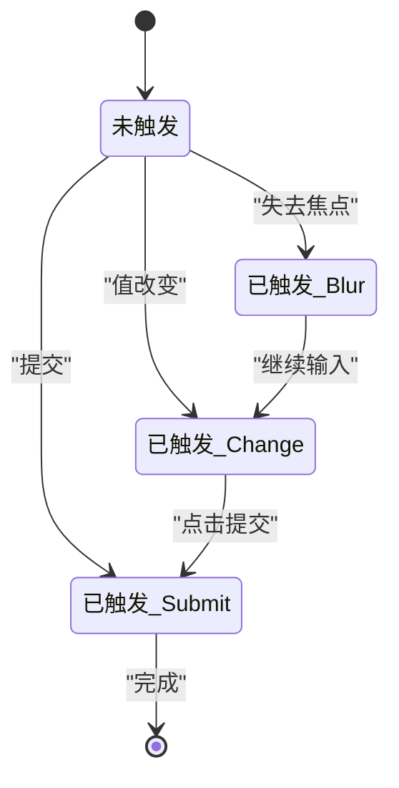

# 组件验证Schema

<cite>
**本文引用的文件**   
- [ValidationRuleSchema.cs](file://src/LowCode/Common/H.LowCode.MetaSchema/PropertySchemas/ValidationRuleSchema.cs)
- [FieldValidator.cs](file://src/LowCode/Common/H.LowCode.Application.Contracts/Services/FieldValidator.cs)
- [IFormValidationAppService.cs](file://src/LowCode/Common/H.LowCode.Application.Contracts/AppServices/IFormValidationAppService.cs)
</cite>

## 目录
1. [简介](#简介)
2. [项目结构与定位](#项目结构与定位)
3. [核心概念与数据结构](#核心概念与数据结构)
4. [架构总览](#架构总览)
5. [详细组件分析](#详细组件分析)
6. [依赖关系分析](#依赖关系分析)
7. [性能与复杂度](#性能与复杂度)
8. [配置示例与实战案例](#配置示例与实战案例)
9. [触发时机与执行流程](#触发时机与执行流程)
10. [错误处理与故障排查](#错误处理与故障排查)
11. [结论](#结论)

## 简介
本技术文档聚焦 H.AppLab 低代码平台中“组件验证 Schema”的设计与实现，围绕 ValidationRuleSchema 类及其关联的枚举、校验服务接口和纯逻辑校验器展开。内容覆盖：
- 规则标识（Id）、关联组件（ComponentId）与启用状态（IsEnabled）的管理方式
- 内置验证规则类型：必填、长度、数值范围、正则表达式、邮箱/手机/网址/身份证格式、自定义表达式
- 触发时机：失去焦点（Blur）、值改变（Change）、提交（Submit）
- 错误消息（ErrorMessage）与排序（Order）机制
- 验证执行流程、错误处理与多规则组合实战

## 项目结构与定位
该功能位于 LowCode 通用能力模块中，分为三层：
- 元数据层：定义验证规则的 Schema、枚举与 JSON 序列化映射
- 契约层：定义表单校验服务接口、输入输出模型以及纯逻辑校验器
- 应用层：对外暴露表单校验 API（接口定义），具体实现由运行时或宿主装配

**图示来源**
- [ValidationRuleSchema.cs:1-172](file://src/LowCode/Common/H.LowCode.MetaSchema/PropertySchemas/ValidationRuleSchema.cs#L1-L172)
- [IFormValidationAppService.cs:1-73](file://src/LowCode/Common/H.LowCode.Application.Contracts/AppServices/IFormValidationAppService.cs#L1-L73)
- [FieldValidator.cs:1-103](file://src/LowCode/Common/H.LowCode.Application.Contracts/Services/FieldValidator.cs#L1-L103)

**章节来源**
- [ValidationRuleSchema.cs:1-172](file://src/LowCode/Common/H.LowCode.MetaSchema/PropertySchemas/ValidationRuleSchema.cs#L1-L172)
- [IFormValidationAppService.cs:1-73](file://src/LowCode/Common/H.LowCode.Application.Contracts/AppServices/IFormValidationAppService.cs#L1-L73)

## 核心概念与数据结构
- ValidationRuleSchema：描述一条校验规则，包含规则标识、关联组件ID、是否启用、规则类型、参数、错误消息、触发时机与排序。
- ValidationRuleTypeEnum：内置规则类型，包括 Required、MinLength、MaxLength、MinValue、MaxValue、Pattern、Email、Phone、Url、IdCard、Custom。
- ValidationTriggerEnum：触发时机，包括 Blur（失去焦点）、Change（值改变）、Submit（提交）。
- ValidationResult/FormValidationResult：统一的结果封装，便于前端渲染错误提示。
- FieldValidator：纯逻辑校验器，按启用状态与 Order 排序后依次执行规则，遇到首个失败即返回。

**图示来源**
- [ValidationRuleSchema.cs:1-172](file://src/LowCode/Common/H.LowCode.MetaSchema/PropertySchemas/ValidationRuleSchema.cs#L1-L172)

**章节来源**
- [ValidationRuleSchema.cs:1-172](file://src/LowCode/Common/H.LowCode.MetaSchema/PropertySchemas/ValidationRuleSchema.cs#L1-L172)

## 架构总览
表单校验在系统中的调用路径为：
- 设计器/运行时通过 IFormValidationAppService.ValidateFieldAsync 发起字段级校验
- 服务端或客户端根据传入的 ValidationRuleSchema 列表，调用 FieldValidator.Validate 进行规则执行
- 最终返回 ValidationResult，上层可聚合为 FormValidationResult 展示所有字段的错误

**图示来源**
- [IFormValidationAppService.cs:1-73](file://src/LowCode/Common/H.LowCode.Application.Contracts/AppServices/IFormValidationAppService.cs#L1-L73)
- [FieldValidator.cs:1-103](file://src/LowCode/Common/H.LowCode.Application.Contracts/Services/FieldValidator.cs#L1-L103)

## 详细组件分析

### ValidationRuleSchema 规则体系
- 规则标识（Id）：用于唯一标识某条规则，便于在设计器中进行增删改查。
- 关联组件ID（ComponentId）：将规则绑定到具体组件实例，支持一个组件拥有多条规则。
- 启用状态（IsEnabled）：控制规则是否参与当前校验流程。
- 规则类型（RuleType）：决定校验逻辑分支。
- 规则参数：
  - Required：标记是否为必填。
  - MinLength/MaxLength：字符串长度边界。
  - MinValue/MaxValue：数值型范围边界。
  - Pattern：正则表达式模式。
  - Expression：自定义表达式占位符（由业务侧扩展解析）。
- 错误消息（ErrorMessage）：优先级高于默认提示，为空时使用默认文案。
- 触发时机（Trigger）：Blur、Change、Submit。
- 排序（Order）：决定同组件下多条启用规则的优先顺序。

**章节来源**
- [ValidationRuleSchema.cs:1-172](file://src/LowCode/Common/H.LowCode.MetaSchema/PropertySchemas/ValidationRuleSchema.cs#L1-L172)

### FieldValidator 校验引擎
- 入口方法 Validate：接收字段值和规则列表，过滤已启用的规则并按 Order 升序执行。
- 单规则校验 ValidateSingleRule：根据 RuleType 分发到不同校验分支，异常时统一捕获并返回失败结果。
- 短路策略：一旦某个规则失败，立即返回该错误，不再继续后续规则。

**图示来源**
- [FieldValidator.cs:1-103](file://src/LowCode/Common/H.LowCode.Application.Contracts/Services/FieldValidator.cs#L1-L103)

**章节来源**
- [FieldValidator.cs:1-103](file://src/LowCode/Common/H.LowCode.Application.Contracts/Services/FieldValidator.cs#L1-L103)

### IFormValidationAppService 服务契约
- ValidateFieldAsync：对单个字段值进行校验，返回基础输出包装的 ValidationResult。
- GetValidationRulesAsync：根据组件ID和组件集合获取校验规则列表，供 UI 渲染或预校验使用。
- 输入输出：
  - FieldValidationInput：包含 Value 与 ValidationRules。
  - ValidationResult：IsValid、ErrorMessage、FailedRuleType。
  - FormValidationResult：聚合多个字段的校验结果与错误消息列表。

**章节来源**
- [IFormValidationAppService.cs:1-73](file://src/LowCode/Common/H.LowCode.Application.Contracts/AppServices/IFormValidationAppService.cs#L1-L73)

## 依赖关系分析
- ValidationRuleSchema 作为元数据被 FieldValidator 消费；
- FieldValidator 不依赖外部库（除正则表达式），可运行在服务端与客户端；
- IFormValidationAppService 暴露校验能力给上层应用，解耦了 UI 与校验逻辑；
- ValidationResult/FormValidationResult 作为统一的数据传输对象，避免散落的错误结构。

**图示来源**
- [ValidationRuleSchema.cs:1-172](file://src/LowCode/Common/H.LowCode.MetaSchema/PropertySchemas/ValidationRuleSchema.cs#L1-L172)
- [FieldValidator.cs:1-103](file://src/LowCode/Common/H.LowCode.Application.Contracts/Services/FieldValidator.cs#L1-L103)
- [IFormValidationAppService.cs:1-73](file://src/LowCode/Common/H.LowCode.Application.Contracts/AppServices/IFormValidationAppService.cs#L1-L73)

**章节来源**
- [ValidationRuleSchema.cs:1-172](file://src/LowCode/Common/H.LowCode.MetaSchema/PropertySchemas/ValidationRuleSchema.cs#L1-L172)
- [FieldValidator.cs:1-103](file://src/LowCode/Common/H.LowCode.Application.Contracts/Services/FieldValidator.cs#L1-L103)
- [IFormValidationAppService.cs:1-73](file://src/LowCode/Common/H.LowCode.Application.Contracts/AppServices/IFormValidationAppService.cs#L1-L73)

## 性能与复杂度
- 时间复杂度：O(n log n) 来自排序，n 为启用规则数量；实际校验阶段为 O(n)。
- 空间复杂度：O(n) 用于存储排序后的规则列表。
- 优化建议：
  - 在 UI 层缓存已排序的规则列表，避免重复排序。
  - 对频繁触发的 Change 场景，可对复杂正则或自定义表达式做延迟校验或防抖。
  - 对大量字段批量校验，采用并行化聚合 FormValidationResult。

[本节为通用性能讨论，不涉及具体文件分析]

## 配置示例与实战案例

### 示例一：用户登录表单（必填+手机号+提交时校验）
- 用户名：
  - RuleType=Required
  - Trigger=Blur
  - ErrorMessage="请输入用户名"
- 手机号：
  - RuleType=Phone
  - Trigger=Change
  - ErrorMessage="请输入有效的手机号码"
- 密码：
  - RuleType=Required
  - RuleType=MinLength（例如 6）
  - Trigger=Submit
  - ErrorMessage="密码不能少于6个字符"

说明：
- 各规则通过 Order 控制优先级，如先必填再长度。
- Trigger 决定何时触发：Blur 在失焦时，Change 在输入变化时，Submit 在提交时。

### 示例二：商品发布（长度+数值范围+URL+正则）
- 标题：
  - RuleType=MinLength=3, MaxLength=100
  - Trigger=Blur
- 价格：
  - RuleType=MinValue=0, MaxValue=999999.99
  - Trigger=Change
- 商品图片：
  - RuleType=Url
  - Trigger=Blur
- SKU编码：
  - RuleType=Pattern（例如只允许字母数字）
  - Trigger=Change

说明：
- 通过 ErrorMessage 定制友好提示，未设置则回退至默认文案。

### 示例三：注册表单（邮箱+身份证+自定义表达式）
- 邮箱：
  - RuleType=Email
  - Trigger=Blur
- 身份证号：
  - RuleType=IdCard
  - Trigger=Submit
- 业务扩展字段：
  - RuleType=Custom
  - Expression=业务表达式占位符（由上层扩展解析）

注意：
- Custom 分支在当前 FieldValidator 实现中未执行业务逻辑，需由上层注入表达式解析器或替换校验分支以支持动态计算。

[本节提供配置思路与组合示例，不直接引用具体源码片段]

## 触发时机与执行流程
- Blur（失去焦点）：适合非侵入式校验，减少输入时的干扰。
- Change（值改变）：适合实时反馈，但需注意性能与用户体验平衡。
- Submit（提交）：适合全局一致性校验与跨字段联动校验。

**图示来源**
- [ValidationRuleSchema.cs:1-172](file://src/LowCode/Common/H.LowCode.MetaSchema/PropertySchemas/ValidationRuleSchema.cs#L1-L172)

**章节来源**
- [ValidationRuleSchema.cs:1-172](file://src/LowCode/Common/H.LowCode.MetaSchema/PropertySchemas/ValidationRuleSchema.cs#L1-L172)

## 错误处理与故障排查
- 错误消息优先级：
  - 若规则设置了 ErrorMessage，使用该消息；否则使用默认提示文案。
- 异常捕获：
  - FieldValidator 对所有规则校验进行 try/catch，发生异常时返回失败结果，错误信息中包含异常消息。
- 常见排查点：
  - 规则未生效：检查 IsEnabled 是否为 true。
  - 规则顺序错乱：调整 Order，确保必填等前置规则在前。
  - 正则报错：检查 Pattern 语法是否正确，必要时在 UI 层提前校验正则。
  - 自定义表达式无效：确认上层是否实现了 Expression 的解析与执行。

**章节来源**
- [FieldValidator.cs:1-103](file://src/LowCode/Common/H.LowCode.Application.Contracts/Services/FieldValidator.cs#L1-L103)

## 结论
ValidationRuleSchema 提供了灵活的组件级校验建模能力，配合 FieldValidator 的短路执行与 IFormValidationAppService 的服务化接口，形成了从元数据到执行的全链路验证方案。通过 RuleType、Trigger、ErrorMessage 与 Order 的组合，可以覆盖绝大多数业务校验场景；对于更复杂的业务逻辑，可通过 Custom 表达式与上层扩展点进行增强。建议在 UI 层合理选择触发时机，并对高频变更场景做性能优化，以提升整体用户体验。