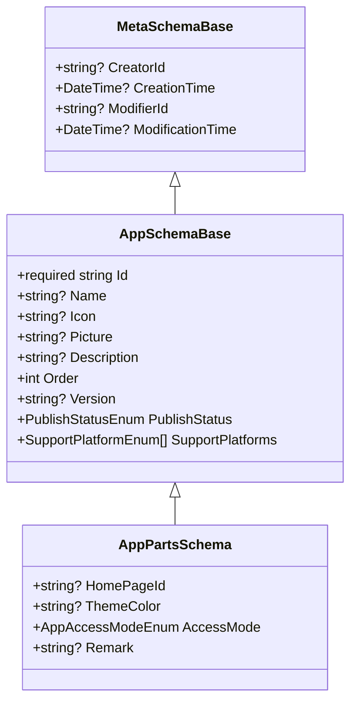
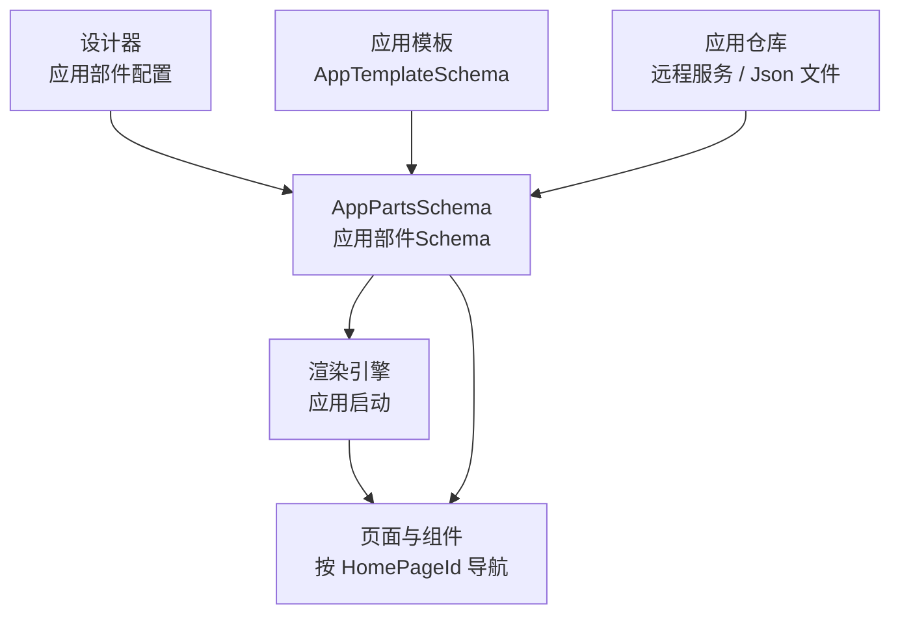
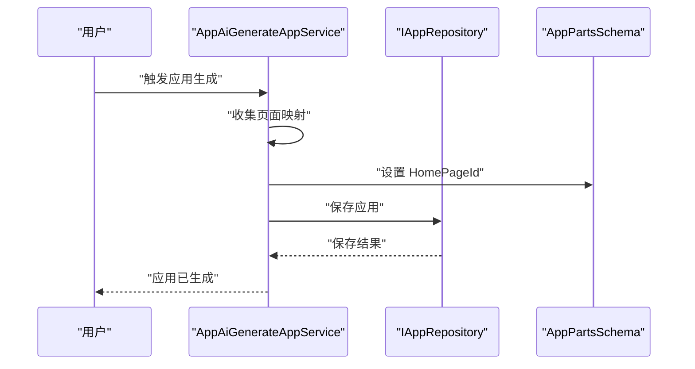
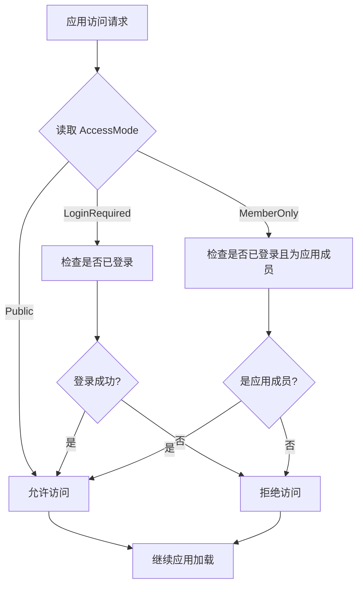
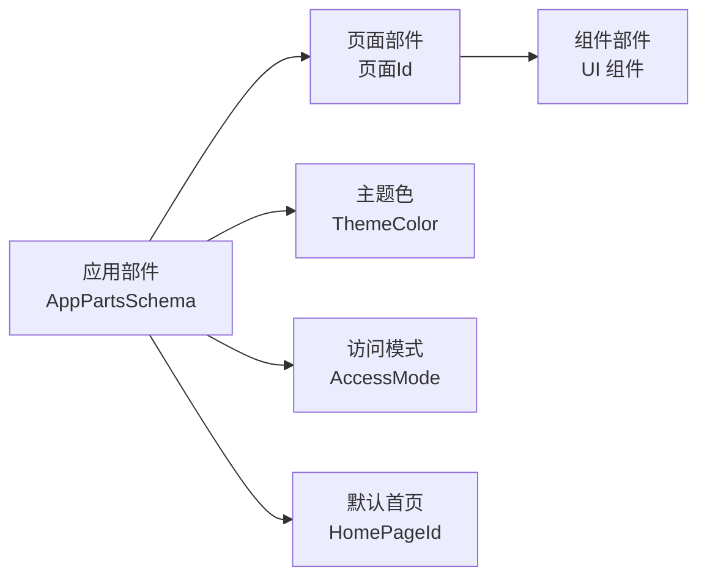
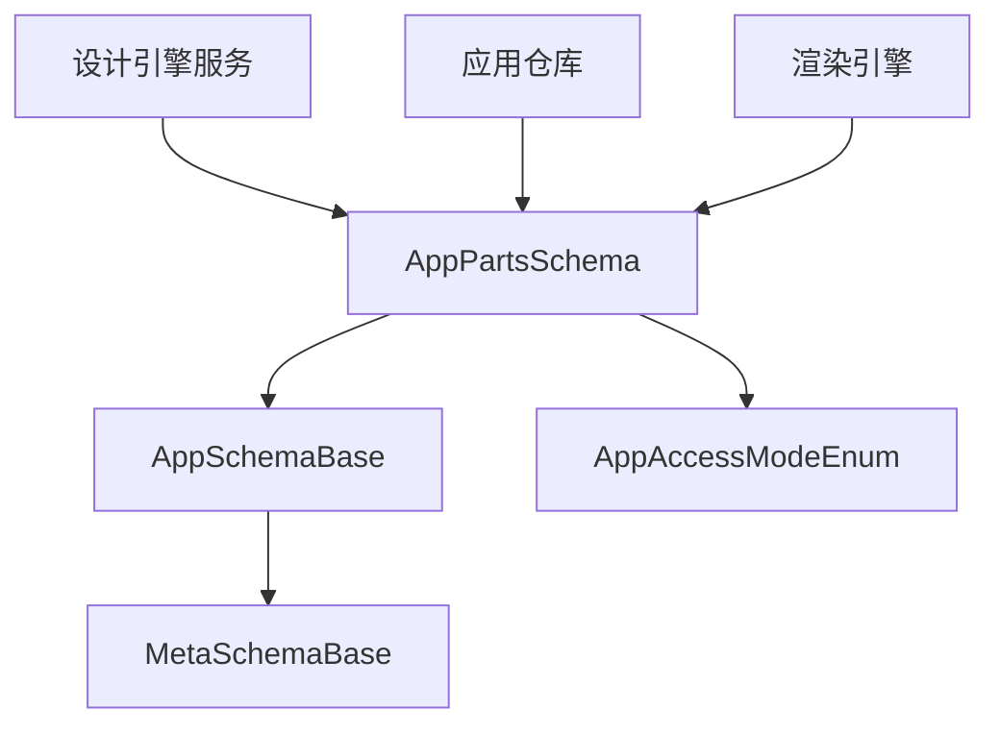

# 应用部件Schema

<cite>
**本文引用的文件**   
- [AppPartsSchema.cs](file://src/LowCode/Common/H.LowCode.MetaSchema.DesignEngine/AppPartsSchema.cs)
- [AppSchemaBase.cs](file://src/LowCode/Common/H.LowCode.MetaSchema/AppSchemaBase.cs)
- [MetaSchemaBase.cs](file://src/LowCode/Common/H.LowCode.MetaSchema/MetaSchemaBase.cs)
- [AppTemplateSchema.cs](file://src/LowCode/Common/H.LowCode.MetaSchema.DesignEngine/AppTemplateSchema.cs)
- [AppApplicationService.cs](file://src/LowCode/DesignEngine/H.LowCode.DesignEngine.Application/AppServices/AppApplicationService.cs)
- [AppAiGenerateAppService.cs](file://src/LowCode/DesignEngine/H.LowCode.DesignEngine.Application/AppServices/AppAiGenerateAppService.cs)
- [AppRemoteServiceRepository.cs](file://src/LowCode/DesignEngine/H.LowCode.DesignEngine.Repository.RemoteService/Repositories/AppRemoteServiceRepository.cs)
- [AppFileRepository.cs](file://src/LowCode/DesignEngine/H.LowCode.DesignEngine.Repository.JsonFile/Repositories/AppFileRepository.cs)
</cite>

## 目录
1. [简介](#简介)
2. [项目结构定位](#项目结构定位)
3. [核心组件](#核心组件)
4. [架构总览](#架构总览)
5. [详细组件分析](#详细组件分析)
6. [依赖关系分析](#依赖关系分析)
7. [性能与可维护性](#性能与可维护性)
8. [故障排查指南](#故障排查指南)
9. [结论](#结论)

## 简介
本文面向 H.AppLab 低代码平台中的“应用部件 Schema”，重点解释 `AppPartsSchema` 类的设计目标、字段语义、默认值策略，以及其在应用元数据体系中的核心地位。文档围绕以下主题展开：
- 默认首页 `HomePageId` 的配置与页面导航入口。
- 应用主题色 `ThemeColor` 的视觉品牌控制。
- 访问模式 `AccessMode` 的三种类型：公开访问、登录后可访问、仅应用成员可访问，及其安全含义。
- 应用备注 `Remark` 的使用场景与元数据管理建议。
- 应用部件与页面部件、组件部件之间的层次关系与依赖管理。
- 应用启动流程与权限验证的最佳实践。

## 项目结构定位
`AppPartsSchema` 属于低代码平台的“元模型（MetaSchema）”层，负责描述一个“应用部件”的结构化配置。它继承自 `AppSchemaBase`，并间接继承 `MetaSchemaBase`，从而复用应用级通用标识、名称、图标、排序、版本、发布状态和平台支持等元信息。

该图展示了元数据基类的继承链：所有应用相关元数据共享创建者、修改者、时间戳等审计字段；应用级基础属性在 `AppSchemaBase` 中统一定义；`AppPartsSchema` 在此基础上扩展了运行期行为相关的配置项。

**图表来源**
- [MetaSchemaBase.cs:1-18](file://src/LowCode/Common/H.LowCode.MetaSchema/MetaSchemaBase.cs#L1-L18)
- [AppSchemaBase.cs:1-31](file://src/LowCode/Common/H.LowCode.MetaSchema/AppSchemaBase.cs#L1-L31)
- [AppPartsSchema.cs:1-51](file://src/LowCode/Common/H.LowCode.MetaSchema.DesignEngine/AppPartsSchema.cs#L1-L51)

**章节来源**
- [AppPartsSchema.cs:1-51](file://src/LowCode/Common/H.LowCode.MetaSchema.DesignEngine/AppPartsSchema.cs#L1-L51)
- [AppSchemaBase.cs:1-31](file://src/LowCode/Common/H.LowCode.MetaSchema/AppSchemaBase.cs#L1-L31)
- [MetaSchemaBase.cs:1-18](file://src/LowCode/Common/H.LowCode.MetaSchema/MetaSchemaBase.cs#L1-L18)

## 核心组件
`AppPartsSchema` 是应用部件的核心配置对象，承担以下职责：
- 指定应用的默认首页路由入口。
- 定义应用主题主色。
- 声明应用的访问控制策略。
- 承载应用备注与应用元数据。

关键字段说明如下：
- `HomePageId`：默认首页对应的页面标识，用于应用启动后直接导航到该页面。
- `ThemeColor`：应用主题主色，使用十六进制颜色字符串表示，例如 `#165DFF`。
- `AccessMode`：应用访问模式，类型为 `AppAccessModeEnum`，默认值为“登录后可访问”。
- `Remark`：应用备注，用于记录业务说明、运维备注或元数据扩展信息。

这些字段通过 JSON 序列化特性映射为简洁的键名，便于在设计器、模板、远程仓库和本地文件中以紧凑格式存储。

**章节来源**
- [AppPartsSchema.cs:1-51](file://src/LowCode/Common/H.LowCode.MetaSchema.DesignEngine/AppPartsSchema.cs#L1-L51)

## 架构总览
从整体架构看，`AppPartsSchema` 处于“设计引擎”与“渲染引擎”之间的元数据契约层。设计器生成或编辑应用部件时，会写入 `AppPartsSchema`；渲染引擎在加载应用时读取该 Schema，并据此完成页面初始化、主题注入和访问控制判断。

- 设计器负责产出或修改 `AppPartsSchema`。
- 模板系统可以基于 `AppTemplateSchema` 生成默认 `AppPartsSchema`。
- 仓库层负责持久化应用部件元数据。
- 渲染引擎根据 `AppPartsSchema` 驱动应用启动、主题设置和权限校验。

**图表来源**
- [AppPartsSchema.cs:1-51](file://src/LowCode/Common/H.LowCode.MetaSchema.DesignEngine/AppPartsSchema.cs#L1-L51)
- [AppTemplateSchema.cs:20-30](file://src/LowCode/Common/H.LowCode.MetaSchema.DesignEngine/AppTemplateSchema.cs#L20-L30)
- [AppRemoteServiceRepository.cs](file://src/LowCode/DesignEngine/H.LowCode.DesignEngine.Repository.RemoteService/Repositories/AppRemoteServiceRepository.cs)
- [AppFileRepository.cs](file://src/LowCode/DesignEngine/H.LowCode.DesignEngine.Repository.JsonFile/Repositories/AppFileRepository.cs)

## 详细组件分析

### AppPartsSchema 设计理念
`AppPartsSchema` 将“应用如何被用户看到和使用”的关键参数抽象为一个轻量数据结构。其设计特点包括：
- **最小必要配置**：只暴露运行时必需字段，如默认首页、主题色、访问模式和备注。
- **强约束默认值**：访问模式默认设为“登录后可访问”，避免未显式配置时出现过于宽松的公开访问。
- **可扩展元数据**：通过继承 `AppSchemaBase` 和 `MetaSchemaBase`，复用统一的应用标识、版本、发布状态、平台支持和审计字段。
- **JSON 友好命名**：使用短键名降低元数据体积，同时保持可读性和兼容性。

这种设计使应用部件既能作为设计器中的可视化配置对象，又能作为渲染引擎中的稳定契约对象。

**章节来源**
- [AppPartsSchema.cs:1-51](file://src/LowCode/Common/H.LowCode.MetaSchema.DesignEngine/AppPartsSchema.cs#L1-L51)
- [AppSchemaBase.cs:1-31](file://src/LowCode/Common/H.LowCode.MetaSchema/AppSchemaBase.cs#L1-L31)
- [MetaSchemaBase.cs:1-18](file://src/LowCode/Common/H.LowCode.MetaSchema/MetaSchemaBase.cs#L1-L18)

### 默认首页 HomePageId
`HomePageId` 表示应用启动后的第一个页面标识。它在 AI 生成应用流程中会被自动填充：当系统根据页面列表映射出一个可用页面时，会将该页面的标识赋值给 `HomePageId`，并保存回应用。

典型调用路径如下：

- 如果存在有效页面映射，则选择其中一个页面作为默认首页。
- 如果没有有效页面，则应用可能缺少默认入口，需要后续手动配置。
- 该逻辑体现了“生成即可用”的低代码体验：尽可能减少人工配置成本。

**图表来源**
- [AppAiGenerateAppService.cs:95-100](file://src/LowCode/DesignEngine/H.LowCode.DesignEngine.Application/AppServices/AppAiGenerateAppService.cs#L95-L100)

**章节来源**
- [AppAiGenerateAppService.cs:95-100](file://src/LowCode/DesignEngine/H.LowCode.DesignEngine.Application/AppServices/AppAiGenerateAppService.cs#L95-L100)

### 应用主题色 ThemeColor
`ThemeColor` 用于控制应用的主色调，通常以十六进制颜色字符串表示。它与模板系统中的主题色字段同属视觉配置范畴，但作用域不同：
- `AppTemplateSchema.ThemeColor`：模板级别的推荐主题色。
- `AppPartsSchema.ThemeColor`：具体应用实例的主题主色。

渲染引擎可以在应用启动时读取该值，并将其注入全局主题上下文，从而影响导航栏、按钮、高亮等界面元素。

最佳实践：
- 前端应校验颜色值格式，避免非法十六进制值导致样式异常。
- 后端应允许为空，以便使用框架默认主题。
- 若模板提供主题色，可在应用复制时优先使用模板值，再由用户覆盖。

**章节来源**
- [AppPartsSchema.cs:13-17](file://src/LowCode/Common/H.LowCode.MetaSchema.DesignEngine/AppPartsSchema.cs#L13-L17)
- [AppTemplateSchema.cs:20-30](file://src/LowCode/Common/H.LowCode.MetaSchema.DesignEngine/AppTemplateSchema.cs#L20-L30)

### 访问模式 AccessMode
`AccessMode` 是应用的安全边界入口。当前枚举定义了三种访问模式：

| 枚举值 | 中文含义 | 访问条件 | 典型用途 |
|---|---|---|---|
| `Public` | 公开访问 | 无需登录 | 公开展示型应用、营销页、帮助文档 |
| `LoginRequired` | 登录后可访问 | 需要用户登录 | 内部工具、个人工作台、普通业务应用 |
| `MemberOnly` | 仅应用成员可访问 | 需要登录且属于应用成员 | 部门协作应用、敏感业务流程 |

默认值为 `LoginRequired`，这意味着未显式配置访问模式的应用不会意外成为公开应用，符合安全优先原则。

安全控制机制建议：
- 在应用启动前进行访问模式检查。
- `Public` 模式下仍应对敏感接口做服务端鉴权。
- `LoginRequired` 模式下要求身份认证。
- `MemberOnly` 模式下除认证外还需校验成员关系。
- 不应仅依赖前端路由隐藏敏感入口，必须配合后端权限校验。

该流程图表达了访问控制的决策顺序，实际实现时应结合身份认证服务和组织成员服务。

**图表来源**
- [AppPartsSchema.cs:19-50](file://src/LowCode/Common/H.LowCode.MetaSchema.DesignEngine/AppPartsSchema.cs#L19-L50)

**章节来源**
- [AppPartsSchema.cs:19-51](file://src/LowCode/Common/H.LowCode.MetaSchema.DesignEngine/AppPartsSchema.cs#L19-L51)

### 应用备注 Remark
`Remark` 是一个可选的备注字段，适合用于：
- 记录应用的业务背景。
- 记录维护人、版本号、上线日期等非结构化信息。
- 作为扩展元数据的占位字段。
- 向运营、测试、运维人员提供快速说明。

注意事项：
- 备注不应用于存放敏感信息。
- 如需结构化元数据，建议优先使用已有元字段或扩展元数据机制，而不是把所有信息塞入备注。
- 在应用列表、详情页中可展示备注，提升可维护性。

**章节来源**
- [AppPartsSchema.cs:25-28](file://src/LowCode/Common/H.LowCode.MetaSchema.DesignEngine/AppPartsSchema.cs#L25-L28)

### 应用部件与页面部件、组件部件的关系
在 H.AppLab 低代码平台中，应用部件是最高层级的可编排单元。页面部件是应用内的页面集合，组件部件则是页面可复用的 UI 单元。三者的关系可以概括为：

- 应用部件由多个页面部件组成。
- 页面部件由多个组件部件组合而成。
- `AppPartsSchema.HomePageId` 指向某个页面部件的唯一标识。
- 应用主题、访问模式、备注等元信息作用于应用层，而页面和组件更关注 UI 结构和交互。

依赖管理建议：
- 删除页面时，应检查是否仍有其他应用引用该页面。
- 修改组件接口时，应评估对页面和应用的兼容影响。
- 应用迁移或升级时，应校验 `HomePageId` 是否存在。

**图表来源**
- [AppPartsSchema.cs:8-17](file://src/LowCode/Common/H.LowCode.MetaSchema.DesignEngine/AppPartsSchema.cs#L8-L17)

## 依赖关系分析
`AppPartsSchema` 的直接依赖包括：
- `AppSchemaBase`：提供应用级通用字段。
- `MetaSchemaBase`：提供创建者、修改者和时间戳等审计字段。
- `AppAccessModeEnum`：定义访问模式枚举。

间接依赖包括：
- 设计器和服务端应用服务，用于创建、更新、查询应用。
- 仓库层远程服务和本地文件仓库，用于持久化应用元数据。
- 渲染引擎，用于读取 Schema 并驱动应用启动。

**图表来源**
- [AppPartsSchema.cs:1-51](file://src/LowCode/Common/H.LowCode.MetaSchema.DesignEngine/AppPartsSchema.cs#L1-L51)
- [AppSchemaBase.cs:1-31](file://src/LowCode/Common/H.LowCode.MetaSchema/AppSchemaBase.cs#L1-L31)
- [MetaSchemaBase.cs:1-18](file://src/LowCode/Common/H.LowCode.MetaSchema/MetaSchemaBase.cs#L1-L18)

**章节来源**
- [AppPartsSchema.cs:1-51](file://src/LowCode/Common/H.LowCode.MetaSchema.DesignEngine/AppPartsSchema.cs#L1-L51)
- [AppSchemaBase.cs:1-31](file://src/LowCode/Common/H.LowCode.MetaSchema/AppSchemaBase.cs#L1-L31)
- [MetaSchemaBase.cs:1-18](file://src/LowCode/Common/H.LowCode.MetaSchema/MetaSchemaBase.cs#L1-L18)

## 性能与可维护性
- `AppPartsSchema` 是轻量元数据对象，序列化开销很小，适合作为频繁读写的配置载体。
- 默认值策略降低了无效配置带来的分支判断。
- 使用统一基类减少了重复字段，有利于长期维护和版本演进。
- 建议在渲染引擎中对 `HomePageId` 做缓存，避免每次请求都解析应用元数据。
- 建议在访问控制链路中尽早失败，减少不必要的页面资源加载。

[本节为通用性能建议，不直接分析具体文件]

## 故障排查指南
常见问题及处理建议：

1. **应用打开后没有进入默认首页**
   - 检查 `HomePageId` 是否为空。
   - 检查对应页面是否仍存在且未被禁用。
   - 检查 AI 生成流程是否正确赋值。

2. **主题色不生效**
   - 确认 `ThemeColor` 是否为合法十六进制颜色。
   - 确认渲染引擎是否读取并应用该值。
   - 检查是否有更高优先级样式覆盖。

3. **访问模式不符合预期**
   - 确认 `AccessMode` 是否被显式设置为 `Public`。
   - 确认后端鉴权逻辑是否区分三种模式。
   - 检查用户是否登录以及是否为应用成员。

4. **备注内容丢失或显示异常**
   - 检查备注字段是否被截断或格式化错误。
   - 确认前端是否正确渲染备注。
   - 检查是否误用备注字段存储敏感信息。

**章节来源**
- [AppAiGenerateAppService.cs:95-100](file://src/LowCode/DesignEngine/H.LowCode.DesignEngine.Application/AppServices/AppAiGenerateAppService.cs#L95-L100)
- [AppPartsSchema.cs:8-28](file://src/LowCode/Common/H.LowCode.MetaSchema.DesignEngine/AppPartsSchema.cs#L8-L28)

## 结论
`AppPartsSchema` 是 H.AppLab 低代码平台中应用部件的核心 Schema，它将应用的入口、主题、访问控制和备注集中到一个结构化配置对象中。通过继承统一基类，它既保持了元数据的一致性，又具备足够的扩展空间。配合 `AppAccessModeEnum`，平台可以为不同类型的应用提供清晰的安全边界；配合 `HomePageId`，平台可以实现“生成即可用”的低代码体验。

在实际使用中，建议：
- 始终明确配置 `AccessMode`，不要依赖隐式默认值。
- 合理设置 `HomePageId`，确保应用有明确的启动入口。
- 使用 `ThemeColor` 统一管理应用视觉风格。
- 使用 `Remark` 记录必要的业务和维护信息。
- 在设计和渲染两端保持一致的 Schema 契约，避免配置漂移。

[本节为总结性内容，不直接分析具体文件]