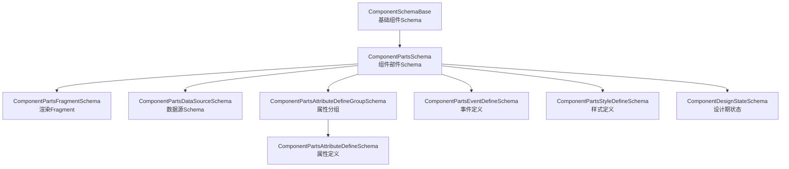
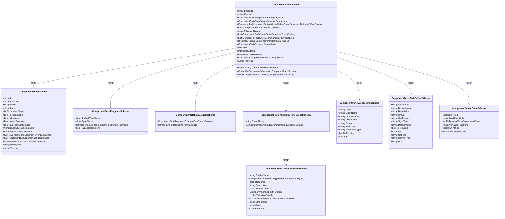
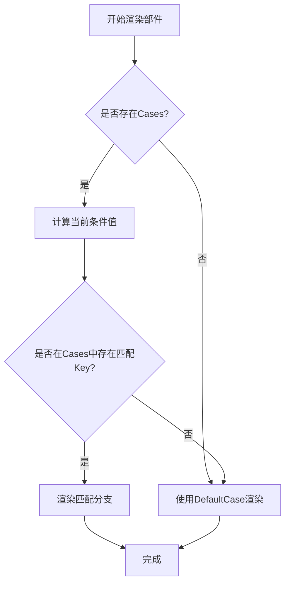
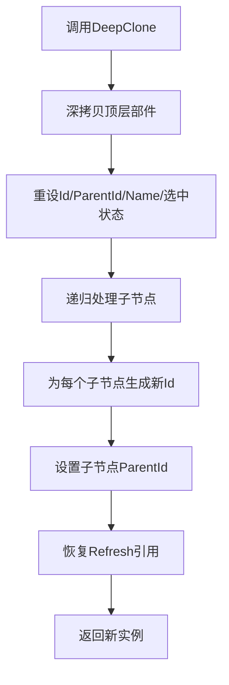
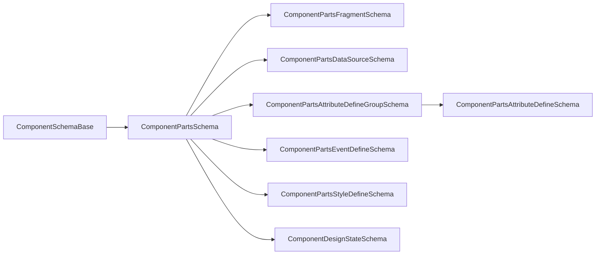

# 组件部件Schema

<cite>
**本文引用的文件**   
- [ComponentPartsSchema.cs](file://src/LowCode/Common/H.LowCode.MetaSchema.DesignEngine/ComponentPartsSchema.cs)
- [ComponentSchemaBase.cs](file://src/LowCode/Common/H.LowCode.MetaSchema/ComponentSchemaBase.cs)
- [ComponentPartsFragmentSchema.cs](file://src/LowCode/Common/H.LowCode.MetaSchema.DesignEngine/PropertySchemas/ComponentPartsFragmentSchema.cs)
- [ComponentFragmentSchemaBase.cs](file://src/LowCode/Common/H.LowCode.MetaSchema/PropertySchemas/ComponentFragmentSchemaBase.cs)
- [ComponentPartsAttributeDefineGroupSchema.cs](file://src/LowCode/Common/H.LowCode.MetaSchema.DesignEngine/PropertySchemas/ComponentPartsAttributeDefineGroupSchema.cs)
- [ComponentPartsAttributeDefineSchema.cs](file://src/LowCode/Common/H.LowCode.MetaSchema.DesignEngine/PropertySchemas/ComponentPartsAttributeDefineSchema.cs)
- [ComponentPartsDataSourceSchema.cs](file://src/LowCode/Common/H.LowCode.MetaSchema.DesignEngine/DataSourceSchemas/ComponentPartsDataSourceSchema.cs)
- [ComponentPartsEventDefineSchema.cs](file://src/LowCode/Common/H.LowCode.MetaSchema.DesignEngine/PropertySchemas/ComponentPartsEventDefineSchema.cs)
- [ComponentPartsStyleDefineSchema.cs](file://src/LowCode/Common/H.LowCode.MetaSchema.DesignEngine/PropertySchemas/ComponentPartsStyleDefineSchema.cs)
- [ComponentDesignStateSchema.cs](file://src/LowCode/Common/H.LowCode.MetaSchema.DesignEngine/PropertySchemas/ComponentDesignStateSchema.cs)
</cite>

## 目录
1. [引言](#引言)
2. [项目结构与定位](#项目结构与定位)
3. [核心设计理念](#核心设计理念)
4. [架构总览](#架构总览)
5. [详细结构说明](#详细结构说明)
6. [条件分支与默认分支机制](#条件分支与默认分支机制)
7. [属性定义分组与属性系统](#属性定义分组与属性系统)
8. [数据源配置与模板](#数据源配置与模板)
9. [事件支持与事件定义](#事件支持与事件定义)
10. [样式定义与可复用业务组件](#样式定义与可复用业务组件)
11. [深克隆、状态管理与设计器集成](#深克隆状态管理与设计器集成)
12. [依赖关系分析](#依赖关系分析)
13. [性能与可扩展性](#性能与可扩展性)
14. [常见问题排查](#常见问题排查)
15. [结论](#结论)

## 引言
本文件面向 H.AppLab 低代码平台中的“组件部件 Schema”，重点解释 `ComponentPartsSchema` 类在组件体系中的核心作用。该 Schema 用于描述一个可复用的“部件”（Part），包括其标识、渲染 Fragment、属性定义、数据源、事件、样式、子节点、条件分支以及设计期状态等。它既服务于设计器的可视化编辑，也作为运行时渲染和持久化的元数据契约。

## 项目结构与定位
`ComponentPartsSchema` 位于低代码通用元数据设计期模块中，继承自基础组件 Schema，并通过一系列 Property Schemas 和 DataSource Schemas 扩展出完整的部件定义能力。

**图表来源**
- [ComponentSchemaBase.cs:1-110](file://src/LowCode/Common/H.LowCode.MetaSchema/ComponentSchemaBase.cs#L1-L110)
- [ComponentPartsSchema.cs:1-229](file://src/LowCode/Common/H.LowCode.MetaSchema.DesignEngine/ComponentPartsSchema.cs#L1-L229)
- [ComponentPartsFragmentSchema.cs:1-38](file://src/LowCode/Common/H.LowCode.MetaSchema.DesignEngine/PropertySchemas/ComponentPartsFragmentSchema.cs#L1-L38)
- [ComponentPartsDataSourceSchema.cs:1-18](file://src/LowCode/Common/H.LowCode.MetaSchema.DesignEngine/DataSourceSchemas/ComponentPartsDataSourceSchema.cs#L1-L18)
- [ComponentPartsAttributeDefineGroupSchema.cs:1-12](file://src/LowCode/Common/H.LowCode.MetaSchema.DesignEngine/PropertySchemas/ComponentPartsAttributeDefineGroupSchema.cs#L1-L12)
- [ComponentPartsAttributeDefineSchema.cs:1-98](file://src/LowCode/Common/H.LowCode.MetaSchema.DesignEngine/PropertySchemas/ComponentPartsAttributeDefineSchema.cs#L1-L98)
- [ComponentPartsEventDefineSchema.cs:1-60](file://src/LowCode/Common/H.LowCode.MetaSchema.DesignEngine/PropertySchemas/ComponentPartsEventDefineSchema.cs#L1-L60)
- [ComponentPartsStyleDefineSchema.cs:1-78](file://src/LowCode/Common/H.LowCode.MetaSchema.DesignEngine/PropertySchemas/ComponentPartsStyleDefineSchema.cs#L1-L78)
- [ComponentDesignStateSchema.cs:1-40](file://src/LowCode/Common/H.LowCode.MetaSchema.DesignEngine/PropertySchemas/ComponentDesignStateSchema.cs#L1-L40)

**章节来源**
- [ComponentSchemaBase.cs:1-110](file://src/LowCode/Common/H.LowCode.MetaSchema/ComponentSchemaBase.cs#L1-L110)
- [ComponentPartsSchema.cs:1-229](file://src/LowCode/Common/H.LowCode.MetaSchema.DesignEngine/ComponentPartsSchema.cs#L1-L229)

## 核心设计理念
`ComponentPartsSchema` 的设计目标是把“部件”定义为一种可被设计器拖拽、预览、配置、发布并可被页面或应用复用的 UI 单元。其核心思想包括：

- **标识分离**：通过“组件库Id + 部件Id”组合唯一标识一个部件定义，同时为每个实例生成独立实例Id。
- **渲染解耦**：使用 Fragment 描述渲染内容，支持原生 HTML 标签和 .NET 组件类型名。
- **属性系统化**：通过 AttributeDefineGroups 将属性分组，并提供类型化取值、校验规则和选项配置。
- **数据驱动**：支持 DataSource 与 ItemTemplate，使部件可以绑定列表并自定义列表项渲染。
- **事件契约化**：通过 SupportEvents 声明支持的事件集合，EventDefines 提供事件元信息，便于设计器展示和绑定。
- **样式结构化**：StyleDefines 暴露 CSS 相关属性的定义，让设计器和主题系统统一控制外观。
- **条件渲染**：Cases 与 DefaultCase 支持基于条件的多分支渲染。
- **设计期状态隔离**：DesignState 仅在设计器中使用，不参与持久化。
- **深克隆与合并**：支持部件实例的深拷贝与从部件定义到实例的属性合并。

**章节来源**
- [ComponentPartsSchema.cs:1-229](file://src/LowCode/Common/H.LowCode.MetaSchema.DesignEngine/ComponentPartsSchema.cs#L1-L229)

## 架构总览
下图展示了部件 Schema 的核心字段与其在系统中的职责边界。

**图表来源**
- [ComponentSchemaBase.cs:1-110](file://src/LowCode/Common/H.LowCode.MetaSchema/ComponentSchemaBase.cs#L1-L110)
- [ComponentPartsSchema.cs:1-229](file://src/LowCode/Common/H.LowCode.MetaSchema.DesignEngine/ComponentPartsSchema.cs#L1-L229)
- [ComponentPartsFragmentSchema.cs:1-38](file://src/LowCode/Common/H.LowCode.MetaSchema.DesignEngine/PropertySchemas/ComponentPartsFragmentSchema.cs#L1-L38)
- [ComponentPartsDataSourceSchema.cs:1-18](file://src/LowCode/Common/H.LowCode.MetaSchema.DesignEngine/DataSourceSchemas/ComponentPartsDataSourceSchema.cs#L1-L18)
- [ComponentPartsAttributeDefineGroupSchema.cs:1-12](file://src/LowCode/Common/H.LowCode.MetaSchema.DesignEngine/PropertySchemas/ComponentPartsAttributeDefineGroupSchema.cs#L1-L12)
- [ComponentPartsAttributeDefineSchema.cs:1-98](file://src/LowCode/Common/H.LowCode.MetaSchema.DesignEngine/PropertySchemas/ComponentPartsAttributeDefineSchema.cs#L1-L98)
- [ComponentPartsEventDefineSchema.cs:1-60](file://src/LowCode/Common/H.LowCode.MetaSchema.DesignEngine/PropertySchemas/ComponentPartsEventDefineSchema.cs#L1-L60)
- [ComponentPartsStyleDefineSchema.cs:1-78](file://src/LowCode/Common/H.LowCode.MetaSchema.DesignEngine/PropertySchemas/ComponentPartsStyleDefineSchema.cs#L1-L78)
- [ComponentDesignStateSchema.cs:1-40](file://src/LowCode/Common/H.LowCode.MetaSchema.DesignEngine/PropertySchemas/ComponentDesignStateSchema.cs#L1-L40)

## 详细结构说明

### 组件标识与层级
- **LibraryId**：组件库Id，用于区分不同组件库。
- **PartsId**：部件Id，表示一类部件的唯一标识。
- **Id / ParentId / Name / Label**：来自基类的实例级标识、父节点Id、显示名称与标签。
- **Childrens**：子部件列表，形成树形组件层级。
- **Order / PublishStatus / ModifiedTime**：排序、发布状态与修改时间，用于管理生命周期与顺序。

这些字段共同构成部件实例的“身份+位置+状态”。

**章节来源**
- [ComponentPartsSchema.cs:1-229](file://src/LowCode/Common/H.LowCode.MetaSchema.DesignEngine/ComponentPartsSchema.cs#L1-L229)
- [ComponentSchemaBase.cs:1-110](file://src/LowCode/Common/H.LowCode.MetaSchema/ComponentSchemaBase.cs#L1-L110)

### 渲染Fragment规范
`Fragment` 是部件的渲染蓝图，类型为 `ComponentPartsFragmentSchema`，继承自 `ComponentFragmentSchemaBase`。关键约定如下：

- **DefaultTypeName**：默认组件类型名；原生 HTML 使用 `html:{tag}`，.NET 组件使用类型全名。
- **TypeName**：实际使用的组件类型名；保存 JSON 时会被强制设为 null，以优先使用 DefaultTypeName。
- **ChildFragments**：子片段数组，用于描述嵌套结构。
- **HasChildFragment**：是否存在子片段的便捷判断。
- **Attributes / Events / Resources / InitFunction**：来自基类，用于属性、事件、静态资源加载与初始化函数挂载。

这种设计让部件既能表达静态 HTML 结构，也能表达动态 .NET 组件树。

**章节来源**
- [ComponentPartsFragmentSchema.cs:1-38](file://src/LowCode/Common/H.LowCode.MetaSchema.DesignEngine/PropertySchemas/ComponentPartsFragmentSchema.cs#L1-L38)
- [ComponentFragmentSchemaBase.cs:1-82](file://src/LowCode/Common/H.LowCode.MetaSchema/PropertySchemas/ComponentFragmentSchemaBase.cs#L1-L82)

### 属性定义分组与属性系统
`AttributeDefineGroups` 是属性定义的分组容器，每个分组由 `ComponentPartsAttributeDefineGroupSchema` 描述，包含：

- **GroupName**：分组名称。
- **AttributeDefines**：该分组下的属性定义数组。

每个属性定义 `ComponentPartsAttributeDefineSchema` 提供：

- **DisplayName**：显示名称。
- **AttributeItemType**：设置控件类型。
- **IsRequired**：是否必填。
- **Description**：描述。
- **DefaultValue**：默认值。
- **Options**：选项字典，用于下拉、单选等选择型控件。
- **IsValidationEnabled / ValidationRules**：启用校验及规则列表。
- **StringValue / IntValue / BoolValue**：类型化访问器，简化设计器与运行时的值读取。

属性系统通过分组提升可读性，通过类型化访问器降低转换成本，通过校验规则保证数据质量。

**章节来源**
- [ComponentPartsAttributeDefineGroupSchema.cs:1-12](file://src/LowCode/Common/H.LowCode.MetaSchema.DesignEngine/PropertySchemas/ComponentPartsAttributeDefineGroupSchema.cs#L1-L12)
- [ComponentPartsAttributeDefineSchema.cs:1-98](file://src/LowCode/Common/H.LowCode.MetaSchema.DesignEngine/PropertySchemas/ComponentPartsAttributeDefineSchema.cs#L1-L98)

### 数据源配置与模板
`DataSource` 类型为 `ComponentPartsDataSourceSchema`，继承自通用的数据源基类，扩展了两个关键字段：

- **DataSourceFragment**：数据源渲染的 Fragment，用于在数据源面板中可视化配置数据来源。
- **ItemTemplate**：列表项模板，是一个完整的 `ComponentPartsSchema`，允许对列表项进行复杂渲染，包括条件渲染。

这使部件既可以作为普通展示组件，也可以作为数据驱动的列表组件。

**章节来源**
- [ComponentPartsDataSourceSchema.cs:1-18](file://src/LowCode/Common/H.LowCode.MetaSchema.DesignEngine/DataSourceSchemas/ComponentPartsDataSourceSchema.cs#L1-L18)

### 事件支持与事件定义
- **SupportEvents**：字符串数组，声明部件支持的事件名称集合，供设计器侧快速识别和绑定。
- **EventDefines**：事件定义列表，每个事件包含：
  - **Name / EventName**：内部名称与对外事件名。
  - **DisplayName / Description**：显示名称与描述。
  - **Group / EventType / ParameterType**：分组、事件类型、参数类型。
  - **IsRequired / Order**：是否必需与排序。

设计器可据此生成事件绑定界面，运行时可据此分发和监听事件。

**章节来源**
- [ComponentPartsSchema.cs:1-229](file://src/LowCode/Common/H.LowCode.MetaSchema.DesignEngine/ComponentPartsSchema.cs#L1-L229)
- [ComponentPartsEventDefineSchema.cs:1-60](file://src/LowCode/Common/H.LowCode.MetaSchema.DesignEngine/PropertySchemas/ComponentPartsEventDefineSchema.cs#L1-L60)

### 样式定义与组件层级关系
- **StyleDefines**：样式定义列表，每个样式定义包含：
  - **StyleName / DisplayName / Description**：样式键、显示名与描述。
  - **Group / CssProperty / StyleType**：分组、CSS 属性名与样式类型。
  - **DefaultValue / IsRequired / Order**：默认值、是否必需与排序。
  - **Options / ControlType / Unit**：选项、控件类型与单位，用于设计器样式面板。
- **Childrens**：子部件列表，形成组件树。
- **Style**：来自基类的组件样式对象，与 StyleDefines 配合实现运行时样式注入与设计器样式编辑。

**章节来源**
- [ComponentPartsSchema.cs:1-229](file://src/LowCode/Common/H.LowCode.MetaSchema.DesignEngine/ComponentPartsSchema.cs#L1-L229)
- [ComponentPartsStyleDefineSchema.cs:1-78](file://src/LowCode/Common/H.LowCode.MetaSchema.DesignEngine/PropertySchemas/ComponentPartsStyleDefineSchema.cs#L1-L78)
- [ComponentSchemaBase.cs:1-110](file://src/LowCode/Common/H.LowCode.MetaSchema/ComponentSchemaBase.cs#L1-L110)

## 条件分支与默认分支机制
`ComponentPartsSchema` 提供条件渲染能力：

- **Cases**：字典，键为条件值字符串，值为对应分支的子部件配置。
- **DefaultCase**：当没有匹配条件时渲染的默认分支。

典型流程如下：

该机制适用于条件表单、条件布局、条件卡片等场景。

**图表来源**
- [ComponentPartsSchema.cs:1-229](file://src/LowCode/Common/H.LowCode.MetaSchema.DesignEngine/ComponentPartsSchema.cs#L1-L229)

**章节来源**
- [ComponentPartsSchema.cs:1-229](file://src/LowCode/Common/H.LowCode.MetaSchema.DesignEngine/ComponentPartsSchema.cs#L1-L229)

## 属性定义分组与属性系统
属性系统的核心在于“分组+类型化+可校验”。

- **分组**：通过 `AttributeDefineGroups` 将属性按功能模块划分，例如基础信息、高级设置、样式设置等。
- **类型化访问**：`StringValue`、`IntValue`、`BoolValue` 自动将底层 `AttributeValue` 转换为常用类型，减少设计器与运行时的重复转换逻辑。
- **校验**：通过 `IsValidationEnabled` 与 `ValidationRules` 提供字段级校验，与基类 `ValidationRules` 互补。
- **选项**：`Options` 支持枚举、下拉、多选等交互。

属性分组在合并时遵循“同名分组更新、不存在则新增”的策略，避免引用共享导致的状态污染。

**章节来源**
- [ComponentPartsSchema.cs:1-229](file://src/LowCode/Common/H.LowCode.MetaSchema.DesignEngine/ComponentPartsSchema.cs#L1-L229)
- [ComponentPartsAttributeDefineSchema.cs:1-98](file://src/LowCode/Common/H.LowCode.MetaSchema.DesignEngine/PropertySchemas/ComponentPartsAttributeDefineSchema.cs#L1-L98)

## 数据源配置与模板
数据源配置分为两部分：

1. **DataSourceFragment**：用于在数据源编辑器中渲染配置界面，通常包含 API、SQL、固定选项等数据源的可视化配置。
2. **ItemTemplate**：用于列表项渲染，是一个完整部件配置，支持条件分支、属性绑定、事件绑定等。

这使部件可以在设计器中“所见即所得”地配置数据来源，并在运行时动态渲染列表。

**章节来源**
- [ComponentPartsDataSourceSchema.cs:1-18](file://src/LowCode/Common/H.LowCode.MetaSchema.DesignEngine/DataSourceSchemas/ComponentPartsDataSourceSchema.cs#L1-L18)
- [ComponentPartsSchema.cs:1-229](file://src/LowCode/Common/H.LowCode.MetaSchema.DesignEngine/ComponentPartsSchema.cs#L1-L229)

## 事件支持与事件定义
事件系统由两部分组成：

- **SupportEvents**：轻量声明，告诉设计器“这个部件能触发哪些事件”。
- **EventDefines**：完整元数据，描述事件的名称、显示名、分组、参数类型、是否必需等，供设计器生成事件绑定表单。

事件定义与事件消费在基类中也存在 `Events` 与 `EventConsumes`，分别用于实例级事件绑定与事件消费配置。

**章节来源**
- [ComponentPartsSchema.cs:1-229](file://src/LowCode/Common/H.LowCode.MetaSchema.DesignEngine/ComponentPartsSchema.cs#L1-L229)
- [ComponentPartsEventDefineSchema.cs:1-60](file://src/LowCode/Common/H.LowCode.MetaSchema.DesignEngine/PropertySchemas/ComponentPartsEventDefineSchema.cs#L1-L60)
- [ComponentSchemaBase.cs:1-110](file://src/LowCode/Common/H.LowCode.MetaSchema/ComponentSchemaBase.cs#L1-L110)

## 样式定义与可复用业务组件
样式定义 `StyleDefines` 暴露的是“样式元数据”，而不是具体样式值。具体样式值由运行时根据用户配置注入。

可复用业务组件的典型定义方式：

1. 设定 `LibraryId` 与 `PartsId`，明确归属与唯一标识。
2. 定义 `Fragment`，指定默认组件类型与子片段结构。
3. 定义 `AttributeDefineGroups`，将业务属性分组，并为关键属性添加校验与默认值。
4. 如需数据驱动，定义 `DataSource` 与 `ItemTemplate`。
5. 声明 `SupportEvents` 与 `EventDefines`，暴露事件契约。
6. 定义 `StyleDefines`，暴露可配置的样式键。
7. 设置 `PublishStatus` 与 `ModifiedTime`，用于版本与发布管理。

这样，一个业务部件就能在设计器中被拖拽、配置、预览，并在运行时被页面复用。

**章节来源**
- [ComponentPartsSchema.cs:1-229](file://src/LowCode/Common/H.LowCode.MetaSchema.DesignEngine/ComponentPartsSchema.cs#L1-L229)
- [ComponentPartsStyleDefineSchema.cs:1-78](file://src/LowCode/Common/H.LowCode.MetaSchema.DesignEngine/PropertySchemas/ComponentPartsStyleDefineSchema.cs#L1-L78)

## 深克隆、状态管理与设计器集成

### 深克隆机制
`DeepClone` 负责创建部件实例的深拷贝，关键行为：

- 使用对象扩展方法完成整体深拷贝。
- 重新生成实例Id、清空父Id、生成新名称。
- 重置选中状态。
- 递归处理子节点，重新分配Id与ParentId，并恢复序列化丢失的 `Refresh` 引用。

递归过程确保整棵组件树的实例彼此独立，避免设计器中多个实例互相影响。

**图表来源**
- [ComponentPartsSchema.cs:1-229](file://src/LowCode/Common/H.LowCode.MetaSchema.DesignEngine/ComponentPartsSchema.cs#L1-L229)

### 状态管理
`DesignState` 是纯设计期状态，不参与持久化：

- **IsSelected**：是否被选中。
- **DragEffectStyle**：拖拽效果样式。
- **IsDroppedFromComponentPanel**：是否从部件面板拖入。
- **AnimationTransform / IsAnimating / ShowDropIndicator**：用于让位动画与放置指示线。

这些状态由设计器维护，并通过 `Refresh` 回调触发视图刷新。

**章节来源**
- [ComponentDesignStateSchema.cs:1-40](file://src/LowCode/Common/H.LowCode.MetaSchema.DesignEngine/PropertySchemas/ComponentDesignStateSchema.cs#L1-L40)
- [ComponentPartsSchema.cs:1-229](file://src/LowCode/Common/H.LowCode.MetaSchema.DesignEngine/ComponentPartsSchema.cs#L1-L229)

### 设计器集成细节
- `ConvertToComponentSchema`：通过 JSON 序列化再反序列化，将部件Schema转换为运行时可用的组件Schema。
- `MergeComponentPartsDefine`：将部件定义合并到部件实例，覆盖显示标签、支持事件、属性分组、数据源开关与数据源Fragment。
- `RefreshState`：触发设计器刷新。

这些方法构成了“部件定义 → 部件实例 → 设计器编辑 → 运行时渲染”的关键链路。

**章节来源**
- [ComponentPartsSchema.cs:1-229](file://src/LowCode/Common/H.LowCode.MetaSchema.DesignEngine/ComponentPartsSchema.cs#L1-L229)

## 依赖关系分析
`ComponentPartsSchema` 依赖多个 Schema 类型，形成清晰的层次：

- 继承依赖：`ComponentSchemaBase`。
- 组合依赖：Fragment、DataSource、AttributeDefineGroups、EventDefines、StyleDefines、Childrens、DesignState。
- 间接依赖：基类中的 `EventSchema`、`EventConsumeSchema`、`ValidationRuleSchema`、`VisibleConditionSchema`、`ComponentStyleSchema`。

这种结构保证了部件Schema既有通用能力，又有领域专用扩展。

**图表来源**
- [ComponentSchemaBase.cs:1-110](file://src/LowCode/Common/H.LowCode.MetaSchema/ComponentSchemaBase.cs#L1-L110)
- [ComponentPartsSchema.cs:1-229](file://src/LowCode/Common/H.LowCode.MetaSchema.DesignEngine/ComponentPartsSchema.cs#L1-L229)
- [ComponentPartsFragmentSchema.cs:1-38](file://src/LowCode/Common/H.LowCode.MetaSchema.DesignEngine/PropertySchemas/ComponentPartsFragmentSchema.cs#L1-L38)
- [ComponentPartsDataSourceSchema.cs:1-18](file://src/LowCode/Common/H.LowCode.MetaSchema.DesignEngine/DataSourceSchemas/ComponentPartsDataSourceSchema.cs#L1-L18)
- [ComponentPartsAttributeDefineGroupSchema.cs:1-12](file://src/LowCode/Common/H.LowCode.MetaSchema.DesignEngine/PropertySchemas/ComponentPartsAttributeDefineGroupSchema.cs#L1-L12)
- [ComponentPartsAttributeDefineSchema.cs:1-98](file://src/LowCode/Common/H.LowCode.MetaSchema.DesignEngine/PropertySchemas/ComponentPartsAttributeDefineSchema.cs#L1-L98)
- [ComponentPartsEventDefineSchema.cs:1-60](file://src/LowCode/Common/H.LowCode.MetaSchema.DesignEngine/PropertySchemas/ComponentPartsEventDefineSchema.cs#L1-L60)
- [ComponentPartsStyleDefineSchema.cs:1-78](file://src/LowCode/Common/H.LowCode.MetaSchema.DesignEngine/PropertySchemas/ComponentPartsStyleDefineSchema.cs#L1-L78)
- [ComponentDesignStateSchema.cs:1-40](file://src/LowCode/Common/H.LowCode.MetaSchema.DesignEngine/PropertySchemas/ComponentDesignStateSchema.cs#L1-L40)

## 性能与可扩展性
- **深克隆复杂度**：时间复杂度近似 O(N)，N 为部件树节点数量；空间复杂度取决于对象图大小。
- **条件分支查找**：Cases 使用字典查找，平均 O(1)。
- **属性合并**：按分组名称匹配，建议保持分组命名稳定，避免频繁重建分组。
- **扩展点**：
  - Fragment 支持外部资源与初始化函数，便于集成第三方 JS/CSS 组件。
  - DataSourceFragment 可替换不同数据源编辑器。
  - ItemTemplate 支持任意部件树，具备强扩展性。

## 常见问题排查
- **部件无法被选中或拖拽异常**：检查 `DesignState.IsSelected`、`ShowDropIndicator`、`IsAnimating` 等设计期状态是否被正确更新。
- **子节点Id冲突**：确认是否通过 `DeepClone` 或递归赋值重新生成子节点Id与ParentId。
- **属性默认值不生效**：检查 `DefaultValue` 类型是否与 `AttributeItemType` 匹配，以及 `StringVale`、`IntValue`、`BoolValue` 的转换是否合理。
- **事件未出现在设计器**：确认 `SupportEvents` 是否声明，`EventDefines` 是否提供完整元数据。
- **样式未生效**：检查 `StyleDefines` 的 `CssProperty`、`StyleType`、`DefaultValue` 是否与运行时样式注入逻辑一致。
- **数据源模板未渲染**：确认 `DataSource.DataSourceFragment` 与 `ItemTemplate` 是否配置完整。

**章节来源**
- [ComponentDesignStateSchema.cs:1-40](file://src/LowCode/Common/H.LowCode.MetaSchema.DesignEngine/PropertySchemas/ComponentDesignStateSchema.cs#L1-L40)
- [ComponentPartsAttributeDefineSchema.cs:1-98](file://src/LowCode/Common/H.LowCode.MetaSchema.DesignEngine/PropertySchemas/ComponentPartsAttributeDefineSchema.cs#L1-L98)
- [ComponentPartsDataSourceSchema.cs:1-18](file://src/LowCode/Common/H.LowCode.MetaSchema.DesignEngine/DataSourceSchemas/ComponentPartsDataSourceSchema.cs#L1-L18)
- [ComponentPartsSchema.cs:1-229](file://src/LowCode/Common/H.LowCode.MetaSchema.DesignEngine/ComponentPartsSchema.cs#L1-L229)

## 结论
`ComponentPartsSchema` 是 H.AppLab 低代码平台部件体系的核心数据结构。它以“标识+Fragment+属性+数据源+事件+样式+条件分支+设计状态”的完整模型，支撑了从设计器到运行时的全链路能力。理解该 Schema 的结构与行为，有助于开发者定义高质量、可复用、可配置的业务组件，并正确使用深克隆、状态管理和合并机制，保障设计器体验与运行时稳定性。