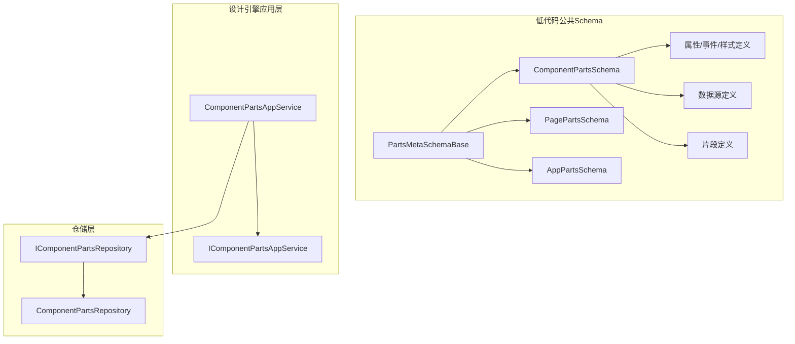
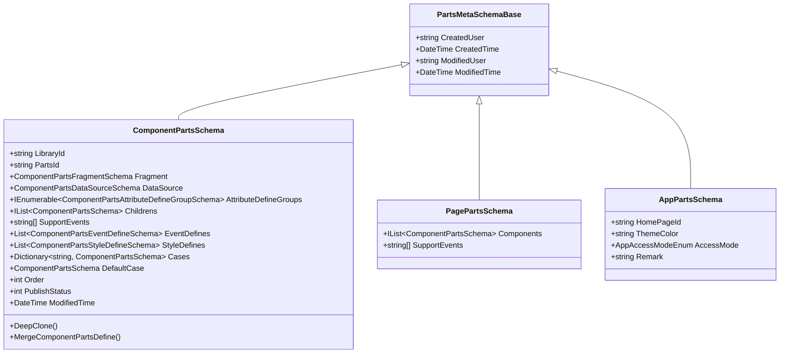
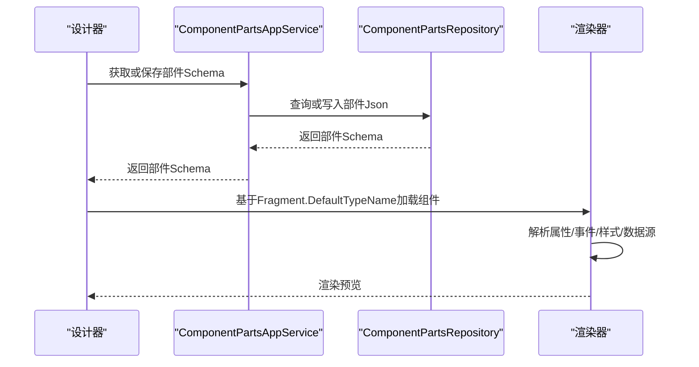
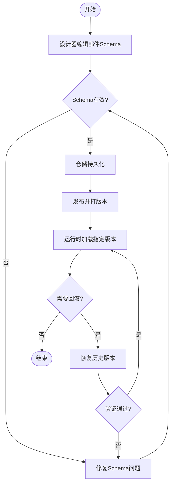
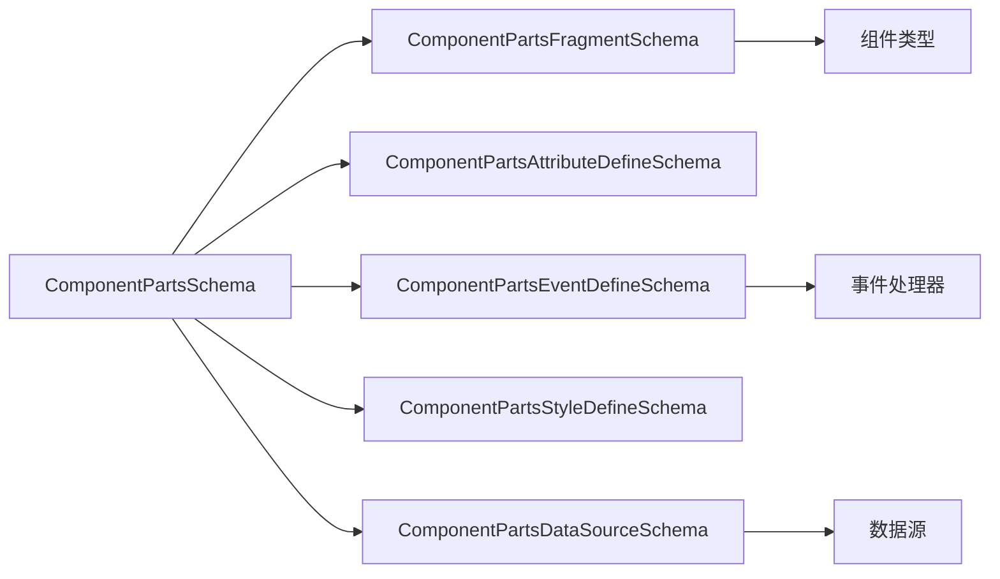

# 部件Schema规范

<cite>
**本文引用的文件**   
- [PartsMetaSchemaBase.cs](file://src/LowCode/Common/H.LowCode.MetaSchema.DesignEngine/PartsMetaSchemaBase.cs)
- [ComponentPartsSchema.cs](file://src/LowCode/Common/H.LowCode.MetaSchema.DesignEngine/ComponentPartsSchema.cs)
- [PagePartsSchema.cs](file://src/LowCode/Common/H.LowCode.MetaSchema.DesignEngine/PagePartsSchema.cs)
- [AppPartsSchema.cs](file://src/LowCode/Common/H.LowCode.MetaSchema.DesignEngine/AppPartsSchema.cs)
- [ComponentPartsAttributeDefineGroupSchema.cs](file://src/LowCode/Common/H.LowCode.MetaSchema.DesignEngine/PropertySchemas/ComponentPartsAttributeDefineGroupSchema.cs)
- [ComponentPartsAttributeDefineSchema.cs](file://src/LowCode/Common/H.LowCode.MetaSchema.DesignEngine/PropertySchemas/ComponentPartsAttributeDefineSchema.cs)
- [ComponentPartsEventDefineSchema.cs](file://src/LowCode/Common/H.LowCode.MetaSchema.DesignEngine/PropertySchemas/ComponentPartsEventDefineSchema.cs)
- [ComponentPartsStyleDefineSchema.cs](file://src/LowCode/Common/H.LowCode.MetaSchema.DesignEngine/PropertySchemas/ComponentPartsStyleDefineSchema.cs)
- [ComponentPartsDataSourceSchema.cs](file://src/LowCode/Common/H.LowCode.MetaSchema.DesignEngine/DataSourceSchemas/ComponentPartsDataSourceSchema.cs)
- [ComponentPartsFragmentSchema.cs](file://src/LowCode/Common/H.LowCode.MetaSchema.DesignEngine/PropertySchemas/ComponentPartsFragmentSchema.cs)
- [IComponentPartsRepository.cs](file://src/LowCode/DesignEngine/H.LowCode.DesignEngine.Domain/PartsRepositories/IComponentPartsRepository.cs)
- [ComponentPartsRepository.cs](file://src/LowCode/DesignEngine/H.LowCode.DesignEngine.Repository.JsonFile/PartsRepositories/ComponentPartsRepository.cs)
- [ComponentPartsAppService.cs](file://src/LowCode/DesignEngine/H.LowCode.DesignEngine.Application/PartsAppServices/ComponentPartsAppService.cs)
- [IComponentPartsAppService.cs](file://src/LowCode/DesignEngine/H.LowCode.DesignEngine.Application.Contracts/PartsAppServices/IComponentPartsAppService.cs)
</cite>

## 目录
1. [引言](#引言)
2. [项目结构定位](#项目结构定位)
3. [核心概念与架构总览](#核心概念与架构总览)
4. [基础元数据：PartsMetaSchemaBase](#基础元数据partsmetaschemabase)
5. [三类部件Schema对比](#三类部件schema对比)
6. [组件部件Schema详解](#组件部件schemadetail)
7. [属性、事件、样式与数据源定义](#属性事件样式与数据源定义)
8. [版本管理、依赖关系与加载机制](#版本管理依赖关系与加载机制)
9. [发布流程、版本控制与回滚策略](#发布流程版本控制与回滚策略)
10. [可复用业务部件的完整Schema示例](#可复用业务部件的完整schema示例)
11. [依赖关系分析](#依赖关系分析)
12. [性能与可扩展性考虑](#性能与可扩展性考虑)
13. [故障排查指南](#故障排查指南)
14. [最佳实践与团队协作模式](#最佳实践与团队协作模式)
15. [结语](#结语)

## 引言
本文档面向 H.AppLab 低代码平台的“部件”体系，聚焦部件 Schema 的设计规范与实现细节。目标包括：
- 解释 PartsMetaSchemaBase 的设计理念及其在模块化架构中的作用；
- 明确组件部件、页面部件与应用部件的职责差异与结构区别；
- 说明部件的版本管理、依赖关系和加载机制；
- 给出完整的部件 Schema 示例，指导如何定义和打包可复用的业务部件；
- 描述部件发布流程、版本控制与回滚策略；
- 总结开发最佳实践与团队协作模式。

## 项目结构定位
H.AppLab 的部件相关 Schema 主要位于低代码公共模块中，设计引擎与应用服务负责读取、编辑、持久化与发布部件。

**图表来源**
- [PartsMetaSchemaBase.cs:1-18](file://src/LowCode/Common/H.LowCode.MetaSchema.DesignEngine/PartsMetaSchemaBase.cs#L1-L18)
- [ComponentPartsSchema.cs:1-229](file://src/LowCode/Common/H.LowCode.MetaSchema.DesignEngine/ComponentPartsSchema.cs#L1-L229)
- [PagePartsSchema.cs:1-15](file://src/LowCode/Common/H.LowCode.MetaSchema.DesignEngine/PagePartsSchema.cs#L1-L15)
- [AppPartsSchema.cs:1-51](file://src/LowCode/Common/H.LowCode.MetaSchema.DesignEngine/AppPartsSchema.cs#L1-L51)
- [ComponentPartsAppService.cs](file://src/LowCode/DesignEngine/H.LowCode.DesignEngine.Application/PartsAppServices/ComponentPartsAppService.cs)
- [IComponentPartsAppService.cs](file://src/LowCode/DesignEngine/H.LowCode.DesignEngine.Application.Contracts/PartsAppServices/IComponentPartsAppService.cs)
- [IComponentPartsRepository.cs](file://src/LowCode/DesignEngine/H.LowCode.DesignEngine.Domain/PartsRepositories/IComponentPartsRepository.cs)
- [ComponentPartsRepository.cs](file://src/LowCode/DesignEngine/H.LowCode.DesignEngine.Repository.JsonFile/PartsRepositories/ComponentPartsRepository.cs)

**章节来源**
- [ComponentPartsSchema.cs:1-229](file://src/LowCode/Common/H.LowCode.MetaSchema.DesignEngine/ComponentPartsSchema.cs#L1-L229)
- [PagePartsSchema.cs:1-15](file://src/LowCode/Common/H.LowCode.MetaSchema.DesignEngine/PagePartsSchema.cs#L1-L15)
- [AppPartsSchema.cs:1-51](file://src/LowCode/Common/H.LowCode.MetaSchema.DesignEngine/AppPartsSchema.cs#L1-L51)

## 核心概念与架构总览
- 部件是低代码平台中的可复用 UI 单元，以 Schema 形式表达其外观、行为、配置与运行期依赖。
- 三层抽象：
  - 基础元数据：统一的创建者、修改者与时间戳；
  - 三类部件：组件部件、页面部件、应用部件；
  - 运行时扩展：属性组、事件、样式、数据源、片段等。

**图表来源**
- [PartsMetaSchemaBase.cs:1-18](file://src/LowCode/Common/H.LowCode.MetaSchema.DesignEngine/PartsMetaSchemaBase.cs#L1-L18)
- [ComponentPartsSchema.cs:1-229](file://src/LowCode/Common/H.LowCode.MetaSchema.DesignEngine/ComponentPartsSchema.cs#L1-L229)
- [PagePartsSchema.cs:1-15](file://src/LowCode/Common/H.LowCode.MetaSchema.DesignEngine/PagePartsSchema.cs#L1-L15)
- [AppPartsSchema.cs:1-51](file://src/LowCode/Common/H.LowCode.MetaSchema.DesignEngine/AppPartsSchema.cs#L1-L51)

**章节来源**
- [PartsMetaSchemaBase.cs:1-18](file://src/LowCode/Common/H.LowCode.MetaSchema.DesignEngine/PartsMetaSchemaBase.cs#L1-L18)
- [ComponentPartsSchema.cs:1-229](file://src/LowCode/Common/H.LowCode.MetaSchema.DesignEngine/ComponentPartsSchema.cs#L1-L229)
- [PagePartsSchema.cs:1-15](file://src/LowCode/Common/H.LowCode.MetaSchema.DesignEngine/PagePartsSchema.cs#L1-L15)
- [AppPartsSchema.cs:1-51](file://src/LowCode/Common/H.LowCode.MetaSchema.DesignEngine/AppPartsSchema.cs#L1-L51)

## 基础元数据：PartsMetaSchemaBase
PartsMetaSchemaBase 是所有部件共享的基础元数据基类，提供审计字段：
- CreatedUser：创建者标识；
- CreatedTime：创建时间；
- ModifiedUser：最后修改者；
- ModifiedTime：最后修改时间。

设计理念：
- 通过 JSON 序列化特性将字段映射为紧凑键名（cu、ct、mu、mt），便于存储与传输；
- 所有部件继承该基类，确保统一的变更追踪能力；
- 为版本管理与回滚提供基础依据。

使用建议：
- 任何新增部件类型都应继承该基类；
- 在发布、回滚与审计日志中记录 cu/mu/ct/mt；
- 若需要更细粒度审计，可在具体部件上追加自定义审计字段。

**章节来源**
- [PartsMetaSchemaBase.cs:1-18](file://src/LowCode/Common/H.LowCode.MetaSchema.DesignEngine/PartsMetaSchemaBase.cs#L1-L18)

## 三类部件Schema对比
| 类型 | 用途 | 关键字段 | 典型场景 |
|---|---|---|---|
| 组件部件 | 描述一个可复用 UI 组件的定义与实例配置 | LibraryId、PartsId、Fragment、DataSource、AttributeDefineGroups、Childrens、SupportEvents、EventDefines、StyleDefines、Cases、DefaultCase、Order、PublishStatus、ModifiedTime | 按钮、表格、表单控件、条件容器等 |
| 页面部件 | 描述页面的组件树与页面级事件 | Components、SupportEvents | 列表页、详情页、仪表盘页等 |
| 应用部件 | 描述应用的首页、主题色、访问模式与备注 | HomePageId、ThemeColor、AccessMode、Remark | 门户应用、后台应用、移动端应用等 |

结构差异要点：
- 组件部件最复杂，包含渲染片段、数据源、属性分组、子节点、条件分支等；
- 页面部件聚焦组件集合与页面级支持事件；
- 应用部件聚焦全局配置与访问控制。

**章节来源**
- [ComponentPartsSchema.cs:1-229](file://src/LowCode/Common/H.LowCode.MetaSchema.DesignEngine/ComponentPartsSchema.cs#L1-L229)
- [PagePartsSchema.cs:1-15](file://src/LowCode/Common/H.LowCode.MetaSchema.DesignEngine/PagePartsSchema.cs#L1-L15)
- [AppPartsSchema.cs:1-51](file://src/LowCode/Common/H.LowCode.MetaSchema.DesignEngine/AppPartsSchema.cs#L1-L51)

## 组件部件Schema详解
ComponentPartsSchema 是部件体系的核心，承载组件物料定义与实例配置。

关键职责：
- 组件标识与归属：LibraryId、PartsId；
- 渲染片段：Fragment 描述默认类型名与子片段；
- 数据源：DataSource 支持数据片段与列表项模板；
- 属性定义：按分组组织属性定义，支持显示名、必填、校验规则等；
- 事件定义：统一的事件元数据；
- 样式定义：CSS 属性映射与控件类型；
- 条件渲染：Cases 与 DefaultCase；
- 排序与发布状态：Order、PublishStatus；
- 设计期状态：DesignState、Refresh（不持久化）。

算法与方法：
- DeepClone：递归复制组件树并重新生成 Id 与 ParentId，同时保留 Refresh 回调；
- ConvertToComponentSchema：JSON 序列化与反序列化转换；
- MergeComponentPartsDefine：将组件物料定义合并到实例，覆盖属性组、数据源片段、可见标签等。

复杂度分析：
- DeepClone 的时间复杂度 O(n)，n 为组件节点数量；
- MergeComponentPartsDefine 对属性组进行线性扫描与匹配，时间复杂度 O(g + a)，g 为分组数，a 为属性总数。

错误处理与边界：
- 空引用保护：合并时判断 srcGroups 与 AttributeDefines；
- 设计期字段不参与序列化；
- 子节点递归处理需保证父子 Id 一致性。

**章节来源**
- [ComponentPartsSchema.cs:1-229](file://src/LowCode/Common/H.LowCode.MetaSchema.DesignEngine/ComponentPartsSchema.cs#L1-L229)

## 属性、事件、样式与数据源定义
### 属性定义
- ComponentPartsAttributeDefineGroupSchema：属性分组，包含 GroupName 与 AttributeDefines；
- ComponentPartsAttributeDefineSchema：单个属性定义，支持 DisplayName、AttributeItemType、IsRequired、Description、DefaultValue、Options、IsValidationEnabled、ValidationRules，并提供 StringValue、IntValue、BoolValue 便捷访问器。

设计要点：
- 通过 AttributeItemType 驱动设置项控件渲染；
- 校验规则可独立配置；
- 便捷属性提升设计器交互效率。

### 事件定义
- ComponentPartsEventDefineSchema：事件名称、显示名、描述、分组、事件类型、参数类型、是否必需、排序。

设计要点：
- 事件名与显示名分离，便于国际化与多语言；
- 参数类型与事件类型用于运行期绑定与提示。

### 样式定义
- ComponentPartsStyleDefineSchema：样式名、显示名、描述、分组、CSS 属性、样式类型、默认值、是否必需、排序、选项、控件类型、单位。

设计要点：
- CSS 属性映射支持前端直接注入样式；
- 控件类型与单位增强可视化编辑器体验。

### 数据源定义
- ComponentPartsDataSourceSchema：DataSourceFragment 与 ItemTemplate；
- 列表项模板支持完整组件配置，包括条件渲染。

**章节来源**
- [ComponentPartsAttributeDefineGroupSchema.cs:1-12](file://src/LowCode/Common/H.LowCode.MetaSchema.DesignEngine/PropertySchemas/ComponentPartsAttributeDefineGroupSchema.cs#L1-L12)
- [ComponentPartsAttributeDefineSchema.cs:1-98](file://src/LowCode/Common/H.LowCode.MetaSchema.DesignEngine/PropertySchemas/ComponentPartsAttributeDefineSchema.cs#L1-L98)
- [ComponentPartsEventDefineSchema.cs:1-60](file://src/LowCode/Common/H.LowCode.MetaSchema.DesignEngine/PropertySchemas/ComponentPartsEventDefineSchema.cs#L1-L60)
- [ComponentPartsStyleDefineSchema.cs:1-78](file://src/LowCode/Common/H.LowCode.MetaSchema.DesignEngine/PropertySchemas/ComponentPartsStyleDefineSchema.cs#L1-L78)
- [ComponentPartsDataSourceSchema.cs:1-18](file://src/LowCode/Common/H.LowCode.MetaSchema.DesignEngine/DataSourceSchemas/ComponentPartsDataSourceSchema.cs#L1-L18)

## 版本管理、依赖关系与加载机制
### 版本管理
- 组件部件包含 PublishStatus 与 ModifiedTime，用于区分草稿、已发布与历史版本；
- 建议在发布服务中维护版本快照与变更日志；
- 设计期状态 DesignState 不持久化，避免污染存储。

### 依赖关系
- LibraryId：组件库标识，用于区分不同组件库的物料；
- PartsId：一类组件唯一标识，作为跨应用复用的主键；
- Fragment.DefaultTypeName：声明组件类型名，支持原生 HTML 与 .NET 组件；
- DataSource.ItemTemplate：子组件模板可能依赖其他组件，形成间接依赖。

### 加载机制
- 设计器根据 Fragment.DefaultTypeName 解析组件类型；
- 渲染器根据 ComponentPartsSchema 构建组件树，解析事件、样式与数据源；
- 条件渲染通过 Cases 与 DefaultCase 决定分支。

**图表来源**
- [ComponentPartsAppService.cs](file://src/LowCode/DesignEngine/H.LowCode.DesignEngine.Application/PartsAppServices/ComponentPartsAppService.cs)
- [IComponentPartsAppService.cs](file://src/LowCode/DesignEngine/H.LowCode.DesignEngine.Application.Contracts/PartsAppServices/IComponentPartsAppService.cs)
- [ComponentPartsRepository.cs](file://src/LowCode/DesignEngine/H.LowCode.DesignEngine.Repository.JsonFile/PartsRepositories/ComponentPartsRepository.cs)
- [ComponentPartsFragmentSchema.cs:1-38](file://src/LowCode/Common/H.LowCode.MetaSchema.DesignEngine/PropertySchemas/ComponentPartsFragmentSchema.cs#L1-L38)

**章节来源**
- [ComponentPartsSchema.cs:1-229](file://src/LowCode/Common/H.LowCode.MetaSchema.DesignEngine/ComponentPartsSchema.cs#L1-L229)
- [ComponentPartsFragmentSchema.cs:1-38](file://src/LowCode/Common/H.LowCode.MetaSchema.DesignEngine/PropertySchemas/ComponentPartsFragmentSchema.cs#L1-L38)
- [ComponentPartsAppService.cs](file://src/LowCode/DesignEngine/H.LowCode.DesignEngine.Application/PartsAppServices/ComponentPartsAppService.cs)
- [IComponentPartsAppService.cs](file://src/LowCode/DesignEngine/H.LowCode.DesignEngine.Application.Contracts/PartsAppServices/IComponentPartsAppService.cs)
- [ComponentPartsRepository.cs](file://src/LowCode/DesignEngine/H.LowCode.DesignEngine.Repository.JsonFile/PartsRepositories/ComponentPartsRepository.cs)

## 发布流程、版本控制与回滚策略
### 发布流程
- 设计器编辑 ComponentPartsSchema；
- 应用服务调用仓储持久化为 JSON；
- 发布服务标记 PublishStatus 并发布到制品库；
- 运行时按 Published 版本加载。

### 版本控制
- 使用 PartsId 作为稳定标识；
- 每次发布生成新版本快照；
- 记录 ModifiedTime 与作者信息；
- 支持按版本号查询与对比。

### 回滚策略
- 通过历史版本快照恢复；
- 验证回滚后的 Schema 有效性；
- 更新运行时引用至旧版本；
- 记录回滚审计日志。

[本图为概念流程图，不对应具体源码文件]

## 可复用业务部件的完整Schema示例
以下示例展示如何定义一个可复用的业务部件，涵盖基本信息、属性、事件、样式、数据源与条件渲染。

示例结构要点：
- 基础元数据：CreatedUser、CreatedTime、ModifiedUser、ModifiedTime；
- 组件标识：LibraryId、PartsId；
- 渲染片段：DefaultTypeName 指向业务组件类型；
- 属性分组：如“基础”、“高级”，每个分组包含多个属性；
- 事件定义：如 OnClick、OnLoad；
- 样式定义：如颜色、尺寸、间距；
- 数据源：DataSourceFragment 与 ItemTemplate；
- 条件渲染：Cases 与 DefaultCase；
- 发布状态：PublishStatus；
- 排序：Order。

注意：
- 示例不包含具体代码内容，仅提供字段与结构指引；
- 实际开发中请结合业务组件类型名与数据源配置完善；
- 使用 DeepClone 与 MergeComponentPartsDefine 辅助设计与发布流程。

**章节来源**
- [ComponentPartsSchema.cs:1-229](file://src/LowCode/Common/H.LowCode.MetaSchema.DesignEngine/ComponentPartsSchema.cs#L1-L229)
- [ComponentPartsAttributeDefineSchema.cs:1-98](file://src/LowCode/Common/H.LowCode.MetaSchema.DesignEngine/PropertySchemas/ComponentPartsAttributeDefineSchema.cs#L1-L98)
- [ComponentPartsEventDefineSchema.cs:1-60](file://src/LowCode/Common/H.LowCode.MetaSchema.DesignEngine/PropertySchemas/ComponentPartsEventDefineSchema.cs#L1-L60)
- [ComponentPartsStyleDefineSchema.cs:1-78](file://src/LowCode/Common/H.LowCode.MetaSchema.DesignEngine/PropertySchemas/ComponentPartsStyleDefineSchema.cs#L1-L78)
- [ComponentPartsDataSourceSchema.cs:1-18](file://src/LowCode/Common/H.LowCode.MetaSchema.DesignEngine/DataSourceSchemas/ComponentPartsDataSourceSchema.cs#L1-L18)
- [ComponentPartsFragmentSchema.cs:1-38](file://src/LowCode/Common/H.LowCode.MetaSchema.DesignEngine/PropertySchemas/ComponentPartsFragmentSchema.cs#L1-L38)

## 依赖关系分析
组件部件与外部依赖的关系如下：
- 组件库依赖：LibraryId 关联组件库；
- 类型依赖：Fragment.DefaultTypeName 指向具体组件类型；
- 数据源依赖：DataSource 可能依赖后端接口或本地数据；
- 事件依赖：事件处理器可能依赖应用服务或领域服务；
- 样式依赖：StyleDefines 可能依赖主题或资源包。

**图表来源**
- [ComponentPartsSchema.cs:1-229](file://src/LowCode/Common/H.LowCode.MetaSchema.DesignEngine/ComponentPartsSchema.cs#L1-L229)
- [ComponentPartsFragmentSchema.cs:1-38](file://src/LowCode/Common/H.LowCode.MetaSchema.DesignEngine/PropertySchemas/ComponentPartsFragmentSchema.cs#L1-L38)
- [ComponentPartsAttributeDefineSchema.cs:1-98](file://src/LowCode/Common/H.LowCode.MetaSchema.DesignEngine/PropertySchemas/ComponentPartsAttributeDefineSchema.cs#L1-L98)
- [ComponentPartsEventDefineSchema.cs:1-60](file://src/LowCode/Common/H.LowCode.MetaSchema.DesignEngine/PropertySchemas/ComponentPartsEventDefineSchema.cs#L1-L60)
- [ComponentPartsStyleDefineSchema.cs:1-78](file://src/LowCode/Common/H.LowCode.MetaSchema.DesignEngine/PropertySchemas/ComponentPartsStyleDefineSchema.cs#L1-L78)
- [ComponentPartsDataSourceSchema.cs:1-18](file://src/LowCode/Common/H.LowCode.MetaSchema.DesignEngine/DataSourceSchemas/ComponentPartsDataSourceSchema.cs#L1-L18)

**章节来源**
- [ComponentPartsSchema.cs:1-229](file://src/LowCode/Common/H.LowCode.MetaSchema.DesignEngine/ComponentPartsSchema.cs#L1-L229)

## 性能与可扩展性考虑
- 组件树深度：避免过深的嵌套，必要时拆分为子组件；
- 属性数量：合理分组，减少一次性渲染开销；
- 条件渲染：尽量扁平化分支，降低计算复杂度；
- 数据源：分页与缓存优化，避免重复请求；
- 扩展点：通过 Fragment.DefaultTypeName 支持新组件类型；
- 设计器性能：DesignState 不持久化，减少 IO 压力。

[本节为通用指导，不直接分析具体文件]

## 故障排查指南
常见问题与处理：
- 组件类型解析失败：检查 Fragment.DefaultTypeName 是否正确；
- 属性未生效：确认 AttributeDefineGroups 与 AttributeItemType 匹配；
- 事件未触发：核对 EventDefines 与事件处理器绑定；
- 样式未应用：检查 StyleDefines 与 CSS 属性映射；
- 数据源为空：验证 DataSourceFragment 与 ItemTemplate；
- 条件渲染异常：检查 Cases 与 DefaultCase 配置。

建议步骤：
- 使用设计器预览调试；
- 检查 JSON Schema 完整性；
- 查看仓储持久化的文件内容；
- 核对发布状态与版本。

**章节来源**
- [ComponentPartsSchema.cs:1-229](file://src/LowCode/Common/H.LowCode.MetaSchema.DesignEngine/ComponentPartsSchema.cs#L1-L229)
- [ComponentPartsFragmentSchema.cs:1-38](file://src/LowCode/Common/H.LowCode.MetaSchema.DesignEngine/PropertySchemas/ComponentPartsFragmentSchema.cs#L1-L38)
- [ComponentPartsRepository.cs](file://src/LowCode/DesignEngine/H.LowCode.DesignEngine.Repository.JsonFile/PartsRepositories/ComponentPartsRepository.cs)

## 最佳实践与团队协作模式
- 命名规范：PartsId 保持稳定，避免频繁变更；
- 分组清晰：属性分组按功能划分，提高可读性；
- 文档齐全：为每个部件编写使用说明与示例；
- 版本策略：语义化版本，重大变更升主版本；
- 审核流程：组件入库前进行 Schema 校验与测试；
- 协作模式：组件所有者与维护者分离，明确责任；
- 自动化：CI 管道集成 Schema 校验与单元测试。

[本节为通用指导，不直接分析具体文件]

## 结语
部件 Schema 是 H.AppLab 低代码平台模块化架构的核心。通过 PartsMetaSchemaBase 的统一审计、ComponentPartsSchema 的丰富表达能力、以及设计引擎与服务层的协同，平台实现了从设计到发布的全链路部件管理。遵循本文规范，团队可以高效地构建、复用与维护高质量的业务部件。