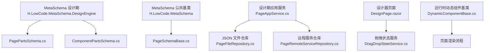
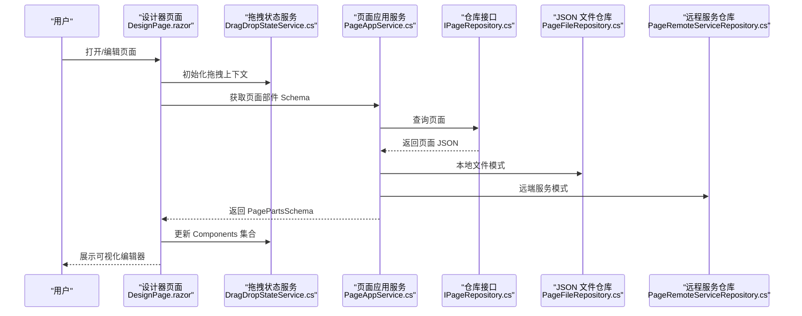
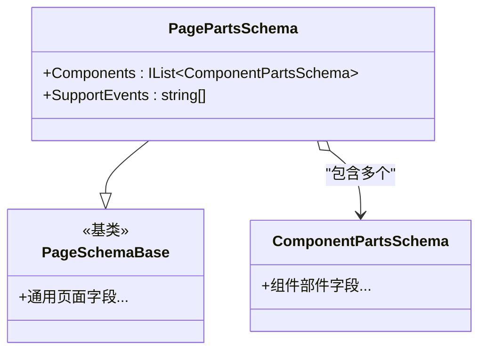
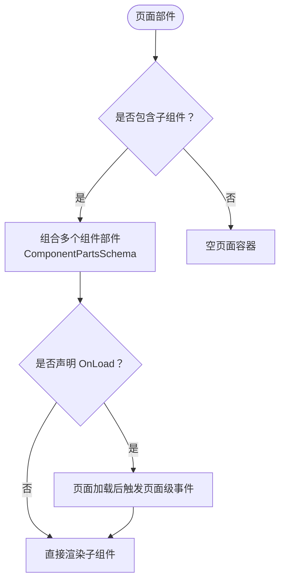
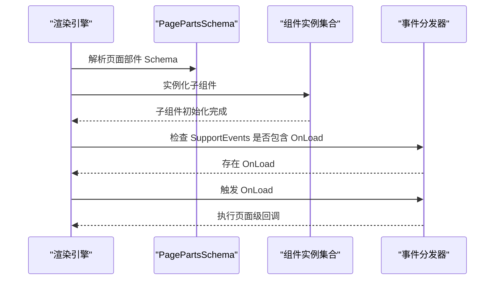
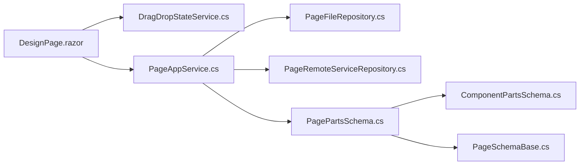

# 页面部件Schema

<cite>
**本文引用的文件**   
- [PagePartsSchema.cs](file://src/LowCode/Common/H.LowCode.MetaSchema.DesignEngine/PagePartsSchema.cs)
- [ComponentPartsSchema.cs](file://src/LowCode/Common/H.LowCode.MetaSchema.DesignEngine/ComponentPartsSchema.cs)
- [PageSchemaBase.cs](file://src/LowCode/Common/H.LowCode.MetaSchema/PageSchemaBase.cs)
- [AppTemplateSchema.cs](file://src/LowCode/Common/H.LowCode.MetaSchema.DesignEngine/AppTemplateSchema.cs)
- [PageAppService.cs](file://src/LowCode/DesignEngine/H.LowCode.DesignEngine.Application/AppServices/PageAppService.cs)
- [IPageAppService.cs](file://src/LowCode/DesignEngine/H.LowCode.DesignEngine.Application.Contracts/AppServices/IPageAppService.cs)
- [PageFileRepository.cs](file://src/LowCode/DesignEngine/H.LowCode.DesignEngine.Repository.JsonFile/Repositories/PageFileRepository.cs)
- [PageRemoteServiceRepository.cs](file://src/LowCode/DesignEngine/H.LowCode.DesignEngine.Repository.RemoteService/Repositories/PageRemoteServiceRepository.cs)
- [DragDropStateService.cs](file://src/LowCode/DesignEngine/H.LowCode.DesignEngine.Services/DragDropStateService.cs)
- [DynamicComponentBase.cs](file://src/LowCode/DesignEngine/H.LowCode.DesignEngine.Services/DynamicComponentBase.cs)
- [DesignPage.razor](file://src/LowCode/DesignEngine/H.LowCode.DesignEngine/Pages/DesignPage.razor)
</cite>

## 目录
1. [引言](#引言)
2. [项目结构定位](#项目结构定位)
3. [核心概念与角色划分](#核心概念与角色划分)
4. [架构总览](#架构总览)
5. [详细组件分析](#详细组件分析)
6. [依赖关系分析](#依赖关系分析)
7. [性能与可扩展性](#性能与可扩展性)
8. [故障排查指南](#故障排查指南)
9. [结论](#结论)
10. [附录：Schema 示例与最佳实践](#附录schema-示例与最佳实践)

## 引言
本文围绕 H.AppLab 低代码平台中的“页面部件 Schema”展开，重点解析 PagePartsSchema 类的设计理念、在页面架构中的作用、页面级事件支持（特别是 OnLoad）、页面部件与组件部件的关系差异、以及页面作为容器组件的生命周期管理。文档同时给出构建复杂页面布局的 Schema 组织方式、版本管理与依赖解析策略说明，帮助读者从设计器到渲染器的完整链路理解页面部件的数据契约与运行机制。

## 项目结构定位
PagePartsSchema 属于低代码元数据层的设计期 Schema，位于 MetaSchema 体系下，负责描述“页面部件”的结构、包含的子组件集合以及页面级能力声明（例如支持的页面级事件）。它继承自页面基础 Schema，并与组件部件 Schema 配合，共同形成“页面部件 → 组件部件 → 具体组件实例”的层级结构。

图表来源
- [PagePartsSchema.cs:1-15](file://src/LowCode/Common/H.LowCode.MetaSchema.DesignEngine/PagePartsSchema.cs#L1-L15)
- [ComponentPartsSchema.cs](file://src/LowCode/Common/H.LowCode.MetaSchema.DesignEngine/ComponentPartsSchema.cs)
- [PageSchemaBase.cs](file://src/LowCode/Common/H.LowCode.MetaSchema/PageSchemaBase.cs)
- [PageAppService.cs](file://src/LowCode/DesignEngine/H.LowCode.DesignEngine.Application/AppServices/PageAppService.cs)
- [PageFileRepository.cs](file://src/LowCode/DesignEngine/H.LowCode.DesignEngine.Repository.JsonFile/Repositories/PageFileRepository.cs)
- [PageRemoteServiceRepository.cs](file://src/LowCode/DesignEngine/H.LowCode.DesignEngine.Repository.RemoteService/Repositories/PageRemoteServiceRepository.cs)
- [DesignPage.razor](file://src/LowCode/DesignEngine/H.LowCode.DesignEngine/Pages/DesignPage.razor)
- [DragDropStateService.cs](file://src/LowCode/DesignEngine/H.LowCode.DesignEngine.Services/DragDropStateService.cs)
- [DynamicComponentBase.cs](file://src/LowCode/DesignEngine/H.LowCode.DesignEngine.Services/DynamicComponentBase.cs)

章节来源
- [PagePartsSchema.cs:1-15](file://src/LowCode/Common/H.LowCode.MetaSchema.DesignEngine/PagePartsSchema.cs#L1-L15)
- [PageAppService.cs](file://src/LowCode/DesignEngine/H.LowCode.DesignEngine.Application/AppServices/PageAppService.cs)
- [PageFileRepository.cs](file://src/LowCode/DesignEngine/H.LowCode.DesignEngine.Repository.JsonFile/Repositories/PageFileRepository.cs)
- [PageRemoteServiceRepository.cs](file://src/LowCode/DesignEngine/H.LowCode.DesignEngine.Repository.RemoteService/Repositories/PageRemoteServiceRepository.cs)
- [DesignPage.razor](file://src/LowCode/DesignEngine/H.LowCode.DesignEngine/Pages/DesignPage.razor)
- [DragDropStateService.cs](file://src/LowCode/DesignEngine/H.LowCode.DesignEngine.Services/DragDropStateService.cs)
- [DynamicComponentBase.cs](file://src/LowCode/DesignEngine/H.LowCode.DesignEngine.Services/DynamicComponentBase.cs)

## 核心概念与角色划分
- 页面部件（Page Parts）：用于描述一个可复用页面的结构，包括其内部子组件集合和页面级能力声明。
- 组件部件（Component Parts）：用于描述单个 UI 组件的可复用定义，通常包含属性、样式、数据源、事件等配置。
- 页面基础 Schema（PageSchemaBase）：为所有页面级 Schema 提供通用字段和约定，如标识、版本、主题、路由等（具体字段以基类实现为准）。
- 应用模板（AppTemplateSchema）：在应用模板中引用页面部件或组件部件，体现多粒度复用。

PagePartsSchema 的关键职责：
- 通过 Components 字段维护页面内组件部件的集合，组织页面布局与层次结构。
- 通过 SupportEvents 声明页面级支持的事件，当前默认包含 OnLoad，表示页面加载时可触发的页面级逻辑。

章节来源
- [PagePartsSchema.cs:5-15](file://src/LowCode/Common/H.LowCode.MetaSchema.DesignEngine/PagePartsSchema.cs#L5-L15)
- [ComponentPartsSchema.cs](file://src/LowCode/Common/H.LowCode.MetaSchema.DesignEngine/ComponentPartsSchema.cs)
- [PageSchemaBase.cs](file://src/LowCode/Common/H.LowCode.MetaSchema/PageSchemaBase.cs)
- [AppTemplateSchema.cs](file://src/LowCode/Common/H.LowCode.MetaSchema.DesignEngine/AppTemplateSchema.cs)

## 架构总览
页面部件的 Schema 贯穿设计期与运行期：
- 设计期：设计器通过 PageAppService 读取/保存页面部件的 JSON 描述；拖拽编排时更新 Components 集合；设置面板可编辑页面级属性。
- 运行期：渲染引擎根据页面部件 Schema 解析并实例化子组件，按生命周期触发 OnLoad 等页面级事件。

图表来源
- [DesignPage.razor](file://src/LowCode/DesignEngine/H.LowCode.DesignEngine/Pages/DesignPage.razor)
- [DragDropStateService.cs](file://src/LowCode/DesignEngine/H.LowCode.DesignEngine.Services/DragDropStateService.cs)
- [PageAppService.cs](file://src/LowCode/DesignEngine/H.LowCode.DesignEngine.Application/AppServices/PageAppService.cs)
- [PageFileRepository.cs](file://src/LowCode/DesignEngine/H.LowCode.DesignEngine.Repository.JsonFile/Repositories/PageFileRepository.cs)
- [PageRemoteServiceRepository.cs](file://src/LowCode/DesignEngine/H.LowCode.DesignEngine.Repository.RemoteService/Repositories/PageRemoteServiceRepository.cs)

## 详细组件分析

### PagePartsSchema 类设计
- 继承关系：继承自 PageSchemaBase，获得页面级通用能力（如标识、版本、路由等），并在其上扩展页面部件特有字段。
- 组件集合 Components：类型为 ComponentPartsSchema 列表，承载页面内的组件部件树。每个 ComponentPartsSchema 描述一个可复用的组件定义，包括其属性、事件、样式和数据绑定等。
- 页面级事件 SupportEvents：声明页面部件支持的事件名称数组。当前默认包含 OnLoad，表示页面加载完成后可执行页面级逻辑。

图表来源
- [PagePartsSchema.cs:5-15](file://src/LowCode/Common/H.LowCode.MetaSchema.DesignEngine/PagePartsSchema.cs#L5-L15)
- [ComponentPartsSchema.cs](file://src/LowCode/Common/H.LowCode.MetaSchema.DesignEngine/ComponentPartsSchema.cs)
- [PageSchemaBase.cs](file://src/LowCode/Common/H.LowCode.MetaSchema/PageSchemaBase.cs)

章节来源
- [PagePartsSchema.cs:5-15](file://src/LowCode/Common/H.LowCode.MetaSchema.DesignEngine/PagePartsSchema.cs#L5-L15)

### 页面部件与组件部件的关系与差异
- 页面部件（PagePartsSchema）：
  - 作用域：页面级，作为容器组件组织子组件。
  - 特性：包含 Components 集合，声明页面级事件（OnLoad 等）。
  - 复用维度：可被应用模板或更高层面复用，表达完整的页面结构。
- 组件部件（ComponentPartsSchema）：
  - 作用域：组件级，描述单个 UI 组件的可复用定义。
  - 特性：聚焦于组件的属性、样式、事件、数据源等细粒度配置。
  - 复用维度：可在多个页面或组件中被多次使用。

图表来源
- [PagePartsSchema.cs:7-15](file://src/LowCode/Common/H.LowCode.MetaSchema.DesignEngine/PagePartsSchema.cs#L7-L15)
- [ComponentPartsSchema.cs](file://src/LowCode/Common/H.LowCode.MetaSchema.DesignEngine/ComponentPartsSchema.cs)

章节来源
- [PagePartsSchema.cs:7-15](file://src/LowCode/Common/H.LowCode.MetaSchema.DesignEngine/PagePartsSchema.cs#L7-L15)

### 页面部件作为容器组件的特性
- 容器语义：PagePartsSchema 不直接呈现 UI，而是通过 Components 聚合子组件部件，最终由渲染引擎生成实际 DOM。
- 布局组织：Components 的顺序与嵌套关系决定页面布局与组件层次；设计器通过拖拽调整 Components 顺序与层级。
- 事件挂载点：页面级事件（如 OnLoad）挂载在页面部件这一层级，适合做全局初始化、数据预取、权限校验等。

章节来源
- [PagePartsSchema.cs:7-15](file://src/LowCode/Common/H.LowCode.MetaSchema.DesignEngine/PagePartsSchema.cs#L7-L15)

### 生命周期管理与 OnLoad 触发机制
- 声明阶段：SupportEvents 明确列出页面部件支持的事件，当前包含 OnLoad。
- 设计期：用户在设计器中配置页面部件时，可启用 OnLoad 并在对应处理器中编写业务逻辑（如调用数据服务、设置状态等）。
- 运行期：当页面部件被渲染引擎实例化并完成子组件初始化后，若声明了 OnLoad，则触发该事件。

图表来源
- [PagePartsSchema.cs:10-15](file://src/LowCode/Common/H.LowCode.MetaSchema.DesignEngine/PagePartsSchema.cs#L10-L15)
- [DynamicComponentBase.cs](file://src/LowCode/DesignEngine/H.LowCode.DesignEngine.Services/DynamicComponentBase.cs)

章节来源
- [PagePartsSchema.cs:10-15](file://src/LowCode/Common/H.LowCode.MetaSchema.DesignEngine/PagePartsSchema.cs#L10-L15)
- [DynamicComponentBase.cs](file://src/LowCode/DesignEngine/H.LowCode.DesignEngine.Services/DynamicComponentBase.cs)

### 版本管理与依赖解析策略
- 版本管理：
  - 页面部件与组件部件均具备版本信息（由基类与相关 Schema 约定），用于兼容性与回滚。
  - 变更时需保证向后兼容，必要时升级版本号，避免破坏已发布页面。
- 依赖解析：
  - 页面部件依赖其 Components 中的组件部件；组件部件可能进一步依赖第三方组件、样式、脚本或数据源。
  - 解析顺序建议：先解析页面部件，再逐层解析组件部件，确保资源与依赖提前加载。
- 存储与传输：
  - 页面部件以 JSON 形式持久化，可通过本地文件或远端服务两种方式访问。
  - 设计器与服务端通过统一接口（IPageAppService）进行读写，屏蔽底层存储差异。

章节来源
- [PageAppService.cs](file://src/LowCode/DesignEngine/H.LowCode.DesignEngine.Application/AppServices/PageAppService.cs)
- [PageFileRepository.cs](file://src/LowCode/DesignEngine/H.LowCode.DesignEngine.Repository.JsonFile/Repositories/PageFileRepository.cs)
- [PageRemoteServiceRepository.cs](file://src/LowCode/DesignEngine/H.LowCode.DesignEngine.Repository.RemoteService/Repositories/PageRemoteServiceRepository.cs)

## 依赖关系分析
- 设计器侧：
  - DesignPage.razor 负责页面编辑交互，驱动 DragDropStateService 管理拖拽与状态。
  - PageAppService 作为应用服务，协调仓库层进行页面数据的读写。
- 仓库侧：
  - PageFileRepository 处理本地 JSON 文件的读写。
  - PageRemoteServiceRepository 处理远端 API 调用。
- 元模型侧：
  - PagePartsSchema 与 ComponentPartsSchema 定义页面与组件的结构契约。
  - PageSchemaBase 提供通用页面字段。

图表来源
- [DesignPage.razor](file://src/LowCode/DesignEngine/H.LowCode.DesignEngine/Pages/DesignPage.razor)
- [DragDropStateService.cs](file://src/LowCode/DesignEngine/H.LowCode.DesignEngine.Services/DragDropStateService.cs)
- [PageAppService.cs](file://src/LowCode/DesignEngine/H.LowCode.DesignEngine.Application/AppServices/PageAppService.cs)
- [PageFileRepository.cs](file://src/LowCode/DesignEngine/H.LowCode.DesignEngine.Repository.JsonFile/Repositories/PageFileRepository.cs)
- [PageRemoteServiceRepository.cs](file://src/LowCode/DesignEngine/H.LowCode.DesignEngine.Repository.RemoteService/Repositories/PageRemoteServiceRepository.cs)
- [PagePartsSchema.cs:1-15](file://src/LowCode/Common/H.LowCode.MetaSchema.DesignEngine/PagePartsSchema.cs#L1-L15)
- [ComponentPartsSchema.cs](file://src/LowCode/Common/H.LowCode.MetaSchema.DesignEngine/ComponentPartsSchema.cs)
- [PageSchemaBase.cs](file://src/LowCode/Common/H.LowCode.MetaSchema/PageSchemaBase.cs)

章节来源
- [DesignPage.razor](file://src/LowCode/DesignEngine/H.LowCode.DesignEngine/Pages/DesignPage.razor)
- [DragDropStateService.cs](file://src/LowCode/DesignEngine/H.LowCode.DesignEngine.Services/DragDropStateService.cs)
- [PageAppService.cs](file://src/LowCode/DesignEngine/H.LowCode.DesignEngine.Application/AppServices/PageAppService.cs)
- [PagePartsSchema.cs:1-15](file://src/LowCode/Common/H.LowCode.MetaSchema.DesignEngine/PagePartsSchema.cs#L1-L15)

## 性能与可扩展性
- 组件数量控制：
  - 页面部件的 Components 集合不宜过大，建议分层拆分，将大页面拆分为多个子页面或可复用组件部件，降低渲染压力。
- 懒加载与按需渲染：
  - 对重型组件采用延迟加载；仅在需要时实例化，减少首屏开销。
- 事件最小化：
  - OnLoad 仅用于必要的全局初始化；避免在页面级事件中执行昂贵操作。
- 缓存与增量更新：
  - 对静态页面部件 Schema 进行缓存；设计器侧对频繁变更的 Components 做局部更新。
- 可扩展点：
  - 可在 SupportEvents 中扩展更多页面级事件（如 OnInit、OnBeforeUnload），但需保持与渲染引擎的实现一致。

[本节为通用指导，不涉及具体文件分析]

## 故障排查指南
- 页面无法加载：
  - 检查 PageAppService 是否能成功读取页面 JSON；确认本地文件路径或远端 API 可用。
  - 核对 PagePartsSchema 的版本是否与渲染引擎兼容。
- OnLoad 未触发：
  - 确认 SupportEvents 中包含 OnLoad，且页面部件已被正确实例化。
  - 检查渲染引擎是否正确解析并分发页面级事件。
- 组件未显示：
  - 检查 Components 中各组件部件的定义是否完整（类型、属性、样式）。
  - 确认组件依赖的资源（样式、脚本、数据源）已正确加载。
- 拖拽异常：
  - 检查 DragDropStateService 的状态是否同步到 Components 集合。
  - 验证设计器与仓库之间的序列化/反序列化是否一致。

章节来源
- [PageAppService.cs](file://src/LowCode/DesignEngine/H.LowCode.DesignEngine.Application/AppServices/PageAppService.cs)
- [PageFileRepository.cs](file://src/LowCode/DesignEngine/H.LowCode.DesignEngine.Repository.JsonFile/Repositories/PageFileRepository.cs)
- [PageRemoteServiceRepository.cs](file://src/LowCode/DesignEngine/H.LowCode.DesignEngine.Repository.RemoteService/Repositories/PageRemoteServiceRepository.cs)
- [DragDropStateService.cs](file://src/LowCode/DesignEngine/H.LowCode.DesignEngine.Services/DragDropStateService.cs)
- [PagePartsSchema.cs:7-15](file://src/LowCode/Common/H.LowCode.MetaSchema.DesignEngine/PagePartsSchema.cs#L7-L15)

## 结论
PagePartsSchema 是 H.AppLab 低代码平台中“页面部件”的核心 Schema，承担页面级结构组织与页面级能力声明的职责。通过 Components 与 SupportEvents，它将页面作为容器组件进行建模，使页面可以被设计器可视化编排，并在运行期按生命周期触发 OnLoad 等事件。结合 ComponentPartsSchema 与 PageSchemaBase，平台实现了从设计期到运行期的统一数据契约，并通过 PageAppService 与多种仓库实现，支撑灵活的部署与依赖管理。

[本节为总结性内容，不涉及具体文件分析]

## 附录：Schema 示例与最佳实践
- 页面部件 Schema 组成要点：
  - 基本信息：标识、名称、版本、主题、路由等（由 PageSchemaBase 提供）。
  - 组件集合：Components 列表，包含多个 ComponentPartsSchema。
  - 页面级事件：SupportEvents 数组，至少包含 OnLoad（如需）。
- 复杂页面布局建议：
  - 将大页面拆分为多个页面部件，提升复用率与维护性。
  - 将通用区块抽取为组件部件，供多个页面共享。
  - 使用命名空间或分组对 Components 进行有序组织，便于设计与调试。
- 最佳实践：
  - 严格控制页面级事件复杂度，优先在组件部件中实现业务逻辑。
  - 为页面部件设定明确的版本号，并进行兼容性测试。
  - 在设计器中开启预览与调试，及时发现问题。

[本节为概念性说明，不涉及具体文件分析]