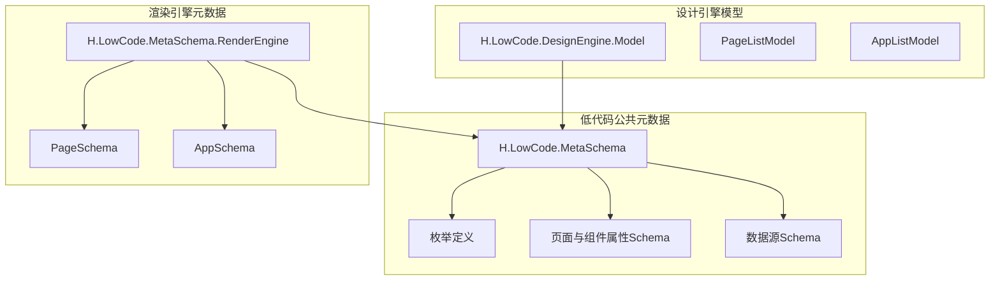
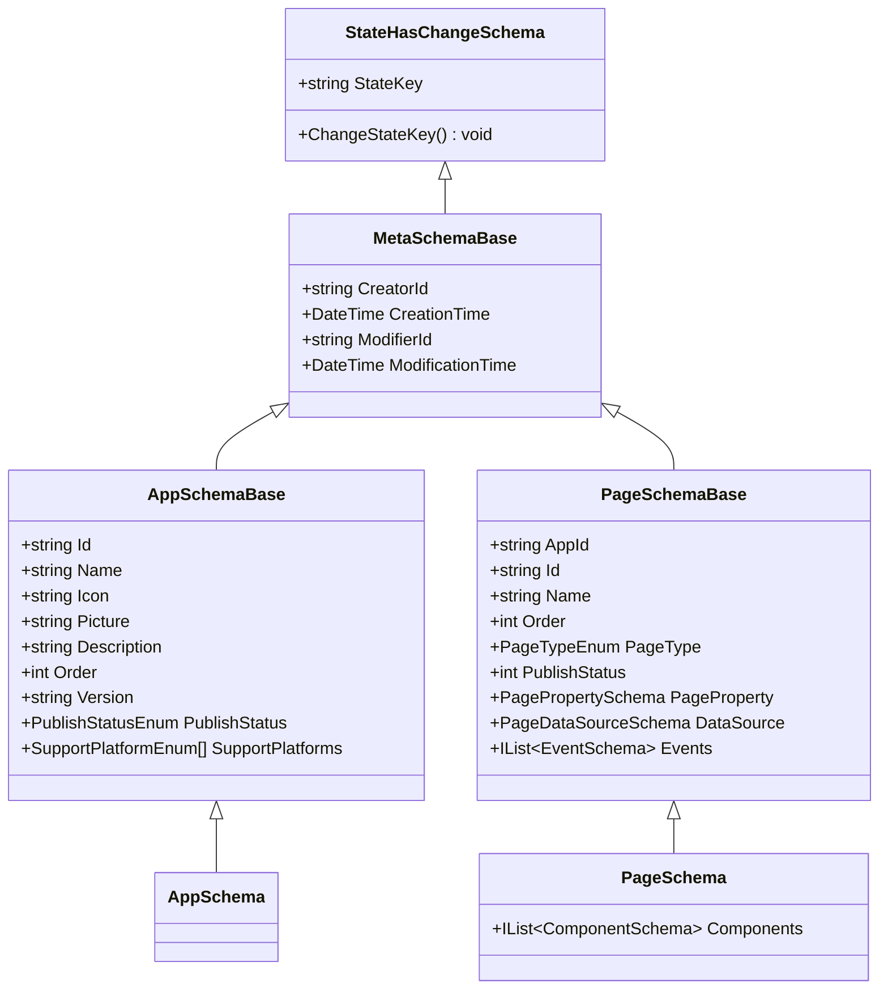
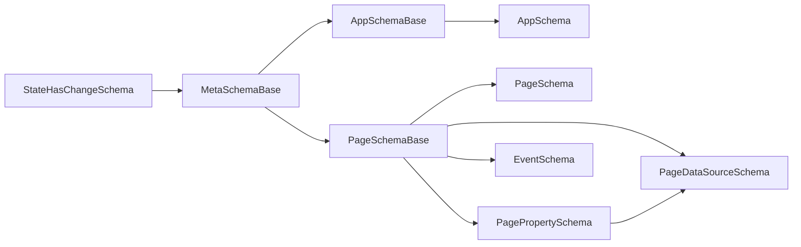

# 页面Schema规范

<cite>
**本文引用的文件**   
- [PageSchemaBase.cs](file://src/LowCode/Common/H.LowCode.MetaSchema/PageSchemaBase.cs)
- [AppSchemaBase.cs](file://src/LowCode/Common/H.LowCode.MetaSchema/AppSchemaBase.cs)
- [MetaSchemaBase.cs](file://src/LowCode/Common/H.LowCode.MetaSchema/MetaSchemaBase.cs)
- [StateHasChangeSchema.cs](file://src/LowCode/Common/H.LowCode.MetaSchema/StateHasChangeSchema.cs)
- [PageSchema.cs](file://src/LowCode/Common/H.LowCode.MetaSchema.RenderEngine/PageSchema.cs)
- [AppSchema.cs](file://src/LowCode/Common/H.LowCode.MetaSchema.RenderEngine/AppSchema.cs)
- [PageTypeEnum.cs](file://src/LowCode/Common/H.LowCode.MetaSchema/Enums/PageTypeEnum.cs)
- [PublishStatusEnum.cs](file://src/LowCode/Common/H.LowCode.MetaSchema/Enums/PublishStatusEnum.cs)
- [SupportPlatformEnum.cs](file://src/LowCode/Common/H.LowCode.MetaSchema/Enums/SupportPlatformEnum.cs)
- [DataSourceSchema.cs](file://src/LowCode/Common/H.LowCode.MetaSchema/DataSourceSchema.cs)
- [PageDataSourceSchema.cs](file://src/LowCode/Common/H.LowCode.MetaSchema/DataSourceSchemas/PageDataSourceSchema.cs)
- [PagePropertySchema.cs](file://src/LowCode/Common/H.LowCode.MetaSchema/PropertySchemas/PagePropertySchema.cs)
- [ComponentStyleSchema.cs](file://src/LowCode/Common/H.LowCode.MetaSchema/PropertySchemas/ComponentStyleSchema.cs)
- [VisibleConditionSchema.cs](file://src/LowCode/Common/H.LowCode.MetaSchema/PropertySchemas/VisibleConditionSchema.cs)
- [ValidationRuleSchema.cs](file://src/LowCode/Common/H.LowCode.MetaSchema/PropertySchemas/ValidationRuleSchema.cs)
- [EventSchema.cs](file://src/LowCode/Common/H.LowCode.MetaSchema/PropertySchemas/EventSchema.cs)
- [TablePropertySchema.cs](file://src/LowCode/Common/H.LowCode.MetaSchema/PropertySchemas/TableSchemas/TablePropertySchema.cs)
- [PageListModel.cs](file://src/LowCode/DesignEngine/H.LowCode.DesignEngine.Model/Models/PageListModel.cs)
- [AppListModel.cs](file://src/LowCode/DesignEngine/H.LowCode.DesignEngine.Model/Models/AppListModel.cs)
</cite>

## 目录

1. [引言](#引言)
2. [项目结构定位](#项目结构定位)
3. [核心数据结构总览](#核心数据结构总览)
4. [架构与继承关系](#架构与继承关系)
5. [应用Schema规范](#应用Schema规范)
6. [页面Schema规范](#页面Schema规范)
7. [页面类型、发布状态与平台支持](#页面类型发布状态与平台支持)
8. [页面属性配置规范](#页面属性配置规范)
9. [页面数据源配置规范](#页面数据源配置规范)
10. [事件与行为规则](#事件与行为规则)
11. [页面与应用关联、排序与版本管理](#页面与应用关联排序与版本管理)
12. [不同类型页面的Schema示例说明](#不同类型页面的Schema示例说明)
13. [依赖关系分析](#依赖关系分析)
14. [性能与可维护性建议](#性能与可维护性建议)
15. [常见问题排查](#常见问题排查)
16. [结论](#结论)

## 引言

本文面向 H.AppLab 低代码平台的页面 Schema 设计与实现，目标是建立一份从设计到使用都可操作的技术规范。文档围绕以下核心目标展开：

- 解释 `PageSchemaBase` 和 `AppSchemaBase` 的设计理念、职责边界和字段含义。
- 明确页面基本信息、应用元数据、页面属性配置和数据源配置的完整结构。
- 定义页面类型枚举、发布状态枚举和平台支持枚举的取值及使用场景。
- 说明页面与应用之间的关联方式、页面排序机制和版本管理策略。
- 提供不同页面类型的 Schema 构建思路，包括表单页、列表页、仪表盘等。
- 给出页面属性配置的最佳实践，以及数据源的扩展方法。

该规范适合低代码平台开发者、页面建模人员、模板作者和低代码应用使用者共同参考。

## 项目结构定位

H.AppLab 的低代码能力集中在 LowCode 模块中。页面和应用的核心 Schema 定义位于公共元数据层，渲染时使用的具体页面 Schema 则位于渲染引擎元数据层。

**图表来源**
- [PageSchemaBase.cs:1-40](file://src/LowCode/Common/H.LowCode.MetaSchema/PageSchemaBase.cs#L1-L40)
- [AppSchemaBase.cs:1-31](file://src/LowCode/Common/H.LowCode.MetaSchema/AppSchemaBase.cs#L1-L31)
- [PageSchema.cs:1-9](file://src/LowCode/Common/H.LowCode.MetaSchema.RenderEngine/PageSchema.cs#L1-L9)
- [AppSchema.cs:1-6](file://src/LowCode/Common/H.LowCode.MetaSchema.RenderEngine/AppSchema.cs#L1-L6)
- [PageListModel.cs](file://src/LowCode/DesignEngine/H.LowCode.DesignEngine.Model/Models/PageListModel.cs)
- [AppListModel.cs](file://src/LowCode/DesignEngine/H.LowCode.DesignEngine.Model/Models/AppListModel.cs)

**章节来源**
- [PageSchemaBase.cs:1-40](file://src/LowCode/Common/H.LowCode.MetaSchema/PageSchemaBase.cs#L1-L40)
- [AppSchemaBase.cs:1-31](file://src/LowCode/Common/H.LowCode.MetaSchema/AppSchemaBase.cs#L1-L31)
- [PageSchema.cs:1-9](file://src/LowCode/Common/H.LowCode.MetaSchema.RenderEngine/PageSchema.cs#L1-L9)
- [AppSchema.cs:1-6](file://src/LowCode/Common/H.LowCode.MetaSchema.RenderEngine/AppSchema.cs#L1-L6)
- [PageListModel.cs](file://src/LowCode/DesignEngine/H.LowCode.DesignEngine.Model/Models/PageListModel.cs)
- [AppListModel.cs](file://src/LowCode/DesignEngine/H.LowCode.DesignEngine.Model/Models/AppListModel.cs)

## 核心数据结构总览

H.AppLab 的页面和应用 Schema 采用分层抽象设计：

- `MetaSchemaBase` 是所有元数据的基类，提供创建者、修改者和时间戳等审计字段。
- `StateHasChangeSchema` 为所有 Schema 提供内部状态键，用于触发前端状态刷新。
- `AppSchemaBase` 描述应用级元数据，包括应用标识、名称、图标、封面、描述、排序、版本、发布状态和支撑平台。
- `PageSchemaBase` 描述页面级元数据，包括所属应用、页面标识、名称、排序、页面类型、发布状态、页面属性、数据源和事件。
- `PageSchema` 是渲染引擎中的具体页面 Schema，继承自 `PageSchemaBase`，并增加组件列表。
- `AppSchema` 是渲染引擎中的应用 Schema，继承自 `AppSchemaBase`，目前作为结构化载体。

这种设计的优点是：

- 应用和页面共享基础元数据能力。
- 页面在渲染阶段可以扩展出组件树。
- 枚举集中定义，便于前后端统一语义。
- JSON 序列化键名通过特性控制，利于压缩和可读性。

**章节来源**
- [MetaSchemaBase.cs:1-18](file://src/LowCode/Common/H.LowCode.MetaSchema/MetaSchemaBase.cs#L1-L18)
- [StateHasChangeSchema.cs:1-15](file://src/LowCode/Common/H.LowCode.MetaSchema/StateHasChangeSchema.cs#L1-L15)
- [AppSchemaBase.cs:1-31](file://src/LowCode/Common/H.LowCode.MetaSchema/AppSchemaBase.cs#L1-L31)
- [PageSchemaBase.cs:1-40](file://src/LowCode/Common/H.LowCode.MetaSchema/PageSchemaBase.cs#L1-L40)
- [PageSchema.cs:1-9](file://src/LowCode/Common/H.LowCode.MetaSchema.RenderEngine/PageSchema.cs#L1-L9)
- [AppSchema.cs:1-6](file://src/LowCode/Common/H.LowCode.MetaSchema.RenderEngine/AppSchema.cs#L1-L6)

## 架构与继承关系

**图表来源**
- [StateHasChangeSchema.cs:1-15](file://src/LowCode/Common/H.LowCode.MetaSchema/StateHasChangeSchema.cs#L1-L15)
- [MetaSchemaBase.cs:1-18](file://src/LowCode/Common/H.LowCode.MetaSchema/MetaSchemaBase.cs#L1-L18)
- [AppSchemaBase.cs:1-31](file://src/LowCode/Common/H.LowCode.MetaSchema/AppSchemaBase.cs#L1-L31)
- [PageSchemaBase.cs:1-40](file://src/LowCode/Common/H.LowCode.MetaSchema/PageSchemaBase.cs#L1-L40)
- [AppSchema.cs:1-6](file://src/LowCode/Common/H.LowCode.MetaSchema.RenderEngine/AppSchema.cs#L1-L6)
- [PageSchema.cs:1-9](file://src/LowCode/Common/H.LowCode.MetaSchema.RenderEngine/PageSchema.cs#L1-L9)

### 设计理念

1. **分层清晰**：基础元数据、应用元数据、页面元数据和渲染扩展相互分离。
2. **可扩展**：页面通过 `PageSchema` 扩展组件列表；数据源通过多种 Schema 扩展不同后端来源。
3. **前后端一致**：通过 JSON 序列化键名控制传输格式，同时保留可读的 C# 属性名。
4. **状态驱动**：通过 `StateHasChangeSchema` 提供状态键，便于 Blazor 或类似框架的状态更新。

## 应用Schema规范

`AppSchemaBase` 是应用级元数据的核心结构，负责描述一个低代码应用的总体信息。

| 字段 | 类型 | 是否必填 | 默认值 | 含义 |
|---|---|---:|---|---|
| `Id` | string | 是 | 无 | 应用唯一标识 |
| `Name` | string? | 否 | null | 应用显示名称 |
| `Icon` | string? | 否 | null | 应用图标资源路径或标识 |
| `Picture` | string? | 否 | null | 应用封面图片 |
| `Description` | string? | 否 | null | 应用描述 |
| `Order` | int | 否 | 0 | 应用排序 |
| `Version` | string? | 否 | null | 应用版本 |
| `PublishStatus` | PublishStatusEnum | 否 | Development | 应用发布状态 |
| `SupportPlatforms` | SupportPlatformEnum[] | 否 | `[0]` | 应用支持的运行平台数组 |

### 关键设计要点

- `Id` 是强约束字段，用于稳定引用应用。
- `Order` 用于应用列表排序。
- `Version` 可用于应用版本管理和升级策略。
- `PublishStatus` 使用 `PublishStatusEnum`，体现应用从开发到发布的生命周期。
- `SupportPlatforms` 是一个平台数组，表示应用可同时支持多个平台。

**章节来源**
- [AppSchemaBase.cs:1-31](file://src/LowCode/Common/H.LowCode.MetaSchema/AppSchemaBase.cs#L1-L31)

## 页面Schema规范

`PageSchemaBase` 是页面元数据的基础结构，`PageSchema` 是渲染引擎中的具体页面结构。

| 字段 | 类型 | 是否必填 | 默认值 | 含义 |
|---|---|---:|---|---|
| `AppId` | string? | 否 | null | 所属应用标识 |
| `Id` | string | 是 | ShortIdGenerator.Generate() | 页面唯一标识 |
| `Name` | string? | 否 | null | 页面名称 |
| `Order` | int | 否 | 0 | 页面排序 |
| `PageType` | PageTypeEnum | 否 | Normal | 页面类型 |
| `PublishStatus` | int | 否 | 0 | 页面发布状态 |
| `PageProperty` | PagePropertySchema | 否 | new() | 页面属性配置 |
| `DataSource` | PageDataSourceSchema | 否 | new() | 页面数据源配置 |
| `Events` | IList~EventSchema~? | 否 | null | 页面事件列表 |

`PageSchema` 继承 `PageSchemaBase`，并新增：

| 字段 | 类型 | 含义 |
|---|---|---|
| `Components` | IList~ComponentSchema~ | 页面包含的组件列表 |

### 关键设计要点

1. **页面与应用解耦但可关联**：通过 `AppId` 关联应用，但不强制必填，便于页面复用。
2. **页面标识自动生成**：`Id` 默认使用短 ID 生成器，减少手工维护成本。
3. **页面类型驱动渲染**：`PageType` 决定页面渲染行为和默认 UI 模式。
4. **页面属性与数据源分离**：`PageProperty` 描述展示和行为，`DataSource` 描述数据来源。
5. **事件可扩展**：`Events` 允许页面级事件绑定，支持标准事件、自定义脚本和数据操作。

**章节来源**
- [PageSchemaBase.cs:1-40](file://src/LowCode/Common/H.LowCode.MetaSchema/PageSchemaBase.cs#L1-L40)
- [PageSchema.cs:1-9](file://src/LowCode/Common/H.LowCode.MetaSchema.RenderEngine/PageSchema.cs#L1-L9)

## 页面类型、发布状态与平台支持

### 页面类型枚举

`PageTypeEnum` 定义页面类型，用于区分页面用途和渲染策略。

| 枚举值 | 数值 | 显示名称 | 典型用途 |
|---|---:|---|---|
| `Normal` | 0 | 普通 | 通用内容页、空白容器页、自定义布局页 |
| `Form` | 1 | 表单 | 数据录入、编辑、审批输入等表单场景 |
| `Table` | 2 | 列表 | 数据查询、分页列表、表格操作 |
| `Report` | 5 | 报表 | 统计报表、指标看板、可视化分析 |

使用建议：

- 普通页面适合自由布局和展示型页面。
- 表单页面应配合校验规则和表单数据源。
- 列表页面应配合表格列、搜索项和行按钮。
- 报表页面适合聚合数据和图表展示。

**章节来源**
- [PageTypeEnum.cs:1-15](file://src/LowCode/Common/H.LowCode.MetaSchema/Enums/PageTypeEnum.cs#L1-L15)

### 发布状态枚举

`PublishStatusEnum` 定义应用发布状态。

| 枚举值 | 含义 |
|---|---|
| `Development` | 开发中 |
| `Approving` | 审批中 |
| `Published` | 已发布 |

注意：`PageSchemaBase` 中的 `PublishStatus` 是 `int` 类型，而不是 `PublishStatusEnum`。这表示页面发布状态可能由业务层以整数形式存储，或与旧系统兼容。应用层使用 `PublishStatusEnum`，更强调语义。

**章节来源**
- [PublishStatusEnum.cs:1-8](file://src/LowCode/Common/H.LowCode.MetaSchema/Enums/PublishStatusEnum.cs#L1-L8)
- [PageSchemaBase.cs:1-40](file://src/LowCode/Common/H.LowCode.MetaSchema/PageSchemaBase.cs#L1-L40)

### 平台支持枚举

`SupportPlatformEnum` 定义平台支持类型。

| 枚举值 | 显示名称 | 典型场景 |
|---|---|---|
| `Web` | Web | 浏览器端应用 |
| `Mobile` | App | 移动端应用 |
| `WXMiniApp` | 小程序 | 微信小程序或其他小程序平台 |

应用级 `SupportPlatforms` 是数组，因此一个应用可以同时支持 Web、App 和小程序。平台选择会影响路由、主题、交互方式和数据适配。

**章节来源**
- [SupportPlatformEnum.cs:1-13](file://src/LowCode/Common/H.LowCode.MetaSchema/Enums/SupportPlatformEnum.cs#L1-L13)
- [AppSchemaBase.cs:1-31](file://src/LowCode/Common/H.LowCode.MetaSchema/AppSchemaBase.cs#L1-L31)

## 页面属性配置规范

页面属性由 `PagePropertySchema` 描述，主要控制页面布局、样式和页面级数据源。

| 字段 | 类型 | 默认值 | 含义 |
|---|---|---:|---|
| `PageLayout` | int | 2 | 页面布局列数，注释说明一列、二列、三列、四列对应 1 到 4 |
| `TitleWidth` | string? | null | 标题宽度 |
| `DefaultStyle` | string? | null | 页面默认样式 |
| `CustomStyle` | string? | null | 页面自定义样式 |
| `DataSource` | PageDataSourceSchema? | new() | 页面数据源 |

### 布局设置最佳实践

- 使用 `PageLayout` 控制整体栅格列数。
- 表单页建议使用较窄列数，保证输入体验。
- 列表页和仪表盘可使用多列布局，提高信息密度。
- 标题宽度应与表单标签对齐，避免视觉错位。

### 样式配置最佳实践

- `DefaultStyle` 用于页面级默认样式。
- `CustomStyle` 用于覆盖默认样式。
- 样式应尽量保持声明式，避免硬编码复杂逻辑。
- 样式应与主题系统保持一致，避免风格分裂。

**章节来源**
- [PagePropertySchema.cs:1-36](file://src/LowCode/Common/H.LowCode.MetaSchema/PropertySchemas/PagePropertySchema.cs#L1-L36)

## 页面数据源配置规范

页面数据源由 `PageDataSourceSchema` 描述，并通过 `PageDataSourceTypeEnum` 指定数据源类型。

| 字段 | 类型 | 是否必填 | 含义 |
|---|---|---:|---|
| `DataSourceType` | PageDataSourceTypeEnum | 是 | 数据源类型 |
| `DataSourceId` | string? | 否 | 数据源标识 |
| `DataSourceName` | string? | 否 | 数据源名称 |
| `DataSourceValue` | string? | 否 | 数据源值 |

`PageDataSourceTypeEnum` 的取值如下：

| 枚举值 | 数值 | 含义 |
|---|---:|---|
| `None` | 0 | 无数据源 |
| `DB` | 1 | 数据库数据源 |
| `API` | 2 | API 数据源 |

### 数据源扩展模式

除了页面级数据源，平台还提供组件级数据源和应用级数据源：

- `DataSourceSchema` 是应用级数据源结构，支持表数据源、API 数据源、选项数据源等。
- 表数据源包含字段列表和软删除开关。
- API 数据源通过 `APIDataSourceSchema` 描述接口配置。
- 选项数据源通过 `OptionDataSourceSchema` 和字典值描述静态选项。

扩展建议：

1. 优先复用应用级数据源，避免重复定义。
2. 页面数据源用于轻量级或临时数据绑定。
3. 复杂查询和跨页面共享数据应使用应用级数据源。
4. 新增数据源类型时，应同步扩展枚举和相关 Schema。

**章节来源**
- [PageDataSourceSchema.cs:1-18](file://src/LowCode/Common/H.LowCode.MetaSchema/DataSourceSchemas/PageDataSourceSchema.cs#L1-L18)
- [PageDataSourceTypeEnum.cs:1-11](file://src/LowCode/Common/H.LowCode.MetaSchema/Enums/PageDataSourceTypeEnum.cs#L1-L11)
- [DataSourceSchema.cs:1-69](file://src/LowCode/Common/H.LowCode.MetaSchema/DataSourceSchema.cs#L1-L69)

## 事件与行为规则

页面事件由 `EventSchema` 描述，支持标准事件、自定义脚本和数据操作事件。

| 字段 | 类型 | 含义 |
|---|---|---|
| `EventName` | string | 事件名称 |
| `EventHandlerType` | EventTargetTypeEnum | 事件处理器类型 |
| `EventTargetId` | string | 事件目标标识 |
| `EventTargetAction` | string | 事件目标动作 |
| `EventCustomLanguage` | EventCustomLanguageEnum | 自定义脚本语言 |
| `EventCustomScript` | string | 自定义脚本内容 |
| `EventDataActionType` | EventDataActionTypeEnum | 数据操作类型 |
| `EventArgs` | IDictionary~string, string~ | 事件参数 |
| `RowDataParams` | IDictionary~string, string~ | 行数据参数映射 |

### 行为规则相关结构

- `VisibleConditionSchema` 描述组件显示条件，支持表达式求值和比较操作符。
- `ValidationRuleSchema` 描述组件校验规则，支持必填、长度、数值范围、正则、邮箱、手机号、URL、身份证和自定义表达式。
- `ComponentStyleSchema` 描述组件样式，包括宽度、高度、标签宽度和样式字符串。

### 校验规则最佳实践

- 必填规则放在最前，尽早失败。
- 长度和范围规则应在格式规则之前。
- 自定义表达式用于复杂业务校验。
- 触发时机应根据用户交互习惯选择失去焦点、值改变或提交时。

### 显示条件最佳实践

- 使用表达式绑定表单字段、查询参数或上下文变量。
- 简单显隐使用等于或不等于。
- 复杂分支渲染使用包含、空值判断或列表包含。
- 条件应避免过于复杂的嵌套表达式，必要时拆分为组件级事件。

**章节来源**
- [EventSchema.cs:1-66](file://src/LowCode/Common/H.LowCode.MetaSchema/PropertySchemas/EventSchema.cs#L1-L66)
- [VisibleConditionSchema.cs:1-49](file://src/LowCode/Common/H.LowCode.MetaSchema/PropertySchemas/VisibleConditionSchema.cs#L1-L49)
- [ValidationRuleSchema.cs:1-172](file://src/LowCode/Common/H.LowCode.MetaSchema/PropertySchemas/ValidationRuleSchema.cs#L1-L172)
- [ComponentStyleSchema.cs:1-38](file://src/LowCode/Common/H.LowCode.MetaSchema/PropertySchemas/ComponentStyleSchema.cs#L1-L38)

## 页面与应用关联、排序与版本管理

### 页面与应用关联

页面通过 `PageSchemaBase.AppId` 关联应用。这种设计允许：

- 页面属于某个应用。
- 页面在未指定 `AppId` 时仍可独立存在。
- 应用可以拥有多个页面。
- 页面可以在多个应用中复用，但运行时通常绑定到具体应用。

### 排序机制

- 应用有 `Order` 字段，用于应用列表排序。
- 页面有 `Order` 字段，用于页面列表排序。
- 列表页还可通过 `TablePropertySchema` 配置列、搜索项和按钮顺序。

排序建议：

- 默认排序为 0。
- 重要页面和应用应设置较小排序值。
- 分组内排序使用连续数字，便于插入和移动。
- 排序不应影响页面功能，只影响展示顺序。

### 版本管理策略

- 应用有 `Version` 字段，可用于版本记录、灰度发布和回滚。
- 页面没有独立的版本字段，页面版本通常与应用版本或模板版本关联。
- 发布流程由 `PublishStatusEnum` 表达，从开发到审批再到发布。

版本管理建议：

- 每次重大页面变更都应提升应用版本。
- 页面变更应记录在发布记录中。
- 线上版本应保持向后兼容。
- 发布前必须验证页面数据源、事件和样式。

**章节来源**
- [PageSchemaBase.cs:1-40](file://src/LowCode/Common/H.LowCode.MetaSchema/PageSchemaBase.cs#L1-L40)
- [AppSchemaBase.cs:1-31](file://src/LowCode/Common/H.LowCode.MetaSchema/AppSchemaBase.cs#L1-L31)
- [TablePropertySchema.cs:1-24](file://src/LowCode/Common/H.LowCode.MetaSchema/PropertySchemas/TableSchemas/TablePropertySchema.cs#L1-L24)
- [PublishStatusEnum.cs:1-8](file://src/LowCode/Common/H.LowCode.MetaSchema/Enums/PublishStatusEnum.cs#L1-L8)

## 不同类型页面的Schema示例说明

本节不直接粘贴 JSON，而是说明如何构建不同类型的页面 Schema。

### 普通页面

普通页面适合自由布局和内容展示。

推荐结构：

- `PageType` 设为 `Normal`。
- `PageProperty.PageLayout` 根据内容密度选择列数。
- `PageProperty.DefaultStyle` 或 `CustomStyle` 设置页面背景、边距等。
- `DataSource` 可留空或使用轻量 API 数据源。
- `Components` 包含文本、图片、容器、卡片等展示型组件。

### 表单页面

表单页面适合数据录入和编辑。

推荐结构：

- `PageType` 设为 `Form`。
- `PageProperty.PageLayout` 使用适中列数，保证输入控件宽度。
- `DataSource` 绑定表单数据源。
- `Components` 包含表单控件，如输入框、选择器、日期选择器等。
- 每个表单控件应配置 `ValidationRuleSchema`。
- 提交事件应绑定保存或更新动作。

### 列表页面

列表页面适合数据查询和操作。

推荐结构：

- `PageType` 设为 `Table`。
- `PageProperty` 可省略，重点在 `TablePropertySchema`。
- `TablePropertySchema.Columns` 定义表格列。
- `TablePropertySchema.SearchItems` 定义查询条件。
- `TablePropertySchema.TopButtons` 定义新增、导出等顶部按钮。
- `TablePropertySchema.RowButtons` 定义编辑、删除等行按钮。
- `DataSource` 绑定分页查询数据源。
- 行点击事件可跳转详情或打开编辑表单。

### 仪表盘页面

仪表盘页面适合统计分析和可视化。

推荐结构：

- `PageType` 设为 `Report`。
- `PageProperty.PageLayout` 使用多列布局。
- `DataSource` 绑定聚合 API 或数据库数据源。
- `Components` 包含图表、指标卡、筛选器和统计卡片。
- 页面事件可用于刷新数据、切换时间范围或联动筛选。

**章节来源**
- [PageSchema.cs:1-9](file://src/LowCode/Common/H.LowCode.MetaSchema.RenderEngine/PageSchema.cs#L1-L9)
- [PagePropertySchema.cs:1-36](file://src/LowCode/Common/H.LowCode.MetaSchema/PropertySchemas/PagePropertySchema.cs#L1-L36)
- [TablePropertySchema.cs:1-24](file://src/LowCode/Common/H.LowCode.MetaSchema/PropertySchemas/TableSchemas/TablePropertySchema.cs#L1-L24)
- [PageDataSourceSchema.cs:1-18](file://src/LowCode/Common/H.LowCode.MetaSchema/DataSourceSchemas/PageDataSourceSchema.cs#L1-L18)
- [ValidationRuleSchema.cs:1-172](file://src/LowCode/Common/H.LowCode.MetaSchema/PropertySchemas/ValidationRuleSchema.cs#L1-L172)
- [EventSchema.cs:1-66](file://src/LowCode/Common/H.LowCode.MetaSchema/PropertySchemas/EventSchema.cs#L1-L66)

## 依赖关系分析

**图表来源**
- [StateHasChangeSchema.cs:1-15](file://src/LowCode/Common/H.LowCode.MetaSchema/StateHasChangeSchema.cs#L1-L15)
- [MetaSchemaBase.cs:1-18](file://src/LowCode/Common/H.LowCode.MetaSchema/MetaSchemaBase.cs#L1-L18)
- [AppSchemaBase.cs:1-31](file://src/LowCode/Common/H.LowCode.MetaSchema/AppSchemaBase.cs#L1-L31)
- [PageSchemaBase.cs:1-40](file://src/LowCode/Common/H.LowCode.MetaSchema/PageSchemaBase.cs#L1-L40)
- [PageSchema.cs:1-9](file://src/LowCode/Common/H.LowCode.MetaSchema.RenderEngine/PageSchema.cs#L1-L9)
- [AppSchema.cs:1-6](file://src/LowCode/Common/H.LowCode.MetaSchema.RenderEngine/AppSchema.cs#L1-L6)
- [PagePropertySchema.cs:1-36](file://src/LowCode/Common/H.LowCode.MetaSchema/PropertySchemas/PagePropertySchema.cs#L1-L36)
- [PageDataSourceSchema.cs:1-18](file://src/LowCode/Common/H.LowCode.MetaSchema/DataSourceSchemas/PageDataSourceSchema.cs#L1-L18)
- [EventSchema.cs:1-66](file://src/LowCode/Common/H.LowCode.MetaSchema/PropertySchemas/EventSchema.cs#L1-L66)

### 耦合分析

- `PageSchemaBase` 与 `PagePropertySchema`、`PageDataSourceSchema`、`EventSchema` 耦合较强，因为它们是页面定义的三个核心维度。
- `AppSchemaBase` 与枚举耦合，但结构简洁，耦合风险较低。
- `PageSchema` 与组件 Schema 耦合，这是渲染阶段的必要依赖。
- 数据源 Schema 与页面 Schema 分离，有利于复用和测试。

### 潜在问题

- 页面发布状态使用 `int`，而应用发布状态使用枚举，容易混淆。
- 页面 `Id` 默认生成，但如果导入或迁移数据，需要确保 ID 唯一。
- 页面事件参数是字典，缺乏强类型约束，容易写错键名。

**章节来源**
- [PageSchemaBase.cs:1-40](file://src/LowCode/Common/H.LowCode.MetaSchema/PageSchemaBase.cs#L1-L40)
- [AppSchemaBase.cs:1-31](file://src/LowCode/Common/H.LowCode.MetaSchema/AppSchemaBase.cs#L1-L31)
- [EventSchema.cs:1-66](file://src/LowCode/Common/H.LowCode.MetaSchema/PropertySchemas/EventSchema.cs#L1-L66)

## 性能与可维护性建议

### 性能建议

1. 页面组件数量较多时，应拆分子页面或使用懒加载。
2. 数据源查询应分页，避免一次性加载大量数据。
3. 页面样式应尽量复用，避免重复注入 CSS。
4. 事件处理应避免频繁状态刷新，必要时批量更新。
5. 页面缓存应考虑数据源变化，避免陈旧数据。

### 可维护性建议

1. 页面命名应具有业务含义。
2. 数据源命名应与业务领域一致。
3. 校验规则应集中配置，避免散落在组件属性中。
4. 事件脚本应简短，复杂逻辑下沉到服务层。
5. 页面模板应沉淀为可复用模板，减少重复建模。

[本节为通用指导，不直接分析具体文件]

## 常见问题排查

### 页面无法显示

可能原因：

- `PageType` 未正确设置。
- `Components` 为空。
- 页面样式被 `CustomStyle` 隐藏。
- 显示条件表达式结果为假。

排查步骤：

1. 检查 `PageSchema.Components` 是否为空。
2. 检查 `VisibleConditionSchema` 的值表达式和期望值。
3. 检查 `PageProperty.CustomStyle` 是否设置了隐藏样式。
4. 确认页面已被发布且当前用户有访问权限。

### 表单提交失败

可能原因：

- 校验规则未通过。
- 数据源绑定错误。
- 事件未绑定提交动作。
- 后端接口返回错误。

排查步骤：

1. 检查 `ValidationRuleSchema` 的规则配置。
2. 检查 `Trigger` 是否为预期触发时机。
3. 检查 `EventSchema.EventTargetAction` 是否正确。
4. 查看网络请求和响应。

### 列表数据不更新

可能原因：

- 数据源未刷新。
- 页面状态键未更新。
- 查询参数未变化。
- 缓存未失效。

排查步骤：

1. 检查 `StateHasChangeSchema.ChangeStateKey()` 是否被调用。
2. 检查数据源类型和 ID。
3. 检查页面事件是否触发数据刷新。
4. 检查缓存策略。

**章节来源**
- [VisibleConditionSchema.cs:1-49](file://src/LowCode/Common/H.LowCode.MetaSchema/PropertySchemas/VisibleConditionSchema.cs#L1-L49)
- [ValidationRuleSchema.cs:1-172](file://src/LowCode/Common/H.LowCode.MetaSchema/PropertySchemas/ValidationRuleSchema.cs#L1-L172)
- [EventSchema.cs:1-66](file://src/LowCode/Common/H.LowCode.MetaSchema/PropertySchemas/EventSchema.cs#L1-L66)
- [StateHasChangeSchema.cs:1-15](file://src/LowCode/Common/H.LowCode.MetaSchema/StateHasChangeSchema.cs#L1-L15)

## 结论

H.AppLab 低代码平台的页面 Schema 规范以 `PageSchemaBase` 和 `AppSchemaBase` 为核心，围绕页面元数据、应用元数据、页面属性、数据源和事件形成完整的数据契约。其设计特点包括：

- 清晰的继承层次和职责划分。
- 枚举驱动的页面类型和平台支持。
- 可扩展的数据源和事件机制。
- 支持布局、样式、校验和显示条件的页面属性体系。
- 面向渲染引擎的 `PageSchema` 扩展组件树。

在实际使用中，建议：

- 明确页面类型，避免用普通页面承载复杂表单或列表。
- 合理分配页面和应用排序，保证导航体验。
- 优先复用应用级数据源，减少重复定义。
- 将校验、显隐和事件逻辑保持声明式，便于维护和调试。
- 通过版本和发布状态管理页面和应用的生命周期。

该规范可作为 H.AppLab 页面建模、模板设计和低代码应用开发的统一依据。