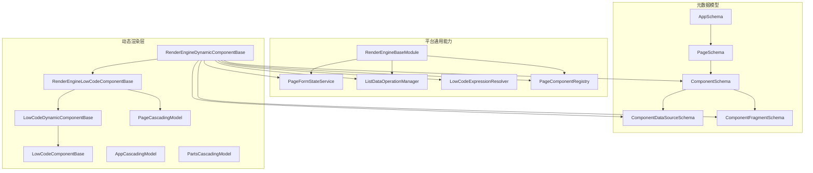
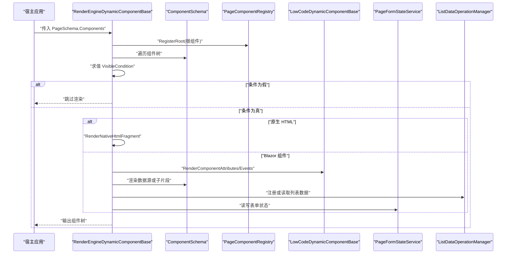
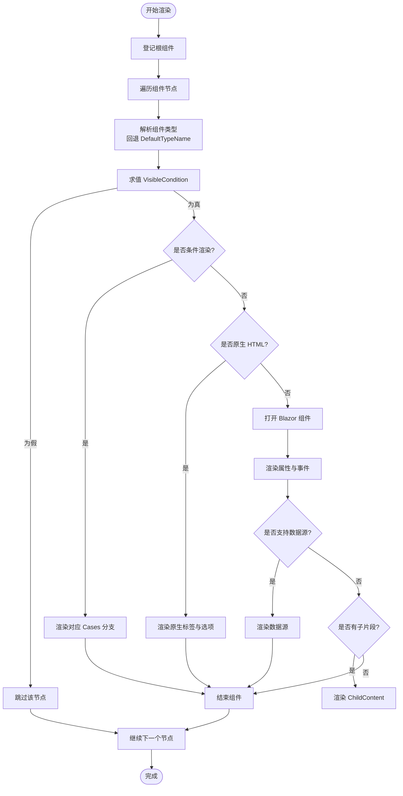
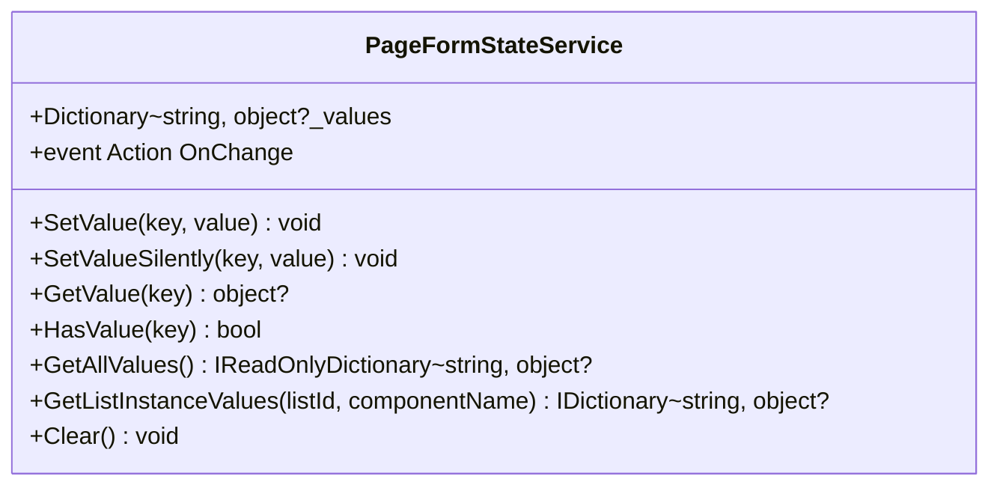
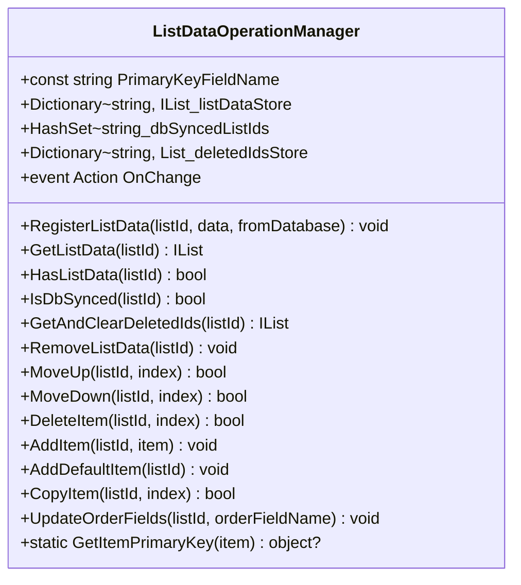
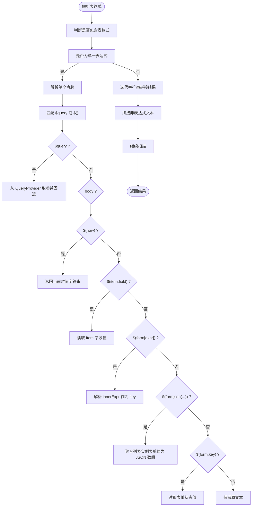
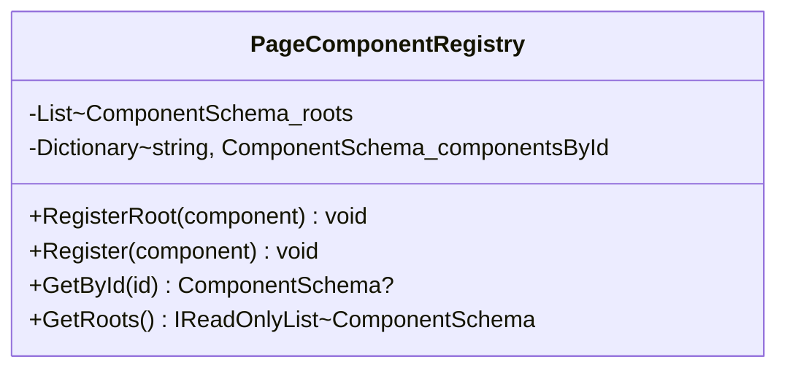
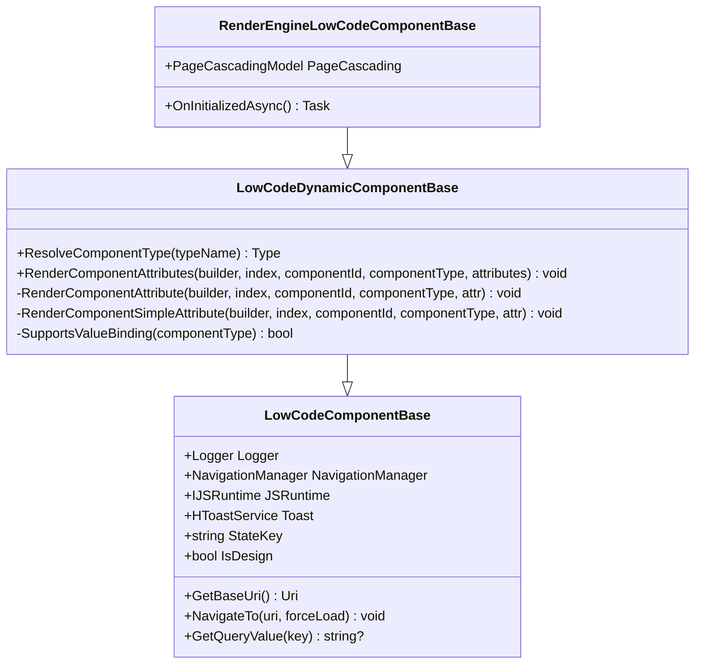
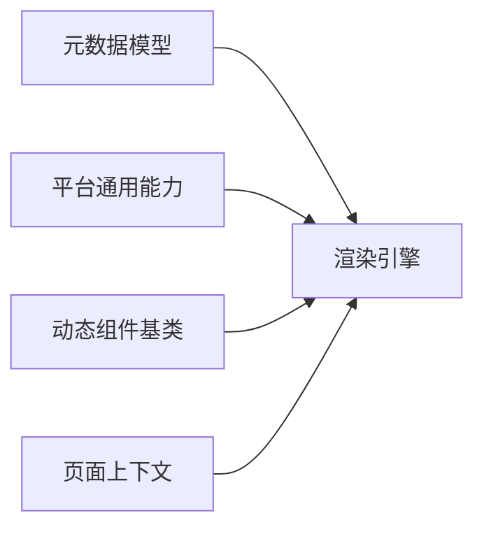
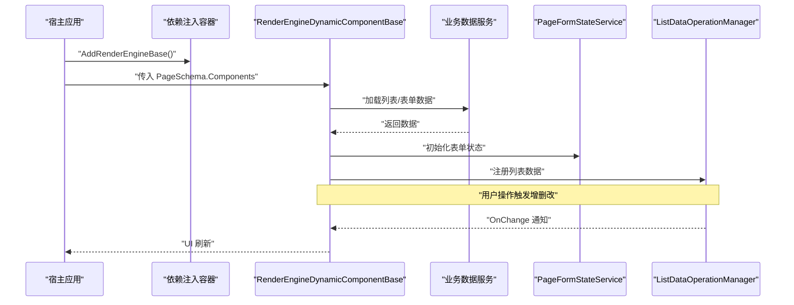

# 渲染引擎

<cite>
**本文引用的文件**   
- [RenderEngineBaseModule.cs](file://src/LowCode/RenderEngine/H.LowCode.RenderEngineBase/RenderEngineBaseModule.cs)
- [PageComponentRegistry.cs](file://src/LowCode/RenderEngine/H.LowCode.RenderEngineBase/PageComponentRegistry.cs)
- [RenderEngineDynamicComponentBase.cs](file://src/LowCode/RenderEngine/H.LowCode.RenderEngineBase/RenderEngineDynamicComponentBase.cs)
- [RenderEngineLowCodeComponentBase.cs](file://src/LowCode/RenderEngine/H.LowCode.RenderEngineBase/RenderEngineLowCodeComponentBase.cs)
- [ListDataOperationManager.cs](file://src/LowCode/RenderEngine/H.LowCode.RenderEngineBase/ListDataOperationManager.cs)
- [PageFormStateService.cs](file://src/LowCode/RenderEngine/H.LowCode.RenderEngineBase/PageFormStateService.cs)
- [LowCodeExpressionResolver.cs](file://src/LowCode/RenderEngine/H.LowCode.RenderEngineBase/LowCodeExpressionResolver.cs)
- [AppSchema.cs](file://src/LowCode/Common/H.LowCode.MetaSchema.RenderEngine/AppSchema.cs)
- [PageSchema.cs](file://src/LowCode/Common/H.LowCode.MetaSchema.RenderEngine/PageSchema.cs)
- [ComponentSchema.cs](file://src/LowCode/Common/H.LowCode.MetaSchema.RenderEngine/ComponentSchema.cs)
- [ComponentDataSourceSchema.cs](file://src/LowCode/Common/H.LowCode.MetaSchema.RenderEngine/DataSourceSchemas/ComponentDataSourceSchema.cs)
- [ComponentFragmentSchema.cs](file://src/LowCode/Common/H.LowCode.MetaSchema.RenderEngine/PropertySchemas/ComponentFragmentSchema.cs)
- [LowCodeDynamicComponentBase.cs](file://src/LowCode/Common/H.LowCode.ComponentBase/LowCodeDynamicComponentBase.cs)
- [LowCodeComponentBase.cs](file://src/LowCode/Common/H.LowCode.ComponentBase/LowCodeComponentBase.cs)
- [PageCascadingModel.cs](file://src/LowCode/Common/H.LowCode.ComponentBase/CascadingModels/PageCascadingModel.cs)
- [AppCascadingModel.cs](file://src/LowCode/Common/H.LowCode.ComponentBase/CascadingModels/AppCascadingModel.cs)
- [PartsCascadingModel.cs](file://src/LowCode/Common/H.LowCode.ComponentBase/CascadingModels/PartsCascadingModel.cs)
</cite>

## 目录
1. [简介](#简介)
2. [项目结构](#项目结构)
3. [核心组件](#核心组件)
4. [架构总览](#架构总览)
5. [详细组件分析](#详细组件分析)
6. [依赖关系分析](#依赖关系分析)
7. [性能与优化](#性能与优化)
8. [主题与样式定制](#主题与样式定制)
9. [集成指南](#集成指南)
10. [故障排查](#故障排查)
11. [结论](#结论)

## 简介
本技术文档面向 H.AppLab 低代码平台的运行时渲染引擎，重点说明以下能力：
- 如何解析 JSON 元数据并动态生成 Blazor 组件树。
- 组件注册机制、生命周期管理与事件处理流程。
- 主题与样式定制方案，包括样式注入、CSS 变量与响应式布局。
- 性能优化策略，如条件渲染、懒加载、列表操作缓存与状态更新最小化。
- 在现有应用中的集成方式、业务数据绑定与用户交互处理示例。

## 项目结构
渲染引擎相关代码主要分布在三个层次：
- 元数据模型层：定义应用、页面、组件、数据源与片段等 JSON 结构。
- 平台通用能力层：提供表单状态、列表数据操作、表达式解析、组件注册表等基础服务。
- 动态渲染层：基于元数据递归构建 Blazor 组件树，处理属性、事件、数据源与子节点。

图表来源
- [AppSchema.cs:1-6](file://src/LowCode/Common/H.LowCode.MetaSchema.RenderEngine/AppSchema.cs#L1-L6)
- [PageSchema.cs:1-9](file://src/LowCode/Common/H.LowCode.MetaSchema.RenderEngine/PageSchema.cs#L1-L9)
- [ComponentSchema.cs:1-83](file://src/LowCode/Common/H.LowCode.MetaSchema.RenderEngine/ComponentSchema.cs#L1-L83)
- [ComponentDataSourceSchema.cs:1-18](file://src/LowCode/Common/H.LowCode.MetaSchema.RenderEngine/DataSourceSchemas/ComponentDataSourceSchema.cs#L1-L18)
- [ComponentFragmentSchema.cs:1-28](file://src/LowCode/Common/H.LowCode.MetaSchema.RenderEngine/PropertySchemas/ComponentFragmentSchema.cs#L1-L28)
- [RenderEngineBaseModule.cs:1-22](file://src/LowCode/RenderEngine/H.LowCode.RenderEngineBase/RenderEngineBaseModule.cs#L1-L22)
- [PageComponentRegistry.cs:1-48](file://src/LowCode/RenderEngine/H.LowCode.RenderEngineBase/PageComponentRegistry.cs#L1-L48)
- [RenderEngineDynamicComponentBase.cs:1-300](file://src/LowCode/RenderEngine/H.LowCode.RenderEngineBase/RenderEngineDynamicComponentBase.cs#L1-L300)
- [RenderEngineLowCodeComponentBase.cs:1-15](file://src/LowCode/RenderEngine/H.LowCode.RenderEngineBase/RenderEngineLowCodeComponentBase.cs#L1-L15)
- [LowCodeDynamicComponentBase.cs:1-134](file://src/LowCode/Common/H.LowCode.ComponentBase/LowCodeDynamicComponentBase.cs#L1-L134)
- [LowCodeComponentBase.cs:1-61](file://src/LowCode/Common/H.LowCode.ComponentBase/LowCodeComponentBase.cs#L1-L61)
- [PageCascadingModel.cs:1-23](file://src/LowCode/Common/H.LowCode.ComponentBase/CascadingModels/PageCascadingModel.cs#L1-L23)
- [AppCascadingModel.cs:1-5](file://src/LowCode/Common/H.LowCode.ComponentBase/CascadingModels/AppCascadingModel.cs#L1-L5)
- [PartsCascadingModel.cs:1-10](file://src/LowCode/Common/H.LowCode.ComponentBase/CascadingModels/PartsCascadingModel.cs#L1-L10)

章节来源
- [AppSchema.cs:1-6](file://src/LowCode/Common/H.LowCode.MetaSchema.RenderEngine/AppSchema.cs#L1-L6)
- [PageSchema.cs:1-9](file://src/LowCode/Common/H.LowCode.MetaSchema.RenderEngine/PageSchema.cs#L1-L9)
- [ComponentSchema.cs:1-83](file://src/LowCode/Common/H.LowCode.MetaSchema.RenderEngine/ComponentSchema.cs#L1-L83)
- [ComponentDataSourceSchema.cs:1-18](file://src/LowCode/Common/H.LowCode.MetaSchema.RenderEngine/DataSourceSchemas/ComponentDataSourceSchema.cs#L1-L18)
- [ComponentFragmentSchema.cs:1-28](file://src/LowCode/Common/H.LowCode.MetaSchema.RenderEngine/PropertySchemas/ComponentFragmentSchema.cs#L1-L28)
- [RenderEngineBaseModule.cs:1-22](file://src/LowCode/RenderEngine/H.LowCode.RenderEngineBase/RenderEngineBaseModule.cs#L1-L22)
- [PageComponentRegistry.cs:1-48](file://src/LowCode/RenderEngine/H.LowCode.RenderEngineBase/PageComponentRegistry.cs#L1-L48)
- [RenderEngineDynamicComponentBase.cs:1-300](file://src/LowCode/RenderEngine/H.LowCode.RenderEngineBase/RenderEngineDynamicComponentBase.cs#L1-L300)
- [RenderEngineLowCodeComponentBase.cs:1-15](file://src/LowCode/RenderEngine/H.LowCode.RenderEngineBase/RenderEngineLowCodeComponentBase.cs#L1-L15)
- [LowCodeDynamicComponentBase.cs:1-134](file://src/LowCode/Common/H.LowCode.ComponentBase/LowCodeDynamicComponentBase.cs#L1-L134)
- [LowCodeComponentBase.cs:1-61](file://src/LowCode/Common/H.LowCode.ComponentBase/LowCodeComponentBase.cs#L1-L61)
- [PageCascadingModel.cs:1-23](file://src/LowCode/Common/H.LowCode.ComponentBase/CascadingModels/PageCascadingModel.cs#L1-L23)
- [AppCascadingModel.cs:1-5](file://src/LowCode/Common/H.LowCode.ComponentBase/CascadingModels/AppCascadingModel.cs#L1-L5)
- [PartsCascadingModel.cs:1-10](file://src/LowCode/Common/H.LowCode.ComponentBase/CascadingModels/PartsCascadingModel.cs#L1-L10)

## 核心组件
- 元数据模型
  - AppSchema：应用级配置入口。
  - PageSchema：页面配置，包含 Components 数组。
  - ComponentSchema：组件配置，包含 Fragment、DataSource、AttributeDefineGroups、Childrens、Cases、DefaultCase 等。
  - ComponentDataSourceSchema：数据源配置，包含 DataSourceFragment 与 ItemTemplate。
  - ComponentFragmentSchema：组件片段，包含默认类型名 DefaultTypeName、子片段 ChildFragments 及 HasChildren 便捷属性。
- 平台通用能力
  - RenderEngineBaseModule：依赖注入扩展，注册 ListDataOperationManager（Singleton）、PageFormStateService（Scoped）、PageComponentRegistry（Scoped）。
  - PageFormStateService：页面表单值存储与变更通知，支持静默设值、按列表实例取值、清空等。
  - ListDataOperationManager：列表数据增删改查、排序、复制、删除记录主键追踪、顺序字段更新。
  - LowCodeExpressionResolver：表达式求值上下文与解析器，支持 $query、$(item.field)、$(form.key)、$(form[expr])、$(formjson(...))、$(now)。
  - PageComponentRegistry：组件树登记表，提供根节点与按 Id 查找能力。
- 动态渲染层
  - RenderEngineDynamicComponentBase：核心渲染引擎，负责递归构建组件树、处理显隐条件、原生 HTML、数据源、属性与事件。
  - RenderEngineLowCodeComponentBase：为低代码组件提供 PageCascadingModel 接入点。
  - LowCodeDynamicComponentBase：通用动态组件基类，负责类型解析、属性与事件渲染。
  - LowCodeComponentBase：通用 Blazor 组件基类，封装日志、导航、JS 互操作、查询参数读取等。

章节来源
- [AppSchema.cs:1-6](file://src/LowCode/Common/H.LowCode.MetaSchema.RenderEngine/AppSchema.cs#L1-L6)
- [PageSchema.cs:1-9](file://src/LowCode/Common/H.LowCode.MetaSchema.RenderEngine/PageSchema.cs#L1-L9)
- [ComponentSchema.cs:1-83](file://src/LowCode/Common/H.LowCode.MetaSchema.RenderEngine/ComponentSchema.cs#L1-L83)
- [ComponentDataSourceSchema.cs:1-18](file://src/LowCode/Common/H.LowCode.MetaSchema.RenderEngine/DataSourceSchemas/ComponentDataSourceSchema.cs#L1-L18)
- [ComponentFragmentSchema.cs:1-28](file://src/LowCode/Common/H.LowCode.MetaSchema.RenderEngine/PropertySchemas/ComponentFragmentSchema.cs#L1-L28)
- [RenderEngineBaseModule.cs:1-22](file://src/LowCode/RenderEngine/H.LowCode.RenderEngineBase/RenderEngineBaseModule.cs#L1-L22)
- [PageFormStateService.cs:1-98](file://src/LowCode/RenderEngine/H.LowCode.RenderEngineBase/PageFormStateService.cs#L1-L98)
- [ListDataOperationManager.cs:1-248](file://src/LowCode/RenderEngine/H.LowCode.RenderEngineBase/ListDataOperationManager.cs#L1-L248)
- [LowCodeExpressionResolver.cs:1-270](file://src/LowCode/RenderEngine/H.LowCode.RenderEngineBase/LowCodeExpressionResolver.cs#L1-L270)
- [PageComponentRegistry.cs:1-48](file://src/LowCode/RenderEngine/H.LowCode.RenderEngineBase/PageComponentRegistry.cs#L1-L48)
- [RenderEngineDynamicComponentBase.cs:1-300](file://src/LowCode/RenderEngine/H.LowCode.RenderEngineBase/RenderEngineDynamicComponentBase.cs#L1-L300)
- [RenderEngineLowCodeComponentBase.cs:1-15](file://src/LowCode/RenderEngine/H.LowCode.RenderEngineBase/RenderEngineLowCodeComponentBase.cs#L1-L15)
- [LowCodeDynamicComponentBase.cs:1-134](file://src/LowCode/Common/H.LowCode.ComponentBase/LowCodeDynamicComponentBase.cs#L1-L134)
- [LowCodeComponentBase.cs:1-61](file://src/LowCode/Common/H.LowCode.ComponentBase/LowCodeComponentBase.cs#L1-L61)

## 架构总览
渲染引擎的工作流如下：
1. 通过 PageSchema.Components 获取页面组件树。
2. RenderEngineDynamicComponentBase 调用 RenderComponent 将根组件注册到 PageComponentRegistry。
3. 递归渲染每个 ComponentSchema：
   - 若 TypeName 为空，回退到 DefaultTypeName。
   - 计算 VisibleCondition，条件为假则跳过。
   - 若为条件渲染组件且存在 Cases，走条件分支渲染。
   - 若为原生 HTML（html:tag），直接渲染标签并可内联选项模板。
   - 否则根据 TypeName 解析 Type，打开 Blazor 组件，渲染属性、事件、数据源或子片段。
4. 属性与事件由 LowCodeDynamicComponentBase 统一处理，事件可映射到当前组件方法。
5. 数据源与列表操作由 ListDataOperationManager 管理，并在变化时触发 UI 刷新。
6. 表单状态由 PageFormStateService 集中管理，驱动显隐联动与值回显。

图表来源
- [RenderEngineDynamicComponentBase.cs:1-300](file://src/LowCode/RenderEngine/H.LowCode.RenderEngineBase/RenderEngineDynamicComponentBase.cs#L1-L300)
- [PageComponentRegistry.cs:1-48](file://src/LowCode/RenderEngine/H.LowCode.RenderEngineBase/PageComponentRegistry.cs#L1-L48)
- [LowCodeDynamicComponentBase.cs:1-134](file://src/LowCode/Common/H.LowCode.ComponentBase/LowCodeDynamicComponentBase.cs#L1-L134)
- [PageFormStateService.cs:1-98](file://src/LowCode/RenderEngine/H.LowCode.RenderEngineBase/PageFormStateService.cs#L1-L98)
- [ListDataOperationManager.cs:1-248](file://src/LowCode/RenderEngine/H.LowCode.RenderEngineBase/ListDataOperationManager.cs#L1-L248)

## 详细组件分析

### 渲染引擎主类 RenderEngineDynamicComponentBase
职责：
- 订阅表单状态与列表数据变更，触发 UI 重绘。
- 创建表达式求值上下文，支持 item/form/query/formjson/now。
- 计算栅格宽度百分比，支持页面布局与 ItemWidth。
- 递归渲染组件树，处理显隐条件、条件渲染、原生 HTML、数据源、子片段与事件。

关键点：
- OnInitializedAsync 中订阅 PageFormStateService.OnChange 与 ListDataOperationManager.OnChange。
- RenderComponent 将根组件登记至 PageComponentRegistry，然后进入 RenderComponentRecursive。
- RenderComponentRecursive：
  - 类型回退：TypeName 为空时使用 DefaultTypeName。
  - 显示条件：VisibleCondition 为假直接返回。
  - 条件渲染：IsConditionalComponent 匹配 Cases 分支。
  - 原生 HTML：NativeHtmlElement 判定，支持选项组内联。
  - Blazor 组件：OpenComponent，渲染属性、事件、数据源或 ChildContent。
  - 列表项模板：当组件无数据源但有 Childrens，会将其作为 ChildContent 递归渲染。

复杂度与性能：
- 递归渲染时间复杂度 O(N)，N 为组件节点数。
- 通过 VisibleCondition 短路减少无效渲染。
- 通过 Lazy 数据源与已加载集合避免重复请求。

图表来源
- [RenderEngineDynamicComponentBase.cs:1-300](file://src/LowCode/RenderEngine/H.LowCode.RenderEngineBase/RenderEngineDynamicComponentBase.cs#L1-L300)

章节来源
- [RenderEngineDynamicComponentBase.cs:1-300](file://src/LowCode/RenderEngine/H.LowCode.RenderEngineBase/RenderEngineDynamicComponentBase.cs#L1-L300)

### 表单状态服务 PageFormStateService
职责：
- 维护页面输入组件的值字典。
- 提供 SetValue/SetValueSilently/GetValue/HasValue/GetAllValues/GetListInstanceValues/Clear。
- 通过 OnChange 通知显隐联动与表达式重新求值。

约定：
- 普通组件 key 为 Name/Id。
- 列表实例组件 key 为 "{listId}|{itemPrimaryKey}|{componentName}"。
- 特殊 key "__lastid" 保存最近一次表单保存生成的主键。

图表来源
- [PageFormStateService.cs:1-98](file://src/LowCode/RenderEngine/H.LowCode.RenderEngineBase/PageFormStateService.cs#L1-L98)

章节来源
- [PageFormStateService.cs:1-98](file://src/LowCode/RenderEngine/H.LowCode.RenderEngineBase/PageFormStateService.cs#L1-L98)

### 列表数据操作管理器 ListDataOperationManager
职责：
- 维护列表数据字典，支持增删改、上移下移、复制、清空。
- 对数据库同步的列表记录被删除行的主键，便于保存时同步删除。
- 提供 UpdateOrderFields 更新顺序字段，GetItemPrimaryKey 获取行主键。

关键特性：
- Singleton 生命周期确保 WebAssembly 状态保持。
- NotifyChange 触发 UI 刷新。
- fromDatabase 标记用于区分本地与数据库同步列表。

图表来源
- [ListDataOperationManager.cs:1-248](file://src/LowCode/RenderEngine/H.LowCode.RenderEngineBase/ListDataOperationManager.cs#L1-L248)

章节来源
- [ListDataOperationManager.cs:1-248](file://src/LowCode/RenderEngine/H.LowCode.RenderEngineBase/ListDataOperationManager.cs#L1-L248)

### 表达式解析器 LowCodeExpressionResolver
职责：
- 提供 LowCodeExpressionContext，包含 Item、FormState、QueryProvider。
- 解析字符串中的 $(...) 与 $query(...) 表达式。
- 支持 $(now)、$(item.field)、$(form.key)、$(form[innerExpr])、$(formjson(listId,compName))。
- FormatValue 将布尔与日期格式化输出。

复杂度：
- 单次解析 O(L)，L 为表达式长度。
- 嵌套括号匹配使用栈深度计数，保证括号正确性。

图表来源
- [LowCodeExpressionResolver.cs:1-270](file://src/LowCode/RenderEngine/H.LowCode.RenderEngineBase/LowCodeExpressionResolver.cs#L1-L270)

章节来源
- [LowCodeExpressionResolver.cs:1-270](file://src/LowCode/RenderEngine/H.LowCode.RenderEngineBase/LowCodeExpressionResolver.cs#L1-L270)

### 组件注册表 PageComponentRegistry
职责：
- 登记页面根组件与所有嵌套组件。
- 提供 GetById 与 GetRoots 查询接口。

用途：
- 事件处理、保存校验、定位组件配置等。

图表来源
- [PageComponentRegistry.cs:1-48](file://src/LowCode/RenderEngine/H.LowCode.RenderEngineBase/PageComponentRegistry.cs#L1-L48)

章节来源
- [PageComponentRegistry.cs:1-48](file://src/LowCode/RenderEngine/H.LowCode.RenderEngineBase/PageComponentRegistry.cs#L1-L48)

### 低代码组件基类体系
- LowCodeComponentBase：封装 Logger、NavigationManager、JSRuntime、Toast、BaseUri、NavigateTo、GetQueryValue。
- LowCodeDynamicComponentBase：类型解析 ResolveComponentType，属性与事件渲染 RenderComponentAttributes/RenderComponentAttribute/RenderComponentSimpleAttribute。
- RenderEngineLowCodeComponentBase：注入 PageCascadingModel，供低代码组件访问页面上下文。

图表来源
- [LowCodeComponentBase.cs:1-61](file://src/LowCode/Common/H.LowCode.ComponentBase/LowCodeComponentBase.cs#L1-L61)
- [LowCodeDynamicComponentBase.cs:1-134](file://src/LowCode/Common/H.LowCode.ComponentBase/LowCodeDynamicComponentBase.cs#L1-L134)
- [RenderEngineLowCodeComponentBase.cs:1-15](file://src/LowCode/RenderEngine/H.LowCode.RenderEngineBase/RenderEngineLowCodeComponentBase.cs#L1-L15)

章节来源
- [LowCodeComponentBase.cs:1-61](file://src/LowCode/Common/H.LowCode.ComponentBase/LowCodeComponentBase.cs#L1-L61)
- [LowCodeDynamicComponentBase.cs:1-134](file://src/LowCode/Common/H.LowCode.ComponentBase/LowCodeDynamicComponentBase.cs#L1-L134)
- [RenderEngineLowCodeComponentBase.cs:1-15](file://src/LowCode/RenderEngine/H.LowCode.RenderEngineBase/RenderEngineLowCodeComponentBase.cs#L1-L15)

## 依赖关系分析
依赖方向：
- 渲染引擎依赖元数据模型以解析 JSON。
- 渲染引擎依赖平台通用能力（表单状态、列表数据、表达式解析、组件注册）。
- 动态组件基类提供属性与事件渲染能力。
- 页面级上下文通过 PageCascadingModel 注入。

图表来源
- [RenderEngineBaseModule.cs:1-22](file://src/LowCode/RenderEngine/H.LowCode.RenderEngineBase/RenderEngineBaseModule.cs#L1-L22)
- [PageComponentRegistry.cs:1-48](file://src/LowCode/RenderEngine/H.LowCode.RenderEngineBase/PageComponentRegistry.cs#L1-L48)
- [RenderEngineDynamicComponentBase.cs:1-300](file://src/LowCode/RenderEngine/H.LowCode.RenderEngineBase/RenderEngineDynamicComponentBase.cs#L1-L300)
- [LowCodeDynamicComponentBase.cs:1-134](file://src/LowCode/Common/H.LowCode.ComponentBase/LowCodeDynamicComponentBase.cs#L1-L134)
- [PageCascadingModel.cs:1-23](file://src/LowCode/Common/H.LowCode.ComponentBase/CascadingModels/PageCascadingModel.cs#L1-L23)

章节来源
- [RenderEngineBaseModule.cs:1-22](file://src/LowCode/RenderEngine/H.LowCode.RenderEngineBase/RenderEngineBaseModule.cs#L1-L22)
- [PageComponentRegistry.cs:1-48](file://src/LowCode/RenderEngine/H.LowCode.RenderEngineBase/PageComponentRegistry.cs#L1-L48)
- [RenderEngineDynamicComponentBase.cs:1-300](file://src/LowCode/RenderEngine/H.LowCode.RenderEngineBase/RenderEngineDynamicComponentBase.cs#L1-L300)
- [LowCodeDynamicComponentBase.cs:1-134](file://src/LowCode/Common/H.LowCode.ComponentBase/LowCodeDynamicComponentBase.cs#L1-L134)
- [PageCascadingModel.cs:1-23](file://src/LowCode/Common/H.LowCode.ComponentBase/CascadingModels/PageCascadingModel.cs#L1-L23)

## 性能与优化
- 条件渲染与显隐联动
  - 通过 VisibleCondition 提前短路，避免无效 DOM 与组件实例创建。
- 类型解析失败容错
  - ResolveComponentType 返回 null 时跳过渲染，防止整页崩溃。
- 数据源懒加载
  - 使用 _loadedListIds 与 _loadingListIds 去重，避免重复请求。
- 列表操作缓存
  - ListDataOperationManager 使用 Singleton 保持内存中列表数据，减少序列化/反序列化开销。
- 表单状态最小化通知
  - PageFormStateService.SetValue 仅在值变化时触发 OnChange，避免不必要的重渲染。
- 栅格布局优化
  - 通过 PageLayout 与 ItemWidth 计算列宽，减少复杂布局计算。

建议：
- 对于大数据集，建议在数据源层分页加载并结合虚拟滚动实现（可在上层列表组件中扩展）。
- 对频繁更新的列表，优先使用 UpdateOrderFields 与批量操作以减少重排。
- 谨慎使用深层嵌套的条件渲染，尽量扁平化组件树。

章节来源
- [RenderEngineDynamicComponentBase.cs:1-300](file://src/LowCode/RenderEngine/H.LowCode.RenderEngineBase/RenderEngineDynamicComponentBase.cs#L1-L300)
- [LowCodeDynamicComponentBase.cs:1-134](file://src/LowCode/Common/H.LowCode.ComponentBase/LowCodeDynamicComponentBase.cs#L1-L134)
- [ListDataOperationManager.cs:1-248](file://src/LowCode/RenderEngine/H.LowCode.RenderEngineBase/ListDataOperationManager.cs#L1-L248)
- [PageFormStateService.cs:1-98](file://src/LowCode/RenderEngine/H.LowCode.RenderEngineBase/PageFormStateService.cs#L1-L98)

## 主题与样式定制
- 样式注入
  - 通过 Blazor 静态资源机制引入样式；默认组件库包含样式文件。
- CSS 变量
  - 建议在宿主应用根元素定义 CSS 变量，由主题样式覆盖。
- 响应式布局
  - 页面布局由 PageCascadingModel.PageLayout 控制列数，渲染引擎据此计算组件宽度百分比。
  - 组件可通过 Style.ItemWidth 指定栅格列数，未配置时按页面布局均分。

实践建议：
- 在宿主应用中定义统一的 CSS 变量命名空间，避免冲突。
- 针对不同屏幕尺寸提供多套 CSS 变量值，结合媒体查询切换。
- 对于复杂布局，优先使用栅格系统而非绝对定位。

章节来源
- [PageCascadingModel.cs:1-23](file://src/LowCode/Common/H.LowCode.ComponentBase/CascadingModels/PageCascadingModel.cs#L1-L23)
- [RenderEngineDynamicComponentBase.cs:1-300](file://src/LowCode/RenderEngine/H.LowCode.RenderEngineBase/RenderEngineDynamicComponentBase.cs#L1-L300)

## 集成指南
在现有应用中嵌入渲染引擎的步骤：
1. 注册渲染引擎基础服务
   - 在依赖注入容器中调用 AddRenderEngineBase，注册 ListDataOperationManager、PageFormStateService、PageComponentRegistry。
2. 提供页面元数据
   - 准备 PageSchema，包含 Components 数组，每个组件包含 Fragment、DataSource、AttributeDefineGroups、Childrens、Cases、DefaultCase 等。
3. 挂载渲染组件
   - 在目标页面或路由中渲染 RenderEngineDynamicComponentBase 或其派生组件，传入 PageSchema.Components。
4. 绑定业务数据
   - 使用 ITableDataAppService 与 IFormDataAppService 在数据源阶段加载数据。
   - 通过 PageFormStateService 统一管理表单值，并通过表达式进行显隐联动。
5. 处理用户交互
   - 在组件事件中调用 ListDataOperationManager 进行增删改、排序等操作。
   - 使用 PageComponentRegistry 定位组件配置，执行保存前的校验。

示例流程：

图表来源
- [RenderEngineBaseModule.cs:1-22](file://src/LowCode/RenderEngine/H.LowCode.RenderEngineBase/RenderEngineBaseModule.cs#L1-L22)
- [RenderEngineDynamicComponentBase.cs:1-300](file://src/LowCode/RenderEngine/H.LowCode.RenderEngineBase/RenderEngineDynamicComponentBase.cs#L1-L300)
- [PageFormStateService.cs:1-98](file://src/LowCode/RenderEngine/H.LowCode.RenderEngineBase/PageFormStateService.cs#L1-L98)
- [ListDataOperationManager.cs:1-248](file://src/LowCode/RenderEngine/H.LowCode.RenderEngineBase/ListDataOperationManager.cs#L1-L248)

章节来源
- [RenderEngineBaseModule.cs:1-22](file://src/LowCode/RenderEngine/H.LowCode.RenderEngineBase/RenderEngineBaseModule.cs#L1-L22)
- [RenderEngineDynamicComponentBase.cs:1-300](file://src/LowCode/RenderEngine/H.LowCode.RenderEngineBase/RenderEngineDynamicComponentBase.cs#L1-L300)
- [PageFormStateService.cs:1-98](file://src/LowCode/RenderEngine/H.LowCode.RenderEngineBase/PageFormStateService.cs#L1-L98)
- [ListDataOperationManager.cs:1-248](file://src/LowCode/RenderEngine/H.LowCode.RenderEngineBase/ListDataOperationManager.cs#L1-L248)

## 故障排查
常见问题与解决思路：
- 组件类型无法解析
  - 检查 ComponentFragmentSchema.TypeName 是否正确，必要时使用 DefaultTypeName。
  - 确认程序集已加载，ResolveComponentType 返回 null 时会跳过渲染。
- 表单值不更新
  - 检查 PageFormStateService 的 key 是否符合约定，特别是列表实例组件的复合 key。
  - 确认事件回调是否正确绑定到组件方法。
- 列表数据不同步
  - 确认 ListDataOperationManager.RegisterListData 是否调用，fromDatabase 标记是否正确。
  - 检查 DeleteItem 后是否通过 GetAndClearDeletedIds 同步删除数据库记录。
- 表达式不生效
  - 检查表达式语法，确保 $(item.field)、$(form.key)、$query(name) 正确使用。
  - 确认 QueryProvider 是否注入，URL 参数是否能正确读取。

章节来源
- [LowCodeDynamicComponentBase.cs:1-134](file://src/LowCode/Common/H.LowCode.ComponentBase/LowCodeDynamicComponentBase.cs#L1-L134)
- [PageFormStateService.cs:1-98](file://src/LowCode/RenderEngine/H.LowCode.RenderEngineBase/PageFormStateService.cs#L1-L98)
- [ListDataOperationManager.cs:1-248](file://src/LowCode/RenderEngine/H.LowCode.RenderEngineBase/ListDataOperationManager.cs#L1-L248)
- [LowCodeExpressionResolver.cs:1-270](file://src/LowCode/RenderEngine/H.LowCode.RenderEngineBase/LowCodeExpressionResolver.cs#L1-L270)

## 结论
H.AppLab 渲染引擎通过 JSON 元数据驱动 Blazor 组件树的动态构建，提供了完善的组件注册、生命周期管理、事件处理、表单状态与列表数据管理能力。其设计兼顾可扩展性与性能，适合在企业级低代码场景中快速搭建复杂界面。开发者应重点关注：
- 元数据结构的完整性与正确性。
- 表单状态与列表数据的生命周期管理。
- 表达式语法的规范使用。
- 主题样式与响应式布局的统一规划。
- 性能优化策略的实际落地，如条件渲染、懒加载与缓存机制。