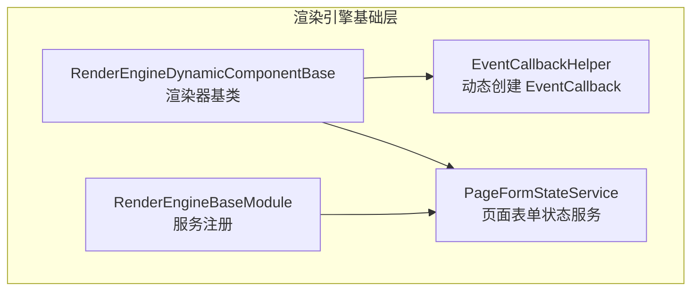
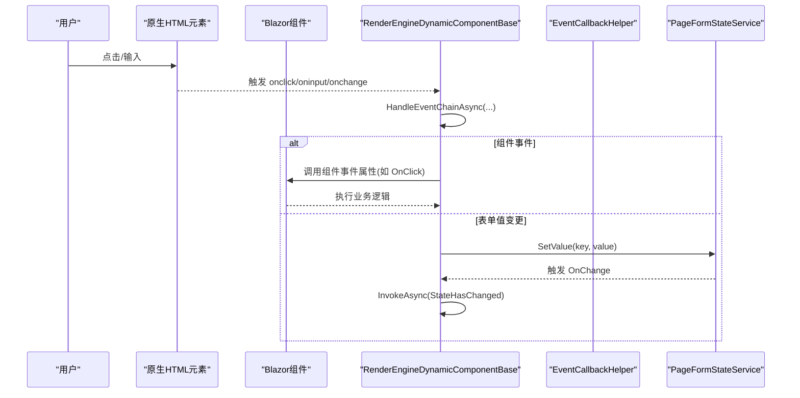
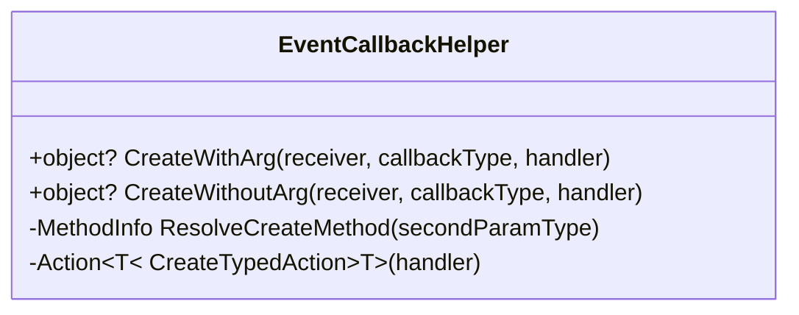
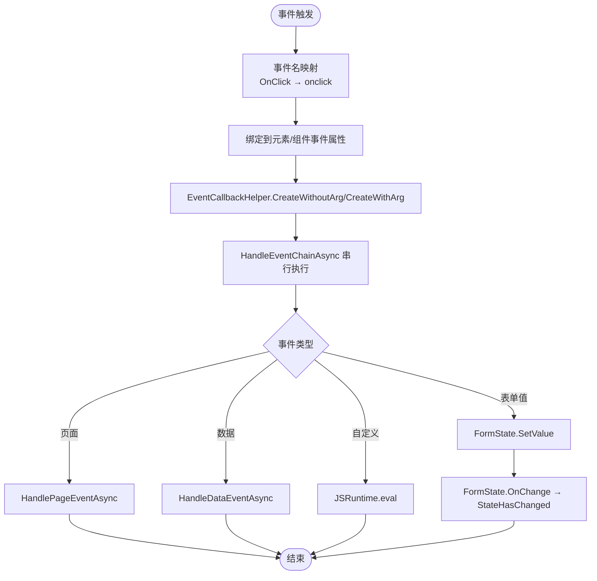
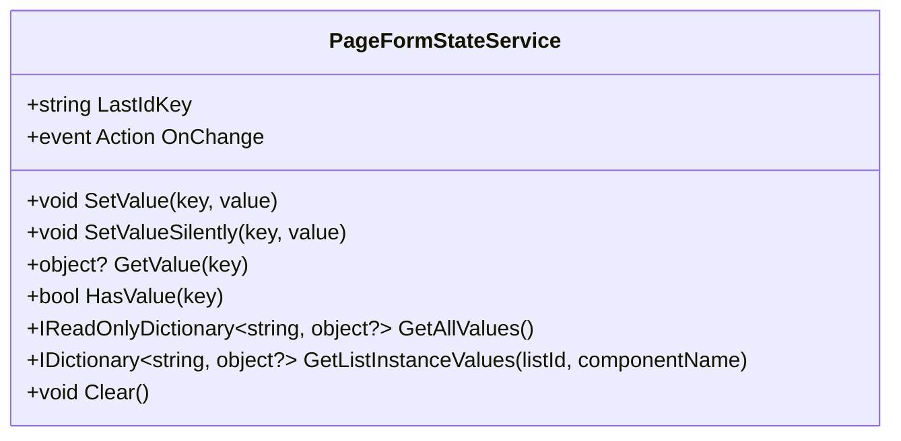
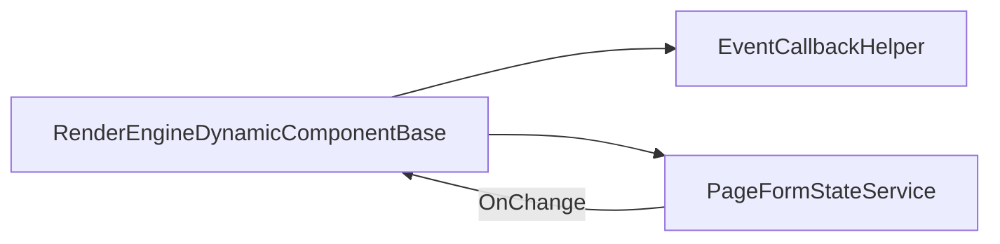

# 事件回调系统

<cite>
**本文引用的文件**   
- [EventCallbackHelper.cs](file://src/LowCode/RenderEngine/H.LowCode.RenderEngineBase/EventCallbackHelper.cs)
- [RenderEngineDynamicComponentBase.cs](file://src/LowCode/RenderEngine/H.LowCode.RenderEngineBase/RenderEngineDynamicComponentBase.cs)
- [PageFormStateService.cs](file://src/LowCode/RenderEngine/H.LowCode.RenderEngineBase/PageFormStateService.cs)
- [RenderEngineBaseModule.cs](file://src/LowCode/RenderEngine/H.LowCode.RenderEngineBase/RenderEngineBaseModule.cs)
</cite>

## 目录
1. [引言](#引言)
2. [项目结构](#项目结构)
3. [核心组件](#核心组件)
4. [架构总览](#架构总览)
5. [详细组件分析](#详细组件分析)
6. [依赖关系分析](#依赖关系分析)
7. [性能与优化](#性能与优化)
8. [故障排查指南](#故障排查指南)
9. [结论](#结论)
10. [附录：使用示例与最佳实践](#附录使用示例与最佳实践)

## 引言
本文件面向低代码渲染引擎的事件回调子系统，重点解释 EventCallbackHelper 如何基于反射动态创建 Blazor 的 EventCallback，并说明它与渲染器、表单状态服务之间的协作关系。内容覆盖以下要点：
- 通过反射查找 EventCallbackFactory.Create，支持 EventCallback 与 EventCallback<T>；
- 有参事件处理 CreateWithArg：将统一处理器 Action<object?> 适配为强类型回调，用于 ValueChanged 等双向绑定；
- 无参事件处理 CreateWithoutArg：忽略事件参数的处理方法，用于 OnClick、OnMouseEnter 等简单事件；
- 元数据到 Blazor 事件的映射流程：事件名称映射、参数类型推断、异步任务处理；
- 跨组件事件通信：父子、兄弟、祖先-后代组件的事件冒泡与捕获语义在本实现中的体现；
- 事件生命周期：触发时机、异常处理与性能策略；
- 与 PageFormStateService 的集成：显隐联动、值回写、表单保存与刷新。

## 项目结构
该子系统位于低代码渲染引擎基础层，由三个关键文件组成：
- EventCallbackHelper：封装 EventCallback 的动态创建逻辑；
- RenderEngineDynamicComponentBase：负责根据元数据渲染组件、绑定属性与事件、执行事件链；
- PageFormStateService：提供页面级表单状态存储与变更通知；
- RenderEngineBaseModule：注册 PageFormStateService 等服务。

图表来源
- [EventCallbackHelper.cs:1-84](file://src/LowCode/RenderEngine/H.LowCode.RenderEngineBase/EventCallbackHelper.cs#L1-L84)
- [RenderEngineDynamicComponentBase.cs:1-200](file://src/LowCode/RenderEngine/H.LowCode.RenderEngineBase/RenderEngineDynamicComponentBase.cs#L1-L200)
- [PageFormStateService.cs:1-98](file://src/LowCode/RenderEngine/H.LowCode.RenderEngineBase/PageFormStateService.cs#L1-L98)
- [RenderEngineBaseModule.cs:1-20](file://src/LowCode/RenderEngine/H.LowCode.RenderEngineBase/RenderEngineBaseModule.cs#L1-L20)

章节来源
- [RenderEngineBaseModule.cs:8-20](file://src/LowCode/RenderEngine/H.LowCode.RenderEngineBase/RenderEngineBaseModule.cs#L8-L20)

## 核心组件
- EventCallbackHelper：以静态辅助类的形式，对外暴露 CreateWithArg 与 CreateWithoutArg，对内通过反射定位 EventCallbackFactory.Create 方法，从而绕过编译期泛型约束，在运行时按目标属性类型生成合适的回调。
- RenderEngineDynamicComponentBase：渲染器的抽象基类，负责：
  - 解析元数据中的事件定义；
  - 将元数据事件映射到原生 HTML 元素事件或 Blazor 组件事件；
  - 调用 EventCallbackHelper 创建回调；
  - 串联执行事件链（HandleEventChainAsync）；
  - 与 PageFormStateService 协同完成表单值读写与联动刷新。
- PageFormStateService：维护页面内所有输入组件的值集合，提供 SetValue/GetValue/HasValue/GetAllValues 等方法，并在值变化时发出 OnChange 事件，驱动 UI 重新渲染。

章节来源
- [EventCallbackHelper.cs:1-84](file://src/LowCode/RenderEngine/H.LowCode.RenderEngineBase/EventCallbackHelper.cs#L1-L84)
- [RenderEngineDynamicComponentBase.cs:460-1060](file://src/LowCode/RenderEngine/H.LowCode.RenderEngineBase/RenderEngineDynamicComponentBase.cs#L460-L1060)
- [PageFormStateService.cs:1-98](file://src/LowCode/RenderEngine/H.LowCode.RenderEngineBase/PageFormStateService.cs#L1-L98)

## 架构总览
下图展示从“用户交互”到“事件处理”再到“状态更新”的整体流程：

图表来源
- [RenderEngineDynamicComponentBase.cs:460-856](file://src/LowCode/RenderEngine/H.LowCode.RenderEngineBase/RenderEngineDynamicComponentBase.cs#L460-L856)
- [RenderEngineDynamicComponentBase.cs:1000-1060](file://src/LowCode/RenderEngine/H.LowCode.RenderEngineBase/RenderEngineDynamicComponentBase.cs#L1000-L1060)
- [PageFormStateService.cs:20-45](file://src/LowCode/RenderEngine/H.LowCode.RenderEngineBase/PageFormStateService.cs#L20-L45)

## 详细组件分析

### EventCallbackHelper：动态创建 EventCallback
职责
- 通过反射查找 EventCallbackFactory.Create 的重载方法，分别匹配 Action<> 与 Func<Task> 两种委托类型；
- 对外提供两类创建入口：
  - CreateWithArg：用于有参回调（例如 ValueChanged），内部把 Action<object?> 包装成强类型 Action<T> 再交由工厂创建；
  - CreateWithoutArg：用于无参回调（例如 OnClick），直接传入 Func<Task> 给工厂创建。

设计要点
- 预解析 Create 方法：ResolveCreateMethod 会遍历 EventCallbackFactory.GetMethods()，筛选出名为 Create、泛型且参数数量为 2 的方法，并按第二个参数类型匹配 Action<> 或 Func<Task>；
- 类型适配：CreateTypedAction<T> 作为桥接方法，将弱类型处理器转换为强类型处理器；
- 运行时泛型构造：通过 MakeGenericMethod 实例化泛型方法，避免编译期对具体 T 的约束。

图表来源
- [EventCallbackHelper.cs:1-84](file://src/LowCode/RenderEngine/H.LowCode.RenderEngineBase/EventCallbackHelper.cs#L1-L84)

章节来源
- [EventCallbackHelper.cs:1-84](file://src/LowCode/RenderEngine/H.LowCode.RenderEngineBase/EventCallbackHelper.cs#L1-L84)

### RenderEngineDynamicComponentBase：事件绑定与执行
职责
- 将元数据中声明的事件，绑定到原生 HTML 元素属性或 Blazor 组件事件属性；
- 构建事件链，按顺序执行每个事件处理器；
- 将表单控件的值写入 PageFormStateService，并在变化时触发 UI 重绘；
- 处理页面跳转、数据操作、校验与保存等高级事件。

关键流程
1. 原生元素事件绑定：
   - 根元素事件名映射：元数据中的事件名（如 OnClick）转小写为元素事件（onclick）；
   - Fragment 级事件：列表模板内的按钮等，仅允许 Data 类型动作，且只支持 OnClick。
2. 组件事件绑定：
   - 通过反射获取组件事件属性（如 OnClick、OnChange）；
   - 调用 EventCallbackHelper.CreateWithoutArg 创建无参回调，包裹 HandleEventChainAsync。
3. 表单值双向绑定：
   - 文本类控件优先读取 FormState.GetValue；未存在则静默回填初始值；
   - oninput/onchange 回写 FormState.SetValue，驱动显隐联动。
4. 事件链执行：
   - HandleEventChainAsync 串行执行各事件；
   - HandleEventAsync 分派到页面跳转、数据操作、自定义脚本等分支；
   - 返回布尔值控制是否中断后续事件。

图表来源
- [RenderEngineDynamicComponentBase.cs:460-856](file://src/LowCode/RenderEngine/H.LowCode.RenderEngineBase/RenderEngineDynamicComponentBase.cs#L460-L856)
- [RenderEngineDynamicComponentBase.cs:1000-1060](file://src/LowCode/RenderEngine/H.LowCode.RenderEngineBase/RenderEngineDynamicComponentBase.cs#L1000-L1060)

章节来源
- [RenderEngineDynamicComponentBase.cs:460-856](file://src/LowCode/RenderEngine/H.LowCode.RenderEngineBase/RenderEngineDynamicComponentBase.cs#L460-L856)
- [RenderEngineDynamicComponentBase.cs:1000-1060](file://src/LowCode/RenderEngine/H.LowCode.RenderEngineBase/RenderEngineDynamicComponentBase.cs#L1000-L1060)

### PageFormStateService：表单状态与联动
职责
- 维护键值对形式的表单状态，key 约定：
  - 普通组件：组件 Name；
  - 列表实例组件："{listId}|{itemPrimaryKey}|{componentName}"；
  - 特殊 key "__lastid" 保存最近一次保存生成的主键。
- 提供 SetValue/SetValueSilently/GetValue/HasValue/GetAllValues/GetListInstanceValues/Clear 等方法；
- 当值发生变化时触发 OnChange，驱动渲染器重绘。

与渲染器的协作
- 渲染器在初始化时订阅 FormState.OnChange，收到通知后调用 InvokeAsync(StateHasChanged) 触发 UI 更新；
- 在 Dispose 时取消订阅，避免内存泄漏。

图表来源
- [PageFormStateService.cs:1-98](file://src/LowCode/RenderEngine/H.LowCode.RenderEngineBase/PageFormStateService.cs#L1-L98)

章节来源
- [PageFormStateService.cs:1-98](file://src/LowCode/RenderEngine/H.LowCode.RenderEngineBase/PageFormStateService.cs#L1-L98)

## 依赖关系分析
- RenderEngineDynamicComponentBase 依赖：
  - EventCallbackHelper：动态创建 EventCallback；
  - PageFormStateService：表单状态存取与联动；
  - JSRuntime / NavigationManager：页面跳转与脚本执行；
  - ListDataManager：列表数据源管理；
  - ComponentRegistry / FieldValidator / Toast / Logger：渲染注册、校验、提示与日志。
- PageFormStateService 被渲染器注入并使用，不反向依赖渲染器。
- EventCallbackHelper 是纯工具类，不依赖其他模块。

图表来源
- [RenderEngineDynamicComponentBase.cs:1-200](file://src/LowCode/RenderEngine/H.LowCode.RenderEngineBase/RenderEngineDynamicComponentBase.cs#L1-L200)
- [RenderEngineBaseModule.cs:8-20](file://src/LowCode/RenderEngine/H.LowCode.RenderEngineBase/RenderEngineBaseModule.cs#L8-L20)

章节来源
- [RenderEngineBaseModule.cs:8-20](file://src/LowCode/RenderEngine/H.LowCode.RenderEngineBase/RenderEngineBaseModule.cs#L8-L20)

## 性能与优化
- 反射开销缓存：EventCallbackHelper 在启动时解析 EventCallbackFactory.Create 方法，避免每次调用都反射；仅在需要泛型实例化时使用 MakeGenericMethod。
- 最小化重绘：PageFormStateService 在 SetValue 前比较旧值，若相等则不触发 OnChange，减少不必要的 UI 更新。
- 异步非阻塞：事件处理多为 async Task，避免同步阻塞渲染线程；渲染器在订阅 OnChange 后使用 InvokeAsync 调度 StateHasChanged。
- 条件渲染：可见性条件为假时跳过组件渲染，降低无效事件绑定数量。
- 事件链短路：HandleEventChainAsync 支持在某一步返回 true 时中断后续事件，适合前置校验失败快速失败。

[本节为通用性能建议，无需特定文件引用]

## 故障排查指南
常见问题与定位思路
- 事件未触发
  - 检查元数据中事件名是否正确映射为元素事件名；
  - 确认是否为根元素事件或 Fragment 级 Data 事件；
  - 查看 HandleEventAsync 的分派分支是否命中预期。
- 值未回写
  - 检查 formValueKey 计算是否正确（列表项需包含 listId 与主键）；
  - 确认控件类型是否属于表单控件；
  - 验证 FormState.HasValue/GetValue 返回值是否符合预期。
- 联动不生效
  - 确认 FormState.OnChange 已订阅，且渲染器未被释放；
  - 检查 VisibleCondition 表达式是否能正确求值。
- 保存失败
  - 查看 SaveFormAsync 中的校验结果与异常日志；
  - 确认页面数据源配置与主键字段设置。

章节来源
- [RenderEngineDynamicComponentBase.cs:1000-1320](file://src/LowCode/RenderEngine/H.LowCode.RenderEngineBase/RenderEngineDynamicComponentBase.cs#L1000-L1320)
- [PageFormStateService.cs:1-98](file://src/LowCode/RenderEngine/H.LowCode.RenderEngineBase/PageFormStateService.cs#L1-L98)

## 结论
EventCallbackHelper 通过反射与泛型构造，实现了在运行时无侵入地创建 Blazor 的 EventCallback，既支持强类型参数，也支持无参场景。RenderEngineDynamicComponentBase 将元数据事件映射到原生与组件事件，串联执行事件链，并与 PageFormStateService 紧密协作，形成“事件触发—状态更新—UI 联动”的闭环。该体系具备良好的扩展性与可维护性，适用于低代码平台中复杂的双向绑定与跨组件事件通信场景。

[本节为总结性内容，无需特定文件引用]

## 附录：使用示例与最佳实践

### 定义与绑定事件
- 在元数据中声明事件（如 OnClick、ValueChanged），渲染器会根据目标组件的属性类型自动选择 CreateWithoutArg 或 CreateWithArg；
- 对于 ValueChanged 这类有参事件，使用 CreateWithArg，并将统一处理器 Action<object?> 的值写入 FormState；
- 对于 OnClick 这类无参事件，使用 CreateWithoutArg，包裹 HandleEventChainAsync 执行事件链。

章节来源
- [RenderEngineDynamicComponentBase.cs:934-954](file://src/LowCode/RenderEngine/H.LowCode.RenderEngineBase/RenderEngineDynamicComponentBase.cs#L934-L954)
- [RenderEngineDynamicComponentBase.cs:1000-1060](file://src/LowCode/RenderEngine/H.LowCode.RenderEngineBase/RenderEngineDynamicComponentBase.cs#L1000-L1060)

### 实现复杂事件流
- 将多个事件按顺序放入事件链，首个返回 true 的事件可中断后续执行；
- 页面跳转、数据操作、自定义脚本等由 HandleEventAsync 分发；
- 表单保存前进行校验，校验失败直接中断并提示错误。

章节来源
- [RenderEngineDynamicComponentBase.cs:1000-1060](file://src/LowCode/RenderEngine/H.LowCode.RenderEngineBase/RenderEngineDynamicComponentBase.cs#L1000-L1060)
- [RenderEngineDynamicComponentBase.cs:1200-1320](file://src/LowCode/RenderEngine/H.LowCode.RenderEngineBase/RenderEngineDynamicComponentBase.cs#L1200-L1320)

### 跨组件事件通信机制
- 父子组件：父组件通过元数据为子组件绑定事件，子组件触发后由父侧 HandleEventChainAsync 执行；
- 兄弟组件：通过共享的 PageFormStateService 值变更通知，兄弟组件监听 OnChange 后更新自身状态；
- 祖先-后代：祖先组件订阅 FormState.OnChange 并触发 StateHasChanged，后代组件在渲染阶段读取最新值。

章节来源
- [PageFormStateService.cs:20-45](file://src/LowCode/RenderEngine/H.LowCode.RenderEngineBase/PageFormStateService.cs#L20-L45)
- [RenderEngineDynamicComponentBase.cs:40-90](file://src/LowCode/RenderEngine/H.LowCode.RenderEngineBase/RenderEngineDynamicComponentBase.cs#L40-L90)