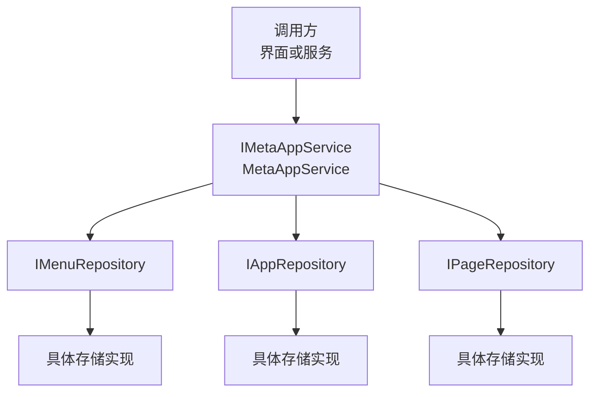
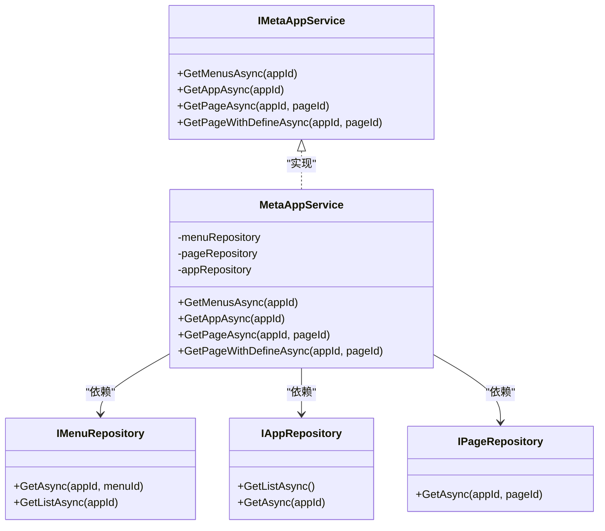
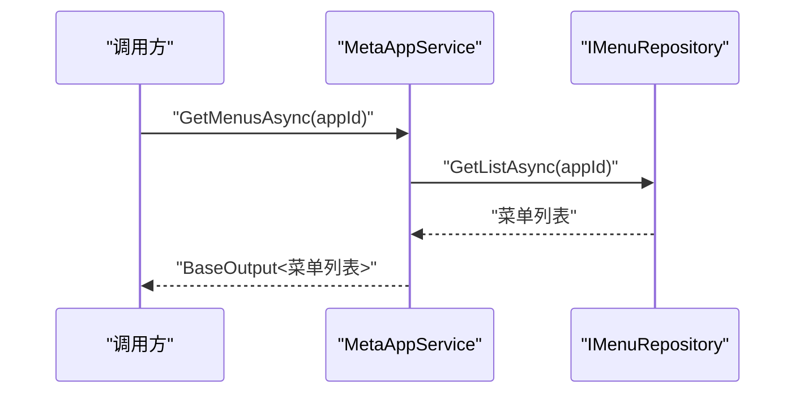
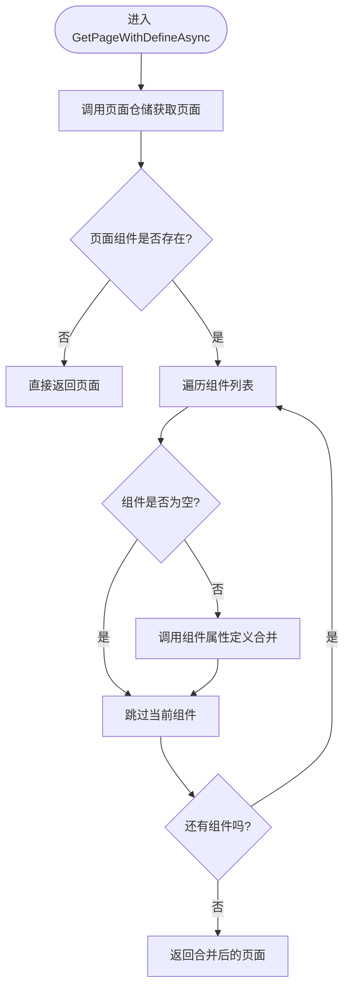
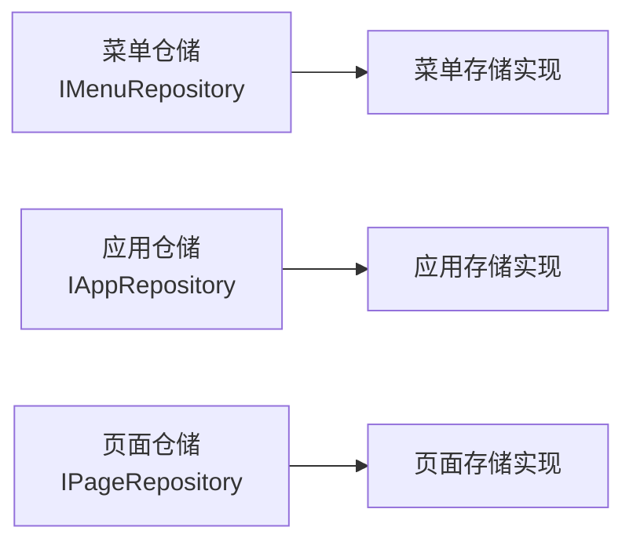

# 元数据应用服务

<cite>
**本文引用的文件**   
- [MetaAppService.cs](file://src/LowCode/RenderEngine/H.LowCode.RenderEngine.Application/RenderAppServices/MetaAppService.cs)
- [IMetaAppService.cs](file://src/LowCode/RenderEngine/H.LowCode.RenderEngine.Application.Contracts/RenderAppServices/IMetaAppService.cs)
- [IPageRepository.cs](file://src/LowCode/RenderEngine/H.LowCode.RenderEngine.Domain/MetaRepositories/IPageRepository.cs)
- [IMenuRepository.cs](file://src/LowCode/RenderEngine/H.LowCode.RenderEngine.Domain/MetaRepositories/IMenuRepository.cs)
- [IAppRepository.cs](file://src/LowCode/RenderEngine/H.LowCode.RenderEngine.Domain/MetaRepositories/IAppRepository.cs)
- [MenuSchema.cs](file://src/LowCode/Common/H.LowCode.MetaSchema/MenuSchema.cs)
- [AppSchemaBase.cs](file://src/LowCode/Common/H.LowCode.MetaSchema/AppSchemaBase.cs)
- [AppSchema.cs](file://src/LowCode/Common/H.LowCode.MetaSchema.RenderEngine/AppSchema.cs)
- [PageSchemaBase.cs](file://src/LowCode/Common/H.LowCode.MetaSchema/PageSchemaBase.cs)
- [PageSchema.cs](file://src/LowCode/Common/H.LowCode.MetaSchema.RenderEngine/PageSchema.cs)
- [ComponentSchema.cs](file://src/LowCode/Common/H.LowCode.MetaSchema.RenderEngine/ComponentSchema.cs)
- [ComponentFragmentSchemaBase.cs](file://src/LowCode/Common/H.LowCode.MetaSchema/PropertySchemas/ComponentFragmentSchemaBase.cs)
- [ComponentAttributeDefineGroupSchema.cs](file://src/LowCode/Common/H.LowCode.MetaSchema.RenderEngine/PropertySchemas/ComponentAttributeDefineGroupSchema.cs)
- [ComponentAttributeDefineSchema.cs](file://src/LowCode/Common/H.LowCode.MetaSchema.RenderEngine/PropertySchemas/ComponentAttributeDefineSchema.cs)
- [StateHasChangeSchema.cs](file://src/LowCode/Common/H.LowCode.MetaSchema/StateHasChangeSchema.cs)
- [MetaSchemaBase.cs](file://src/LowCode/Common/H.LowCode.MetaSchema/MetaSchemaBase.cs)
- [PageTypeEnum.cs](file://src/LowCode/Common/H.LowCode.MetaSchema/Enums/PageTypeEnum.cs)
- [PublishStatusEnum.cs](file://src/LowCode/Common/H.LowCode.MetaSchema/Enums/PublishStatusEnum.cs)
- [SupportPlatformEnum.cs](file://src/LowCode/Common/H.LowCode.MetaSchema/Enums/SupportPlatformEnum.cs)
</cite>

## 目录
1. [引言](#引言)
2. [项目结构定位](#项目结构定位)
3. [核心职责与边界](#核心职责与边界)
4. [支持的元数据类型](#支持的元数据类型)
5. [架构总览](#架构总览)
6. [接口定义](#接口定义)
7. [核心方法实现](#核心方法实现)
8. [仓储层抽象](#仓储层抽象)
9. [元数据结构模型](#元数据结构模型)
10. [版本管理与向后兼容](#版本管理与向后兼容)
11. [缓存策略](#缓存策略)
12. [权限与安全控制](#权限与安全控制)
13. [典型使用场景](#典型使用场景)
14. [性能与复杂度分析](#性能与复杂度分析)
15. [故障排查指南](#故障排查指南)
16. [结论](#结论)

## 引言
本文件围绕低代码平台的“元数据应用服务”展开，重点说明 `MetaAppService` 如何作为菜单、应用、页面等元数据的统一读取入口。它不直接操作数据库或文件系统，而是通过仓储接口访问底层存储；同时提供面向渲染引擎的增强能力，例如在返回页面时自动把组件的属性定义合并到组件片段中，从而简化前端渲染逻辑。

## 项目结构定位
该服务位于渲染引擎的应用层，对外暴露统一的元数据查询接口，对内依赖领域仓储接口。与之配合的是公共元数据 Schema 定义和枚举类型，用于描述菜单、应用、页面以及组件的结构。

**图示来源**
- [MetaAppService.cs:1-57](file://src/LowCode/RenderEngine/H.LowCode.RenderEngine.Application/RenderAppServices/MetaAppService.cs#L1-L57)
- [IMetaAppService.cs:1-17](file://src/LowCode/RenderEngine/H.LowCode.RenderEngine.Application.Contracts/RenderAppServices/IMetaAppService.cs#L1-L17)
- [IMenuRepository.cs:1-10](file://src/LowCode/RenderEngine/H.LowCode.RenderEngine.Domain/MetaRepositories/IMenuRepository.cs#L1-L10)
- [IAppRepository.cs:1-10](file://src/LowCode/RenderEngine/H.LowCode.RenderEngine.Domain/MetaRepositories/IAppRepository.cs#L1-L10)
- [IPageRepository.cs:1-8](file://src/LowCode/RenderEngine/H.LowCode.RenderEngine.Domain/MetaRepositories/IPageRepository.cs#L1-L8)

**章节来源**
- [MetaAppService.cs:1-57](file://src/LowCode/RenderEngine/H.LowCode.RenderEngine.Application/RenderAppServices/MetaAppService.cs#L1-L57)
- [IMetaAppService.cs:1-17](file://src/LowCode/RenderEngine/H.LowCode.RenderEngine.Application.Contracts/RenderAppServices/IMetaAppService.cs#L1-L17)

## 核心职责与边界
- 作为元数据读取的统一入口：对外提供获取菜单、应用、页面、带组件定义的页面的标准化接口。
- 不持有业务状态：本身是轻量应用服务，主要做请求转发、基础校验和结果包装。
- 不负责持久化细节：所有数据访问委托给 `IMenuRepository`、`IAppRepository`、`IPageRepository`。
- 提供渲染期增强：在 `GetPageWithDefineAsync` 中将组件属性定义合并进组件片段，降低前端处理成本。

**章节来源**
- [MetaAppService.cs:1-57](file://src/LowCode/RenderEngine/H.LowCode.RenderEngine.Application/RenderAppServices/MetaAppService.cs#L1-L57)

## 支持的元数据类型
| 元数据类型 | 用途 | 关键结构说明 |
|---|---|---|
| `MenuSchema` | 表示菜单项，支持父子层级，形成树形菜单 | 包含应用标识、菜单标识、父标识、标题、类型、图标、地址、排序、子菜单列表 |
| `AppSchema` | 表示一个低代码应用的基本配置 | 继承应用基类，包含标识、名称、图标、图片、描述、排序、版本、发布状态、支持平台 |
| `PageSchema` | 表示页面定义及其组件树 | 继承页面基类，包含组件数组、页面类型、发布状态、事件和数据源 |
| `ComponentSchema` | 表示单个组件的配置 | 包含渲染片段、数据源、属性定义分组、子组件、条件分支等 |
| `ComponentFragmentSchemaBase` | 表示组件渲染片段 | 包含组件类型名、值类型、属性数组、内容、事件、静态资源及初始化函数 |

**章节来源**
- [MenuSchema.cs:1-37](file://src/LowCode/Common/H.LowCode.MetaSchema/MenuSchema.cs#L1-L37)
- [AppSchemaBase.cs:1-31](file://src/LowCode/Common/H.LowCode.MetaSchema/AppSchemaBase.cs#L1-L31)
- [AppSchema.cs:1-6](file://src/LowCode/Common/H.LowCode.MetaSchema.RenderEngine/AppSchema.cs#L1-L6)
- [PageSchemaBase.cs:1-40](file://src/LowCode/Common/H.LowCode.MetaSchema/PageSchemaBase.cs#L1-L40)
- [PageSchema.cs:1-9](file://src/LowCode/Common/H.LowCode.MetaSchema.RenderEngine/PageSchema.cs#L1-L9)
- [ComponentSchema.cs:1-83](file://src/LowCode/Common/H.LowCode.MetaSchema.RenderEngine/ComponentSchema.cs#L1-L83)
- [ComponentFragmentSchemaBase.cs:1-82](file://src/LowCode/Common/H.LowCode.MetaSchema/PropertySchemas/ComponentFragmentSchemaBase.cs#L1-L82)

## 架构总览
`MetaAppService` 采用分层清晰的应用服务模式：上层暴露应用接口，下层通过仓储抽象屏蔽存储差异。元数据模型集中在公共 MetaSchema 模块中，保证设计器、渲染器共享一致的数据契约。

**图示来源**
- [IMetaAppService.cs:1-17](file://src/LowCode/RenderEngine/H.LowCode.RenderEngine.Application.Contracts/RenderAppServices/IMetaAppService.cs#L1-L17)
- [MetaAppService.cs:1-57](file://src/LowCode/RenderEngine/H.LowCode.RenderEngine.Application/RenderAppServices/MetaAppService.cs#L1-L57)
- [IMenuRepository.cs:1-10](file://src/LowCode/RenderEngine/H.LowCode.RenderEngine.Domain/MetaRepositories/IMenuRepository.cs#L1-L10)
- [IAppRepository.cs:1-10](file://src/LowCode/RenderEngine/H.LowCode.RenderEngine.Domain/MetaRepositories/IAppRepository.cs#L1-L10)
- [IPageRepository.cs:1-8](file://src/LowCode/RenderEngine/H.LowCode.RenderEngine.Domain/MetaRepositories/IPageRepository.cs#L1-L8)

## 接口定义
`IMetaAppService` 定义了四个关键方法：
- `GetMenusAsync(appId)`：按应用获取菜单列表。
- `GetAppAsync(appId)`：按应用标识获取应用配置。
- `GetPageAsync(appId, pageId)`：按应用和页面标识获取页面元数据。
- `GetPageWithDefineAsync(appId, pageId)`：获取页面并合并组件属性定义到渲染片段。

这些方法统一返回 `BaseOutput<T>`，便于调用方统一处理成功数据和错误信息。

**章节来源**
- [IMetaAppService.cs:1-17](file://src/LowCode/RenderEngine/H.LowCode.RenderEngine.Application.Contracts/RenderAppServices/IMetaAppService.cs#L1-L17)

## 核心方法实现

### GetMenusAsync：按应用加载菜单树
该方法根据 `appId` 调用菜单仓储的 `GetListAsync`，将返回的菜单集合包装为统一输出对象。菜单数据通常由仓储层组织成父子关系，以便前端直接构建多级菜单树。

**图示来源**
- [MetaAppService.cs:14-23](file://src/LowCode/RenderEngine/H.LowCode.RenderEngine.Application/RenderAppServices/MetaAppService.cs#L14-L23)
- [IMenuRepository.cs:4-9](file://src/LowCode/RenderEngine/H.LowCode.RenderEngine.Domain/MetaRepositories/IMenuRepository.cs#L4-L9)

**章节来源**
- [MetaAppService.cs:14-23](file://src/LowCode/RenderEngine/H.LowCode.RenderEngine.Application/RenderAppServices/MetaAppService.cs#L14-L23)
- [IMenuRepository.cs:4-9](file://src/LowCode/RenderEngine/H.LowCode.RenderEngine.Domain/MetaRepositories/IMenuRepository.cs#L4-L9)
- [MenuSchema.cs:5-37](file://src/LowCode/Common/H.LowCode.MetaSchema/MenuSchema.cs#L5-L37)

### GetAppAsync：获取应用配置
该方法直接调用应用仓储的 `GetAsync`，返回指定应用的完整配置。应用配置可用于决定应用名称、图标、描述、版本、发布状态和支持平台等信息。

**章节来源**
- [MetaAppService.cs:25-29](file://src/LowCode/RenderEngine/H.LowCode.RenderEngine.Application/RenderAppServices/MetaAppService.cs#L25-L29)
- [IAppRepository.cs:4-9](file://src/LowCode/RenderEngine/H.LowCode.RenderEngine.Domain/MetaRepositories/IAppRepository.cs#L4-L9)
- [AppSchemaBase.cs:5-31](file://src/LowCode/Common/H.LowCode.MetaSchema/AppSchemaBase.cs#L5-L31)
- [AppSchema.cs:1-6](file://src/LowCode/Common/H.LowCode.MetaSchema.RenderEngine/AppSchema.cs#L1-L6)

### GetPageAsync：获取页面元数据
该方法按应用和页面标识获取页面定义，不包含组件属性定义的合并处理。适用于只需要页面骨架、组件树结构和运行时数据的场景。

**章节来源**
- [MetaAppService.cs:31-35](file://src/LowCode/RenderEngine/H.LowCode.RenderEngine.Application/RenderAppServices/MetaAppService.cs#L31-L35)
- [IPageRepository.cs:4-7](file://src/LowCode/RenderEngine/H.LowCode.RenderEngine.Domain/MetaRepositories/IPageRepository.cs#L4-L7)
- [PageSchemaBase.cs:5-40](file://src/LowCode/Common/H.LowCode.MetaSchema/PageSchemaBase.cs#L5-L40)
- [PageSchema.cs:5-9](file://src/LowCode/Common/H.LowCode.MetaSchema.RenderEngine/PageSchema.cs#L5-L9)

### GetPageWithDefineAsync：合并组件属性定义
这是本服务的核心增强方法。它会：
1. 调用页面仓储获取页面。
2. 遍历页面中的组件数组。
3. 对每个非空组件调用属性定义合并逻辑。
4. 将 `AttributeDefineGroups` 转换为 `Fragment.Attributes`。
5. 返回合并后的页面元数据。

**图示来源**
- [MetaAppService.cs:37-56](file://src/LowCode/RenderEngine/H.LowCode.RenderEngine.Application/RenderAppServices/MetaAppService.cs#L37-L56)
- [ComponentSchema.cs:37-83](file://src/LowCode/Common/H.LowCode.MetaSchema.RenderEngine/ComponentSchema.cs#L37-L83)

**章节来源**
- [MetaAppService.cs:37-56](file://src/LowCode/RenderEngine/H.LowCode.RenderEngine.Application/RenderAppServices/MetaAppService.cs#L37-L56)
- [ComponentSchema.cs:1-83](file://src/LowCode/Common/H.LowCode.MetaSchema.RenderEngine/ComponentSchema.cs#L1-L83)

## 仓储层抽象
仓储接口将“读什么”和“怎么存”解耦：
- `IMenuRepository`：提供菜单单项查询和按应用批量查询。
- `IAppRepository`：提供应用列表和应用单项查询。
- `IPageRepository`：提供页面单项查询。

这种抽象允许系统在不同环境使用不同存储后端，例如数据库、远程服务或本地文件。

**图示来源**
- [IMenuRepository.cs:1-10](file://src/LowCode/RenderEngine/H.LowCode.RenderEngine.Domain/MetaRepositories/IMenuRepository.cs#L1-L10)
- [IAppRepository.cs:1-10](file://src/LowCode/RenderEngine/H.LowCode.RenderEngine.Domain/MetaRepositories/IAppRepository.cs#L1-L10)
- [IPageRepository.cs:1-8](file://src/LowCode/RenderEngine/H.LowCode.RenderEngine.Domain/MetaRepositories/IPageRepository.cs#L1-L8)

**章节来源**
- [IMenuRepository.cs:1-10](file://src/LowCode/RenderEngine/H.LowCode.RenderEngine.Domain/MetaRepositories/IMenuRepository.cs#L1-L10)
- [IAppRepository.cs:1-10](file://src/LowCode/RenderEngine/H.LowCode.RenderEngine.Domain/MetaRepositories/IAppRepository.cs#L1-L10)
- [IPageRepository.cs:1-8](file://src/LowCode/RenderEngine/H.LowCode.RenderEngine.Domain/MetaRepositories/IPageRepository.cs#L1-L8)

## 元数据结构模型

### 菜单模型
`MenuSchema` 通过父标识和子菜单数组表达树形结构，适合直接用于侧边栏、顶部导航或动态路由生成。

| 字段 | 含义 |
|---|---|
| `AppId` | 所属应用标识 |
| `Id` | 菜单自身标识 |
| `ParentId` | 父菜单标识 |
| `Title` | 菜单显示标题 |
| `MenuType` | 菜单类型，如菜单或目录 |
| `Icon` | 图标路径或标识 |
| `MenuUrl` | 菜单跳转地址 |
| `Order` | 排序权重 |
| `Childrens` | 子菜单集合 |

**章节来源**
- [MenuSchema.cs:5-37](file://src/LowCode/Common/H.LowCode.MetaSchema/MenuSchema.cs#L5-L37)

### 应用模型
`AppSchema` 继承 `AppSchemaBase`，补充了应用级通用字段：标识、名称、图标、图片、描述、排序、版本、发布状态和支持平台。

| 字段 | 含义 |
|---|---|
| `Id` | 应用标识 |
| `Name` | 应用名称 |
| `Icon` | 应用图标 |
| `Picture` | 应用封面图 |
| `Description` | 应用描述 |
| `Order` | 应用排序 |
| `Version` | 应用版本 |
| `PublishStatus` | 发布状态 |
| `SupportPlatforms` | 支持平台数组 |

**章节来源**
- [AppSchemaBase.cs:5-31](file://src/LowCode/Common/H.LowCode.MetaSchema/AppSchemaBase.cs#L5-L31)
- [AppSchema.cs:1-6](file://src/LowCode/Common/H.LowCode.MetaSchema.RenderEngine/AppSchema.cs#L1-L6)

### 页面模型
`PageSchema` 继承 `PageSchemaBase`，增加组件数组。页面基类包含应用标识、页面标识、名称、排序、页面类型、发布状态、页面属性、数据源和事件。

| 字段 | 含义 |
|---|---|
| `AppId` | 所属应用标识 |
| `Id` | 页面标识 |
| `Name` | 页面名称 |
| `Order` | 页面排序 |
| `PageType` | 页面类型，如普通、表单、列表、报表 |
| `PublishStatus` | 页面发布状态 |
| `PageProperty` | 页面属性 |
| `DataSource` | 页面数据源 |
| `Events` | 页面事件 |
| `Components` | 组件数组 |

**章节来源**
- [PageSchemaBase.cs:5-40](file://src/LowCode/Common/H.LowCode.MetaSchema/PageSchemaBase.cs#L5-L40)
- [PageSchema.cs:5-9](file://src/LowCode/Common/H.LowCode.MetaSchema.RenderEngine/PageSchema.cs#L5-L9)
- [PageTypeEnum.cs:5-15](file://src/LowCode/Common/H.LowCode.MetaSchema/Enums/PageTypeEnum.cs#L5-L15)

### 组件模型
`ComponentSchema` 描述单个组件，包括渲染片段、数据源、属性定义分组、子组件和条件分支。其 `MergeAttributeDefineToFragment` 方法是渲染期属性注入的核心。

| 字段 | 含义 |
|---|---|
| `Fragment` | 组件渲染片段 |
| `DataSource` | 组件数据源 |
| `AttributeDefineGroups` | 属性定义分组 |
| `Childrens` | 子组件 |
| `Cases` | 条件分支映射 |
| `DefaultCase` | 默认分支 |

**章节来源**
- [ComponentSchema.cs:5-83](file://src/LowCode/Common/H.LowCode.MetaSchema.RenderEngine/ComponentSchema.cs#L5-L83)

### 片段与属性模型
`ComponentFragmentSchemaBase` 描述组件运行时的片段，包括类型名、值类型、属性数组、内容、事件和资源。`ComponentAttributeFragmentSchema` 描述片段属性的键名、类型和值。

**章节来源**
- [ComponentFragmentSchemaBase.cs:5-82](file://src/LowCode/Common/H.LowCode.MetaSchema/PropertySchemas/ComponentFragmentSchemaBase.cs#L5-L82)
- [ComponentAttributeDefineGroupSchema.cs:5-9](file://src/LowCode/Common/H.LowCode.MetaSchema.RenderEngine/PropertySchemas/ComponentAttributeDefineGroupSchema.cs#L5-L9)
- [ComponentAttributeDefineSchema.cs:3-6](file://src/LowCode/Common/H.LowCode.MetaSchema.RenderEngine/PropertySchemas/ComponentAttributeDefineSchema.cs#L3-L6)

## 版本管理与向后兼容
从现有实现看，版本管理主要体现在以下方面：
- 应用和页面均携带版本或发布状态字段，可用于区分开发、审批、已发布等不同阶段。
- 所有 Schema 都基于 JSON 序列化特性，字段缺失时对应属性为空或默认值，有利于旧数据在新结构中安全降级。
- 组件属性定义与渲染片段分离，新增属性定义不会影响已有 Fragment 的渲染；合并逻辑只在存在定义时才写入片段。

需要注意：
- 当前仓库未展示显式的版本号迁移脚本或 Schema 版本路由逻辑。
- 若未来需要严格的多版本共存，应在仓储层或应用层增加版本选择策略，并在解析失败时回退到兼容版本。

**章节来源**
- [AppSchemaBase.cs:17-31](file://src/LowCode/Common/H.LowCode.MetaSchema/AppSchemaBase.cs#L17-L31)
- [PageSchemaBase.cs:15-40](file://src/LowCode/Common/H.LowCode.MetaSchema/PageSchemaBase.cs#L15-L40)
- [ComponentSchema.cs:37-83](file://src/LowCode/Common/H.LowCode.MetaSchema.RenderEngine/ComponentSchema.cs#L37-L83)
- [PublishStatusEnum.cs:3-8](file://src/LowCode/Common/H.LowCode.MetaSchema/Enums/PublishStatusEnum.cs#L3-L8)

## 缓存策略
在当前源码中，`MetaAppService` 没有内置缓存逻辑。这意味着每次调用都会经过仓储层访问存储。实际项目中建议：
- 在仓储层或应用层引入内存缓存，以 `appId` 或 `appId+pageId` 作为缓存键。
- 对菜单和应用配置设置较长过期时间，因为变更频率较低。
- 对页面元数据设置较短过期时间，或在页面保存后主动失效相关缓存。
- 结合发布状态进行差异化缓存，避免将未发布或草稿状态的内容长期缓存。

由于这些策略未在现有文件中实现，上述内容为通用优化建议，不应视为当前仓库的既定行为。

**章节来源**
- [MetaAppService.cs:1-57](file://src/LowCode/RenderEngine/H.LowCode.RenderEngine.Application/RenderAppServices/MetaAppService.cs#L1-L57)

## 权限与安全控制
当前 `MetaAppService` 的实现中没有显式用户角色过滤或权限检查逻辑。因此：
- 菜单是否可见、页面是否可访问，应由仓储实现、上游服务或网关拦截器负责。
- 如果需要在应用层加入权限判断，可以在调用仓储前校验用户角色或资源权限，再决定是否返回菜单或页面数据。
- 对于敏感页面，应避免仅依赖前端隐藏，必须在服务端完成鉴权。

**章节来源**
- [MetaAppService.cs:1-57](file://src/LowCode/RenderEngine/H.LowCode.RenderEngine.Application/RenderAppServices/MetaAppService.cs#L1-L57)

## 典型使用场景

### 应用启动时加载菜单树
调用 `GetMenusAsync` 获取菜单列表，由前端根据 `ParentId` 和 `Childrens` 构建树形菜单。该过程适合放在应用初始化阶段，减少后续导航时的重复请求。

**章节来源**
- [MenuSchema.cs:5-37](file://src/LowCode/Common/H.LowCode.MetaSchema/MenuSchema.cs#L5-L37)
- [MetaAppService.cs:14-23](file://src/LowCode/RenderEngine/H.LowCode.RenderEngine.Application/RenderAppServices/MetaAppService.cs#L14-L23)

### 页面渲染前获取完整组件定义
调用 `GetPageWithDefineAsync`，使组件的 `Fragment.Attributes` 直接包含属性定义转换后的值。渲染器可直接读取属性值，无需再次解析属性定义分组。

**章节来源**
- [MetaAppService.cs:37-56](file://src/LowCode/RenderEngine/H.LowCode.RenderEngine.Application/RenderAppServices/MetaAppService.cs#L37-L56)
- [ComponentSchema.cs:37-83](file://src/LowCode/Common/H.LowCode.MetaSchema.RenderEngine/ComponentSchema.cs#L37-L83)

### 动态路由生成
利用菜单的 `MenuUrl` 与页面元数据中的 `PageType`、`Id` 组合，生成前端路由表。例如将菜单地址映射到页面组件，并在导航时加载对应页面元数据。

**章节来源**
- [MenuSchema.cs:25-37](file://src/LowCode/Common/H.LowCode.MetaSchema/MenuSchema.cs#L25-L37)
- [PageSchemaBase.cs:15-40](file://src/LowCode/Common/H.LowCode.MetaSchema/PageSchemaBase.cs#L15-L40)

### 多平台应用分发
根据 `AppSchema` 的 `SupportPlatforms` 和 `PublishStatus`，在服务端或部署层决定哪些应用对哪些平台可见，从而实现 Web、移动端、小程序等平台差异化发布。

**章节来源**
- [AppSchemaBase.cs:17-31](file://src/LowCode/Common/H.LowCode.MetaSchema/AppSchemaBase.cs#L17-L31)
- [SupportPlatformEnum.cs:5-13](file://src/LowCode/Common/H.LowCode.MetaSchema/Enums/SupportPlatformEnum.cs#L5-L13)
- [PublishStatusEnum.cs:3-8](file://src/LowCode/Common/H.LowCode.MetaSchema/Enums/PublishStatusEnum.cs#L3-L8)

## 性能与复杂度分析

### 时间复杂度
- `GetMenusAsync`：取决于仓储层返回的菜单数量 `n`，通常为 `O(n)`。
- `GetAppAsync`：常量时间获取单个应用，仓储内部可能涉及一次查询。
- `GetPageAsync`：常量时间获取单个页面，仓储内部可能涉及一次查询。
- `GetPageWithDefineAsync`：遍历组件数组，设组件数量为 `c`，合并逻辑为 `O(c)`。

### 空间复杂度
- 菜单树、页面组件树均以对象形式返回，空间复杂度与数据规模线性相关。
- 合并属性定义会创建新的属性片段数组，但仅在存在属性定义时发生。

### 优化建议
- 在仓储层对菜单和应用配置添加缓存。
- 对页面组件较多的场景，考虑分页加载或按需懒加载子组件。
- 对频繁变化的页面元数据设置合理缓存失效策略。

[本节为通用性能讨论，不直接分析特定文件]

## 故障排查指南

### 问题：菜单为空
可能原因：
- 传入的 `appId` 不正确。
- 仓储层未按应用过滤菜单。
- 菜单数据尚未创建或未发布。

排查步骤：
1. 确认 `appId` 是否与目标应用一致。
2. 检查仓储实现是否正确返回该应用的菜单列表。
3. 查看菜单的发布状态和所属应用标识。

**章节来源**
- [MetaAppService.cs:14-23](file://src/LowCode/RenderEngine/H.LowCode.RenderEngine.Application/RenderAppServices/MetaAppService.cs#L14-L23)
- [IMenuRepository.cs:4-9](file://src/LowCode/RenderEngine/H.LowCode.RenderEngine.Domain/MetaRepositories/IMenuRepository.cs#L4-L9)

### 问题：页面组件没有属性值
可能原因：
- 调用了 `GetPageAsync` 而不是 `GetPageWithDefineAsync`。
- 组件缺少 `AttributeDefineGroups`。
- 组件本身为 `null`，导致跳过合并。

排查步骤：
1. 确认调用的是 `GetPageWithDefineAsync`。
2. 检查组件的 `AttributeDefineGroups` 是否存在且非空。
3. 检查组件数组中是否存在空元素。

**章节来源**
- [MetaAppService.cs:37-56](file://src/LowCode/RenderEngine/H.LowCode.RenderEngine.Application/RenderAppServices/MetaAppService.cs#L37-L56)
- [ComponentSchema.cs:37-83](file://src/LowCode/Common/H.LowCode.MetaSchema.RenderEngine/ComponentSchema.cs#L37-L83)

### 问题：页面无法渲染
可能原因：
- 页面不存在。
- 组件类型名无效。
- 组件片段缺少必要属性。

排查步骤：
1. 使用 `GetPageAsync` 先验证页面是否存在。
2. 检查组件类型名是否与渲染引擎注册的类型匹配。
3. 检查 `Fragment.Attributes` 是否包含渲染所需的关键属性。

**章节来源**
- [MetaAppService.cs:31-35](file://src/LowCode/RenderEngine/H.LowCode.RenderEngine.Application/RenderAppServices/MetaAppService.cs#L31-L35)
- [ComponentFragmentSchemaBase.cs:5-82](file://src/LowCode/Common/H.LowCode.MetaSchema/PropertySchemas/ComponentFragmentSchemaBase.cs#L5-L82)

## 结论
`MetaAppService` 是低代码平台渲染阶段的元数据读取中枢。它通过清晰的仓储抽象隔离存储实现，并通过 `GetPageWithDefineAsync` 提供关键的渲染期增强能力。对于生产环境，建议在仓储层或应用层补充缓存、权限控制和版本选择策略，以进一步提升性能、安全性和可维护性。