# 列表数据管理

<cite>
**本文引用的文件**   
- [ListDataOperationManager.cs](file://src/LowCode/RenderEngine/H.LowCode.RenderEngineBase/ListDataOperationManager.cs)
- [RenderEngineDynamicComponentBase.cs](file://src/LowCode/RenderEngine/H.LowCode.RenderEngineBase/RenderEngineDynamicComponentBase.cs)
- [ITableDataAppService.cs](file://src/LowCode/Common/H.LowCode.Application.Contracts/AppServices/ITableDataAppService.cs)
- [TableDataAppService（设计引擎）.cs](file://src/LowCode/DesignEngine/H.LowCode.DesignEngine.Application/AppServices/TableDataAppService.cs)
- [TableDataAppService（渲染引擎）.cs](file://src/LowCode/RenderEngine/H.LowCode.RenderEngine.Application/DataAppServices/TableDataAppService.cs)
- [TableDataRepository.cs](file://src/LowCode/RenderEngine/H.LowCode.RenderEngine.EntityFrameworkCore/DataRepositories/TableDataRepository.cs)
- [TableDataInput.cs](file://src/LowCode/Common/H.LowCode.Application.Contracts/Dtos/TableDataInput.cs)
- [TableDataDeleteInput.cs](file://src/LowCode/Common/H.LowCode.Application.Contracts/Dtos/TableDataDeleteInput.cs)
- [TableDataUpdateInput.cs](file://src/LowCode/Common/H.LowCode.Application.Contracts/Dtos/TableDataUpdateInput.cs)
- [TableDataSaveInput.cs](file://src/LowCode/Common/H.LowCode.Application.Contracts/Dtos/TableDataSaveInput.cs)
</cite>

## 目录
1. [引言](#引言)
2. [项目结构定位](#项目结构定位)
3. [核心组件概览](#核心组件概览)
4. [架构总览](#架构总览)
5. [详细组件分析](#详细组件分析)
6. [依赖关系分析](#依赖关系分析)
7. [性能与内存优化](#性能与内存优化)
8. [使用场景与实践建议](#使用场景与实践建议)
9. [故障排查指南](#故障排查指南)
10. [结论](#结论)

## 引言
本文件面向低代码平台中的“列表数据管理子系统”，围绕 `ListDataOperationManager` 展开，说明其如何统一管理多个列表组件的增删改查、排序、复制、主键生成、数据库同步标记以及事件通知。文档同时梳理该管理器与表格数据应用服务 `ITableDataAppService` 及底层仓储的协作方式，并给出在表格组件中绑定数据、拖拽排序、批量操作和持久化保存的最佳实践。

## 项目结构定位
列表数据管理位于渲染引擎基础层与应用契约之间：
- 渲染引擎基础层提供 `ListDataOperationManager`，负责内存中多列表实例的生命周期与变更操作。
- 渲染引擎动态组件基类订阅其变更事件，驱动视图重新渲染。
- 应用契约层定义统一的表格数据接口和数据传输对象。
- 设计引擎与渲染引擎分别提供 `ITableDataAppService` 的实现，用于模拟或真实的数据访问。
- 实体框架实现通过 `TableDataRepository` 完成分页查询、删除、更新和按主键新增/更新。

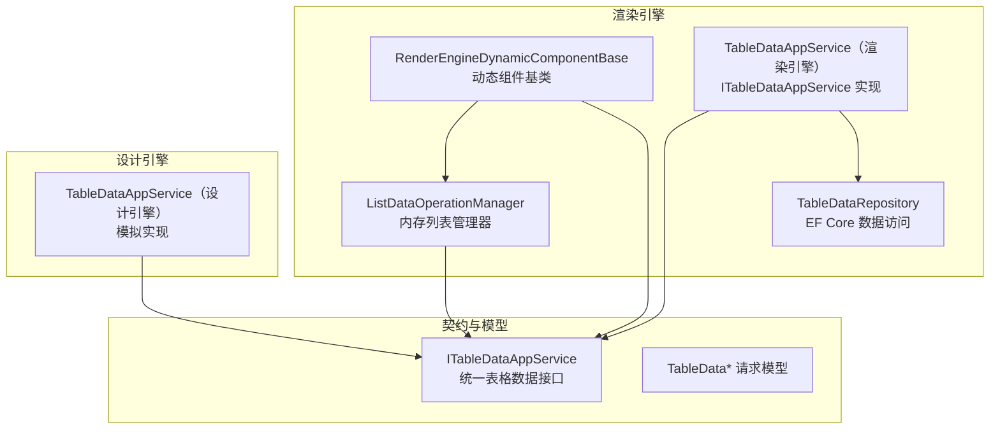

**图表来源**
- [ListDataOperationManager.cs:1-248](file://src/LowCode/RenderEngine/H.LowCode.RenderEngineBase/ListDataOperationManager.cs#L1-L248)
- [RenderEngineDynamicComponentBase.cs:1-200](file://src/LowCode/RenderEngine/H.LowCode.RenderEngineBase/RenderEngineDynamicComponentBase.cs#L1-L200)
- [ITableDataAppService.cs:1-30](file://src/LowCode/Common/H.LowCode.Application.Contracts/AppServices/ITableDataAppService.cs#L1-L30)
- [TableDataAppService（渲染引擎）.cs:1-42](file://src/LowCode/RenderEngine/H.LowCode.RenderEngine.Application/DataAppServices/TableDataAppService.cs#L1-L42)
- [TableDataRepository.cs:1-313](file://src/LowCode/RenderEngine/H.LowCode.RenderEngine.EntityFrameworkCore/DataRepositories/TableDataRepository.cs#L1-L313)
- [TableDataAppService（设计引擎）.cs:1-79](file://src/LowCode/DesignEngine/H.LowCode.DesignEngine.Application/AppServices/TableDataAppService.cs#L1-L79)

**章节来源**
- [ListDataOperationManager.cs:1-248](file://src/LowCode/RenderEngine/H.LowCode.RenderEngineBase/ListDataOperationManager.cs#L1-L248)
- [ITableDataAppService.cs:1-30](file://src/LowCode/Common/H.LowCode.Application.Contracts/AppServices/ITableDataAppService.cs#L1-L30)

## 核心组件概览
- `ListDataOperationManager`：平台级列表数据操作管理器，维护多个列表实例的内存字典 `_listDataStore`，并提供注册、查询、上移、下移、删除、添加、默认项、复制、顺序字段更新、主键读取等方法。
- `ITableDataAppService`：统一表格数据应用服务接口，定义分页查询、删除、更新、保存等远程调用方法。
- `TableDataAppService（渲染引擎）`：将接口调用委托给 `ITableDataRepository`，对接数据库。
- `TableDataAppService（设计引擎）`：提供模拟数据与日志输出，便于设计器演示。
- `TableDataRepository`：基于 EF Core 的动态类型访问层，根据数据源元数据构造查询、更新、删除和新增逻辑。

**章节来源**
- [ListDataOperationManager.cs:1-248](file://src/LowCode/RenderEngine/H.LowCode.RenderEngineBase/ListDataOperationManager.cs#L1-L248)
- [ITableDataAppService.cs:1-30](file://src/LowCode/Common/H.LowCode.Application.Contracts/AppServices/ITableDataAppService.cs#L1-L30)
- [TableDataAppService（渲染引擎）.cs:1-42](file://src/LowCode/RenderEngine/H.LowCode.RenderEngine.Application/DataAppServices/TableDataAppService.cs#L1-L42)
- [TableDataAppService（设计引擎）.cs:1-79](file://src/LowCode/DesignEngine/H.LowCode.DesignEngine.Application/AppServices/TableDataAppService.cs#L1-L79)
- [TableDataRepository.cs:1-313](file://src/LowCode/RenderEngine/H.LowCode.RenderEngine.EntityFrameworkCore/DataRepositories/TableDataRepository.cs#L1-L313)

## 架构总览
列表数据管理的职责边界如下：
- 渲染层动态组件负责加载数据、展示列表、响应用户交互。
- `ListDataOperationManager` 负责内存中列表数据的组织、变更与事件通知。
- `ITableDataAppService` 抽象了远程数据访问，屏蔽具体存储实现。
- `TableDataRepository` 根据数据源配置动态解析实体类型、字段、主键并进行 CRUD。

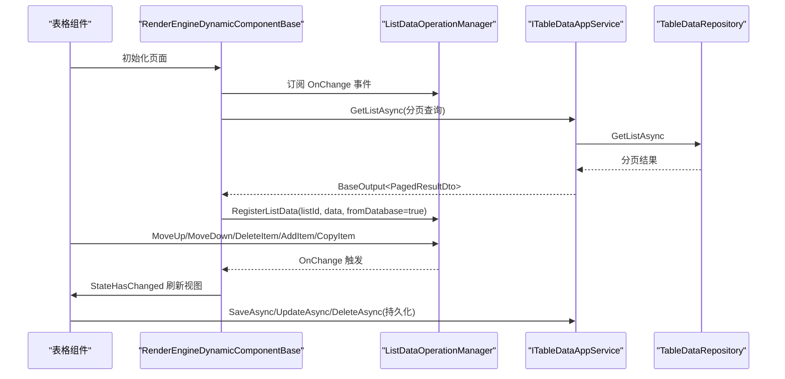

**图表来源**
- [RenderEngineDynamicComponentBase.cs:1-200](file://src/LowCode/RenderEngine/H.LowCode.RenderEngineBase/RenderEngineDynamicComponentBase.cs#L1-L200)
- [ListDataOperationManager.cs:1-248](file://src/LowCode/RenderEngine/H.LowCode.RenderEngineBase/ListDataOperationManager.cs#L1-L248)
- [ITableDataAppService.cs:1-30](file://src/LowCode/Common/H.LowCode.Application.Contracts/AppServices/ITableDataAppService.cs#L1-L30)
- [TableDataRepository.cs:1-313](file://src/LowCode/RenderEngine/H.LowCode.RenderEngine.EntityFrameworkCore/DataRepositories/TableDataRepository.cs#L1-L313)

## 详细组件分析

### ListDataOperationManager：列表数据操作管理器
该类是列表数据管理子系统的核心，承担以下职责：
- 维护多列表内存字典 `_listDataStore`，以 `listId` 为键。
- 区分数据库同步列表与非数据库列表，使用 `_dbSyncedListIds` 记录需要持久化时处理删除行的列表。
- 在编辑过程中记录被删除行的主键 `_deletedIdsStore`，以便保存时批量同步删除。
- 提供 `RegisterListData`、`GetListData`、`HasListData`、`IsDbSynced`、`RemoveListData` 等生命周期与方法查询。
- 提供 `MoveUp`、`MoveDown`、`DeleteItem`、`AddItem`、`AddDefaultItem`、`CopyItem`、`UpdateOrderFields` 等操作方法。
- 暴露 `OnChange` 事件，驱动 UI 重新渲染。
- 约定主键字段名为 `f_id`，并通过静态方法 `GetItemPrimaryKey` 从行数据中获取主键值。

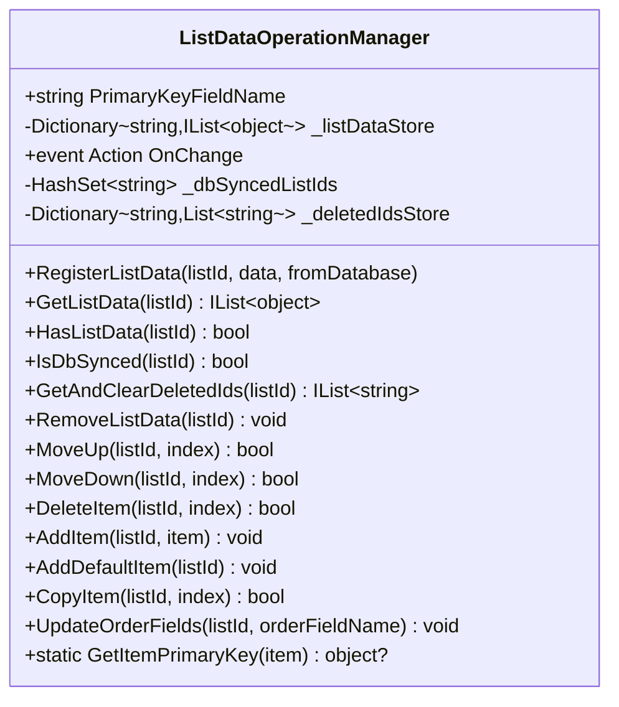

**图表来源**
- [ListDataOperationManager.cs:1-248](file://src/LowCode/RenderEngine/H.LowCode.RenderEngineBase/ListDataOperationManager.cs#L1-L248)

#### 关键行为与复杂度
- 注册与查询：O(1) 字典查找；删除项 O(n) 列表移除插入；复制项对字典进行浅拷贝，时间复杂度 O(k)，k 为字典字段数。
- 删除记录主键：仅在数据库同步列表且行存在有效主键时追加到 `_deletedIdsStore`。
- 顺序字段更新：遍历列表并对字典项写入顺序字段，时间复杂度 O(n)。

**章节来源**
- [ListDataOperationManager.cs:1-248](file://src/LowCode/RenderEngine/H.LowCode.RenderEngineBase/ListDataOperationManager.cs#L1-L248)

### 列表数据注册机制：RegisterListData
- 将传入的 `IList<object>` 放入 `_listDataStore`。
- 当 `fromDatabase = true` 时：
  - 将该 `listId` 加入 `_dbSyncedListIds`，表示保存时需要处理删除同步。
  - 初始化 `_deletedIdsStore[listId]` 为空列表，用于累积本次编辑中被删除行的主键。
- 非数据库列表不会进入删除同步流程，适合纯前端临时数据。

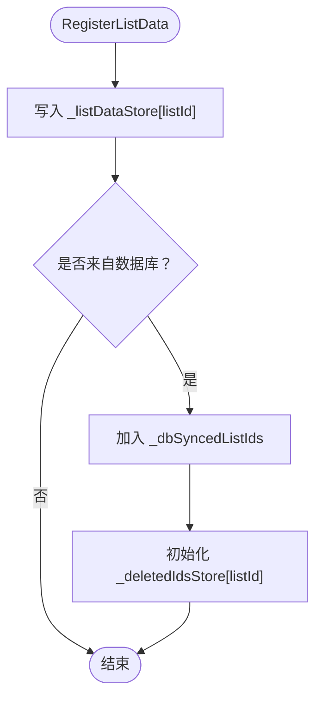

**图表来源**
- [ListDataOperationManager.cs:1-248](file://src/LowCode/RenderEngine/H.LowCode.RenderEngineBase/ListDataOperationManager.cs#L1-L248)

**章节来源**
- [ListDataOperationManager.cs:1-248](file://src/LowCode/RenderEngine/H.LowCode.RenderEngineBase/ListDataOperationManager.cs#L1-L248)

### 列表操作方法详解

#### MoveUp / MoveDown：调整顺序
- 校验索引合法性后交换元素位置，并触发 `OnChange`。
- 适用于拖拽排序后的即时视觉反馈。

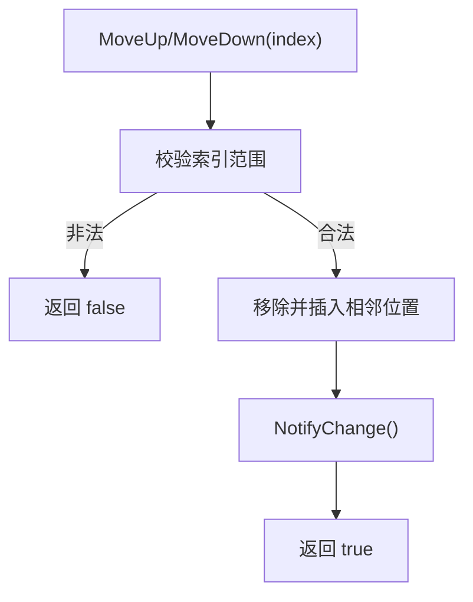

**图表来源**
- [ListDataOperationManager.cs:1-248](file://src/LowCode/RenderEngine/H.LowCode.RenderEngineBase/ListDataOperationManager.cs#L1-L248)

#### DeleteItem：删除并记录主键
- 删除指定索引的行。
- 若该列表已标记为数据库同步，则尝试读取行主键并追加到 `_deletedIdsStore`。
- 触发 `OnChange`，使 UI 刷新。

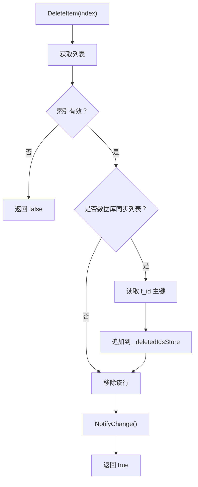

**图表来源**
- [ListDataOperationManager.cs:1-248](file://src/LowCode/RenderEngine/H.LowCode.RenderEngineBase/ListDataOperationManager.cs#L1-L248)

#### AddItem / AddDefaultItem：新增行
- `AddItem`：直接追加任意对象。
- `AddDefaultItem`：创建 `Dictionary<string, object>`，并为 `f_id` 分配新 Guid 字符串，再追加。

#### CopyItem：复制行
- 对字典类型进行浅拷贝，并重新生成 `f_id`。
- 对其他类型直接引用原对象（简单处理）。

#### UpdateOrderFields：更新顺序字段
- 遍历列表，对字典项设置 `orderFieldName` 为 `i+1`，常用于保存前统一排序字段。

**章节来源**
- [ListDataOperationManager.cs:1-248](file://src/LowCode/RenderEngine/H.LowCode.RenderEngineBase/ListDataOperationManager.cs#L1-L248)

### 主键管理机制
- 约定主键字段名：`f_id`。
- 新增默认行或复制字典行时自动生成 Guid 字符串作为主键。
- 静态方法 `GetItemPrimaryKey` 通过表达式解析成员值，兼容字典与反射属性。
- 持久化层 `TableDataRepository.SaveAsync` 优先使用数据源的主键字段名，否则回退为 `f_id`。

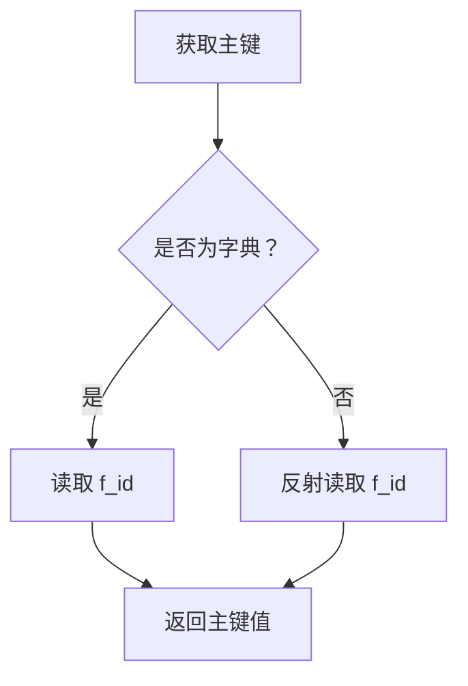

**图表来源**
- [ListDataOperationManager.cs:1-248](file://src/LowCode/RenderEngine/H.LowCode.RenderEngineBase/ListDataOperationManager.cs#L1-L248)
- [TableDataRepository.cs:201-313](file://src/LowCode/RenderEngine/H.LowCode.RenderEngine.EntityFrameworkCore/DataRepositories/TableDataRepository.cs#L201-L313)

**章节来源**
- [ListDataOperationManager.cs:1-248](file://src/LowCode/RenderEngine/H.LowCode.RenderEngineBase/ListDataOperationManager.cs#L1-L248)
- [TableDataRepository.cs:201-313](file://src/LowCode/RenderEngine/H.LowCode.RenderEngine.EntityFrameworkCore/DataRepositories/TableDataRepository.cs#L201-L313)

### 与 ITableDataAppService 的集成
- 渲染引擎的 `TableDataAppService` 将 `GetListAsync`、`DeleteAsync`、`UpdateAsync`、`SaveAsync` 委托给 `ITableDataRepository`。
- 设计引擎的 `TableDataAppService` 提供模拟数据与日志输出，不真正持久化。
- 数据传输对象包括：
  - `TableDataInput`：分页、排序、筛选条件，包含 `AppId`、`PageId`、`DataSourceId`。
  - `TableDataDeleteInput`：单条删除，包含行数据。
  - `TableDataUpdateInput`：增量更新，包含更新字段集。
  - `TableDataSaveInput`：按主键新增或更新，支持强制新增。

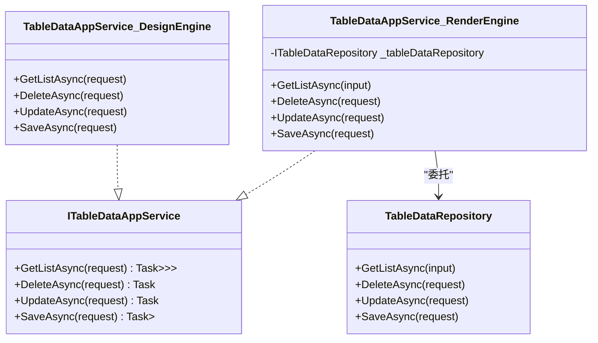

**图表来源**
- [ITableDataAppService.cs:1-30](file://src/LowCode/Common/H.LowCode.Application.Contracts/AppServices/ITableDataAppService.cs#L1-L30)
- [TableDataAppService（渲染引擎）.cs:1-42](file://src/LowCode/RenderEngine/H.LowCode.RenderEngine.Application/DataAppServices/TableDataAppService.cs#L1-L42)
- [TableDataAppService（设计引擎）.cs:1-79](file://src/LowCode/DesignEngine/H.LowCode.DesignEngine.Application/AppServices/TableDataAppService.cs#L1-L79)
- [TableDataRepository.cs:1-313](file://src/LowCode/RenderEngine/H.LowCode.RenderEngine.EntityFrameworkCore/DataRepositories/TableDataRepository.cs#L1-L313)

**章节来源**
- [ITableDataAppService.cs:1-30](file://src/LowCode/Common/H.LowCode.Application.Contracts/AppServices/ITableDataAppService.cs#L1-L30)
- [TableDataAppService（渲染引擎）.cs:1-42](file://src/LowCode/RenderEngine/H.LowCode.RenderEngine.Application/DataAppServices/TableDataAppService.cs#L1-L42)
- [TableDataAppService（设计引擎）.cs:1-79](file://src/LowCode/DesignEngine/H.LowCode.DesignEngine.Application/AppServices/TableDataAppService.cs#L1-L79)
- [TableDataRepository.cs:1-313](file://src/LowCode/RenderEngine/H.LowCode.RenderEngine.EntityFrameworkCore/DataRepositories/TableDataRepository.cs#L1-L313)
- [TableDataInput.cs:1-29](file://src/LowCode/Common/H.LowCode.Application.Contracts/Dtos/TableDataInput.cs#L1-L29)
- [TableDataDeleteInput.cs:1-32](file://src/LowCode/Common/H.LowCode.Application.Contracts/Dtos/TableDataDeleteInput.cs#L1-L32)
- [TableDataUpdateInput.cs:1-37](file://src/LowCode/Common/H.LowCode.Application.Contracts/Dtos/TableDataUpdateInput.cs#L1-L37)
- [TableDataSaveInput.cs:1-28](file://src/LowCode/Common/H.LowCode.Application.Contracts/Dtos/TableDataSaveInput.cs#L1-L28)

### 数据库同步机制
- `_dbSyncedListIds`：标记哪些列表来源于数据库，保存时需要处理删除同步。
- `_deletedIdsStore`：记录当前编辑会话中被删除行的主键集合，供上层保存逻辑批量删除。
- 当 `RegisterListData(..., fromDatabase=true)` 时，自动初始化删除记录集合。
- 删除行时，若列表属于数据库同步列表且行主键有效，则追加主键。

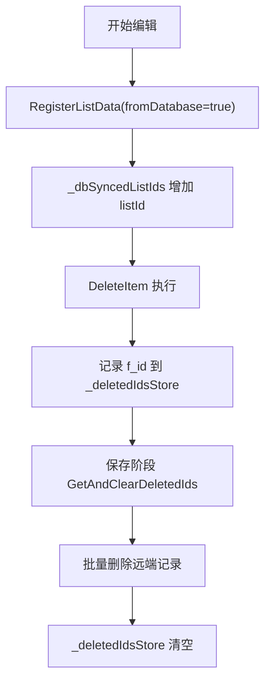

**图表来源**
- [ListDataOperationManager.cs:1-248](file://src/LowCode/RenderEngine/H.LowCode.RenderEngineBase/ListDataOperationManager.cs#L1-L248)

**章节来源**
- [ListDataOperationManager.cs:1-248](file://src/LowCode/RenderEngine/H.LowCode.RenderEngineBase/ListDataOperationManager.cs#L1-L248)

### 事件通知机制：OnChange
- `ListDataOperationManager.OnChange` 在增删改序等操作后触发。
- `RenderEngineDynamicComponentBase` 在初始化时订阅该事件，并在回调中调用 `StateHasChanged`，确保 Blazor 视图刷新。
- 组件销毁时取消订阅，避免内存泄漏。

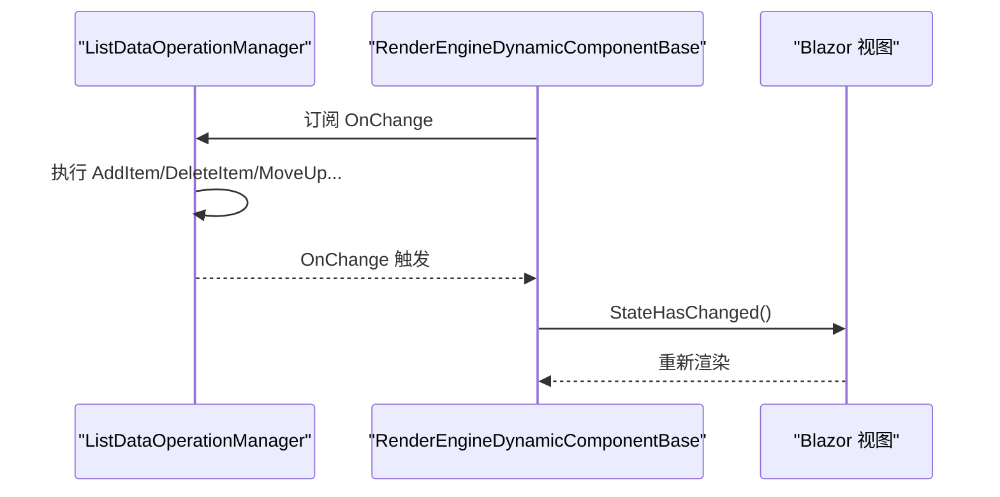

**图表来源**
- [ListDataOperationManager.cs:1-248](file://src/LowCode/RenderEngine/H.LowCode.RenderEngineBase/ListDataOperationManager.cs#L1-L248)
- [RenderEngineDynamicComponentBase.cs:1-200](file://src/LowCode/RenderEngine/H.LowCode.RenderEngineBase/RenderEngineDynamicComponentBase.cs#L1-L200)

**章节来源**
- [ListDataOperationManager.cs:1-248](file://src/LowCode/RenderEngine/H.LowCode.RenderEngineBase/ListDataOperationManager.cs#L1-L248)
- [RenderEngineDynamicComponentBase.cs:1-200](file://src/LowCode/RenderEngine/H.LowCode.RenderEngineBase/RenderEngineDynamicComponentBase.cs#L1-L200)

## 依赖关系分析
- `ListDataOperationManager` 不直接依赖数据库，仅维护内存状态与事件。
- `RenderEngineDynamicComponentBase` 依赖 `ListDataOperationManager` 与 `ITableDataAppService`。
- `ITableDataAppService` 由设计引擎与渲染引擎分别实现，解耦数据源。
- `TableDataRepository` 依赖 EF Core 上下文与数据源元数据仓库，动态解析实体类型与字段。

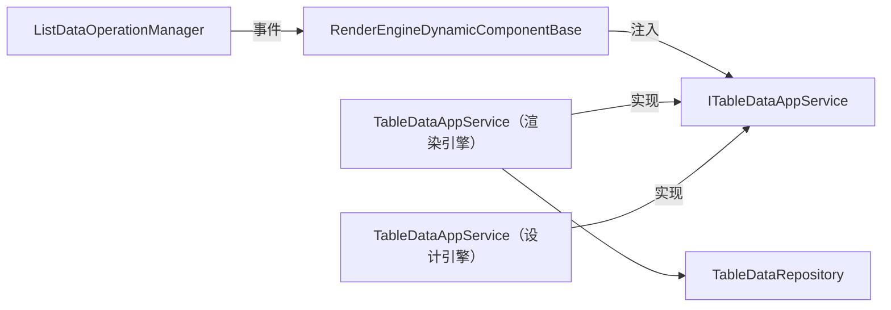

**图表来源**
- [ListDataOperationManager.cs:1-248](file://src/LowCode/RenderEngine/H.LowCode.RenderEngineBase/ListDataOperationManager.cs#L1-L248)
- [RenderEngineDynamicComponentBase.cs:1-200](file://src/LowCode/RenderEngine/H.LowCode.RenderEngineBase/RenderEngineDynamicComponentBase.cs#L1-L200)
- [ITableDataAppService.cs:1-30](file://src/LowCode/Common/H.LowCode.Application.Contracts/AppServices/ITableDataAppService.cs#L1-L30)
- [TableDataAppService（渲染引擎）.cs:1-42](file://src/LowCode/RenderEngine/H.LowCode.RenderEngine.Application/DataAppServices/TableDataAppService.cs#L1-L42)
- [TableDataAppService（设计引擎）.cs:1-79](file://src/LowCode/DesignEngine/H.LowCode.DesignEngine.Application/AppServices/TableDataAppService.cs#L1-L79)
- [TableDataRepository.cs:1-313](file://src/LowCode/RenderEngine/H.LowCode.RenderEngine.EntityFrameworkCore/DataRepositories/TableDataRepository.cs#L1-L313)

**章节来源**
- [ListDataOperationManager.cs:1-248](file://src/LowCode/RenderEngine/H.LowCode.RenderEngineBase/ListDataOperationManager.cs#L1-L248)
- [RenderEngineDynamicComponentBase.cs:1-200](file://src/LowCode/RenderEngine/H.LowCode.RenderEngineBase/RenderEngineDynamicComponentBase.cs#L1-L200)
- [ITableDataAppService.cs:1-30](file://src/LowCode/Common/H.LowCode.Application.Contracts/AppServices/ITableDataAppService.cs#L1-L30)
- [TableDataAppService（渲染引擎）.cs:1-42](file://src/LowCode/RenderEngine/H.LowCode.RenderEngine.Application/DataAppServices/TableDataAppService.cs#L1-L42)
- [TableDataAppService（设计引擎）.cs:1-79](file://src/LowCode/DesignEngine/H.LowCode.DesignEngine.Application/AppServices/TableDataAppService.cs#L1-L79)
- [TableDataRepository.cs:1-313](file://src/LowCode/RenderEngine/H.LowCode.RenderEngine.EntityFrameworkCore/DataRepositories/TableDataRepository.cs#L1-L313)

## 性能与内存优化
- 增量更新：`ListDataOperationManager` 仅修改内存列表，并通过 `OnChange` 精确触发视图刷新，避免全量重建。
- 虚拟滚动：列表数据管理本身不负责虚拟滚动，但可结合前端列表组件的分页与虚拟滚动策略，减少 DOM 节点数量。
- 内存管理：
  - 使用 `_listDataStore` 集中管理多个列表实例，避免分散状态。
  - 页面卸载或组件销毁时调用 `RemoveListData` 清理列表与同步标记。
  - 事件订阅在组件 `Dispose` 中取消订阅，防止内存泄漏。
- 数据库访问：
  - `TableDataRepository.GetListAsync` 使用分页、过滤与排序表达式构建，避免拉取全表。
  - 每次操作使用 `IDbContextFactory` 创建独立 DbContext，保证线程安全。
  - 值类型转换容错，避免无效字段导致保存失败。

[本节为通用性能建议，未直接分析特定代码片段]

## 使用场景与实践建议

### 表格组件数据绑定
- 在页面初始化时调用 `TableDataAppService.GetListAsync` 获取分页数据。
- 将结果注册到 `ListDataOperationManager.RegisterListData`，并标记 `fromDatabase=true`。
- 表格组件订阅 `ListDataOperationManager.OnChange` 以刷新显示。

**章节来源**
- [RenderEngineDynamicComponentBase.cs:1-200](file://src/LowCode/RenderEngine/H.LowCode.RenderEngineBase/RenderEngineDynamicComponentBase.cs#L1-L200)
- [ListDataOperationManager.cs:1-248](file://src/LowCode/RenderEngine/H.LowCode.RenderEngineBase/ListDataOperationManager.cs#L1-L248)
- [TableDataAppService（渲染引擎）.cs:1-42](file://src/LowCode/RenderEngine/H.LowCode.RenderEngine.Application/DataAppServices/TableDataAppService.cs#L1-L42)

### 拖拽排序
- 用户拖拽后调用 `MoveUp`/`MoveDown` 调整顺序。
- 如需持久化顺序字段，调用 `UpdateOrderFields` 更新 `f_order` 或自定义字段名。
- 保存时一并提交顺序字段变化。

**章节来源**
- [ListDataOperationManager.cs:1-248](file://src/LowCode/RenderEngine/H.LowCode.RenderEngineBase/ListDataOperationManager.cs#L1-L248)

### 批量操作
- 删除操作会记录主键至 `_deletedIdsStore`，保存时可批量删除远端记录。
- 新增/更新操作可通过 `SaveAsync` 按主键合并提交，减少多次网络往返。

**章节来源**
- [ListDataOperationManager.cs:1-248](file://src/LowCode/RenderEngine/H.LowCode.RenderEngineBase/ListDataOperationManager.cs#L1-L248)
- [TableDataRepository.cs:201-313](file://src/LowCode/RenderEngine/H.LowCode.RenderEngine.EntityFrameworkCore/DataRepositories/TableDataRepository.cs#L201-L313)

### 与后端数据库的同步策略
- 首次加载使用分页查询，避免一次性拉取大量数据。
- 本地编辑变更通过 `ListDataOperationManager` 维护，最终通过 `SaveAsync`/`UpdateAsync`/`DeleteAsync` 同步。
- 主键采用 `f_id` 约定，新增默认行或复制字典行时自动生成 Guid。

**章节来源**
- [TableDataRepository.cs:1-313](file://src/LowCode/RenderEngine/H.LowCode.RenderEngine.EntityFrameworkCore/DataRepositories/TableDataRepository.cs#L1-L313)
- [ListDataOperationManager.cs:1-248](file://src/LowCode/RenderEngine/H.LowCode.RenderEngineBase/ListDataOperationManager.cs#L1-L248)

## 故障排查指南
- 列表未刷新：
  - 检查是否在 `OnInitializedAsync` 中订阅 `ListDataOperationManager.OnChange`。
  - 确认操作后触发了 `NotifyChange`，即调用 `OnChange`。
- 删除未同步：
  - 确认 `RegisterListData` 传入 `fromDatabase=true`。
  - 检查被删除行是否存在有效的 `f_id` 主键。
  - 在保存阶段调用 `GetAndClearDeletedIds` 获取删除主键列表并批量删除。
- 主键异常：
  - 确认新增默认行或复制字典行时已生成 `f_id`。
  - 检查数据源主键字段配置是否与 `f_id` 一致。
- 保存失败：
  - 检查 `TableDataRepository.ApplyRowDataToEntity` 的类型转换是否成功。
  - 确认 `TableDataSaveInput.ForceInsert` 使用正确。

**章节来源**
- [ListDataOperationManager.cs:1-248](file://src/LowCode/RenderEngine/H.LowCode.RenderEngineBase/ListDataOperationManager.cs#L1-L248)
- [RenderEngineDynamicComponentBase.cs:1-200](file://src/LowCode/RenderEngine/H.LowCode.RenderEngineBase/RenderEngineDynamicComponentBase.cs#L1-L200)
- [TableDataRepository.cs:201-313](file://src/LowCode/RenderEngine/H.LowCode.RenderEngine.EntityFrameworkCore/DataRepositories/TableDataRepository.cs#L201-L313)

## 结论
`ListDataOperationManager` 是低代码平台列表数据管理的核心，提供多列表实例的统一内存管理与操作能力，并通过 `OnChange` 事件驱动视图刷新。它与 `ITableDataAppService` 协同工作，支持分页查询、删除、更新和按主键新增/更新。通过区分数据库同步列表与非数据库列表、记录删除主键、约定 `f_id` 主键字段，系统实现了前端编辑体验与后端持久化的良好平衡。在实际使用中，应结合分页与虚拟滚动提升性能，合理使用批量保存与顺序字段更新，确保 UI 与数据一致性。