# 动态组件渲染

<cite>
**本文引用的文件**   
- [RenderEngineDynamicComponentBase.cs](file://src/LowCode/RenderEngine/H.LowCode.RenderEngineBase/RenderEngineDynamicComponentBase.cs)
- [PageComponentRegistry.cs](file://src/LowCode/RenderEngine/H.LowCode.RenderEngineBase/PageComponentRegistry.cs)
- [LowCodeExpressionResolver.cs](file://src/LowCode/RenderEngine/H.LowCode.RenderEngineBase/LowCodeExpressionResolver.cs)
- [EventCallbackHelper.cs](file://src/LowCode/RenderEngine/H.LowCode.RenderEngineBase/EventCallbackHelper.cs)
- [ListDataOperationManager.cs](file://src/LowCode/RenderEngine/H.LowCode.RenderEngineBase/ListDataOperationManager.cs)
- [PageFormStateService.cs](file://src/LowCode/RenderEngine/H.LowCode.RenderEngineBase/PageFormStateService.cs)
- [ComponentSchema.cs](file://src/LowCode/Common/H.LowCode.MetaSchema.RenderEngine/ComponentSchema.cs)
- [ComponentFragmentSchema.cs](file://src/LowCode/Common/H.LowCode.MetaSchema.RenderEngine/PropertySchemas/ComponentFragmentSchema.cs)
- [ComponentAttributeDefineGroupSchema.cs](file://src/LowCode/Common/H.LowCode.MetaSchema.RenderEngine/PropertySchemas/ComponentAttributeDefineGroupSchema.cs)
- [ComponentDataSourceSchema.cs](file://src/LowCode/Common/H.LowCode.MetaSchema.RenderEngine/DataSourceSchemas/ComponentDataSourceSchema.cs)
- [PageSchema.cs](file://src/LowCode/Common/H.LowCode.MetaSchema.RenderEngine/PageSchema.cs)
- [LowCodeComponentBase.cs](file://src/LowCode/Common/H.LowCode.ComponentBase/LowCodeComponentBase.cs)
- [LowCodeDynamicComponentBase.cs](file://src/LowCode/Common/H.LowCode.ComponentBase/LowCodeDynamicComponentBase.cs)
- [PageCascadingModel.cs](file://src/LowCode/Common/H.LowCode.ComponentBase/CascadingModels/PageCascadingModel.cs)
</cite>

## 目录
1. [引言](#引言)
2. [项目结构](#项目结构)
3. [核心组件](#核心组件)
4. [架构总览](#架构总览)
5. [详细组件分析](#详细组件分析)
6. [依赖关系分析](#依赖关系分析)
7. [性能考虑](#性能考虑)
8. [故障排查指南](#故障排查指南)
9. [结论](#结论)
10. [附录：自定义低代码组件开发指南](#附录自定义低代码组件开发指南)

## 引言
本文围绕低代码渲染引擎的动态组件渲染机制，系统化说明以下主题：
- RenderEngineDynamicComponentBase 如何根据 ComponentSchema 元数据构建 Blazor 组件树。
- RenderComponentRecursive 递归渲染算法、条件渲染分支处理。
- 容器组件与表单组件的差异化渲染逻辑。
- PageComponentRegistry 页面组件注册表机制及其在事件处理、显隐联动中的作用。
- RenderEngineLowCodeComponentBase 作为低代码组件基类的通用能力（级联参数、生命周期钩子等）。
- 组件属性解析过程：从 ComponentFragmentSchema 到目标 Blazor 组件参数的映射、类型转换、表达式求值与默认值处理。
- 组件可见性控制机制：VisibleCondition 表达式求值、If/Switch 条件渲染组件实现原理。
- 自定义 Blazor 组件开发与注册流程，以及通过 ComponentSchema 驱动实例化的方式。
- 渲染性能优化策略与最佳实践。

## 项目结构
本仓库中，低代码渲染相关代码主要分布在以下模块：
- LowCode.MetaSchema.RenderEngine：定义页面与组件的运行时元数据结构，如 PageSchema、ComponentSchema、ComponentFragmentSchema、ComponentDataSourceSchema 等。
- LowCode.RenderEngineBase：提供渲染引擎基类、表达式求值器、事件回调辅助器、列表数据管理器、表单状态服务、页面组件注册表等。
- LowCode.ComponentBase：提供低代码组件通用基类、级联模型、动态组件基类等共享能力。

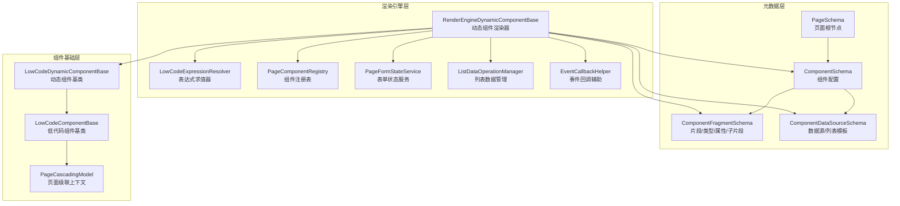

图表来源
- [PageSchema.cs:1-9](file://src/LowCode/Common/H.LowCode.MetaSchema.RenderEngine/PageSchema.cs#L1-L9)
- [ComponentSchema.cs:1-83](file://src/LowCode/Common/H.LowCode.MetaSchema.RenderEngine/ComponentSchema.cs#L1-L83)
- [ComponentFragmentSchema.cs:1-28](file://src/LowCode/Common/H.LowCode.MetaSchema.RenderEngine/PropertySchemas/ComponentFragmentSchema.cs#L1-L28)
- [ComponentDataSourceSchema.cs:1-18](file://src/LowCode/Common/H.LowCode.MetaSchema.RenderEngine/DataSourceSchemas/ComponentDataSourceSchema.cs#L1-L18)
- [RenderEngineDynamicComponentBase.cs:1-2185](file://src/LowCode/RenderEngine/H.LowCode.RenderEngineBase/RenderEngineDynamicComponentBase.cs#L1-L2185)
- [LowCodeExpressionResolver.cs](file://src/LowCode/RenderEngine/H.LowCode.RenderEngineBase/LowCodeExpressionResolver.cs)
- [PageComponentRegistry.cs](file://src/LowCode/RenderEngine/H.LowCode.RenderEngineBase/PageComponentRegistry.cs)
- [PageFormStateService.cs](file://src/LowCode/RenderEngine/H.LowCode.RenderEngineBase/PageFormStateService.cs)
- [ListDataOperationManager.cs](file://src/LowCode/RenderEngine/H.LowCode.RenderEngineBase/ListDataOperationManager.cs)
- [EventCallbackHelper.cs](file://src/LowCode/RenderEngine/H.LowCode.RenderEngineBase/EventCallbackHelper.cs)
- [LowCodeComponentBase.cs](file://src/LowCode/Common/H.LowCode.ComponentBase/LowCodeComponentBase.cs)
- [LowCodeDynamicComponentBase.cs](file://src/LowCode/Common/H.LowCode.ComponentBase/LowCodeDynamicComponentBase.cs)
- [PageCascadingModel.cs](file://src/LowCode/Common/H.LowCode.ComponentBase/CascadingModels/PageCascadingModel.cs)

章节来源
- [PageSchema.cs:1-9](file://src/LowCode/Common/H.LowCode.MetaSchema.RenderEngine/PageSchema.cs#L1-L9)
- [ComponentSchema.cs:1-83](file://src/LowCode/Common/H.LowCode.MetaSchema.RenderEngine/ComponentSchema.cs#L1-L83)
- [ComponentFragmentSchema.cs:1-28](file://src/LowCode/Common/H.LowCode.MetaSchema.RenderEngine/PropertySchemas/ComponentFragmentSchema.cs#L1-L28)
- [ComponentDataSourceSchema.cs:1-18](file://src/LowCode/Common/H.LowCode.MetaSchema.RenderEngine/DataSourceSchemas/ComponentDataSourceSchema.cs#L1-L18)

## 核心组件
本节聚焦动态渲染的核心类型与职责：
- RenderEngineDynamicComponentBase：负责把 ComponentSchema 和 ComponentFragmentSchema 转换成真实的 Blazor 组件树；处理可见性、条件渲染、原生元素、数据源、事件链、表单保存、列表保存等。
- PageComponentRegistry：维护当前渲染页面的组件树，支持按 Id 查找组件配置，为事件处理和显隐联动提供数据支撑。
- LowCodeExpressionResolver：表达式求值器，用于解析 $(form.x)、$(item.x)、$query(x) 等表达式，并格式化输出值。
- PageFormStateService：统一管理表单控件的值状态，驱动显隐联动、校验与提交收集。
- ListDataOperationManager：管理列表数据增删改查、主键识别、行同步等。
- EventCallbackHelper：封装 Blazor 事件回调创建逻辑，避免重复反射。
- LowCodeComponentBase / LowCodeDynamicComponentBase：低代码组件基类，提供级联参数 PageCascading、生命周期钩子、通用行为。

章节来源
- [RenderEngineDynamicComponentBase.cs:1-2185](file://src/LowCode/RenderEngine/H.LowCode.RenderEngineBase/RenderEngineDynamicComponentBase.cs#L1-L2185)
- [PageComponentRegistry.cs](file://src/LowCode/RenderEngine/H.LowCode.RenderEngineBase/PageComponentRegistry.cs)
- [LowCodeExpressionResolver.cs](file://src/LowCode/RenderEngine/H.LowCode.RenderEngineBase/LowCodeExpressionResolver.cs)
- [PageFormStateService.cs](file://src/LowCode/RenderEngine/H.LowCode.RenderEngineBase/PageFormStateService.cs)
- [ListDataOperationManager.cs](file://src/LowCode/RenderEngine/H.LowCode.RenderEngineBase/ListDataOperationManager.cs)
- [EventCallbackHelper.cs](file://src/LowCode/RenderEngine/H.LowCode.RenderEngineBase/EventCallbackHelper.cs)
- [LowCodeComponentBase.cs](file://src/LowCode/Common/H.LowCode.ComponentBase/LowCodeComponentBase.cs)
- [LowCodeDynamicComponentBase.cs](file://src/LowCode/Common/H.LowCode.ComponentBase/LowCodeDynamicComponentBase.cs)

## 架构总览
下图展示渲染引擎的整体交互流程：页面元数据进入渲染器，渲染器将 Fragment 转换为 Blazor 组件或原生 HTML 元素，同时绑定属性、事件和数据源，并通过注册表登记组件树供后续事件与联动使用。

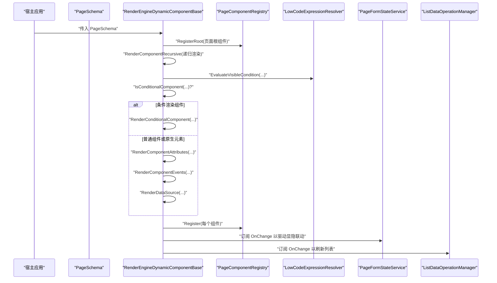

图表来源
- [RenderEngineDynamicComponentBase.cs:1-2185](file://src/LowCode/RenderEngine/H.LowCode.RenderEngineBase/RenderEngineDynamicComponentBase.cs#L1-L2185)
- [PageComponentRegistry.cs](file://src/LowCode/RenderEngine/H.LowCode.RenderEngineBase/PageComponentRegistry.cs)
- [LowCodeExpressionResolver.cs](file://src/LowCode/RenderEngine/H.LowCode.RenderEngineBase/LowCodeExpressionResolver.cs)
- [PageFormStateService.cs](file://src/LowCode/RenderEngine/H.LowCode.RenderEngineBase/PageFormStateService.cs)
- [ListDataOperationManager.cs](file://src/LowCode/RenderEngine/H.LowCode.RenderEngineBase/ListDataOperationManager.cs)

## 详细组件分析

### RenderEngineDynamicComponentBase：动态组件渲染器
该基类承担动态组件树构建与运行时行为编排：
- 渲染入口：RenderComponent 将根组件注册到 PageComponentRegistry，然后调用 RenderComponentRecursive 递归渲染。
- 递归渲染：RenderComponentRecursive 根据 Fragment 的类型名判断是原生 HTML 还是 .NET 组件；计算 VisibleCondition；识别 Conditional 条件渲染；处理数据源与 ChildContent；最终通过 RenderTreeBuilder 生成 Blazor 组件树。
- 条件渲染：当组件类型为包含 “Conditional” 且存在 Cases 时，走 RenderConditionalComponent，根据 ConditionValue 属性匹配分支，否则回退 DefaultCase。
- 原生 HTML：当 TypeName 为 html:{tag} 形式时，走原生元素渲染路径，支持 class/style/content、嵌套子元素、资源挂载、事件映射、表单控件双向绑定、选项组 radio/checkbox 绑定等。
- 属性解析：RenderComponentAttributes 将 ComponentFragmentSchema.Attributes 映射到目标组件同名属性，进行表达式求值、类型转换、Value/ValueChanged 双向绑定。
- 事件处理：RenderComponentEvents 将事件属性绑定到 HandleEventChainAsync，再分发到页面跳转、数据操作、JS 脚本等处理器。
- 表单与列表：集成 PageFormStateService 与 ListDataOperationManager，支持表单保存、校验、列表保存、行更新、删除/复制/排序等操作。

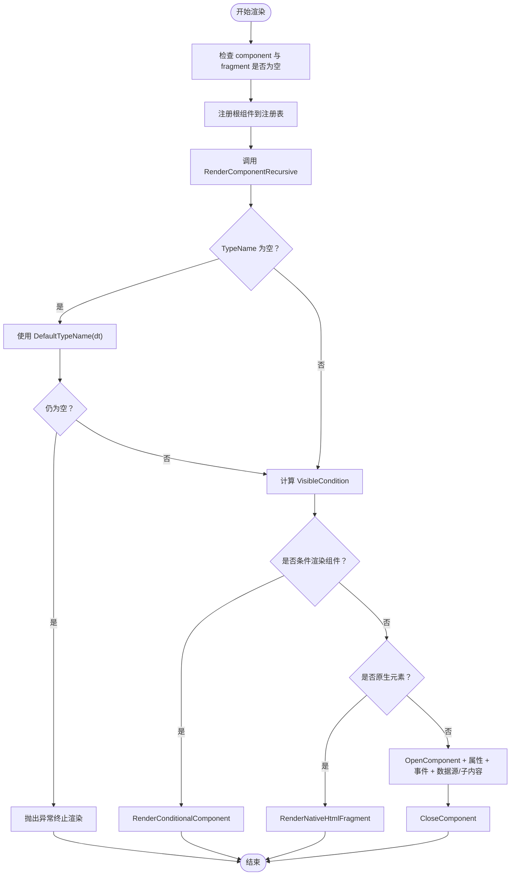

图表来源
- [RenderEngineDynamicComponentBase.cs:1-2185](file://src/LowCode/RenderEngine/H.LowCode.RenderEngineBase/RenderEngineDynamicComponentBase.cs#L1-L2185)

章节来源
- [RenderEngineDynamicComponentBase.cs:1-2185](file://src/LowCode/RenderEngine/H.LowCode.RenderEngineBase/RenderEngineDynamicComponentBase.cs#L1-L2185)

### PageComponentRegistry：页面组件注册表
注册表用于在渲染过程中登记页面组件树，并提供按 Id 查找组件配置的查询能力。其典型用途包括：
- 在渲染根组件时调用 RegisterRoot，记录页面根节点。
- 在渲染每个组件时调用 Register，登记到字典以便后续事件处理、校验、联动查询。
- 对外暴露 GetById、GetRoots 等方法，供事件处理器、表单校验、显隐联动等读取组件配置。

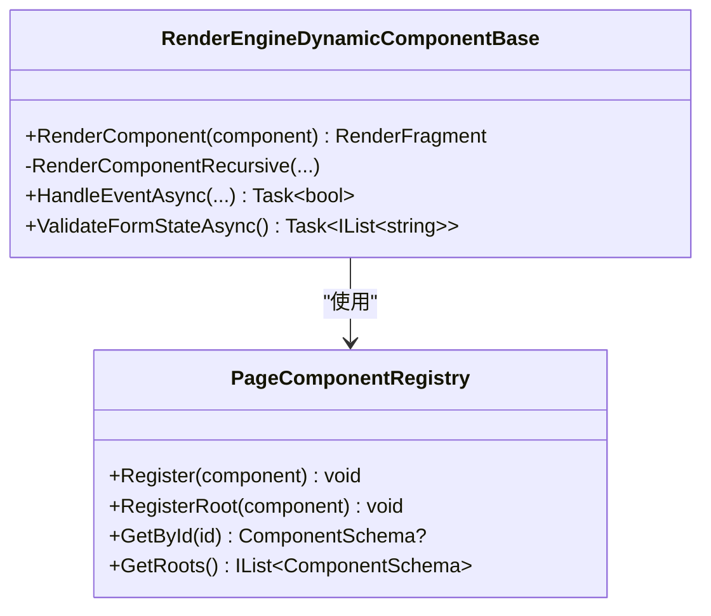

图表来源
- [RenderEngineDynamicComponentBase.cs:1-2185](file://src/LowCode/RenderEngine/H.LowCode.RenderEngineBase/RenderEngineDynamicComponentBase.cs#L1-L2185)
- [PageComponentRegistry.cs](file://src/LowCode/RenderEngine/H.LowCode.RenderEngineBase/PageComponentRegistry.cs)

章节来源
- [RenderEngineDynamicComponentBase.cs:1-2185](file://src/LowCode/RenderEngine/H.LowCode.RenderEngineBase/RenderEngineDynamicComponentBase.cs#L1-L2185)
- [PageComponentRegistry.cs](file://src/LowCode/RenderEngine/H.LowCode.RenderEngineBase/PageComponentRegistry.cs)

### LowCodeComponentBase / LowCodeDynamicComponentBase：低代码组件基类
- LowCodeComponentBase：为所有低代码组件提供通用基类能力，通常包含 PageCascading 级联参数、通用生命周期钩子、日志、Toast 等。
- LowCodeDynamicComponentBase：进一步抽象动态组件能力，使 RenderEngineDynamicComponentBase 能复用公共逻辑。

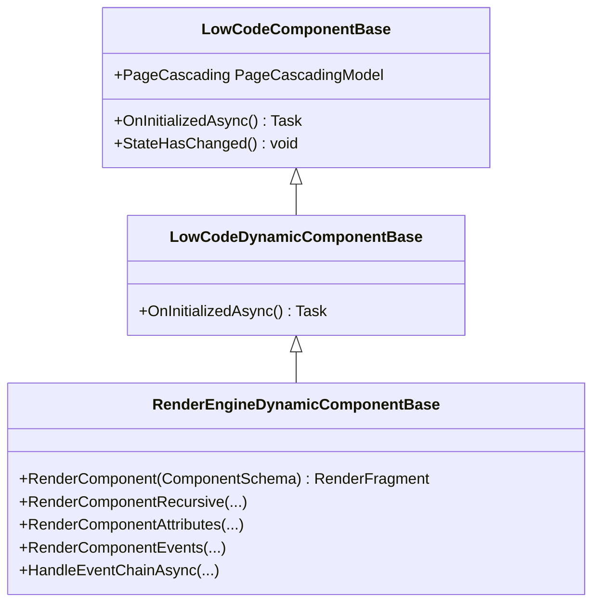

图表来源
- [LowCodeComponentBase.cs](file://src/LowCode/Common/H.LowCode.ComponentBase/LowCodeComponentBase.cs)
- [LowCodeDynamicComponentBase.cs](file://src/LowCode/Common/H.LowCode.ComponentBase/LowCodeDynamicComponentBase.cs)
- [RenderEngineDynamicComponentBase.cs:1-2185](file://src/LowCode/RenderEngine/H.LowCode.RenderEngineBase/RenderEngineDynamicComponentBase.cs#L1-L2185)
- [PageCascadingModel.cs](file://src/LowCode/Common/H.LowCode.ComponentBase/CascadingModels/PageCascadingModel.cs)

章节来源
- [LowCodeComponentBase.cs](file://src/LowCode/Common/H.LowCode.ComponentBase/LowCodeComponentBase.cs)
- [LowCodeDynamicComponentBase.cs](file://src/LowCode/Common/H.LowCode.ComponentBase/LowCodeDynamicComponentBase.cs)
- [PageCascadingModel.cs](file://src/LowCode/Common/H.LowCode.ComponentBase/CascadingModels/PageCascadingModel.cs)

### 组件属性解析与类型转换
属性解析由 RenderComponentAttributes 完成，核心流程如下：
- 遍历 ComponentFragmentSchema.Attributes，定位目标组件同名属性。
- 对 AttributeValue 执行表达式求值（$(form.x)、$(item.x)、$query(x)），得到实际值。
- 若属性名为 Value 且存在 formValueKey，则优先使用表单状态值，并绑定 ValueChanged 回调写回表单状态。
- 使用属性的真实 CLR 类型进行转换，而非仅依赖 AttributeClrType，确保类型安全。
- 将转换后的值写入 RenderTreeBuilder。

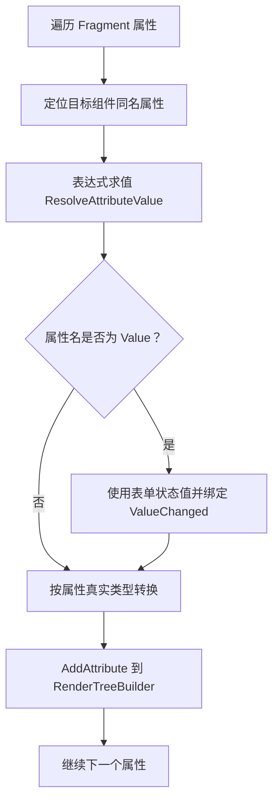

图表来源
- [RenderEngineDynamicComponentBase.cs:989-1430](file://src/LowCode/RenderEngine/H.LowCode.RenderEngineBase/RenderEngineDynamicComponentBase.cs#L989-L1430)

章节来源
- [RenderEngineDynamicComponentBase.cs:989-1430](file://src/LowCode/RenderEngine/H.LowCode.RenderEngineBase/RenderEngineDynamicComponentBase.cs#L989-L1430)
- [ComponentFragmentSchema.cs:1-28](file://src/LowCode/Common/H.LowCode.MetaSchema.RenderEngine/PropertySchemas/ComponentFragmentSchema.cs#L1-L28)

### 组件可见性控制与条件渲染
可见性控制基于 VisibleCondition：
- EvaluateVisibleCondition 使用 LowCodeExpressionResolver 求值表达式，并根据 Op 枚举执行 NotEmpty、IsEmpty、In、Contains、NotEquals、Equals 等逻辑。
- 当 VisibleCondition 不满足时，组件直接跳过渲染，实现显隐联动。

条件渲染组件（如 If/Switch）：
- 当组件 TypeName 包含 “Conditional” 且存在 Cases 时，走 RenderConditionalComponent。
- 从 Fragment 属性中读取 ConditionValue，匹配 Cases 中的键，若无匹配则使用 DefaultCase。
- 找到匹配分支后，递归渲染对应子组件。

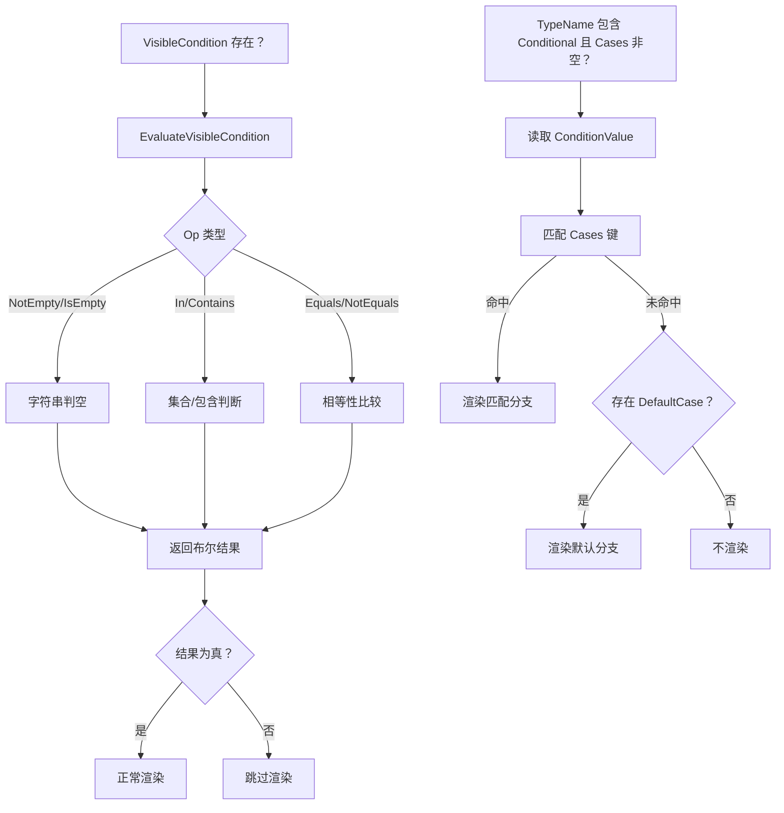

图表来源
- [RenderEngineDynamicComponentBase.cs:201-584](file://src/LowCode/RenderEngine/H.LowCode.RenderEngineBase/RenderEngineDynamicComponentBase.cs#L201-L584)
- [LowCodeExpressionResolver.cs](file://src/LowCode/RenderEngine/H.LowCode.RenderEngineBase/LowCodeExpressionResolver.cs)

章节来源
- [RenderEngineDynamicComponentBase.cs:201-584](file://src/LowCode/RenderEngine/H.LowCode.RenderEngineBase/RenderEngineDynamicComponentBase.cs#L201-L584)
- [LowCodeExpressionResolver.cs](file://src/LowCode/RenderEngine/H.LowCode.RenderEngineBase/LowCodeExpressionResolver.cs)

### 容器组件与表单组件的差异化渲染
- 容器组件：
  - 当组件标记为 IsContainer 且无 Fragment 时，只递归渲染其 Childrens，不产生包裹元素。
  - 对于内部容器（IsInnerContainer），通过 InnerContainerCursor 将拖拽入的原生容器内的子组件内联渲染，避免额外包装。
- 表单组件：
  - 当组件支持 DataSource 且 DataSourceGroupType 为 List 时，渲染数据源并使用 ItemTemplate 逐项渲染。
  - 当组件不支持 DataSource 但有 ChildFragments 时，走 ChildContent 通道。
  - 当组件有 Childrens 但非容器时，为 ChildContent 注入完整组件语义的子组件树，适用于列表项模板等场景。
  - 表单值通过 FormState 统一维护，Value/ValueChanged 双向绑定，原生表单控件也做 value/checked/oninput/onchange 绑定。

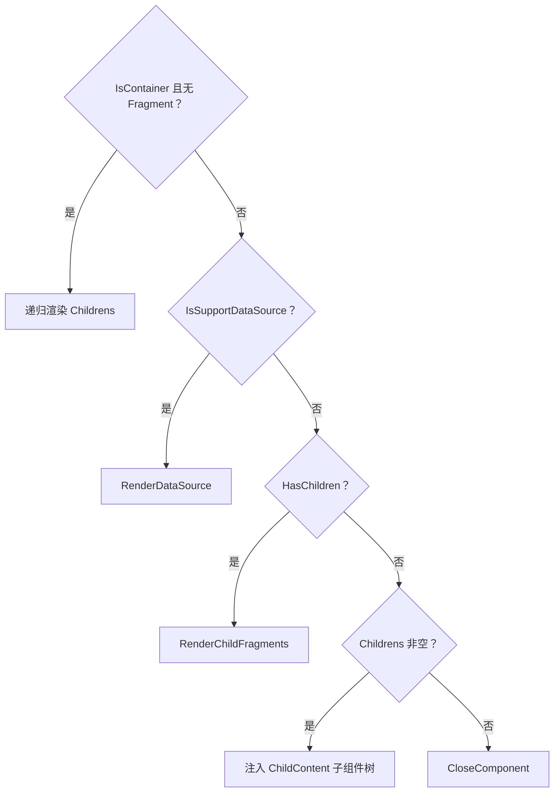

图表来源
- [RenderEngineDynamicComponentBase.cs:201-584](file://src/LowCode/RenderEngine/H.LowCode.RenderEngineBase/RenderEngineDynamicComponentBase.cs#L201-L584)

章节来源
- [RenderEngineDynamicComponentBase.cs:201-584](file://src/LowCode/RenderEngine/H.LowCode.RenderEngineBase/RenderEngineDynamicComponentBase.cs#L201-L584)

### 原生 HTML 元素与资源挂载
原生 HTML 元素通过 html:{tag} 形式声明：
- 解析 tagName，打开原生元素。
- 渲染属性：支持 class/style/content、布尔属性、maxlength/rows 为 0 时省略、嵌套路径属性等。
- 事件映射：组件级事件名转小写绑定到原生元素事件；Fragment 级事件仅 Data 类 OnClick。
- 表单绑定：value/checked/oninput/onchange 与 FormState 双向绑定。
- 选项组：radio/checkbox 组的选中态与变更事件与 FormState 联动。
- 资源挂载：当 Fragment 声明 Resources 或 InitFunction 时，通过 NativeResourceMount 加载资源并初始化。

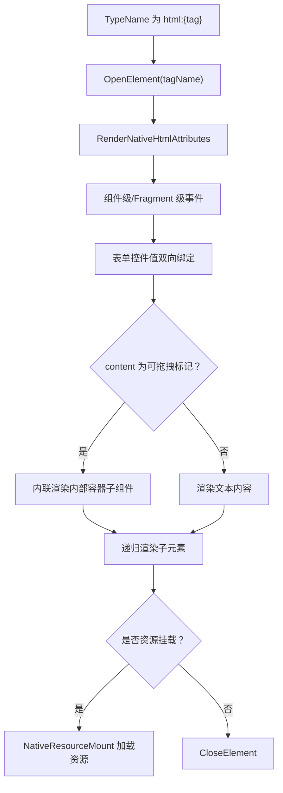

图表来源
- [RenderEngineDynamicComponentBase.cs:585-988](file://src/LowCode/RenderEngine/H.LowCode.RenderEngineBase/RenderEngineDynamicComponentBase.cs#L585-L988)

章节来源
- [RenderEngineDynamicComponentBase.cs:585-988](file://src/LowCode/RenderEngine/H.LowCode.RenderEngineBase/RenderEngineDynamicComponentBase.cs#L585-L988)

### 事件处理与数据操作
事件处理链路：
- RenderComponentEvents 将同名事件分组，按顺序串联执行。
- HandleEventChainAsync 依次调用 HandleEventAsync，遇到中断信号停止后续事件。
- HandleEventAsync 分发到页面跳转、数据操作、JS 脚本三类处理器。
- 页面跳转：BuildPageUrl 根据路由前缀、AppId、PageId、QueryArgs、RowDataParams 构造 URL，并按 Action 选择 Blank/Refresh/Self 行为。
- 数据操作：ResolveListId 确定列表 Id，再根据动作类型执行 MoveUp/MoveDown/DeleteRow/CopyRow/AddRow/RefreshData/SaveRow/SaveList/SaveForm/UpdateRow 等。

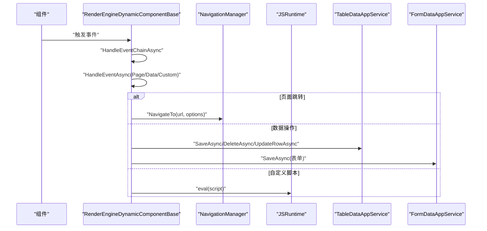

图表来源
- [RenderEngineDynamicComponentBase.cs:989-1430](file://src/LowCode/RenderEngine/H.LowCode.RenderEngineBase/RenderEngineDynamicComponentBase.cs#L989-L1430)

章节来源
- [RenderEngineDynamicComponentBase.cs:989-1430](file://src/LowCode/RenderEngine/H.LowCode.RenderEngineBase/RenderEngineDynamicComponentBase.cs#L989-L1430)

### 表单保存与校验
- SaveFormAsync 收集 FormState 中的字段，排除列表实例 key 与内部 key，追加主键 id，调用 FormDataAppService.SaveAsync 保存。
- ValidateFormStateAsync 遍历注册表中的根组件，递归校验各组件 ValidationRules，跳过显示条件不满足的组件；对列表组件逐行校验实例。

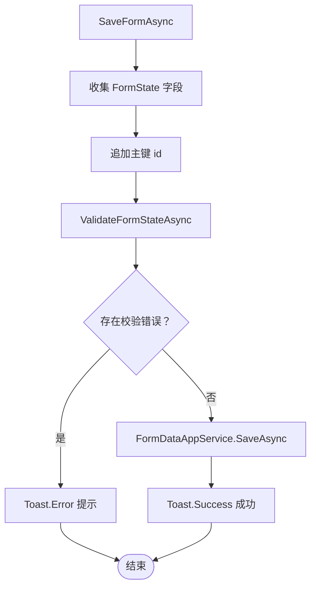

图表来源
- [RenderEngineDynamicComponentBase.cs:1200-1500](file://src/LowCode/RenderEngine/H.LowCode.RenderEngineBase/RenderEngineDynamicComponentBase.cs#L1200-L1500)

章节来源
- [RenderEngineDynamicComponentBase.cs:1200-1500](file://src/LowCode/RenderEngine/H.LowCode.RenderEngineBase/RenderEngineDynamicComponentBase.cs#L1200-L1500)

### 列表保存与行更新
- SaveListAsync 根据 listId 查找组件配置，确定保存目标数据源与保存模式，获取行数据，必要时合并表单状态、应用保存映射，调用 TableDataAppService.SaveAsync 批量保存。
- UpdateRowAsync 针对当前行字段按事件参数更新。

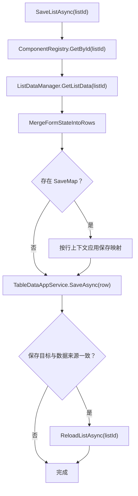

图表来源
- [RenderEngineDynamicComponentBase.cs:1500-2185](file://src/LowCode/RenderEngine/H.LowCode.RenderEngineBase/RenderEngineDynamicComponentBase.cs#L1500-L2185)

章节来源
- [RenderEngineDynamicComponentBase.cs:1500-2185](file://src/LowCode/RenderEngine/H.LowCode.RenderEngineBase/RenderEngineDynamicComponentBase.cs#L1500-L2185)

## 依赖关系分析
渲染引擎依赖的关键外部组件与服务：
- Microsoft.AspNetCore.Components：Blazor 渲染系统。
- H.LowCode.Application.Contracts：表格数据与表单数据的应用服务接口。
- H.Util.Blazor：Toast、事件调度等工具。
- H.Util.Ids：短 Id 生成。

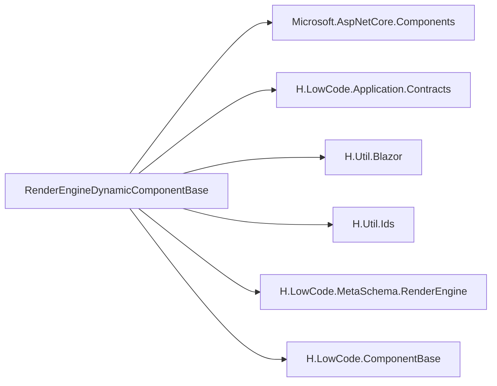

图表来源
- [RenderEngineDynamicComponentBase.cs:1-2185](file://src/LowCode/RenderEngine/H.LowCode.RenderEngineBase/RenderEngineDynamicComponentBase.cs#L1-L2185)

章节来源
- [RenderEngineDynamicComponentBase.cs:1-2185](file://src/LowCode/RenderEngine/H.LowCode.RenderEngineBase/RenderEngineDynamicComponentBase.cs#L1-L2185)

## 性能考虑
- 组件懒加载：仅在组件可见且需要时才实例化；对隐藏组件（VisibleCondition 为假）跳过渲染。
- 虚拟滚动：在大数据列表场景中，应结合列表组件自身虚拟化能力（由具体 LcTable/LcList 实现）减少 DOM 节点数量。
- 渲染缓存：利用 Blazor 自身的组件差异渲染与 RenderTreeBuilder 增量更新；避免频繁重建整个页面树。
- 表达式求值缓存：对稳定表达式（如 $query(x)）可在上层做缓存，降低每次渲染的计算开销。
- 事件链优化：尽量精简事件链长度，避免长链异步阻塞。
- 原生元素批量属性：合并 class、避免多余属性；布尔属性 false 时省略以减少渲染开销。

[本节为一般性指导，无需特定文件引用]

## 故障排查指南
常见问题与定位思路：
- 组件未渲染：
  - 检查 ComponentFragmentSchema.TypeName 是否为空或未设置 DefaultTypeName。
  - 检查 VisibleCondition 是否导致组件被跳过。
  - 确认 ComponentSchema.Fragment 是否存在。
- 属性绑定失败：
  - 检查属性名是否与目标组件属性一致。
  - 检查表达式语法是否正确，是否能通过 LowCodeExpressionResolver 求值。
  - 检查类型转换是否失败（目标属性类型与表达式结果不一致）。
- 事件未触发：
  - 检查事件名是否与目标组件事件属性一致。
  - 检查事件链是否被前置事件中断。
- 表单值不同步：
  - 检查 FormState 是否已播种初始值。
  - 检查 Value/ValueChanged 绑定是否正确。
- 列表保存失败：
  - 检查列表是否已加载数据（从未加载的隐藏列表会静默跳过）。
  - 检查保存目标数据源配置与保存映射是否正确。

章节来源
- [RenderEngineDynamicComponentBase.cs:1-2185](file://src/LowCode/RenderEngine/H.LowCode.RenderEngineBase/RenderEngineDynamicComponentBase.cs#L1-L2185)

## 结论
RenderEngineDynamicComponentBase 将低代码元数据（ComponentSchema、ComponentFragmentSchema、ComponentDataSourceSchema）转化为真实 Blazor 组件树，提供条件渲染、原生元素、属性解析、事件链、表单与列表操作等完整能力。PageComponentRegistry 在渲染过程中登记组件树，为事件处理与显隐联动提供查询支撑。LowCodeComponentBase/LowCodeDynamicComponentBase 提供通用基类能力，PageCascading 贯穿页面上下文。通过合理的属性解析、可见性控制与性能优化策略，渲染引擎能够在复杂业务场景中稳定高效地驱动 UI 动态构建。

[本节为总结性内容，无需特定文件引用]

## 附录：自定义低代码组件开发指南

### 开发步骤概览
- 编写 Blazor 组件：
  - 继承 LowCodeComponentBase 或 LowCodeDynamicComponentBase，获得 PageCascading 级联参数与通用生命周期。
  - 定义公开属性，名称需与 ComponentFragmentSchema 中的 AttributeName 对应，便于属性自动映射。
  - 如需支持事件，定义事件属性（如 Click），并在内部触发相应回调。
- 注册组件类型：
  - 在运行时代码中将组件类型名注册到渲染引擎可用的类型解析器（例如全局类型映射），确保 ComponentFragmentSchema.TypeName 能被正确解析。
- 配置 ComponentSchema：
  - 在页面元数据中配置 ComponentSchema，指定 Fragment.DefaultTypeName 或 Fragment.TypeName。
  - 通过 Fragment.Attributes 设置属性值，支持表达式求值。
  - 如需条件渲染，设置 VisibleCondition 与 Cases/DefaultCase。
  - 如需数据源，配置 DataSource 与 ItemTemplate。

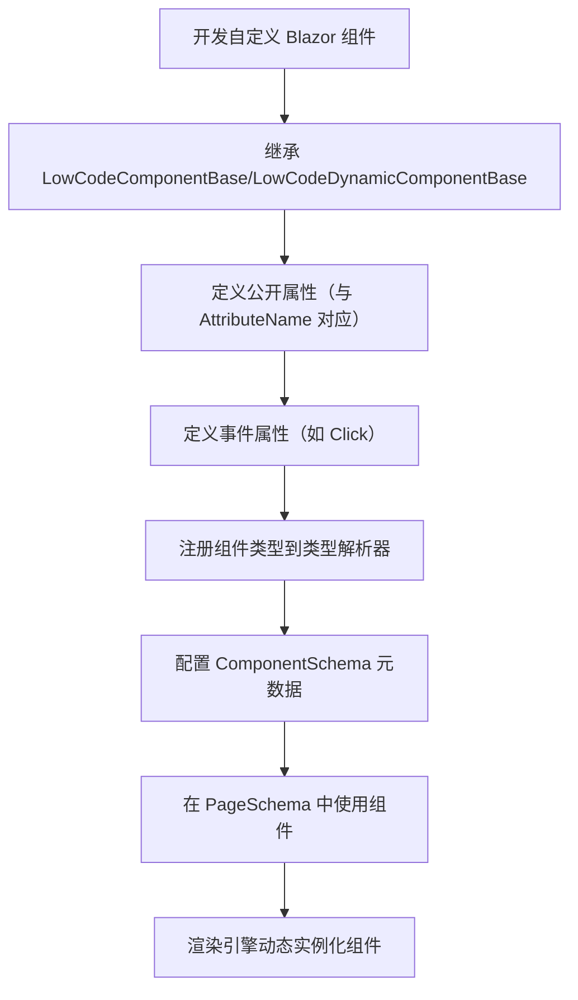

图表来源
- [RenderEngineDynamicComponentBase.cs:1-2185](file://src/LowCode/RenderEngine/H.LowCode.RenderEngineBase/RenderEngineDynamicComponentBase.cs#L1-L2185)
- [ComponentSchema.cs:1-83](file://src/LowCode/Common/H.LowCode.MetaSchema.RenderEngine/ComponentSchema.cs#L1-L83)
- [ComponentFragmentSchema.cs:1-28](file://src/LowCode/Common/H.LowCode.MetaSchema.RenderEngine/PropertySchemas/ComponentFragmentSchema.cs#L1-L28)

章节来源
- [RenderEngineDynamicComponentBase.cs:1-2185](file://src/LowCode/RenderEngine/H.LowCode.RenderEngineBase/RenderEngineDynamicComponentBase.cs#L1-L2185)
- [ComponentSchema.cs:1-83](file://src/LowCode/Common/H.LowCode.MetaSchema.RenderEngine/ComponentSchema.cs#L1-L83)
- [ComponentFragmentSchema.cs:1-28](file://src/LowCode/Common/H.LowCode.MetaSchema.RenderEngine/PropertySchemas/ComponentFragmentSchema.cs#L1-L28)