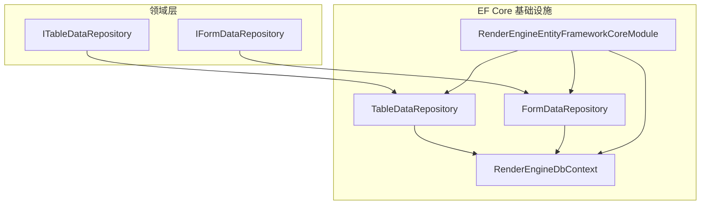
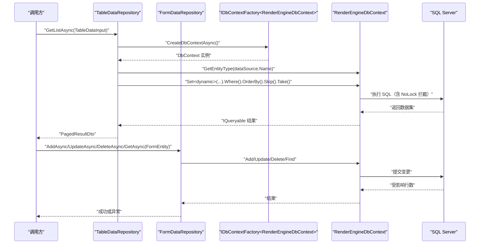
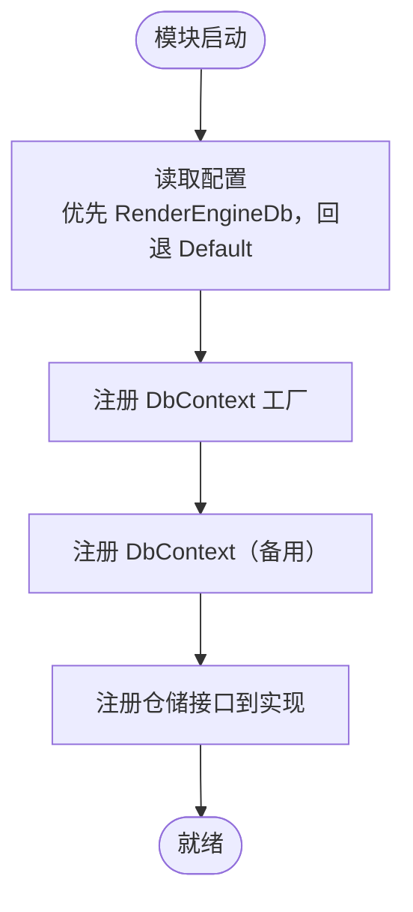
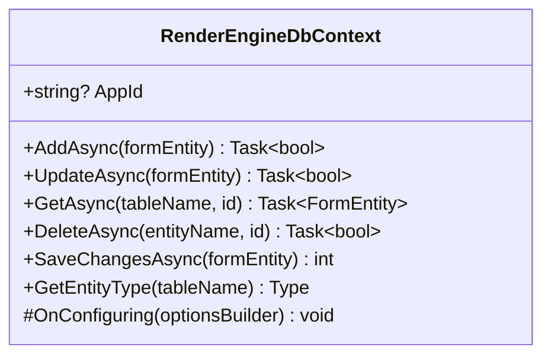
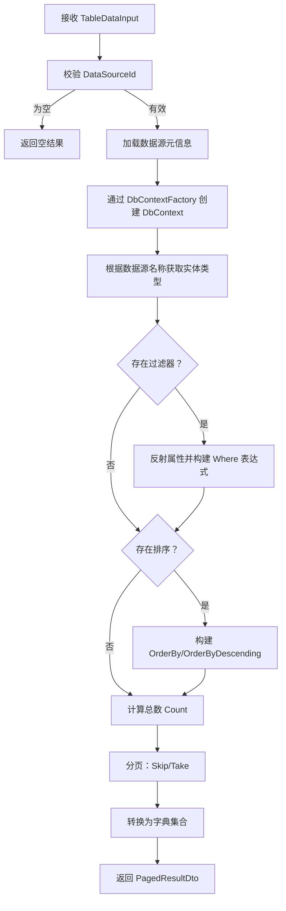
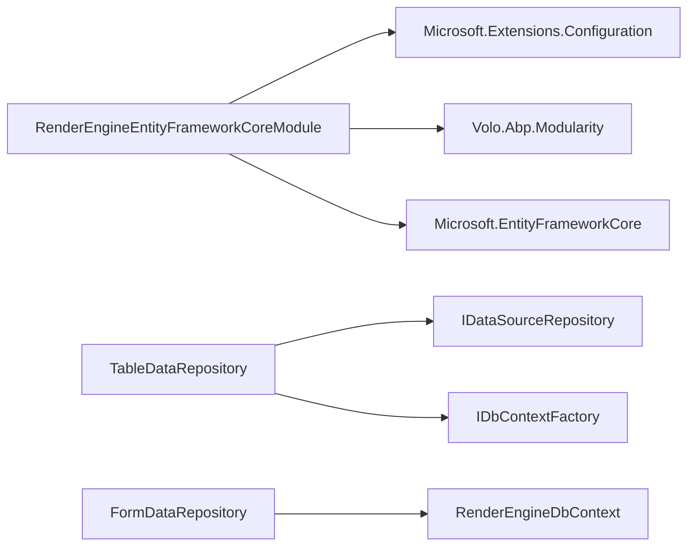

# EntityFrameworkCore 数据库仓储

<cite>
**本文引用的文件**   
- [RenderEngineEntityFrameworkCoreModule.cs](file://src/LowCode/RenderEngine/H.LowCode.RenderEngine.EntityFrameworkCore/RenderEngineEntityFrameworkCoreModule.cs)
- [RenderEngineDbContext.cs](file://src/LowCode/RenderEngine/H.LowCode.RenderEngine.EntityFrameworkCore/EntityFrameworkCore/RenderEngineDbContext.cs)
- [TableDataRepository.cs](file://src/LowCode/RenderEngine/H.LowCode.RenderEngine.EntityFrameworkCore/DataRepositories/TableDataRepository.cs)
- [IFormDataRepository.cs](file://src/LowCode/RenderEngine/H.LowCode.RenderEngine.Domain/DataRepositories/IFormDataRepository.cs)
- [ITableDataRepository.cs](file://src/LowCode/RenderEngine/H.LowCode.RenderEngine.Domain/DataRepositories/ITableDataRepository.cs)
- [FormDataRepository.cs](file://src/LowCode/RenderEngine/H.LowCode.RenderEngine.EntityFrameworkCore/DataRepositories/FormTableDataRepository.cs)
- [H.LowCode.RenderEngine.EntityFrameworkCore.csproj](file://src/LowCode/RenderEngine/H.LowCode.RenderEngine.EntityFrameworkCore/H.LowCode.RenderEngine.EntityFrameworkCore.csproj)
</cite>

## 目录
1. [引言](#引言)
2. [项目结构](#项目结构)
3. [核心组件](#核心组件)
4. [架构总览](#架构总览)
5. [详细组件分析](#详细组件分析)
6. [依赖关系分析](#依赖关系分析)
7. [性能优化指南](#性能优化指南)
8. [事务与并发控制](#事务与并发控制)
9. [错误处理与降级策略](#错误处理与降级策略)
10. [配置示例](#配置示例)
11. [数据迁移流程](#数据迁移流程)
12. [故障排查](#故障排查)
13. [结论](#结论)

## 引言
本文件面向使用 Entity Framework Core 的 Render Engine 数据库仓储模块，聚焦以下目标：
- 解释 RenderEngineEntityFrameworkCoreModule 的模块注册、DbContext 配置、仓储服务绑定。
- 说明数据库上下文设计：连接字符串解析、动态实体访问、拦截器与模型缓存键工厂替换。
- 梳理 TableDataRepository 与 FormDataRepository 的职责、查询构建模式、分页实现。
- 给出事务边界、悲观锁与乐观锁建议，以及分布式事务集成思路。
- 提供 SQL Server 连接字符串、EF Core 日志级别、连接池参数的配置参考。
- 总结 N+1 查询避免、索引设计、查询缓存与异步最佳实践。
- 说明首次部署、版本升级、备份恢复等迁移方案。
- 覆盖 DbUpdateException、连接超时重试与不可用降级策略。

## 项目结构
RenderEngine 的 EF Core 仓储位于独立程序集中，按领域接口与基础设施分离：
- Domain 层定义仓储接口：ITableDataRepository、IFormDataRepository。
- EntityFrameworkCore 程序集实现仓储并注册 DbContext 与服务。
- 模块类负责连接字符串解析、DbContext 工厂与 DbContext 双注册。

图示来源
- [RenderEngineEntityFrameworkCoreModule.cs:1-35](file://src/LowCode/RenderEngine/H.LowCode.RenderEngine.EntityFrameworkCore/RenderEngineEntityFrameworkCoreModule.cs#L1-L35)
- [RenderEngineDbContext.cs:1-287](file://src/LowCode/RenderEngine/H.LowCode.RenderEngine.EntityFrameworkCore/EntityFrameworkCore/RenderEngineDbContext.cs#L1-L287)
- [TableDataRepository.cs:1-313](file://src/LowCode/RenderEngine/H.LowCode.RenderEngine.EntityFrameworkCore/DataRepositories/TableDataRepository.cs#L1-L313)
- [IFormDataRepository.cs:1-15](file://src/LowCode/RenderEngine/H.LowCode.RenderEngine.Domain/DataRepositories/IFormDataRepository.cs#L1-L15)
- [ITableDataRepository.cs:1-17](file://src/LowCode/RenderEngine/H.LowCode.RenderEngine.Domain/DataRepositories/ITableDataRepository.cs#L1-L17)

章节来源
- [RenderEngineEntityFrameworkCoreModule.cs:1-35](file://src/LowCode/RenderEngine/H.LowCode.RenderEngine.EntityFrameworkCore/RenderEngineEntityFrameworkCoreModule.cs#L1-L35)
- [H.LowCode.RenderEngine.EntityFrameworkCore.csproj](file://src/LowCode/RenderEngine/H.LowCode.RenderEngine.EntityFrameworkCore/H.LowCode.RenderEngine.EntityFrameworkCore.csproj)

## 核心组件
- RenderEngineEntityFrameworkCoreModule：Abp 模块，完成仓储接口到实现的依赖注入绑定，解析连接字符串，注册 DbContext 工厂与 DbContext，并创建 EntityTypeManager 单例用于运行时实体类型管理。
- RenderEngineDbContext：基于 EF Core 的数据上下文，暴露 Add/Update/Delete/Get 等通用表单实体操作方法；支持通过当前 AppId 区分应用；替换模型缓存键工厂、添加只读保存拦截器和无锁查询拦截器。
- TableDataRepository：基于动态 DbSet 和表达式树构建筛选、排序、分页查询；使用 IDbContextFactory 创建新 DbContext 实例保证线程安全。
- FormDataRepository：对应 IFormDataRepository，封装 FormEntity 的增删改查操作（具体实现在 FormDataRepository.cs）。

章节来源
- [RenderEngineEntityFrameworkCoreModule.cs:1-35](file://src/LowCode/RenderEngine/H.LowCode.RenderEngine.EntityFrameworkCore/RenderEngineEntityFrameworkCoreModule.cs#L1-L35)
- [RenderEngineDbContext.cs:1-287](file://src/LowCode/RenderEngine/H.LowCode.RenderEngine.EntityFrameworkCore/EntityFrameworkCore/RenderEngineDbContext.cs#L1-L287)
- [TableDataRepository.cs:1-313](file://src/LowCode/RenderEngine/H.LowCode.RenderEngine.EntityFrameworkCore/DataRepositories/TableDataRepository.cs#L1-L313)
- [IFormDataRepository.cs:1-15](file://src/LowCode/RenderEngine/H.LowCode.RenderEngine.Domain/DataRepositories/IFormDataRepository.cs#L1-L15)
- [ITableDataRepository.cs:1-17](file://src/LowCode/RenderEngine/H.LowCode.RenderEngine.Domain/DataRepositories/ITableDataRepository.cs#L1-L17)

## 架构总览
下图展示请求从仓储到 DbContext 再到 SQL Server 的主路径，以及关键拦截点与扩展点。

图示来源
- [TableDataRepository.cs:1-313](file://src/LowCode/RenderEngine/H.LowCode.RenderEngine.EntityFrameworkCore/DataRepositories/TableDataRepository.cs#L1-L313)
- [RenderEngineDbContext.cs:1-287](file://src/LowCode/RenderEngine/H.LowCode.RenderEngine.EntityFrameworkCore/EntityFrameworkCore/RenderEngineDbContext.cs#L1-L287)

## 详细组件分析

### 模块注册：RenderEngineEntityFrameworkCoreModule
职责要点
- 将 IFormDataRepository、ITableDataRepository 以 Scoped 方式注入。
- 创建 EntityTypeManager 以便运行时获取实体类型元信息。
- 解析连接字符串：优先读取 RenderEngineDb，回退 Default。
- 注册两种 DbContext 使用方式：
  - 使用 AddDbContextFactory 生成新的 DbContext 实例，适合仓储内部按需创建、避免共享状态。
  - 同时保留 AddDbContext 传统注册作为兼容备用。

依赖注入容器绑定
- 使用 Abp 的 ServiceConfigurationContext 进行服务注册。
- 所有仓储均为 Scoped，适合 Web 请求级生命周期。

图示来源
- [RenderEngineEntityFrameworkCoreModule.cs:1-35](file://src/LowCode/RenderEngine/H.LowCode.RenderEngine.EntityFrameworkCore/RenderEngineEntityFrameworkCoreModule.cs#L1-L35)

章节来源
- [RenderEngineEntityFrameworkCoreModule.cs:1-35](file://src/LowCode/RenderEngine/H.LowCode.RenderEngine.EntityFrameworkCore/RenderEngineEntityFrameworkCoreModule.cs#L1-L35)

### 数据库上下文：RenderEngineDbContext
设计要点
- 构造时从 ICurrentApp 读取当前 AppId，便于多租户或多应用隔离。
- 提供通用表单实体方法：
  - AddAsync：动态创建实体、映射字段值、调用 SaveChanges。
  - UpdateAsync：根据实体名与主键查找记录后更新。
  - GetAsync：按实体名与主键查询并映射为 FormEntity。
  - DeleteAsync：按实体名与主键删除。
- OnConfiguring 中：
  - 替换模型缓存键工厂为 RenderEngineModelCacheKeyFactory。
  - 添加 ReadOnlySaveChangesInterceptor 与 QueryWithNoLockDbCommandInterceptor。
  - 替换模型验证器为 CustomizeRelationalModelValidator。
  - 预留 LINQ 翻译扩展替换点。

连接字符串配置
- 实际 UseSqlServer(connectionString) 在模块中设置，而非上下文内硬编码。

图示来源
- [RenderEngineDbContext.cs:1-287](file://src/LowCode/RenderEngine/H.LowCode.RenderEngine.EntityFrameworkCore/EntityFrameworkCore/RenderEngineDbContext.cs#L1-L287)

章节来源
- [RenderEngineDbContext.cs:1-287](file://src/LowCode/RenderEngine/H.LowCode.RenderEngine.EntityFrameworkCore/EntityFrameworkCore/RenderEngineDbContext.cs#L1-L287)

### 表格数据仓储：TableDataRepository
职责要点
- 使用 IDataSourceRepository 获取数据源元信息，再根据数据源名称映射到实体类型。
- 使用 IDbContextFactory 创建 DbContext 实例，确保并发安全。
- 动态构建 LINQ：
  - 过滤：遍历 Filters，反射属性并构造等值条件。
  - 排序：解析 Sorting 字符串，构造 OrderBy/OrderByDescending。
  - 分页：Count + Skip/Take。
- 结果转换为 Dictionary<string, object> 列表，适配低代码动态表结构。
- 提供 DeleteAsync、UpdateAsync 等方法。

查询构建流程图

图示来源
- [TableDataRepository.cs:1-313](file://src/LowCode/RenderEngine/H.LowCode.RenderEngine.EntityFrameworkCore/DataRepositories/TableDataRepository.cs#L1-L313)

章节来源
- [TableDataRepository.cs:1-313](file://src/LowCode/RenderEngine/H.LowCode.RenderEngine.EntityFrameworkCore/DataRepositories/TableDataRepository.cs#L1-L313)
- [ITableDataRepository.cs:1-17](file://src/LowCode/RenderEngine/H.LowCode.RenderEngine.Domain/DataRepositories/ITableDataRepository.cs#L1-L17)

### 表单数据仓储：FormDataRepository
职责要点
- 实现 IFormDataRepository，提供 FormEntity 的 Add/Update/Get/Delete。
- 与 RenderEngineDbContext 的通用表单方法配合，完成对动态表单数据的持久化。

章节来源
- [IFormDataRepository.cs:1-15](file://src/LowCode/RenderEngine/H.LowCode.RenderEngine.Domain/DataRepositories/IFormDataRepository.cs#L1-L15)
- [FormDataRepository.cs](file://src/LowCode/RenderEngine/H.LowCode.RenderEngine.EntityFrameworkCore/DataRepositories/FormTableDataRepository.cs)

## 依赖关系分析
- 模块依赖：
  - Microsoft.Extensions.Configuration 用于读取连接字符串。
  - Volo.Abp.Modularity 提供模块机制。
  - Microsoft.EntityFrameworkCore 提供数据库访问能力。
- 仓储依赖：
  - TableDataRepository 依赖 IDataSourceRepository 与 IDbContextFactory。
  - FormDataRepository 依赖 RenderEngineDbContext。

图示来源
- [RenderEngineEntityFrameworkCoreModule.cs:1-35](file://src/LowCode/RenderEngine/H.LowCode.RenderEngine.EntityFrameworkCore/RenderEngineEntityFrameworkCoreModule.cs#L1-L35)
- [TableDataRepository.cs:1-313](file://src/LowCode/RenderEngine/H.LowCode.RenderEngine.EntityFrameworkCore/DataRepositories/TableDataRepository.cs#L1-L313)

章节来源
- [RenderEngineEntityFrameworkCoreModule.cs:1-35](file://src/LowCode/RenderEngine/H.LowCode.RenderEngine.EntityFrameworkCore/RenderEngineEntityFrameworkCoreModule.cs#L1-L35)
- [TableDataRepository.cs:1-313](file://src/LowCode/RenderEngine/H.LowCode.RenderEngine.EntityFrameworkCore/DataRepositories/TableDataRepository.cs#L1-L313)

## 性能优化指南
针对动态表结构与高并发场景，建议如下：

- 避免 N+1 查询
  - 尽量在仓储层一次性拉取所需字段，减少多次往返。
  - 对于跨表关联查询，应显式 Include 或使用投影 Select 指定字段。
  - 避免在循环中逐条查询数据库。

- 索引设计建议
  - 对高频过滤字段建立普通索引。
  - 对排序字段建立复合索引，顺序与常用排序一致。
  - 对主键及外键建立索引。
  - 注意覆盖索引以减少回表。

- 查询缓存策略
  - 对静态或低频变化数据采用内存缓存。
  - 对动态表数据，谨慎使用全局缓存，考虑按 AppId、数据源名、查询条件维度缓存。
  - 结合 RenderEngineModelCacheKeyFactory 的自定义逻辑，确保缓存键准确。

- 异步查询最佳实践
  - 仓储方法全部使用 async/await。
  - 避免阻塞式 .Result 或 .Wait()。
  - 合理设置 CommandTimeout，避免长查询超时。

- 表达式树与动态 LINQ
  - 当前 TableDataRepository 已使用表达式树构建 Where/OrderBy，可进一步引入动态 LINQ 库简化复杂条件组合。
  - 注意类型转换与空值处理，防止无效查询。

[本节为通用性能指导，不直接分析具体文件]

## 事务与并发控制
- 事务边界
  - 仓储内的单个写操作通常由 SaveChanges 决定事务边界。
  - 跨多个仓储的写操作应在上层服务中使用显式事务包裹。

- 悲观锁
  - 可在查询中添加 WithNoLock 或数据库特定提示，但需注意脏读风险。
  - 若需强一致性，使用行级锁定语句（如 SELECT ... WITH (UPDLOCK, ROWLOCK)）。

- 乐观锁
  - 建议在实体中增加版本号字段（例如 RowVersion），每次更新前检查版本号。
  - 在模型配置中启用并发令牌，EF Core 自动生成冲突检测。

- 分布式事务
  - 若涉及多个数据库或外部系统，建议使用 Saga 或补偿事务方案。
  - 可集成 ABP 提供的分布式事务能力或消息总线协调。

[本节为通用事务指导，不直接分析具体文件]

## 错误处理与降级策略
- DbUpdateException
  - 捕获该异常并转换为业务友好的错误码与消息。
  - 记录原始 SQL、参数与受影响实体类型，便于排障。

- 连接超时重试
  - 使用 Polly 对数据库连接与命令执行实施指数退避重试。
  - 仅对瞬态错误重试，避免对非幂等操作重复执行。

- 数据库不可用降级
  - 在健康检查失败时切换到只读模式或返回缓存数据。
  - 对写操作返回明确的“数据库不可用”响应，避免静默失败。

章节来源
- [RenderEngineDbContext.cs:1-287](file://src/LowCode/RenderEngine/H.LowCode.RenderEngine.EntityFrameworkCore/EntityFrameworkCore/RenderEngineDbContext.cs#L1-L287)

## 配置示例
以下为 appsettings.json 中常见配置项说明（供参考）：
- 连接字符串
  - 键名：RenderEngineDb（优先）、Default（回退）
  - 示例键值：Server=...;Database=...;User Id=...;Password=...;Encrypt=False;TrustServerCertificate=True;Connection Timeout=30;Multiple Active Result Sets=false
- EF Core 日志级别
  - 使用 Serilog 或内置日志，设置 Microsoft.EntityFrameworkCore 命名空间日志级别为 Warning 或 Information。
- 连接池参数
  - Connection Timeout：连接超时秒数。
  - Max Pool Size：最大连接池大小，依据并发量调整。
  - Min Pool Size：最小连接池大小，预热连接。
  - Multiple Active Result Sets：根据驱动与查询模式决定是否开启。

注意：本项目中连接字符串在模块中解析并使用 UseSqlServer，不应在上下文中重复配置。

[本节为通用配置指导，不直接分析具体文件]

## 数据迁移流程
- 首次部署初始化
  - 运行迁移工具，确保数据库与模型同步。
  - 检查默认数据源是否已初始化。

- 版本升级脚本
  - 新增或修改实体后生成迁移脚本。
  - 在 CI/CD 中自动执行迁移，失败则回滚。

- 数据备份恢复
  - 定期全量备份与增量备份。
  - 演练恢复流程，确保 RPO/RTO 满足要求。

- 迁移工具与宿主
  - 本仓库包含多个 DbMigrator 工程，可作为迁移执行的参考范式。
  - RenderEngine 的迁移可参照现有 Migrator 工程结构组织。

[本节为通用迁移指导，不直接分析具体文件]

## 故障排查
常见问题与建议
- 无法找到实体类型
  - 检查数据源名称与实体名是否一致。
  - 确认 RenderEngineModelCacheKeyFactory 是否正确生成缓存键。
- 动态字段类型转换失败
  - 检查表单字段类型与数据库列类型是否匹配。
  - 在仓储层增强类型转换与异常处理。
- 分页性能差
  - 检查排序字段是否有合适索引。
  - 避免在大偏移量下使用 Skip/Take，考虑游标分页。
- 并发写入冲突
  - 启用乐观锁并处理并发异常。
  - 在上层重试失败的业务逻辑。

章节来源
- [RenderEngineDbContext.cs:1-287](file://src/LowCode/RenderEngine/H.LowCode.RenderEngine.EntityFrameworkCore/EntityFrameworkCore/RenderEngineDbContext.cs#L1-L287)
- [TableDataRepository.cs:1-313](file://src/LowCode/RenderEngine/H.LowCode.RenderEngine.EntityFrameworkCore/DataRepositories/TableDataRepository.cs#L1-L313)

## 结论
RenderEngine 的 EntityFrameworkCore 仓储模块通过清晰的模块注册、动态实体访问与表达式树查询，支撑了低代码场景下的表格与表单数据管理。为保障稳定性与性能，建议在生产环境完善日志、监控、重试、降级、索引与迁移策略，并在上层服务中统一编排事务与并发控制。