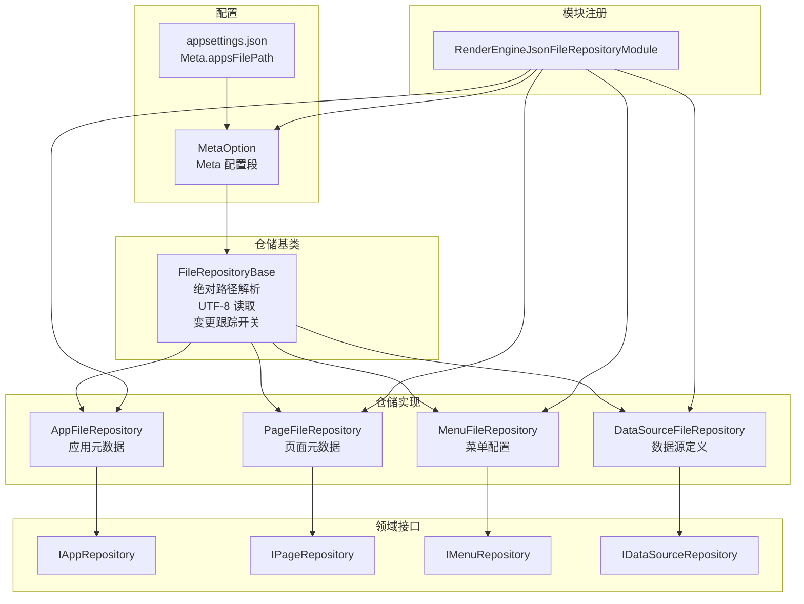
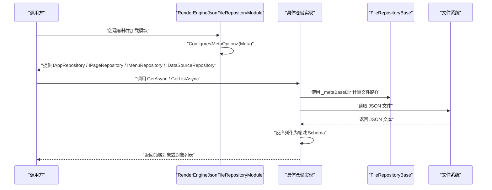
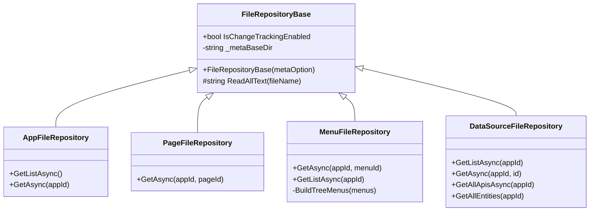
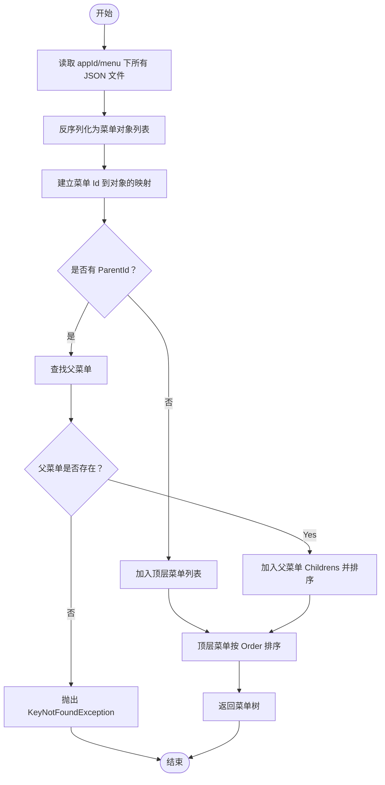
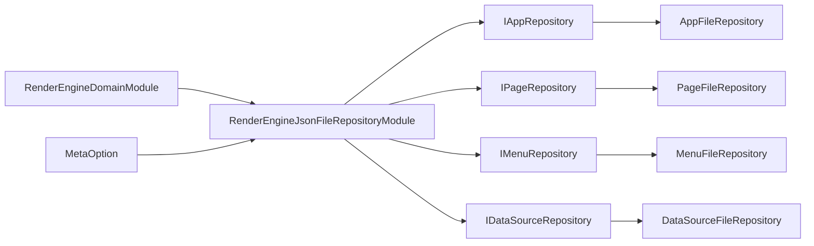

# JsonFile 本地文件仓储

<cite>
**本文引用的文件列表**   
- [FileRepositoryBase.cs](file://src/LowCode/RenderEngine/H.LowCode.RenderEngine.Repository.JsonFile/Base/FileRepositoryBase.cs)
- [AppFileRepository.cs](file://src/LowCode/RenderEngine/H.LowCode.RenderEngine.Repository.JsonFile/Repositories/AppFileRepository.cs)
- [PageFileRepository.cs](file://src/LowCode/RenderEngine/H.LowCode.RenderEngine.Repository.JsonFile/Repositories/PageFileRepository.cs)
- [MenuFileRepository.cs](file://src/LowCode/RenderEngine/H.LowCode.RenderEngine.Repository.JsonFile/Repositories/MenuFileRepository.cs)
- [DataSourceFileRepository.cs](file://src/LowCode/RenderEngine/H.LowCode.RenderEngine.Repository.JsonFile/Repositories/DataSourceFileRepository.cs)
- [MetaOption.cs](file://src/LowCode/Common/H.LowCode.Configuration/Options/MetaOption.cs)
- [RenderEngineJsonFileRepositoryModule.cs](file://src/LowCode/RenderEngine/H.LowCode.RenderEngine.Repository.JsonFile/RenderEngineJsonFileRepositoryModule.cs)
- [IAppRepository.cs](file://src/LowCode/RenderEngine/H.LowCode.RenderEngine.Domain/MetaRepositories/IAppRepository.cs)
- [IPageRepository.cs](file://src/LowCode/RenderEngine/H.LowCode.RenderEngine.Domain/MetaRepositories/IPageRepository.cs)
- [IMenuRepository.cs](file://src/LowCode/RenderEngine/H.LowCode.RenderEngine.Domain/MetaRepositories/IMenuRepository.cs)
- [IDataSourceRepository.cs](file://src/LowCode/RenderEngine/H.LowCode.RenderEngine.Domain/MetaRepositories/IDataSourceRepository.cs)
- [appsettings.json](file://src/Host/RenderEngine/H.LowCode.RenderEngine.Host/appsettings.json)
</cite>

## 目录

1. [简介](#简介)
2. [项目结构](#项目结构)
3. [核心组件](#核心组件)
4. [架构总览](#架构总览)
5. [详细组件分析](#详细组件分析)
6. [依赖关系分析](#依赖关系分析)
7. [性能与并发](#性能与并发)
8. [配置说明](#配置说明)
9. [使用示例](#使用示例)
10. [错误处理与故障排查](#错误处理与故障排查)
11. [结论](#结论)

## 简介

本仓库中的 JsonFile 本地文件仓储为低代码渲染引擎提供基于 JSON 文件的元数据持久化能力。其核心职责是：

- 将应用、页面、菜单、数据源等元数据以 JSON 文件形式存储到磁盘。
- 通过 `MetaOption` 注入根路径，自动解析绝对路径并统一使用 UTF-8 编码读写文件。
- 实现 `IAppRepository`、`IPageRepository`、`IMenuRepository`、`IDataSourceRepository` 接口，向上层应用服务暴露稳定的仓储 API。
- 提供可预留的变更跟踪开关 `IsChangeTrackingEnabled`，便于后续扩展增量更新和审计能力。

当前实现以“按实体类型划分仓储类”的方式组织代码，所有仓储共享一个轻量基类 `FileRepositoryBase`，负责公共的路径解析、基础文件读取和变更跟踪开关。

## 项目结构

JsonFile 仓储位于渲染引擎的 JSON 文件仓储模块中，主要包含以下层次：

| 层级 | 作用 | 对应文件或目录 |
|---|---|---|
| 领域接口层 | 定义仓储契约 | `IAppRepository.cs`、`IPageRepository.cs`、`IMenuRepository.cs`、`IDataSourceRepository.cs` |
| 仓储实现层 | 具体 JSON 文件读写实现 | `AppFileRepository.cs`、`PageFileRepository.cs`、`MenuFileRepository.cs`、`DataSourceFileRepository.cs` |
| 基础设施基类 | 公共路径解析、UTF-8 读取、变更跟踪开关 | `FileRepositoryBase.cs` |
| 配置模型 | 从配置系统注入元数据根路径 | `MetaOption.cs` |
| 模块注册 | 依赖注入绑定接口到实现，并注册配置段 | `RenderEngineJsonFileRepositoryModule.cs` |
| 运行期配置示例 | 展示 `Meta` 配置段及 `appsFilePath` 用法 | `appsettings.json` |



**图示来源**
- [MetaOption.cs:1-10](file://src/LowCode/Common/H.LowCode.Configuration/Options/MetaOption.cs#L1-L10)
- [FileRepositoryBase.cs:1-27](file://src/LowCode/RenderEngine/H.LowCode.RenderEngine.Repository.JsonFile/Base/FileRepositoryBase.cs#L1-L27)
- [AppFileRepository.cs:1-49](file://src/LowCode/RenderEngine/H.LowCode.RenderEngine.Repository.JsonFile/Repositories/AppFileRepository.cs#L1-L49)
- [PageFileRepository.cs:1-26](file://src/LowCode/RenderEngine/H.LowCode.RenderEngine.Repository.JsonFile/Repositories/PageFileRepository.cs#L1-L26)
- [MenuFileRepository.cs:1-83](file://src/LowCode/RenderEngine/H.LowCode.RenderEngine.Repository.JsonFile/Repositories/MenuFileRepository.cs#L1-L83)
- [DataSourceFileRepository.cs:1-59](file://src/LowCode/RenderEngine/H.LowCode.RenderEngine.Repository.JsonFile/Repositories/DataSourceFileRepository.cs#L1-L59)
- [RenderEngineJsonFileRepositoryModule.cs:1-22](file://src/LowCode/RenderEngine/H.LowCode.RenderEngine.Repository.JsonFile/RenderEngineJsonFileRepositoryModule.cs#L1-L22)

**章节来源**
- [MetaOption.cs:1-10](file://src/LowCode/Common/H.LowCode.Configuration/Options/MetaOption.cs#L1-L10)
- [FileRepositoryBase.cs:1-27](file://src/LowCode/RenderEngine/H.LowCode.RenderEngine.Repository.JsonFile/Base/FileRepositoryBase.cs#L1-L27)
- [RenderEngineJsonFileRepositoryModule.cs:1-22](file://src/LowCode/RenderEngine/H.LowCode.RenderEngine.Repository.JsonFile/RenderEngineJsonFileRepositoryModule.cs#L1-L22)

## 核心组件

### FileRepositoryBase 基类

`FileRepositoryBase` 是所有 JsonFile 仓储的抽象基类，承担三项关键职责：

1. **配置注入与绝对路径解析**  
   构造函数接收 `IOptions<MetaOption>`，从 `MetaOption.AppsFilePath` 获取配置的元数据根路径，并通过 `Path.GetFullPath` 转换为绝对路径，保存在 `_metaBaseDir` 字段中。这避免调用方重复拼接相对路径，也降低部署环境差异带来的路径问题。

2. **UTF-8 文件读取封装**  
   提供受保护的 `ReadAllText(string fileName)` 方法：
   - 检查文件是否存在；不存在时抛出 `FileNotFoundException`。
   - 使用 `Encoding.UTF8` 读取文本，保证中文和国际化字符正确解析。

3. **变更跟踪开关预留**  
   公开属性 `IsChangeTrackingEnabled` 默认初始化为 `false`。当前实现未在该基类中启用实际的文件级锁或内存缓存，但该字段为后续实现变更追踪、增量写入、审计日志等能力预留了入口。

| 成员 | 类型 | 默认值 | 行为说明 |
|---|---|---:|---|
| `IsChangeTrackingEnabled` | `bool?` | `false` | 是否启用变更跟踪，当前为预留字段 |
| `_metaBaseDir` | `string` | 由构造注入 | 已解析为绝对路径的元数据根目录 |
| `ReadAllText(fileName)` | 方法 | 抛出异常或返回文本 | 存在则 UTF-8 读取；不存在抛 `FileNotFoundException` |

**章节来源**
- [FileRepositoryBase.cs:1-27](file://src/LowCode/RenderEngine/H.LowCode.RenderEngine.Repository.JsonFile/Base/FileRepositoryBase.cs#L1-L27)

### 实体仓储实现

#### AppFileRepository：应用元数据仓储

`AppFileRepository` 管理应用级别的元数据文件，主要能力包括：

- 列出所有应用：扫描 `_metaBaseDir` 下的子目录，并按约定文件名加载每个应用的 JSON 文件。
- 获取单个应用：根据 `appId` 直接定位应用 JSON 文件并反序列化为 `AppSchema`。

其内部文件名格式为：

```text
{元数据根目录}\{appId}\{appId}.json
```

例如，当 `appId` 为 `MyApp` 时，文件路径形如 `.../MyApp/MyApp.json`。

| 方法 | 参数 | 返回值 | 行为 |
|---|---|---|---|
| `GetListAsync` | 无 | `Task<IList<AppSchema>>` | 扫描根目录下的应用子目录，逐个读取并反序列化应用元数据 |
| `GetAsync` | `appId` | `Task<AppSchema>` | 根据 `appId` 读取对应应用 JSON 文件 |

**章节来源**
- [AppFileRepository.cs:1-49](file://src/LowCode/RenderEngine/H.LowCode.RenderEngine.Repository.JsonFile/Repositories/AppFileRepository.cs#L1-L49)
- [IAppRepository.cs:1-10](file://src/LowCode/RenderEngine/H.LowCode.RenderEngine.Domain/MetaRepositories/IAppRepository.cs#L1-L10)

#### PageFileRepository：页面元数据仓储

`PageFileRepository` 管理页面元数据，命名约定为：

```text
{元数据根目录}\{appId}\page\{pageId}.json
```

它只暴露 `GetAsync(appId, pageId)`，用于根据应用和页面标识加载页面 Schema。

| 方法 | 参数 | 返回值 | 行为 |
|---|---|---|---|
| `GetAsync` | `appId`、`pageId` | `Task<PageSchema>` | 读取指定页面对应的 JSON 文件并反序列化为 `PageSchema` |

**章节来源**
- [PageFileRepository.cs:1-26](file://src/LowCode/RenderEngine/H.LowCode.RenderEngine.Repository.JsonFile/Repositories/PageFileRepository.cs#L1-L26)
- [IPageRepository.cs:1-8](file://src/LowCode/RenderEngine/H.LowCode.RenderEngine.Domain/MetaRepositories/IPageRepository.cs#L1-L8)

#### MenuFileRepository：菜单配置仓储

`MenuFileRepository` 管理菜单配置，支持两种访问方式：

- 按菜单标识获取单个菜单：`{元数据根目录}\{appId}\menu\{menuId}.json`。
- 按应用获取菜单列表，并构建菜单树：先读取 `{appId}/menu/*.json`，再按 `ParentId` 组装父子关系。

菜单树构建逻辑包括：

1. 建立菜单标识到菜单对象的字典。
2. 将没有父菜单的项作为顶层菜单。
3. 将具有父菜单的项添加到父菜单的 `Childrens` 集合。
4. 对子菜单按 `Order` 排序。
5. 对顶层菜单也按 `Order` 排序。
6. 如果某个菜单引用了不存在的父菜单，抛出 `KeyNotFoundException`。

| 方法 | 参数 | 返回值 | 行为 |
|---|---|---|---|
| `GetAsync` | `appId`、`menuId` | `Task<MenuSchema?>` | 若文件不存在返回 `null`，否则读取并反序列化 |
| `GetListAsync` | `appId` | `Task<IList<MenuSchema>>` | 读取菜单目录并按父子关系构建树，同时按 `Order` 排序 |

**章节来源**
- [MenuFileRepository.cs:1-83](file://src/LowCode/RenderEngine/H.LowCode.RenderEngine.Repository.JsonFile/Repositories/MenuFileRepository.cs#L1-L83)
- [IMenuRepository.cs:1-10](file://src/LowCode/RenderEngine/H.LowCode.RenderEngine.Domain/MetaRepositories/IMenuRepository.cs#L1-L10)

#### DataSourceFileRepository：数据源定义仓储

`DataSourceFileRepository` 管理数据源定义，支持：

- 按应用获取全部数据源列表。
- 按应用和数据源标识获取单个数据源。
- 筛选出类型为 API 的数据源。
- 筛选出类型为数据库实体的数据源。

文件名约定为：

```text
{元数据根目录}\{appId}\datasource\{id}.json
```

数据源列表会按 `Order` 排序。

| 方法 | 参数 | 返回值 | 行为 |
|---|---|---|---|
| `GetListAsync` | `appId` | `Task<IList<DataSourceSchema>>` | 读取 `{appId}/datasource/*.json` 并按 `Order` 排序 |
| `GetAsync` | `appId`、`id` | `Task<DataSourceSchema>` | 读取指定数据源 JSON 文件 |
| `GetAllApisAsync` | `appId` | `Task<IList<DataSourceSchema>>` | 过滤 `DataSourceType == API` 的数据源 |
| `GetAllEntities` | `appId` | `IEnumerable<DataSourceSchema>` | 同步枚举 `DataSourceType == DB` 的数据源 |

**章节来源**
- [DataSourceFileRepository.cs:1-59](file://src/LowCode/RenderEngine/H.LowCode.RenderEngine.Repository.JsonFile/Repositories/DataSourceFileRepository.cs#L1-L59)
- [IDataSourceRepository.cs:1-14](file://src/LowCode/RenderEngine/H.LowCode.RenderEngine.Domain/MetaRepositories/IDataSourceRepository.cs#L1-L14)

## 架构总览

JsonFile 仓储遵循典型的 ABP 模块化分层：

- 配置层通过 `MetaOption` 提供元数据根路径。
- 模块层通过 `RenderEngineJsonFileRepositoryModule` 完成依赖注入注册。
- 领域接口层定义统一的仓储契约。
- 仓储实现层操作 JSON 文件，把磁盘上的字符串转为领域 Schema 对象。



**图示来源**
- [RenderEngineJsonFileRepositoryModule.cs:1-22](file://src/LowCode/RenderEngine/H.LowCode.RenderEngine.Repository.JsonFile/RenderEngineJsonFileRepositoryModule.cs#L1-L22)
- [FileRepositoryBase.cs:1-27](file://src/LowCode/RenderEngine/H.LowCode.RenderEngine.Repository.JsonFile/Base/FileRepositoryBase.cs#L1-L27)
- [AppFileRepository.cs:1-49](file://src/LowCode/RenderEngine/H.LowCode.RenderEngine.Repository.JsonFile/Repositories/AppFileRepository.cs#L1-L49)

## 详细组件分析

### FileRepositoryBase 设计要点

`FileRepositoryBase` 的设计目标是“最小但足够”：

- 它不是完整文件事务管理器，也没有内置文件锁。
- 它统一处理绝对路径和 UTF-8 编码，减少各仓储重复实现。
- 它暴露 `IsChangeTrackingEnabled`，为未来扩展留口。

潜在改进点包括：

- 将 `ReadAllText` 升级为异步版本，避免阻塞线程池。
- 在需要时引入细粒度文件锁，例如按 `appId` 或文件名加锁。
- 在变更跟踪启用时记录修改时间戳、版本号或写入人。



**图示来源**
- [FileRepositoryBase.cs:1-27](file://src/LowCode/RenderEngine/H.LowCode.RenderEngine.Repository.JsonFile/Base/FileRepositoryBase.cs#L1-L27)
- [AppFileRepository.cs:1-49](file://src/LowCode/RenderEngine/H.LowCode.RenderEngine.Repository.JsonFile/Repositories/AppFileRepository.cs#L1-L49)
- [PageFileRepository.cs:1-26](file://src/LowCode/RenderEngine/H.LowCode.RenderEngine.Repository.JsonFile/Repositories/PageFileRepository.cs#L1-L26)
- [MenuFileRepository.cs:1-83](file://src/LowCode/RenderEngine/H.LowCode.RenderEngine.Repository.JsonFile/Repositories/MenuFileRepository.cs#L1-L83)
- [DataSourceFileRepository.cs:1-59](file://src/LowCode/RenderEngine/H.LowCode.RenderEngine.Repository.JsonFile/Repositories/DataSourceFileRepository.cs#L1-L59)

### 菜单树构建流程

菜单树构建是一个典型的多轮遍历算法：



**图示来源**
- [MenuFileRepository.cs:47-83](file://src/LowCode/RenderEngine/H.LowCode.RenderEngine.Repository.JsonFile/Repositories/MenuFileRepository.cs#L47-L83)

**章节来源**
- [MenuFileRepository.cs:1-83](file://src/LowCode/RenderEngine/H.LowCode.RenderEngine.Repository.JsonFile/Repositories/MenuFileRepository.cs#L1-L83)

## 依赖关系分析

### 模块依赖

`RenderEngineJsonFileRepositoryModule` 是 JsonFile 仓储的模块入口，负责：

- 将四个仓储接口分别绑定到对应的 JSON 文件实现。
- 从配置系统中读取 `Meta` 配置段，并注入到 `MetaOption`。
- 依赖 `RenderEngineDomainModule`，确保领域接口可用。



**图示来源**
- [RenderEngineJsonFileRepositoryModule.cs:1-22](file://src/LowCode/RenderEngine/H.LowCode.RenderEngine.Repository.JsonFile/RenderEngineJsonFileRepositoryModule.cs#L1-L22)
- [MetaOption.cs:1-10](file://src/LowCode/Common/H.LowCode.Configuration/Options/MetaOption.cs#L1-L10)

### 仓储与接口依赖

| 仓储类 | 实现接口 | 主要依赖 |
|---|---|---|
| `AppFileRepository` | `IAppRepository` | `FileRepositoryBase`、`AppSchema` |
| `PageFileRepository` | `IPageRepository` | `FileRepositoryBase`、`PageSchema` |
| `MenuFileRepository` | `IMenuRepository` | `FileRepositoryBase`、`MenuSchema` |
| `DataSourceFileRepository` | `IDataSourceRepository` | `FileRepositoryBase`、`DataSourceSchema` |

**章节来源**
- [RenderEngineJsonFileRepositoryModule.cs:1-22](file://src/LowCode/RenderEngine/H.LowCode.RenderEngine.Repository.JsonFile/RenderEngineJsonFileRepositoryModule.cs#L1-L22)
- [IAppRepository.cs:1-10](file://src/LowCode/RenderEngine/H.LowCode.RenderEngine.Domain/MetaRepositories/IAppRepository.cs#L1-L10)
- [IPageRepository.cs:1-8](file://src/LowCode/RenderEngine/H.LowCode.RenderEngine.Domain/MetaRepositories/IPageRepository.cs#L1-L8)
- [IMenuRepository.cs:1-10](file://src/LowCode/RenderEngine/H.LowCode.RenderEngine.Domain/MetaRepositories/IMenuRepository.cs#L1-L10)
- [IDataSourceRepository.cs:1-14](file://src/LowCode/RenderEngine/H.LowCode.RenderEngine.Domain/MetaRepositories/IDataSourceRepository.cs#L1-L14)

## 性能与并发

### 当前实现的性能特征

当前 JsonFile 仓储的实现偏向简单可靠，而不是高并发高性能：

| 维度 | 当前行为 | 影响 |
|---|---|---|
| 文件读取 | 使用同步全量读取并一次性反序列化 | 小文件成本低；大文件可能占用较多内存 |
| 目录扫描 | `Directory.GetDirectories` / `Directory.GetFiles` | 首次扫描开销随目录数量线性增长 |
| 缓存 | 无显式内存缓存 | 重复请求会重复读盘 |
| 并发安全 | 无文件锁或并发控制 | 并发写同一文件可能覆盖或产生不一致 |
| 增量更新 | 未实现 | 每次保存通常替换整个 JSON 文件 |

### 性能优化建议

虽然当前实现没有内置这些机制，但在扩展时可考虑：

1. **流式读取**  
   对超大 JSON 文件，可从 `ReadAllText` 演进为流式解析，避免将整个文件内容加载到字符串。

2. **文件缓存策略**  
   可按 `appId`、`pageId`、`menuId`、`dataSourceId` 增加弱引用缓存，并设置过期时间或失效事件。

3. **增量更新机制**  
   仅在必要字段变化时更新 JSON，或使用 JSON Patch 格式记录差异，减少磁盘写入和反序列化成本。

4. **批量扫描优化**  
   对 `GetListAsync` 可引入懒加载、分页、索引文件等方式，避免每次启动都扫描整个目录。

5. **并发控制**  
   如果需要多进程或多实例写入，应引入文件锁或外部协调器，例如基于 Redis、分布式锁或文件系统独占句柄。

### 并发控制现状

当前实现中：

- `IsChangeTrackingEnabled` 只是布尔标记，并未驱动任何锁或缓存。
- 没有看到基于文件名、`appId` 或全局锁的互斥写入。
- 多个线程同时读取同一文件是安全的；多个线程同时写入同一文件则需要外部保护。

因此，生产环境中若存在多实例部署或后台任务同时修改元数据，应在更上层引入一致性与锁机制。

**章节来源**
- [FileRepositoryBase.cs:1-27](file://src/LowCode/RenderEngine/H.LowCode.RenderEngine.Repository.JsonFile/Base/FileRepositoryBase.cs#L1-L27)
- [AppFileRepository.cs:1-49](file://src/LowCode/RenderEngine/H.LowCode.RenderEngine.Repository.JsonFile/Repositories/AppFileRepository.cs#L1-L49)
- [MenuFileRepository.cs:1-83](file://src/LowCode/RenderEngine/H.LowCode.RenderEngine.Repository.JsonFile/Repositories/MenuFileRepository.cs#L1-L83)
- [DataSourceFileRepository.cs:1-59](file://src/LowCode/RenderEngine/H.LowCode.RenderEngine.Repository.JsonFile/Repositories/DataSourceFileRepository.cs#L1-L59)

## 配置说明

### MetaOption 配置模型

`MetaOption` 定义了低代码元数据的配置段名称和两个路径字段：

| 配置键 | 类型 | 含义 |
|---|---|---|
| `Meta` | 配置段名 | 低代码元数据相关配置所在段 |
| `Meta.appsFilePath` | 字符串 | 应用、页面、菜单、数据源等元数据的根目录 |
| `Meta.partsFilePath` | 字符串 | 部件相关元数据根目录（本仓储文档聚焦应用侧） |

模块通过 `context.Services.Configure<MetaOption>(configuration.GetSection(MetaOption.SectionName))` 将配置段绑定到 `MetaOption`。

**章节来源**
- [MetaOption.cs:1-10](file://src/LowCode/Common/H.LowCode.Configuration/Options/MetaOption.cs#L1-L10)
- [RenderEngineJsonFileRepositoryModule.cs:17-21](file://src/LowCode/RenderEngine/H.LowCode.RenderEngine.Repository.JsonFile/RenderEngineJsonFileRepositoryModule.cs#L17-L21)

### appsettings.json 中的 Meta 配置

在渲染引擎宿主工程中，`appsettings.json` 展示了 `Meta` 配置段的实际写法：

- `Meta.appsFilePath` 指向低代码元数据的应用目录。
- `Meta.partsFilePath` 指向部件元数据目录。

注意：配置文件中的键名为小驼峰 `appsFilePath`，而 C# 属性名为 `AppsFilePath`；ABP 的配置绑定通常忽略大小写，因此该写法可以正常工作。

推荐的生产配置原则：

- 使用绝对路径或相对于工作目录的稳定相对路径。
- 确保应用运行账户对该目录有读写权限。
- 不要把敏感信息放在元数据文件中；JSON 文件通常会被版本控制或备份工具扫描。

**章节来源**
- [appsettings.json:1-65](file://src/Host/RenderEngine/H.LowCode.RenderEngine.Host/appsettings.json#L1-L65)

### 如何启用变更跟踪

当前代码中：

- `IsChangeTrackingEnabled` 默认值为 `false`。
- 没有在模块注册中覆盖该值。
- 没有在仓储实现中使用该字段做分支逻辑。

因此，仅设置该属性不会改变现有行为。若未来要启用变更跟踪，建议：

1. 在模块注册中根据配置决定是否为仓储设置 `IsChangeTrackingEnabled = true`。
2. 在仓储写入前记录原始快照。
3. 在写入后记录变更摘要，如时间、用户、差异摘要。
4. 如需审计，可将变更记录写入独立文件或数据库。

### 如何自定义文件编码

当前 `ReadAllText` 固定使用 `Encoding.UTF8`。如需支持其他编码，可在基类中增加可选编码参数或配置项，例如：

- 新增 `Encoding Encoding` 属性。
- 提供 `ReadAllText(fileName, encoding)` 重载。
- 在 `MetaOption` 中增加 `FileEncoding` 配置项。

**章节来源**
- [FileRepositoryBase.cs:1-27](file://src/LowCode/RenderEngine/H.LowCode.RenderEngine.Repository.JsonFile/Base/FileRepositoryBase.cs#L1-L27)

## 使用示例

### 通过依赖注入获取仓储接口

在 ASP.NET Core 或 ABP 应用中，可以通过依赖注入获取以下接口：

- `IAppRepository`：应用元数据仓储。
- `IPageRepository`：页面元数据仓储。
- `IMenuRepository`：菜单仓储。
- `IDataSourceRepository`：数据源仓储。

模块已在 `RenderEngineJsonFileRepositoryModule` 中将这四个接口注册为瞬时作用域的服务。

典型调用位置可以是应用服务、控制器、命令处理器或背景任务。调用时应捕获底层文件异常，并将其转换为业务异常或友好提示。

**章节来源**
- [RenderEngineJsonFileRepositoryModule.cs:12-21](file://src/LowCode/RenderEngine/H.LowCode.RenderEngine.Repository.JsonFile/RenderEngineJsonFileRepositoryModule.cs#L12-L21)
- [IAppRepository.cs:1-10](file://src/LowCode/RenderEngine/H.LowCode.RenderEngine.Domain/MetaRepositories/IAppRepository.cs#L1-L10)
- [IPageRepository.cs:1-8](file://src/LowCode/RenderEngine/H.LowCode.RenderEngine.Domain/MetaRepositories/IPageRepository.cs#L1-L8)
- [IMenuRepository.cs:1-10](file://src/LowCode/RenderEngine/H.LowCode.RenderEngine.Domain/MetaRepositories/IMenuRepository.cs#L1-L10)
- [IDataSourceRepository.cs:1-14](file://src/LowCode/RenderEngine/H.LowCode.RenderEngine.Domain/MetaRepositories/IDataSourceRepository.cs#L1-L14)

### 读取应用列表

调用 `IAppRepository.GetListAsync()` 后：

1. 仓储判断 `_metaBaseDir` 是否存在。
2. 若不存在，返回空列表。
3. 若存在，枚举所有子目录。
4. 对每个子目录尝试读取 `{appId}/{appId}.json`。
5. 将 JSON 反序列化为 `AppSchema` 并加入结果集。

**章节来源**
- [AppFileRepository.cs:17-38](file://src/LowCode/RenderEngine/H.LowCode.RenderEngine.Repository.JsonFile/Repositories/AppFileRepository.cs#L17-L38)

### 读取页面元数据

调用 `IPageRepository.GetAsync(appId, pageId)` 后：

1. 根据 `_metaBaseDir`、`appId`、`pageId` 构造路径。
2. 读取 JSON 文本。
3. 反序列化为 `PageSchema`。

**章节来源**
- [PageFileRepository.cs:13-24](file://src/LowCode/RenderEngine/H.LowCode.RenderEngine.Repository.JsonFile/Repositories/PageFileRepository.cs#L13-L24)

### 读取菜单树

调用 `IMenuRepository.GetListAsync(appId)` 后：

1. 尝试读取 `{appId}/menu` 目录。
2. 若无目录，返回空列表。
3. 读取目录下所有 `.json` 文件。
4. 反序列化为菜单对象列表。
5. 构建菜单树并按 `Order` 排序。

**章节来源**
- [MenuFileRepository.cs:27-45](file://src/LowCode/RenderEngine/H.LowCode.RenderEngine.Repository.JsonFile/Repositories/MenuFileRepository.cs#L27-L45)
- [MenuFileRepository.cs:47-83](file://src/LowCode/RenderEngine/H.LowCode.RenderEngine.Repository.JsonFile/Repositories/MenuFileRepository.cs#L47-L83)

### 读取数据源

调用 `IDataSourceRepository.GetListAsync(appId)` 后：

1. 尝试读取 `{appId}/datasource` 目录。
2. 若无目录，返回空列表。
3. 读取目录下所有 `.json` 文件。
4. 反序列化为 `DataSourceSchema` 列表。
5. 按 `Order` 排序。

调用 `GetAllApisAsync` 或 `GetAllEntities` 可进一步按数据源类型筛选。

**章节来源**
- [DataSourceFileRepository.cs:15-42](file://src/LowCode/RenderEngine/H.LowCode.RenderEngine.Repository.JsonFile/Repositories/DataSourceFileRepository.cs#L15-L42)
- [DataSourceFileRepository.cs:44-59](file://src/LowCode/RenderEngine/H.LowCode.RenderEngine.Repository.JsonFile/Repositories/DataSourceFileRepository.cs#L44-L59)

## 错误处理与故障排查

### 文件不存在

`FileRepositoryBase.ReadAllText` 在文件不存在时会抛出 `FileNotFoundException`。

受影响场景：

- 读取应用元数据时，应用目录存在但没有 `{appId}.json`。
- 读取页面元数据时，页面 JSON 缺失。
- 读取数据源元数据时，数据源 JSON 缺失。
- 菜单仓储对单个菜单查询失败时返回 `null`，但对缺失父菜单会抛 `KeyNotFoundException`。

建议处理策略：

- 对“可选资源”如菜单单项，优先返回 `null` 或空集合。
- 对“必需资源”如应用主配置，应转换为业务异常并提示用户检查部署路径。
- 对外暴露的统一 API 应将底层 IO 异常包装为领域异常，避免泄露文件系统细节。

**章节来源**
- [FileRepositoryBase.cs:15-25](file://src/LowCode/RenderEngine/H.LowCode.RenderEngine.Repository.JsonFile/Base/FileRepositoryBase.cs#L15-L25)
- [MenuFileRepository.cs:69-83](file://src/LowCode/RenderEngine/H.LowCode.RenderEngine.Repository.JsonFile/Repositories/MenuFileRepository.cs#L69-L83)

### 文件权限问题

如果运行账户对 `_metaBaseDir` 没有读取或写入权限，可能出现：

- 读取目录失败。
- 读取文件失败。
- 写入新文件或更新 JSON 失败。

排查建议：

- 确认 `Meta.appsFilePath` 指向的目录存在且可读。
- 确认运行进程拥有写入权限。
- 在 Linux/macOS 上检查目录权限位和用户组。
- 在 Windows 上检查 NTFS 权限和安全账户。

### 磁盘空间不足

当磁盘空间不足时，写入 JSON 文件可能失败。当前仓储没有内置磁盘容量检查，建议在写入前：

- 检查可用磁盘空间。
- 限制单个 JSON 文件大小。
- 记录写入失败的日志，并触发告警。
- 对重要元数据提供备份恢复机制。

### JSON 反序列化失败

虽然当前代码未直接捕获反序列化异常，但 JSON 格式不正确仍会导致程序抛出异常。常见原因包括：

- JSON 语法错误。
- Schema 字段类型不匹配。
- 使用了非 UTF-8 编码保存文件。
- 旧版本 JSON 结构与当前 Schema 不兼容。

建议处理策略：

- 在应用服务层捕获并转换异常。
- 对升级脚本提供迁移工具。
- 对历史文件保留兼容层。

### 菜单父菜单缺失

菜单树构建过程中，如果某个菜单的 `ParentId` 找不到对应父菜单，会抛出 `KeyNotFoundException`。这通常是数据不一致导致的，比如删除父菜单后未清理子菜单。

修复建议：

- 删除父菜单时级联清理或提升子菜单。
- 在导入菜单数据时校验父子关系。
- 在菜单编辑界面禁止引用无效父菜单。

**章节来源**
- [MenuFileRepository.cs:69-83](file://src/LowCode/RenderEngine/H.LowCode.RenderEngine.Repository.JsonFile/Repositories/MenuFileRepository.cs#L69-L83)

## 结论

JsonFile 本地文件仓储为低代码渲染引擎提供了一个简单、直观、可移植的元数据持久化方案。它的优点包括：

- 配置简单，通过 `MetaOption` 注入根路径即可运行。
- 文件结构清晰，按 `appId`、`pageId`、`menuId`、`dataSourceId` 划分目录和文件。
- 编码统一，使用 UTF-8 保证跨平台和中文字符稳定。
- 接口抽象良好，便于替换为远程服务或数据库实现。

其局限性在于：

- 当前没有文件锁、内存缓存、增量更新等高级特性。
- `IsChangeTrackingEnabled` 尚未真正驱动变更跟踪逻辑。
- 大文件和大规模目录扫描性能有限。
- 多实例并发写需要上层额外保护。

对于开发环境、小规模部署或原型验证，JsonFile 仓储已经足够好用；对于高并发、强一致性、多实例部署场景，建议结合远程服务仓储或数据库仓储，并在应用层补充缓存、锁、幂等和审计机制。