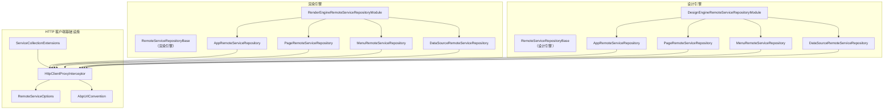
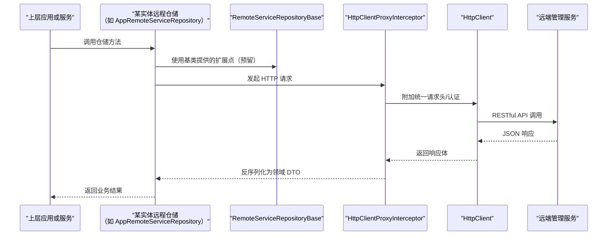
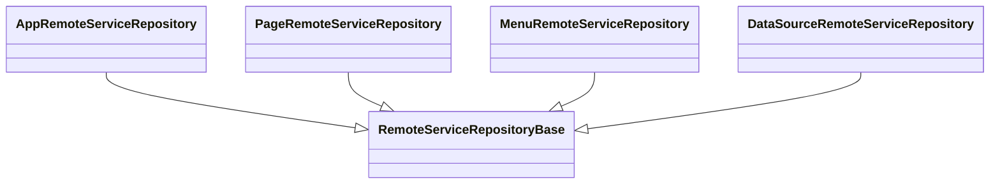
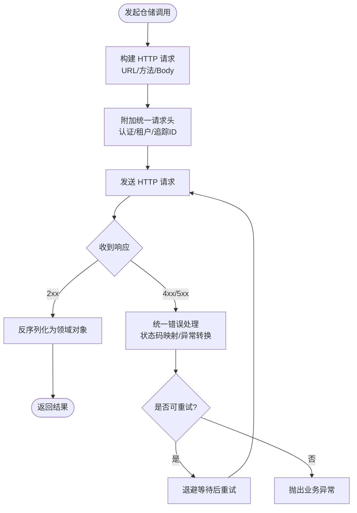
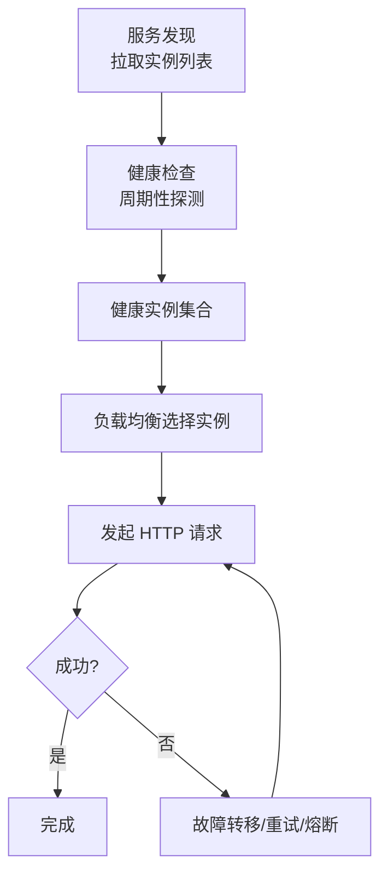
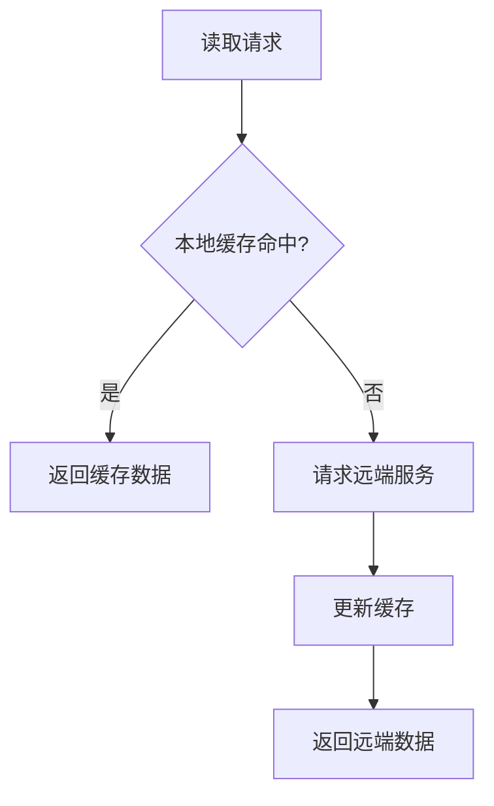
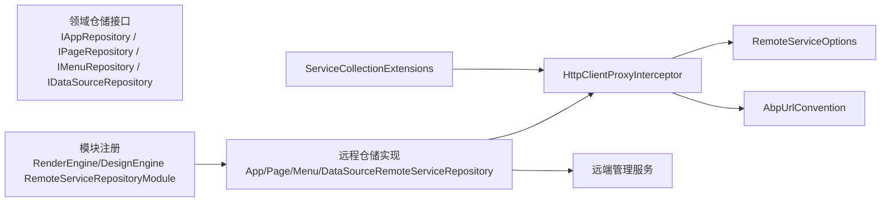

# RemoteService 远程服务仓储

<cite>
**本文引用的文件**   
- [RemoteServiceRepositoryBase.cs（渲染引擎）](file://src/LowCode/RenderEngine/H.LowCode.RenderEngine.Repository.RemoteService/Base/RemoteServiceRepositoryBase.cs)
- [RemoteServiceRepositoryBase.cs（设计引擎）](file://src/LowCode/DesignEngine/H.LowCode.DesignEngine.Repository.RemoteService/Base/RemoteServiceRepositoryBase.cs)
- [RenderEngineRemoteServiceRepositoryModule.cs](file://src/LowCode/RenderEngine/H.LowCode.RenderEngine.Repository.RemoteService/RenderEngineRemoteServiceRepositoryModule.cs)
- [DesignEngineRemoteServiceRepositoryModule.cs](file://src/LowCode/DesignEngine/H.LowCode.DesignEngine.Repository.RemoteService/DesignEngineRemoteServiceRepositoryModule.cs)
- [AppRemoteServiceRepository.cs（渲染引擎）](file://src/LowCode/RenderEngine/H.LowCode.RenderEngine.Repository.RemoteService/Repositories/AppRemoteServiceRepository.cs)
- [PageRemoteServiceRepository.cs（渲染引擎）](file://src/LowCode/RenderEngine/H.LowCode.RenderEngine.Repository.RemoteService/Repositories/PageRemoteServiceRepository.cs)
- [MenuRemoteServiceRepository.cs（渲染引擎）](file://src/LowCode/RenderEngine/H.LowCode.RenderEngine.Repository.RemoteService/Repositories/MenuRemoteServiceRepository.cs)
- [DataSourceRemoteServiceRepository.cs（渲染引擎）](file://src/LowCode/RenderEngine/H.LowCode.RenderEngine.Repository.RemoteService/Repositories/DataSourceRemoteServiceRepository.cs)
- [AppRemoteServiceRepository.cs（设计引擎）](file://src/LowCode/DesignEngine/H.LowCode.DesignEngine.Repository.RemoteService/Repositories/AppRemoteServiceRepository.cs)
- [PageRemoteServiceRepository.cs（设计引擎）](file://src/LowCode/DesignEngine/H.LowCode.DesignEngine.Repository.RemoteService/Repositories/PageRemoteServiceRepository.cs)
- [MenuRemoteServiceRepository.cs（设计引擎）](file://src/LowCode/DesignEngine/H.LowCode.DesignEngine.Repository.RemoteService/Repositories/MenuRemoteServiceRepository.cs)
- [DataSourceRemoteServiceRepository.cs（设计引擎）](file://src/LowCode/DesignEngine/H.LowCode.DesignEngine.Repository.RemoteService/Repositories/DataSourceRemoteServiceRepository.cs)
- [RemoteServiceOptions.cs](file://src/Utils/H.Abp.HttpClientProxy/RemoteServiceOptions.cs)
- [HttpClientProxyInterceptor.cs](file://src/Utils/H.Abp.HttpClientProxy/HttpClientProxyInterceptor.cs)
- [AbpUrlConvention.cs](file://src/Utils/H.Abp.HttpClientProxy/AbpUrlConvention.cs)
- [ServiceCollectionExtensions.cs](file://src/Utils/H.Abp.HttpClientProxy/ServiceCollectionExtensions.cs)
</cite>

## 目录
1. [引言](#引言)
2. [项目结构](#项目结构)
3. [核心组件](#核心组件)
4. [架构总览](#架构总览)
5. [详细组件分析](#详细组件分析)
6. [依赖关系分析](#依赖关系分析)
7. [性能与可靠性](#性能与可靠性)
8. [配置示例](#配置示例)
9. [故障排查指南](#故障排查指南)
10. [结论](#结论)

## 引言
本文件面向 RemoteService 远程服务仓储，聚焦以下目标：
- 解释 RemoteServiceRepositoryBase 基类在渲染引擎与设计引擎中的定位与作用。
- 说明各实体远程仓储的职责边界：应用、页面、菜单、数据源。
- 梳理网络通信机制：HTTP 客户端封装、统一请求头、认证令牌传递、RESTful API 约定、JSON 序列化、超时与重试。
- 给出负载均衡策略建议：多实例发现、健康检查、故障转移。
- 说明缓存策略：本地缓存与远端同步、失效机制与一致性保证。
- 提供 appsettings.json 配置示例：远端地址、超时、重试、认证信息。
- 完善错误处理与降级策略、熔断器模式、监控诊断与安全注意事项。

需要特别说明：当前仓库中两个版本的 RemoteServiceRepositoryBase 均为空抽象基类，具体 HTTP 调用逻辑由 HttpClient 代理拦截器与仓储实现类协作完成；负载均衡、熔断、缓存等能力以“扩展点”形式存在，可结合 ABP 的 HttpClient 代理与外部组件实现。

## 项目结构
RemoteService 远程服务仓储分布在低代码“渲染引擎”和“设计引擎”两个领域模块中，分别通过 ABP 模块化方式将远程仓储注入到各自领域接口。



图表来源
- [RenderEngineRemoteServiceRepositoryModule.cs:7-18](file://src/LowCode/RenderEngine/H.LowCode.RenderEngine.Repository.RemoteService/RenderEngineRemoteServiceRepositoryModule.cs#L7-L18)
- [DesignEngineRemoteServiceRepositoryModule.cs:7-18](file://src/LowCode/DesignEngine/H.LowCode.DesignEngine.Repository.RemoteService/DesignEngineRemoteServiceRepositoryModule.cs#L7-L18)
- [RemoteServiceRepositoryBase.cs（渲染引擎）:1-5](file://src/LowCode/RenderEngine/H.LowCode.RenderEngine.Repository.RemoteService/Base/RemoteServiceRepositoryBase.cs#L1-L5)
- [RemoteServiceRepositoryBase.cs（设计引擎）:1-5](file://src/LowCode/DesignEngine/H.LowCode.DesignEngine.Repository.RemoteService/Base/RemoteServiceRepositoryBase.cs#L1-L5)
- [HttpClientProxyInterceptor.cs](file://src/Utils/H.Abp.HttpClientProxy/HttpClientProxyInterceptor.cs)
- [RemoteServiceOptions.cs](file://src/Utils/H.Abp.HttpClientProxy/RemoteServiceOptions.cs)
- [AbpUrlConvention.cs](file://src/Utils/H.Abp.HttpClientProxy/AbpUrlConvention.cs)
- [ServiceCollectionExtensions.cs](file://src/Utils/H.Abp.HttpClientProxy/ServiceCollectionExtensions.cs)

章节来源
- [RenderEngineRemoteServiceRepositoryModule.cs:7-18](file://src/LowCode/RenderEngine/H.LowCode.RenderEngine.Repository.RemoteService/RenderEngineRemoteServiceRepositoryModule.cs#L7-L18)
- [DesignEngineRemoteServiceRepositoryModule.cs:7-18](file://src/LowCode/DesignEngine/H.LowCode.DesignEngine.Repository.RemoteService/DesignEngineRemoteServiceRepositoryModule.cs#L7-L18)

## 核心组件
- RemoteServiceRepositoryBase（渲染引擎/设计引擎）
  - 作用：作为各实体远程仓储的抽象基类，目前为占位抽象类，便于未来抽取公共 HTTP 访问逻辑、认证注入、日志埋点等横切关注点。
  - 现状：两个版本均为空抽象类，不约束子类行为，也不提供默认实现。
- 远程仓储实现
  - AppRemoteServiceRepository：负责通过远端应用管理服务获取或维护应用元数据。
  - PageRemoteServiceRepository：负责通过远端页面管理服务获取或维护页面元数据。
  - MenuRemoteServiceRepository：负责通过远端菜单管理服务获取或维护菜单元数据。
  - DataSourceRemoteServiceRepository：负责通过远端数据源管理服务获取或维护数据源配置。
- HTTP 客户端代理与配置
  - HttpClientProxyInterceptor：拦截 ABP 生成的 HttpClient 代理调用，用于统一设置请求头、鉴权、序列化、异常转换等。
  - RemoteServiceOptions：集中承载远端服务的地址、超时、重试、认证等配置项。
  - AbpUrlConvention：定义 URL 约定，使仓储方法签名与远端 RESTful API 路径保持一致。
  - ServiceCollectionExtensions：扩展 DI 注册，把 HttpClient 代理、拦截器、选项绑定装配到容器。

章节来源
- [RemoteServiceRepositoryBase.cs（渲染引擎）:1-5](file://src/LowCode/RenderEngine/H.LowCode.RenderEngine.Repository.RemoteService/Base/RemoteServiceRepositoryBase.cs#L1-L5)
- [RemoteServiceRepositoryBase.cs（设计引擎）:1-5](file://src/LowCode/DesignEngine/H.LowCode.DesignEngine.Repository.RemoteService/Base/RemoteServiceRepositoryBase.cs#L1-L5)
- [RemoteServiceOptions.cs](file://src/Utils/H.Abp.HttpClientProxy/RemoteServiceOptions.cs)
- [HttpClientProxyInterceptor.cs](file://src/Utils/H.Abp.HttpClientProxy/HttpClientProxyInterceptor.cs)
- [AbpUrlConvention.cs](file://src/Utils/H.Abp.HttpClientProxy/AbpUrlConvention.cs)
- [ServiceCollectionExtensions.cs](file://src/Utils/H.Abp.HttpClientProxy/ServiceCollectionExtensions.cs)

## 架构总览
RemoteService 仓储层采用“ABP 模块化 + HttpClient 代理拦截”的方式，将领域仓储接口映射到远端微服务。整体流程如下：



图表来源
- [RenderEngineRemoteServiceRepositoryModule.cs:7-18](file://src/LowCode/RenderEngine/H.LowCode.RenderEngine.Repository.RemoteService/RenderEngineRemoteServiceRepositoryModule.cs#L7-L18)
- [HttpClientProxyInterceptor.cs](file://src/Utils/H.Abp.HttpClientProxy/HttpClientProxyInterceptor.cs)
- [RemoteServiceRepositoryBase.cs（渲染引擎）:1-5](file://src/LowCode/RenderEngine/H.LowCode.RenderEngine.Repository.RemoteService/Base/RemoteServiceRepositoryBase.cs#L1-L5)

## 详细组件分析

### RemoteServiceRepositoryBase 基类架构
- 当前实现为空的抽象类，位于渲染引擎和设计引擎各自的命名空间下，避免跨领域耦合。
- 扩展方向建议：
  - 封装 HttpClient 代理创建与复用。
  - 统一设置 Accept/Content-Type、租户上下文、追踪 ID。
  - 统一认证令牌注入（Authorization 头）。
  - 统一异常包装与错误码映射。
  - 统一指标上报（耗时、成功失败计数）。



图表来源
- [RemoteServiceRepositoryBase.cs（渲染引擎）:1-5](file://src/LowCode/RenderEngine/H.LowCode.RenderEngine.Repository.RemoteService/Base/RemoteServiceRepositoryBase.cs#L1-L5)
- [AppRemoteServiceRepository.cs（渲染引擎）](file://src/LowCode/RenderEngine/H.LowCode.RenderEngine.Repository.RemoteService/Repositories/AppRemoteServiceRepository.cs)
- [PageRemoteServiceRepository.cs（渲染引擎）](file://src/LowCode/RenderEngine/H.LowCode.RenderEngine.Repository.RemoteService/Repositories/PageRemoteServiceRepository.cs)
- [MenuRemoteServiceRepository.cs（渲染引擎）](file://src/LowCode/RenderEngine/H.LowCode.RenderEngine.Repository.RemoteService/Repositories/MenuRemoteServiceRepository.cs)
- [DataSourceRemoteServiceRepository.cs（渲染引擎）](file://src/LowCode/RenderEngine/H.LowCode.RenderEngine.Repository.RemoteService/Repositories/DataSourceRemoteServiceRepository.cs)

章节来源
- [RemoteServiceRepositoryBase.cs（渲染引擎）:1-5](file://src/LowCode/RenderEngine/H.LowCode.RenderEngine.Repository.RemoteService/Base/RemoteServiceRepositoryBase.cs#L1-L5)
- [RemoteServiceRepositoryBase.cs（设计引擎）:1-5](file://src/LowCode/DesignEngine/H.LowCode.DesignEngine.Repository.RemoteService/Base/RemoteServiceRepositoryBase.cs#L1-L5)

### 各实体远程仓储职责
- AppRemoteServiceRepository
  - 对接远端应用管理服务，提供应用的查询、创建、更新、删除等操作。
  - 通常对应 /api/app-service/apps 之类的 REST 资源。
- PageRemoteServiceRepository
  - 对接远端页面管理服务，提供页面元数据的读写。
  - 通常对应 /api/page-service/pages。
- MenuRemoteServiceRepository
  - 对接远端菜单管理服务，提供菜单树结构的读取与更新。
  - 通常对应 /api/menu-service/menus。
- DataSourceRemoteServiceRepository
  - 对接远端数据源管理服务，提供连接串、驱动、测试连通性等功能。
  - 通常对应 /api/datasource-service/data-sources。

这些仓储通过 RenderEngineRemoteServiceRepositoryModule 或 DesignEngineRemoteServiceRepositoryModule 注册到 DI 容器，替代本地存储或其他实现。

章节来源
- [RenderEngineRemoteServiceRepositoryModule.cs:7-18](file://src/LowCode/RenderEngine/H.LowCode.RenderEngine.Repository.RemoteService/RenderEngineRemoteServiceRepositoryModule.cs#L7-L18)
- [DesignEngineRemoteServiceRepositoryModule.cs:7-18](file://src/LowCode/DesignEngine/H.LowCode.DesignEngine.Repository.RemoteService/DesignEngineRemoteServiceRepositoryModule.cs#L7-L18)

### 网络通信机制
- HTTP 客户端封装
  - 通过 ABP 的 HttpClient 代理生成仓储的 HTTP 客户端，并由 HttpClientProxyInterceptor 统一拦截。
  - 拦截器可注入统一请求头、认证令牌、链路追踪标识。
- 统一请求头与认证令牌
  - Authorization：Bearer Token。
  - X-Tenant-Id：多租户场景下的租户上下文。
  - X-Trace-Id：分布式链路追踪。
- RESTful API 约定
  - 使用 AbpUrlConvention 将仓储方法映射到远端控制器路由。
  - 典型约定：GET /{resource}/{id}、POST /{resource}、PUT /{resource}/{id}、DELETE /{resource}/{id}。
- JSON 序列化
  - 请求体与响应体均使用 JSON 格式，由 HttpClient 序列化器处理。
- 超时与重试
  - 通过 RemoteServiceOptions 配置请求超时时间、重试次数、退避策略等。
  - 建议在拦截器中根据配置执行幂等 GET/HEAD 请求的重试。



图表来源
- [HttpClientProxyInterceptor.cs](file://src/Utils/H.Abp.HttpClientProxy/HttpClientProxyInterceptor.cs)
- [RemoteServiceOptions.cs](file://src/Utils/H.Abp.HttpClientProxy/RemoteServiceOptions.cs)
- [AbpUrlConvention.cs](file://src/Utils/H.Abp.HttpClientProxy/AbpUrlConvention.cs)

章节来源
- [HttpClientProxyInterceptor.cs](file://src/Utils/H.Abp.HttpClientProxy/HttpClientProxyInterceptor.cs)
- [RemoteServiceOptions.cs](file://src/Utils/H.Abp.HttpClientProxy/RemoteServiceOptions.cs)
- [AbpUrlConvention.cs](file://src/Utils/H.Abp.HttpClientProxy/AbpUrlConvention.cs)

### 负载均衡策略
当前仓库未内置多实例发现与健康检查的具体实现，但可通过以下方式扩展：
- 多实例发现
  - 通过服务注册中心（Consul/Nacos/Kubernetes Service）动态拉取后端实例列表。
  - 将实例列表注入到自定义负载均衡器。
- 健康检查
  - 对每个实例进行周期性的 /health 探测，剔除不健康节点。
- 故障转移
  - 当某个实例失败时，自动切换到其他健康实例。
  - 结合重试与熔断，避免雪崩。



（本图为概念图，不直接映射具体源码文件）

### 缓存策略
- 本地缓存与远端同步
  - 对于读多写少的元数据（如菜单、页面模板），可在仓储层引入本地内存缓存。
  - 首次读取从远端加载并写入缓存；后续命中缓存，降低远端压力。
- 缓存失效机制
  - 基于版本号或更新时间戳进行失效判断。
  - 支持主动失效：当远端发生更新时，通知客户端清除缓存。
- 一致性保证
  - 强一致场景：每次读取都回源校验。
  - 最终一致场景：允许短暂不一致，设置合理 TTL。



（本图为概念图，不直接映射具体源码文件）

## 依赖关系分析
远程仓储依赖 ABP 的模块化与 HttpClient 代理基础设施，同时依赖各远端管理服务。



图表来源
- [RenderEngineRemoteServiceRepositoryModule.cs:7-18](file://src/LowCode/RenderEngine/H.LowCode.RenderEngine.Repository.RemoteService/RenderEngineRemoteServiceRepositoryModule.cs#L7-L18)
- [DesignEngineRemoteServiceRepositoryModule.cs:7-18](file://src/LowCode/DesignEngine/H.LowCode.DesignEngine.Repository.RemoteService/DesignEngineRemoteServiceRepositoryModule.cs#L7-L18)
- [HttpClientProxyInterceptor.cs](file://src/Utils/H.Abp.HttpClientProxy/HttpClientProxyInterceptor.cs)
- [RemoteServiceOptions.cs](file://src/Utils/H.Abp.HttpClientProxy/RemoteServiceOptions.cs)
- [AbpUrlConvention.cs](file://src/Utils/H.Abp.HttpClientProxy/AbpUrlConvention.cs)
- [ServiceCollectionExtensions.cs](file://src/Utils/H.Abp.HttpClientProxy/ServiceCollectionExtensions.cs)

章节来源
- [RenderEngineRemoteServiceRepositoryModule.cs:7-18](file://src/LowCode/RenderEngine/H.LowCode.RenderEngine.Repository.RemoteService/RenderEngineRemoteServiceRepositoryModule.cs#L7-L18)
- [DesignEngineRemoteServiceRepositoryModule.cs:7-18](file://src/LowCode/DesignEngine/H.LowCode.DesignEngine.Repository.RemoteService/DesignEngineRemoteServiceRepositoryModule.cs#L7-L18)
- [HttpClientProxyInterceptor.cs](file://src/Utils/H.Abp.HttpClientProxy/HttpClientProxyInterceptor.cs)
- [RemoteServiceOptions.cs](file://src/Utils/H.Abp.HttpClientProxy/RemoteServiceOptions.cs)
- [AbpUrlConvention.cs](file://src/Utils/H.Abp.HttpClientProxy/AbpUrlConvention.cs)
- [ServiceCollectionExtensions.cs](file://src/Utils/H.Abp.HttpClientProxy/ServiceCollectionExtensions.cs)

## 性能与可靠性
- 性能优化
  - 复用 HttpClient：通过 ABP 的 HttpClient 代理管理连接池，避免频繁建立连接。
  - 压缩传输：启用 gzip/deflate 以减少 JSON 体积。
  - 批量操作：对菜单、页面等可批量查询的场景，减少往返次数。
- 可靠性增强
  - 重试策略：对瞬态错误（如 503、网络抖动）进行有限次重试。
  - 熔断保护：连续失败后快速失败，避免拖垮上游。
  - 降级策略：远端不可用时返回本地缓存或默认值，保障基本功能可用。
- 监控与诊断
  - 请求链路追踪：注入 TraceId，贯穿仓储到远端服务。
  - 指标采集：记录请求耗时、成功率、错误类型分布。
  - 错误日志：记录异常堆栈、请求摘要、远端状态码。

（本节为通用指导，不直接分析具体源码文件）

## 配置示例
以下示例展示如何在 appsettings.json 中配置远端服务地址、超时、重试、认证信息。实际键名请根据 RemoteServiceOptions 的定义进行调整。

```json
{
  "RemoteServices": {
    "Default": {
      "BaseUrl": "https://lowcode-services.example.com",
      "TimeOut": 30,
      "RetryCount": 2,
      "RetryDelayMs": 500,
      "Authentication": {
        "Type": "Bearer",
        "TokenUrl": "https://auth.example.com/oauth/token",
        "ClientId": "lowcode-client",
        "ClientSecret": "your-secret",
        "Scopes": ["lowcode.read", "lowcode.write"]
      },
      "Caching": {
        "Enabled": true,
        "TtlSeconds": 300,
        "InvalidateOnWrite": true
      }
    }
  }
}
```

说明：
- BaseUrl：远端服务根地址。
- TimeOut：单次请求超时秒数。
- RetryCount/RetryDelayMs：重试次数与间隔。
- Authentication：认证方式与凭据。
- Caching：缓存开关、TTL、写操作后失效。

章节来源
- [RemoteServiceOptions.cs](file://src/Utils/H.Abp.HttpClientProxy/RemoteServiceOptions.cs)

## 故障排查指南
- 网络异常
  - 现象：连接超时、DNS 解析失败。
  - 排查：检查 BaseUrl、网络连通性、代理配置。
  - 处理：开启重试、切换备用地址。
- HTTP 状态码
  - 401/403：认证失败或权限不足。检查 Token 有效性、Scope。
  - 404：资源不存在或路由不匹配。核对 AbpUrlConvention 与方法签名。
  - 5xx：服务端异常。查看远端日志，触发熔断与降级。
- 服务降级
  - 启用本地缓存返回旧数据，保障 UI 可浏览。
  - 对非关键写操作拒绝执行并提示用户。
- 熔断器模式
  - 连续失败超过阈值后进入熔断，一段时间内直接失败，降低下游压力。
  - 半开状态尝试少量请求验证恢复情况。
- 监控与诊断
  - 收集链路追踪 ID，配合远端服务日志定位问题。
  - 记录关键指标：QPS、延迟、错误率、熔断状态。
  - 告警：超时率、错误率、熔断触发。

（本节为通用指导，不直接分析具体源码文件）

## 结论
RemoteService 远程服务仓储通过 ABP 模块化将渲染引擎与设计引擎的领域仓储接口映射到远端管理服务，借助 HttpClientProxyInterceptor 实现统一的请求头、认证、序列化与错误处理。当前 RemoteServiceRepositoryBase 为扩展预留的空基类，实际 HTTP 调用由仓储实现与拦截器协作完成。生产环境建议补充服务发现、健康检查、负载均衡、熔断降级与缓存一致性策略，并完善监控与审计，以提升系统的稳定性、可观测性与安全性。