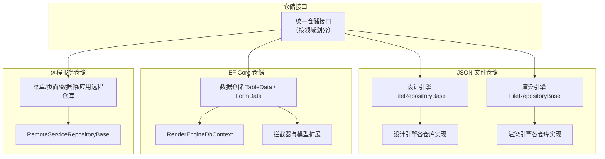
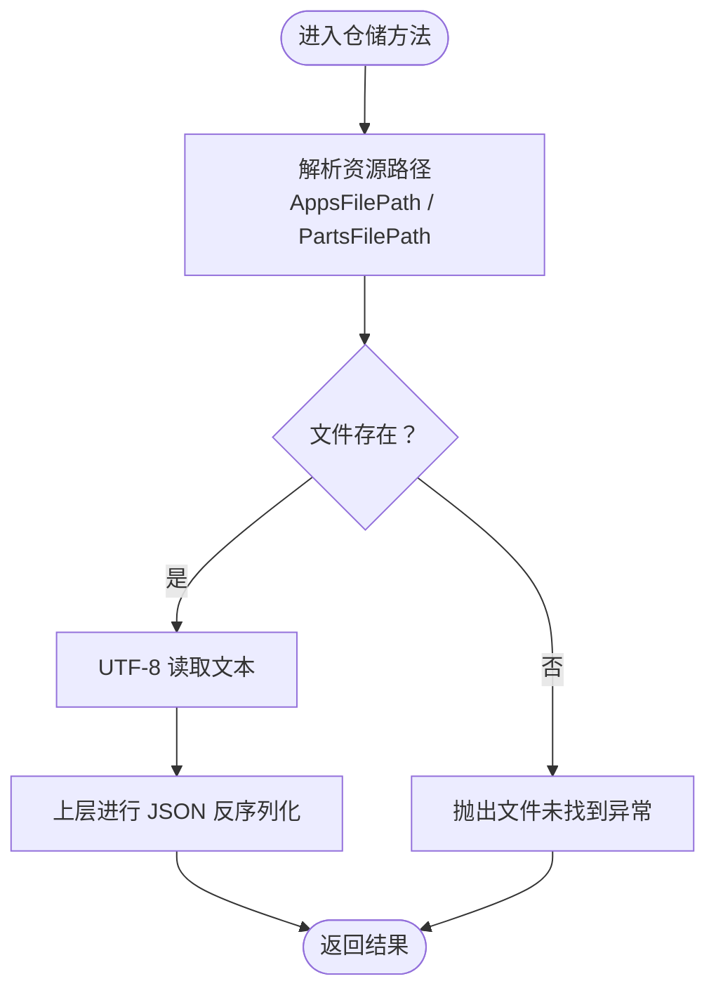
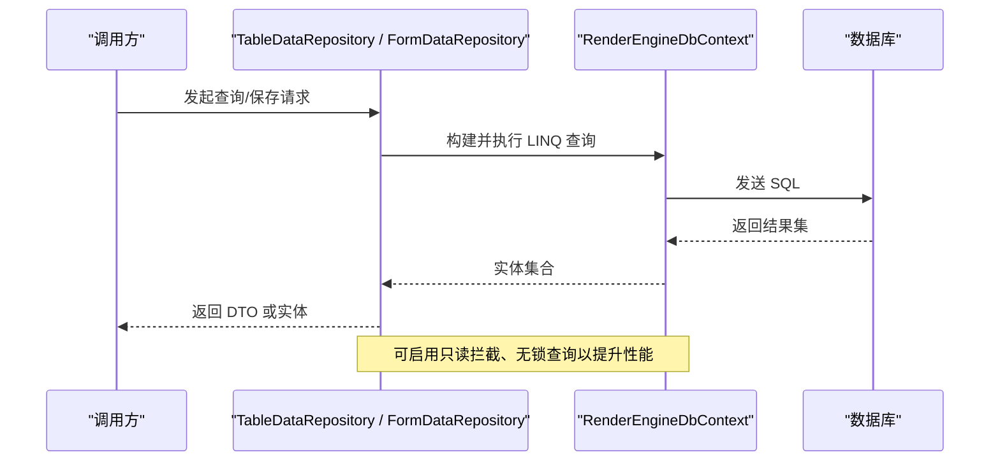
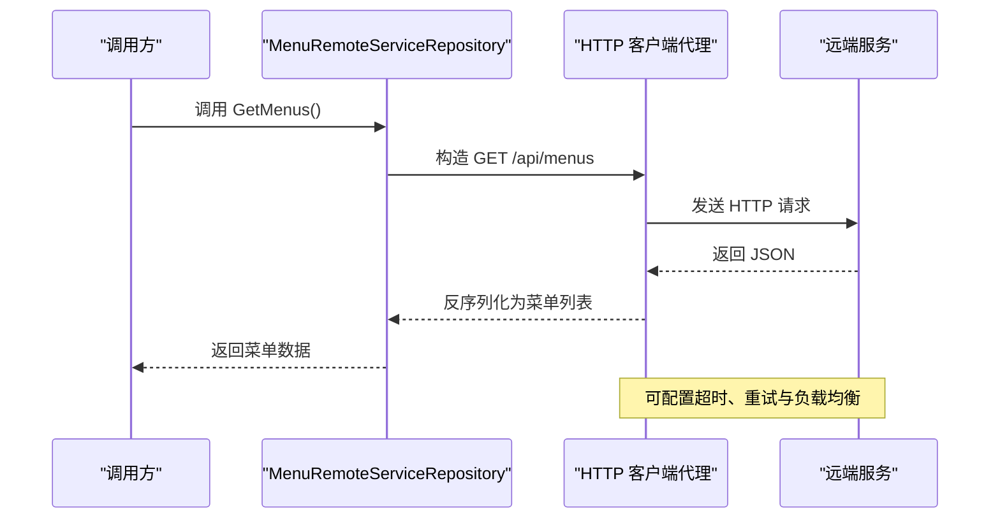
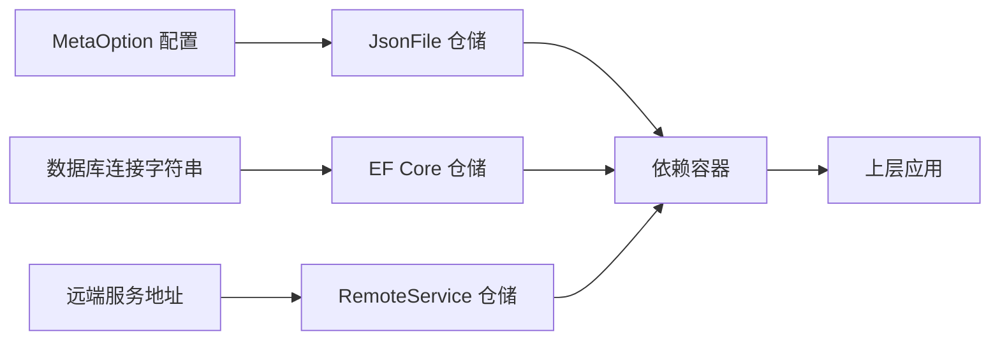

# 数据存储仓储

<cite>
**本文引用的文件**
- [FileRepositoryBase.cs](file://src/LowCode/DesignEngine/H.LowCode.DesignEngine.Repository.JsonFile/Base/FileRepositoryBase.cs)
- [PartsFileRepositoryBase.cs](file://src/LowCode/DesignEngine/H.LowCode.DesignEngine.Repository.JsonFile/Base/PartsFileRepositoryBase.cs)
- [MenuFileRepository.cs](file://src/LowCode/DesignEngine/H.LowCode.DesignEngine.Repository.JsonFile/Repositories/MenuFileRepository.cs)
- [AppFileRepository.cs](file://src/LowCode/DesignEngine/H.LowCode.DesignEngine.Repository.JsonFile/Repositories/AppFileRepository.cs)
- [PageFileRepository.cs](file://src/LowCode/DesignEngine/H.LowCode.DesignEngine.Repository.JsonFile/Repositories/PageFileRepository.cs)
- [DataSourceFileRepository.cs](file://src/LowCode/DesignEngine/H.LowCode.DesignEngine.Repository.JsonFile/Repositories/DataSourceFileRepository.cs)
- [AppPublishFileRepository.cs](file://src/LowCode/DesignEngine/H.LowCode.DesignEngine.Repository.JsonFile/Repositories/AppPublishFileRepository.cs)
- [AppRbacFileRepository.cs](file://src/LowCode/DesignEngine/H.LowCode.DesignEngine.Repository.JsonFile/Repositories/AppRbacFileRepository.cs)
- [AppTemplateFileRepository.cs](file://src/LowCode/DesignEngine/H.LowCode.DesignEngine.Repository.JsonFile/PartsRepositories/AppTemplateFileRepository.cs)
- [PageTemplateRepository.cs](file://src/LowCode/DesignEngine/H.LowCode.DesignEngine.Repository.JsonFile/PartsRepositories/PageTemplateRepository.cs)
- [ComponentPartsRepository.cs](file://src/LowCode/DesignEngine/H.LowCode.DesignEngine.Repository.JsonFile/PartsRepositories/ComponentPartsRepository.cs)
- [ComponentLibraryRepository.cs](file://src/LowCode/DesignEngine/H.LowCode.DesignEngine.Repository.JsonFile/PartsRepositories/ComponentLibraryRepository.cs)
- [DesignEngineJsonFileRepositoryModule.cs](file://src/LowCode/DesignEngine/H.LowCode.DesignEngine.Repository.JsonFile/DesignEngineJsonFileRepositoryModule.cs)
- [RenderEngineJsonFileRepositoryModule.cs](file://src/LowCode/RenderEngine/H.LowCode.RenderEngine.Repository.JsonFile/RenderEngineJsonFileRepositoryModule.cs)
- [RenderEngineDbContext.cs](file://src/LowCode/RenderEngine/H.LowCode.RenderEngine.EntityFrameworkCore/EntityFrameworkCore/RenderEngineDbContext.cs)
- [RenderEngineEntityFrameworkCoreModule.cs](file://src/LowCode/RenderEngine/H.LowCode.RenderEngine.EntityFrameworkCore/RenderEngineEntityFrameworkCoreModule.cs)
- [ReadOnlySaveChangesInterceptor.cs](file://src/LowCode/RenderEngine/H.LowCode.RenderEngine.EntityFrameworkCore/EntityFrameworkCore/Extensions/ReadOnlySaveChangesInterceptor.cs)
- [CustomizeRelationalModelValidator.cs](file://src/LowCode/RenderEngine/H.LowCode.RenderEngine.EntityFrameworkCore/EntityFrameworkCore/Extensions/CustomizeRelationalModelValidator.cs)
- [QueryWithNoLockDbCommandInterceptor.cs](file://src/LowCode/RenderEngine/H.LowCode.RenderEngine.EntityFrameworkCore/EntityFrameworkCore/Extensions/QueryWithNoLockDbCommandInterceptor.cs)
- [RenderEngineModelCacheKeyFactory.cs](file://src/LowCode/RenderEngine/H.LowCode.RenderEngine.EntityFrameworkCore/EntityFrameworkCore/Extensions/RenderEngineModelCacheKeyFactory.cs)
- [TableDataRepository.cs](file://src/LowCode/RenderEngine/H.LowCode.RenderEngine.EntityFrameworkCore/DataRepositories/TableDataRepository.cs)
- [FormDataRepository.cs](file://src/LowCode/RenderEngine/H.LowCode.RenderEngine.EntityFrameworkCore/DataRepositories/FormDataRepository.cs)
- [EntityTypeManager.cs](file://src/LowCode/RenderEngine/H.LowCode.RenderEngine.EntityFrameworkCore/EntityManager/EntityTypeManager.cs)
- [RemoteServiceRepositoryBase.cs](file://src/LowCode/RenderEngine/H.LowCode.RenderEngine.Repository.RemoteService/Base/RemoteServiceRepositoryBase.cs)
- [MenuRemoteServiceRepository.cs](file://src/LowCode/RenderEngine/H.LowCode.RenderEngine.Repository.RemoteService/Repositories/MenuRemoteServiceRepository.cs)
- [PageRemoteServiceRepository.cs](file://src/LowCode/RenderEngine/H.LowCode.RenderEngine.Repository.RemoteService/Repositories/PageRemoteServiceRepository.cs)
- [DataSourceRemoteServiceRepository.cs](file://src/LowCode/RenderEngine/H.LowCode.RenderEngine.Repository.RemoteService/Repositories/DataSourceRemoteServiceRepository.cs)
- [AppRemoteServiceRepository.cs](file://src/LowCode/RenderEngine/H.LowCode.RenderEngine.Repository.RemoteService/Repositories/AppRemoteServiceRepository.cs)
- [RenderEngineRemoteServiceRepositoryModule.cs](file://src/LowCode/RenderEngine/H.LowCode.RenderEngine.Repository.RemoteService/RenderEngineRemoteServiceRepositoryModule.cs)
- [IAppService.cs](file://src/Utils/src/Utils/H.Abp.Application.Contracts/IAppService.cs)
- [ICrudAppService.cs](file://src/Utils/src/Utils/H.Abp.Application.Contracts/ICrudAppService.cs)
- [H.LowCode.DbMigrator.csproj](file://src/Tools/H.LowCode.DbMigrator/H.LowCode.DbMigrator.csproj)
- [DbMigrationService.cs](file://src/Tools/H.LowCode.DbMigrator/DbMigrationService.cs)
- [HostedService.cs](file://src/Tools/H.LowCode.DbMigrator/HostedService.cs)
- [LowCodeDbMigratorModule.cs](file://src/Tools/H.LowCode.DbMigrator/LowCodeDbMigratorModule.cs)
- [appsettings.json](file://src/Tools/H.LowCode.DbMigrator/appsettings.json)
</cite>

## 目录
1. [引言](#引言)
2. [项目结构](#项目结构)
3. [核心组件](#核心组件)
4. [架构总览](#架构总览)
5. [详细组件分析](#详细组件分析)
6. [依赖关系分析](#依赖关系分析)
7. [性能考虑](#性能考虑)
8. [故障排查指南](#故障排查指南)
9. [结论](#结论)
10. [附录：配置与迁移](#附录配置与迁移)

## 引言
本文件为低代码渲染引擎的数据存储仓储层提供完整技术文档。仓储层统一抽象数据访问接口，并提供三种实现：
- JsonFile：本地文件系统存储，适合开发、离线、轻量部署场景。
- EntityFrameworkCore：数据库持久化，适合生产环境、高并发、强一致性与可查询性场景。
- RemoteService：远程服务代理，通过 HTTP 客户端调用远端 API，适合微服务或云原生部署。

仓储层通过统一的模块注册机制装配具体实现，使上层应用对存储后端无感知，便于在运行期切换或组合不同存储策略。

## 项目结构
仓储相关代码分布在三个主要区域：
- 设计引擎 JSON 文件仓储：用于设计期的元数据、模板、发布物等文件读写。
- 渲染引擎 JSON 文件仓储：用于运行期菜单、页面、数据源等资源的文件读取。
- 渲染引擎 EF Core 仓储：将运行时表单数据、表数据持久化到数据库。
- 渲染引擎远程服务仓储：以 HTTP 代理方式访问远端渲染服务。

图表来源
- [FileRepositoryBase.cs:1-27](file://src/LowCode/DesignEngine/H.LowCode.DesignEngine.Repository.JsonFile/Base/FileRepositoryBase.cs#L1-L27)
- [FileRepositoryBase.cs:1-27](file://src/LowCode/RenderEngine/H.LowCode.RenderEngine.Repository.JsonFile/Base/FileRepositoryBase.cs#L1-L27)
- [RenderEngineDbContext.cs](file://src/LowCode/RenderEngine/H.LowCode.RenderEngine.EntityFrameworkCore/EntityFrameworkCore/RenderEngineDbContext.cs)
- [TableDataRepository.cs](file://src/LowCode/RenderEngine/H.LowCode.RenderEngine.EntityFrameworkCore/DataRepositories/TableDataRepository.cs)
- [FormDataRepository.cs](file://src/LowCode/RenderEngine/H.LowCode.RenderEngine.EntityFrameworkCore/DataRepositories/FormDataRepository.cs)
- [RemoteServiceRepositoryBase.cs:1-5](file://src/LowCode/RenderEngine/H.LowCode.RenderEngine.Repository.RemoteService/Base/RemoteServiceRepositoryBase.cs#L1-L5)

章节来源
- [FileRepositoryBase.cs:1-27](file://src/LowCode/DesignEngine/H.LowCode.DesignEngine.Repository.JsonFile/Base/FileRepositoryBase.cs#L1-L27)
- [FileRepositoryBase.cs:1-27](file://src/LowCode/RenderEngine/H.LowCode.RenderEngine.Repository.JsonFile/Base/FileRepositoryBase.cs#L1-L27)

## 核心组件
- 文件仓储基类
  - 设计引擎 FileRepositoryBase：从 MetaOption 获取 AppsFilePath，提供 UTF-8 文本读取辅助方法，并暴露 IsChangeTrackingEnabled 控制变更追踪开关。
  - 部件文件 PartsFileRepositoryBase：面向“部件”资源，基于 PartsFilePath，ReadAllText 在文件不存在时返回 null。
  - 渲染引擎 FileRepositoryBase：对路径执行 Path.GetFullPath 规范化，确保绝对路径语义，同样提供 UTF-8 读取辅助。
- 远程服务仓储基类
  - RemoteServiceRepositoryBase：作为远端代理仓储的抽象基类，具体仓库在其上扩展 HTTP 调用逻辑。
- EF Core 仓储
  - RenderEngineDbContext：定义 EF Core 上下文，承载实体集合与连接字符串。
  - DataRepositories：TableDataRepository、FormDataRepository 封装表数据与表单数据的增删改查。
  - 扩展：自定义模型校验、只读拦截、无锁查询、缓存键工厂等。
- 模块注册
  - DesignEngineJsonFileRepositoryModule、RenderEngineJsonFileRepositoryModule、RenderEngineEntityFrameworkCoreModule、RenderEngineRemoteServiceRepositoryModule 负责仓储与服务注册。

章节来源
- [FileRepositoryBase.cs:1-27](file://src/LowCode/DesignEngine/H.LowCode.DesignEngine.Repository.JsonFile/Base/FileRepositoryBase.cs#L1-L27)
- [PartsFileRepositoryBase.cs:1-26](file://src/LowCode/DesignEngine/H.LowCode.DesignEngine.Repository.JsonFile/Base/PartsFileRepositoryBase.cs#L1-L26)
- [FileRepositoryBase.cs:1-27](file://src/LowCode/RenderEngine/H.LowCode.RenderEngine.Repository.JsonFile/Base/FileRepositoryBase.cs#L1-L27)
- [RemoteServiceRepositoryBase.cs:1-5](file://src/LowCode/RenderEngine/H.LowCode.RenderEngine.Repository.RemoteService/Base/RemoteServiceRepositoryBase.cs#L1-L5)
- [RenderEngineDbContext.cs](file://src/LowCode/RenderEngine/H.LowCode.RenderEngine.EntityFrameworkCore/EntityFrameworkCore/RenderEngineDbContext.cs)
- [TableDataRepository.cs](file://src/LowCode/RenderEngine/H.LowCode.RenderEngine.EntityFrameworkCore/DataRepositories/TableDataRepository.cs)
- [FormDataRepository.cs](file://src/LowCode/RenderEngine/H.LowCode.RenderEngine.EntityFrameworkCore/DataRepositories/FormDataRepository.cs)
- [RenderEngineEntityFrameworkCoreModule.cs](file://src/LowCode/RenderEngine/H.LowCode.RenderEngine.EntityFrameworkCore/RenderEngineEntityFrameworkCoreModule.cs)
- [RenderEngineJsonFileRepositoryModule.cs](file://src/LowCode/RenderEngine/H.LowCode.RenderEngine.Repository.JsonFile/RenderEngineJsonFileRepositoryModule.cs)
- [DesignEngineJsonFileRepositoryModule.cs](file://src/LowCode/DesignEngine/H.LowCode.DesignEngine.Repository.JsonFile/DesignEngineJsonFileRepositoryModule.cs)
- [RenderEngineRemoteServiceRepositoryModule.cs](file://src/LowCode/RenderEngine/H.LowCode.RenderEngine.Repository.RemoteService/RenderEngineRemoteServiceRepositoryModule.cs)

## 架构总览
仓储层采用“接口 + 多实现 + 模块装配”的架构模式：
- 接口层：按业务对象划分仓储接口，如 IPageRepository、IMenuRepository、IAppRepository、IDataSourceRepository 等（由上层应用契约与仓储实现共同约定）。
- 实现层：同一接口可由 JsonFile、EF Core、RemoteService 三类仓储分别实现。
- 装配层：通过 ABP 风格的 Module 将仓储、DbContext、HTTP 客户端、选项配置注入到依赖容器中。

```mermaid
classDiagram
    class FileRepositoryBase {
        +bool? IsChangeTrackingEnabled
        -string _metaBaseDir
        +FileRepositoryBase(metaOption)
        +ReadAllText(fileName) string
    }

    class PartsFileRepositoryBase {
        +bool? IsChangeTrackingEnabled
        -string? _metaBaseDir
        +PartsFileRepositoryBase(metaOption)
        +ReadAllText(fileName) string?
    }

    class RemoteServiceRepositoryBase

    class RenderEngineDbContext

    class TableDataRepository
    class FormDataRepository

    class MenuFileRepository
    class PageFileRepository
    class AppFileRepository
    class DataSourceFileRepository
    class AppPublishFileRepository
    class AppRbacFileRepository
    class AppTemplateFileRepository
    class PageTemplateRepository
    class ComponentPartsRepository
    class ComponentLibraryRepository

    class MenuRemoteServiceRepository
    class PageRemoteServiceRepository
    class DataSourceRemoteServiceRepository
    class AppRemoteServiceRepository

    FileRepositoryBase <|-- MenuFileRepository
    FileRepositoryBase <|-- PageFileRepository
    FileRepositoryBase <|-- AppFileRepository
    FileRepositoryBase <|-- DataSourceFileRepository
    FileRepositoryBase <|-- AppPublishFileRepository
    FileRepositoryBase <|-- AppRbacFileRepository

    PartsFileRepositoryBase <|-- AppTemplateFileRepository
    PartsFileRepositoryBase <|-- PageTemplateRepository
    PartsFileRepositoryBase <|-- ComponentPartsRepository
    PartsFileRepositoryBase <|-- ComponentLibraryRepository

    RemoteServiceRepositoryBase <|-- MenuRemoteServiceRepository
    RemoteServiceRepositoryBase <|-- PageRemoteServiceRepository
    RemoteServiceRepositoryBase <|-- DataSourceRemoteServiceRepository
    RemoteServiceRepositoryBase <|-- AppRemoteServiceRepository

    TableDataRepository --> RenderEngineDbContext : "使用"
    FormDataRepository --> RenderEngineDbContext : "使用"
```

图表来源
- [FileRepositoryBase.cs:1-27](file://src/LowCode/DesignEngine/H.LowCode.DesignEngine.Repository.JsonFile/Base/FileRepositoryBase.cs#L1-L27)
- [PartsFileRepositoryBase.cs:1-26](file://src/LowCode/DesignEngine/H.LowCode.DesignEngine.Repository.JsonFile/Base/PartsFileRepositoryBase.cs#L1-L26)
- [FileRepositoryBase.cs:1-27](file://src/LowCode/RenderEngine/H.LowCode.RenderEngine.Repository.JsonFile/Base/FileRepositoryBase.cs#L1-L27)
- [RemoteServiceRepositoryBase.cs:1-5](file://src/LowCode/RenderEngine/H.LowCode.RenderEngine.Repository.RemoteService/Base/RemoteServiceRepositoryBase.cs#L1-L5)
- [RenderEngineDbContext.cs](file://src/LowCode/RenderEngine/H.LowCode.RenderEngine.EntityFrameworkCore/EntityFrameworkCore/RenderEngineDbContext.cs)
- [TableDataRepository.cs](file://src/LowCode/RenderEngine/H.LowCode.RenderEngine.EntityFrameworkCore/DataRepositories/TableDataRepository.cs)
- [FormDataRepository.cs](file://src/LowCode/RenderEngine/H.LowCode.RenderEngine.EntityFrameworkCore/DataRepositories/FormDataRepository.cs)
- [MenuFileRepository.cs](file://src/LowCode/DesignEngine/H.LowCode.DesignEngine.Repository.JsonFile/Repositories/MenuFileRepository.cs)
- [PageFileRepository.cs](file://src/LowCode/DesignEngine/H.LowCode.DesignEngine.Repository.JsonFile/Repositories/PageFileRepository.cs)
- [AppFileRepository.cs](file://src/LowCode/DesignEngine/H.LowCode.DesignEngine.Repository.JsonFile/Repositories/AppFileRepository.cs)
- [DataSourceFileRepository.cs](file://src/LowCode/DesignEngine/H.LowCode.DesignEngine.Repository.JsonFile/Repositories/DataSourceFileRepository.cs)
- [AppPublishFileRepository.cs](file://src/LowCode/DesignEngine/H.LowCode.DesignEngine.Repository.JsonFile/Repositories/AppPublishFileRepository.cs)
- [AppRbacFileRepository.cs](file://src/LowCode/DesignEngine/H.LowCode.DesignEngine.Repository.JsonFile/Repositories/AppRbacFileRepository.cs)
- [AppTemplateFileRepository.cs](file://src/LowCode/DesignEngine/H.LowCode.DesignEngine.Repository.JsonFile/PartsRepositories/AppTemplateFileRepository.cs)
- [PageTemplateRepository.cs](file://src/LowCode/DesignEngine/H.LowCode.DesignEngine.Repository.JsonFile/PartsRepositories/PageTemplateRepository.cs)
- [ComponentPartsRepository.cs](file://src/LowCode/DesignEngine/H.LowCode.DesignEngine.Repository.JsonFile/PartsRepositories/ComponentPartsRepository.cs)
- [ComponentLibraryRepository.cs](file://src/LowCode/DesignEngine/H.LowCode.DesignEngine.Repository.JsonFile/PartsRepositories/ComponentLibraryRepository.cs)
- [MenuRemoteServiceRepository.cs](file://src/LowCode/RenderEngine/H.LowCode.RenderEngine.Repository.RemoteService/Repositories/MenuRemoteServiceRepository.cs)
- [PageRemoteServiceRepository.cs](file://src/LowCode/RenderEngine/H.LowCode.RenderEngine.Repository.RemoteService/Repositories/PageRemoteServiceRepository.cs)
- [DataSourceRemoteServiceRepository.cs](file://src/LowCode/RenderEngine/H.LowCode.RenderEngine.Repository.RemoteService/Repositories/DataSourceRemoteServiceRepository.cs)
- [AppRemoteServiceRepository.cs](file://src/LowCode/RenderEngine/H.LowCode.RenderEngine.Repository.RemoteService/Repositories/AppRemoteServiceRepository.cs)

## 详细组件分析

### JsonFile 本地文件仓储
职责与边界
- 通过 MetaOption.AppsFilePath 与 PartsFilePath 定位资源根目录。
- 所有文件操作均以 UTF-8 编码读写 JSON 文本。
- 暴露 IsChangeTrackingEnabled 以关闭变更追踪，避免在纯只读场景引入额外开销。

路径规划
- 设计引擎与渲染引擎各自维护独立的基类，但都遵循“根目录 + 业务子目录 + 资源文件名”的路径约定。
- 渲染引擎对路径执行 Path.GetFullPath 规范化，确保跨平台一致性。

序列化与反序列化
- 通过 ReadAllText 读取 JSON 文本；实际序列化/反序列化由上层应用或服务完成，仓储层专注 IO 与路径管理。

并发安全
- 当前基类未内置文件锁。若需并发写保护，应在具体仓库实现中引入进程级或文件级互斥（例如通过命名同步原语或独占写入锁），并在异常分支中保证锁释放。

错误处理
- 文件不存在时抛出 FileNotFoundException，调用方应捕获并转换为仓储层统一异常或错误码。

图表来源
- [FileRepositoryBase.cs:1-27](file://src/LowCode/RenderEngine/H.LowCode.RenderEngine.Repository.JsonFile/Base/FileRepositoryBase.cs#L1-L27)
- [FileRepositoryBase.cs:1-27](file://src/LowCode/DesignEngine/H.LowCode.DesignEngine.Repository.JsonFile/Base/FileRepositoryBase.cs#L1-L27)
- [PartsFileRepositoryBase.cs:1-26](file://src/LowCode/DesignEngine/H.LowCode.DesignEngine.Repository.JsonFile/Base/PartsFileRepositoryBase.cs#L1-L26)

章节来源
- [FileRepositoryBase.cs:1-27](file://src/LowCode/DesignEngine/H.LowCode.DesignEngine.Repository.JsonFile/Base/FileRepositoryBase.cs#L1-L27)
- [FileRepositoryBase.cs:1-27](file://src/LowCode/RenderEngine/H.LowCode.RenderEngine.Repository.JsonFile/Base/FileRepositoryBase.cs#L1-L27)
- [PartsFileRepositoryBase.cs:1-26](file://src/LowCode/DesignEngine/H.LowCode.DesignEngine.Repository.JsonFile/Base/PartsFileRepositoryBase.cs#L1-L26)

### EntityFrameworkCore 数据库仓储
职责与边界
- RenderEngineDbContext 提供实体集合与数据库连接。
- TableDataRepository、FormDataRepository 封装复杂查询、分页、排序与事务边界。
- 扩展模块提供模型校验、只读优化、无锁查询、缓存键生成等能力。

DbContext 配置
- 通过 RenderEngineEntityFrameworkCoreModule 注册 DbContext、拦截器、模型验证器与缓存键工厂。
- 连接字符串通常由宿主应用配置注入，具体值位于工具项目的 appsettings.json 示例中。

实体映射
- 实体类型通过 EF Core 约定或 Fluent API 映射到数据库表结构，动态实体类型管理由 EntityTypeManager 支撑。

查询构建
- 仓储内部使用 LINQ 与表达式树构建查询，结合分页参数与排序规则，必要时使用 NoLock 提升只读查询吞吐。

事务与并发
- 仓储方法可在需要时开启事务；并发控制建议结合行版本字段与 EF Core 并发检测，或在特定场景下使用乐观锁策略。

图表来源
- [TableDataRepository.cs](file://src/LowCode/RenderEngine/H.LowCode.RenderEngine.EntityFrameworkCore/DataRepositories/TableDataRepository.cs)
- [FormDataRepository.cs](file://src/LowCode/RenderEngine/H.LowCode.RenderEngine.EntityFrameworkCore/DataRepositories/FormDataRepository.cs)
- [RenderEngineDbContext.cs](file://src/LowCode/RenderEngine/H.LowCode.RenderEngine.EntityFrameworkCore/EntityFrameworkCore/RenderEngineDbContext.cs)
- [ReadOnlySaveChangesInterceptor.cs](file://src/LowCode/RenderEngine/H.LowCode.RenderEngine.EntityFrameworkCore/EntityFrameworkCore/Extensions/ReadOnlySaveChangesInterceptor.cs)
- [QueryWithNoLockDbCommandInterceptor.cs](file://src/LowCode/RenderEngine/H.LowCode.RenderEngine.EntityFrameworkCore/EntityFrameworkCore/Extensions/QueryWithNoLockDbCommandInterceptor.cs)

章节来源
- [RenderEngineDbContext.cs](file://src/LowCode/RenderEngine/H.LowCode.RenderEngine.EntityFrameworkCore/EntityFrameworkCore/RenderEngineDbContext.cs)
- [RenderEngineEntityFrameworkCoreModule.cs](file://src/LowCode/RenderEngine/H.LowCode.RenderEngine.EntityFrameworkCore/RenderEngineEntityFrameworkCoreModule.cs)
- [TableDataRepository.cs](file://src/LowCode/RenderEngine/H.LowCode.RenderEngine.EntityFrameworkCore/DataRepositories/TableDataRepository.cs)
- [FormDataRepository.cs](file://src/LowCode/RenderEngine/H.LowCode.RenderEngine.EntityFrameworkCore/DataRepositories/FormDataRepository.cs)
- [ReadOnlySaveChangesInterceptor.cs](file://src/LowCode/RenderEngine/H.LowCode.RenderEngine.EntityFrameworkCore/EntityFrameworkCore/Extensions/ReadOnlySaveChangesInterceptor.cs)
- [CustomizeRelationalModelValidator.cs](file://src/LowCode/RenderEngine/H.LowCode.RenderEngine.EntityFrameworkCore/EntityFrameworkCore/Extensions/CustomizeRelationalModelValidator.cs)
- [QueryWithNoLockDbCommandInterceptor.cs](file://src/LowCode/RenderEngine/H.LowCode.RenderEngine.EntityFrameworkCore/EntityFrameworkCore/Extensions/QueryWithNoLockDbCommandInterceptor.cs)
- [RenderEngineModelCacheKeyFactory.cs](file://src/LowCode/RenderEngine/H.LowCode.RenderEngine.EntityFrameworkCore/EntityFrameworkCore/Extensions/RenderEngineModelCacheKeyFactory.cs)
- [EntityTypeManager.cs](file://src/LowCode/RenderEngine/H.LowCode.RenderEngine.EntityFrameworkCore/EntityManager/EntityTypeManager.cs)

### RemoteService 远程服务仓储
职责与边界
- RemoteServiceRepositoryBase 作为抽象基类，具体仓库（菜单、页面、数据源、应用）通过 HTTP 客户端调用远端服务。
- 典型流程包括：构造请求 URL、设置超时与重试策略、序列化为 JSON、发送请求、反序列化响应、处理网络异常与状态码。

代理机制
- 仓储内部封装 HttpClient 或 ABP 的 HTTP 客户端代理，调用远端 RESTful API。
- 对于幂等读操作，可启用重试；对于写操作应避免自动重试，除非远端具备幂等语义。

异常与超时
- 应捕获连接超时、DNS 解析失败、服务端 5xx 等异常，并将其转换为仓储层统一异常或错误码。
- 建议在仓储外部增加断路器或熔断策略，防止雪崩。

图表来源
- [RemoteServiceRepositoryBase.cs:1-5](file://src/LowCode/RenderEngine/H.LowCode.RenderEngine.Repository.RemoteService/Base/RemoteServiceRepositoryBase.cs#L1-L5)
- [MenuRemoteServiceRepository.cs](file://src/LowCode/RenderEngine/H.LowCode.RenderEngine.Repository.RemoteService/Repositories/MenuRemoteServiceRepository.cs)
- [PageRemoteServiceRepository.cs](file://src/LowCode/RenderEngine/H.LowCode.RenderEngine.Repository.RemoteService/Repositories/PageRemoteServiceRepository.cs)
- [DataSourceRemoteServiceRepository.cs](file://src/LowCode/RenderEngine/H.LowCode.RenderEngine.Repository.RemoteService/Repositories/DataSourceRemoteServiceRepository.cs)
- [AppRemoteServiceRepository.cs](file://src/LowCode/RenderEngine/H.LowCode.RenderEngine.Repository.RemoteService/Repositories/AppRemoteServiceRepository.cs)

章节来源
- [RemoteServiceRepositoryBase.cs:1-5](file://src/LowCode/RenderEngine/H.LowCode.RenderEngine.Repository.RemoteService/Base/RemoteServiceRepositoryBase.cs#L1-L5)
- [MenuRemoteServiceRepository.cs](file://src/LowCode/RenderEngine/H.LowCode.RenderEngine.Repository.RemoteService/Repositories/MenuRemoteServiceRepository.cs)
- [PageRemoteServiceRepository.cs](file://src/LowCode/RenderEngine/H.LowCode.RenderEngine.Repository.RemoteService/Repositories/PageRemoteServiceRepository.cs)
- [DataSourceRemoteServiceRepository.cs](file://src/LowCode/RenderEngine/H.LowCode.RenderEngine.Repository.RemoteService/Repositories/DataSourceRemoteServiceRepository.cs)
- [AppRemoteServiceRepository.cs](file://src/LowCode/RenderEngine/H.LowCode.RenderEngine.Repository.RemoteService/Repositories/AppRemoteServiceRepository.cs)

### 仓储接口抽象与互换性
- 通过统一的仓储接口（例如 IPageRepository、IMenuRepository、IAppRepository、IDataSourceRepository），上层应用仅依赖接口，不关心底层实现。
- 同一接口可由 JsonFile、EF Core、RemoteService 三种仓储实现，按需替换。
- 模块装配负责选择具体实现：开发阶段可选 JsonFile，生产阶段可选 EF Core 或 RemoteService。

章节来源
- [IAppService.cs](file://src/Utils/src/Utils/H.Abp.Application.Contracts/IAppService.cs)
- [ICrudAppService.cs](file://src/Utils/src/Utils/H.Abp.Application.Contracts/ICrudAppService.cs)
- [RenderEngineJsonFileRepositoryModule.cs](file://src/LowCode/RenderEngine/H.LowCode.RenderEngine.Repository.JsonFile/RenderEngineJsonFileRepositoryModule.cs)
- [RenderEngineEntityFrameworkCoreModule.cs](file://src/LowCode/RenderEngine/H.LowCode.RenderEngine.EntityFrameworkCore/RenderEngineEntityFrameworkCoreModule.cs)
- [RenderEngineRemoteServiceRepositoryModule.cs](file://src/LowCode/RenderEngine/H.LowCode.RenderEngine.Repository.RemoteService/RenderEngineRemoteServiceRepositoryModule.cs)

## 依赖关系分析
仓储模块之间的耦合点：
- 文件仓储依赖 MetaOption 提供的路径配置。
- EF Core 仓储依赖 RenderEngineDbContext 与数据库驱动。
- 远程服务仓储依赖 HTTP 客户端与远端 API 契约。
- 三者通过各自的 Module 向依赖容器注册，解耦上层调用方。

图表来源
- [FileRepositoryBase.cs:1-27](file://src/LowCode/RenderEngine/H.LowCode.RenderEngine.Repository.JsonFile/Base/FileRepositoryBase.cs#L1-L27)
- [RenderEngineDbContext.cs](file://src/LowCode/RenderEngine/H.LowCode.RenderEngine.EntityFrameworkCore/EntityFrameworkCore/RenderEngineDbContext.cs)
- [RemoteServiceRepositoryBase.cs:1-5](file://src/LowCode/RenderEngine/H.LowCode.RenderEngine.Repository.RemoteService/Base/RemoteServiceRepositoryBase.cs#L1-L5)

章节来源
- [FileRepositoryBase.cs:1-27](file://src/LowCode/RenderEngine/H.LowCode.RenderEngine.Repository.JsonFile/Base/FileRepositoryBase.cs#L1-L27)
- [RenderEngineDbContext.cs](file://src/LowCode/RenderEngine/H.LowCode.RenderEngine.EntityFrameworkCore/EntityFrameworkCore/RenderEngineDbContext.cs)
- [RemoteServiceRepositoryBase.cs:1-5](file://src/LowCode/RenderEngine/H.LowCode.RenderEngine.Repository.RemoteService/Base/RemoteServiceRepositoryBase.cs#L1-L5)

## 性能考虑
- JsonFile
  - 避免频繁打开关闭文件流；可对热点资源做内存缓存。
  - 批量读取时合并 IO 操作，减少磁盘抖动。
  - 关闭变更追踪（IsChangeTrackingEnabled=false）以减少对象跟踪开销。
- EF Core
  - 启用只读拦截与 NoLock 查询提升只读吞吐。
  - 使用 RenderEngineModelCacheKeyFactory 生成稳定缓存键，配合查询缓存减少重复计算。
  - 合理分页与投影，避免一次性加载大结果集。
- RemoteService
  - 使用连接池与 KeepAlive，减少握手开销。
  - 为读操作配置指数退避重试，写操作谨慎重试。
  - 结合负载均衡与熔断器，提高可用性与弹性。

[本节为通用性能指导，无需源码引用]

## 故障排查指南
常见问题与定位思路：
- 文件未找到
  - 检查 MetaOption.AppsFilePath 与 PartsFilePath 是否正确。
  - 确认目标文件是否存在且权限允许读取。
  - 捕获 FileNotFoundException 并记录路径信息。
- 数据库连接失败
  - 核对连接字符串与数据库服务可用性。
  - 检查 EF Core 模块是否成功注册 DbContext。
  - 查看拦截器日志与 SQL 输出。
- 远端服务不可用
  - 检查网络连通性、域名解析、防火墙策略。
  - 区分超时、连接拒绝、服务端错误，分别处理。
  - 启用重试与熔断策略，避免级联失败。

章节来源
- [FileRepositoryBase.cs:1-27](file://src/LowCode/RenderEngine/H.LowCode.RenderEngine.Repository.JsonFile/Base/FileRepositoryBase.cs#L1-L27)
- [RenderEngineEntityFrameworkCoreModule.cs](file://src/LowCode/RenderEngine/H.LowCode.RenderEngine.EntityFrameworkCore/RenderEngineEntityFrameworkCoreModule.cs)
- [RenderEngineRemoteServiceRepositoryModule.cs](file://src/LowCode/RenderEngine/H.LowCode.RenderEngine.Repository.RemoteService/RenderEngineRemoteServiceRepositoryModule.cs)

## 结论
本仓储层通过统一的抽象与模块化装配，为低代码渲染引擎提供了灵活、可扩展的数据存储方案。JsonFile 适合轻量与离线场景；EF Core 适合生产环境的强一致与高性能查询；RemoteService 适合微服务与云原生架构。通过合理的配置、性能优化与错误处理策略，可以在不同部署环境下获得稳定可靠的体验。

[本节为总结性内容，无需源码引用]

## 附录：配置与迁移

### 如何选择仓储实现
- 开发阶段：优先使用 JsonFile，便于快速迭代与可视化调试。
- 测试阶段：根据测试目标选择 EF Core 或 RemoteService，模拟真实环境。
- 生产阶段：推荐 EF Core 或 RemoteService，前者强调本地数据治理，后者强调分布式与弹性。

### 连接字符串与路径配置
- EF Core 连接字符串：通常在宿主应用的配置中心或 appsettings.json 中配置，并由 RenderEngineDbContext 使用。
- JsonFile 路径：通过 MetaOption.AppsFilePath 与 PartsFilePath 指定资源根目录，建议使用绝对路径以避免相对路径歧义。

参考位置
- [appsettings.json](file://src/Tools/H.LowCode.DbMigrator/appsettings.json)

### 数据迁移策略
- 从 JsonFile 到数据库的迁移：可使用 H.LowCode.DbM migrator 工具，结合 DbMigrationService 与 HostedService 在服务启动或独立任务中执行迁移脚本。
- 版本升级脚本：通过 MigrationGenerator 生成差异迁移，逐步演进数据库 schema。
- 数据备份恢复：建议对 JsonFile 定期归档；对数据库使用数据库厂商提供的备份恢复方案。

参考位置
- [H.LowCode.DbMigrator.csproj](file://src/Tools/H.LowCode.DbMigrator/H.LowCode.DbMigrator.csproj)
- [DbMigrationService.cs](file://src/Tools/H.LowCode.DbMigrator/DbMigrationService.cs)
- [HostedService.cs](file://src/Tools/H.LowCode.DbMigrator/HostedService.cs)
- [LowCodeDbMigratorModule.cs](file://src/Tools/H.LowCode.DbMigrator/LowCodeDbMigratorModule.cs)
- [appsettings.json](file://src/Tools/H.LowCode.DbMigrator/appsettings.json)

章节来源
- [H.LowCode.DbMigrator.csproj](file://src/Tools/H.LowCode.DbMigrator/H.LowCode.DbMigrator.csproj)
- [DbMigrationService.cs](file://src/Tools/H.LowCode.DbMigrator/DbMigrationService.cs)
- [HostedService.cs](file://src/Tools/H.LowCode.DbMigrator/HostedService.cs)
- [LowCodeDbMigratorModule.cs](file://src/Tools/H.LowCode.DbMigrator/LowCodeDbMigratorModule.cs)
- [appsettings.json](file://src/Tools/H.LowCode.DbMigrator/appsettings.json)