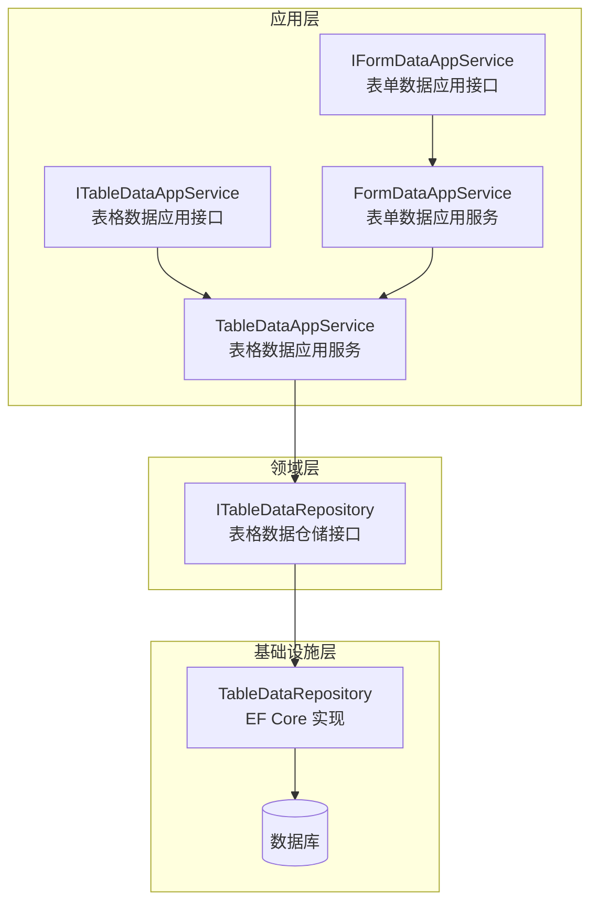
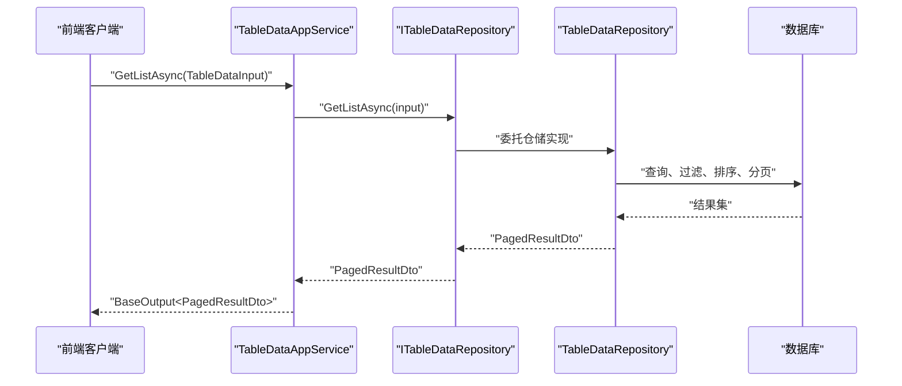
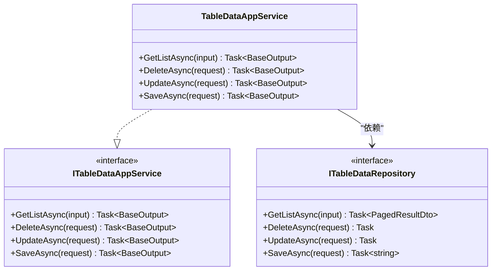
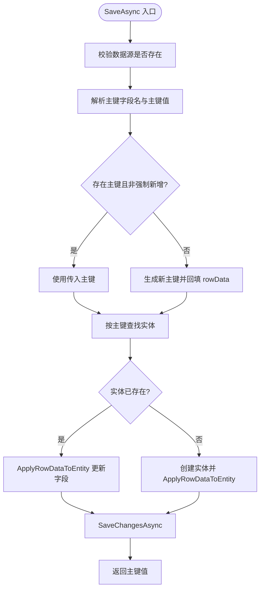
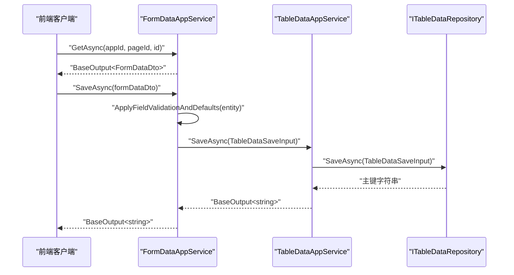
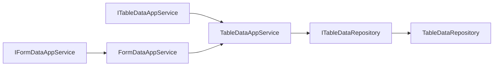

# 数据应用服务

<cite>
**本文引用的文件**   
- [TableDataAppService.cs](file://src/LowCode/RenderEngine/H.LowCode.RenderEngine.Application/DataAppServices/TableDataAppService.cs)
- [ITableDataAppService.cs](file://src/LowCode/Common/H.LowCode.Application.Contracts/AppServices/ITableDataAppService.cs)
- [ITableDataRepository.cs](file://src/LowCode/RenderEngine/H.LowCode.RenderEngine.Domain/DataRepositories/ITableDataRepository.cs)
- [TableDataRepository.cs](file://src/LowCode/RenderEngine/H.LowCode.RenderEngine.EntityFrameworkCore/DataRepositories/TableDataRepository.cs)
- [IFormDataAppService.cs](file://src/LowCode/Common/H.LowCode.Application.Contracts/AppServices/IFormDataAppService.cs)
- [FormDataAppService.cs](file://src/LowCode/RenderEngine/H.LowCode.RenderEngine.Application/DataAppServices/FormD ataAppService.cs)
- [FormEntity.cs](file://src/LowCode/Common/H.LowCode.Entity/Base/FormEntity.cs)
</cite>

## 目录
1. [简介](#简介)
2. [项目结构](#项目结构)
3. [核心组件](#核心组件)
4. [架构总览](#架构总览)
5. [详细组件分析](#详细组件分析)
6. [依赖关系分析](#依赖关系分析)
7. [性能与并发](#性能与并发)
8. [故障排查指南](#故障排查指南)
9. [结论](#结论)

## 简介
本文面向低代码渲染引擎的数据应用服务层，重点说明以下职责与边界：
- TableDataAppService 作为“表格数据提供者”，封装 ITableDataRepository 的增删改查能力，对外暴露标准化的列表查询、删除、批量更新、按主键新增或更新的 API。
- FormDataAppService 负责表单数据的获取与保存：GetAsync 返回新建默认值或编辑已有数据；SaveAsync 自动判断新增或更新模式。
- 数据验证机制由 ApplyFieldValidationAndDefaults 完成字段类型校验、默认值填充与业务规则检查。
- 实体映射通过手工方式将 DTO/字典转换为领域 Entity，规避 ABP Mapperly 未配置问题。
- 主键策略围绕 f_id 字段展开，支持自动生成、新增分配、更新匹配。
- 仓储层通过 IRepository 接口解耦不同数据源实现，便于扩展与替换。
- 事务处理与并发控制基于 EF Core 上下文与 SaveChangesAsync 保证多用户环境下的数据一致性。

## 项目结构
该数据应用服务位于渲染引擎应用层，围绕“表格数据”和“表单数据”两个关键场景组织：

图表来源
- [TableDataAppService.cs:1-42](file://src/LowCode/RenderEngine/H.LowCode.RenderEngine.Application/DataAppServices/TableDataAppService.cs#L1-L42)
- [ITableDataAppService.cs:1-30](file://src/LowCode/Common/H.LowCode.Application.Contracts/AppServices/ITableDataAppService.cs#L1-L30)
- [ITableDataRepository.cs:1-17](file://src/LowCode/RenderEngine/H.LowCode.RenderEngine.Domain/DataRepositories/ITableDataRepository.cs#L1-L17)
- [TableDataRepository.cs:1-313](file://src/LowCode/RenderEngine/H.LowCode.RenderEngine.EntityFrameworkCore/DataRepositories/TableDataRepository.cs#L1-L313)
- [IFormDataAppService.cs:1-16](file://src/LowCode/Common/H.LowCode.Application.Contracts/AppServices/IFormDataAppService.cs#L1-L16)

章节来源
- [TableDataAppService.cs:1-42](file://src/LowCode/RenderEngine/H.LowCode.RenderEngine.Application/DataAppServices/TableDataAppService.cs#L1-L42)
- [ITableDataAppService.cs:1-30](file://src/LowCode/Common/H.LowCode.Application.Contracts/AppServices/ITableDataAppService.cs#L1-L30)
- [ITableDataRepository.cs:1-17](file://src/LowCode/RenderEngine/H.LowCode.RenderEngine.Domain/DataRepositories/ITableDataRepository.cs#L1-L17)
- [TableDataRepository.cs:1-313](file://src/LowCode/RenderEngine/H.LowCode.RenderEngine.EntityFrameworkCore/DataRepositories/TableDataRepository.cs#L1-L313)
- [IFormDataAppService.cs:1-16](file://src/LowCode/Common/H.LowCode.Application.Contracts/AppServices/IFormDataAppService.cs#L1-L16)

## 核心组件
- TableDataAppService：表格数据应用服务，提供 GetListAsync、DeleteAsync、UpdateAsync、SaveAsync。
- ITableDataAppService：表格数据应用接口，定义对外标准化 API。
- ITableDataRepository：表格数据仓储接口，抽象底层数据访问。
- TableDataRepository：基于 EF Core 的仓储实现，动态解析数据源实体、构建筛选排序分页、执行增删改。
- FormDataAppService：表单数据应用服务，提供 GetAsync、SaveAsync、DeleteAsync，并调用 ApplyFieldValidationAndDefaults 进行数据验证与默认值填充。
- FormEntity：表单基类实体，ApplyFieldValidationAndDefaults 针对该实体进行字段级校验与默认值处理。

章节来源
- [TableDataAppService.cs:1-42](file://src/LowCode/RenderEngine/H.LowCode.RenderEngine.Application/DataAppServices/TableDataAppService.cs#L1-L42)
- [ITableDataAppService.cs:1-30](file://src/LowCode/Common/H.LowCode.Application.Contracts/AppServices/ITableDataAppService.cs#L1-L30)
- [ITableDataRepository.cs:1-17](file://src/LowCode/RenderEngine/H.LowCode.RenderEngine.Domain/DataRepositories/ITableDataRepository.cs#L1-L17)
- [TableDataRepository.cs:1-313](file://src/LowCode/RenderEngine/H.LowCode.RenderEngine.EntityFrameworkCore/DataRepositories/TableDataRepository.cs#L1-L313)
- [IFormDataAppService.cs:1-16](file://src/LowCode/Common/H.LowCode.Application.Contracts/AppServices/IFormDataAppService.cs#L1-L16)
- [FormEntity.cs](file://src/LowCode/Common/H.LowCode.Entity/Base/FormEntity.cs)

## 架构总览
渲染引擎数据应用服务采用分层与接口抽象：
- 应用层（Application）：TableDataAppService、FormDataAppService 暴露统一 API。
- 领域层（Domain）：ITableDataRepository 定义数据访问契约。
- 基础设施层（EntityFrameworkCore）：TableDataRepository 使用 EF Core 动态访问数据源实体。

图表来源
- [TableDataAppService.cs:1-42](file://src/LowCode/RenderEngine/H.LowCode.RenderEngine.Application/DataAppServices/TableDataAppService.cs#L1-L42)
- [ITableDataRepository.cs:1-17](file://src/LowCode/RenderEngine/H.LowCode.RenderEngine.Domain/DataRepositories/ITableDataRepository.cs#L1-L17)
- [TableDataRepository.cs:1-313](file://src/LowCode/RenderEngine/H.LowCode.RenderEngine.EntityFrameworkCore/DataRepositories/TableDataRepository.cs#L1-L313)

## 详细组件分析

### TableDataAppService：表格数据提供者
职责与边界：
- 作为表格数据提供者，不直接操作数据库，而是委托 ITableDataRepository。
- 对外暴露标准化 API：
  - GetListAsync：分页查询，返回 BaseOutput<PagedResultDto<Dictionary<string, object>>>。
  - DeleteAsync：删除单条记录。
  - UpdateAsync：批量更新指定记录的字段。
  - SaveAsync：按主键新增或更新，返回主键字符串。

图表来源
- [TableDataAppService.cs:1-42](file://src/LowCode/RenderEngine/H.LowCode.RenderEngine.Application/DataAppServices/TableDataAppService.cs#L1-L42)
- [ITableDataAppService.cs:1-30](file://src/LowCode/Common/H.LowCode.Application.Contracts/AppServices/ITableDataAppService.cs#L1-L30)
- [ITableDataRepository.cs:1-17](file://src/LowCode/RenderEngine/H.LowCode.RenderEngine.Domain/DataRepositories/ITableDataRepository.cs#L1-L17)

API 语义与参数要点：
- GetListAsync：接收 TableDataInput，支持按数据源 Id、过滤条件、排序、分页参数查询。
- DeleteAsync：接收 TableDataDeleteInput，包含 appId、dataSourceId、id。
- UpdateAsync：接收 TableDataUpdateInput，包含 appId、dataSourceId、id、updateData。
- SaveAsync：接收 TableDataSaveInput，包含 appId、dataSourceId、rowData、forceInsert。

章节来源
- [TableDataAppService.cs:1-42](file://src/LowCode/RenderEngine/H.LowCode.RenderEngine.Application/DataAppServices/TableDataAppService.cs#L1-L42)
- [ITableDataAppService.cs:1-30](file://src/LowCode/Common/H.LowCode.Application.Contracts/AppServices/ITableDataAppService.cs#L1-L30)

### TableDataRepository：EF Core 仓储实现
核心功能：
- GetListAsync：根据数据源名称动态获取实体类型，使用表达式树构建 Where、OrderBy/OrderByDescending，最后分页返回 Dictionary<string, object> 列表。
- DeleteAsync：按 id 查找实体并删除。
- UpdateAsync：按 id 查找实体并使用 ApplyRowDataToEntity 写入字段后保存。
- SaveAsync：按主键新增或更新，主键为空时自动生成 Guid；返回主键字符串。
- ApplyRowDataToEntity：手工映射行数据到实体属性，按属性类型转换值。
- ConvertValue：兼容字符串形式的布尔、枚举及数值转换。

图表来源
- [TableDataRepository.cs:1-313](file://src/LowCode/RenderEngine/H.LowCode.RenderEngine.EntityFrameworkCore/DataRepositories/TableDataRepository.cs#L1-L313)

章节来源
- [TableDataRepository.cs:1-313](file://src/LowCode/RenderEngine/H.LowCode.RenderEngine.EntityFrameworkCore/DataRepositories/TableDataRepository.cs#L1-L313)

### FormDataAppService：表单数据处理
职责与边界：
- GetAsync(appId, pageId, id)：根据页面与标识获取表单数据，新建模式下返回默认值，编辑模式下返回已有数据。
- SaveAsync(dto)：保存表单数据，自动判断新增或更新模式，返回主键值。
- DeleteAsync(appId, pageId, id)：删除表单数据。
- ApplyFieldValidationAndDefaults(entity)：对 FormEntity 进行字段类型验证、默认值填充与业务规则校验。

图表来源
- [IFormDataAppService.cs:1-16](file://src/LowCode/Common/H.LowCode.Application.Contracts/AppServices/IFormDataAppService.cs#L1-L16)
- [FormDataAppService.cs](file://src/LowCode/RenderEngine/H.LowCode.RenderEngine.Application/DataAppServices/FormD ataAppService.cs)
- [TableDataAppService.cs:1-42](file://src/LowCode/RenderEngine/H.LowCode.RenderEngine.Application/DataAppServices/TableDataAppService.cs#L1-L42)
- [ITableDataRepository.cs:1-17](file://src/LowCode/RenderEngine/H.LowCode.RenderEngine.Domain/DataRepositories/ITableDataRepository.cs#L1-L17)

章节来源
- [IFormDataAppService.cs:1-16](file://src/LowCode/Common/H.LowCode.Application.Contracts/AppServices/IFormDataAppService.cs#L1-L16)
- [FormDataAppService.cs](file://src/LowCode/RenderEngine/H.LowCode.RenderEngine.Application/DataAppServices/FormD ataAppService.cs)

### 数据验证机制：ApplyFieldValidationAndDefaults
作用：
- 在保存表单数据前，对 FormEntity 进行字段类型验证、默认值填充与业务规则校验。
- 确保进入仓储层的数据满足领域约束，减少无效写入与异常传播。

关键点：
- 仅在 SaveAsync 流程中调用，避免影响查询与只读路径。
- 失败时应抛出明确的验证错误，以便上层捕获并反馈给前端。

章节来源
- [FormDataAppService.cs](file://src/LowCode/RenderEngine/H.LowCode.RenderEngine.Application/DataAppServices/FormD ataAppService.cs)
- [FormEntity.cs](file://src/LowCode/Common/H.LowCode.Entity/Base/FormEntity.cs)

### 实体映射过程：DTO 到 Entity 的手工映射
背景：
- 为规避 ABP Mapperly 未配置的问题，仓储实现采用手工映射。

实现要点：
- ApplyRowDataToEntity：遍历 rowData 字典，按属性名匹配实体属性，再按属性类型转换值。
- ConvertValue：处理 bool、enum、可空类型与基础类型的转换，转换失败返回 null 以跳过赋值。
- 优点：灵活、可控；缺点：需要维护字段与类型对应逻辑。

章节来源
- [TableDataRepository.cs:1-313](file://src/LowCode/RenderEngine/H.LowCode.RenderEngine.EntityFrameworkCore/DataRepositories/TableDataRepository.cs#L1-L313)

### 主键处理策略：f_id 字段的自动生成与匹配
策略：
- 优先从数据源表字段元信息中识别 IsPrimaryKey=true 的字段名。
- 若未找到主键字段，则回退到默认主键名 f_id。
- 当 ForceInsert=false 且 rowData 中包含主键值时，使用该主键值进行更新匹配。
- 当主键为空或 ForceInsert=true 时，生成新的 Guid 作为主键并回填 rowData。
- 最终按主键执行 Add/Update 并返回主键字符串。

章节来源
- [TableDataRepository.cs:1-313](file://src/LowCode/RenderEngine/H.LowCode.RenderEngine.EntityFrameworkCore/DataRepositories/TableDataRepository.cs#L1-L313)

### API 使用示例与错误处理
典型用法（前端调用）：
- 列表查询：调用 TableDataAppService.GetListAsync，传入 appId、dataSourceId、Filters、Sorting、SkipCount、MaxResultCount。
- 删除：调用 TableDataAppService.DeleteAsync，传入 appId、dataSourceId、id。
- 批量更新：调用 TableDataAppService.UpdateAsync，传入 appId、dataSourceId、id、UpdateData。
- 保存：调用 TableDataAppService.SaveAsync，传入 appId、dataSourceId、rowData、ForceInsert；或由 FormDataAppService.SaveAsync 内部包装。

错误处理策略：
- 仓储层在数据源不存在或记录不存在时抛出 ArgumentException。
- 应用层统一返回 BaseOutput<T>，前端应检查状态码与消息。
- 对于表单验证失败，FormDataAppService 应在 ApplyFieldValidationAndDefaults 中抛出明确异常，供上层捕获并转化为友好的错误提示。

章节来源
- [TableDataAppService.cs:1-42](file://src/LowCode/RenderEngine/H.LowCode.RenderEngine.Application/DataAppServices/TableDataAppService.cs#L1-L42)
- [TableDataRepository.cs:1-313](file://src/LowCode/RenderEngine/H.LowCode.RenderEngine.EntityFrameworkCore/DataRepositories/TableDataRepository.cs#L1-L313)
- [IFormDataAppService.cs:1-16](file://src/LowCode/Common/H.LowCode.Application.Contracts/AppServices/IFormDataAppService.cs#L1-L16)

### 与仓储层的解耦设计
设计要点：
- ITableDataAppService 仅与应用层交互，不涉及数据访问细节。
- ITableDataRepository 抽象数据访问契约，允许在不同数据源实现间切换。
- TableDataRepository 具体实现 EF Core 动态查询与持久化，屏蔽底层数据库差异。

章节来源
- [ITableDataAppService.cs:1-30](file://src/LowCode/Common/H.LowCode.Application.Contracts/AppServices/ITableDataAppService.cs#L1-L30)
- [ITableDataRepository.cs:1-17](file://src/LowCode/RenderEngine/H.LowCode.RenderEngine.Domain/DataRepositories/ITableDataRepository.cs#L1-L17)
- [TableDataRepository.cs:1-313](file://src/LowCode/RenderEngine/H.LowCode.RenderEngine.EntityFrameworkCore/DataRepositories/TableDataRepository.cs#L1-L313)

## 依赖关系分析
组件耦合与依赖：
- TableDataAppService 依赖 ITableDataRepository。
- FormDataAppService 依赖 TableDataAppService 进行数据持久化，并在保存前进行字段验证。
- TableDataRepository 依赖 IDbContextFactory 与 IDataSourceRepository 以动态访问数据源实体。

图表来源
- [TableDataAppService.cs:1-42](file://src/LowCode/RenderEngine/H.LowCode.RenderEngine.Application/DataAppServices/TableDataAppService.cs#L1-L42)
- [IFormDataAppService.cs:1-16](file://src/LowCode/Common/H.LowCode.Application.Contracts/AppServices/IFormDataAppService.cs#L1-L16)
- [ITableDataRepository.cs:1-17](file://src/LowCode/RenderEngine/H.LowCode.RenderEngine.Domain/DataRepositories/ITableDataRepository.cs#L1-L17)
- [TableDataRepository.cs:1-313](file://src/LowCode/RenderEngine/H.LowCode.RenderEngine.EntityFrameworkCore/DataRepositories/TableDataRepository.cs#L1-L313)

章节来源
- [TableDataAppService.cs:1-42](file://src/LowCode/RenderEngine/H.LowCode.RenderEngine.Application/DataAppServices/TableDataAppService.cs#L1-L42)
- [IFormDataAppService.cs:1-16](file://src/LowCode/Common/H.LowCode.Application.Contracts/AppServices/IFormDataAppService.cs#L1-L16)
- [ITableDataRepository.cs:1-17](file://src/LowCode/RenderEngine/H.LowCode.RenderEngine.Domain/DataRepositories/ITableDataRepository.cs#L1-L17)
- [TableDataRepository.cs:1-313](file://src/LowCode/RenderEngine/H.LowCode.RenderEngine.EntityFrameworkCore/DataRepositories/TableDataRepository.cs#L1-L313)

## 性能与并发
- 分页查询：GetListAsync 使用 Skip/Take 分页，先 Count 再取页数据，适合中等规模数据集；在高并发场景下建议结合索引优化与查询条件限制。
- 表达式树过滤与排序：Where/OrderBy 使用表达式树动态构建，避免全表扫描；需确保前端传递的字段与数据库列一致。
- 值类型转换：ConvertValue 对常见类型进行兼容处理，避免运行时类型错误；对复杂类型需在数据源元信息中补充映射规则。
- 事务与并发：每个仓储方法独立使用 DbContext 实例并通过 SaveChangesAsync 提交，适用于单请求内的事务边界；跨多个仓储调用的事务应由更高层编排。

[本节为通用指导，不直接分析具体文件]

## 故障排查指南
常见问题与定位：
- 数据源不存在：仓储层在 DeleteAsync、UpdateAsync、SaveAsync 中抛出 ArgumentException，检查 appId 与 dataSourceId 是否匹配。
- 记录不存在：DeleteAsync、UpdateAsync 在 FindAsync 结果为空时抛出异常，确认 id 是否正确。
- 主键为空或冲突：SaveAsync 会生成新主键；若出现重复主键异常，检查 ForceInsert 与 rowData 中的主键字段。
- 字段类型转换失败：ConvertValue 捕获异常返回 null，可能导致字段未被赋值；检查前端传入值与实体属性类型是否兼容。
- 表单验证失败：ApplyFieldValidationAndDefaults 抛出验证错误；在前端展示具体字段提示信息。

章节来源
- [TableDataRepository.cs:1-313](file://src/LowCode/RenderEngine/H.LowCode.RenderEngine.EntityFrameworkCore/DataRepositories/TableDataRepository.cs#L1-L313)
- [FormDataAppService.cs](file://src/LowCode/RenderEngine/H.LowCode.RenderEngine.Application/DataAppServices/FormD ataAppService.cs)

## 结论
数据应用服务层通过 TableDataAppService 与 FormDataAppService 提供统一的表格与表单数据访问能力，借助 ITableDataRepository 抽象解耦底层数据源，利用 EF Core 动态查询与手工映射实现灵活的 CRUD 操作。主键策略围绕 f_id 与数据源元信息展开，兼顾新增与更新场景。表单验证在保存前集中处理，保障数据质量与一致性。在多用户环境中，仓储层以独立 DbContext 与 SaveChangesAsync 提供事务边界，结合前端合理的分页与过滤策略，可在保证性能的同时维持数据正确性。