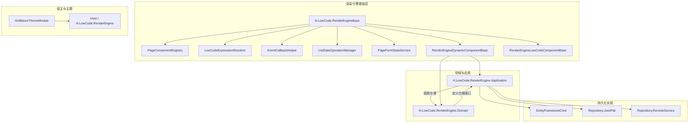
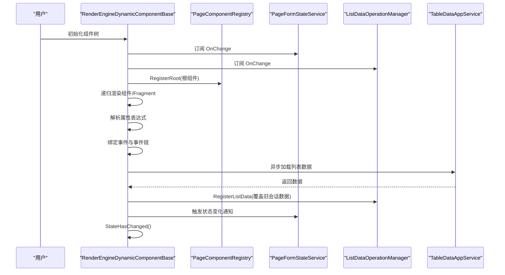
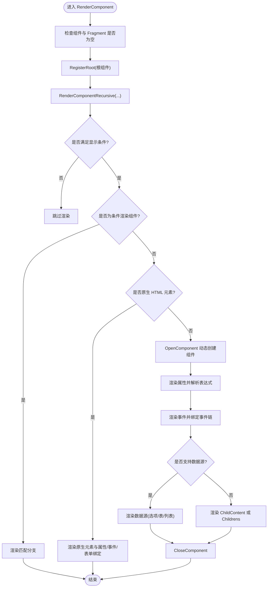
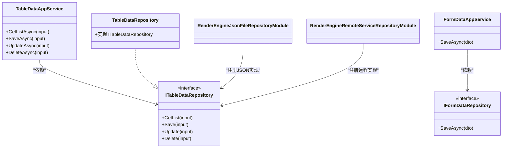
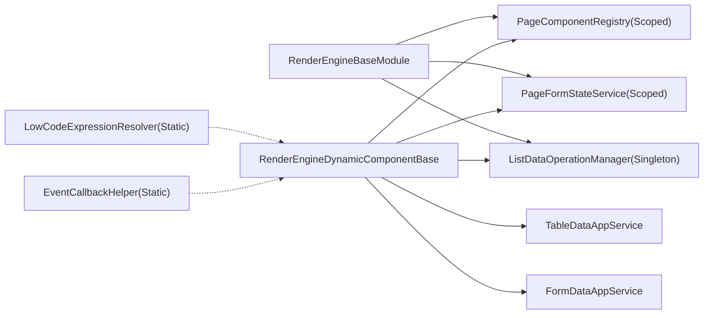

# 渲染引擎

<cite>
**本文引用的文件**   
- [RenderEngineDynamicComponentBase.cs](file://src/LowCode/RenderEngine/H.LowCode.RenderEngineBase/RenderEngineDynamicComponentBase.cs)
- [RenderEngineLowCodeComponentBase.cs](file://src/LowCode/RenderEngine/H.LowCode.RenderEngineBase/RenderEngineLowCodeComponentBase.cs)
- [PageComponentRegistry.cs](file://src/LowCode/RenderEngine/H.LowCode.RenderEngineBase/PageComponentRegistry.cs)
- [LowCodeExpressionResolver.cs](file://src/LowCode/RenderEngine/H.LowCode.RenderEngineBase/LowCodeExpressionResolver.cs)
- [EventCallbackHelper.cs](file://src/LowCode/RenderEngine/H.LowCode.RenderEngineBase/EventCallbackHelper.cs)
- [ListDataOperationManager.cs](file://src/LowCode/RenderEngine/H.LowCode.RenderEngineBase/ListDataOperationManager.cs)
- [PageFormStateService.cs](file://src/LowCode/RenderEngine/H.LowCode.RenderEngineBase/PageFormStateService.cs)
- [RenderEngineBaseModule.cs](file://src/LowCode/RenderEngine/H.LowCode.RenderEngineBase/RenderEngineBaseModule.cs)
- [AntBlazorThemeModule.cs](file://src/LowCode/RenderEngine/H.LowCode.RenderEngine/AntBlazorThemeModule.cs)
- [ITableDataRepository.cs](file://src/LowCode/RenderEngine/H.LowCode.RenderEngine.Domain/DataRepositories/ITableDataRepository.cs)
- [IFormDataRepository.cs](file://src/LowCode/RenderEngine/H.LowCode.RenderEngine.Domain/DataRepositories/IFormDataRepository.cs)
- [TableDataAppService.cs](file://src/LowCode/RenderEngine/H.LowCode.RenderEngine.Application/DataAppServices/TableDataAppService.cs)
- [FormDataAppService.cs](file://src/LowCode/RenderEngine/H.LowCode.RenderEngine.Application/DataAppServices/FormDataAppService.cs)
- [TableDataRepository.cs](file://src/LowCode/RenderEngine/H.LowCode.RenderEngine.EntityFrameworkCore/DataRepositories/TableDataRepository.cs)
- [RenderEngineJsonFileRepositoryModule.cs](file://src/LowCode/RenderEngine/H.LowCode.RenderEngine.Repository.JsonFile/RenderEngineJsonFileRepositoryModule.cs)
- [RenderEngineRemoteServiceRepositoryModule.cs](file://src/LowCode/RenderEngine/H.LowCode.RenderEngine.Repository.RemoteService/RenderEngineRemoteServiceRepositoryModule.cs)
</cite>

## 目录
1. [引言](#引言)
2. [项目结构](#项目结构)
3. [核心组件](#核心组件)
4. [架构总览](#架构总览)
5. [详细组件分析](#详细组件分析)
6. [依赖关系分析](#依赖关系分析)
7. [性能与优化](#性能与优化)
8. [故障排查指南](#故障排查指南)
9. [结论](#结论)

## 引言
本文件面向 AppLab 低代码平台的“渲染引擎”模块，目标是帮助读者理解 RenderEngine 如何将 MetaSchema 动态转换为 Blazor 组件树，并支撑表达式解析、事件回调、列表数据操作、表单状态管理、主题样式注入以及多仓储持久化等能力。文档既适合初次接触该引擎的开发者，也适合需要深入扩展自定义组件或事件的资深工程师。

## 项目结构
渲染引擎相关代码主要分布在以下层次：
- 基础运行时：H.LowCode.RenderEngineBase，包含动态组件基类、表达式解析器、事件回调辅助、列表数据操作管理器、页面表单状态服务、组件注册表与服务注册。
- 领域与接口：H.LowCode.RenderEngine.Domain，定义数据仓储接口（如 ITableDataRepository、IFormDataRepository）。
- 应用服务：H.LowCode.RenderEngine.Application，封装对数据仓储的应用层调用（如 TableDataAppService、FormDataAppService）。
- 持久化实现：EntityFrameworkCore、Repository.JsonFile、Repository.RemoteService 分别提供数据库、本地 JSON 文件与远程服务三种存储后端。
- 宿主与主题：Host 与 H.LowCode.RenderEngine 提供运行宿主入口和主题标记（如 AntBlazorThemeModule）。

图表来源
- [RenderEngineBaseModule.cs:1-22](file://src/LowCode/RenderEngine/H.LowCode.RenderEngineBase/RenderEngineBaseModule.cs#L1-L22)
- [RenderEngineDynamicComponentBase.cs:1-2185](file://src/LowCode/RenderEngine/H.LowCode.RenderEngineBase/RenderEngineDynamicComponentBase.cs#L1-L2185)
- [ITableDataRepository.cs](file://src/LowCode/RenderEngine/H.LowCode.RenderEngine.Domain/DataRepositories/ITableDataRepository.cs)
- [IFormDataRepository.cs](file://src/LowCode/RenderEngine/H.LowCode.RenderEngine.Domain/DataRepositories/IFormDataRepository.cs)
- [TableDataAppService.cs](file://src/LowCode/RenderEngine/H.LowCode.RenderEngine.Application/DataAppServices/TableDataAppService.cs)
- [FormDataAppService.cs](file://src/LowCode/RenderEngine/H.LowCode.RenderEngine.Application/DataAppServices/FormDataAppService.cs)
- [TableDataRepository.cs](file://src/LowCode/RenderEngine/H.LowCode.RenderEngine.EntityFrameworkCore/DataRepositories/TableDataRepository.cs)
- [RenderEngineJsonFileRepositoryModule.cs](file://src/LowCode/RenderEngine/H.LowCode.RenderEngine.Repository.JsonFile/RenderEngineJsonFileRepositoryModule.cs)
- [RenderEngineRemoteServiceRepositoryModule.cs](file://src/LowCode/RenderEngine/H.LowCode.RenderEngine.Repository.RemoteService/RenderEngineRemoteServiceRepositoryModule.cs)
- [AntBlazorThemeModule.cs:1-8](file://src/LowCode/RenderEngine/H.LowCode.RenderEngine/AntBlazorThemeModule.cs#L1-L8)

章节来源
- [RenderEngineBaseModule.cs:1-22](file://src/LowCode/RenderEngine/H.LowCode.RenderEngineBase/RenderEngineBaseModule.cs#L1-L22)
- [RenderEngineDynamicComponentBase.cs:1-2185](file://src/LowCode/RenderEngine/H.LowCode.RenderEngineBase/RenderEngineDynamicComponentBase.cs#L1-L2185)

## 核心组件
- RenderEngineDynamicComponentBase：渲染引擎的核心动态组件基类，负责将 MetaSchema 递归渲染为 Blazor 组件树，处理显隐条件、原生 HTML 元素、组件事件、数据源、列表模板、保存校验与提交等。
- RenderEngineLowCodeComponentBase：低代码组件基类，为所有低代码组件提供统一的 PageCascading 上下文注入。
- PageComponentRegistry：页面组件注册表，在渲染过程中登记根组件与子组件，供后续按 Id 查找配置。
- LowCodeExpressionResolver：低代码表达式解析器，支持 $query、$(item.field)、$(form.key)、$(formjson(...))、$(now) 等语法。
- EventCallbackHelper：动态创建 EventCallback 的工具，支持有参和无参回调，用于将元数据中的事件映射到 Blazor 处理器。
- ListDataOperationManager：列表数据操作管理器，维护列表实例内存、增删改查、排序字段更新、主键追踪及数据库同步删除队列。
- PageFormStateService：页面表单状态服务，统一管理输入值、触发联动重算、获取列表实例值集合。
- AntBlazorThemeModule：主题系统标记模块，用于启用 AntBlazor 主题支持。

章节来源
- [RenderEngineDynamicComponentBase.cs:1-2185](file://src/LowCode/RenderEngine/H.LowCode.RenderEngineBase/RenderEngineDynamicComponentBase.cs#L1-L2185)
- [RenderEngineLowCodeComponentBase.cs:1-15](file://src/LowCode/RenderEngine/H.LowCode.RenderEngineBase/RenderEngineLowCodeComponentBase.cs#L1-L15)
- [PageComponentRegistry.cs:1-48](file://src/LowCode/RenderEngine/H.LowCode.RenderEngineBase/PageComponentRegistry.cs#L1-L48)
- [LowCodeExpressionResolver.cs:1-270](file://src/LowCode/RenderEngine/H.LowCode.RenderEngineBase/LowCodeExpressionResolver.cs#L1-L270)
- [EventCallbackHelper.cs:1-84](file://src/LowCode/RenderEngine/H.LowCode.RenderEngineBase/EventCallbackHelper.cs#L1-L84)
- [ListDataOperationManager.cs:1-248](file://src/LowCode/RenderEngine/H.LowCode.RenderEngineBase/ListDataOperationManager.cs#L1-L248)
- [PageFormStateService.cs:1-98](file://src/LowCode/RenderEngine/H.LowCode.RenderEngineBase/PageFormStateService.cs#L1-L98)
- [AntBlazorThemeModule.cs:1-8](file://src/LowCode/RenderEngine/H.LowCode.RenderEngine/AntBlazorThemeModule.cs#L1-L8)

## 架构总览
渲染引擎以“元数据驱动渲染”为核心：MetaSchema 描述组件树、属性、事件和数据源；RenderEngineDynamicComponentBase 在初始化时订阅表单状态与列表数据变更，并在渲染过程中完成表达式求值、条件判断、事件绑定与数据加载。

图表来源
- [RenderEngineDynamicComponentBase.cs:1-2185](file://src/LowCode/RenderEngine/H.LowCode.RenderEngineBase/RenderEngineDynamicComponentBase.cs#L1-L2185)
- [PageComponentRegistry.cs:1-48](file://src/LowCode/RenderEngine/H.LowCode.RenderEngineBase/PageComponentRegistry.cs#L1-L48)
- [PageFormStateService.cs:1-98](file://src/LowCode/RenderEngine/H.LowCode.RenderEngineBase/PageFormStateService.cs#L1-L98)
- [ListDataOperationManager.cs:1-248](file://src/LowCode/RenderEngine/H.LowCode.RenderEngineBase/ListDataOperationManager.cs#L1-L248)
- [TableDataAppService.cs](file://src/LowCode/RenderEngine/H.LowCode.RenderEngine.Application/DataAppServices/TableDataAppService.cs)

## 详细组件分析

### RenderEngineDynamicComponentBase：动态组件创建与渲染引擎中枢
职责与机制：
- 生命周期：在 OnInitializedAsync 中订阅 PageFormStateService 与 ListDataOperationManager 的变化事件，并在 Dispose 中解绑，避免内存泄漏。
- 表达式上下文：CreateExpressionContext 构造 LowCodeExpressionContext，包含 Item、FormState、QueryProvider。
- 组件宽度计算：基于栅格布局计算百分比宽度。
- 组件渲染流程：
  - 默认类型填充与可见性判断（EvaluateVisibleCondition）。
  - 条件渲染组件分支选择。
  - 原生 HTML 元素直接渲染，支持 class/style/content、事件映射、表单控件双向绑定。
  - .NET 组件通过 OpenComponent 动态创建，并渲染属性、事件、ChildContent、DataSource。
  - 列表数据源：根据 ListDataSource 决定使用 ItemTemplate 或 Fragment 渲染列表项，并设置 DataSource 属性。
- 事件处理：
  - 同名事件分组串行执行 HandleEventChainAsync。
  - 支持 Page、Data、Custom(JavaScript) 三类目标。
  - 数据操作事件包括移动、删除、复制、新增、刷新、保存行/列表、保存表单、更新行。
- 表单保存与校验：
  - SaveFormAsync 收集非列表实例值，补充主键，执行 FieldValidator 校验后调用 FormDataAppService.SaveAsync。
  - ValidateFormStateAsync 遍历注册根组件树进行递归校验，列表项逐项校验。
- 列表数据保存：
  - SaveListAsync 合并表单状态到行数据，应用保存映射，调用 TableDataAppService.SaveAsync，必要时 ReloadListAsync。
  - UpdateRowAsync 更新单行并刷新列表。
- 列表数据加载：
  - GetListDataSource 优先固定数据，再异步加载表数据，支持过滤、排序与分页参数构建。
  - LoadTableListDataAsync 覆盖旧会话数据并标记已加载，最后触发 UI 刷新。
- 内存操作：
  - HandleListDataAction 对应 MoveUp/MoveDown/Delete/Copy/Add/Save/Refresh 等操作，更新顺序字段并刷新视图。

图表来源
- [RenderEngineDynamicComponentBase.cs:1-2185](file://src/LowCode/RenderEngine/H.LowCode.RenderEngineBase/RenderEngineDynamicComponentBase.cs#L1-L2185)

章节来源
- [RenderEngineDynamicComponentBase.cs:1-2185](file://src/LowCode/RenderEngine/H.LowCode.RenderEngineBase/RenderEngineDynamicComponentBase.cs#L1-L2185)

### RenderEngineLowCodeComponentBase：低代码组件基类
作用：
- 继承自通用低代码组件基类，注入 PageCascadingModel 上下文，便于访问应用、页面、数据源等级联信息。
- 统一初始化钩子，供具体低代码组件扩展。

章节来源
- [RenderEngineLowCodeComponentBase.cs:1-15](file://src/LowCode/RenderEngine/H.LowCode.RenderEngineBase/RenderEngineLowCodeComponentBase.cs#L1-L15)

### PageComponentRegistry：页面组件注册表
职责：
- 记录根组件与所有子组件配置，提供 GetById 查询与 GetRoots 枚举。
- 用于后续校验、事件路由、调试与工具分析。

章节来源
- [PageComponentRegistry.cs:1-48](file://src/LowCode/RenderEngine/H.LowCode.RenderEngineBase/PageComponentRegistry.cs#L1-L48)

### LowCodeExpressionResolver：表达式解析器
支持的表达式与行为：
- $query(name|name2)：URL 参数回退取值，多个名称取第一个非空结果。
- $(item.field)：当前行数据字段，支持字典与反射属性。
- $(form.key)：页面表单状态值。
- $(form[innerExpr])：key 本身可嵌套表达式，递归求值。
- $(formjson(listId,compName))：聚合列表实例表单值为 JSON 数组，每项含 id/value。
- $(now)：当前时间格式化字符串。
- 混合文本：整个串为单一表达式返回原始类型，否则插值拼接为字符串。
- 工具方法：ContainsExpression、Resolve、ResolveAsString、FormatValue、GetMemberValue。

复杂度与健壮性：
- 括号匹配算法线性扫描，整体表达式解析一次扫描。
- 未识别表达式保留原文，兼容占位标记。

章节来源
- [LowCodeExpressionResolver.cs:1-270](file://src/LowCode/RenderEngine/H.LowCode.RenderEngineBase/LowCodeExpressionResolver.cs#L1-L270)

### EventCallbackHelper：动态事件回调创建
能力：
- CreateWithArg：为 ValueChanged 等有参事件创建回调，内部包装 Action<object?>。
- CreateWithoutArg：为 OnClick 等无参事件创建回调，内部包装 Func<Task>。
- 通过反射找到 EventCallbackFactory.Create 的泛型重载，适配 EventCallback<T>。

用途：
- 将元数据中的事件定义映射到 Blazor 的事件处理器，支持跨组件事件通信（由上层业务逻辑决定转发策略）。

章节来源
- [EventCallbackHelper.cs:1-84](file://src/LowCode/RenderEngine/H.LowCode.RenderEngineBase/EventCallbackHelper.cs#L1-L84)

### ListDataOperationManager：列表数据操作管理器
功能：
- 维护字典式内存存储 IList<object>，支持 HasListData、GetListData、RemoveListData。
- 记录 fromDatabase=true 的列表，保存时同步删除被移除的行主键。
- 提供 MoveUp、MoveDown、DeleteItem、AddItem、AddDefaultItem、CopyItem、UpdateOrderFields。
- PrimaryKeyFieldName 约定为主键字段名 f_id，GetItemPrimaryKey 通过表达式解析器读取。

边界情况：
- CopyItem 对 Dictionary 深拷贝并生成新主键，对其他类型简单引用复制。
- DeleteItem 仅当列表来源于数据库且能提取主键时，记录待删除主键。

章节来源
- [ListDataOperationManager.cs:1-248](file://src/LowCode/RenderEngine/H.LowCode.RenderEngineBase/ListDataOperationManager.cs#L1-L248)

### PageFormStateService：页面表单状态服务
职责：
- SetValue/SetValueSilently/GetValue/HasValue 统一管理输入值。
- GetValueAll 返回只读快照。
- GetListInstanceValues 根据 listId 与 componentName 筛选出该行实例的值集合。
- Clear 清空状态。
- 特殊 key "__lastid" 保存最近一次表单保存生成的主键。

章节来源
- [PageFormStateService.cs:1-98](file://src/LowCode/RenderEngine/H.LowCode.RenderEngineBase/PageFormStateService.cs#L1-L98)

### 主题系统与样式注入
- AntBlazorThemeModule 作为主题模块标记类，用于启用 AntBlazor 主题支持。
- 原生 HTML 元素渲染支持 class/style 属性与资源挂载（Resources、InitFunction），可在编辑器或物料场景注入 JS/CSS。
- 组件属性与 Fragment 属性均支持表达式解析，可在运行时定制样式。

章节来源
- [AntBlazorThemeModule.cs:1-8](file://src/LowCode/RenderEngine/H.LowCode.RenderEngine/AntBlazorThemeModule.cs#L1-L8)
- [RenderEngineDynamicComponentBase.cs:1-2185](file://src/LowCode/RenderEngine/H.LowCode.RenderEngineBase/RenderEngineDynamicComponentBase.cs#L1-L2185)

### 渲染引擎的仓储抽象
领域接口：
- ITableDataRepository：表格数据的增删改查与分页查询。
- IFormDataRepository：表单数据的持久化。

应用服务：
- TableDataAppService：封装表格数据查询、保存、更新、删除。
- FormDataAppService：封装表单数据保存。

持久化实现差异：
- EntityFrameworkCore：TableDataRepository 使用数据库 ORM 访问。
- Repository.JsonFile：通过 JSON 文件本地存储，适用于轻量或离线场景。
- Repository.RemoteService：通过远程服务调用，适用于分布式部署。

图表来源
- [ITableDataRepository.cs](file://src/LowCode/RenderEngine/H.LowCode.RenderEngine.Domain/DataRepositories/ITableDataRepository.cs)
- [IFormDataRepository.cs](file://src/LowCode/RenderEngine/H.LowCode.RenderEngine.Domain/DataRepositories/IFormDataRepository.cs)
- [TableDataAppService.cs](file://src/LowCode/RenderEngine/H.LowCode.RenderEngine.Application/DataAppServices/TableDataAppService.cs)
- [FormDataAppService.cs](file://src/LowCode/RenderEngine/H.LowCode.RenderEngine.Application/DataAppServices/FormDataAppService.cs)
- [TableDataRepository.cs](file://src/LowCode/RenderEngine/H.LowCode.RenderEngine.EntityFrameworkCore/DataRepositories/TableDataRepository.cs)
- [RenderEngineJsonFileRepositoryModule.cs](file://src/LowCode/RenderEngine/H.LowCode.RenderEngine.Repository.JsonFile/RenderEngineJsonFileRepositoryModule.cs)
- [RenderEngineRemoteServiceRepositoryModule.cs](file://src/LowCode/RenderEngine/H.LowCode.RenderEngine.Repository.RemoteService/RenderEngineRemoteServiceRepositoryModule.cs)

章节来源
- [ITableDataRepository.cs](file://src/LowCode/RenderEngine/H.LowCode.RenderEngine.Domain/DataRepositories/ITableDataRepository.cs)
- [IFormDataRepository.cs](file://src/LowCode/RenderEngine/H.LowCode.RenderEngine.Domain/DataRepositories/IFormDataRepository.cs)
- [TableDataAppService.cs](file://src/LowCode/RenderEngine/H.LowCode.RenderEngine.Application/DataAppServices/TableDataAppService.cs)
- [FormDataAppService.cs](file://src/LowCode/RenderEngine/H.LowCode.RenderEngine.Application/DataAppServices/FormDataAppService.cs)
- [TableDataRepository.cs](file://src/LowCode/RenderEngine/H.LowCode.RenderEngine.EntityFrameworkCore/DataRepositories/TableDataRepository.cs)
- [RenderEngineJsonFileRepositoryModule.cs](file://src/LowCode/RenderEngine/H.LowCode.RenderEngine.Repository.JsonFile/RenderEngineJsonFileRepositoryModule.cs)
- [RenderEngineRemoteServiceRepositoryModule.cs](file://src/LowCode/RenderEngine/H.LowCode.RenderEngine.Repository.RemoteService/RenderEngineRemoteServiceRepositoryModule.cs)

### 页面状态管理与自动保存机制
- PageFormStateService 集中管理表单值，SetValue 触发 OnChange，驱动显隐联动与重新求值。
- RenderEngineDynamicComponentBase 在初始化时订阅 OnChange，并在值变化时调用 StateHasChanged 刷新视图。
- SaveFormAsync 收集非列表实例值，补充主键，执行校验后调用 FormDataAppService.SaveAsync，成功后写入 LastIdKey。
- 列表保存 SaveListAsync 合并表单状态到行数据，应用保存映射，必要时刷新列表数据。

章节来源
- [PageFormStateService.cs:1-98](file://src/LowCode/RenderEngine/H.LowCode.RenderEngineBase/PageFormStateService.cs#L1-L98)
- [RenderEngineDynamicComponentBase.cs:1-2185](file://src/LowCode/RenderEngine/H.LowCode.RenderEngineBase/RenderEngineDynamicComponentBase.cs#L1-L2185)

## 依赖关系分析
- RenderEngineBaseModule 在服务容器中注册：
  - ListDataOperationManager 为 Singleton，确保 WebAssembly 中状态保持。
  - PageFormStateService 与 PageComponentRegistry 为 Scoped，按会话隔离。
- RenderEngineDynamicComponentBase 依赖：
  - PageComponentRegistry：登记与查询组件配置。
  - PageFormStateService：表单状态与联动。
  - ListDataOperationManager：列表内存操作与变更通知。
  - TableDataAppService：表格数据查询与保存。
  - FormDataAppService：表单数据保存。
- 表达式解析器 LowCodeExpressionResolver 为静态工具类，不持有外部依赖。
- EventCallbackHelper 通过反射调用 EventCallback.Factory。

图表来源
- [RenderEngineBaseModule.cs:1-22](file://src/LowCode/RenderEngine/H.LowCode.RenderEngineBase/RenderEngineBaseModule.cs#L1-L22)
- [RenderEngineDynamicComponentBase.cs:1-2185](file://src/LowCode/RenderEngine/H.LowCode.RenderEngineBase/RenderEngineDynamicComponentBase.cs#L1-L2185)
- [LowCodeExpressionResolver.cs:1-270](file://src/LowCode/RenderEngine/H.LowCode.RenderEngineBase/LowCodeExpressionResolver.cs#L1-L270)
- [EventCallbackHelper.cs:1-84](file://src/LowCode/RenderEngine/H.LowCode.RenderEngineBase/EventCallbackHelper.cs#L1-L84)

章节来源
- [RenderEngineBaseModule.cs:1-22](file://src/LowCode/RenderEngine/H.LowCode.RenderEngineBase/RenderEngineBaseModule.cs#L1-L22)

## 性能与优化
- 组件懒加载：
  - 列表数据首次访问才异步加载，避免无关组件阻塞首屏。
  - 条件渲染组件仅在条件匹配时渲染分支，减少无用 DOM。
- 虚拟滚动：
  - 当前列表数据一次性加载最大 1000 条，建议在上层列表组件实现虚拟滚动以降低渲染压力。
- 缓存策略：
  - ListDataOperationManager 使用 Singleton 存储列表数据，跨页面导航复用，减少重复请求。
  - 已加载列表标记 _loadedListIds 防止重复加载。
- 内存管理：
  - RenderEngineDynamicComponentBase 在 Dispose 中解绑事件，避免内存泄漏。
  - PageFormStateService 提供 Clear 方法，建议在页面卸载时清理状态。
- 表达式解析：
  - LowCodeExpressionResolver 单次扫描解析，避免多次字符串操作开销。
- 事件处理：
  - 事件链短路机制，校验失败立即中断，减少无效后续处理。

[本节为通用指导，无需特定文件引用]

## 故障排查指南
常见问题与建议：
- 组件无法渲染：
  - 检查 ComponentSchema 的 Fragment.TypeName 是否正确，默认类型是否填充。
  - 查看 ResolveType 是否能解析到有效类型，避免整页崩溃。
- 表达式未生效：
  - 确认表达式语法是否匹配 $query、$(item.field)、$(form.key)、$(formjson)、$(now)。
  - 检查 QueryProvider 是否注入，FormState 是否存在。
- 事件未触发：
  - 检查 EventSchema 的 EventHandlerType 与 EventName 是否与组件属性一致。
  - 确认 EventCallbackHelper 成功创建回调，事件链是否被短路。
- 列表数据为空：
  - 检查 ListDataSource.TableDataSourceId 是否配置，Filters/OrderBy 是否合理。
  - 查看 TableDataAppService.GetListAsync 返回数据是否为空。
- 表单保存失败：
  - 检查 FieldValidator 校验规则，确保必填字段已填写。
  - 查看 FormDataAppService.SaveAsync 异常日志。
- 主题样式不生效：
  - 确认 AntBlazorThemeModule 已启用，原生 HTML 元素的 class/style 是否正确传递。

章节来源
- [RenderEngineDynamicComponentBase.cs:1-2185](file://src/LowCode/RenderEngine/H.LowCode.RenderEngineBase/RenderEngineDynamicComponentBase.cs#L1-L2185)
- [LowCodeExpressionResolver.cs:1-270](file://src/LowCode/RenderEngine/H.LowCode.RenderEngineBase/LowCodeExpressionResolver.cs#L1-L270)
- [EventCallbackHelper.cs:1-84](file://src/LowCode/RenderEngine/H.LowCode.RenderEngineBase/EventCallbackHelper.cs#L1-L84)
- [PageFormStateService.cs:1-98](file://src/LowCode/RenderEngine/H.LowCode.RenderEngineBase/PageFormStateService.cs#L1-L98)
- [AntBlazorThemeModule.cs:1-8](file://src/LowCode/RenderEngine/H.LowCode.RenderEngine/AntBlazorThemeModule.cs#L1-L8)

## 结论
渲染引擎通过 MetaSchema 驱动动态组件树渲染，结合表达式解析、事件回调、列表数据操作、表单状态管理与多仓储持久化，形成完整的低代码平台运行期能力。开发者可在此基础之上扩展自定义组件、事件处理器与第三方库集成，并通过主题系统与样式注入机制实现运行时样式定制。在生产环境中，应关注组件懒加载、虚拟滚动、缓存与内存管理等性能优化策略，以确保用户体验与系统稳定性。