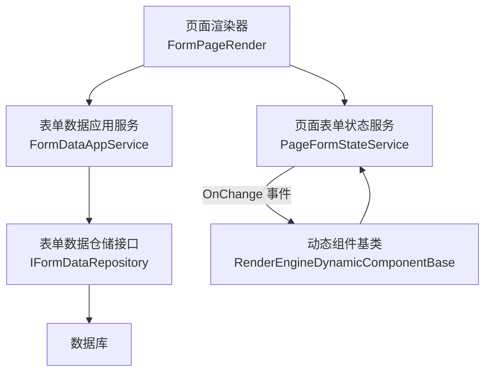
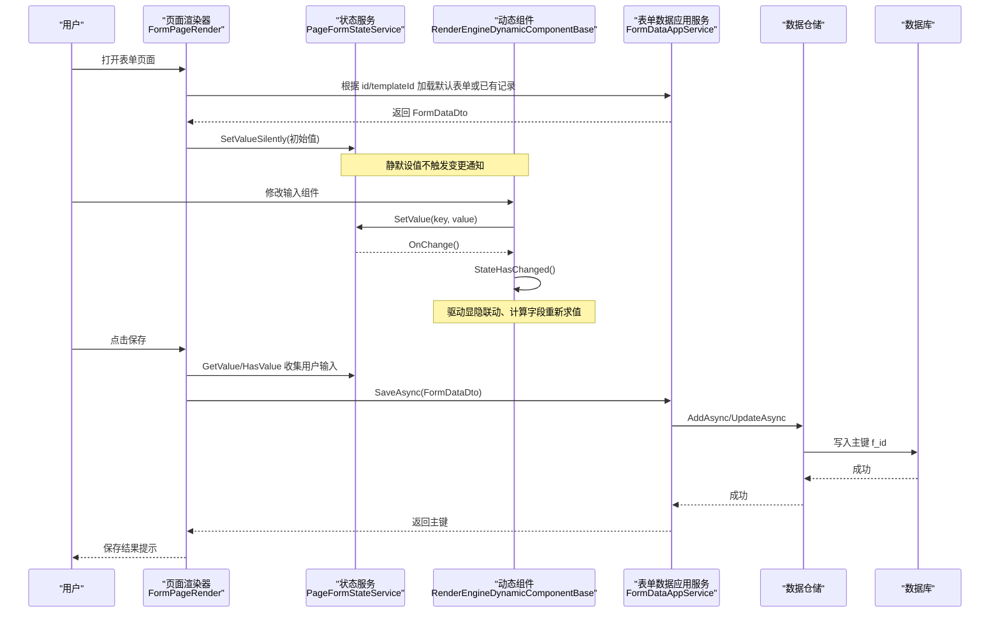
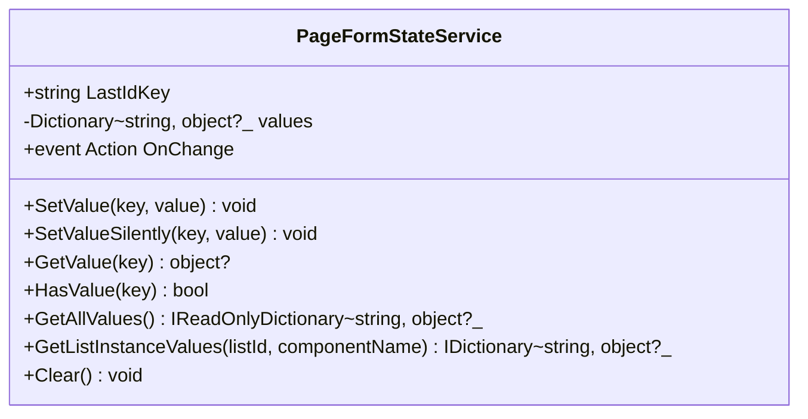
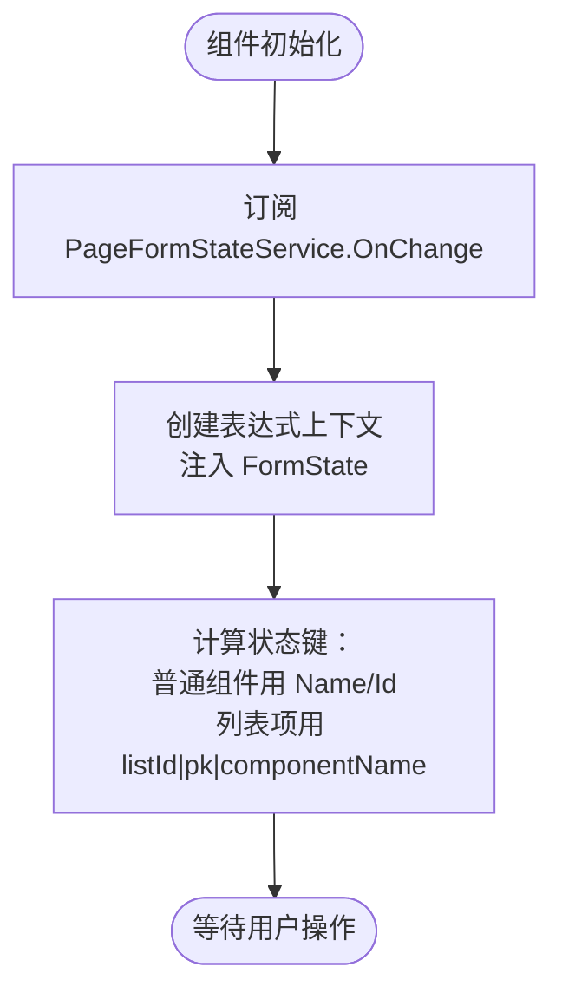
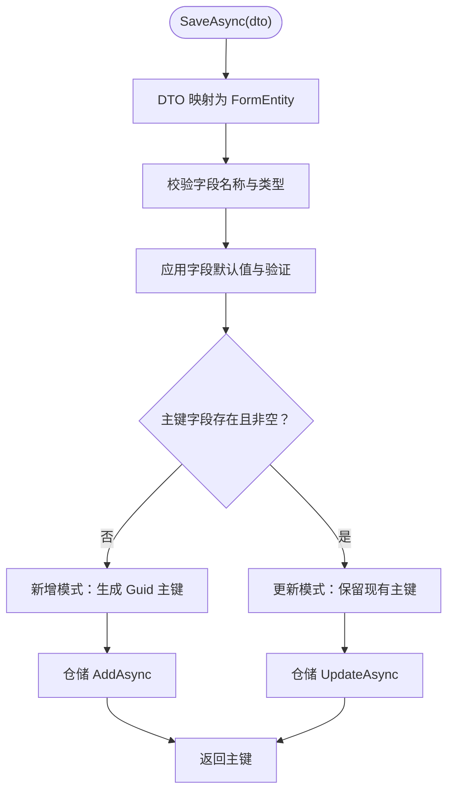
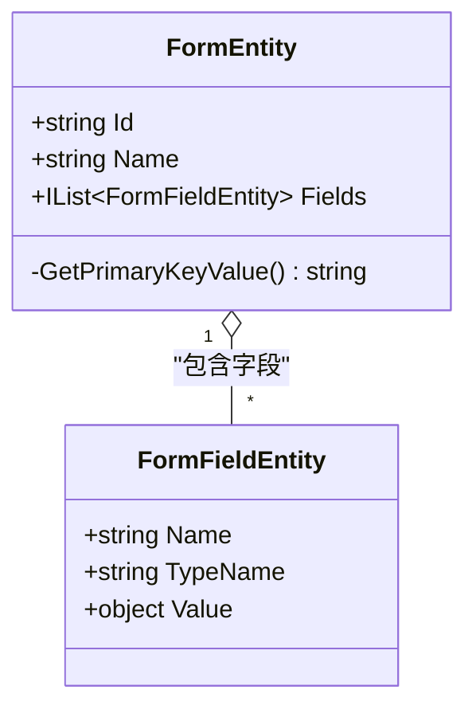
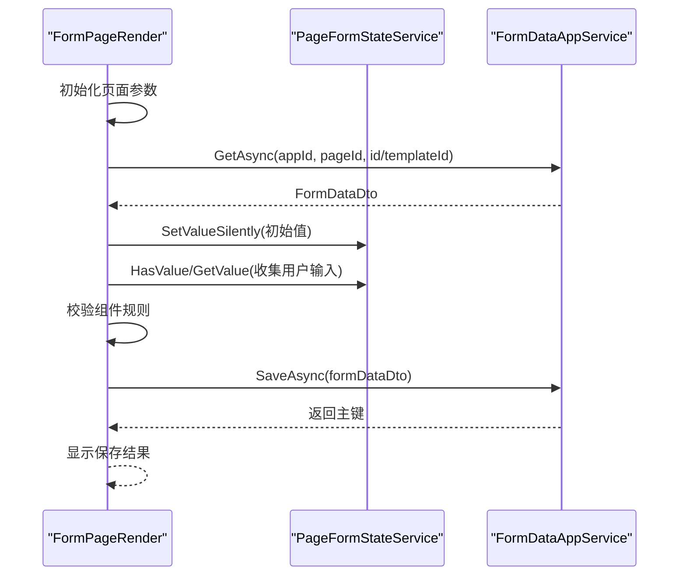
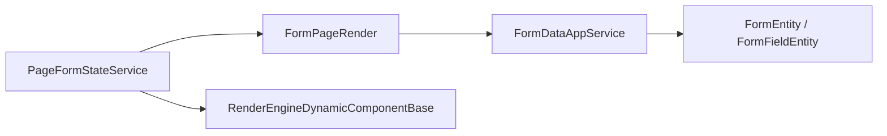

# 表单状态管理

<cite>
**本文引用的文件**   
- [PageFormStateService.cs](file://src/LowCode/RenderEngine/H.LowCode.RenderEngineBase/PageFormStateService.cs)
- [FormDataAppService.cs](file://src/LowCode/RenderEngine/H.LowCode.RenderEngine.Application/DataAppServices/FormDataAppService.cs)
- [IFormDataAppService.cs](file://src/LowCode/Common/H.LowCode.Application.Contracts/AppServices/IFormDataAppService.cs)
- [FormEntity.cs](file://src/LowCode/Common/H.LowCode.Entity/Base/FormEntity.cs)
- [FormPageRender.razor](file://src/LowCode/RenderEngine/H.LowCode.RenderEngine/PageRender/FormPageRender.razor)
- [RenderEngineDynamicComponentBase.cs](file://src/LowCode/RenderEngine/H.LowCode.RenderEngineBase/RenderEngineDynamicComponentBase.cs)
</cite>

## 目录
1. [引言](#引言)
2. [项目结构定位](#项目结构定位)
3. [核心组件概览](#核心组件概览)
4. [架构总览](#架构总览)
5. [详细组件分析](#详细组件分析)
6. [依赖关系分析](#依赖关系分析)
7. [性能与内存优化](#性能与内存优化)
8. [典型使用场景](#典型使用场景)
9. [故障排查指南](#故障排查指南)
10. [结论](#结论)

## 引言
本文面向低代码平台的表单状态管理系统，重点解释页面级表单状态服务 `PageFormStateService` 的设计与实现，以及它与渲染引擎、表单持久化服务的协作方式。该系统的核心目标是：在一个页面内统一管理所有输入组件的值，提供稳定的键命名约定、变更通知机制、列表实例状态筛选能力，并支持与数据库持久化的新增/更新流程对接。

## 项目结构定位
表单状态管理主要位于渲染引擎相关模块中：
- 状态服务定义在渲染引擎基础库中。
- 表单数据应用服务负责从页面配置加载默认值、从数据库读取或保存数据。
- 表单实体模型用于统一描述字段名称、类型和值。
- 页面渲染器负责初始化表单、绑定状态、收集用户输入并提交保存。
- 动态组件基类订阅状态变更，驱动显隐联动、计算字段刷新等交互效果。

**图表来源**
- [FormPageRender.razor:1-60](file://src/LowCode/RenderEngine/H.LowCode.RenderEngine/PageRender/FormPageRender.razor#L1-L60)
- [PageFormStateService.cs:1-98](file://src/LowCode/RenderEngine/H.LowCode.RenderEngineBase/PageFormStateService.cs#L1-L98)
- [FormDataAppService.cs:1-120](file://src/LowCode/RenderEngine/H.LowCode.RenderEngine.Application/DataAppServices/FormDataAppService.cs#L1-L120)
- [RenderEngineDynamicComponentBase.cs:1-120](file://src/LowCode/RenderEngine/H.LowCode.RenderEngineBase/RenderEngineDynamicComponentBase.cs#L1-L120)

**章节来源**
- [PageFormStateService.cs:1-98](file://src/LowCode/RenderEngine/H.LowCode.RenderEngineBase/PageFormStateService.cs#L1-L98)
- [FormPageRender.razor:1-200](file://src/LowCode/RenderEngine/H.LowCode.RenderEngine/PageRender/FormPageRender.razor#L1-L200)
- [FormDataAppService.cs:1-200](file://src/LowCode/RenderEngine/H.LowCode.RenderEngine.Application/DataAppServices/FormDataAppService.cs#L1-L200)
- [RenderEngineDynamicComponentBase.cs:1-200](file://src/LowCode/RenderEngine/H.LowCode.RenderEngineBase/RenderEngineDynamicComponentBase.cs#L1-L200)

## 核心组件概览
- **PageFormStateService**：页面级表单状态容器，提供增删改查、批量获取、清空和变更通知能力。
- **FormDataAppService**：表单数据应用服务，负责加载默认表单、查询已有记录、校验并保存新增或更新记录。
- **FormEntity / FormFieldEntity**：表单实体模型，描述表单所属实体名及字段集合；字段包含名称、类型名和值。
- **FormPageRender**：页面渲染器，负责初始化表单、回填初始值、收集用户输入、执行校验并提交保存。
- **RenderEngineDynamicComponentBase**：动态组件基类，订阅状态变更，驱动条件显示、计算字段重新求值等。

**章节来源**
- [PageFormStateService.cs:1-98](file://src/LowCode/RenderEngine/H.LowCode.RenderEngineBase/PageFormStateService.cs#L1-L98)
- [FormDataAppService.cs:1-200](file://src/LowCode/RenderEngine/H.LowCode.RenderEngine.Application/DataAppServices/FormDataAppService.cs#L1-L200)
- [FormEntity.cs:1-50](file://src/LowCode/Common/H.LowCode.Entity/Base/FormEntity.cs#L1-L50)
- [FormPageRender.razor:1-200](file://src/LowCode/RenderEngine/H.LowCode.RenderEngine/PageRender/FormPageRender.razor#L1-L200)
- [RenderEngineDynamicComponentBase.cs:1-200](file://src/LowCode/RenderEngine/H.LowCode.RenderEngineBase/RenderEngineDynamicComponentBase.cs#L1-L200)

## 架构总览
表单状态管理贯穿“渲染层—状态层—应用服务层—仓储层—数据库”。

**图表来源**
- [FormPageRender.razor:60-200](file://src/LowCode/RenderEngine/H.LowCode.RenderEngine/PageRender/FormPageRender.razor#L60-L200)
- [PageFormStateService.cs:20-98](file://src/LowCode/RenderEngine/H.LowCode.RenderEngineBase/PageFormStateService.cs#L20-L98)
- [FormDataAppService.cs:120-200](file://src/LowCode/RenderEngine/H.LowCode.RenderEngine.Application/DataAppServices/FormDataAppService.cs#L120-L200)

## 详细组件分析

### 页面表单状态服务 PageFormStateService
- **职责**：统一管理页面内所有输入组件的键值状态，支持值变更通知、静默初始化、按列表维度筛选实例值。
- **内部存储**：使用字典存储键值对，键为字符串，值为对象。
- **键命名约定**：
  - 普通组件：使用组件 Name 或 Id。
  - 列表实例组件：复合键形式 `{listId}|{itemPrimaryKey}|{componentName}`。
  - 特殊键：`__lastid` 保存最近一次保存生成的主键。
- **操作方法**：
  - `SetValue`：设置值，若新旧值相等则跳过；否则写入并触发 `OnChange` 通知。
  - `SetValueSilently`：静默设值，不触发通知，用于初始化回填。
  - `GetValue`：获取指定键对应的值，不存在返回空。
  - `HasValue`：判断是否存在某个键。
  - `GetAllValues`：返回只读快照。
  - `GetListInstanceValues`：按列表 ID 和组件名筛选出该列表下所有实例的状态值，返回行主键到组件值的映射。
  - `Clear`：清空所有状态。

**图表来源**
- [PageFormStateService.cs:1-98](file://src/LowCode/RenderEngine/H.LowCode.RenderEngineBase/PageFormStateService.cs#L1-L98)

**章节来源**
- [PageFormStateService.cs:1-98](file://src/LowCode/RenderEngine/H.LowCode.RenderEngineBase/PageFormStateService.cs#L1-L98)

### 动态组件基类 RenderEngineDynamicComponentBase
- **职责**：作为各类动态组件的基类，负责订阅表单状态变化与列表数据变化，并在变化时触发 UI 重新渲染。
- **状态订阅**：
  - 在初始化时订阅 `PageFormStateService.OnChange`。
  - 在销毁时取消订阅，避免内存泄漏。
- **表达式上下文**：创建表达式求值上下文时注入 `FormState`，使表达式可访问当前表单状态。
- **值键生成**：根据组件与数据上下文计算状态键；列表项通过列表 ID、行主键（或索引）与组件名组合成复合键。

**图表来源**
- [RenderEngineDynamicComponentBase.cs:1-120](file://src/LowCode/RenderEngine/H.LowCode.RenderEngineBase/RenderEngineDynamicComponentBase.cs#L1-L120)

**章节来源**
- [RenderEngineDynamicComponentBase.cs:1-200](file://src/LowCode/RenderEngine/H.LowCode.RenderEngineBase/RenderEngineDynamicComponentBase.cs#L1-L200)

### 表单数据应用服务 FormDataAppService
- **职责**：提供表单数据的加载、校验与保存能力，封装新增与更新逻辑。
- **加载逻辑**：
  - 根据 appId、pageId、id 查询页面与数据。
  - 若无 id，则基于页面组件生成默认表单 DTO。
  - 若有 id，则从仓储读取已有记录并映射为 DTO。
- **保存逻辑**：
  - 将 DTO 手工映射为 `FormEntity`。
  - 校验字段非空、类型名有效。
  - 应用字段验证与默认值：根据页面配置与类型默认值填充。
  - 新增模式：若主键字段缺失或为空，则生成新主键并调用新增仓储。
  - 更新模式：若主键存在且非空，则调用更新仓储。
  - 返回主键值供上层使用。
- **异常处理**：捕获保存异常并记录日志，同时向上抛出。

**图表来源**
- [FormDataAppService.cs:120-200](file://src/LowCode/RenderEngine/H.LowCode.RenderEngine.Application/DataAppServices/FormDataAppService.cs#L120-L200)

**章节来源**
- [FormDataAppService.cs:1-200](file://src/LowCode/RenderEngine/H.LowCode.RenderEngine.Application/DataAppServices/FormDataAppService.cs#L1-L200)

### 表单实体模型 FormEntity / FormFieldEntity
- **FormEntity**：表示一个表单记录，包含实体名称与字段集合；通过主键字段 `f_id` 的值解析实体 ID。
- **FormFieldEntity**：表示一个字段，包含名称、类型名与值；值的读取会根据类型名转换为实际类型，若类型无效则抛出异常。

**图表来源**
- [FormEntity.cs:1-50](file://src/LowCode/Common/H.LowCode.Entity/Base/FormEntity.cs#L1-L50)

**章节来源**
- [FormEntity.cs:1-50](file://src/LowCode/Common/H.LowCode.Entity/Base/FormEntity.cs#L1-L50)

### 页面渲染器 FormPageRender
- **职责**：渲染表单页面、初始化表单数据、绑定状态、收集用户输入、执行校验、提交保存。
- **初始化流程**：
  - 根据查询参数决定加载模板、已有记录或新建默认表单。
  - 将默认字段映射为字典，并通过 `SetValueSilently` 回填到 `PageFormStateService`。
- **提交流程**：
  - 从状态服务收集用户输入，覆盖初始值。
  - 递归校验各组件规则。
  - 校验通过后调用 `FormDataAppService.SaveAsync` 保存。
  - 根据返回结果提示用户。

**图表来源**
- [FormPageRender.razor:1-200](file://src/LowCode/RenderEngine/H.LowCode.RenderEngine/PageRender/FormPageRender.razor#L1-L200)
- [FormDataAppService.cs:120-200](file://src/LowCode/RenderEngine/H.LowCode.RenderEngine.Application/DataAppServices/FormDataAppService.cs#L120-L200)

**章节来源**
- [FormPageRender.razor:1-200](file://src/LowCode/RenderEngine/H.LowCode.RenderEngine/PageRender/FormPageRender.razor#L1-L200)

## 依赖关系分析
- **PageFormStateService** 被渲染器与动态组件共同依赖，是页面内状态唯一权威源。
- **FormDataAppService** 依赖仓储接口与页面仓储，负责业务层的数据一致性。
- **FormEntity/FormFieldEntity** 作为持久化载体，贯穿应用服务与仓储层。
- **RenderEngineDynamicComponentBase** 依赖 `PageFormStateService` 与 `ListDataOperationManager`，驱动 UI 联动。

**图表来源**
- [PageFormStateService.cs:1-98](file://src/LowCode/RenderEngine/H.LowCode.RenderEngineBase/PageFormStateService.cs#L1-L98)
- [FormPageRender.razor:1-200](file://src/LowCode/RenderEngine/H.LowCode.RenderEngine/PageRender/FormPageRender.razor#L1-L200)
- [RenderEngineDynamicComponentBase.cs:1-200](file://src/LowCode/RenderEngine/H.LowCode.RenderEngineBase/RenderEngineDynamicComponentBase.cs#L1-L200)
- [FormEntity.cs:1-50](file://src/LowCode/Common/H.LowCode.Entity/Base/FormEntity.cs#L1-L50)

**章节来源**
- [PageFormStateService.cs:1-98](file://src/LowCode/RenderEngine/H.LowCode.RenderEngineBase/PageFormStateService.cs#L1-L98)
- [FormPageRender.razor:1-200](file://src/LowCode/RenderEngine/H.LowCode.RenderEngine/PageRender/FormPageRender.razor#L1-L200)
- [RenderEngineDynamicComponentBase.cs:1-200](file://src/LowCode/RenderEngine/H.LowCode.RenderEngineBase/RenderEngineDynamicComponentBase.cs#L1-L200)
- [FormEntity.cs:1-50](file://src/LowCode/Common/H.LowCode.Entity/Base/FormEntity.cs#L1-L50)

## 性能与内存优化
- **值比较避免重复通知**：`SetValue` 在写入前比较旧值与新值，相等则直接返回，减少不必要的 `OnChange` 触发，降低 UI 重绘成本。
- **静默设值优化初始化**：`SetValueSilently` 不触发事件，适合页面初始化回填，避免在初始阶段产生大量重渲染。
- **批量更新建议**：对于需要一次性更新多个字段的情况，应优先使用静默设值完成全部回填，再按需触发一次通知；或在业务层合并多次写入，减少事件风暴。
- **内存管理**：
  - 动态组件在销毁时取消对 `PageFormStateService` 与 `ListDataOperationManager` 的事件订阅，避免引用滞留导致内存泄漏。
  - 列表实例状态键采用复合键，避免不同列表项之间的键冲突，提高状态隔离性与检索效率。
- **列表实例值筛选**：`GetListInstanceValues` 通过前后缀匹配过滤键，时间复杂度近似 O(n)，适合列表规模不大的场景；当列表项较多时可考虑建立索引或缓存以提升性能。

**章节来源**
- [PageFormStateService.cs:20-98](file://src/LowCode/RenderEngine/H.LowCode.RenderEngineBase/PageFormStateService.cs#L20-L98)
- [RenderEngineDynamicComponentBase.cs:1-120](file://src/LowCode/RenderEngine/H.LowCode.RenderEngineBase/RenderEngineDynamicComponentBase.cs#L1-L120)

## 典型使用场景
- **表单验证**：页面渲染器在提交前遍历组件规则，优先取状态值进行校验；校验失败则收集错误信息并提示用户。
- **条件显示**：动态组件基类订阅状态变化，在可见条件求值为假时跳过渲染，实现显隐联动。
- **动态计算**：表达式上下文注入 `FormState`，可在计算字段或表达式中读取其他字段值，随状态变化自动重新求值。
- **数据回显**：页面初始化时通过 `SetValueSilently` 将默认值或已有记录回填到状态服务，确保组件绑定正确。
- **列表实例编辑**：通过复合键区分不同行的同一组件，使用 `GetListInstanceValues` 按列表维度聚合行数据，便于批量操作或校验。

**章节来源**
- [FormPageRender.razor:60-200](file://src/LowCode/RenderEngine/H.LowCode.RenderEngine/PageRender/FormPageRender.razor#L60-L200)
- [RenderEngineDynamicComponentBase.cs:1-200](file://src/LowCode/RenderEngine/H.LowCode.RenderEngineBase/RenderEngineDynamicComponentBase.cs#L1-L200)
- [PageFormStateService.cs:60-98](file://src/LowCode/RenderEngine/H.LowCode.RenderEngineBase/PageFormStateService.cs#L60-L98)

## 故障排查指南
- **主键问题**：
  - 若 `FormEntity` 的主键字段 `f_id` 缺失或为空，会导致 ID 解析异常；检查保存流程是否正确生成主键。
- **类型转换异常**：
  - `FormFieldEntity.Value` 在读取时会尝试将原始值转换为声明类型；若 `TypeName` 无效或类型未找到，会抛出异常；检查页面配置的字段类型是否准确。
- **保存失败**：
  - `FormDataAppService.SaveAsync` 捕获异常并记录日志；查看日志中的实体名称与实体 ID，确认仓储写入是否成功。
- **状态未更新**：
  - 确认组件是否正确调用 `SetValue`；若使用 `SetValueSilently`，不会触发 `OnChange`，需手动触发 UI 更新。
- **事件泄漏**：
  - 确认动态组件是否在销毁时取消订阅 `PageFormStateService.OnChange` 与 `ListDataOperationManager.OnChange`。

**章节来源**
- [FormEntity.cs:1-50](file://src/LowCode/Common/H.LowCode.Entity/Base/FormEntity.cs#L1-L50)
- [FormDataAppService.cs:120-200](file://src/LowCode/RenderEngine/H.LowCode.RenderEngine.Application/DataAppServices/FormDataAppService.cs#L120-L200)
- [RenderEngineDynamicComponentBase.cs:1-120](file://src/LowCode/RenderEngine/H.LowCode.RenderEngineBase/RenderEngineDynamicComponentBase.cs#L1-L120)

## 结论
`PageFormStateService` 以简单的字典结构与明确的键命名约定，实现了低代码平台页面内表单状态的集中管理。配合 `RenderEngineDynamicComponentBase` 的状态订阅机制与 `FormDataAppService` 的持久化流程，系统能够稳定支撑表单验证、条件显示、动态计算、数据回显与列表实例编辑等常见场景。通过值比较去重、静默初始化、事件订阅生命周期管理等策略，系统在功能完备性的同时兼顾了性能与内存安全。未来可在列表实例状态检索上引入索引或缓存进一步优化大规模列表的性能表现。