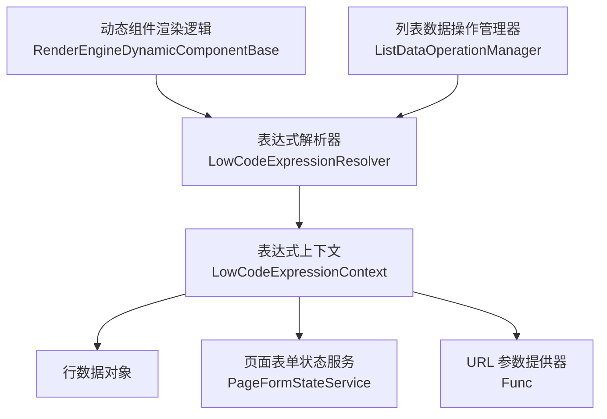
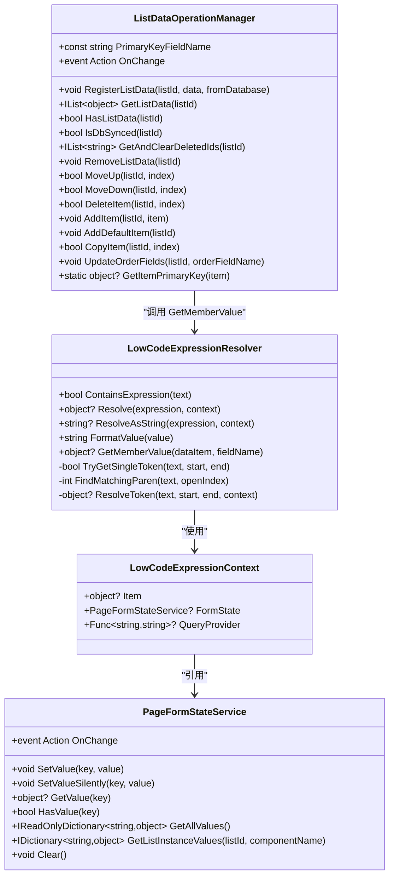
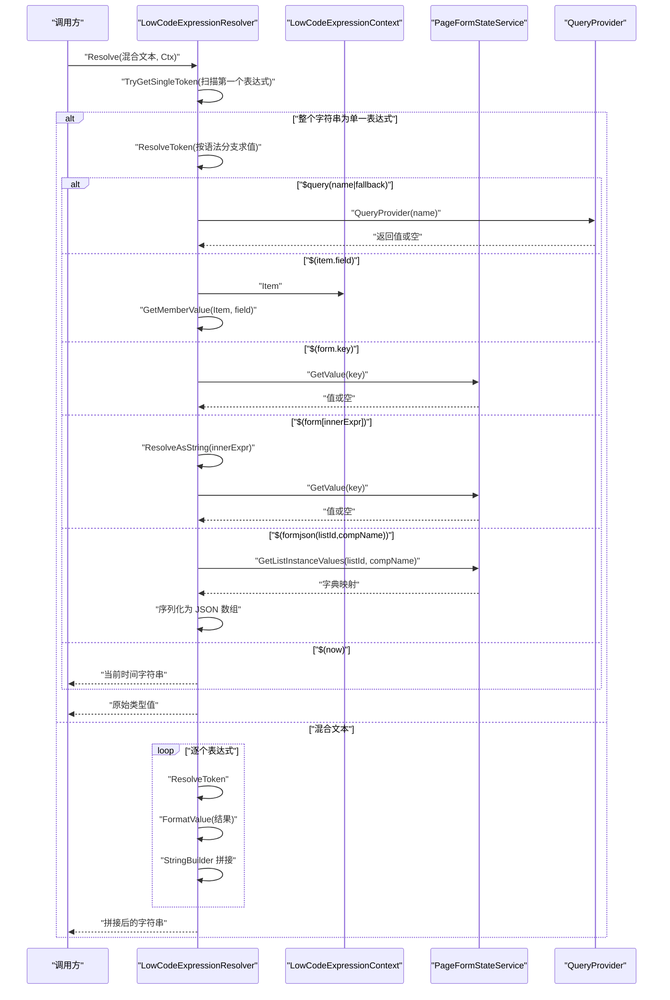
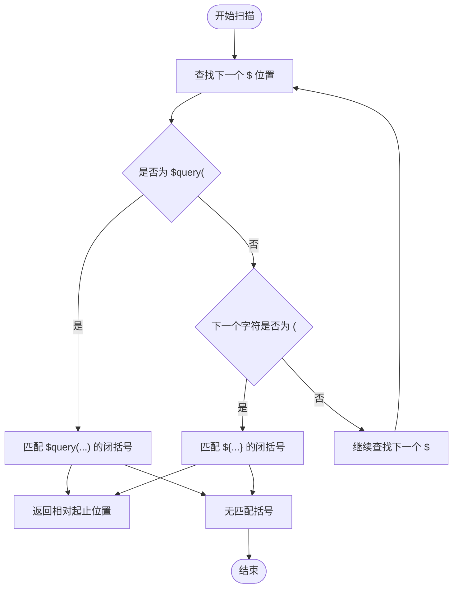
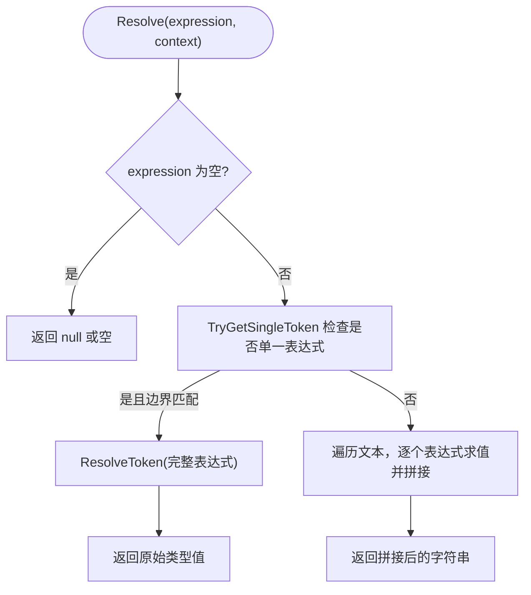
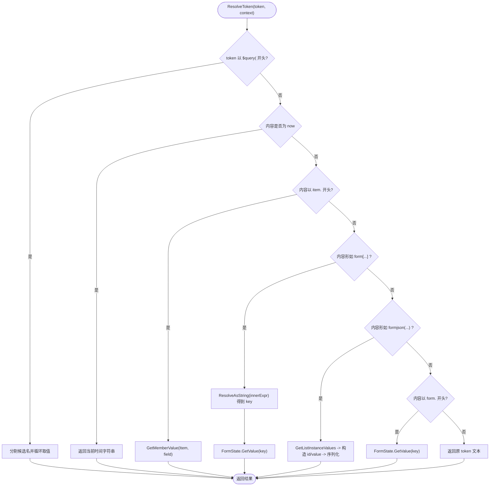
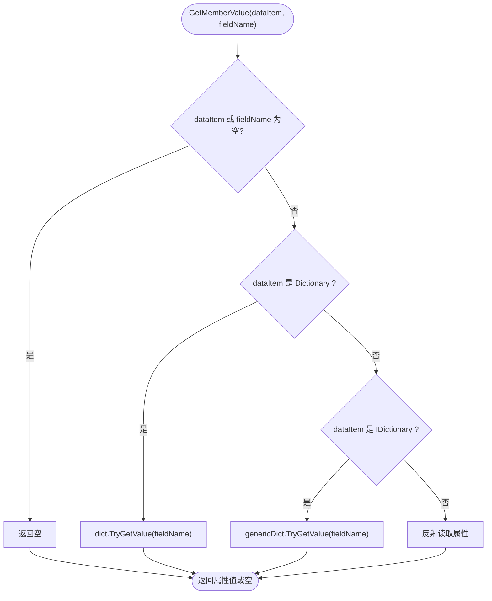
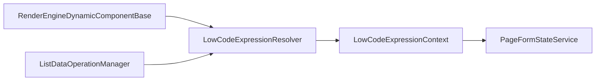

# 表达式解析器

<cite>
**本文引用的文件**   
- [LowCodeExpressionResolver.cs](file://src/LowCode/RenderEngine/H.LowCode.RenderEngineBase/LowCodeExpressionResolver.cs)
- [PageFormStateService.cs](file://src/LowCode/RenderEngine/H.LowCode.RenderEngineBase/PageFormStateService.cs)
- [ListDataOperationManager.cs](file://src/LowCode/RenderEngine/H.LowCode.RenderEngineBase/ListDataOperationManager.cs)
- [RenderEngineDynamicComponentBase.cs](file://src/LowCode/RenderEngine/H.LowCode.RenderEngineBase/RenderEngineDynamicComponentBase.cs)
</cite>

## 目录
1. [引言](#引言)
2. [项目结构定位](#项目结构定位)
3. [核心组件总览](#核心组件总览)
4. [架构与数据流](#架构与数据流)
5. [表达式语法与语义](#表达式语法与语义)
6. [详细实现分析](#详细实现分析)
7. [依赖关系分析](#依赖关系分析)
8. [性能特征与优化建议](#性能特征与优化建议)
9. [使用场景与示例](#使用场景与示例)
10. [错误处理与容错策略](#错误处理与容错策略)
11. [常见问题排查](#常见问题排查)
12. [结论](#结论)

## 引言
本文面向低代码平台的表达式解析器，系统性说明 `LowCodeExpressionResolver` 的工作原理、支持的表达式语法、上下文模型、混合文本求值机制、布尔与时间格式化规则、成员访问机制，以及与渲染引擎和表单状态服务的集成方式。读者无需深入源码即可理解如何在条件显示、动态标题、表单联动、URL 参数回退等场景中正确使用表达式。

## 项目结构定位
表达式解析器位于低代码渲染引擎基础层，作为平台通用能力被动态组件渲染逻辑调用。其职责是：
- 识别并解析 `${...}` 和 `$query(...)` 两种表达式。
- 从行数据、表单状态、URL 参数中取值。
- 在混合文本中拼接字符串，或在单一表达式时返回原始类型值。
- 提供通用的字段读取能力 `GetMemberValue`。

**图表来源**  
- [RenderEngineDynamicComponentBase.cs:301-342](file://src/LowCode/RenderEngine/H.LowCode.RenderEngineBase/RenderEngineDynamicComponentBase.cs#L301-L342)
- [RenderEngineDynamicComponentBase.cs:983-990](file://src/LowCode/RenderEngine/H.LowCode.RenderEngineBase/RenderEngineDynamicComponentBase.cs#L983-L990)
- [RenderEngineDynamicComponentBase.cs:1110-1126](file://src/LowCode/RenderEngine/H.LowCode.RenderEngineBase/RenderEngineDynamicComponentBase.cs#L1110-L1126)
- [RenderEngineDynamicComponentBase.cs:1389-1395](file://src/LowCode/RenderEngine/H.LowCode.RenderEngineBase/RenderEngineDynamicComponentBase.cs#L1389-L1395)
- [RenderEngineDynamicComponentBase.cs:1441-1447](file://src/LowCode/RenderEngine/H.LowCode.RenderEngineBase/RenderEngineDynamicComponentBase.cs#L1441-L1447)
- [RenderEngineDynamicComponentBase.cs:1589-1595](file://src/LowCode/RenderEngine/H.LowCode.RenderEngineBase/RenderEngineDynamicComponentBase.cs#L1589-L1595)
- [RenderEngineDynamicComponentBase.cs:2051-2056](file://src/LowCode/RenderEngine/H.LowCode.RenderEngineBase/RenderEngineDynamicComponentBase.cs#L2051-L2056)
- [ListDataOperationManager.cs:241-248](file://src/LowCode/RenderEngine/H.LowCode.RenderEngineBase/ListDataOperationManager.cs#L241-L248)

**章节来源**  
- [RenderEngineDynamicComponentBase.cs:301-342](file://src/LowCode/RenderEngine/H.LowCode.RenderEngineBase/RenderEngineDynamicComponentBase.cs#L301-L342)
- [RenderEngineDynamicComponentBase.cs:983-990](file://src/LowCode/RenderEngine/H.LowCode.RenderEngineBase/RenderEngineDynamicComponentBase.cs#L983-L990)
- [ListDataOperationManager.cs:241-248](file://src/LowCode/RenderEngine/H.LowCode.RenderEngineBase/ListDataOperationManager.cs#L241-L248)

## 核心组件总览
- `LowCodeExpressionContext`：表达式求值上下文，包含当前行数据、页面表单状态、URL 参数提供器。
- `LowCodeExpressionResolver`：静态表达式解析器，负责扫描、匹配、求值和格式化。
- `PageFormStateService`：页面表单状态服务，统一管理输入组件值，并提供列表实例值的聚合查询。
- `ListDataOperationManager`：列表数据操作管理器，维护行数据生命周期，并在保存主键读取时复用 `GetMemberValue`。

**图表来源**  
- [LowCodeExpressionResolver.cs:1-270](file://src/LowCode/RenderEngine/H.LowCode.RenderEngineBase/LowCodeExpressionResolver.cs#L1-L270)
- [PageFormStateService.cs:1-98](file://src/LowCode/RenderEngine/H.LowCode.RenderEngineBase/PageFormStateService.cs#L1-L98)
- [ListDataOperationManager.cs:1-248](file://src/LowCode/RenderEngine/H.LowCode.RenderEngineBase/ListDataOperationManager.cs#L1-L248)

**章节来源**  
- [LowCodeExpressionResolver.cs:1-270](file://src/LowCode/RenderEngine/H.LowCode.RenderEngineBase/LowCodeExpressionResolver.cs#L1-L270)
- [PageFormStateService.cs:1-98](file://src/LowCode/RenderEngine/H.LowCode.RenderEngineBase/PageFormStateService.cs#L1-L98)
- [ListDataOperationManager.cs:1-248](file://src/LowCode/RenderEngine/H.LowCode.RenderEngineBase/ListDataOperationManager.cs#L1-L248)

## 架构与数据流
表达式解析流程分为两个阶段：
1. **词法扫描**：从左到右扫描文本，识别 `$query(...)` 和 `${...}` 表达式边界。
2. **语义求值**：对每个表达式执行具体解析，结合上下文获取值；未识别表达式保留原文。

**图表来源**  
- [LowCodeExpressionResolver.cs:40-110](file://src/LowCode/RenderEngine/H.LowCode.RenderEngineBase/LowCodeExpressionResolver.cs#L40-L110)
- [LowCodeExpressionResolver.cs:112-199](file://src/LowCode/RenderEngine/H.LowCode.RenderEngineBase/LowCodeExpressionResolver.cs#L112-L199)
- [LowCodeExpressionResolver.cs:201-270](file://src/LowCode/RenderEngine/H.LowCode.RenderEngineBase/LowCodeExpressionResolver.cs#L201-L270)
- [PageFormStateService.cs:1-98](file://src/LowCode/RenderEngine/H.LowCode.RenderEngineBase/PageFormStateService.cs#L1-L98)

**章节来源**  
- [LowCodeExpressionResolver.cs:40-110](file://src/LowCode/RenderEngine/H.LowCode.RenderEngineBase/LowCodeExpressionResolver.cs#L40-L110)
- [LowCodeExpressionResolver.cs:112-199](file://src/LowCode/RenderEngine/H.LowCode.RenderEngineBase/LowCodeExpressionResolver.cs#L112-L199)
- [LowCodeExpressionResolver.cs:201-270](file://src/LowCode/RenderEngine/H.LowCode.RenderEngineBase/LowCodeExpressionResolver.cs#L201-L270)

## 表达式语法与语义
- `$query(name|fallback)`：依次尝试 URL 参数名，取第一个非空值；若未配置 `QueryProvider`，返回空。
- `${item.field}`：访问当前行数据的字段；支持字典键和反射属性。
- `${form.key}`：读取页面表单状态值。
- `${form[innerExpr]}`：动态键访问，先对 `innerExpr` 求值为字符串键，再查表。
- `${formjson(listId,compName)}`：聚合指定列表实例中某个组件的值，输出 JSON 数组，每项包含 `id` 与 `value`。
- `${now}`：返回当前时间的格式化字符串，格式为 `yyyy-MM-dd HH:mm:ss`。

混合文本行为：
- 当表达式与普通文本混合时，解析器会逐段拼接，最终返回字符串。
- 当整个字符串恰好是单一表达式时，返回原始类型值（例如布尔、时间、JSON 字符串、字典值等）。

布尔值与时间格式化：
- 布尔值转换为 `"true"` 或 `"false"`。
- `DateTime` 转换为 `"yyyy-MM-dd HH:mm:ss"`。
- 空值转换为空字符串。

**章节来源**  
- [LowCodeExpressionResolver.cs:40-110](file://src/LowCode/RenderEngine/H.LowCode.RenderEngineBase/LowCodeExpressionResolver.cs#L40-L110)
- [LowCodeExpressionResolver.cs:112-199](file://src/LowCode/RenderEngine/H.LowCode.RenderEngineBase/LowCodeExpressionResolver.cs#L112-L199)
- [LowCodeExpressionResolver.cs:201-270](file://src/LowCode/RenderEngine/H.LowCode.RenderEngineBase/LowCodeExpressionResolver.cs#L201-L270)

## 详细实现分析

### 词法扫描与括号匹配
- `ContainsExpression`：快速判断是否包含 `${` 或 `$query(`。
- `TryGetSingleToken`：从左到右查找 `$`，优先匹配 `$query(`，其次匹配 `${`，并使用 `FindMatchingParen` 找到匹配的闭括号。
- `FindMatchingParen`：通过深度计数匹配嵌套括号，确保表达式边界正确。

**图表来源**  
- [LowCodeExpressionResolver.cs:112-199](file://src/LowCode/RenderEngine/H.LowCode.RenderEngineBase/LowCodeExpressionResolver.cs#L112-L199)

**章节来源**  
- [LowCodeExpressionResolver.cs:112-199](file://src/LowCode/RenderEngine/H.LowCode.RenderEngineBase/LowCodeExpressionResolver.cs#L112-L199)

### 单一表达式求值
- 如果整个字符串恰为一个表达式，则直接调用 `ResolveToken` 并返回原始类型值。
- 否则进入混合文本路径，逐段拼接。

**图表来源**  
- [LowCodeExpressionResolver.cs:40-110](file://src/LowCode/RenderEngine/H.LowCode.RenderEngineBase/LowCodeExpressionResolver.cs#L40-L110)

**章节来源**  
- [LowCodeExpressionResolver.cs:40-110](file://src/LowCode/RenderEngine/H.LowCode.RenderEngineBase/LowCodeExpressionResolver.cs#L40-L110)

### 表达式分支解析
- `$query(name|fallback)`：按竖线分隔候选名，依次调用 `QueryProvider`，返回首个非空值。
- `${now}`：返回当前时间的格式化字符串。
- `${item.field}`：调用 `GetMemberValue` 读取行数据字段。
- `${form[innerExpr]}`：递归求值内嵌表达式得到键，再从表单状态取值。
- `${formjson(listId,compName)}`：校验参数数量，调用 `GetListInstanceValues`，构造 `[{id,value},...]` 后序列化。
- `${form.key}`：直接读取表单状态值。
- 未识别表达式：保留原文，兼容占位标记。

**图表来源**  
- [LowCodeExpressionResolver.cs:201-270](file://src/LowCode/RenderEngine/H.LowCode.RenderEngineBase/LowCodeExpressionResolver.cs#L201-L270)

**章节来源**  
- [LowCodeExpressionResolver.cs:201-270](file://src/LowCode/RenderEngine/H.LowCode.RenderEngineBase/LowCodeExpressionResolver.cs#L201-L270)

### 成员访问机制 `GetMemberValue`
- 支持 `Dictionary<string,object>` 键访问。
- 支持 `IDictionary<string,object>` 泛型键访问。
- 支持反射属性访问。
- 空数据项或空字段名返回空。

**图表来源**  
- [LowCodeExpressionResolver.cs:252-270](file://src/LowCode/RenderEngine/H.LowCode.RenderEngineBase/LowCodeExpressionResolver.cs#L252-L270)

**章节来源**  
- [LowCodeExpressionResolver.cs:252-270](file://src/LowCode/RenderEngine/H.LowCode.RenderEngineBase/LowCodeExpressionResolver.cs#L252-L270)

## 依赖关系分析
- `LowCodeExpressionResolver` 依赖 `LowCodeExpressionContext` 提供的三类数据源。
- `PageFormStateService` 暴露表单状态读写接口，并通过事件通知变化，驱动 UI 重新求值。
- `ListDataOperationManager` 管理列表数据生命周期，并在读取行主键时复用表达式解析器的字段读取能力。
- `RenderEngineDynamicComponentBase` 是主要消费者，负责在可见性条件、属性求值、跳转参数、保存映射、过滤条件等场景中调用表达式解析器。

**图表来源**  
- [RenderEngineDynamicComponentBase.cs:301-342](file://src/LowCode/RenderEngine/H.LowCode.RenderEngineBase/RenderEngineDynamicComponentBase.cs#L301-L342)
- [RenderEngineDynamicComponentBase.cs:983-990](file://src/LowCode/RenderEngine/H.LowCode.RenderEngineBase/RenderEngineDynamicComponentBase.cs#L983-L990)
- [RenderEngineDynamicComponentBase.cs:1110-1126](file://src/LowCode/RenderEngine/H.LowCode.RenderEngineBase/RenderEngineDynamicComponentBase.cs#L1110-L1126)
- [RenderEngineDynamicComponentBase.cs:1389-1395](file://src/LowCode/RenderEngine/H.LowCode.RenderEngineBase/RenderEngineDynamicComponentBase.cs#L1389-L1395)
- [RenderEngineDynamicComponentBase.cs:1441-1447](file://src/LowCode/RenderEngine/H.LowCode.RenderEngineBase/RenderEngineDynamicComponentBase.cs#L1441-L1447)
- [RenderEngineDynamicComponentBase.cs:1589-1595](file://src/LowCode/RenderEngine/H.LowCode.RenderEngineBase/RenderEngineDynamicComponentBase.cs#L1589-L1595)
- [RenderEngineDynamicComponentBase.cs:2051-2056](file://src/LowCode/RenderEngine/H.LowCode.RenderEngineBase/RenderEngineDynamicComponentBase.cs#L2051-L2056)
- [ListDataOperationManager.cs:241-248](file://src/LowCode/RenderEngine/H.LowCode.RenderEngineBase/ListDataOperationManager.cs#L241-L248)

**章节来源**  
- [RenderEngineDynamicComponentBase.cs:301-342](file://src/LowCode/RenderEngine/H.LowCode.RenderEngineBase/RenderEngineDynamicComponentBase.cs#L301-L342)
- [RenderEngineDynamicComponentBase.cs:983-990](file://src/LowCode/RenderEngine/H.LowCode.RenderEngineBase/RenderEngineDynamicComponentBase.cs#L983-L990)
- [ListDataOperationManager.cs:241-248](file://src/LowCode/RenderEngine/H.LowCode.RenderEngineBase/ListDataOperationManager.cs#L241-L248)

## 性能特征与优化建议
- 词法扫描使用线性扫描加括号深度计数，整体复杂度与表达式长度成线性关系。
- 混合文本求值通过 `StringBuilder` 避免多次字符串分配，提升拼接性能。
- 成员访问优先走字典路径，减少反射开销。
- 建议：
  - 尽量避免在高频渲染路径中使用复杂嵌套表达式。
  - 将频繁使用的计算结果缓存到 `PageFormStateService`，减少重复解析。
  - 对于大数据量列表的 `formjson`，注意 JSON 序列化成本，必要时在后端预聚合。

[本节为通用性能指导，不直接分析具体文件]

## 使用场景与示例

### 条件显示
在可见性条件中，使用表达式求值并与期望值比较，支持非空、为空、包含、不等于、等于等操作。

- 表达式参考路径：[RenderEngineDynamicComponentBase.cs:301-342](file://src/LowCode/RenderEngine/H.LowCode.RenderEngineBase/RenderEngineDynamicComponentBase.cs#L301-L342)
- 典型用法：`${form.status}` 非空时显示，或 `${item.type}` 包含某关键字时显示。

**章节来源**  
- [RenderEngineDynamicComponentBase.cs:301-342](file://src/LowCode/RenderEngine/H.LowCode.RenderEngineBase/RenderEngineDynamicComponentBase.cs#L301-L342)

### 动态标题
组件属性求值时，若包含表达式则解析并返回原始类型或拼接字符串。

- 表达式参考路径：[RenderEngineDynamicComponentBase.cs:983-990](file://src/LowCode/RenderEngine/H.LowCode.RenderEngineBase/RenderEngineDynamicComponentBase.cs#L983-L990)
- 典型用法：`"订单编号：${item.orderNo}"`，或 `"创建时间：${now}"`。

**章节来源**  
- [RenderEngineDynamicComponentBase.cs:983-990](file://src/LowCode/RenderEngine/H.LowCode.RenderEngineBase/RenderEngineDynamicComponentBase.cs#L983-L990)

### 表单联动
根据其他组件值动态决定本组件取值或选项。

- 表达式参考路径：[RenderEngineDynamicComponentBase.cs:1589-1595](file://src/LowCode/RenderEngine/H.LowCode.RenderEngineBase/RenderEngineDynamicComponentBase.cs#L1589-L1595)
- 典型用法：`${form[category]} | ${form.subCategory}`，根据分类动态加载子选项。

**章节来源**  
- [RenderEngineDynamicComponentBase.cs:1589-1595](file://src/LowCode/RenderEngine/H.LowCode.RenderEngineBase/RenderEngineDynamicComponentBase.cs#L1589-L1595)

### URL 参数回退取值
在跳转或查询构建时，使用 `$query(name|fallback)` 依次回退取参。

- 表达式参考路径：[RenderEngineDynamicComponentBase.cs:1110-1126](file://src/LowCode/RenderEngine/H.LowCode.RenderEngineBase/RenderEngineDynamicComponentBase.cs#L1110-L1126)
- 典型用法：`$query(id|defaultId)`，优先取路由参数 `id`，否则使用默认值。

**章节来源**  
- [RenderEngineDynamicComponentBase.cs:1110-1126](file://src/LowCode/RenderEngine/H.LowCode.RenderEngineBase/RenderEngineDynamicComponentBase.cs#L1110-L1126)

### 保存映射与过滤条件
保存时将行数据映射到目标字段，过滤条件可动态绑定表单状态或行数据。

- 表达式参考路径：
  - [RenderEngineDynamicComponentBase.cs:1389-1395](file://src/LowCode/RenderEngine/H.LowCode.RenderEngineBase/RenderEngineDynamicComponentBase.cs#L1389-L1395)
  - [RenderEngineDynamicComponentBase.cs:1441-1447](file://src/LowCode/RenderEngine/H.LowCode.RenderEngineBase/RenderEngineDynamicComponentBase.cs#L1441-L1447)
  - [RenderEngineDynamicComponentBase.cs:2051-2056](file://src/LowCode/RenderEngine/H.LowCode.RenderEngineBase/RenderEngineDynamicComponentBase.cs#L2051-L2056)
- 典型用法：保存映射 `${item.amount}`、`${form.discount}`；过滤条件 `${form.keyword}`。

**章节来源**  
- [RenderEngineDynamicComponentBase.cs:1389-1395](file://src/LowCode/RenderEngine/H.LowCode.RenderEngineBase/RenderEngineDynamicComponentBase.cs#L1389-L1395)
- [RenderEngineDynamicComponentBase.cs:1441-1447](file://src/LowCode/RenderEngine/H.LowCode.RenderEngineBase/RenderEngineDynamicComponentBase.cs#L1441-L1447)
- [RenderEngineDynamicComponentBase.cs:2051-2056](file://src/LowCode/RenderEngine/H.LowCode.RenderEngineBase/RenderEngineDynamicComponentBase.cs#L2051-L2056)

## 错误处理与容错策略
- 未识别表达式：保留原文，避免破坏模板，兼容占位标记。
- 空值处理：空表达式返回空；空字段或空数据项返回空；布尔和时间格式化时对空值返回空字符串。
- 异常捕获：当前实现未显式捕获所有异常，建议在调用方对高风险表达式进行隔离或降级。
- 表单状态缺失：若 `FormState` 为空，`${form.key}`、`${form[innerExpr]}`、`${formjson(...)}` 返回空或忽略。
- URL 参数缺失：若 `QueryProvider` 为空或所有候选名均无值，返回空。

**章节来源**  
- [LowCodeExpressionResolver.cs:40-110](file://src/LowCode/RenderEngine/H.LowCode.RenderEngineBase/LowCodeExpressionResolver.cs#L40-L110)
- [LowCodeExpressionResolver.cs:112-199](file://src/LowCode/RenderEngine/H.LowCode.RenderEngineBase/LowCodeExpressionResolver.cs#L112-L199)
- [LowCodeExpressionResolver.cs:201-270](file://src/LowCode/RenderEngine/H.LowCode.RenderEngineBase/LowCodeExpressionResolver.cs#L201-L270)

## 常见问题排查
- 问题：表达式未被解析，仍显示原文。
  - 可能原因：表达式未匹配 `$query(` 或 `${`，或括号不匹配。
  - 排查方法：确认表达式语法是否正确，括号是否闭合。
  - 相关实现：[LowCodeExpressionResolver.cs:112-199](file://src/LowCode/RenderEngine/H.LowCode.RenderEngineBase/LowCodeExpressionResolver.cs#L112-L199)

- 问题：`${form.key}` 始终为空。
  - 可能原因：未设置对应表单状态键，或键名不一致。
  - 排查方法：检查 `PageFormStateService.SetValue` 是否调用，键是否符合约定。
  - 相关实现：[PageFormStateService.cs:1-98](file://src/LowCode/RenderEngine/H.LowCode.RenderEngineBase/PageFormStateService.cs#L1-L98)

- 问题：`${item.field}` 读取不到值。
  - 可能原因：行数据不是字典或缺少该字段，或属性名大小写不一致。
  - 排查方法：确认行数据类型及字段命名。
  - 相关实现：[LowCodeExpressionResolver.cs:252-270](file://src/LowCode/RenderEngine/H.LowCode.RenderEngineBase/LowCodeExpressionResolver.cs#L252-L270)

- 问题：`$query(name|fallback)` 总是返回空。
  - 可能原因：未注入 `QueryProvider`，或 URL 参数不存在。
  - 排查方法：检查 `QueryProvider` 实现与 URL 参数。
  - 相关实现：[LowCodeExpressionResolver.cs:201-270](file://src/LowCode/RenderEngine/H.LowCode.RenderEngineBase/LowCodeExpressionResolver.cs#L201-L270)

- 问题：`${formjson(listId,compName)}` 结果为空。
  - 可能原因：参数数量不为二，或 `listId|*|compName` 状态下无值。
  - 排查方法：核对 `PageFormStateService.GetListInstanceValues` 的键前缀与后缀。
  - 相关实现：[PageFormStateService.cs:1-98](file://src/LowCode/RenderEngine/H.LowCode.RenderEngineBase/PageFormStateService.cs#L1-L98)

**章节来源**  
- [LowCodeExpressionResolver.cs:112-199](file://src/LowCode/RenderEngine/H.LowCode.RenderEngineBase/LowCodeExpressionResolver.cs#L112-L199)
- [LowCodeExpressionResolver.cs:201-270](file://src/LowCode/RenderEngine/H.LowCode.RenderEngineBase/LowCodeExpressionResolver.cs#L201-L270)
- [LowCodeExpressionResolver.cs:252-270](file://src/LowCode/RenderEngine/H.LowCode.RenderEngineBase/LowCodeExpressionResolver.cs#L252-L270)
- [PageFormStateService.cs:1-98](file://src/LowCode/RenderEngine/H.LowCode.RenderEngineBase/PageFormStateService.cs#L1-L98)

## 结论
`LowCodeExpressionResolver` 以轻量、明确的语法和稳健的容错机制，为低代码渲染引擎提供了统一的表达式求值能力。它通过上下文抽象解耦行数据、表单状态与 URL 参数，使条件显示、动态标题、表单联动、跳转参数、保存映射、过滤条件等常见场景得以简洁表达。在实际使用中，应关注表达式语法、上下文注入、键名一致性与性能影响，以获得稳定高效的渲染体验。