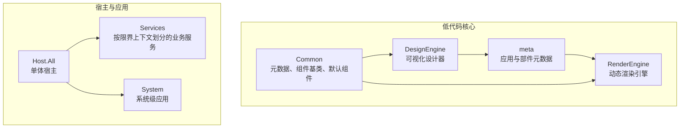
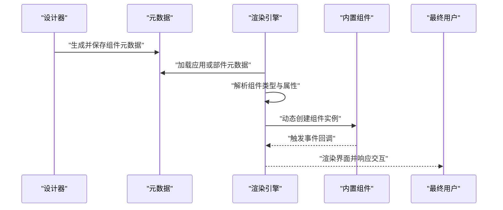
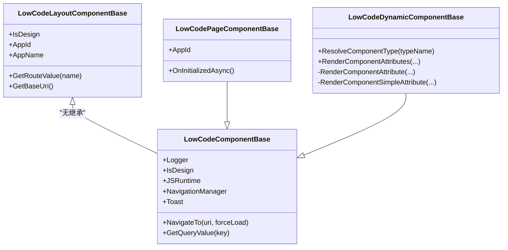
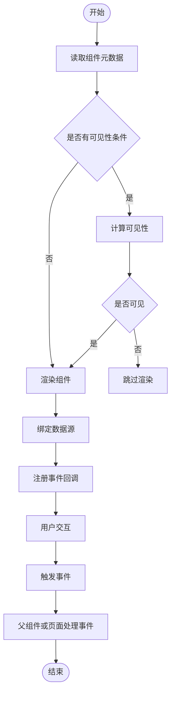
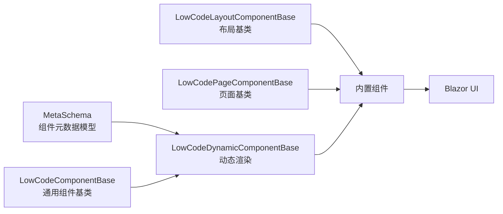

# 内置组件分类与使用

<cite>
**本文引用的文件**   
- [README.md](file://README.md)
- [LowCodeComponentBase.cs](file://src/LowCode/Common/H.LowCode.ComponentBase/LowCodeComponentBase.cs)
- [LowCodeLayoutComponentBase.cs](file://src/LowCode/Common/H.LowCode.ComponentBase/LowCodeLayoutComponentBase.cs)
- [LowCodePageComponentBase.cs](file://src/LowCode/Common/H.LowCode.ComponentBase/LowCodePageComponentBase.cs)
- [LowCodeDynamicComponentBase.cs](file://src/LowCode/Common/H.LowCode.ComponentBase/LowCodeDynamicComponentBase.cs)
- [LowCodeAppState.cs](file://src/LowCode/Common/H.LowCode.ComponentBase/LowCodeAppState.cs)
- [H.LowCode.Components/_Imports.razor](file://src/LowCode/Common/H.LowCode.Components/_Imports.razor)
- [LcTable.razor](file://src/LowCode/Common/H.LowCode.Components/Components/LcTable.razor)
- [LcTabs.razor](file://src/LowCode/Common/H.LowCode.Components/Components/LcTabs.razor)
- [LcList.razor](file://src/LowCode/Common/H.LowCode.Components/Components/LcList.razor)
- [LcSelect.razor](file://src/LowCode/Common/H.LowCode.Components/Components/LcSelect.razor)
- [LcAutoComplete.razor](file://src/LowCode/Common/H.LowCode.Components/Components/LcAutoComplete.razor)
- [LcCascader.razor](file://src/LowCode/Common/H.LowCode.Components/Components/LcCascader.razor)
- [LcTreeSelect.razor](file://src/LowCode/Common/H.LowCode.Components/Components/LcTreeSelect.razor)
- [ComponentSchemaBase.cs](file://src/LowCode/Common/H.LowCode.MetaSchema/ComponentSchemaBase.cs)
- [MetaSchemaBase.cs](file://src/LowCode/Common/H.LowCode.MetaSchema/MetaSchemaBase.cs)
- [AppSchemaBase.cs](file://src/LowCode/Common/H.LowCode.MetaSchema/AppSchemaBase.cs)
</cite>

## 目录
1. [简介](#简介)
2. [项目结构与组件库定位](#项目结构与组件库定位)
3. [内置组件总览](#内置组件总览)
4. [架构概览](#架构概览)
5. [组件基类与动态渲染机制](#组件基类与动态渲染机制)
6. [详细组件说明](#详细组件说明)
7. [组合使用模式与最佳实践](#组合使用模式与最佳实践)
8. [组件选择指南](#组件选择指南)
9. [依赖关系分析](#依赖关系分析)
10. [性能特性与优化建议](#性能特性与优化建议)
11. [可访问性支持说明](#可访问性支持说明)
12. [常见问题排查](#常见问题排查)
13. [结论](#结论)

## 简介
本文面向 H.AppLab 低代码平台的内置组件使用者与维护者，系统性梳理组件库的分类、能力边界、配置方式、事件处理、样式定制方式，以及在不同业务场景中的选型策略。平台基于 .NET 与 Blazor，采用模块化架构；低代码部分由设计引擎产出元数据，渲染引擎根据元数据动态生成页面。内置组件库位于 LowCode 公共组件项目中，通过统一元数据模型描述组件属性、事件、校验规则、可见性条件和数据源。

## 项目结构与组件库定位
从整体仓库结构看，低代码相关能力集中在 `LowCode` 目录下：
- `Common`：元数据 Schema、组件基类、默认组件库等公共实现。
- `DesignEngine`：可视化设计端，负责产出页面与组件的元数据。
- `RenderEngine`：运行时渲染引擎，将元数据转换为实际 UI。
- `meta`：应用与部件的元数据 JSON 存储位置。

README 明确指出 Components 是共享 UI 组件，LowCode 包含元数据 Schema、组件基类和默认组件库；渲染引擎主题基于 Ant Design Blazor。

**图表来源**
- [README.md:1-73](file://README.md#L1-L73)

**章节来源**
- [README.md:1-73](file://README.md#L1-L73)

## 内置组件总览
当前仓库中已暴露的低代码内置组件主要集中在以下 Razor 文件中：
- 表格类：`LcTable.razor`
- 标签页类：`LcTabs.razor`
- 列表类：`LcList.razor`
- 下拉选择类：`LcSelect.razor`
- 自动完成类：`LcAutoComplete.razor`
- 级联选择类：`LcCascader.razor`
- 树选择类：`LcTreeSelect.razor`

这些组件属于“基础 UI 与表单交互”范畴，并通过统一的低代码组件基类与元数据模型接入设计器和渲染器。由于仓库未直接提供每个组件的完整 Razor 源码内容，下文以“能力分类 + 元数据契约 + 基类行为”的方式说明其典型属性、事件、样式和扩展点。

| 分类 | 组件 | 典型用途 | 典型数据形态 | 主要交互 |
|---|---|---|---|---|
| 表格 | LcTable | 展示结构化数据、分页、排序、筛选 | 列表或分页结果 | 点击行、列头、工具栏按钮 |
| 标签页 | LcTabs | 多面板切换、分组信息展示 | Tab 集合 | 切换 Tab、关闭 Tab |
| 列表 | LcList | 简单条目展示、纵向滚动 | 字符串或对象列表 | 点击项、展开收起 |
| 下拉选择 | LcSelect | 单选或多选下拉 | 选项数组 | 选择、清空、搜索过滤 |
| 自动完成 | LcAutoComplete | 输入时实时提示 | 候选列表 | 输入联想、选择补全 |
| 级联选择 | LcCascader | 多级分类选择 | 层级树 | 逐级展开选择 |
| 树选择 | LcTreeSelect | 树形节点选择 | 树形数据 | 勾选节点、展开折叠 |

**章节来源**
- [H.LowCode.Components/_Imports.razor:1-10](file://src/LowCode/Common/H.LowCode.Components/_Imports.razor#L1-L10)
- [LcTable.razor](file://src/LowCode/Common/H.LowCode.Components/Components/LcTable.razor)
- [LcTabs.razor](file://src/LowCode/Common/H.LowCode.Components/Components/LcTabs.razor)
- [LcList.razor](file://src/LowCode/Common/H.LowCode.Components/Components/LcList.razor)
- [LcSelect.razor](file://src/LowCode/Common/H.LowCode.Components/Components/LcSelect.razor)
- [LcAutoComplete.razor](file://src/LowCode/Common/H.LowCode.Components/Components/LcAutoComplete.razor)
- [LcCascader.razor](file://src/LowCode/Common/H.LowCode.Components/Components/LcCascader.razor)
- [LcTreeSelect.razor](file://src/LowCode/Common/H.LowCode.Components/Components/LcTreeSelect.razor)

## 架构概览
低代码组件的使用流程分为三个阶段：
1. **设计阶段**：在设计器中拖拽或配置组件，生成组件元数据。
2. **发布阶段**：应用或部件元数据被保存至 meta 目录或通过仓储服务持久化。
3. **运行阶段**：渲染引擎读取元数据，动态解析组件类型、绑定属性、注册事件、渲染 UI。

**图表来源**
- [README.md:1-73](file://README.md#L1-L73)
- [LowCodeDynamicComponentBase.cs:1-134](file://src/LowCode/Common/H.LowCode.ComponentBase/LowCodeDynamicComponentBase.cs#L1-L134)

## 组件基类与动态渲染机制
低代码组件体系围绕三类基类构建：

### 通用组件基类
`LowCodeComponentBase` 为所有低代码组件提供通用能力，包括：
- 注入日志、导航、JS 互操作、Toast 通知。
- 提供设计时状态标识，便于区分设计与运行环境。
- 提供基础 URI 获取、路由跳转、查询参数读取等辅助方法。

该基类使组件能统一感知设计模式、进行页面跳转、弹出提示，并与 JS 层交互。

### 布局组件基类
`LowCodeLayoutComponentBase` 继承自 Blazor 布局基类，适合容器型组件：
- 提供设计时状态。
- 提供 AppId 与 AppName 解析能力。
- 提供路由参数读取与 BaseUri 获取。

### 页面组件基类
`LowCodePageComponentBase` 继承通用组件基类，面向页面级组件：
- 声明 AppId 参数。
- 提供初始化生命周期钩子。

### 动态组件基类
`LowCodeDynamicComponentBase` 是渲染引擎动态创建组件的核心：
- 根据类型名解析组件类型。
- 将元数据中的属性映射到组件参数。
- 将元数据中的事件名称绑定到组件方法。
- 将 RenderFragment 与 EventCallback 等特殊类型分别处理。
- 将简单值转换为目标 CLR 类型后赋值。

**图表来源**
- [LowCodeComponentBase.cs:1-61](file://src/LowCode/Common/H.LowCode.ComponentBase/LowCodeComponentBase.cs#L1-L61)
- [LowCodeLayoutComponentBase.cs:1-64](file://src/LowCode/Common/H.LowCode.ComponentBase/LowCodeLayoutComponentBase.cs#L1-L64)
- [LowCodePageComponentBase.cs:1-21](file://src/LowCode/Common/H.LowCode.ComponentBase/LowCodePageComponentBase.cs#L1-L21)
- [LowCodeDynamicComponentBase.cs:1-134](file://src/LowCode/Common/H.LowCode.ComponentBase/LowCodeDynamicComponentBase.cs#L1-L134)

**章节来源**
- [LowCodeComponentBase.cs:1-61](file://src/LowCode/Common/H.LowCode.ComponentBase/LowCodeComponentBase.cs#L1-L61)
- [LowCodeLayoutComponentBase.cs:1-64](file://src/LowCode/Common/H.LowCode.ComponentBase/LowCodeLayoutComponentBase.cs#L1-L64)
- [LowCodePageComponentBase.cs:1-21](file://src/LowCode/Common/H.LowCode.ComponentBase/LowCodePageComponentBase.cs#L1-L21)
- [LowCodeDynamicComponentBase.cs:1-134](file://src/LowCode/Common/H.LowCode.ComponentBase/LowCodeDynamicComponentBase.cs#L1-L134)

## 详细组件说明

### 表格组件 LcTable
- **功能定位**：结构化数据展示，适合报表、明细列表、数据管理入口。
- **典型属性**：数据源、列定义、分页、排序、筛选、工具栏按钮、选中行。
- **事件处理**：行点击、列头点击、工具栏事件、分页变化、选中项变化。
- **样式定制**：通过组件样式字段控制宽度、间距、边框、表头样式等。
- **使用建议**：大数据量建议启用分页与虚拟滚动；复杂筛选建议使用服务端分页接口。

**章节来源**
- [LcTable.razor](file://src/LowCode/Common/H.LowCode.Components/Components/LcTable.razor)
- [ComponentSchemaBase.cs:1-110](file://src/LowCode/Common/H.LowCode.MetaSchema/ComponentSchemaBase.cs#L1-L110)

### 标签页组件 LcTabs
- **功能定位**：多面板内容切换，适合模块分区、设置页、详情多视图。
- **典型属性**：Tab 集合、默认激活 Tab、是否可关闭、Tab 位置。
- **事件处理**：切换事件、关闭事件。
- **样式定制**：Tab 间距、激活态样式、头部布局。
- **使用建议**：避免过多 Tab；长列表内容按需懒加载。

**章节来源**
- [LcTabs.razor](file://src/LowCode/Common/H.LowCode.Components/Components/LcTabs.razor)
- [ComponentSchemaBase.cs:1-110](file://src/LowCode/Common/H.LowCode.MetaSchema/ComponentSchemaBase.cs#L1-L110)

### 列表组件 LcList
- **功能定位**：简单条目展示，适合菜单、公告、消息列表。
- **典型属性**：数据项、是否带图标、是否可点击、是否展开详情。
- **事件处理**：点击项、展开收起。
- **样式定制**：项高度、间距、分割线、头像尺寸。
- **使用建议**：纯展示优先；需要编辑能力建议改用表格或表单组合。

**章节来源**
- [LcList.razor](file://src/LowCode/Common/H.LowCode.Components/Components/LcList.razor)
- [ComponentSchemaBase.cs:1-110](file://src/LowCode/Common/H.LowCode.MetaSchema/ComponentSchemaBase.cs#L1-L110)

### 下拉选择组件 LcSelect
- **功能分类**：表单组件。
- **典型属性**：选项集合、是否多选、是否可搜索、是否可清空、占位文本。
- **事件处理**：值变化、打开关闭、搜索关键词变化。
- **验证器**：必填、长度、枚举值匹配。
- **样式定制**：宽度、下拉方向、选项高亮、禁用态。
- **使用建议**：选项较多时启用搜索；远程选项需防抖。

**章节来源**
- [LcSelect.razor](file://src/LowCode/Common/H.LowCode.Components/Components/LcSelect.razor)
- [ComponentSchemaBase.cs:1-110](file://src/LowCode/Common/H.LowCode.MetaSchema/ComponentSchemaBase.cs#L1-L110)

### 自动完成组件 LcAutoComplete
- **功能定位**：输入联想，适合地址、联系人、关键词搜索。
- **典型属性**：候选数据、最小输入长度、延迟时间、最大显示条数。
- **事件处理**：输入变化、选择完成、下拉打开关闭。
- **样式定制**：输入框样式、下拉列表样式、加载指示。
- **使用建议**：对长列表使用服务端联想；避免同步大量候选数据。

**章节来源**
- [LcAutoComplete.razor](file://src/LowCode/Common/H.LowCode.Components/Components/LcAutoComplete.razor)
- [ComponentSchemaBase.cs:1-110](file://src/LowCode/Common/H.LowCode.MetaSchema/ComponentSchemaBase.cs#L1-L110)

### 级联选择组件 LcCascader
- **功能定位**：多级分类选择，适合省市区、组织架构、商品类目。
- **典型属性**：层级数据、是否异步加载、最大层级、显示格式。
- **事件处理**：每级选择变化、最终值变化。
- **样式定制**：级联路径显示、分隔符、下拉宽度。
- **使用建议**：层级深时优先异步加载；避免一次性返回整棵树。

**章节来源**
- [LcCascader.razor](file://src/LowCode/Common/H.LowCode.Components/Components/LcCascader.razor)
- [ComponentSchemaBase.cs:1-110](file://src/LowCode/Common/H.LowCode.MetaSchema/ComponentSchemaBase.cs#L1-L110)

### 树选择组件 LcTreeSelect
- **功能定位**：树形节点选择，适合权限、角色、资源树选择。
- **典型属性**：树数据、是否多选、是否可搜索、是否允许全选。
- **事件处理**：节点勾选变化、搜索变化、展开折叠。
- **样式定制**：节点缩进、选中态、禁用节点。
- **使用建议**：大节点树使用懒加载；多选场景注意选中项集合大小。

**章节来源**
- [LcTreeSelect.razor](file://src/LowCode/Common/H.LowCode.Components/Components/LcTreeSelect.razor)
- [ComponentSchemaBase.cs:1-110](file://src/LowCode/Common/H.LowCode.MetaSchema/ComponentSchemaBase.cs#L1-L110)

## 组合使用模式与最佳实践

### 嵌套结构
- 容器组件通常作为页面骨架，内部嵌套表格、表单、列表等业务组件。
- 表格可嵌入下拉选择、自动完成等控件作为列编辑器。
- 标签页可作为多个表格或列表的分页容器。

### 条件渲染
组件元数据支持可见性条件，可用于：
- 根据用户角色隐藏敏感组件。
- 根据父组件状态显示子组件。
- 在表单不同步骤中切换显示区域。

### 数据绑定
- 表单类组件通过 Value 与 ValueChanged 模式进行双向绑定。
- 表格、列表、树等通过数据源字段绑定集合数据。
- 远程数据应结合分页、搜索、防抖与缓存策略。

### 事件消费
组件元数据支持事件定义与事件消费，便于：
- 子组件向父组件或页面抛出事件。
- 设计器将事件与动作关联。
- 运行时将事件名称映射到组件方法。

**图表来源**
- [ComponentSchemaBase.cs:1-110](file://src/LowCode/Common/H.LowCode.MetaSchema/ComponentSchemaBase.cs#L1-L110)
- [LowCodeDynamicComponentBase.cs:1-134](file://src/LowCode/Common/H.LowCode.ComponentBase/LowCodeDynamicComponentBase.cs#L1-L134)

**章节来源**
- [ComponentSchemaBase.cs:1-110](file://src/LowCode/Common/H.LowCode.MetaSchema/ComponentSchemaBase.cs#L1-L110)
- [LowCodeDynamicComponentBase.cs:1-134](file://src/LowCode/Common/H.LowCode.ComponentBase/LowCodeDynamicComponentBase.cs#L1-L134)

## 组件选择指南

| 业务场景 | 推荐组件 | 理由 |
|---|---|---|
| 展示大量结构化数据 | LcTable | 支持分页、排序、筛选、工具栏，适合数据管理 |
| 分类展示多组内容 | LcTabs | 多面板切换清晰，适合模块分区 |
| 简单列表展示 | LcList | 轻量，适合只读列表 |
| 单项或复选下拉 | LcSelect | 成熟下拉交互，支持搜索与清空 |
| 输入联想 | LcAutoComplete | 输入即提示，适合搜索与补全 |
| 多级分类选择 | LcCascader | 层级直观，适合地区、类目 |
| 树形选择 | LcTreeSelect | 支持树结构与勾选，适合权限与组织 |

**章节来源**
- [LcTable.razor](file://src/LowCode/Common/H.LowCode.Components/Components/LcTable.razor)
- [LcTabs.razor](file://src/LowCode/Common/H.LowCode.Components/Components/LcTabs.razor)
- [LcList.razor](file://src/LowCode/Common/H.LowCode.Components/Components/LcList.razor)
- [LcSelect.razor](file://src/LowCode/Common/H.LowCode.Components/Components/LcSelect.razor)
- [LcAutoComplete.razor](file://src/LowCode/Common/H.LowCode.Components/Components/LcAutoComplete.razor)
- [LcCascader.razor](file://src/LowCode/Common/H.LowCode.Components/Components/LcCascader.razor)
- [LcTreeSelect.razor](file://src/LowCode/Common/H.LowCode.Components/Components/LcTreeSelect.razor)

## 依赖关系分析
低代码组件依赖三层关键抽象：
- 组件基类层：提供设计时状态、导航、日志、Toast、JS 互操作。
- 元数据层：描述组件 ID、名称、类型、样式、事件、校验规则、可见性条件。
- 动态渲染层：将元数据转换为真实组件实例并绑定属性与事件。

**图表来源**
- [LowCodeComponentBase.cs:1-61](file://src/LowCode/Common/H.LowCode.ComponentBase/LowCodeComponentBase.cs#L1-L61)
- [LowCodeLayoutComponentBase.cs:1-64](file://src/LowCode/Common/H.LowCode.ComponentBase/LowCodeLayoutComponentBase.cs#L1-L64)
- [LowCodePageComponentBase.cs:1-21](file://src/LowCode/Common/H.LowCode.ComponentBase/LowCodePageComponentBase.cs#L1-L21)
- [LowCodeDynamicComponentBase.cs:1-134](file://src/LowCode/Common/H.LowCode.ComponentBase/LowCodeDynamicComponentBase.cs#L1-L134)
- [ComponentSchemaBase.cs:1-110](file://src/LowCode/Common/H.LowCode.MetaSchema/ComponentSchemaBase.cs#L1-L110)

**章节来源**
- [LowCodeComponentBase.cs:1-61](file://src/LowCode/Common/H.LowCode.ComponentBase/LowCodeComponentBase.cs#L1-L61)
- [LowCodeLayoutComponentBase.cs:1-64](file://src/LowCode/Common/H.LowCode.ComponentBase/LowCodeLayoutComponentBase.cs#L1-L64)
- [LowCodePageComponentBase.cs:1-21](file://src/LowCode/Common/H.LowCode.ComponentBase/LowCodePageComponentBase.cs#L1-L21)
- [LowCodeDynamicComponentBase.cs:1-134](file://src/LowCode/Common/H.LowCode.ComponentBase/LowCodeDynamicComponentBase.cs#L1-L134)
- [ComponentSchemaBase.cs:1-110](file://src/LowCode/Common/H.LowCode.MetaSchema/ComponentSchemaBase.cs#L1-L110)

## 性能特性与优化建议
根据 README 与技术说明，项目具有以下性能相关特性：
- WebAssembly 懒加载：首页仅加载必要程序集，其他程序集按路由懒加载。
- Release 模式启用 AOT 与裁剪，减少下载体积。
- 自研组合式 DI 支持懒加载后的服务注册。

组件层面的优化建议：
- 表格：启用分页、服务端排序与筛选；避免一次性加载超大数据集。
- 下拉与自动完成：对远程选项使用防抖与最小输入长度限制。
- 级联与树选择：优先异步加载子节点，避免整树传输。
- 标签页：按需加载每个 Tab 的内容，减少首屏压力。
- 条件渲染：使用可见性条件隐藏不需要的组件，降低渲染成本。

**章节来源**
- [README.md:1-73](file://README.md#L1-L73)

## 可访问性支持说明
当前代码未显式暴露完整的可访问性实现细节，但可从以下方面理解：
- 组件基于 Blazor 与 Ant Design Blazor 主题，基础交互由底层 UI 框架提供。
- 组件元数据支持样式与事件，但未见专门的可访问性属性字段。
- 若需增强可访问性，应在具体组件中补充语义化标签、键盘导航、焦点管理与屏幕阅读器文本。

**章节来源**
- [README.md:1-73](file://README.md#L1-L73)
- [ComponentSchemaBase.cs:1-110](file://src/LowCode/Common/H.LowCode.MetaSchema/ComponentSchemaBase.cs#L1-L110)

## 常见问题排查

### 动态组件类型无法解析
- 现象：组件未渲染或页面崩溃。
- 原因：元数据中的组件类型名无法解析。
- 处理：确保类型名有效；渲染逻辑在解析失败时应跳过该节点而非中断整页。

### 属性值类型不匹配
- 现象：组件参数为空或报错。
- 原因：元数据属性类型与实际组件属性类型不一致。
- 处理：检查 AttributeClrType 与 AttributeValue 转换逻辑。

### 事件未触发
- 现象：设计器配置了事件但运行时无效。
- 原因：事件名称未映射到组件可用方法。
- 处理：确认事件方法签名与反射绑定的方法一致。

### 设计模式与运行模式混淆
- 现象：组件行为与设计预期不符。
- 原因：IsDesign 状态判断错误。
- 处理：通过 LowCodeAppState.IsDesign 正确区分设计器与运行环境。

**章节来源**
- [LowCodeDynamicComponentBase.cs:1-134](file://src/LowCode/Common/H.LowCode.ComponentBase/LowCodeDynamicComponentBase.cs#L1-L134)
- [LowCodeAppState.cs:1-14](file://src/LowCode/Common/H.LowCode.ComponentBase/LowCodeAppState.cs#L1-L14)

## 结论
H.AppLab 低代码平台的内置组件库以元数据驱动为核心，通过统一的组件基类与动态渲染机制，将设计器产物转化为可运行的 Blazor 界面。当前仓库中已明确存在的内置组件包括表格、标签页、列表、下拉选择、自动完成、级联选择和树选择。开发者应根据业务场景选择合适的组件，并结合分页、懒加载、条件渲染与事件消费等机制提升性能与可维护性。未来可在组件层面进一步补充可访问性能力与更丰富的样式配置，以满足企业级应用需求。