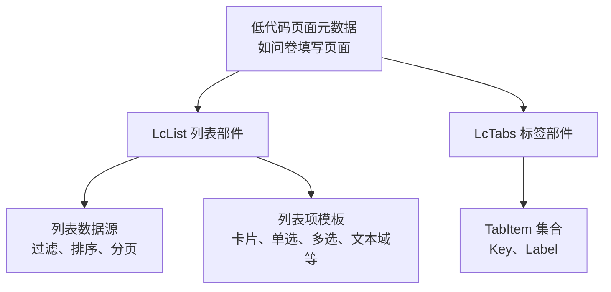
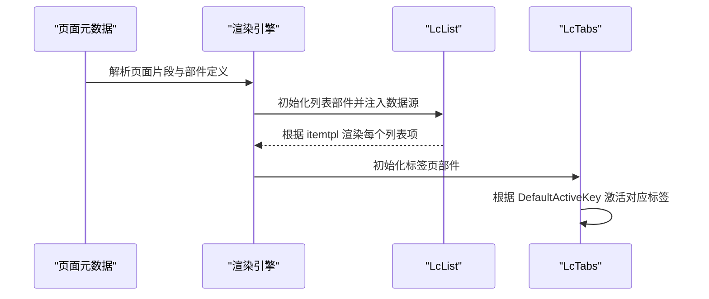
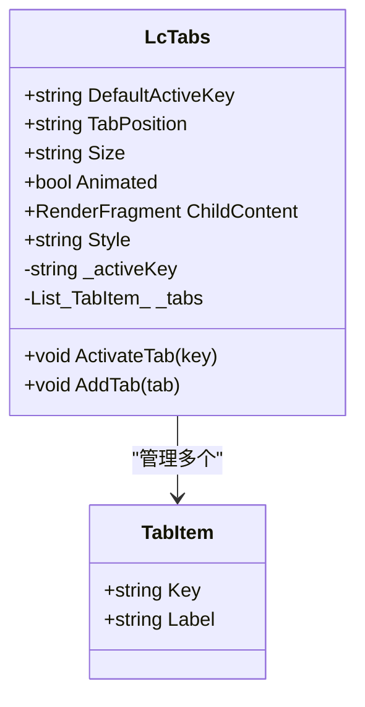
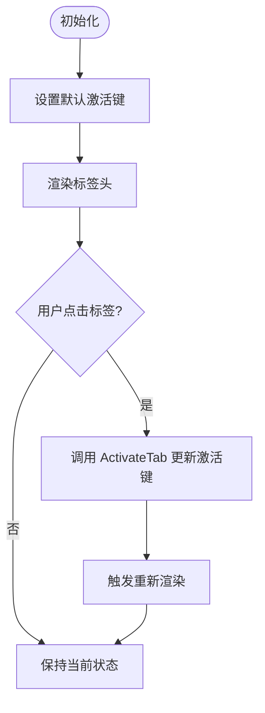
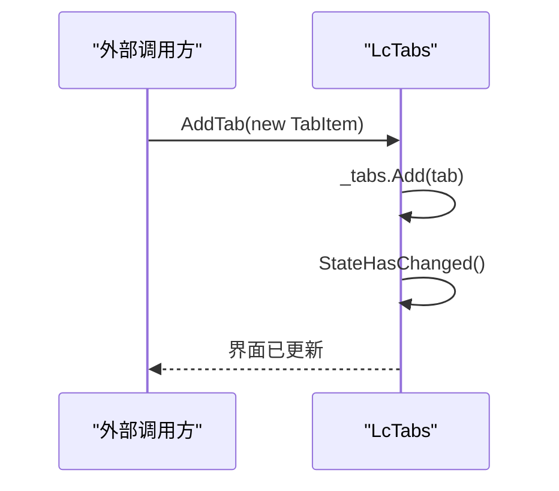
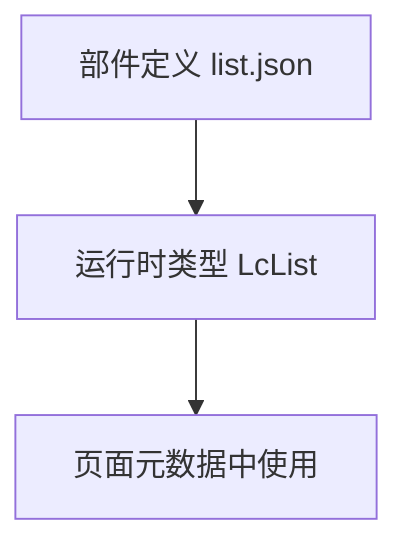
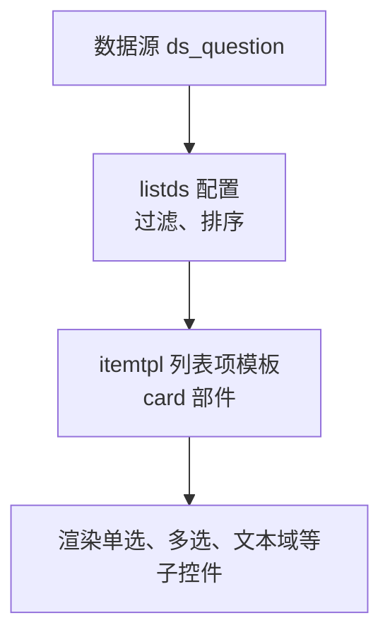
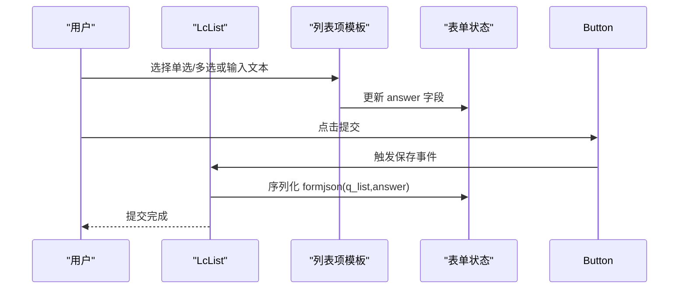
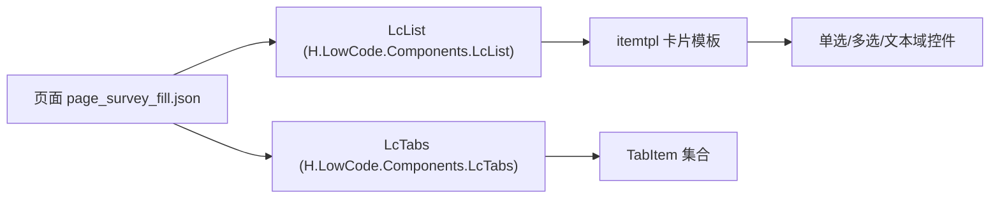

# 布局类组件

<cite>
**本文引用的文件**   
- [LcTabs.razor](file://src/LowCode/Common/H.LowCode.Components/Components/LcTabs.razor)
- [tabs.json](file://src/LowCode/meta/parts/componentParts/default/tabs.json)
- [list.json](file://src/LowCode/meta/parts/componentParts/default/list.json)
- [page_survey_fill.json](file://src/LowCode/meta/apps/survey/page/page_survey_fill.json)
</cite>

## 目录
1. [引言](#引言)
2. [项目结构定位](#项目结构定位)
3. [核心组件概览](#核心组件概览)
4. [架构总览](#架构总览)
5. [LcTabs 标签页组件详解](#lctabs-标签页组件详解)
6. [LcList 列表组件详解](#lcList-列表组件详解)
7. [依赖关系分析](#依赖关系分析)
8. [性能与可访问性建议](#性能与可访问性建议)
9. [常见问题排查](#常见问题排查)
10. [结论](#结论)

## 引言
本文件面向 H.AppLab 低代码平台的使用者，聚焦于两个布局类组件：**LcTabs（标签页）**和 **LcList（列表）**。文档从组件职责、配置属性、渲染机制、交互行为、样式定制、业务场景示例、可访问性与性能优化等维度进行系统化说明，帮助读者在管理界面或表单页面中正确使用这两个组件。

## 项目结构定位
LcTabs 与 LcList 属于低代码平台的通用 UI 组件：
- LcTabs 由 Blazor 组件实现，提供标签头渲染、激活态切换与动态添加 TabItem 的能力。
- LcList 作为低代码元数据中的“部件”存在，其运行时类型引用为 `H.LowCode.Components.LcList`，并在页面元数据中以数据源 + 模板的方式驱动列表项渲染。

**图示来源**
- [page_survey_fill.json](file://src/LowCode/meta/apps/survey/page/page_survey_fill.json)
- [tabs.json](file://src/LowCode/meta/parts/componentParts/default/tabs.json)
- [list.json](file://src/LowCode/meta/parts/componentParts/default/list.json)

**章节来源**
- [LcTabs.razor:1-58](file://src/LowCode/Common/H.LowCode.Components/Components/LcTabs.razor#L1-L58)
- [tabs.json](file://src/LowCode/meta/parts/componentParts/default/tabs.json)
- [list.json](file://src/LowCode/meta/parts/componentParts/default/list.json)

## 核心组件概览
| 组件 | 主要职责 | 关键能力 | 典型使用位置 |
|---|---|---|---|
| LcTabs | 组织多标签页内容 | 默认激活键、标签位置、尺寸、动画、动态添加标签页 | 管理后台的多模块面板 |
| LcList | 按数据源渲染列表项 | 绑定数据源、筛选、排序、模板化渲染、保存提交 | 问卷题目列表、数据展示页 |

**章节来源**
- [LcTabs.razor:1-58](file://src/LowCode/Common/H.LowCode.Components/Components/LcTabs.razor#L1-L58)
- [list.json](file://src/LowCode/meta/parts/componentParts/default/list.json)

## 架构总览
LcTabs 是独立的 Blazor 组件，直接渲染标签头和标签内容容器；LcList 则在低代码渲染引擎中通过“数据源 + 模板”模式工作，由页面元数据声明数据查询条件、排序规则与子项模板。

**图示来源**
- [LcTabs.razor:1-58](file://src/LowCode/Common/H.LowCode.Components/Components/LcTabs.razor#L1-L58)
- [page_survey_fill.json](file://src/LowCode/meta/apps/survey/page/page_survey_fill.json)

## LcTabs 标签页组件详解

### 组件参数
- DefaultActiveKey：默认激活的标签键值。
- TabPosition：标签页的位置。
- Size：标签页的尺寸。
- Animated：是否启用动画效果。
- ChildContent：标签页内容区域插槽。
- Style：组件整体样式。

### 内部状态与行为
- `_activeKey`：当前激活标签的 Key。
- `_tabs`：TabItem 列表，用于渲染标签头。
- `ActivateTab(key)`：点击标签时更新激活状态。
- `AddTab(tab)`：外部调用以动态新增标签页，并触发重新渲染。

**图示来源**
- [LcTabs.razor:1-58](file://src/LowCode/Common/H.LowCode.Components/Components/LcTabs.razor#L1-L58)

### TabItem 配置属性
| 字段 | 含义 | 用法说明 |
|---|---|---|
| Key | 标签唯一标识 | 用于区分不同标签页，并与激活键匹配 |
| Label | 标签显示文本 | 在标签头上显示的标题文本 |

### 激活机制
- 组件初始化时根据 DefaultActiveKey 设置初始激活标签。
- 用户点击标签头时调用 ActivateTab，更新 `_activeKey`，从而高亮对应标签。

**图示来源**
- [LcTabs.razor:1-58](file://src/LowCode/Common/H.LowCode.Components/Components/LcTabs.razor#L1-L58)

### 动态添加标签页
- 通过公共方法 AddTab 向内部 TabItem 列表追加新标签，并调用 StateHasChanged 刷新界面。
- 适合在用户操作后动态扩展功能模块标签。

**图示来源**
- [LcTabs.razor:1-58](file://src/LowCode/Common/H.LowCode.Components/Components/LcTabs.razor#L1-L58)

### 样式定制选项
- Style：传入自定义 CSS 样式字符串，控制容器宽度、高度、边距等。
- 通过 DefaultActiveKey、TabPosition、Size、Animated 控制基础视觉行为。
- 若需要更精细的样式控制，可在宿主页面中使用外层容器或覆盖 hc-tabs、hc-tab-item、hc-tab-active 等类名对应的样式。

**章节来源**
- [LcTabs.razor:1-58](file://src/LowCode/Common/H.LowCode.Components/Components/LcTabs.razor#L1-L58)
- [tabs.json](file://src/LowCode/meta/parts/componentParts/default/tabs.json)

## LcList 列表组件详解

### 部件定义与运行类型
- 部件 ID：list
- 运行时类型：H.LowCode.Components.LcList
- 默认样式：Style 设置为宽度 100%

**图示来源**
- [list.json](file://src/LowCode/meta/parts/componentParts/default/list.json)

### 数据源与列表项模板
在问卷填写页面中，LcList 的数据源配置包括：
- 数据源类型与 ID：例如 ds_question
- 列表数据源 listds：包含数据来源表 dsid、过滤条件 flts、排序 orderby
- 列表项模板 itemtpl：使用 card 部件，并通过 $(item.f_order)、$(item.f_title) 等表达式绑定字段
- 条件可见 vcond：根据 form 中的答案决定是否显示某条记录

**图示来源**
- [page_survey_fill.json](file://src/LowCode/meta/apps/survey/page/page_survey_fill.json)

### 数据结构与字段约定
- item：当前列表项对象，字段名与数据源一致，例如 f_order、f_title、f_link_qid、f_options_json、f_question_type、f_link_value 等。
- form：表单状态容器，用于收集各输入控件的值，例如 answer。
- 表达式语法：$(...) 用于在模板中读取数据或执行函数。

### 渲染模式
- 基于 itemtpl 的模板渲染：每个列表项使用同一模板实例，但绑定不同的 item 数据。
- 子控件根据字段动态显示：例如根据 f_question_type 显示单选、多选或文本域。
- 条件可见：vcond 表达式决定某个列表项是否渲染。

### 交互行为
- 列表项内嵌单选、多选、文本域等表单控件，用户在列表中直接填写答案。
- 可通过按钮事件将表单数据保存到另一个数据源，例如 ds_submission，并使用 $(formjson(q_list,answer)) 序列化答案。

**图示来源**
- [page_survey_fill.json](file://src/LowCode/meta/apps/survey/page/page_survey_fill.json)

### 样式定制选项
- Style：在部件定义中支持传入样式字符串，例如 width:100%。
- 模板内可使用 card 部件的样式类与 style 属性，控制边框、悬浮效果、间距等。
- 子控件（单选、多选、文本域）也各自支持样式类与属性，便于统一视觉风格。

**章节来源**
- [list.json](file://src/LowCode/meta/parts/componentParts/default/list.json)
- [page_survey_fill.json](file://src/LowCode/meta/apps/survey/page/page_survey_fill.json)

## 依赖关系分析

**图示来源**
- [page_survey_fill.json](file://src/LowCode/meta/apps/survey/page/page_survey_fill.json)
- [LcTabs.razor:1-58](file://src/LowCode/Common/H.LowCode.Components/Components/LcTabs.razor#L1-L58)

**章节来源**
- [page_survey_fill.json](file://src/LowCode/meta/apps/survey/page/page_survey_fill.json)
- [LcTabs.razor:1-58](file://src/LowCode/Common/H.LowCode.Components/Components/LcTabs.razor#L1-L58)

## 性能与可访问性建议

### 大量数据渲染优化
- 列表分页：在数据源层限制返回数量，避免一次性加载过多数据。
- 虚拟滚动：当列表项较多时，采用可视区域渲染策略减少 DOM 节点数量。
- 模板复用：确保 itemtpl 尽可能轻量，避免在每个列表项中执行复杂计算。
- 懒加载：仅在标签激活时加载该标签页下的重型内容，减少初始渲染压力。
- 防抖与节流：对搜索、筛选、排序等频繁操作做防抖处理，降低渲染频率。

### 可访问性与键盘导航
- 标签页：为标签头元素增加语义化标记与焦点管理，支持方向键切换标签，Enter 确认激活。
- 列表项：为可交互控件提供清晰的 aria-label 与 role，确保屏幕阅读器可读。
- 表单控件：为单选、多选、文本域提供 label 关联与错误提示的可访问性属性。

[本节为通用指导，不直接分析具体文件]

## 常见问题排查

| 问题 | 可能原因 | 处理方法 |
|---|---|---|
| 标签未激活 | DefaultActiveKey 与 TabItem.Key 不一致 | 检查默认激活键是否与某个 TabItem.Key 完全匹配 |
| 动态添加标签无效 | 未调用 AddTab 或未触发重新渲染 | 确认调用 AddTab 后组件是否调用 StateHasChanged |
| 列表为空 | 数据源无数据或过滤条件过严 | 检查 listds 的过滤条件 flts 与数据源 dsid 是否正确 |
| 列表项未按预期显示 | 条件可见表达式错误 | 检查 vcond 表达式与 form 中字段值是否匹配 |
| 样式不生效 | 样式类名或 Style 属性未正确传递 | 检查部件定义中的 Style 与模板内的 class/style 属性 |

**章节来源**
- [LcTabs.razor:1-58](file://src/LowCode/Common/H.LowCode.Components/Components/LcTabs.razor#L1-L58)
- [page_survey_fill.json](file://src/LowCode/meta/apps/survey/page/page_survey_fill.json)

## 结论
LcTabs 与 LcList 是 H.AppLab 低代码平台中常用的布局与展示组件。LcTabs 提供简洁的标签页组织与动态管理能力，适合在管理界面中划分功能模块；LcList 通过数据源与模板机制，能够灵活地渲染复杂列表与表单交互。在实际项目中，应结合分页、虚拟滚动与懒加载等策略优化性能，并通过语义化与键盘导航提升可访问性。

[本节为总结性内容，不直接分析具体文件]