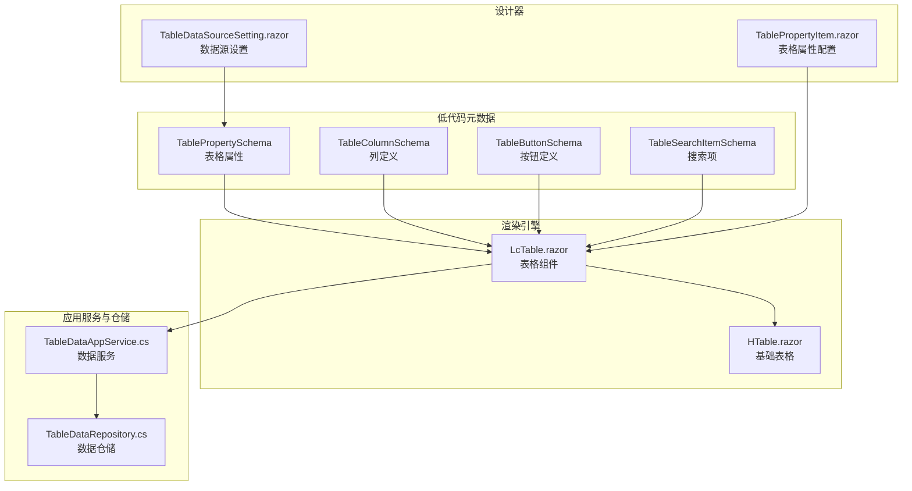
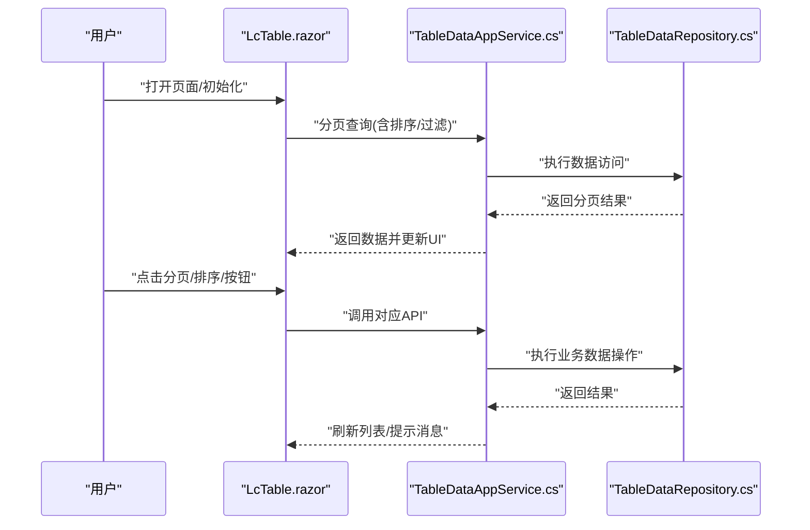
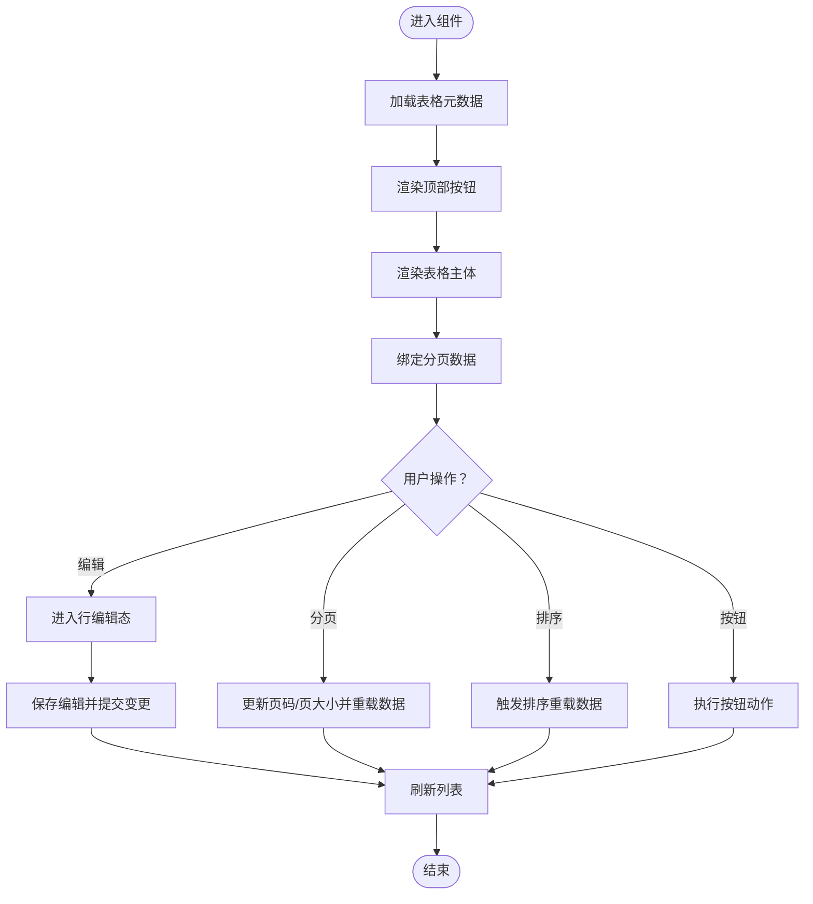
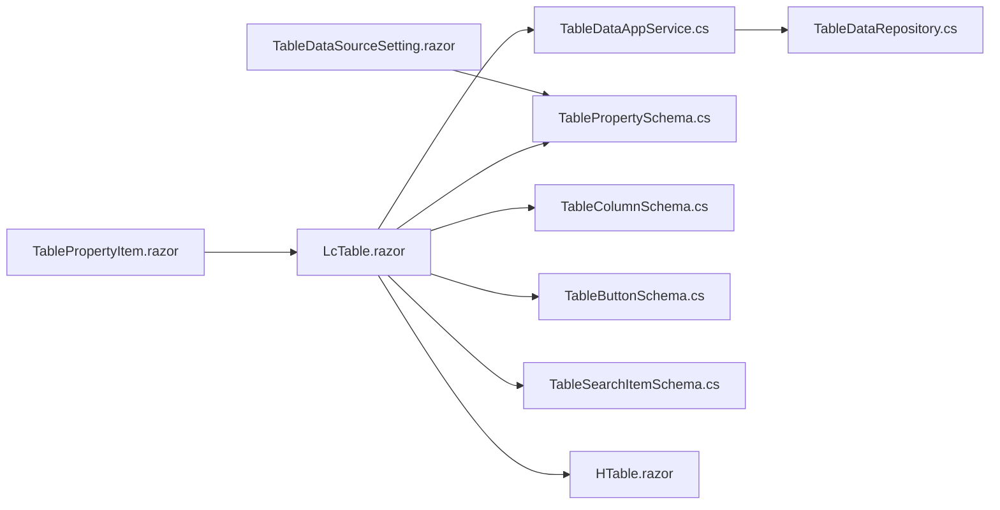

# 数据展示类组件

<cite>
**本文引用的文件**   
- [LcTable.razor](file://src/src/LowCode/Common/H.LowCode.Components/Components/LcTable.razor)
- [TablePropertySchema.cs](file://src/src/LowCode/Common/H.LowCode.MetaSchema/PropertySchemas/TableSchemas/TablePropertySchema.cs)
- [TableColumnSchema.cs](file://src/src/LowCode/Common/H.LowCode.MetaSchema/PropertySchemas/TableSchemas/TableColumnSchema.cs)
- [TableButtonSchema.cs](file://src/src/LowCode/Common/H.LowCode.MetaSchema/PropertySchemas/TableSchemas/TableButtonSchema.cs)
- [TableSearchItemSchema.cs](file://src/src/LowCode/Common/H.LowCode.MetaSchema/PropertySchemas/TableSchemas/TableSearchItemSchema.cs)
- [HlTable.razor](file://src/src/Utils/H.Util.Blazor/Components/HTable.razor)
- [TableDataAppService.cs](file://src/src/LowCode/RenderEngine/H.LowCode.RenderEngine.Application/DataAppServices/TableDataAppService.cs)
- [TableDataRepository.cs](file://src/src/LowCode/RenderEngine/H.LowCode.RenderEngine.EntityFrameworkCore/DataRepositories/TableDataRepository.cs)
- [TableDataSourceSetting.razor](file://src/src/LowCode/DesignEngine/H.LowCode.DesignEngine/SettingPanel/PropertySettingItems/TableDataSource/TableDataSourceSetting.razor)
- [ComponentPropertyItems/TablePropertyItem.razor](file://src/src/LowCode/DesignEngine/H.LowCode.DesignEngine/SettingPanel/PropertySettingItems/ComponentPropertyItems/TablePropertyItem.razor)
</cite>

## 目录
1. [引言](#引言)
2. [项目结构定位](#项目结构定位)
3. [核心组件概览](#核心组件概览)
4. [架构总览](#架构总览)
5. [详细组件分析](#详细组件分析)
6. [依赖关系分析](#依赖关系分析)
7. [性能与可访问性](#性能与可访问性)
8. [故障排查指南](#故障排查指南)
9. [结论](#结论)
10. [附录：常见业务场景](#附录常见业务场景)

## 引言
本文面向 H.AppLab 低代码平台的数据展示类组件，重点围绕 LcTable（表格）组件的使用与扩展。内容涵盖列定义、数据绑定、分页、排序、顶部按钮与行操作、编辑模式、样式定制、复杂 CRUD 场景、性能优化与可访问性支持。读者无需深入源码即可快速上手；如需深入定制，文档同时提供与源码对应的参考路径。

## 项目结构定位
LcTable 是低代码渲染层中的表格组件，负责将元数据驱动的配置渲染为可视化的数据表格，并与数据服务交互完成查询、分页、新增、修改、删除等操作。其配置模型位于 MetaSchema 层，由设计器生成，运行时由 LcTable 消费。

图表来源
- [LcTable.razor:1-10](file://src/src/LowCode/Common/H.LowCode.Components/Components/LcTable.razor#L1-L10)
- [TablePropertySchema.cs](file://src/src/LowCode/Common/H.LowCode.MetaSchema/PropertySchemas/TableSchemas/TablePropertySchema.cs)
- [TableColumnSchema.cs](file://src/src/LowCode/Common/H.LowCode.MetaSchema/PropertySchemas/TableSchemas/TableColumnSchema.cs)
- [TableButtonSchema.cs](file://src/src/LowCode/Common/H.LowCode.MetaSchema/PropertySchemas/TableSchemas/TableButtonSchema.cs)
- [TableSearchItemSchema.cs](file://src/src/LowCode/Common/H.LowCode.MetaSchema/PropertySchemas/TableSchemas/TableSearchItemSchema.cs)
- [HlTable.razor](file://src/src/Utils/H.Util.Blazor/Components/HTable.razor)
- [TableDataAppService.cs](file://src/src/LowCode/RenderEngine/H.LowCode.RenderEngine.Application/DataAppServices/TableDataAppService.cs)
- [TableDataRepository.cs](file://src/src/LowCode/RenderEngine/H.LowCode.RenderEngine.EntityFrameworkCore/DataRepositories/TableDataRepository.cs)
- [TableDataSourceSetting.razor](file://src/src/LowCode/DesignEngine/H.LowCode.DesignEngine/SettingPanel/PropertySettingItems/TableDataSource/TableDataSourceSetting.razor)
- [ComponentPropertyItems/TablePropertyItem.razor](file://src/src/LowCode/DesignEngine/H.LowCode.DesignEngine/SettingPanel/PropertySettingItems/ComponentPropertyItems/TablePropertyItem.razor)

章节来源
- [LcTable.razor:1-10](file://src/src/LowCode/Common/H.LowCode.Components/Components/LcTable.razor#L1-L10)

## 核心组件概览
- LcTable.razor：低代码表格组件，基于元数据配置渲染表头、行数据、顶部按钮、分页控件，并提供行内编辑能力。
- 表格元数据模型：包含表格属性、列定义、按钮定义和搜索项等，用于驱动 UI 行为。
- 基础表格 HTable.razor：底层表格容器，LcTable 在其之上封装业务逻辑。
- TableDataAppService：统一的数据访问服务，负责分页查询、增删改等 API 调用。
- TableDataRepository：数据仓储实现，对接具体数据源。

章节来源
- [LcTable.razor:1-10](file://src/src/LowCode/Common/H.LowCode.Components/Components/LcTable.razor#L1-L10)
- [HlTable.razor](file://src/src/Utils/H.Util.Blazor/Components/HTable.razor)
- [TableDataAppService.cs](file://src/src/LowCode/RenderEngine/H.LowCode.RenderEngine.Application/DataAppServices/TableDataAppService.cs)
- [TableDataRepository.cs](file://src/src/LowCode/RenderEngine/H.LowCode.RenderEngine.EntityFrameworkCore/DataRepositories/TableDataRepository.cs)

## 架构总览
LcTable 的运行时流程如下：
- 加载元数据：从设计器生成的配置中解析表格属性、列定义、按钮与搜索项。
- 渲染界面：根据列定义渲染表头与单元格，根据按钮定义渲染顶部按钮。
- 数据交互：通过 TableDataAppService 获取分页数据，并在用户触发分页、排序或编辑时发起请求。
- 状态管理：维护当前页码、每页条数、选中行、编辑态行集合等状态。

图表来源
- [LcTable.razor:1-10](file://src/src/LowCode/Common/H.LowCode.Components/Components/LcTable.razor#L1-L10)
- [TableDataAppService.cs](file://src/src/LowCode/RenderEngine/H.LowCode.RenderEngine.Application/DataAppServices/TableDataAppService.cs)
- [TableDataRepository.cs](file://src/src/LowCode/RenderEngine/H.LowCode.RenderEngine.EntityFrameworkCore/DataRepositories/TableDataRepository.cs)

## 详细组件分析

### LcTable 组件
- 继承与注入：组件继承低代码基类，并注入 JSRuntime 与 TableDataAppService。
- 渲染结构：包含顶部按钮区域、数据表格主体、分页控制区。
- 数据绑定：表格主体基于列定义渲染字段显示与编辑输入框。
- 分页处理：维护当前页码与每页条数，提供上一页/下一页切换与页大小选择。
- 事件处理：顶部按钮点击后统一走按钮动作方法；行操作由列定义或内部逻辑触发。

关键实现要点
- 顶部按钮：根据 TopButtons 配置循环渲染，支持禁用状态与点击回调。
- 表格主体：按 Column 配置渲染表头与单元格，编辑模式下对可编辑列渲染输入控件。
- 分页控件：根据总记录数计算页码范围，页大小变化时触发重新查询。
- 编辑模式：维护编辑行字典，按主键定位行数据并进行双向绑定。

图表来源
- [LcTable.razor:10-16](file://src/src/LowCode/Common/H.LowCode.Components/Components/LcTable.razor#L10-L16)
- [LcTable.razor:18-19](file://src/src/LowCode/Common/H.LowCode.Components/Components/LcTable.razor#L18-L19)
- [LcTable.razor:81-88](file://src/src/LowCode/Common/H.LowCode.Components/Components/LcTable.razor#L81-L88)
- [LcTable.razor:121-121](file://src/src/LowCode/Common/H.LowCode.Components/Components/LcTable.razor#L121-L121)

章节来源
- [LcTable.razor:1-10](file://src/src/LowCode/Common/H.LowCode.Components/Components/LcTable.razor#L1-L10)
- [LcTable.razor:10-16](file://src/src/LowCode/Common/H.LowCode.Components/Components/LcTable.razor#L10-L16)
- [LcTable.razor:18-19](file://src/src/LowCode/Common/H.LowCode.Components/Components/LcTable.razor#L18-L19)
- [LcTable.razor:81-88](file://src/src/LowCode/Common/H.LowCode.Components/Components/LcTable.razor#L81-L88)
- [LcTable.razor:121-121](file://src/src/LowCode/Common/H.LowCode.Components/Components/LcTable.razor#L121-L121)

### 表格元数据模型
- TablePropertySchema：描述表格整体属性，如是否启用分页、排序、筛选、编辑模式、顶部按钮集合等。
- TableColumnSchema：描述单列属性，包括字段名、标题、宽度、对齐方式、是否可编辑、是否参与搜索/排序、格式化规则等。
- TableButtonSchema：描述顶部按钮，包括标题、禁用条件、图标、点击动作等。
- TableSearchItemSchema：描述搜索面板中的筛选项，包括字段映射、控件类型、默认值等。

建议用法
- 在设计器中通过 TableDataSourceSetting.razor 配置数据源，再通过 TablePropertyItem.razor 调整表格属性与列定义。
- 在运行时代码中，通过 TableDataAppService 提供的接口进行数据交互，避免直接操作仓储。

章节来源
- [TablePropertySchema.cs](file://src/src/LowCode/Common/H.LowCode.MetaSchema/PropertySchemas/TableSchemas/TablePropertySchema.cs)
- [TableColumnSchema.cs](file://src/src/LowCode/Common/H.LowCode.MetaSchema/PropertySchemas/TableSchemas/TableColumnSchema.cs)
- [TableButtonSchema.cs](file://src/src/LowCode/Common/H.LowCode.MetaSchema/PropertySchemas/TableSchemas/TableButtonSchema.cs)
- [TableSearchItemSchema.cs](file://src/src/LowCode/Common/H.LowCode.MetaSchema/PropertySchemas/TableSchemas/TableSearchItemSchema.cs)
- [TableDataSourceSetting.razor](file://src/src/LowCode/DesignEngine/H.LowCode.DesignEngine/SettingPanel/PropertySettingItems/TableDataSource/TableDataSourceSetting.razor)
- [ComponentPropertyItems/TablePropertyItem.razor](file://src/src/LowCode/DesignEngine/H.LowCode.DesignEngine/SettingPanel/PropertySettingItems/ComponentPropertyItems/TablePropertyItem.razor)

### 数据服务与仓储
- TableDataAppService：对外暴露分页查询、新增、修改、删除等应用级方法，供 LcTable 调用。
- TableDataRepository：实现具体数据访问逻辑，例如数据库读写、外部 API 适配等。

职责边界
- LcTable 只关心 UI 状态与用户交互，不直接访问数据库。
- TableDataAppService 聚合业务校验、事务、异常处理与日志记录。
- TableDataRepository 专注数据持久化细节。

章节来源
- [TableDataAppService.cs](file://src/src/LowCode/RenderEngine/H.LowCode.RenderEngine.Application/DataAppServices/TableDataAppService.cs)
- [TableDataRepository.cs](file://src/src/LowCode/RenderEngine/H.LowCode.RenderEngine.EntityFrameworkCore/DataRepositories/TableDataRepository.cs)

## 依赖关系分析
- LcTable 依赖：
  - 低代码基类与 JSRuntime：用于脚本调用与组件生命周期。
  - TableDataAppService：用于数据获取与提交。
  - 表格元数据模型：用于渲染与行为控制。
- 设计器依赖：
  - TableDataSourceSetting.razor：配置数据源。
  - TablePropertyItem.razor：配置表格属性与列定义。
- 基础组件依赖：
  - HTable.razor：作为底层表格容器，提供基础渲染能力。

图表来源
- [LcTable.razor:1-10](file://src/src/LowCode/Common/H.LowCode.Components/Components/LcTable.razor#L1-L10)
- [TableDataAppService.cs](file://src/src/LowCode/RenderEngine/H.LowCode.RenderEngine.Application/DataAppServices/TableDataAppService.cs)
- [TableDataRepository.cs](file://src/src/LowCode/RenderEngine/H.LowCode.RenderEngine.EntityFrameworkCore/DataRepositories/TableDataRepository.cs)
- [TableDataSourceSetting.razor](file://src/src/LowCode/DesignEngine/H.LowCode.DesignEngine/SettingPanel/PropertySettingItems/TableDataSource/TableDataSourceSetting.razor)
- [ComponentPropertyItems/TablePropertyItem.razor](file://src/src/LowCode/DesignEngine/H.LowCode.DesignEngine/SettingPanel/PropertySettingItems/ComponentPropertyItems/TablePropertyItem.razor)

章节来源
- [LcTable.razor:1-10](file://src/src/LowCode/Common/H.LowCode.Components/Components/LcTable.razor#L1-L10)

## 性能与可访问性

### 性能优化策略
- 分页优先：始终启用服务端分页，避免一次性加载全量数据。
- 懒加载：仅在需要时加载列扩展信息（如详情弹窗），减少首屏开销。
- 虚拟滚动：当列较多或行高较大时，考虑使用虚拟化渲染以减少 DOM 节点数量。
- 批量操作：合并多次写操作，减少网络往返；必要时引入确认对话框与进度反馈。
- 防抖节流：对搜索与筛选输入进行防抖，避免频繁请求。
- 缓存策略：对静态字典与下拉选项做客户端缓存，降低重复请求。

章节来源
- [LcTable.razor:81-88](file://src/src/LowCode/Common/H.LowCode.Components/Components/LcTable.razor#L81-L88)

### 可访问性支持
- 键盘导航：确保分页按钮、顶部按钮与行操作可通过 Tab 聚焦与回车触发。
- 屏幕阅读器：为按钮与输入控件提供语义化标签与描述。
- 对比度与主题：遵循主题色规范，保证文本与背景对比度满足无障碍标准。
- 错误提示：表单验证失败时给出明确错误信息与定位。

章节来源
- [LcTable.razor:10-16](file://src/src/LowCode/Common/H.LowCode.Components/Components/LcTable.razor#L10-L16)

## 故障排查指南
常见问题与对策
- 数据为空：检查 TableDataAppService 返回的分页结构与字段映射是否正确。
- 分页无效：确认 _pageIndex 与 _pageSize 状态更新与重载逻辑是否一致。
- 编辑未生效：核对编辑行主键是否唯一且与数据源一致。
- 按钮无响应：检查按钮 Disabled 条件与事件绑定是否完整。
- 样式错乱：确认 CSS 类名与主题变量未被覆盖。

章节来源
- [LcTable.razor:81-88](file://src/src/LowCode/Common/H.LowCode.Components/Components/LcTable.razor#L81-L88)
- [LcTable.razor:10-16](file://src/src/LowCode/Common/H.LowCode.Components/Components/LcTable.razor#L10-L16)

## 结论
LcTable 以元数据驱动的方式提供了开箱即用的表格能力，适合在低代码平台中快速构建数据管理界面。通过合理的列定义、按钮配置与数据服务集成，可以实现完整的 CRUD 流程。在生产环境中，应结合分页、懒加载、虚拟滚动与缓存策略提升性能，并通过语义化标签与键盘可达性增强可访问性。

## 附录：常见业务场景

### 数据管理界面的完整 CRUD
- 新增：通过顶部“新增”按钮打开表单或行内编辑，提交后刷新列表。
- 查询：利用搜索项配置筛选条件，结合分页与排序提高检索效率。
- 编辑：开启列的可编辑属性，保存时进行表单验证与后端校验。
- 删除：行操作按钮触发二次确认，成功后刷新列表并提示。
- 批量操作：勾选多行后执行批量删除或状态变更，减少重复操作。

章节来源
- [LcTable.razor:10-16](file://src/src/LowCode/Common/H.LowCode.Components/Components/LcTable.razor#L10-L16)
- [TableDataAppService.cs](file://src/src/LowCode/RenderEngine/H.LowCode.RenderEngine.Application/DataAppServices/TableDataAppService.cs)