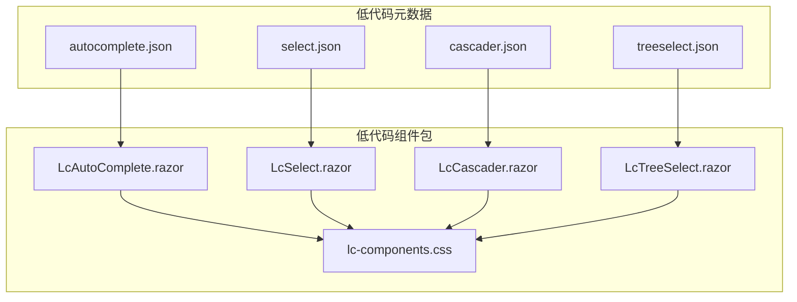
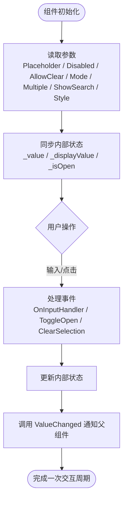
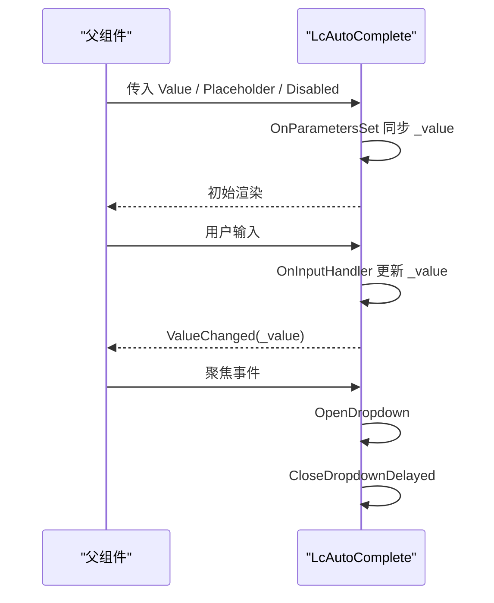
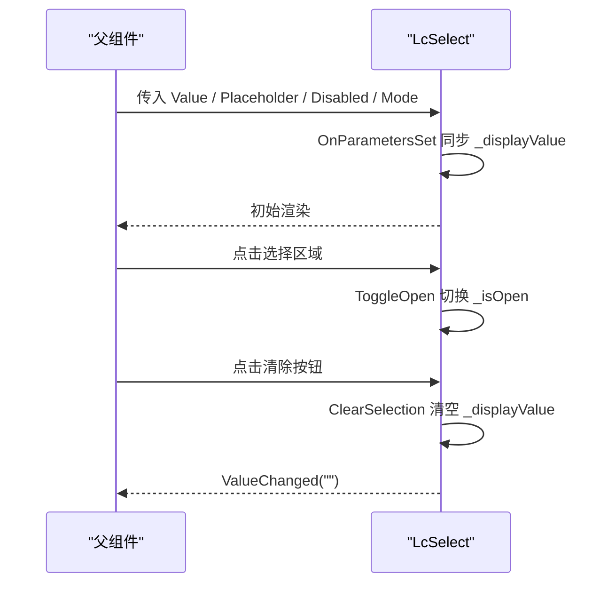
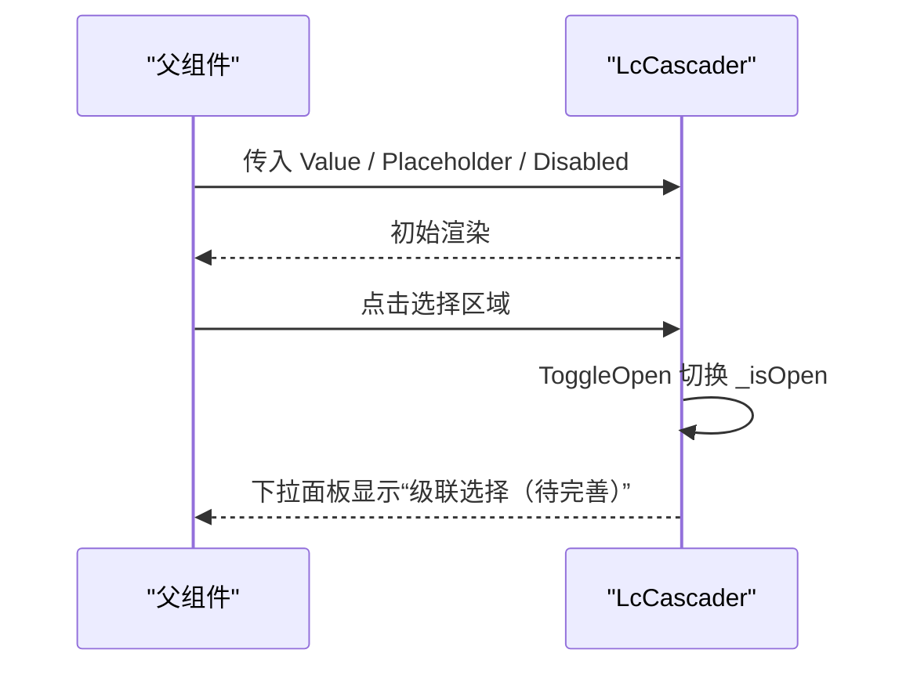
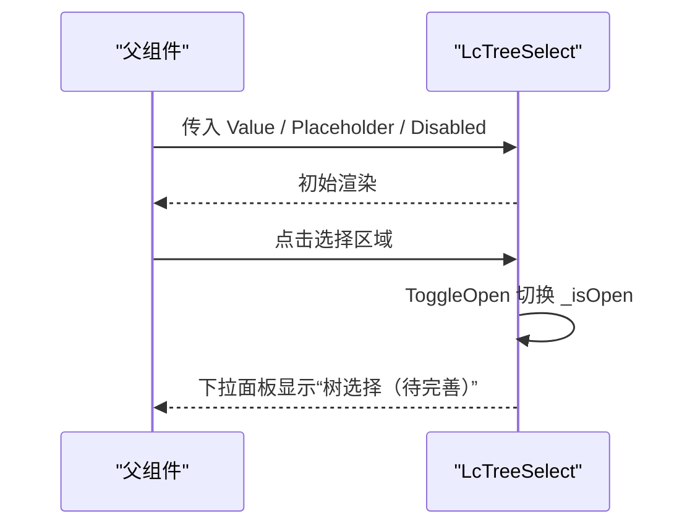
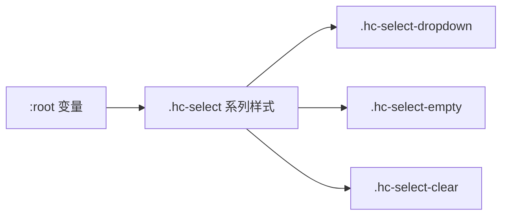
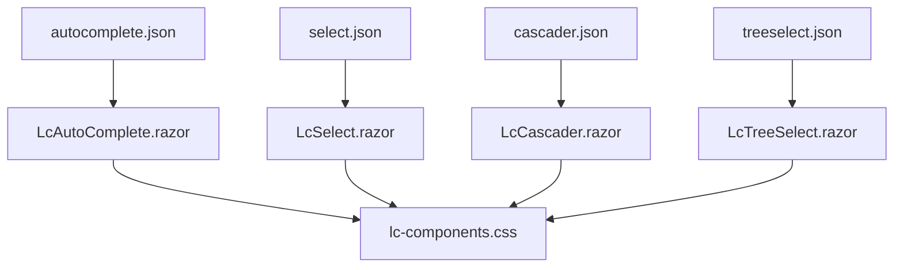

# 输入类组件

<cite>
**本文引用的文件**   
- [LcAutoComplete.razor](file://src/LowCode/Common/H.LowCode.Components/Components/LcAutoComplete.razor)
- [LcSelect.razor](file://src/LowCode/Common/H.LowCode.Components/Components/LcSelect.razor)
- [LcCascader.razor](file://src/LowCode/Common/H.LowCode.Components/Components/LcCascader.razor)
- [LcTreeSelect.razor](file://src/LowCode/Common/H.LowCode.Components/Components/LcTreeSelect.razor)
- [lc-components.css](file://src/LowCode/Common/H.LowCode.Components/wwwroot/lc-components.css)
- [autocomplete.json](file://src/LowCode/meta/parts/componentParts/default/autocomplete.json)
- [select.json](file://src/LowCode/meta/parts/componentParts/default/select.json)
- [cascader.json](file://src/LowCode/meta/parts/componentParts/default/cascader.json)
- [treeselect.json](file://src/LowCode/meta/parts/componentParts/default/treeselect.json)
</cite>

## 目录
1. [简介](#简介)
2. [项目结构定位](#项目结构定位)
3. [核心组件总览](#核心组件总览)
4. [架构与数据流](#架构与数据流)
5. [组件详解](#组件详解)
6. [样式定制与主题适配](#样式定制与主题适配)
7. [表单组合使用模式](#表单组合使用模式)
8. [依赖关系分析](#依赖关系分析)
9. [性能优化建议](#性能优化建议)
10. [故障排查指南](#故障排查指南)
11. [结论](#结论)

## 简介
本章节面向 H.AppLab 低代码平台的“输入类组件”，重点覆盖以下四个组件：
- LcAutoComplete（自动完成）
- LcSelect（选择器）
- LcCascader（级联选择器）
- LcTreeSelect（树形选择器）

这些组件用于在页面或表单中提供用户输入、选项选择和值变更能力，支持基础属性如 Placeholder、Disabled、AllowClear、Value、ValueChanged，以及事件回调和样式定制。它们通过统一的容器样式和下拉交互模式保持一致的用户体验。

## 项目结构定位
这四个组件位于低代码公共组件库中，采用 Blazor Razor 组件实现，配套样式文件位于同一组件包的 wwwroot 目录下。同时，低代码元数据定义了各组件的属性分组、默认值和展示标签，便于在设计引擎中进行可视化配置。

**图表来源**
- [LcAutoComplete.razor:1-63](file://src/LowCode/Common/H.LowCode.Components/Components/LcAutoComplete.razor#L1-L63)
- [LcSelect.razor:1-61](file://src/LowCode/Common/H.LowCode.Components/Components/LcSelect.razor#L1-L61)
- [LcCascader.razor:1-33](file://src/LowCode/Common/H.LowCode.Components/Components/LcCascader.razor#L1-L33)
- [LcTreeSelect.razor:1-29](file://src/LowCode/Common/H.LowCode.Components/Components/LcTreeSelect.razor#L1-L29)
- [lc-components.css:1-200](file://src/LowCode/Common/H.LowCode.Components/wwwroot/lc-components.css#L1-L200)
- [autocomplete.json:1-1](file://src/LowCode/meta/parts/componentParts/default/autocomplete.json#L1-L1)
- [select.json:1-1](file://src/LowCode/meta/parts/componentParts/default/select.json#L1-L1)
- [cascader.json:1-1](file://src/LowCode/meta/parts/componentParts/default/cascader.json#L1-L1)
- [treeselect.json:1-1](file://src/LowCode/meta/parts/componentParts/default/treeselect.json#L1-L1)

**章节来源**
- [LcAutoComplete.razor:1-63](file://src/LowCode/Common/H.LowCode.Components/Components/LcAutoComplete.razor#L1-L63)
- [LcSelect.razor:1-61](file://src/LowCode/Common/H.LowCode.Components/Components/LcSelect.razor#L1-L61)
- [LcCascader.razor:1-33](file://src/LowCode/Common/H.LowCode.Components/Components/LcCascader.razor#L1-L33)
- [LcTreeSelect.razor:1-29](file://src/LowCode/Common/H.LowCode.Components/Components/LcTreeSelect.razor#L1-L29)
- [lc-components.css:1-200](file://src/LowCode/Common/H.LowCode.Components/wwwroot/lc-components.css#L1-L200)
- [autocomplete.json:1-1](file://src/LowCode/meta/parts/componentParts/default/autocomplete.json#L1-L1)
- [select.json:1-1](file://src/LowCode/meta/parts/componentParts/default/select.json#L1-L1)
- [cascader.json:1-1](file://src/LowCode/meta/parts/componentParts/default/cascader.json#L1-L1)
- [treeselect.json:1-1](file://src/LowCode/meta/parts/componentParts/default/treeselect.json#L1-L1)

## 核心组件总览
- LcAutoComplete：文本输入框配合下拉面板，支持输入事件与值变更回调，可设置禁用、清除按钮、选中回填等。
- LcSelect：点击触发的下拉选择器，支持显示搜索框、选择模式、边框、禁用、清除按钮等。
- LcCascader：级联选择占位组件，当前仅展示下拉面板与提示文案，待完善实际级联逻辑。
- LcTreeSelect：树形选择占位组件，当前仅展示下拉面板与提示文案，待完善实际树节点交互。

共同点：
- 统一使用 hc-select-wrapper、hc-select、hc-select-dropdown、hc-select-empty 等样式类。
- 均暴露 Placeholder、Disabled、Value、ValueChanged、Style 等参数。
- 均支持 RenderFragment ChildContent 以插入自定义内容（部分组件已实现）。

**章节来源**
- [LcAutoComplete.razor:1-63](file://src/LowCode/Common/H.LowCode.Components/Components/LcAutoComplete.razor#L1-L63)
- [LcSelect.razor:1-61](file://src/LowCode/Common/H.LowCode.Components/Components/LcSelect.razor#L1-L61)
- [LcCascader.razor:1-33](file://src/LowCode/Common/H.LowCode.Components/Components/LcCascader.razor#L1-L33)
- [LcTreeSelect.razor:1-29](file://src/LowCode/Common/H.LowCode.Components/Components/LcTreeSelect.razor#L1-L29)

## 架构与数据流
输入类组件的数据流围绕“外部传入 Value → 内部状态 → 用户交互 → 触发 ValueChanged”这一路径展开。

**图表来源**
- [LcAutoComplete.razor:17-63](file://src/LowCode/Common/H.LowCode.Components/Components/LcAutoComplete.razor#L17-L63)
- [LcSelect.razor:15-61](file://src/LowCode/Common/H.LowCode.Components/Components/LcSelect.razor#L15-L61)
- [LcCascader.razor:15-33](file://src/LowCode/Common/H.LowCode.Components/Components/LcCascader.razor#L15-L33)
- [LcTreeSelect.razor:15-29](file://src/LowCode/Common/H.LowCode.Components/Components/LcTreeSelect.razor#L15-L29)

**章节来源**
- [LcAutoComplete.razor:17-63](file://src/LowCode/Common/H.LowCode.Components/Components/LcAutoComplete.razor#L17-L63)
- [LcSelect.razor:15-61](file://src/LowCode/Common/H.LowCode.Components/Components/LcSelect.razor#L15-L61)
- [LcCascader.razor:15-33](file://src/LowCode/Common/H.LowCode.Components/Components/LcCascader.razor#L15-L33)
- [LcTreeSelect.razor:15-29](file://src/LowCode/Common/H.LowCode.Components/Components/LcTreeSelect.razor#L15-L29)

## 组件详解

### LcAutoComplete（自动完成）
职责与行为：
- 渲染一个输入框，绑定 placeholder、disabled、value。
- 监听输入事件，将最新输入值写入内部状态并通过 ValueChanged 通知父组件。
- 聚焦时打开下拉，失焦后延迟关闭，避免误关。
- 支持 BackfillOnSelect（选中回填）与 AllowClear（清除按钮），当前实现中允许清除按钮存在但尚未提供清空逻辑。

关键参数：
- Placeholder：输入提示，默认“请输入”。
- Disabled：是否禁用，默认 false。
- AllowClear：是否显示清除按钮，默认 false。
- BackfillOnSelect：选中时回填输入框，默认 true。
- Value：双向绑定的字符串值。
- ValueChanged：值变更回调。
- ChildContent：自定义下拉内容区域。
- Style：内联样式。

事件机制：
- OnInputHandler：输入事件，更新内部值并触发 ValueChanged。
- OpenDropdown：聚焦打开下拉。
- CloseDropdownDelayed：失焦延迟关闭下拉。

**图表来源**
- [LcAutoComplete.razor:17-63](file://src/LowCode/Common/H.LowCode.Components/Components/LcAutoComplete.razor#L17-L63)

**章节来源**
- [LcAutoComplete.razor:1-63](file://src/LowCode/Common/H.LowCode.Components/Components/LcAutoComplete.razor#L1-L63)
- [autocomplete.json:1-1](file://src/LowCode/meta/parts/componentParts/default/autocomplete.json#L1-L1)

### LcSelect（选择器）
职责与行为：
- 渲染一个可选择区域，显示当前值或 placeholder。
- 点击切换下拉面板开关状态，支持禁用态。
- 支持 AllowClear 清除当前值，并触发 ValueChanged。
- 支持 ShowSearch、Mode、Bordered 等高级属性，当前 Mode 为 single 时表现为单选。

关键参数：
- Placeholder：选择提示，默认“请选择”。
- Disabled：是否禁用，默认 false。
- AllowClear：是否显示清除按钮，默认 false。
- ShowSearch：是否在下拉菜单中显示搜索框，默认 false。
- Mode：选择模式，默认 "single"。
- Bordered：是否带边框，默认 true。
- Value：双向绑定的字符串值。
- ValueChanged：值变更回调。
- ChildContent：自定义下拉内容区域。
- Style：内联样式。

事件机制：
- ToggleOpen：切换下拉面板开合。
- ClearSelection：清空选择，重置显示值并触发 ValueChanged。

**图表来源**
- [LcSelect.razor:15-61](file://src/LowCode/Common/H.LowCode.Components/Components/LcSelect.razor#L15-L61)

**章节来源**
- [LcSelect.razor:1-61](file://src/LowCode/Common/H.LowCode.Components/Components/LcSelect.razor#L1-L61)
- [select.json:1-1](file://src/LowCode/meta/parts/componentParts/default/select.json#L1-L1)

### LcCascader（级联选择器）
职责与行为：
- 渲染一个选择区域，显示当前值或 placeholder。
- 点击切换下拉面板开关状态，支持禁用态。
- 当前为占位实现，下拉面板显示“级联选择（待完善）”提示。

关键参数：
- Placeholder：级联提示，默认“请选择”。
- Disabled：是否禁用，默认 false。
- AllowClear：是否显示清除按钮，默认 false（未实现清空逻辑）。
- ShowSearch：是否显示搜索框，默认 false（未实现搜索逻辑）。
- Multiple：多选模式，默认 false（未实现多选逻辑）。
- ChangeOnSelect：选择即改变，默认 false（未实现联动逻辑）。
- Value：双向绑定的字符串值。
- ValueChanged：值变更回调。
- Style：内联样式。

事件机制：
- ToggleOpen：切换下拉面板开合。

**图表来源**
- [LcCascader.razor:15-33](file://src/LowCode/Common/H.LowCode.Components/Components/LcCascader.razor#L15-L33)

**章节来源**
- [LcCascader.razor:1-33](file://src/LowCode/Common/H.LowCode.Components/Components/LcCascader.razor#L1-L33)
- [cascader.json:1-1](file://src/LowCode/meta/parts/componentParts/default/cascader.json#L1-L1)

### LcTreeSelect（树形选择器）
职责与行为：
- 渲染一个选择区域，显示当前值或 placeholder。
- 点击切换下拉面板开关状态，支持禁用态。
- 当前为占位实现，下拉面板显示“树选择（待完善）”提示。

关键参数：
- Placeholder：树选择提示，默认“请选择”。
- Disabled：是否禁用，默认 false。
- Value：双向绑定的字符串值。
- ValueChanged：值变更回调。
- Style：内联样式。

事件机制：
- ToggleOpen：切换下拉面板开合。

**图表来源**
- [LcTreeSelect.razor:15-29](file://src/LowCode/Common/H.LowCode.Components/Components/LcTreeSelect.razor#L15-L29)

**章节来源**
- [LcTreeSelect.razor:1-29](file://src/LowCode/Common/H.LowCode.Components/Components/LcTreeSelect.razor#L1-L29)
- [treeselect.json:1-1](file://src/LowCode/meta/parts/componentParts/default/treeselect.json#L1-L1)

## 样式定制与主题适配
组件的视觉表现由 lc-components.css 提供统一样式，主要涉及以下类名：
- hc-select-wrapper：外层容器，保证宽度与相对定位。
- hc-select：选择区域，包含值显示、箭头与可选清除按钮。
- hc-select-open：下拉打开态，增加边框高亮与阴影。
- hc-select-disabled：禁用态背景与不可用光标。
- hc-select-value：值文本省略与颜色控制。
- hc-select-arrow：箭头图标旋转动画。
- hc-select-clear：清除按钮绝对定位。
- hc-select-dropdown：下拉面板定位、最大高度与滚动。
- hc-select-empty：空态提示文本。
- hc-cascader-dropdown：级联下拉面板专用容器。

主题定制建议：
- 通过 CSS 变量 --hc-primary、--hc-border、--hc-text、--hc-bg、--hc-bg-hover、--hc-bg-disabled 等定义全局主题色与禁用态背景。
- 修改 hc-select-open 的 border-color 与 box-shadow 可调整打开态的高亮效果。
- 修改 hc-select-dropdown 的 max-height 可控制下拉面板可视数量，适合大数据量场景进行分页或虚拟滚动扩展。
- 若需深色主题，可重写 :root 中的变量，并保持类名不变以实现无缝替换。

**图表来源**
- [lc-components.css:1-200](file://src/LowCode/Common/H.LowCode.Components/wwwroot/lc-components.css#L1-L200)

**章节来源**
- [lc-components.css:1-200](file://src/LowCode/Common/H.LowCode.Components/wwwroot/lc-components.css#L1-L200)

## 表单组合使用模式
在实际表单中，可将多个输入类组件组合使用，实现复杂业务场景，例如：
- 自动完成 + 选择器：先通过 LcAutoComplete 模糊筛选，再使用 LcSelect 确认最终选项。
- 选择器 + 级联选择器：先选择一级分类（LcSelect），再根据分类加载 LcCascader 的二级、三级数据。
- 选择器 + 树形选择器：先选择组织类型（LcSelect），再使用 LcTreeSelect 选择具体部门或岗位。

典型流程：
- 父组件持有表单模型字段，分别绑定到各组件的 Value。
- 每个组件通过 ValueChanged 回调更新对应字段。
- 当某个字段变化时，父组件重新加载后续组件的数据源，形成联动。

注意：
- LcCascader 与 LcTreeSelect 当前为占位实现，需在父组件侧维护数据源并在未来实现子组件内部逻辑后启用联动。
- 建议在父组件中使用防抖或节流策略，减少频繁 ValueChanged 带来的重渲染开销。

**章节来源**
- [LcAutoComplete.razor:17-63](file://src/LowCode/Common/H.LowCode.Components/Components/LcAutoComplete.razor#L17-L63)
- [LcSelect.razor:15-61](file://src/LowCode/Common/H.LowCode.Components/Components/LcSelect.razor#L15-L61)
- [LcCascader.razor:15-33](file://src/LowCode/Common/H.LowCode.Components/Components/LcCascader.razor#L15-L33)
- [LcTreeSelect.razor:15-29](file://src/LowCode/Common/H.LowCode.Components/Components/LcTreeSelect.razor#L15-L29)

## 依赖关系分析
组件之间的耦合度较低，主要通过 Value 与 ValueChanged 进行单向数据传递；样式层共享 lc-components.css，降低重复定义成本。元数据文件描述组件的属性分组与默认值，便于设计引擎展示与编辑。

**图表来源**
- [autocomplete.json:1-1](file://src/LowCode/meta/parts/componentParts/default/autocomplete.json#L1-L1)
- [select.json:1-1](file://src/LowCode/meta/parts/componentParts/default/select.json#L1-L1)
- [cascader.json:1-1](file://src/LowCode/meta/parts/componentParts/default/cascader.json#L1-L1)
- [treeselect.json:1-1](file://src/LowCode/meta/parts/componentParts/default/treeselect.json#L1-L1)
- [LcAutoComplete.razor:1-63](file://src/LowCode/Common/H.LowCode.Components/Components/LcAutoComplete.razor#L1-L63)
- [LcSelect.razor:1-61](file://src/LowCode/Common/H.LowCode.Components/Components/LcSelect.razor#L1-L61)
- [LcCascader.razor:1-33](file://src/LowCode/Common/H.LowCode.Components/Components/LcCascader.razor#L1-L33)
- [LcTreeSelect.razor:1-29](file://src/LowCode/Common/H.LowCode.Components/Components/LcTreeSelect.razor#L1-L29)
- [lc-components.css:1-200](file://src/LowCode/Common/H.LowCode.Components/wwwroot/lc-components.css#L1-L200)

**章节来源**
- [autocomplete.json:1-1](file://src/LowCode/meta/parts/componentParts/default/autocomplete.json#L1-L1)
- [select.json:1-1](file://src/LowCode/meta/parts/componentParts/default/select.json#L1-L1)
- [cascader.json:1-1](file://src/LowCode/meta/parts/componentParts/default/cascader.json#L1-L1)
- [treeselect.json:1-1](file://src/LowCode/meta/parts/componentParts/default/treeselect.json#L1-L1)
- [lc-components.css:1-200](file://src/LowCode/Common/H.LowCode.Components/wwwroot/lc-components.css#L1-L200)

## 性能优化建议
- 大数据量下拉列表：
  - 使用分页或虚拟滚动渲染下拉项，避免一次性创建大量 DOM。
  - 限制 hc-select-dropdown 的 max-height，并结合懒加载进一步减少渲染压力。
- 输入事件频率控制：
  - 对 LcAutoComplete 的 OnInputHandler 引入防抖（debounce），减少 ValueChanged 触发频率。
  - 对父组件的数据请求进行去重与缓存，避免重复网络请求。
- 状态同步优化：
  - 仅在必要字段变化时触发 ValueChanged，避免无关字段导致的全局重渲染。
  - 合理使用 ShouldRender 或局部更新策略，提升组件响应速度。
- 样式与主题：
  - 将常用主题变量抽离到全局 CSS，避免在组件中硬编码颜色值，提升可维护性。
  - 避免在高频事件中修改样式类，尽量通过预定义的类名切换状态。

[本节为通用性能指导，不直接分析具体源码文件]

## 故障排查指南
常见问题与定位方法：
- 下拉面板无法打开：
  - 检查 Disabled 是否为 true，禁用状态下不会打开下拉。
  - 确认点击事件是否被其他元素拦截。
- 值未更新：
  - 检查父组件是否正确订阅 ValueChanged。
  - 确保 Value 与内部状态同步（OnParametersSet 会同步初始值）。
- 清除按钮无效：
  - LcSelect 已实现 ClearSelection，但 LcAutoComplete 与 LcCascader 当前未提供清空逻辑。
- 样式异常：
  - 确认 lc-components.css 已正确引入。
  - 检查是否覆盖了 hc-select-wrapper、hc-select 等类名导致布局错乱。

**章节来源**
- [LcAutoComplete.razor:17-63](file://src/LowCode/Common/H.LowCode.Components/Components/LcAutoComplete.razor#L17-L63)
- [LcSelect.razor:15-61](file://src/LowCode/Common/H.LowCode.Components/Components/LcSelect.razor#L15-L61)
- [LcCascader.razor:15-33](file://src/LowCode/Common/H.LowCode.Components/Components/LcCascader.razor#L15-L33)
- [LcTreeSelect.razor:15-29](file://src/LowCode/Common/H.LowCode.Components/Components/LcTreeSelect.razor#L15-L29)
- [lc-components.css:1-200](file://src/LowCode/Common/H.LowCode.Components/wwwroot/lc-components.css#L1-L200)

## 结论
H.AppLab 低代码平台的输入类组件提供了统一的交互模式与样式体系，当前 LcAutoComplete 与 LcSelect 具备较完整的输入与选择能力，而 LcCascader 与 LcTreeSelect 仍为占位实现，待后续完善级联与树节点交互。通过合理的参数配置、事件处理与样式定制，可在复杂表单中构建稳定且易用的数据录入界面。结合性能优化与主题适配方案，能够进一步提升用户体验与可维护性。

[本节为总结性内容，不直接分析具体源码文件]