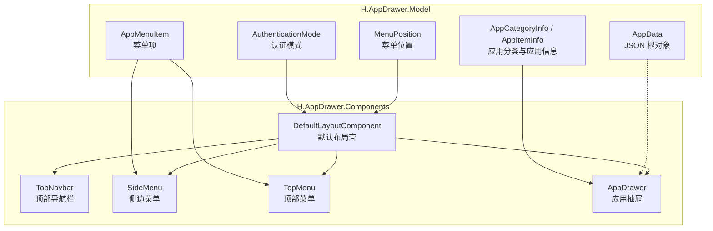
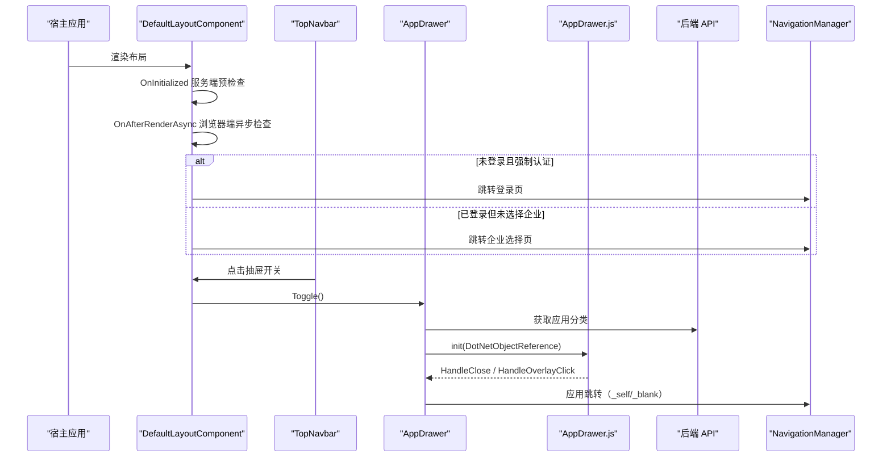
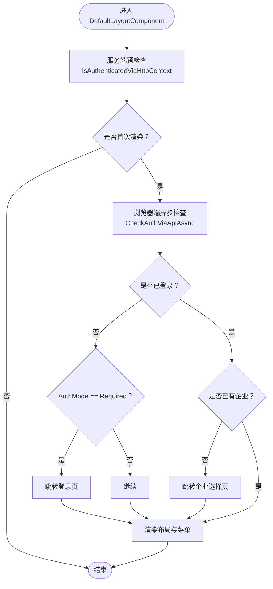
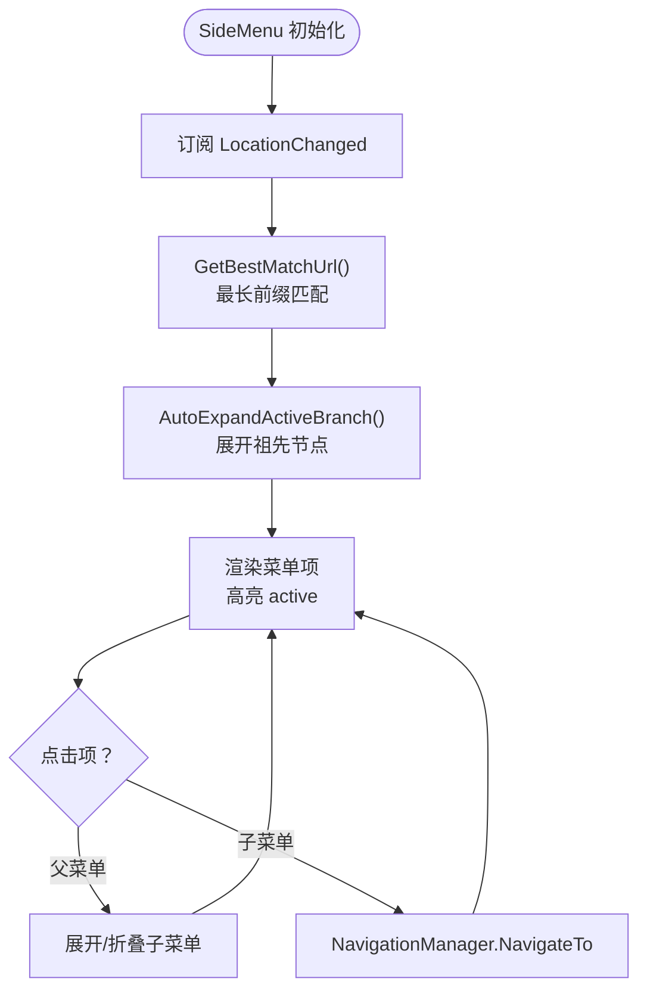
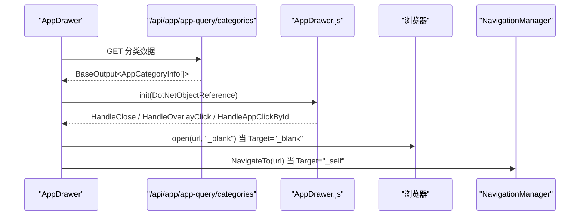
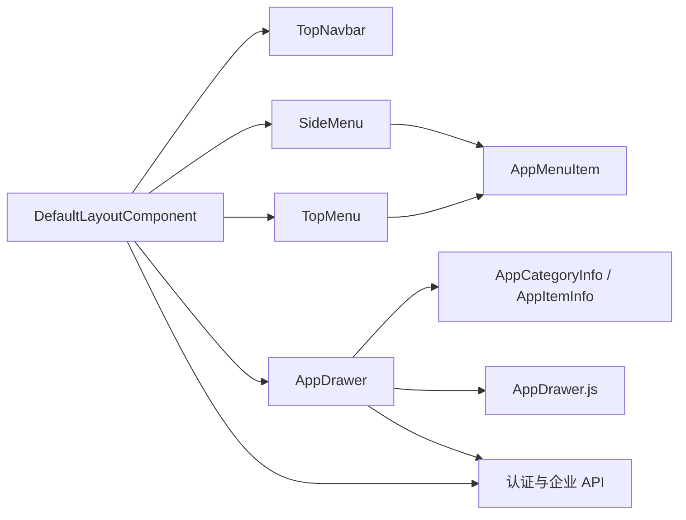

# 应用抽屉组件

<cite>
**本文引用的文件**   
- [AppDrawer.razor](file://src/Components/AppDrawer/H.AppDrawer.Components/Components/AppDrawer.razor)
- [SideMenu.razor](file://src/Components/AppDrawer/H.AppDrawer.Components/Components/SideMenu.razor)
- [TopMenu.razor](file://src/Components/AppDrawer/H.AppDrawer.Components/Components/TopMenu.razor)
- [DefaultLayoutComponent.razor](file://src/Components/AppDrawer/H.AppDrawer.Components/Components/DefaultLayoutComponent.razor)
- [TopNavbar.razor](file://src/Components/AppDrawer/H.AppDrawer.Components/Components/TopNavbar.razor)
- [AppMenuItem.cs](file://src/Components/AppDrawer/H.AppDrawer.Model/AppMenuItem.cs)
- [AppDrawerModels.cs](file://src/Components/AppDrawer/H.AppDrawer.Model/AppDrawerModels.cs)
- [AppData.cs](file://src/Components/AppDrawer/H.AppDrawer.Model/AppData.cs)
- [AuthenticationMode.cs](file://src/Components/AppDrawer/H.AppDrawer.Model/AuthenticationMode.cs)
- [MenuPosition.cs](file://src/Components/AppDrawer/H.AppDrawer.Model/MenuPosition.cs)
</cite>

## 目录
1. [简介](#简介)
2. [项目结构](#项目结构)
3. [核心组件](#核心组件)
4. [架构总览](#架构总览)
5. [详细组件分析](#详细组件分析)
6. [依赖关系分析](#依赖关系分析)
7. [性能与体验特性](#性能与体验特性)
8. [集成指南](#集成指南)
9. [配置项与示例](#配置项与示例)
10. [扩展点与最佳实践](#扩展点与最佳实践)
11. [故障排查](#故障排查)
12. [结论](#结论)

## 简介
应用抽屉组件（H.AppDrawer）是 H.AppLab 前端体系中的统一应用入口与布局壳。它提供以下能力：
- 应用切换：以分类形式展示应用列表，支持当前页跳转或新标签页打开。
- 菜单导航：侧边菜单和顶部菜单两种布局，支持多级嵌套、自动展开激活分支、路由高亮匹配。
- 界面布局管理：默认布局组件统一承载顶栏、侧栏、内容区与应用抽屉。
- 认证控制：支持三种认证模式，未登录时可按策略跳转登录或仅提示。
- 企业上下文：登录后自动获取并显示当前企业名称，支持跳转到企业选择页。
- 交互细节：遮罩关闭、JS 桥接事件、系统后台快捷入口等。

该文档面向需要在宿主应用中集成、定制和扩展 AppDrawer 的开发者，既包含高层架构说明，也深入到每个组件的职责、数据流和关键行为。

## 项目结构
AppDrawer 由两个主要工程组成：
- H.AppDrawer.Model：纯模型定义，暴露给宿主应用使用的类型与枚举。
- H.AppDrawer.Components：Blazor 组件库，包含 UI 组件、样式与 JS 桥接。

**图表来源**
- [DefaultLayoutComponent.razor:1-60](file://src/Components/AppDrawer/H.AppDrawer.Components/Components/DefaultLayoutComponent.razor#L1-L60)
- [TopNavbar.razor:1-60](file://src/Components/AppDrawer/H.AppDrawer.Components/Components/TopNavbar.razor#L1-L60)
- [SideMenu.razor:1-60](file://src/Components/AppDrawer/H.AppDrawer.Components/Components/SideMenu.razor#L1-L60)
- [TopMenu.razor:1-40](file://src/Components/AppDrawer/H.AppDrawer.Components/Components/TopMenu.razor#L1-L40)
- [AppDrawer.razor:1-60](file://src/Components/AppDrawer/H.AppDrawer.Components/Components/AppDrawer.razor#L1-L60)
- [AppMenuItem.cs:1-21](file://src/Components/AppDrawer/H.AppDrawer.Model/AppMenuItem.cs#L1-L21)
- [AppDrawerModels.cs:1-73](file://src/Components/AppDrawer/H.AppDrawer.Model/AppDrawerModels.cs#L1-L73)
- [AppData.cs:1-9](file://src/Components/AppDrawer/H.AppDrawer.Model/AppData.cs#L1-L9)
- [AuthenticationMode.cs:1-22](file://src/Components/AppDrawer/H.AppDrawer.Model/AuthenticationMode.cs#L1-L22)
- [MenuPosition.cs:1-17](file://src/Components/AppDrawer/H.AppDrawer.Model/MenuPosition.cs#L1-L17)

**章节来源**
- [DefaultLayoutComponent.razor:1-120](file://src/Components/AppDrawer/H.AppDrawer.Components/Components/DefaultLayoutComponent.razor#L1-L120)
- [AppDrawerModels.cs:1-73](file://src/Components/AppDrawer/H.AppDrawer.Model/AppDrawerModels.cs#L1-L73)
- [AppMenuItem.cs:1-21](file://src/Components/AppDrawer/H.AppDrawer.Model/AppMenuItem.cs#L1-L21)

## 核心组件
- DefaultLayoutComponent：布局容器，负责顶栏、侧栏/顶栏菜单、内容区与应用抽屉的统一组织，同时处理认证检查、企业信息和页面路由跳转。
- TopNavbar：顶部导航栏，提供应用名称、Logo、抽屉开关、用户信息与登录/退出入口。
- SideMenu：左侧多级菜单，支持按路由前缀匹配高亮、自动展开激活分支。
- TopMenu：顶部横向菜单，支持精确路径匹配高亮与点击跳转。
- AppDrawer：应用抽屉，加载应用分类数据并以分类卡片形式渲染，支持当前页与新标签页打开方式。

这些组件共同构成“壳 + 菜单 + 抽屉”的应用启动与导航中枢。

**章节来源**
- [DefaultLayoutComponent.razor:1-120](file://src/Components/AppDrawer/H.AppDrawer.Components/Components/DefaultLayoutComponent.razor#L1-L120)
- [TopNavbar.razor:1-120](file://src/Components/AppDrawer/H.AppDrawer.Components/Components/TopNavbar.razor#L1-L120)
- [SideMenu.razor:1-120](file://src/Components/AppDrawer/H.AppDrawer.Components/Components/SideMenu.razor#L1-L120)
- [TopMenu.razor:1-95](file://src/Components/AppDrawer/H.AppDrawer.Components/Components/TopMenu.razor#L1-L95)
- [AppDrawer.razor:1-120](file://src/Components/AppDrawer/H.AppDrawer.Components/Components/AppDrawer.razor#L1-L120)

## 架构总览
从运行时角度看，DefaultLayoutComponent 作为布局外壳，协调以下流程：
- 初始化阶段：服务端预渲染通过 HttpContext 快速判断认证状态；浏览器端首次渲染后异步调用 API 校验登录态，并根据认证模式执行跳转。
- 企业信息：已登录且无企业时，自动跳转到企业选择页；若已有企业则显示在用户下拉中。
- 菜单渲染：根据 MenuPosition 决定渲染 SideMenu 或 TopMenu，并将 AppMenuItem 列表注入到对应组件。
- 应用抽屉：通过 JSRuntime 与 AppDrawer.js 绑定事件，使用 DotNetObjectReference 回调 Blazor 方法完成抽屉关闭与应用跳转。

**图表来源**
- [DefaultLayoutComponent.razor:120-302](file://src/Components/AppDrawer/H.AppDrawer.Components/Components/DefaultLayoutComponent.razor#L120-L302)
- [AppDrawer.razor:60-252](file://src/Components/AppDrawer/H.AppDrawer.Components/Components/AppDrawer.razor#L60-L252)
- [TopNavbar.razor:120-202](file://src/Components/AppDrawer/H.AppDrawer.Components/Components/TopNavbar.razor#L120-L202)

## 详细组件分析

### DefaultLayoutComponent：布局与认证控制
职责：
- 提供 AppName、Logo、LoginUrl、AuthMode、MenuPosition 等参数。
- 在服务端预渲染时尝试读取 HttpContext 的用户信息与企业信息。
- 在浏览器端首次渲染后调用 `/api/app/account/current-user` 校验登录态，解析多种响应格式。
- 根据 AuthMode 决定是否跳转登录页或企业选择页。
- 组合 TopNavbar、SideMenu/TopMenu、Content 与 AppDrawer。

关键点：
- 认证模式：None、Optional、Required。
- 企业信息接口：`/api/app/enterprise/current-enterprise`。
- 用户信息接口：`/api/app/account/current-user`。
- 退出登录：导航到 `/account/logout`。
- 抽屉开关：ToggleAppDrawer 调用 AppDrawer.Toggle。

**图表来源**
- [DefaultLayoutComponent.razor:120-302](file://src/Components/AppDrawer/H.AppDrawer.Components/Components/DefaultLayoutComponent.razor#L120-L302)

**章节来源**
- [DefaultLayoutComponent.razor:1-302](file://src/Components/AppDrawer/H.AppDrawer.Components/Components/DefaultLayoutComponent.razor#L1-L302)
- [AuthenticationMode.cs:1-22](file://src/Components/AppDrawer/H.AppDrawer.Model/AuthenticationMode.cs#L1-L22)

### TopNavbar：顶部导航栏
职责：
- 显示应用名称、Logo、中间插槽（用于 TopMenu）。
- 提供抽屉开关按钮，触发父级布局的抽屉切换。
- 用户下拉菜单：个人设置、退出登录、企业切换入口。
- 未登录时显示登录按钮。

交互要点：
- 登录：携带 returnUrl 参数。
- 退出登录：外部通过 OnLogout 回调处理。
- 个人资料：ProfileUrl 可配置。
- 企业选择：跳转到 `/enterprise/select`。

**章节来源**
- [TopNavbar.razor:1-202](file://src/Components/AppDrawer/H.AppDrawer.Components/Components/TopNavbar.razor#L1-L202)

### SideMenu：侧边菜单
职责：
- 接收 List<AppMenuItem>，递归渲染多级菜单。
- 根据 NavigationManager 的路由变化自动计算最佳匹配 URL，并高亮当前菜单。
- 自动展开激活分支的所有祖先目录，避免用户手动折叠被覆盖。
- 点击子菜单项进行路由跳转；点击父菜单项展开/折叠子菜单。

算法要点：
- NormalizePath：去除查询参数与前后的斜杠，统一比较格式。
- IsMatch：当前路径等于目标路径或以目标路径为前缀。
- GetBestMatchUrl：遍历所有菜单项，返回最长匹配的前缀。
- AutoExpandActiveBranch：记录已自动展开过的 URL，避免重复操作。

**图表来源**
- [SideMenu.razor:1-213](file://src/Components/AppDrawer/H.AppDrawer.Components/Components/SideMenu.razor#L1-L213)

**章节来源**
- [SideMenu.razor:1-213](file://src/Components/AppDrawer/H.AppDrawer.Components/Components/SideMenu.razor#L1-L213)
- [AppMenuItem.cs:1-21](file://src/Components/AppDrawer/H.AppDrawer.Model/AppMenuItem.cs#L1-L21)

### TopMenu：顶部菜单
职责：
- 接收 List<AppMenuItem>，水平排列菜单项。
- 基于当前路径进行精确匹配，避免父级路由吞掉子级菜单的高亮。
- 点击菜单项跳转到对应 Url。

匹配逻辑：
- CurrentPath：从 NavigationManager.Uri 提取相对路径，去除 query/hash。
- PathMatches：相等或以目标为前缀。
- IsActiveMenu：若存在更长的匹配项则不高亮当前项，保证最精确高亮。

**章节来源**
- [TopMenu.razor:1-95](file://src/Components/AppDrawer/H.AppDrawer.Components/Components/TopMenu.razor#L1-L95)
- [AppMenuItem.cs:1-21](file://src/Components/AppDrawer/H.AppDrawer.Model/AppMenuItem.cs#L1-L21)

### AppDrawer：应用抽屉
职责：
- 显示应用分类与应用列表，支持图标、描述、排序。
- 加载分类数据：调用 `/api/app/app-query/categories`，解析 BaseOutput 包装的 data 字段。
- 应用点击：根据 Target 决定 _self 或 _blank 打开方式；未提供 Url 则不跳转。
- 系统后台：通过 JS open 在新窗口打开 `/system`。
- JS 桥接：OnAfterRender 注册 AppDrawer.init，并通过 DotNetObjectReference 接收 HandleClose、HandleOverlayClick、HandleAppClickById 等回调。

**图表来源**
- [AppDrawer.razor:60-252](file://src/Components/AppDrawer/H.AppDrawer.Components/Components/AppDrawer.razor#L60-L252)

**章节来源**
- [AppDrawer.razor:1-252](file://src/Components/AppDrawer/H.AppDrawer.Components/Components/AppDrawer.razor#L1-L252)
- [AppDrawerModels.cs:1-73](file://src/Components/AppDrawer/H.AppDrawer.Model/AppDrawerModels.cs#L1-L73)

## 依赖关系分析
- 组件耦合：
  - DefaultLayoutComponent 依赖 TopNavbar、SideMenu/TopMenu、AppDrawer。
  - SideMenu 与 TopMenu 均依赖 AppMenuItem 数据结构。
  - AppDrawer 依赖 HttpClient 拉取分类数据，依赖 IJSRuntime 与 AppDrawer.js 进行事件桥接。
- 外部依赖：
  - ABP 风格 API：`/api/app/app-query/categories`、`/api/app/account/current-user`、`/api/app/enterprise/current-enterprise`。
  - 宿主应用路由：NavigationManager 控制页面跳转。
  - 认证：服务端 HttpContext 与 Cookie；浏览器端通过 API 检测登录态。

**图表来源**
- [DefaultLayoutComponent.razor:1-120](file://src/Components/AppDrawer/H.AppDrawer.Components/Components/DefaultLayoutComponent.razor#L1-L120)
- [AppDrawer.razor:60-252](file://src/Components/AppDrawer/H.AppDrawer.Components/Components/AppDrawer.razor#L60-L252)
- [SideMenu.razor:1-213](file://src/Components/AppDrawer/H.AppDrawer.Components/Components/SideMenu.razor#L1-L213)
- [TopMenu.razor:1-95](file://src/Components/AppDrawer/H.AppDrawer.Components/Components/TopMenu.razor#L1-L95)

**章节来源**
- [DefaultLayoutComponent.razor:1-120](file://src/Components/AppDrawer/H.AppDrawer.Components/Components/DefaultLayoutComponent.razor#L1-L120)
- [AppDrawer.razor:60-252](file://src/Components/AppDrawer/H.AppDrawer.Components/Components/AppDrawer.razor#L60-L252)

## 性能与体验特性
- 首次渲染优化：DefaultLayoutComponent 使用 OnAfterRenderAsync 异步检查认证，避免阻塞首屏。
- 菜单高亮计算：SideMenu 缓存最佳匹配 URL，避免重复扫描；TopMenu 对同级菜单进行长度比较以避免父级吞掉子级高亮。
- 抽屉交互：关闭动画延迟 100ms 后再执行跳转，提升视觉流畅度。
- 资源加载：AppDrawer 通过 link/script 引入 CSS 与 JS，按需绑定事件。
- 空状态与加载态：抽屉在加载中与无应用时有明确反馈。

[本节为通用性能建议，不涉及具体代码行]

## 集成指南
在宿主应用中集成 AppDrawer 的典型步骤：
1. 引用组件库：确保 H.AppDrawer.Components 与 H.AppDrawer.Model 被宿主项目引用。
2. 注册静态资源：确认组件的 wwwroot/css 与 js 被正确发布与访问。
3. 创建布局：使用 DefaultLayoutComponent 作为主布局，传入必要的参数。
4. 配置菜单：提供 List<AppMenuItem>，指定 Name、Url、Icon、Key、Children。
5. 配置认证：设置 AuthMode 与 LoginUrl；确保后端提供 `/api/app/account/current-user`。
6. 配置企业：确保后端提供 `/api/app/enterprise/current-enterprise`；必要时启用企业选择流程。
7. 运行验证：检查登录态、菜单高亮、抽屉打开与应用跳转是否符合预期。

注意：
- 若不使用侧边菜单，可提供 SideContent 自定义侧栏。
- 若只使用顶部菜单，将 MenuPosition 设置为 Top。
- 若不需要认证控制，可将 AuthMode 设置为 None。

**章节来源**
- [DefaultLayoutComponent.razor:1-120](file://src/Components/AppDrawer/H.AppDrawer.Components/Components/DefaultLayoutComponent.razor#L1-L120)
- [TopNavbar.razor:120-202](file://src/Components/AppDrawer/H.AppDrawer.Components/Components/TopNavbar.razor#L120-L202)

## 配置项与示例

### 模型与枚举
- AppMenuItem：菜单项
  - Name：显示名
  - Url：路由地址
  - Icon：图标（Emoji 或 Unicode）
  - Key：唯一标识，用于展开/折叠状态跟踪
  - Children：子菜单列表
- AppCategoryInfo：应用分类
  - CategoryName：分类名
  - CategoryIcon：分类图标（可选）
  - Apps：应用列表
- AppItemInfo：应用信息
  - Id：唯一标识
  - Name：应用名
  - Icon / IconUrl：图标或图片地址
  - Url：跳转地址
  - Target：_self 或 _blank
  - Description：描述
  - Enabled：是否启用
  - Order：排序号
- AppData：JSON 根对象（用于反序列化），包含 AppCategories
- AuthenticationMode：None、Optional、Required
- MenuPosition：Left、Top

**章节来源**
- [AppMenuItem.cs:1-21](file://src/Components/AppDrawer/H.AppDrawer.Model/AppMenuItem.cs#L1-L21)
- [AppDrawerModels.cs:1-73](file://src/Components/AppDrawer/H.AppDrawer.Model/AppDrawerModels.cs#L1-L73)
- [AppData.cs:1-9](file://src/Components/AppDrawer/H.AppDrawer.Model/AppData.cs#L1-L9)
- [AuthenticationMode.cs:1-22](file://src/Components/AppDrawer/H.AppDrawer.Model/AuthenticationMode.cs#L1-L22)
- [MenuPosition.cs:1-17](file://src/Components/AppDrawer/H.AppDrawer.Model/MenuPosition.cs#L1-L17)

### DefaultLayoutComponent 参数
- AppName：应用名称
- Logo：Logo 路径
- MenuItems：菜单列表
- SideContent：自定义侧栏内容
- MenuPosition：菜单位置（Left 或 Top）
- LoginUrl：登录页地址
- AuthMode：认证模式（None、Optional、Required）
- ChildContent：内容区插槽

**章节来源**
- [DefaultLayoutComponent.razor:60-120](file://src/Components/AppDrawer/H.AppDrawer.Components/Components/DefaultLayoutComponent.razor#L60-L120)

### TopNavbar 参数
- AppName、Logo、UserName、IsLoggedIn、LoginUrl、ProfileUrl、EnterpriseName、OnLogout、ChildContent、OnDrawerToggle

**章节来源**
- [TopNavbar.razor:120-202](file://src/Components/AppDrawer/H.AppDrawer.Components/Components/TopNavbar.razor#L120-L202)

### SideMenu 与 TopMenu 参数
- MenuItems：List<AppMenuItem>

**章节来源**
- [SideMenu.razor:1-60](file://src/Components/AppDrawer/H.AppDrawer.Components/Components/SideMenu.razor#L1-L60)
- [TopMenu.razor:1-40](file://src/Components/AppDrawer/H.AppDrawer.Components/Components/TopMenu.razor#L1-L40)

### 示例场景
- 基础布局：传入 AppName、Logo、MenuItems，使用默认 Left 侧栏。
- 顶部菜单：将 MenuPosition 设置为 Top，并在 TopNavbar 的 ChildContent 中放入 TopMenu。
- 自定义侧栏：提供 SideContent 替换默认 SideMenu。
- 认证控制：
  - 强制登录：AuthMode = Required，未登录跳转到 LoginUrl。
  - 允许匿名：AuthMode = Optional，仅显示登录状态。
  - 不检测：AuthMode = None。
- 企业上下文：登录后若无企业，自动跳转企业选择页；有企业时显示在企业下拉中。

[本节为概念性示例，不直接分析具体代码行]

## 扩展点与最佳实践

### 自定义菜单项
- 使用 AppMenuItem.Children 构建多级菜单。
- 为父菜单设置 Key，便于 SideMenu 维护展开状态。
- 使用 Icon 或外部图标库配合 MenuIcons.GetSvg 显示图标。

**章节来源**
- [AppMenuItem.cs:1-21](file://src/Components/AppDrawer/H.AppDrawer.Model/AppMenuItem.cs#L1-L21)
- [SideMenu.razor:120-213](file://src/Components/AppDrawer/H.AppDrawer.Components/Components/SideMenu.razor#L120-L213)

### 应用适配器
- 通过后端 `/api/app/app-query/categories` 返回 AppCategoryInfo[]，适配不同业务线的分类与应用。
- 使用 AppItemInfo 的 Enabled 与 Order 控制显示顺序与可见性。

**章节来源**
- [AppDrawer.razor:120-200](file://src/Components/AppDrawer/H.AppDrawer.Components/Components/AppDrawer.razor#L120-L200)
- [AppDrawerModels.cs:1-73](file://src/Components/AppDrawer/H.AppDrawer.Model/AppDrawerModels.cs#L1-L73)

### 插件机制
- 当前实现中未发现显式插件加载器；可通过以下方式扩展：
  - 动态菜单：宿主应用在运行时组装 MenuItems。
  - 动态应用：后端服务聚合多源应用清单并返回分类数据。
  - 自定义侧栏：使用 SideContent 插入业务功能入口。

[本节为概念性扩展建议，不直接分析具体代码行]

### 最佳实践
- 菜单路由设计：尽量使用稳定、层级清晰的路由，避免过长前缀导致高亮不准确。
- 认证策略：生产环境建议使用 Required，并结合企业选择流程。
- 用户体验：为应用提供清晰的 Icon 与 Description；为新标签页打开的应用提供目标标识。
- 性能：避免过深的菜单层级；合理设置 MenuItems 数量；在后端分页或懒加载应用列表。

[本节为通用最佳实践，不涉及具体代码行]

## 故障排查
常见问题与定位思路：
- 抽屉无法打开：
  - 检查 DefaultLayoutComponent 是否正确调用 appDrawer?.Toggle()。
  - 检查 AppDrawer.razor 的 Visible 状态与 JS 事件绑定是否成功。
- 应用点击无效：
  - 检查 AppItemInfo.Url 是否为空。
  - 检查 Target 值是否为 _self 或 _blank。
- 菜单高亮异常：
  - 检查路由是否与菜单项 Url 一致，或是否存在更短/更长前缀匹配问题。
  - 检查 NormalizePath 与 IsMatch 的逻辑是否与路由规范一致。
- 认证失败或白屏：
  - 检查后端 `/api/app/account/current-user` 是否返回预期的 JSON 格式。
  - 检查 AuthMode 设置与 LoginUrl 配置。
- 企业信息为空：
  - 检查后端 `/api/app/enterprise/current-enterprise` 是否返回包含 name 的 data 对象。
- 退出登录后仍显示用户信息：
  - 检查宿主应用的登出逻辑是否正确清除 Cookie 或 Token。

**章节来源**
- [DefaultLayoutComponent.razor:120-302](file://src/Components/AppDrawer/H.AppDrawer.Components/Components/DefaultLayoutComponent.razor#L120-L302)
- [AppDrawer.razor:120-252](file://src/Components/AppDrawer/H.AppDrawer.Components/Components/AppDrawer.razor#L120-L252)
- [SideMenu.razor:120-213](file://src/Components/AppDrawer/H.AppDrawer.Components/Components/SideMenu.razor#L120-L213)

## 结论
H.AppDrawer 通过 DefaultLayoutComponent 统一了宿主应用的布局与认证流程，通过 SideMenu/TopMenu 提供了灵活的菜单导航，通过 AppDrawer 实现了可视化的应用启动入口。其配置项丰富、扩展点清晰，适合在多应用、多租户的企业场景中复用与定制。开发者可根据业务需求调整菜单结构、认证策略与企业上下文，并结合后端服务实现动态应用清单与权限控制。

[本节为总结性内容，不涉及具体代码行]