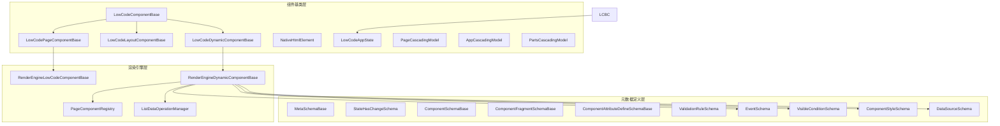
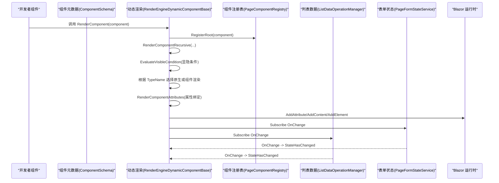
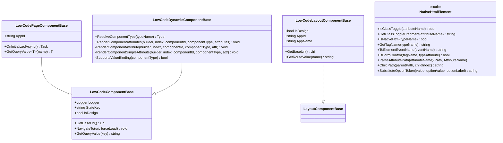
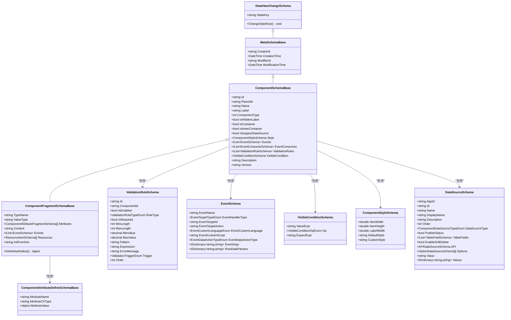
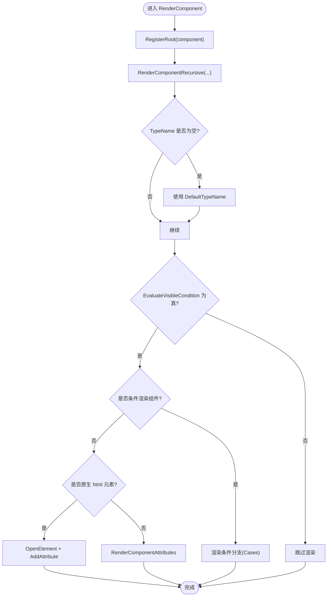
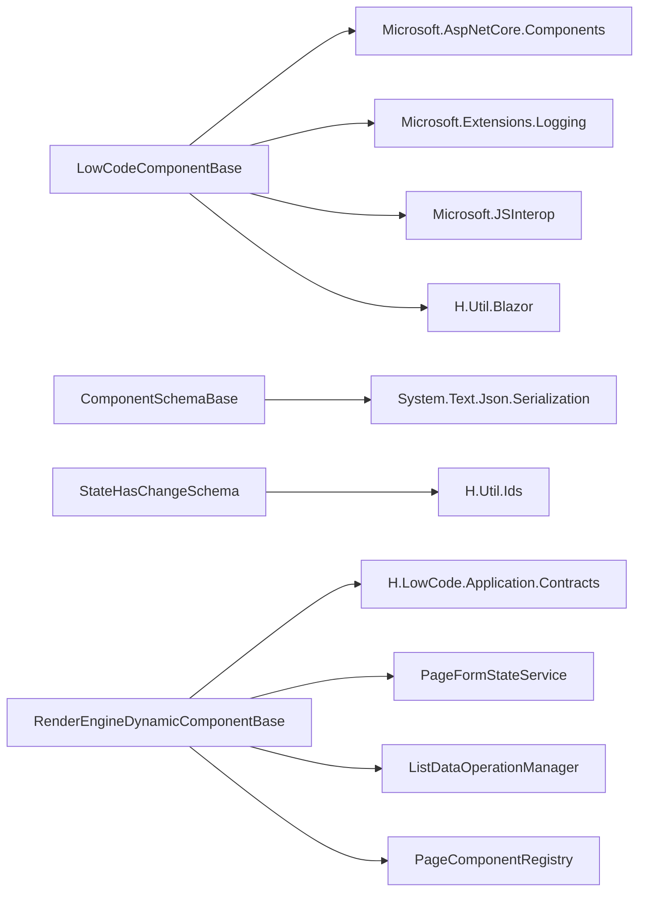

# 组件基类与开发框架

<cite>
**本文引用的文件**   
- [LowCodeComponentBase.cs](file://src/LowCode/Common/H.LowCode.ComponentBase/LowCodeComponentBase.cs)
- [LowCodePageComponentBase.cs](file://src/LowCode/Common/H.LowCode.ComponentBase/LowCodePageComponentBase.cs)
- [LowCodeLayoutComponentBase.cs](file://src/LowCode/Common/H.LowCode.ComponentBase/LowCodeLayoutComponentBase.cs)
- [LowCodeDynamicComponentBase.cs](file://src/LowCode/Common/H.LowCode.ComponentBase/LowCodeDynamicComponentBase.cs)
- [NativeHtmlElement.cs](file://src/LowCode/Common/H.LowCode.ComponentBase/NativeHtmlElement.cs)
- [LowCodeAppState.cs](file://src/LowCode/Common/H.LowCode.ComponentBase/LowCodeAppState.cs)
- [AppCascadingModel.cs](file://src/LowCode/Common/H.LowCode.ComponentBase/CascadingModels/AppCascadingModel.cs)
- [PageCascadingModel.cs](file://src/LowCode/Common/H.LowCode.ComponentBase/CascadingModels/PageCascadingModel.cs)
- [PartsCascadingModel.cs](file://src/LowCode/Common/H.LowCode.ComponentBase/CascadingModels/PartsCascadingModel.cs)
- [MetaSchemaBase.cs](file://src/LowCode/Common/H.LowCode.MetaSchema/MetaSchemaBase.cs)
- [StateHasChangeSchema.cs](file://src/LowCode/Common/H.LowCode.MetaSchema/StateHasChangeSchema.cs)
- [ComponentSchemaBase.cs](file://src/LowCode/Common/H.LowCode.MetaSchema/ComponentSchemaBase.cs)
- [ComponentFragmentSchemaBase.cs](file://src/LowCode/Common/H.LowCode.MetaSchema/PropertySchemas/ComponentFragmentSchemaBase.cs)
- [ComponentAttributeDefineSchemaBase.cs](file://src/LowCode/Common/H.LowCode.MetaSchema/PropertySchemas/ComponentAttributeDefineSchemaBase.cs)
- [ValidationRuleSchema.cs](file://src/LowCode/Common/H.LowCode.MetaSchema/PropertySchemas/ValidationRuleSchema.cs)
- [EventSchema.cs](file://src/LowCode/Common/H.LowCode.MetaSchema/PropertySchemas/EventSchema.cs)
- [VisibleConditionSchema.cs](file://src/LowCode/Common/H.LowCode.MetaSchema/PropertySchemas/VisibleConditionSchema.cs)
- [ComponentStyleSchema.cs](file://src/LowCode/Common/H.LowCode.MetaSchema/PropertySchemas/ComponentStyleSchema.cs)
- [DataSourceSchema.cs](file://src/LowCode/Common/H.LowCode.MetaSchema/DataSourceSchema.cs)
- [RenderEngineLowCodeComponentBase.cs](file://src/LowCode/RenderEngine/H.LowCode.RenderEngineBase/RenderEngineLowCodeComponentBase.cs)
- [RenderEngineDynamicComponentBase.cs](file://src/LowCode/RenderEngine/H.LowCode.RenderEngineBase/RenderEngineDynamicComponentBase.cs)
- [PageComponentRegistry.cs](file://src/LowCode/RenderEngine/H.LowCode.RenderEngineBase/PageComponentRegistry.cs)
- [ListDataOperationManager.cs](file://src/LowCode/RenderEngine/H.LowCode.RenderEngineBase/ListDataOperationManager.cs)
</cite>

## 目录
1. [引言](#引言)
2. [项目结构](#项目结构)
3. [核心组件](#核心组件)
4. [架构总览](#架构总览)
5. [详细组件分析](#详细组件分析)
6. [依赖关系分析](#依赖关系分析)
7. [性能与渲染优化](#性能与渲染优化)
8. [自定义组件开发指南](#自定义组件开发指南)
9. [调试、错误处理与状态管理](#调试错误处理与状态管理)
10. [结论](#结论)

## 引言
本文面向 H.AppLab 低代码平台的“组件基类系统”，系统性梳理组件抽象层、元数据模型与渲染引擎之间的关系，帮助开发者理解：
- ComponentBase 抽象体系的设计理念与继承链
- 属性绑定机制、事件处理模型与生命周期
- 组件元数据的定义方式（属性描述、验证规则、默认值、显示配置）
- 渲染机制与虚拟 DOM 更新策略
- 如何从零开始开发简单展示型、交互型和复合组件
- 组件状态管理、数据校验、错误处理和调试支持

## 项目结构
本系统的代码主要分布在三个层次：
- 组件基类层：提供通用能力（日志、导航、JS 互操作、设计态标识等）
- 元数据定义层：用 JSON 描述组件类型、属性、事件、样式、数据源和校验规则
- 渲染引擎层：将元数据动态解析并转换为 Blazor 的 RenderTreeBuilder 调用序列

图表来源
- [LowCodeComponentBase.cs:1-61](file://src/LowCode/Common/H.LowCode.ComponentBase/LowCodeComponentBase.cs#L1-L61)
- [LowCodePageComponentBase.cs:1-21](file://src/LowCode/Common/H.LowCode.ComponentBase/LowCodePageComponentBase.cs#L1-L21)
- [LowCodeLayoutComponentBase.cs:1-64](file://src/LowCode/Common/H.LowCode.ComponentBase/LowCodeLayoutComponentBase.cs#L1-L64)
- [LowCodeDynamicComponentBase.cs:1-134](file://src/LowCode/Common/H.LowCode.ComponentBase/LowCodeDynamicComponentBase.cs#L1-L134)
- [NativeHtmlElement.cs:1-121](file://src/LowCode/Common/H.LowCode.ComponentBase/NativeHtmlElement.cs#L1-L121)
- [LowCodeAppState.cs:1-14](file://src/LowCode/Common/H.LowCode.ComponentBase/LowCodeAppState.cs#L1-L14)
- [PageCascadingModel.cs:1-23](file://src/LowCode/Common/H.LowCode.ComponentBase/CascadingModels/PageCascadingModel.cs#L1-L23)
- [AppCascadingModel.cs:1-5](file://src/LowCode/Common/H.LowCode.ComponentBase/CascadingModels/AppCascadingModel.cs#L1-L5)
- [PartsCascadingModel.cs:1-10](file://src/LowCode/Common/H.LowCode.ComponentBase/CascadingModels/PartsCascadingModel.cs#L1-L10)
- [MetaSchemaBase.cs:1-18](file://src/LowCode/Common/H.LowCode.MetaSchema/MetaSchemaBase.cs#L1-L18)
- [StateHasChangeSchema.cs:1-15](file://src/LowCode/Common/H.LowCode.MetaSchema/StateHasChangeSchema.cs#L1-L15)
- [ComponentSchemaBase.cs:1-110](file://src/LowCode/Common/H.LowCode.MetaSchema/ComponentSchemaBase.cs#L1-L110)
- [ComponentFragmentSchemaBase.cs:1-82](file://src/LowCode/Common/H.LowCode.MetaSchema/PropertySchemas/ComponentFragmentSchemaBase.cs#L1-L82)
- [ComponentAttributeDefineSchemaBase.cs:1-25](file://src/LowCode/Common/H.LowCode.MetaSchema/PropertySchemas/ComponentAttributeDefineSchemaBase.cs#L1-L25)
- [ValidationRuleSchema.cs:1-172](file://src/LowCode/Common/H.LowCode.MetaSchema/PropertySchemas/ValidationRuleSchema.cs#L1-L172)
- [EventSchema.cs:1-66](file://src/LowCode/Common/H.LowCode.MetaSchema/PropertySchemas/EventSchema.cs#L1-L66)
- [VisibleConditionSchema.cs:1-49](file://src/LowCode/Common/H.LowCode.MetaSchema/PropertySchemas/VisibleConditionSchema.cs#L1-L49)
- [ComponentStyleSchema.cs:1-38](file://src/LowCode/Common/H.LowCode.MetaSchema/PropertySchemas/ComponentStyleSchema.cs#L1-L38)
- [DataSourceSchema.cs:1-69](file://src/LowCode/Common/H.LowCode.MetaSchema/DataSourceSchema.cs#L1-L69)
- [RenderEngineLowCodeComponentBase.cs:1-15](file://src/LowCode/RenderEngine/H.LowCode.RenderEngineBase/RenderEngineLowCodeComponentBase.cs#L1-L15)
- [RenderEngineDynamicComponentBase.cs:1-200](file://src/LowCode/RenderEngine/H.LowCode.RenderEngineBase/RenderEngineDynamicComponentBase.cs#L1-L200)
- [PageComponentRegistry.cs:1-48](file://src/LowCode/RenderEngine/H.LowCode.RenderEngineBase/PageComponentRegistry.cs#L1-L48)
- [ListDataOperationManager.cs:1-200](file://src/LowCode/RenderEngine/H.LowCode.RenderEngineBase/ListDataOperationManager.cs#L1-L200)

章节来源
- [LowCodeComponentBase.cs:1-61](file://src/LowCode/Common/H.LowCode.ComponentBase/LowCodeComponentBase.cs#L1-L61)
- [ComponentSchemaBase.cs:1-110](file://src/LowCode/Common/H.LowCode.MetaSchema/ComponentSchemaBase.cs#L1-L110)
- [RenderEngineDynamicComponentBase.cs:1-200](file://src/LowCode/RenderEngine/H.LowCode.RenderEngineBase/RenderEngineDynamicComponentBase.cs#L1-L200)

## 核心组件
本节聚焦组件基类的职责划分与协作关系。

- LowCodeComponentBase：所有低代码组件的基础基类，注入日志、导航、JS 互操作、Toast、设计态标识等，并提供基础导航与查询参数读取能力。
- LowCodePageComponentBase：页面级组件基类，扩展 AppId 参数，预留页面初始化逻辑入口。
- LowCodeLayoutComponentBase：布局组件基类，从路由中获取 AppId、AppName，并提供基于 RouteView 的路由值读取工具。
- LowCodeDynamicComponentBase：动态组件属性渲染基类，根据元数据中的属性片段将 AttributeName、AttributeValue、AttributeClrType 映射到目标组件的属性或事件回调，并支持 RenderFragment 子内容。
- NativeHtmlElement：原生 HTML 元素物料支持，用于通过“html:标签名”形式直接渲染原生 DOM 节点，并处理表单控件、class 开关、事件映射、路径属性定位、选项占位符替换等。

章节来源
- [LowCodeComponentBase.cs:1-61](file://src/LowCode/Common/H.LowCode.ComponentBase/LowCodeComponentBase.cs#L1-L61)
- [LowCodePageComponentBase.cs:1-21](file://src/LowCode/Common/H.LowCode.ComponentBase/LowCodePageComponentBase.cs#L1-L21)
- [LowCodeLayoutComponentBase.cs:1-64](file://src/LowCode/Common/H.LowCode.ComponentBase/LowCodeLayoutComponentBase.cs#L1-L64)
- [LowCodeDynamicComponentBase.cs:1-134](file://src/LowCode/Common/H.LowCode.ComponentBase/LowCodeDynamicComponentBase.cs#L1-L134)
- [NativeHtmlElement.cs:1-121](file://src/LowCode/Common/H.LowCode.ComponentBase/NativeHtmlElement.cs#L1-L121)

## 架构总览
组件基类、元数据与渲染引擎之间的交互流程如下：

图表来源
- [RenderEngineDynamicComponentBase.cs:1-200](file://src/LowCode/RenderEngine/H.LowCode.RenderEngineBase/RenderEngineDynamicComponentBase.cs#L1-L200)
- [PageComponentRegistry.cs:1-48](file://src/LowCode/RenderEngine/H.LowCode.RenderEngineBase/PageComponentRegistry.cs#L1-L48)
- [ListDataOperationManager.cs:1-200](file://src/LowCode/RenderEngine/H.LowCode.RenderEngineBase/ListDataOperationManager.cs#L1-L200)

## 详细组件分析

### 组件基类体系

图表来源
- [LowCodeComponentBase.cs:1-61](file://src/LowCode/Common/H.LowCode.ComponentBase/LowCodeComponentBase.cs#L1-L61)
- [LowCodePageComponentBase.cs:1-21](file://src/LowCode/Common/H.LowCode.ComponentBase/LowCodePageComponentBase.cs#L1-L21)
- [LowCodeLayoutComponentBase.cs:1-64](file://src/LowCode/Common/H.LowCode.ComponentBase/LowCodeLayoutComponentBase.cs#L1-L64)
- [LowCodeDynamicComponentBase.cs:1-134](file://src/LowCode/Common/H.LowCode.ComponentBase/LowCodeDynamicComponentBase.cs#L1-L134)
- [NativeHtmlElement.cs:1-121](file://src/LowCode/Common/H.LowCode.ComponentBase/NativeHtmlElement.cs#L1-L121)

#### LowCodeComponentBase
- 职责：为所有低代码组件提供统一的基础能力，包括：
  - 日志记录器（按实际组件类型创建）
  - 设计态标识（IsDesign），用于区分设计时与运行时的行为差异
  - 导航与 URL 查询参数读取
  - JS 互操作与 Toast 通知能力
- 关键点：
  - 使用依赖注入注入 NavigationManager、IJSRuntime、ILoggerFactory、HToastService
  - 提供 GetBaseUri、NavigateTo、GetQueryValue 等便捷方法

章节来源
- [LowCodeComponentBase.cs:1-61](file://src/LowCode/Common/H.LowCode.ComponentBase/LowCodeComponentBase.cs#L1-L61)
- [LowCodeAppState.cs:1-14](file://src/LowCode/Common/H.LowCode.ComponentBase/LowCodeAppState.cs#L1-L14)

#### LowCodePageComponentBase
- 职责：页面级组件基类，暴露 AppId 参数，预留 OnInitializedAsync 钩子，方便页面级初始化。

章节来源
- [LowCodePageComponentBase.cs:1-21](file://src/LowCode/Common/H.LowCode.ComponentBase/LowCodePageComponentBase.cs#L1-L21)

#### LowCodeLayoutComponentBase
- 职责：布局组件基类，从路由中解析 AppId，提供 AppName 占位，支持基于 RouteView 的路由值读取。

章节来源
- [LowCodeLayoutComponentBase.cs:1-64](file://src/LowCode/Common/H.LowCode.ComponentBase/LowCodeLayoutComponentBase.cs#L1-L64)

#### LowCodeDynamicComponentBase
- 职责：动态属性渲染。根据元数据中的属性片段将属性名、属性和类型信息转换成 Blazor 的 AddAttribute 调用；支持 RenderFragment 子内容和 EventCallback 事件绑定。
- 关键点：
  - ResolveComponentType：安全解析类型名，失败返回 null
  - RenderComponentAttributes：遍历属性片段并逐个渲染
  - RenderComponentAttribute：区分 RenderFragment、EventCallback、简单属性三类
  - RenderComponentSimpleAttribute：将字符串属性值转换为真实 CLR 类型后设置

章节来源
- [LowCodeDynamicComponentBase.cs:1-134](file://src/LowCode/Common/H.LowCode.ComponentBase/LowCodeDynamicComponentBase.cs#L1-L134)

#### NativeHtmlElement
- 职责：原生 HTML 元素物料支持。用于以“html:标签名”形式直接渲染原生 DOM，无需编译 Razor 组件。
- 关键点：
  - 原生标签识别与名称提取
  - 事件名映射（如 OnClick → onclick）
  - 表单控件识别（textarea、select、input 常见类型）
  - 路径属性解析（childs.{i}...）
  - class 开关属性（class:xxx）
  - 选项数据源占位符替换（$(value)、$(label)）

章节来源
- [NativeHtmlElement.cs:1-121](file://src/LowCode/Common/H.LowCode.ComponentBase/NativeHtmlElement.cs#L1-L121)

### 组件元数据定义
组件元数据描述了“如何渲染一个组件”，包括组件实例 ID、父组件、名称、标签、类型、容器标记、样式、事件、校验规则、可见性条件、版本以及数据源等。

图表来源
- [StateHasChangeSchema.cs:1-15](file://src/LowCode/Common/H.LowCode.MetaSchema/StateHasChangeSchema.cs#L1-L15)
- [MetaSchemaBase.cs:1-18](file://src/LowCode/Common/H.LowCode.MetaSchema/MetaSchemaBase.cs#L1-L18)
- [ComponentSchemaBase.cs:1-110](file://src/LowCode/Common/H.LowCode.MetaSchema/ComponentSchemaBase.cs#L1-L110)
- [ComponentFragmentSchemaBase.cs:1-82](file://src/LowCode/Common/H.LowCode.MetaSchema/PropertySchemas/ComponentFragmentSchemaBase.cs#L1-L82)
- [ComponentAttributeDefineSchemaBase.cs:1-25](file://src/LowCode/Common/H.LowCode.MetaSchema/PropertySchemas/ComponentAttributeDefineSchemaBase.cs#L1-L25)
- [ValidationRuleSchema.cs:1-172](file://src/LowCode/Common/H.LowCode.MetaSchema/PropertySchemas/ValidationRuleSchema.cs#L1-L172)
- [EventSchema.cs:1-66](file://src/LowCode/Common/H.LowCode.MetaSchema/PropertySchemas/EventSchema.cs#L1-L66)
- [VisibleConditionSchema.cs:1-49](file://src/LowCode/Common/H.LowCode.MetaSchema/PropertySchemas/VisibleConditionSchema.cs#L1-L49)
- [ComponentStyleSchema.cs:1-38](file://src/LowCode/Common/H.LowCode.MetaSchema/PropertySchemas/ComponentStyleSchema.cs#L1-L38)
- [DataSourceSchema.cs:1-69](file://src/LowCode/Common/H.LowCode.MetaSchema/DataSourceSchema.cs#L1-L69)

#### 属性描述与默认值
- ComponentFragmentSchemaBase：定义 TypeName、ValueType、Attributes、Content、Events、Resources、InitFunction 等，并提供 GetDefaultValue 根据 ValueType 返回默认值。
- ComponentAttributeDefineSchemaBase：描述单个属性的名称、CLR 类型和值。

章节来源
- [ComponentFragmentSchemaBase.cs:1-82](file://src/LowCode/Common/H.LowCode.MetaSchema/PropertySchemas/ComponentFragmentSchemaBase.cs#L1-L82)
- [ComponentAttributeDefineSchemaBase.cs:1-25](file://src/LowCode/Common/H.LowCode.MetaSchema/PropertySchemas/ComponentAttributeDefineSchemaBase.cs#L1-L25)

#### 验证规则
- ValidationRuleSchema：定义必填、长度、数值范围、正则、邮箱、手机号、URL、身份证、自定义表达式等规则，并支持触发时机（失焦、改变、提交）与排序。

章节来源
- [ValidationRuleSchema.cs:1-172](file://src/LowCode/Common/H.LowCode.MetaSchema/PropertySchemas/ValidationRuleSchema.cs#L1-L172)

#### 事件模型
- EventSchema：定义事件名、事件处理器类型、目标 ID 与动作、脚本语言与脚本内容、数据操作类型、事件参数与行数据参数映射。
- EventConsumeSchema：事件消费展示名称。

章节来源
- [EventSchema.cs:1-66](file://src/LowCode/Common/H.LowCode.MetaSchema/PropertySchemas/EventSchema.cs#L1-L66)

#### 显示条件
- VisibleConditionSchema：支持值表达式、比较操作符、期望值表达式，用于组件显隐联动。

章节来源
- [VisibleConditionSchema.cs:1-49](file://src/LowCode/Common/H.LowCode.MetaSchema/PropertySchemas/VisibleConditionSchema.cs#L1-L49)

#### 样式配置
- ComponentStyleSchema：定义宽度、高度、标签宽度、默认样式、自定义样式。

章节来源
- [ComponentStyleSchema.cs:1-38](file://src/LowCode/Common/H.LowCode.MetaSchema/PropertySchemas/ComponentStyleSchema.cs#L1-L38)

#### 数据源
- DataSourceSchema：定义应用 ID、组件 ID、名称、显示名称、描述、顺序、数据源类型、发布状态；针对 Table、API、Option 三种数据源分别提供字段、API 配置、选项数组与键值对字典。

章节来源
- [DataSourceSchema.cs:1-69](file://src/LowCode/Common/H.LowCode.MetaSchema/DataSourceSchema.cs#L1-L69)

### 渲染机制与虚拟 DOM 更新
渲染引擎将组件元数据递归解析为 Blazor 的 RenderTreeBuilder 调用序列，关键流程包括：
- 注册根组件：在渲染开始时登记组件树，供事件处理与校验按 ID 查找
- 递归渲染：根据 Fragment 的 TypeName 决定原生元素还是组件
- 显隐条件求值：VisibleCondition 为假时跳过渲染
- 条件渲染组件：根据 Cases 分支渲染不同子树
- 属性绑定：将属性片段转换为 AddAttribute，支持 RenderFragment 与 EventCallback
- 事件订阅：订阅表单状态变化与列表数据变化，驱动 StateHasChanged

图表来源
- [RenderEngineDynamicComponentBase.cs:1-200](file://src/LowCode/RenderEngine/H.LowCode.RenderEngineBase/RenderEngineDynamicComponentBase.cs#L1-L200)
- [PageComponentRegistry.cs:1-48](file://src/LowCode/RenderEngine/H.LowCode.RenderEngineBase/PageComponentRegistry.cs#L1-L48)
- [NativeHtmlElement.cs:1-121](file://src/LowCode/Common/H.LowCode.ComponentBase/NativeHtmlElement.cs#L1-L121)

章节来源
- [RenderEngineDynamicComponentBase.cs:1-200](file://src/LowCode/RenderEngine/H.LowCode.RenderEngineBase/RenderEngineDynamicComponentBase.cs#L1-L200)
- [PageComponentRegistry.cs:1-48](file://src/LowCode/RenderEngine/H.LowCode.RenderEngineBase/PageComponentRegistry.cs#L1-L48)

## 依赖关系分析
- 组件基类依赖：
  - Microsoft.AspNetCore.Components（ComponentBase、Parameter、CascadingParameter、RenderTreeBuilder）
  - Microsoft.Extensions.Logging（ILoggerFactory、ILogger）
  - Microsoft.JSInterop（IJSRuntime）
  - H.Util.Blazor（HToastService）
- 元数据模型依赖：
  - System.Text.Json.Serialization（JsonPropertyName）
  - H.Util.Ids（ShortIdGenerator）
- 渲染引擎依赖：
  - H.LowCode.Application.Contracts（ITableDataAppService、IFormDataAppService）
  - PageFormStateService、ListDataOperationManager、PageComponentRegistry
  - IJSRuntime、ILogger

图表来源
- [LowCodeComponentBase.cs:1-61](file://src/LowCode/Common/H.LowCode.ComponentBase/LowCodeComponentBase.cs#L1-L61)
- [ComponentSchemaBase.cs:1-110](file://src/LowCode/Common/H.LowCode.MetaSchema/ComponentSchemaBase.cs#L1-L110)
- [StateHasChangeSchema.cs:1-15](file://src/LowCode/Common/H.LowCode.MetaSchema/StateHasChangeSchema.cs#L1-L15)
- [RenderEngineDynamicComponentBase.cs:1-200](file://src/LowCode/RenderEngine/H.LowCode.RenderEngineBase/RenderEngineDynamicComponentBase.cs#L1-L200)

章节来源
- [LowCodeComponentBase.cs:1-61](file://src/LowCode/Common/H.LowCode.ComponentBase/LowCodeComponentBase.cs#L1-L61)
- [RenderEngineDynamicComponentBase.cs:1-200](file://src/LowCode/RenderEngine/H.LowCode.RenderEngineBase/RenderEngineDynamicComponentBase.cs#L1-L200)

## 性能与渲染优化
- 避免整页崩溃：动态类型解析失败返回 null，调用方应跳过该节点渲染
- 显隐联动：VisibleCondition 为假时直接跳过渲染，减少不必要的 DOM 构建
- 条件渲染：ConditionalComponent 按需渲染分支，降低渲染成本
- 属性批量绑定：RenderComponentAttributes 一次性遍历属性片段，减少多次反射开销
- 原生元素优化：NativeHtmlElement 将常用原生元素直接 OpenElement 渲染，避免额外组件开销
- 栅格宽度计算：根据页面布局自动计算百分比宽度，减少样式计算复杂度

章节来源
- [LowCodeDynamicComponentBase.cs:1-134](file://src/LowCode/Common/H.LowCode.ComponentBase/LowCodeDynamicComponentBase.cs#L1-L134)
- [RenderEngineDynamicComponentBase.cs:1-200](file://src/LowCode/RenderEngine/H.LowCode.RenderEngineBase/RenderEngineDynamicComponentBase.cs#L1-L200)
- [NativeHtmlElement.cs:1-121](file://src/LowCode/Common/H.LowCode.ComponentBase/NativeHtmlElement.cs#L1-L121)

## 自定义组件开发指南

### 开发流程概览
1. 确定组件类型：原子组件或组合组件（ComponentSchemaBase.ComponentType）
2. 定义组件元数据：
   - 组件实例 ID、父组件、名称、标签、类型
   - 容器标记、是否内部容器
   - 样式（宽度、高度、标签宽度、默认/自定义样式）
   - 事件、事件消费
   - 校验规则
   - 可见性条件
   - 数据源
3. 实现组件基类：
   - 简单展示组件：继承 LowCodeComponentBase 或 LowCodePageComponentBase
   - 动态属性组件：继承 LowCodeDynamicComponentBase，重写 RenderComponentAttributes
   - 原生 HTML 元素：使用“html:标签名”并通过 NativeHtmlElement 渲染
4. 实现 RenderTreeBuilder：
   - 根据元数据生成 AddElement/AddAttribute/AddContent
   - 处理 RenderFragment 子内容与 EventCallback 事件绑定
5. 集成渲染引擎：
   - 在 RenderEngineDynamicComponentBase 中注册组件类型解析逻辑
   - 使用 PageComponentRegistry 登记组件树
   - 订阅表单状态与列表数据变更，驱动 StateHasChanged

章节来源
- [ComponentSchemaBase.cs:1-110](file://src/LowCode/Common/H.LowCode.MetaSchema/ComponentSchemaBase.cs#L1-L110)
- [LowCodeComponentBase.cs:1-61](file://src/LowCode/Common/H.LowCode.ComponentBase/LowCodeComponentBase.cs#L1-L61)
- [LowCodeDynamicComponentBase.cs:1-134](file://src/LowCode/Common/H.LowCode.ComponentBase/LowCodeDynamicComponentBase.cs#L1-L134)
- [RenderEngineDynamicComponentBase.cs:1-200](file://src/LowCode/RenderEngine/H.LowCode.RenderEngineBase/RenderEngineDynamicComponentBase.cs#L1-L200)

### 示例一：简单展示组件
- 目标：仅展示文本或图片，不接收复杂交互
- 步骤：
  - 继承 LowCodeComponentBase
  - 定义元数据中的 Attributes，例如文本内容、字体大小、颜色
  - 在 RenderTreeBuilder 中使用 AddMarkupContent 或 AddElement 渲染

章节来源
- [ComponentFragmentSchemaBase.cs:1-82](file://src/LowCode/Common/H.LowCode.MetaSchema/PropertySchemas/ComponentFragmentSchemaBase.cs#L1-L82)
- [LowCodeComponentBase.cs:1-61](file://src/LowCode/Common/H.LowCode.ComponentBase/LowCodeComponentBase.cs#L1-L61)

### 示例二：交互组件
- 目标：支持用户输入、按钮点击等交互
- 步骤：
  - 继承 LowCodeComponentBase 或 LowCodeDynamicComponentBase
  - 定义元数据中的 Events，指定事件名、目标 ID、动作
  - 在组件中实现事件处理方法，并使用 EventCallback 绑定
  - 若需要双向绑定，参考 SupportsValueBinding 模式实现 Value/ValueChanged

章节来源
- [EventSchema.cs:1-66](file://src/LowCode/Common/H.LowCode.MetaSchema/PropertySchemas/EventSchema.cs#L1-L66)
- [LowCodeDynamicComponentBase.cs:1-134](file://src/LowCode/Common/H.LowCode.ComponentBase/LowCodeDynamicComponentBase.cs#L1-L134)

### 示例三：复合组件
- 目标：组合多个子组件，形成更复杂的业务单元
- 步骤：
  - 继承 LowCodeDynamicComponentBase
  - 在 RenderComponentAttributes 中递归渲染子组件
  - 使用 PageComponentRegistry 登记子组件树
  - 使用 VisibleCondition 控制子组件显隐

章节来源
- [RenderEngineDynamicComponentBase.cs:1-200](file://src/LowCode/RenderEngine/H.LowCode.RenderEngineBase/RenderEngineDynamicComponentBase.cs#L1-L200)
- [PageComponentRegistry.cs:1-48](file://src/LowCode/RenderEngine/H.LowCode.RenderEngineBase/PageComponentRegistry.cs#L1-L48)

## 调试、错误处理与状态管理

### 调试支持
- 日志记录器：每个组件类型拥有独立 Logger，便于追踪组件生命周期与异常
- 设计态标识：IsDesign 用于区分设计与运行环境，便于在编辑器中注入拖拽容器等能力
- 类型解析失败：ResolveComponentType 返回 null，调用方跳过渲染，避免整页崩溃

章节来源
- [LowCodeComponentBase.cs:1-61](file://src/LowCode/Common/H.LowCode.ComponentBase/LowCodeComponentBase.cs#L1-L61)
- [LowCodeDynamicComponentBase.cs:1-134](file://src/LowCode/Common/H.LowCode.ComponentBase/LowCodeDynamicComponentBase.cs#L1-L134)

### 错误处理
- 属性为空或类型缺失：RenderComponentAttribute 与 RenderComponentSimpleAttribute 中对空属性名、空类型进行防御性检查
- 显隐条件求值失败：VisibleCondition 为假时跳过渲染，避免无效 DOM 构建
- 事件回调未找到：当目标方法不存在时，不添加事件属性，避免运行时异常

章节来源
- [LowCodeDynamicComponentBase.cs:1-134](file://src/LowCode/Common/H.LowCode.ComponentBase/LowCodeDynamicComponentBase.cs#L1-L134)
- [VisibleConditionSchema.cs:1-49](file://src/LowCode/Common/H.LowCode.MetaSchema/PropertySchemas/VisibleConditionSchema.cs#L1-L49)

### 状态管理
- 表单状态：PageFormStateService 提供表单值的状态变更事件，驱动显隐联动与值回显重新求值
- 列表数据：ListDataOperationManager 管理列表数据的增删改查与排序，提供 OnChange 事件驱动列表重新渲染
- 组件状态键：StateHasChangeSchema.StateKey 与 ShortIdGenerator 结合，用于唯一标识组件状态

章节来源
- [RenderEngineDynamicComponentBase.cs:1-200](file://src/LowCode/RenderEngine/H.LowCode.RenderEngineBase/RenderEngineDynamicComponentBase.cs#L1-L200)
- [ListDataOperationManager.cs:1-200](file://src/LowCode/RenderEngine/H.LowCode.RenderEngineBase/ListDataOperationManager.cs#L1-L200)
- [StateHasChangeSchema.cs:1-15](file://src/LowCode/Common/H.LowCode.MetaSchema/StateHasChangeSchema.cs#L1-L15)

## 结论
H.AppLab 低代码平台的组件基类系统通过清晰的抽象分层、完善的元数据模型与高效的动态渲染机制，为开发者提供了可扩展、可维护且高性能的组件开发体验。借助 LowCodeComponentBase 系列基类与元数据定义，开发者可以快速实现从简单展示到复杂交互的各种组件；而渲染引擎则负责将元数据高效地转化为 Blazor 的渲染树，同时提供状态管理与错误处理保障。建议在实际项目中：
- 优先使用元数据驱动组件配置，保持设计与实现的解耦
- 合理使用显隐条件与条件渲染，提升渲染性能
- 充分利用日志与设计态标识，提升调试效率
- 遵循属性绑定与事件模型规范，确保组件的可复用性与稳定性