# 组件库

<cite>
**本文引用的文件**   
- [LowCodeComponentBase.cs](file://src/LowCode/Common/H.LowCode.ComponentBase/LowCodeComponentBase.cs)
- [LowCodePageComponentBase.cs](file://src/LowCode/Common/H.LowCode.ComponentBase/LowCodePageComponentBase.cs)
- [LowCodeLayoutComponentBase.cs](file://src/LowCode/Common/H.LowCode.ComponentBase/LowCodeLayoutComponentBase.cs)
- [LowCodeDynamicComponentBase.cs](file://src/LowCode/Common/H.LowCode.ComponentBase/LowCodeDynamicComponentBase.cs)
- [LowCodeAppState.cs](file://src/LowCode/Common/H.LowCode.ComponentBase/LowCodeAppState.cs)
- [AppCascadingModel.cs](file://src/LowCode/Common/H.LowCode.ComponentBase/CascadingModels/AppCascadingModel.cs)
- [PageCascadingModel.cs](file://src/LowCode/Common/H.LowCode.ComponentBase/CascadingModels/PageCascadingModel.cs)
- [PartsCascadingModel.cs](file://src/LowCode/Common/H.LowCode.ComponentBase/CascadingModels/PartsCascadingModel.cs)
- [NativeHtmlElement.cs](file://src/LowCode/Common/H.LowCode.ComponentBase/NativeHtmlElement.cs)
- [Conditional.razor](file://src/LowCode/Common/H.LowCode.ComponentBase/Components/Conditional.razor)
- [NativeResourceMount.razor](file://src/LowCode/Common/H.LowCode.ComponentBase/Components/NativeResourceMount.razor)
- [_Imports.razor](file://src/LowCode/Common/H.LowCode.ComponentBase/_Imports.razor)
- [ComponentSchemaBase.cs](file://src/LowCode/Common/H.LowCode.MetaSchema/ComponentSchemaBase.cs)
- [MetaSchemaBase.cs](file://src/LowCode/Common/H.LowCode.MetaSchema/MetaSchemaBase.cs)
- [ComponentFragmentSchemaBase.cs](file://src/LowCode/Common/H.LowCode.MetaSchema/PropertySchemas/ComponentFragmentSchemaBase.cs)
- [ComponentStyleSchema.cs](file://src/LowCode/Common/H.LowCode.MetaSchema/PropertySchemas/ComponentStyleSchema.cs)
- [EventSchema.cs](file://src/LowCode/Common/H.LowCode.MetaSchema/PropertySchemas/EventSchema.cs)
- [DataSourceSchema.cs](file://src/LowCode/Common/H.LowCode.MetaSchema/DataSourceSchema.cs)
- [ComponentValueTypeEnum.cs](file://src/LowCode/Common/H.LowCode.MetaSchema/Enums/ComponentValueTypeEnum.cs)
- [ComponentDataSourceTypeEnum.cs](file://src/LowCode/Common/H.LowCode.MetaSchema/Enums/ComponentDataSourceTypeEnum.cs)
- [APIDataSourceSchema.cs](file://src/LowCode/Common/H.LowCode.MetaSchema/DataSourceSchemas/APIDataSourceSchema.cs)
- [OptionDataSourceSchema.cs](file://src/LowCode/Common/H.LowCode.MetaSchema/DataSourceSchemas/OptionDataSourceSchema.cs)
- [TableFieldSchema.cs](file://src/LowCode/Common/H.LowCode.MetaSchema/DataSourceSchemas/TableFieldSchema.cs)
</cite>

## 目录

1. [引言](#引言)
2. [项目结构](#项目结构)
3. [核心组件](#核心组件)
4. [架构总览](#架构总览)
5. [详细组件分析](#详细组件分析)
6. [依赖关系分析](#依赖关系分析)
7. [性能与可访问性](#性能与可访问性)
8. [主题与样式定制](#主题与样式定制)
9. [自定义组件开发指南](#自定义组件开发指南)
10. [故障排查](#故障排查)
11. [结论](#结论)

## 引言

H.AppLab 低代码平台的组件库围绕 Blazor 组件模型构建，提供“设计时元数据 + 运行时渲染”的完整能力。其核心思想是：

- 使用 **元数据模型** 描述组件属性、事件、样式和数据源。
- 使用 **组件基类** 提供页面上下文、导航、日志、Toast、设计模式判断等通用能力。
- 使用 **动态组件渲染器** 将 JSON 描述的片段转换为真实 Blazor 组件或原生 HTML 元素。
- 通过 **条件渲染、原生资源挂载** 等基础组件，支撑复杂业务场景和第三方外部资源集成。

该文档面向两类读者：

- **低代码使用者**：学习如何使用内置组件、配置属性、绑定数据源和事件。
- **组件开发者**：学习如何继承组件基类、定义元数据、注册并发布自定义组件。

## 项目结构

从组件库角度看，仓库中与“组件库”直接相关的主要模块包括：

| 模块 | 职责 | 关键文件 |
|---|---|---|
| 组件基类库 | 提供组件基类、状态上下文、级联模型、原生 HTML 支持、条件渲染和资源挂载 | `LowCodeComponentBase.cs`、`LowCodeDynamicComponentBase.cs`、`NativeHtmlElement.cs`、`Conditional.razor`、`NativeResourceMount.razor` |
| 元数据模型 | 描述组件实例、属性、事件、样式、数据源等元信息 | `ComponentSchemaBase.cs`、`ComponentFragmentSchemaBase.cs`、`ComponentStyleSchema.cs`、`EventSchema.cs`、`DataSourceSchema.cs` |
| 枚举与子类型 | 定义值类型、数据源类型、事件目标类型、API 请求体类型等 | `ComponentValueTypeEnum.cs`、`ComponentDataSourceTypeEnum.cs`、`APIDataSourceSchema.cs`、`OptionDataSourceSchema.cs`、`TableFieldSchema.cs` |

```mermaid
graph TB
    subgraph "组件基类层"
        A["LowCodeComponentBase<br/>通用组件基类"]
        B["LowCodePageComponentBase<br/>页面组件基类"]
        C["LowCodeLayoutComponentBase<br/>布局组件基类"]
        D["LowCodeDynamicComponentBase<br/>动态组件渲染基类"]
        E["NativeHtmlElement<br/>原生 HTML 元素工具"]
        F["Conditional.razor<br/>条件渲染组件"]
        G["NativeResourceMount.razor<br/>原生资源挂载点"]
    end

    subgraph "元数据模型层"
        M1["ComponentSchemaBase<br/>组件实例元数据"]
        M2["ComponentFragmentSchemaBase<br/>片段与属性"]
        M3["ComponentStyleSchema<br/>组件样式"]
        M4["EventSchema<br/>事件定义"]
        M5["DataSourceSchema<br/>数据源定义"]
        M6["APIDataSourceSchema<br/>API 数据源"]
        M7["OptionDataSourceSchema<br/>选项数据源"]
        M8["TableFieldSchema<br/>表字段"]
    end

    A --> M2
    D --> M2
    D --> M4
    A --> E
    F --> M2
    G --> M2
    M5 --> M6
    M5 --> M7
    M5 --> M8
```

**图示来源**  
- [LowCodeComponentBase.cs:1-61](file://src/LowCode/Common/H.LowCode.ComponentBase/LowCodeComponentBase.cs#L1-L61)  
- [LowCodeDynamicComponentBase.cs:1-134](file://src/LowCode/Common/H.LowCode.ComponentBase/LowCodeDynamicComponentBase.cs#L1-L134)  
- [NativeHtmlElement.cs:1-121](file://src/LowCode/Common/H.LowCode.ComponentBase/NativeHtmlElement.cs#L1-L121)  
- [ComponentSchemaBase.cs:1-110](file://src/LowCode/Common/H.LowCode.MetaSchema/ComponentSchemaBase.cs#L1-L110)  
- [ComponentFragmentSchemaBase.cs:1-82](file://src/LowCode/Common/H.LowCode.MetaSchema/PropertySchemas/ComponentFragmentSchemaBase.cs#L1-L82)  
- [DataSourceSchema.cs:1-69](file://src/LowCode/Common/H.LowCode.MetaSchema/DataSourceSchema.cs#L1-L69)

**章节来源**  
- [LowCodeComponentBase.cs:1-61](file://src/LowCode/Common/H.LowCode.ComponentBase/LowCodeComponentBase.cs#L1-L61)  
- [LowCodeDynamicComponentBase.cs:1-134](file://src/LowCode/Common/H.LowCode.ComponentBase/LowCodeDynamicComponentBase.cs#L1-L134)  
- [ComponentSchemaBase.cs:1-110](file://src/LowCode/Common/H.LowCode.MetaSchema/ComponentSchemaBase.cs#L1-L110)  
- [ComponentFragmentSchemaBase.cs:1-82](file://src/LowCode/Common/H.LowCode.MetaSchema/PropertySchemas/ComponentFragmentSchemaBase.cs#L1-L82)  
- [DataSourceSchema.cs:1-69](file://src/LowCode/Common/H.LowCode.MetaSchema/DataSourceSchema.cs#L1-L69)

## 核心组件

### 组件基类体系

组件基类体系是 H.AppLab 组件库的核心骨架。它把 Blazor 组件的通用能力抽象出来，让业务组件专注于自身展示和交互逻辑。

| 基类 | 主要职责 | 典型使用场景 |
|---|---|---|
| `LowCodeComponentBase` | 注入应用状态、导航、JS 运行时、日志、Toast；提供查询参数解析和跳转方法 | 普通业务组件、表单控件、展示型组件 |
| `LowCodePageComponentBase` | 继承通用基类，增加页面级 `AppId` 参数 | 页面级容器组件、页面初始化逻辑 |
| `LowCodeLayoutComponentBase` | 基于 Blazor 布局组件，解析路由中的 `AppId`，提供设计模式判断 | 应用主布局、页面壳组件 |
| `LowCodeDynamicComponentBase` | 根据元数据动态渲染组件属性和事件 | 低代码渲染引擎、动态表单、动态表格 |

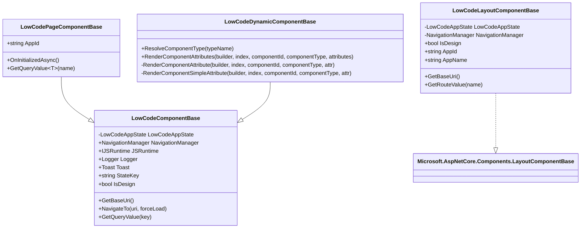

**图示来源**  
- [LowCodeComponentBase.cs:1-61](file://src/LowCode/Common/H.LowCode.ComponentBase/LowCodeComponentBase.cs#L1-L61)  
- [LowCodePageComponentBase.cs:1-21](file://src/LowCode/Common/H.LowCode.ComponentBase/LowCodePageComponentBase.cs#L1-L21)  
- [LowCodeLayoutComponentBase.cs:1-64](file://src/LowCode/Common/H.LowCode.ComponentBase/LowCodeLayoutComponentBase.cs#L1-L64)  
- [LowCodeDynamicComponentBase.cs:1-134](file://src/LowCode/Common/H.LowCode.ComponentBase/LowCodeDynamicComponentBase.cs#L1-L134)

#### 通用组件基类：`LowCodeComponentBase`

这个基类为所有组件提供统一的基础设施：

- **设计模式感知**：通过 `LowCodeAppState.IsDesign` 判断当前是否处于低代码编辑器环境。
- **导航能力**：封装 `NavigationManager.NavigateTo`，并支持强制加载。
- **查询参数解析**：从当前 URL 中按名称读取查询值。
- **日志与提示**：按组件类型创建 `ILogger`，并提供 `HToastService` 用于用户提示。
- **JS 互操作入口**：暴露 `IJSRuntime`，便于后续扩展前端脚本调用。

#### 页面组件基类：`LowCodePageComponentBase`

该基类在通用组件基础上增加页面维度能力：

- 引入 `AppId` 参数，使页面组件可以识别所属应用。
- 提供泛型 `GetQueryValue<T>` 占位实现，便于页面层扩展强类型查询参数解析。

#### 布局组件基类：`LowCodeLayoutComponentBase`

该基类更适合承载页面外壳：

- 从路由值中解析 `AppId`，并缓存结果。
- 提供 `AppId`、`AppName` 等布局层常用信息。
- 提供 `GetRouteValue` 帮助方法，方便布局组件读取路由参数。

#### 动态组件基类：`LowCodeDynamicComponentBase`

这是低代码渲染引擎中最关键的组件之一。它负责：

- 根据字符串类型名解析组件类型。
- 遍历元数据中的属性数组，将 `AttributeName`、`AttributeClrType`、`AttributeValue` 映射到目标组件的属性。
- 特殊处理 `RenderFragment` 和 `EventCallback` 两种属性类型。
- 对简单类型属性执行 CLR 类型转换后赋值。

**章节来源**  
- [LowCodeComponentBase.cs:1-61](file://src/LowCode/Common/H.LowCode.ComponentBase/LowCodeComponentBase.cs#L1-L61)  
- [LowCodePageComponentBase.cs:1-21](file://src/LowCode/Common/H.LowCode.ComponentBase/LowCodePageComponentBase.cs#L1-L21)  
- [LowCodeLayoutComponentBase.cs:1-64](file://src/LowCode/Common/H.LowCode.ComponentBase/LowCodeLayoutComponentBase.cs#L1-L64)  
- [LowCodeDynamicComponentBase.cs:1-134](file://src/LowCode/Common/H.LowCode.ComponentBase/LowCodeDynamicComponentBase.cs#L1-L134)

### 级联上下文模型

组件库通过级联模型传递应用、页面、部件等上下文信息，避免在每个组件中重复注入或手动传参。

| 模型 | 用途 | 关键字段 |
|---|---|---|
| `AppCascadingModel` | 应用级上下文占位模型 | 空实现，可扩展应用全局信息 |
| `PageCascadingModel` | 页面级上下文 | `AppId`、`PageId`、`PageName`、`PageLayout`、`DataSourceName` |
| `PartsCascadingModel` | 部件级上下文 | `LibraryId`、`PartsId`、`PartsName` |

这些模型通常由页面或布局组件以级联形式向下传递，子组件无需关心数据来源，只需要读取即可。

**章节来源**  
- [AppCascadingModel.cs:1-5](file://src/LowCode/Common/H.LowCode.ComponentBase/CascadingModels/AppCascadingModel.cs#L1-L5)  
- [PageCascadingModel.cs:1-23](file://src/LowCode/Common/H.LowCode.ComponentBase/CascadingModels/PageCascadingModel.cs#L1-L23)  
- [PartsCascadingModel.cs:1-10](file://src/LowCode/Common/H.LowCode.ComponentBase/CascadingModels/PartsCascadingModel.cs#L1-L10)

### 条件渲染组件：`Conditional.razor`

`Conditional.razor` 是一个平台级通用组件，用于根据条件值渲染不同分支内容。它支持两种模式：

1. **显示隐藏模式**：通过 `Visible` 控制 `ChildContent` 是否渲染。
2. **多分支模式**：通过 `ConditionValue` 匹配 `Cases` 字典中的键，渲染对应分支。

这种设计适合低代码平台中常见的“根据数据类型、用户角色、表单状态切换 UI”的场景。

**章节来源**  
- [Conditional.razor:1-76](file://src/LowCode/Common/H.LowCode.ComponentBase/Components/Conditional.razor#L1-L76)

### 原生资源挂载组件：`NativeResourceMount.razor`

该组件用于挂载需要外部 CSS 和 JavaScript 资源的纯物料组件，例如第三方图表、地图、富文本编辑器等。

它的核心流程是：

1. 根据 `Resources` 清单生成 `<link>` 标签加载 CSS。
2. 使用 JS 运行时按顺序导入 JS 模块。
3. 调用指定的初始化函数，并将挂载点 ID 和组件选项传入。
4. 在组件销毁时释放 JS 模块引用，避免内存泄漏。

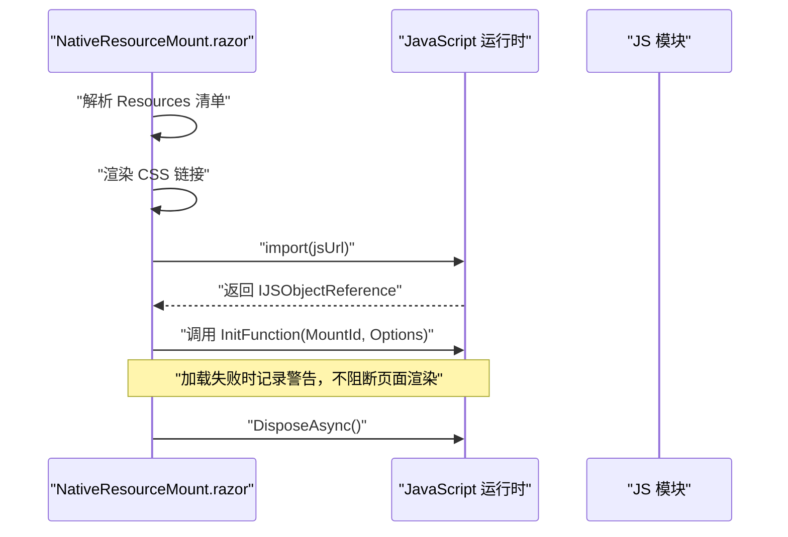

**图示来源**  
- [NativeResourceMount.razor:1-98](file://src/LowCode/Common/H.LowCode.ComponentBase/Components/NativeResourceMount.razor#L1-L98)

**章节来源**  
- [NativeResourceMount.razor:1-98](file://src/LowCode/Common/H.LowCode.ComponentBase/Components/NativeResourceMount.razor#L1-L98)

## 架构总览

H.AppLab 组件库的整体架构可以分为三层：

1. **元数据层**：描述“组件长什么样、有哪些属性、触发哪些事件、从哪里取数据”。
2. **渲染层**：将元数据转换为 Blazor 组件或原生 HTML 元素。
3. **基础设施层**：提供导航、日志、Toast、设计模式、原生资源加载等公共能力。

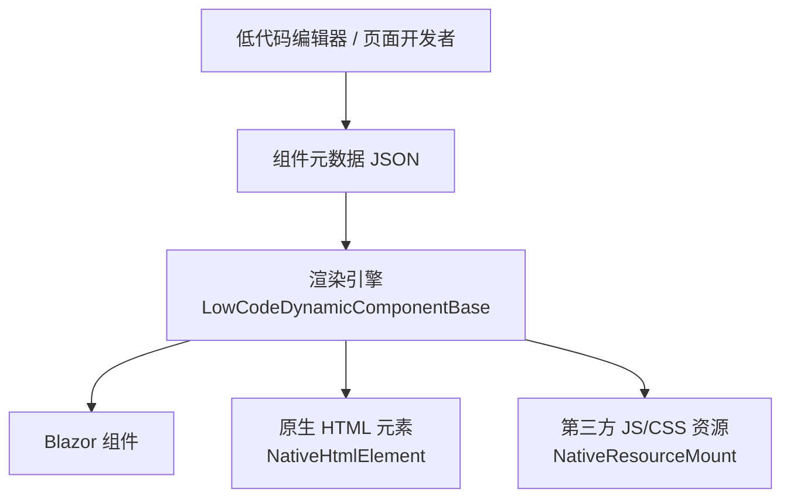

**图示来源**  
- [LowCodeDynamicComponentBase.cs:1-134](file://src/LowCode/Common/H.LowCode.ComponentBase/LowCodeDynamicComponentBase.cs#L1-L134)  
- [NativeHtmlElement.cs:1-121](file://src/LowCode/Common/H.LowCode.ComponentBase/NativeHtmlElement.cs#L1-L121)  
- [NativeResourceMount.razor:1-98](file://src/LowCode/Common/H.LowCode.ComponentBase/Components/NativeResourceMount.razor#L1-L98)

## 详细组件分析

### 元数据模型分析

元数据模型是低代码平台的契约。它定义了组件实例、片段、属性、事件、样式和数据源的结构。

#### 组件实例元数据：`ComponentSchemaBase`

每个组件实例都可以通过该基类表达以下信息：

| 字段 | 含义 | 说明 |
|---|---|---|
| `Id` | 组件实例唯一标识 | 用于页面树定位和事件消费 |
| `ParentId` | 父组件标识 | 表示组件树中的父子关系 |
| `Name` | 组件名称 | 内部标识 |
| `Label` | 显示名称 | 用于编辑器界面展示 |
| `ComponentType` | 组件类型 | 原子组件或组合组件 |
| `IsContainer` | 是否为容器 | 决定是否允许嵌套子组件 |
| `IsInnerContainer` | 是否为内部容器 | 用于更细粒度的容器行为控制 |
| `IsSupportDataSource` | 是否支持数据源 | 容器组件通常不支持直接数据源 |
| `Style` | 组件样式 | 包含宽度、高度、标签宽度、默认样式、自定义样式 |
| `Events` | 事件定义 | 组件对外暴露的事件 |
| `EventConsumes` | 事件消费声明 | 组件可以消费哪些事件 |
| `ValidationRules` | 校验规则 | 用于表单验证 |
| `VisibleCondition` | 显示条件 | 条件为真时才渲染组件 |
| `Description` | 描述 | 组件说明 |
| `Version` | 版本 | 组件元数据版本 |

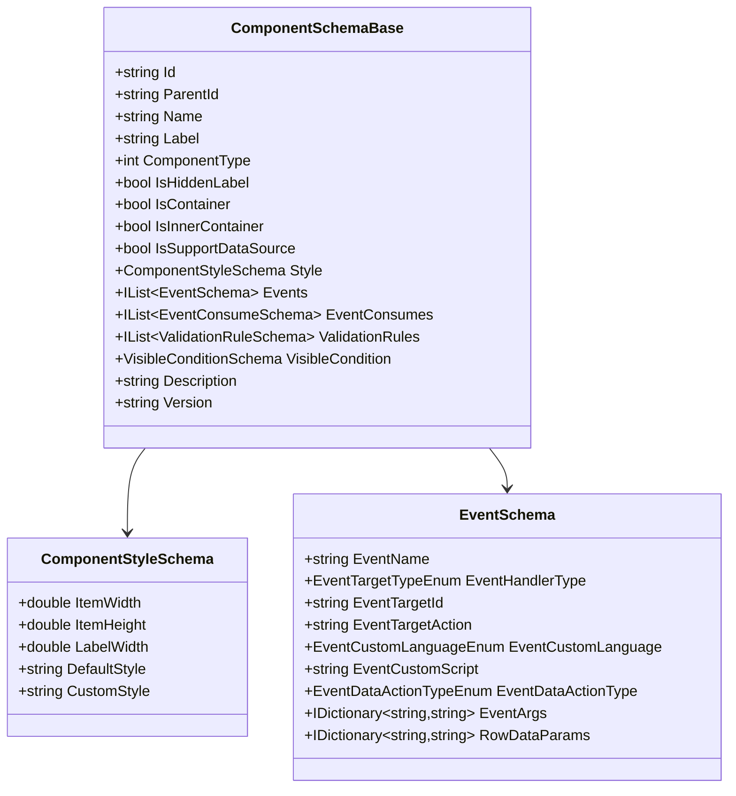

**图示来源**  
- [ComponentSchemaBase.cs:1-110](file://src/LowCode/Common/H.LowCode.MetaSchema/ComponentSchemaBase.cs#L1-L110)  
- [ComponentStyleSchema.cs:1-38](file://src/LowCode/Common/H.LowCode.MetaSchema/PropertySchemas/ComponentStyleSchema.cs#L1-L38)  
- [EventSchema.cs:1-66](file://src/LowCode/Common/H.LowCode.MetaSchema/PropertySchemas/EventSchema.cs#L1-L66)

#### 片段与属性元数据：`ComponentFragmentSchemaBase`

片段是组件的最小可描述单元。一个片段包含：

- `TypeName`：组件类型名或原生 HTML 标签名。
- `ValueType`：值类型，用于默认值解析。
- `Attributes`：属性数组，每个属性包含属性名、CLR 类型和属性值。
- `Content`：片段内容。
- `Events`：片段事件。
- `Resources`：静态资源清单。
- `InitFunction`：资源加载后的初始化函数名。

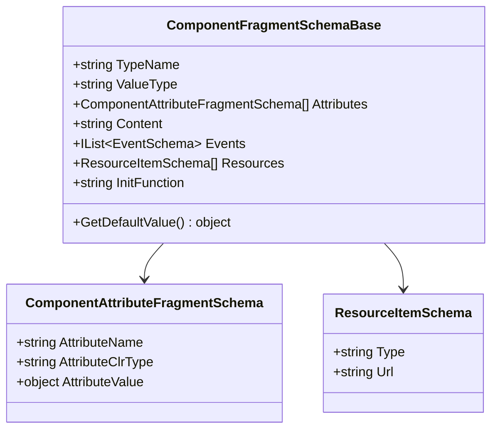

**图示来源**  
- [ComponentFragmentSchemaBase.cs:1-82](file://src/LowCode/Common/H.LowCode.MetaSchema/PropertySchemas/ComponentFragmentSchemaBase.cs#L1-L82)

#### 数据源模型：`DataSourceSchema`

数据源模型描述了组件可以从哪里获取数据。支持的类型包括：

| 数据源类型 | 含义 | 适用场景 |
|---|---|---|
| `DB` | 数据库表数据源 | 表格、表单持久化 |
| `API` | API 接口数据源 | 外部服务数据 |
| `Option` | 固定选项数据源 | 下拉框、单选多选 |
| `SQL` | SQL 数据源 | 高级查询场景 |
| `Expression` | 表达式数据源 | 动态计算值 |
| `Fiexd` | 固定值 | 常量配置 |

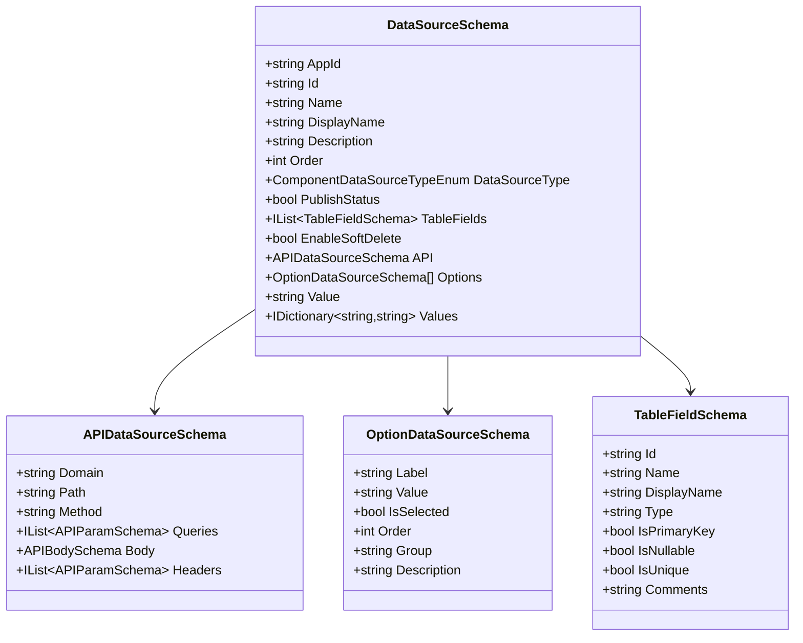

**图示来源**  
- [DataSourceSchema.cs:1-69](file://src/LowCode/Common/H.LowCode.MetaSchema/DataSourceSchema.cs#L1-L69)  
- [APIDataSourceSchema.cs:1-59](file://src/LowCode/Common/H.LowCode.MetaSchema/DataSourceSchemas/APIDataSourceSchema.cs#L1-L59)  
- [OptionDataSourceSchema.cs:1-28](file://src/LowCode/Common/H.LowCode.MetaSchema/DataSourceSchemas/OptionDataSourceSchema.cs#L1-L28)  
- [TableFieldSchema.cs:1-33](file://src/LowCode/Common/H.LowCode.MetaSchema/DataSourceSchemas/TableFieldSchema.cs#L1-L33)

**章节来源**  
- [ComponentSchemaBase.cs:1-110](file://src/LowCode/Common/H.LowCode.MetaSchema/ComponentSchemaBase.cs#L1-L110)  
- [ComponentFragmentSchemaBase.cs:1-82](file://src/LowCode/Common/H.LowCode.MetaSchema/PropertySchemas/ComponentFragmentSchemaBase.cs#L1-L82)  
- [ComponentStyleSchema.cs:1-38](file://src/LowCode/Common/H.LowCode.MetaSchema/PropertySchemas/ComponentStyleSchema.cs#L1-L38)  
- [EventSchema.cs:1-66](file://src/LowCode/Common/H.LowCode.MetaSchema/PropertySchemas/EventSchema.cs#L1-L66)  
- [DataSourceSchema.cs:1-69](file://src/LowCode/Common/H.LowCode.MetaSchema/DataSourceSchema.cs#L1-L69)  
- [APIDataSourceSchema.cs:1-59](file://src/LowCode/Common/H.LowCode.MetaSchema/DataSourceSchemas/APIDataSourceSchema.cs#L1-L59)  
- [OptionDataSourceSchema.cs:1-28](file://src/LowCode/Common/H.LowCode.MetaSchema/DataSourceSchemas/OptionDataSourceSchema.cs#L1-L28)  
- [TableFieldSchema.cs:1-33](file://src/LowCode/Common/H.LowCode.MetaSchema/DataSourceSchemas/TableFieldSchema.cs#L1-L33)

### 原生 HTML 元素支持

原生 HTML 元素支持是低代码平台的重要特性。它允许编辑器直接使用 `html:{tag}` 的形式声明原生 HTML 标签，而无需提前编译 Blazor 组件。

`NativeHtmlElement` 提供以下能力：

| 功能 | 说明 |
|---|---|
| 原生标签识别 | 判断类型名是否以 `html:` 开头 |
| 标签名提取 | 从 `html:button` 中提取 `button` |
| 事件名映射 | 将 Blazor 事件名映射为 HTML 事件名 |
| 表单控件识别 | 判断元素是否需要双向绑定 |
| 属性路径解析 | 解析 `childs.{i}...` 形式的嵌套属性路径 |
| 子元素路径计算 | 根据父路径和索引生成子路径 |
| 选项占位符替换 | 将 `$(value)`、`$(label)` 替换为实际选项值 |
| 条件类开关 | 支持 `class:` 前缀的条件样式合并 |

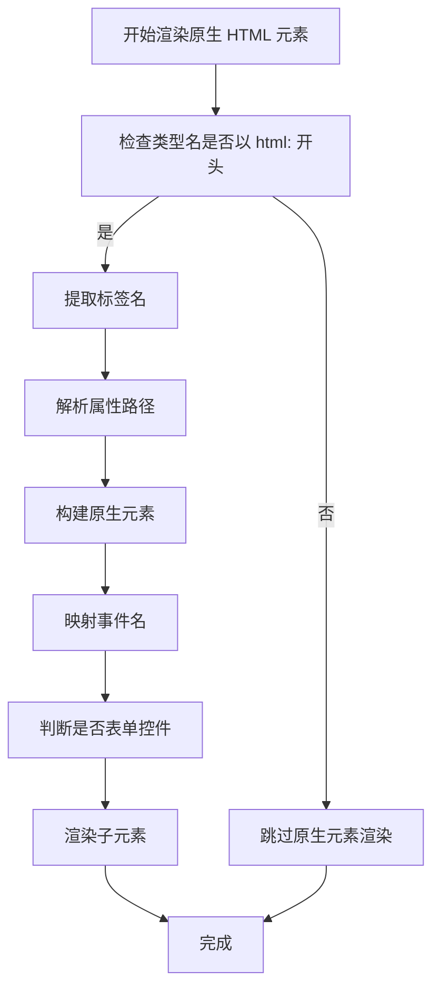

**图示来源**  
- [NativeHtmlElement.cs:1-121](file://src/LowCode/Common/H.LowCode.ComponentBase/NativeHtmlElement.cs#L1-L121)

**章节来源**  
- [NativeHtmlElement.cs:1-121](file://src/LowCode/Common/H.LowCode.ComponentBase/NativeHtmlElement.cs#L1-L121)

### 动态属性渲染流程

`LowCodeDynamicComponentBase` 的动态属性渲染是其核心逻辑。它将元数据中的属性数组转换为 Blazor 组件的实际属性。

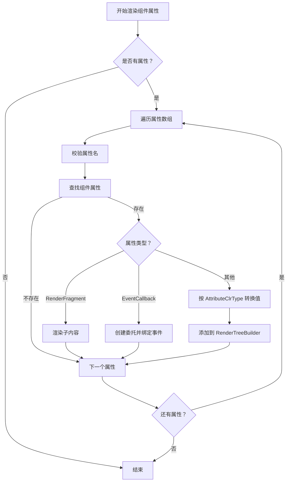

**图示来源**  
- [LowCodeDynamicComponentBase.cs:1-134](file://src/LowCode/Common/H.LowCode.ComponentBase/LowCodeDynamicComponentBase.cs#L1-L134)

**章节来源**  
- [LowCodeDynamicComponentBase.cs:1-134](file://src/LowCode/Common/H.LowCode.ComponentBase/LowCodeDynamicComponentBase.cs#L1-L134)

## 依赖关系分析

组件库的内部依赖关系清晰且分层明确：

- `LowCode.ComponentBase` 依赖 `H.Util.Blazor`、`Microsoft.AspNetCore.Components`、`Microsoft.Extensions.Logging`、`Microsoft.JSInterop`。
- `LowCode.ComponentBase` 依赖 `H.LowCode.MetaSchema`，用于读取组件片段、属性、事件等元数据。
- `H.LowCode.MetaSchema` 是纯模型层，不依赖 UI 框架，便于跨项目复用。
- `H.LowCode.MetaSchema.DesignEngine` 和 `H.LowCode.MetaSchema.RenderEngine` 分别面向设计器和渲染器的扩展需求。

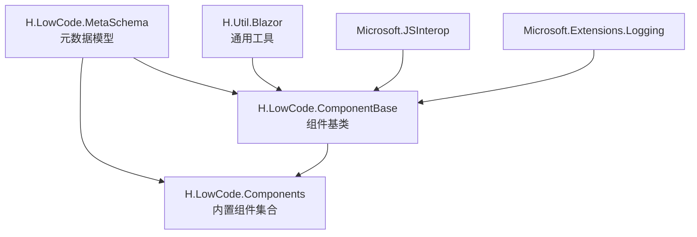

**图示来源**  
- [_Imports.razor:1-5](file://src/LowCode/Common/H.LowCode.ComponentBase/_Imports.razor#L1-L5)  
- [LowCodeComponentBase.cs:1-61](file://src/LowCode/Common/H.LowCode.ComponentBase/LowCodeComponentBase.cs#L1-L61)  
- [ComponentSchemaBase.cs:1-110](file://src/LowCode/Common/H.LowCode.MetaSchema/ComponentSchemaBase.cs#L1-L110)

**章节来源**  
- [_Imports.razor:1-5](file://src/LowCode/Common/H.LowCode.ComponentBase/_Imports.razor#L1-L5)  
- [LowCodeComponentBase.cs:1-61](file://src/LowCode/Common/H.LowCode.ComponentBase/LowCodeComponentBase.cs#L1-L61)

## 性能与可访问性

### 性能优化建议

1. **避免不必要的重渲染**  
   使用 `StateKey` 和设计模式判断，减少设计器下的冗余更新。

2. **谨慎使用动态组件**  
   `ResolveComponentType` 会反射查找类型，建议在高频渲染场景中缓存已解析类型。

3. **合理使用原生资源挂载**  
   `NativeResourceMount` 会在首次渲染时加载 JS 模块，应避免在大量重复节点中同时挂载相同资源。

4. **限制属性数组规模**  
   动态属性渲染会遍历属性数组，组件元数据中的 `Attributes` 不宜过大。

5. **优先使用静态样式**  
   如果可能，优先使用 CSS 变量和类名覆盖，而不是大量内联样式。

### 可访问性建议

1. **为原生表单元素提供语义化标签**  
   使用 `label`、`aria-label`、`aria-describedby` 等属性增强屏幕阅读器支持。

2. **为按钮和交互元素添加键盘支持**  
   确保组件可通过 Tab 聚焦，并通过 Enter 或 Space 触发交互。

3. **为颜色对比度提供足够对比**  
   避免仅靠颜色表达状态，应结合图标、文字或边框。

4. **为条件渲染内容提供合理焦点管理**  
   当条件变化导致 DOM 变化时，注意焦点恢复。

[本节为通用指导，不直接分析具体文件]

## 主题与样式定制

### 组件样式模型

组件样式由 `ComponentStyleSchema` 描述，主要字段包括：

| 字段 | 含义 | 默认值 |
|---|---|---|
| `ItemWidth` | 组件宽度 | 4 |
| `ItemHeight` | 组件高度（单位 px） | 85 |
| `LabelWidth` | 标签宽度（单位 px） | 180 |
| `DefaultStyle` | 默认样式字符串 | 空 |
| `CustomStyle` | 自定义样式字符串 | 空 |

这表示组件可以在设计器中配置尺寸和样式，并在渲染时应用到最终 DOM。

### 样式覆盖策略

推荐优先级如下：

1. **CSS 变量**：定义主题色、字体、间距等全局变量。
2. **组件类名**：通过组件输出的类名进行覆盖。
3. **内联样式**：仅在局部覆盖时使用，避免污染全局样式。
4. **`CustomStyle` 字段**：作为低代码编辑器提供的最后兜底方式。

### 响应式设计建议

1. 使用相对单位而非固定像素。
2. 在小屏设备上隐藏次要信息。
3. 使用栅格或弹性布局适配不同屏幕。
4. 通过 `PageLayout` 区分一列、二列、三列、四列布局。

**章节来源**  
- [ComponentStyleSchema.cs:1-38](file://src/LowCode/Common/H.LowCode.MetaSchema/PropertySchemas/ComponentStyleSchema.cs#L1-L38)  
- [PageCascadingModel.cs:1-23](file://src/LowCode/Common/H.LowCode.ComponentBase/CascadingModels/PageCascadingModel.cs#L1-L23)

## 自定义组件开发指南

### 开发流程概览

开发一个高质量自定义组件的标准流程如下：

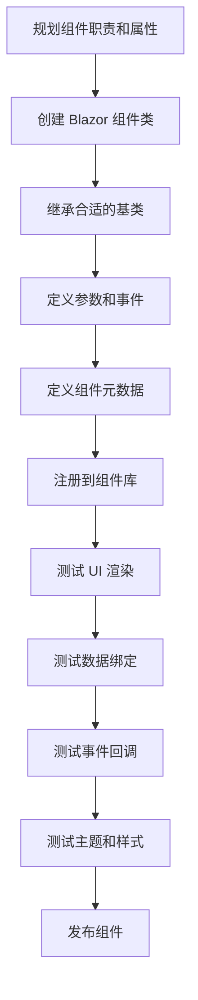

### 步骤一：选择基类

| 组件类型 | 推荐基类 | 理由 |
|---|---|---|
| 普通业务组件 | `LowCodeComponentBase` | 具备导航、日志、Toast、设计模式判断 |
| 页面容器组件 | `LowCodePageComponentBase` | 自带 `AppId`，适合页面级逻辑 |
| 布局外壳组件 | `LowCodeLayoutComponentBase` | 适合读取路由参数和承载页面布局 |
| 需要动态渲染的组件 | `LowCodeDynamicComponentBase` | 适合低代码引擎或高度配置化组件 |

### 步骤二：定义参数和事件

组件参数应与元数据中的 `Attributes` 保持一致。常见参数包括：

- 数据绑定参数，如 `Value`、`Items`、`DataSource`。
- 显示参数，如 `Label`、`Placeholder`、`Disabled`。
- 行为参数，如 `OnChange`、`OnClick`、`OnValidate`。
- 样式参数，如 `ClassName`、`Style`、`Width`、`Height`。

事件建议使用 `EventCallback` 或 `EventCallback<T>`，以便低代码引擎能正确绑定。

### 步骤三：定义组件元数据

组件元数据应至少包含：

- 组件标识 `Id`。
- 显示名称 `Label`。
- 组件类型 `ComponentType`。
- 是否容器 `IsContainer`。
- 属性列表 `Attributes`。
- 事件列表 `Events`。
- 样式配置 `Style`。
- 数据源配置 `DataSource`。

对于表单组件，还应定义：

- 校验规则 `ValidationRules`。
- 显示条件 `VisibleCondition`。
- 值类型 `ValueType`。

### 步骤四：注册并发布组件

组件注册通常发生在组件库或应用启动阶段。发布者需要提供：

- 程序集引用。
- 组件类型映射。
- 元数据定义。
- 样式和脚本资源。

发布后，组件可在低代码编辑器的组件面板中被拖拽使用。

### 开发模板建议

一个推荐的组件文件组织方式是：

| 文件 | 职责 |
|---|---|
| `MyComponent.razor` | 组件视图 |
| `MyComponent.razor.cs` | 组件逻辑、参数、事件 |
| `IMyComponentService.cs` | 可选的服务接口 |
| `MyComponentSchema.cs` | 组件元数据定义 |
| `MyComponentTests.razor` | 组件单元测试 |

**章节来源**  
- [LowCodeComponentBase.cs:1-61](file://src/LowCode/Common/H.LowCode.ComponentBase/LowCodeComponentBase.cs#L1-L61)  
- [LowCodePageComponentBase.cs:1-21](file://src/LowCode/Common/H.LowCode.ComponentBase/LowCodePageComponentBase.cs#L1-L21)  
- [LowCodeLayoutComponentBase.cs:1-64](file://src/LowCode/Common/H.LowCode.ComponentBase/LowCodeLayoutComponentBase.cs#L1-L64)  
- [LowCodeDynamicComponentBase.cs:1-134](file://src/LowCode/Common/H.LowCode.ComponentBase/LowCodeDynamicComponentBase.cs#L1-L134)  
- [ComponentFragmentSchemaBase.cs:1-82](file://src/LowCode/Common/H.LowCode.MetaSchema/PropertySchemas/ComponentFragmentSchemaBase.cs#L1-L82)

## 故障排查

### 动态组件无法渲染

**现象**：组件未渲染或整页崩溃。

**可能原因**：

- 组件类型名无效。
- 组件程序集未加载。
- 属性名不存在。
- 属性类型不匹配。

**处理建议**：

- 检查 `TypeName` 是否正确。
- 确认组件已注册到组件库。
- 检查 `AttributeClrType` 是否与目标属性类型一致。
- 参考 `ResolveComponentType` 的实现，确保类型解析不会抛出异常。

**章节来源**  
- [LowCodeDynamicComponentBase.cs:1-134](file://src/LowCode/Common/H.LowCode.ComponentBase/LowCodeDynamicComponentBase.cs#L1-L134)

### 原生资源加载失败

**现象**：外部 JS 或 CSS 未生效，控制台出现资源加载警告。

**可能原因**：

- JS 模块路径错误。
- 初始化函数名不正确。
- 资源清单为空。
- JS 模块导出缺失。

**处理建议**：

- 检查 `Resources` 清单中的 URL。
- 确认 `InitFunction` 与 JS 模块导出的函数名一致。
- 查看日志中的警告信息。
- 确保资源加载失败不会阻断页面渲染。

**章节来源**  
- [NativeResourceMount.razor:1-98](file://src/LowCode/Common/H.LowCode.ComponentBase/Components/NativeResourceMount.razor#L1-L98)

### 条件渲染不符合预期

**现象**：组件没有显示，或显示错误的分支。

**可能原因**：

- `Visible` 为 false。
- `ConditionValue` 不在 `Cases` 中。
- `Cases` 为空，退回到显示隐藏模式。

**处理建议**：

- 检查 `ConditionValue` 的类型和值。
- 检查 `Cases` 字典的键是否为字符串。
- 在无分支时使用 `Visible` 控制显隐。

**章节来源**  
- [Conditional.razor:1-76](file://src/LowCode/Common/H.LowCode.ComponentBase/Components/Conditional.razor#L1-L76)

### 事件绑定失败

**现象**：点击或输入事件未触发。

**可能原因**：

- 事件名与组件属性名不一致。
- 事件类型不是 `EventCallback`。
- 动态属性渲染时找不到对应方法。

**处理建议**：

- 确保组件上存在同名事件参数。
- 如果是动态组件，确认 `AttributeName` 指向真实事件属性。
- 使用 `EventCallback` 类型接收事件。

**章节来源**  
- [LowCodeDynamicComponentBase.cs:1-134](file://src/LowCode/Common/H.LowCode.ComponentBase/LowCodeDynamicComponentBase.cs#L1-L134)  
- [EventSchema.cs:1-66](file://src/LowCode/Common/H.LowCode.MetaSchema/PropertySchemas/EventSchema.cs#L1-L66)

## 结论

H.AppLab 组件库以元数据驱动为核心，构建了从设计器到运行时的完整组件生态。其优势在于：

- **基类体系清晰**：`LowCodeComponentBase`、`LowCodePageComponentBase`、`LowCodeLayoutComponentBase`、`LowCodeDynamicComponentBase` 覆盖了大多数组件场景。
- **元数据模型完备**：组件实例、片段、属性、事件、样式、数据源均有明确定义。
- **原生 HTML 支持完善**：允许低代码编辑器直接渲染原生标签，降低开发门槛。
- **外部资源集成友好**：`NativeResourceMount` 提供了标准化的第三方资源加载方案。
- **扩展性强**：通过枚举、片段、数据源等扩展点，可以快速构建领域专用组件。

对于组件开发者，建议遵循以下原则：

1. 优先继承合适的基类，不要重复造轮子。
2. 用元数据描述组件，而不是硬编码配置。
3. 保持组件职责单一，必要时拆分为原子组件和组合组件。
4. 重视样式、可访问性和性能。
5. 为组件编写测试，确保行为稳定。

对于低代码使用者，建议优先使用平台提供的条件渲染、原生资源挂载和动态渲染能力，减少手写样板代码，提高构建效率。