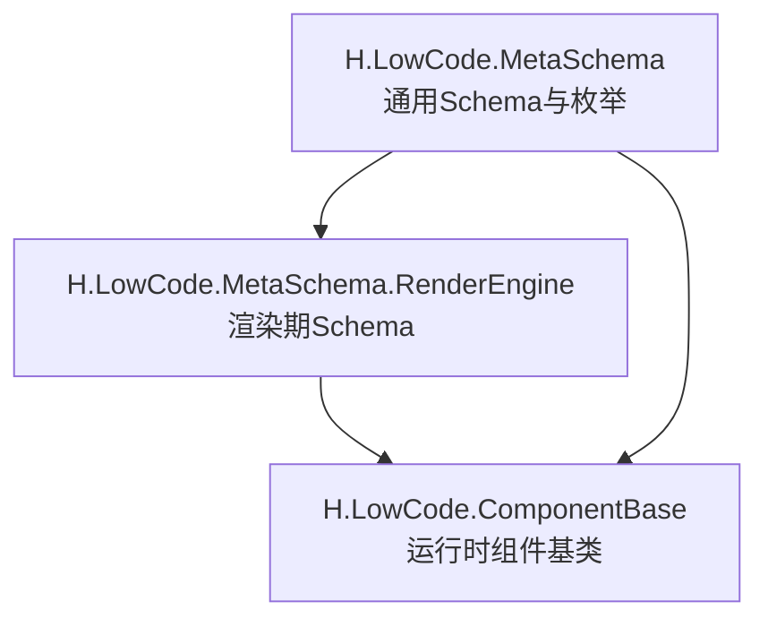
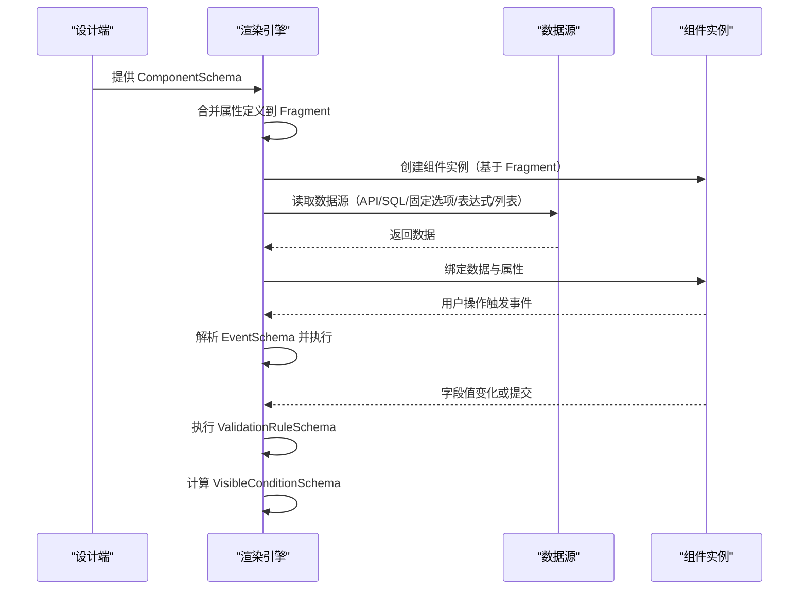

# 组件元数据Schema设计

<cite>
**本文引用的文件**   
- [ComponentFragmentSchemaBase.cs](file://src/LowCode/Common/H.LowCode.MetaSchema/PropertySchemas/ComponentFragmentSchemaBase.cs)
- [ComponentSchemaBase.cs](file://src/LowCode/Common/H.LowCode.MetaSchema/ComponentSchemaBase.cs)
- [StateHasChangeSchema.cs](file://src/LowCode/Common/H.LowCode.MetaSchema/StateHasChangeSchema.cs)
- [MetaSchemaBase.cs](file://src/LowCode/Common/H.LowCode.MetaSchema/MetaSchemaBase.cs)
- [AppSchemaBase.cs](file://src/LowCode/Common/H.LowCode.MetaSchema/AppSchemaBase.cs)
- [PagePropertySchema.cs](file://src/LowCode/Common/H.LowCode.MetaSchema/PropertySchemas/PagePropertySchema.cs)
- [ComponentStyleSchema.cs](file://src/LowCode/Common/H.LowCode.MetaSchema/PropertySchemas/ComponentStyleSchema.cs)
- [TablePropertySchema.cs](file://src/LowCode/Common/H.LowCode.MetaSchema/PropertySchemas/TableSchemas/TablePropertySchema.cs)
- [TableColumnSchema.cs](file://src/LowCode/Common/H.LowCode.MetaSchema/PropertySchemas/TableSchemas/TableColumnSchema.cs)
- [TableButtonSchema.cs](file://src/LowCode/Common/H.LowCode.MetaSchema/PropertySchemas/TableSchemas/TableButtonSchema.cs)
- [EventSchema.cs](file://src/LowCode/Common/H.LowCode.MetaSchema/PropertySchemas/EventSchema.cs)
- [ValidationRuleSchema.cs](file://src/LowCode/Common/H.LowCode.MetaSchema/PropertySchemas/ValidationRuleSchema.cs)
- [VisibleConditionSchema.cs](file://src/LowCode/Common/H.LowCode.MetaSchema/PropertySchemas/VisibleConditionSchema.cs)
- [ComponentValueTypeEnum.cs](file://src/LowCode/Common/H.LowCode.MetaSchema/Enums/ComponentValueTypeEnum.cs)
- [ComponentDataSourceSchema.cs](file://src/LowCode/Common/H.LowCode.MetaSchema/DataSourceSchemas/ComponentDataSourceSchema.cs)
- [APIDataSourceSchema.cs](file://src/LowCode/Common/H.LowCode.MetaSchema/DataSourceSchemas/APIDataSourceSchema.cs)
- [OptionDataSourceSchema.cs](file://src/LowCode/Common/H.LowCode.MetaSchema/DataSourceSchemas/OptionDataSourceSchema.cs)
- [SQLDataSourceSchema.cs](file://src/LowCode/Common/H.LowCode.MetaSchema/DataSourceSchemas/SQLDataSourceSchema.cs)
- [ListDataSourceSchema.cs](file://src/LowCode/Common/H.LowCode.MetaSchema/DataSourceSchemas/ListDataSourceSchema.cs)
- [ComponentDataSourceTypeEnum.cs](file://src/LowCode/Common/H.LowCode.MetaSchema/Enums/ComponentDataSourceTypeEnum.cs)
- [ComponentDataSourceGroupTypeEnum.cs](file://src/LowCode/Common/H.LowCode.MetaSchema/Enums/ComponentDataSourceGroupTypeEnum.cs)
- [PageDataSourceTypeEnum.cs](file://src/LowCode/Common/H.LowCode.MetaSchema/Enums/PageDataSourceTypeEnum.cs)
- [ComponentSchema.cs](file://src/LowCode/Common/H.LowCode.MetaSchema.RenderEngine/ComponentSchema.cs)
- [ComponentFragmentSchema.cs](file://src/LowCode/Common/H.LowCode.MetaSchema.RenderEngine/PropertySchemas/ComponentFragmentSchema.cs)
- [ComponentAttributeDefineGroupSchema.cs](file://src/LowCode/Common/H.LowCode.MetaSchema.RenderEngine/PropertySchemas/ComponentAttributeDefineGroupSchema.cs)
- [ComponentAttributeDefineSchema.cs](file://src/LowCode/Common/H.LowCode.MetaSchema.RenderEngine/PropertySchemas/ComponentAttributeDefineSchema.cs)
- [ComponentDataSourceSchema.cs](file://src/LowCode/Common/H.LowCode.MetaSchema.RenderEngine/DataSourceSchemas/ComponentDataSourceSchema.cs)
- [PageSchema.cs](file://src/LowCode/Common/H.LowCode.MetaSchema.RenderEngine/PageSchema.cs)
</cite>

## 目录
1. [引言](#引言)
2. [项目结构与定位](#项目结构与定位)
3. [核心概念总览](#核心概念总览)
4. [架构与数据流转](#架构与数据流转)
5. [基类与扩展机制](#基类与扩展机制)
6. [渲染引擎中的组件Schema](#渲染引擎中的组件schema)
7. [属性定义与显示配置规范](#属性定义与显示配置规范)
8. [验证规则规范](#验证规则规范)
9. [事件模型规范](#事件模型规范)
10. [数据源Schema规范](#数据源schema规范)
11. [页面与表格相关Schema](#页面与表格相关schema)
12. [Schema设计规范与最佳实践](#schemadesign规范与最佳实践)
13. [常见问题排查](#常见问题排查)
14. [结论](#结论)

## 引言
本文面向 H.AppLab 低代码平台的组件元数据Schema设计，重点说明以下目标：
- ComponentFragmentSchemaBase 的设计意图、字段语义、默认值解析与资源加载机制。
- ComponentSchema 在渲染引擎中的作用、属性定义到Fragment属性的转换过程、以及子组件和条件分支的数据结构。
- 完整的Schema设计规范，包括数据类型、默认值、验证器、UI控件映射、事件和数据源的约定。
- 结合实际源码结构给出可落地的设计指南和排错建议。

本方案以“描述性Schema + 运行时渲染”为思路：设计端生成稳定的JSON Schema，渲染端按Fragment树构建实际UI，并通过数据源、事件和校验规则驱动交互。

## 项目结构与定位
H.AppLab 的组件元数据分布在三个关键包中：
- `H.LowCode.MetaSchema`：定义通用Schema类型、枚举、属性片段、事件、校验、可见条件、数据源等基础模型。
- `H.LowCode.MetaSchema.RenderEngine`：定义渲染阶段使用的具体Schema，例如 `ComponentSchema`、`ComponentFragmentSchema`、渲染期数据源Schema等。
- `H.LowCode.ComponentBase`：提供运行时组件基类与状态变更能力，是渲染引擎执行时与Blazor组件体系对接的基础。

**图示来源**
- [ComponentFragmentSchemaBase.cs:1-82](file://src/LowCode/Common/H.LowCode.MetaSchema/PropertySchemas/ComponentFragmentSchemaBase.cs#L1-L82)
- [ComponentSchema.cs:1-83](file://src/LowCode/Common/H.LowCode.MetaSchema.RenderEngine/ComponentSchema.cs#L1-L83)
- [ComponentFragmentSchema.cs:1-28](file://src/LowCode/Common/H.LowCode.MetaSchema.RenderEngine/PropertySchemas/ComponentFragmentSchema.cs#L1-L28)

**章节来源**
- [ComponentFragmentSchemaBase.cs:1-82](file://src/LowCode/Common/H.LowCode.MetaSchema/PropertySchemas/ComponentFragmentSchemaBase.cs#L1-L82)
- [ComponentSchema.cs:1-83](file://src/LowCode/Common/H.LowCode.MetaSchema.RenderEngine/ComponentSchema.cs#L1-L83)
- [ComponentFragmentSchema.cs:1-28](file://src/LowCode/Common/H.LowCode.MetaSchema.RenderEngine/PropertySchemas/ComponentFragmentSchema.cs#L1-L28)

## 核心概念总览
- **Fragment（片段）**：描述一个组件实例的最小可渲染单元，包含类型名、属性、内容、事件、静态资源和初始化函数。
- **ComponentSchema（组件Schema）**：描述一个完整组件实例，包含Fragment、数据源、属性定义分组、子组件列表、条件分支等。
- **属性定义（Attribute Define）**：用于设计端展示和配置的属性元信息；渲染时会转换为Fragment属性。
- **数据源（DataSource）**：描述组件或列表项如何获取数据，支持固定选项、API、SQL、表达式、列表循环等。
- **事件（Event）**：描述组件触发行为的目标动作、脚本、参数映射等。
- **验证规则（Validation Rule）**：描述字段必填、长度、数值范围、正则、自定义表达式等校验。
- **可见条件（Visible Condition）**：描述组件是否渲染的条件表达式。

这些概念共同构成“声明式页面 + 动态渲染”的核心。

**章节来源**
- [ComponentFragmentSchemaBase.cs:1-82](file://src/LowCode/Common/H.LowCode.MetaSchema/PropertySchemas/ComponentFragmentSchemaBase.cs#L1-L82)
- [ComponentSchema.cs:1-83](file://src/LowCode/Common/H.LowCode.MetaSchema.RenderEngine/ComponentSchema.cs#L1-L83)
- [EventSchema.cs:1-66](file://src/LowCode/Common/H.LowCode.MetaSchema/PropertySchemas/EventSchema.cs#L1-L66)
- [ValidationRuleSchema.cs:1-172](file://src/LowCode/Common/H.LowCode.MetaSchema/PropertySchemas/ValidationRuleSchema.cs#L1-L172)
- [VisibleConditionSchema.cs:1-49](file://src/LowCode/Common/H.LowCode.MetaSchema/PropertySchemas/VisibleConditionSchema.cs#L1-L49)

## 架构与数据流转
从设计端到渲染端，典型流程如下：
1. 设计端维护 `ComponentSchema`，其中包含 `AttributeDefineGroups` 和 `Fragment`。
2. 渲染前调用 `MergeAttributeDefineToFragment`，将属性定义合并为Fragment属性数组。
3. 渲染引擎遍历 `ComponentSchema.Childrens` 与 `Cases`，构建Fragment树。
4. 对每个Fragment解析类型名、加载资源、执行初始化函数。
5. 根据 `ComponentDataSourceSchema` 拉取数据并绑定到组件。
6. 用户交互触发事件，根据 `EventSchema` 路由到目标动作或脚本。
7. 表单提交或字段变化时，按 `ValidationRuleSchema` 执行校验。
8. 渲染过程中根据 `VisibleConditionSchema` 决定组件是否渲染。

**图示来源**
- [ComponentSchema.cs:28-83](file://src/LowCode/Common/H.LowCode.MetaSchema.RenderEngine/ComponentSchema.cs#L28-L83)
- [ComponentFragmentSchemaBase.cs:1-82](file://src/LowCode/Common/H.LowCode.MetaSchema/PropertySchemas/ComponentFragmentSchemaBase.cs#L1-L82)
- [ComponentDataSourceSchema.cs:1-18](file://src/LowCode/Common/H.LowCode.MetaSchema.RenderEngine/DataSourceSchemas/ComponentDataSourceSchema.cs#L1-L18)
- [EventSchema.cs:1-66](file://src/LowCode/Common/H.LowCode.MetaSchema/PropertySchemas/EventSchema.cs#L1-L66)
- [ValidationRuleSchema.cs:1-172](file://src/LowCode/Common/H.LowCode.MetaSchema/PropertySchemas/ValidationRuleSchema.cs#L1-L172)
- [VisibleConditionSchema.cs:1-49](file://src/LowCode/Common/H.LowCode.MetaSchema/PropertySchemas/VisibleConditionSchema.cs#L1-L49)

## 基类与扩展机制
### StateHasChangeSchema
所有可参与状态管理的Schema通常继承自 `StateHasChangeSchema`，其作用是：
- 提供内部状态键 `StateKey`，便于渲染引擎跟踪组件实例状态。
- 提供 `ChangeStateKey` 方法，用于强制刷新或重建组件。

这是后续 `MetaSchemaBase`、`ComponentSchemaBase`、`ComponentDataSourceSchemaBase` 的共同基础。

**章节来源**
- [StateHasChangeSchema.cs:1-15](file://src/LowCode/Common/H.LowCode.MetaSchema/StateHasChangeSchema.cs#L1-L15)

### MetaSchemaBase
提供元数据的审计字段，包括创建者ID、创建时间、修改者ID、修改时间。适用于应用级Schema。

**章节来源**
- [MetaSchemaBase.cs:1-18](file://src/LowCode/Common/H.LowCode.MetaSchema/MetaSchemaBase.cs#L1-L18)

### AppSchemaBase
应用级Schema基类，继承 `MetaSchemaBase`，并提供应用标识、名称、图标、图片、描述、排序、版本、发布状态、支持平台等字段。

**章节来源**
- [AppSchemaBase.cs:1-31](file://src/LowCode/Common/H.LowCode.MetaSchema/AppSchemaBase.cs#L1-L31)

### ComponentSchemaBase
组件级Schema基类，继承 `StateHasChangeSchema`，提供组件实例ID、父ID、名称、标签、组件类型、隐藏标题、容器标记、数据源支持标记、样式、事件、事件消费、校验规则、可见条件、描述、版本等字段。

关键点：
- `IsSupportDataSource` 对容器组件有特殊逻辑：容器组件不支持数据源。
- `Style` 使用 `ComponentStyleSchema` 描述宽度、高度、标签宽度、默认样式、自定义样式。
- `Events` 和 `EventConsumes` 分别表示组件发起的事件和可消费的外部事件。
- `ValidationRules` 描述字段校验。
- `VisibleCondition` 描述条件渲染。

**章节来源**
- [ComponentSchemaBase.cs:1-110](file://src/LowCode/Common/H.LowCode.MetaSchema/ComponentSchemaBase.cs#L1-L110)

### ComponentFragmentSchemaBase
片段级Schema基类，描述最小可渲染单元，关键字段：
- `TypeName`：组件类型名。
- `ValueType`：CLR类型字符串，用于解析默认值。
- `Attributes`：属性片段数组。
- `Content`：文本内容。
- `Events`：片段级事件。
- `Resources`：静态资源依赖（JS/CSS）。
- `InitFunction`：资源加载后的初始化函数名。
- `GetDefaultValue()`：根据 `ValueType` 解析默认值。

此外还定义了资源项 `ResourceItemSchema` 和属性片段 `ComponentAttributeFragmentSchema`。

**章节来源**
- [ComponentFragmentSchemaBase.cs:1-82](file://src/LowCode/Common/H.LowCode.MetaSchema/PropertySchemas/ComponentFragmentSchemaBase.cs#L1-L82)

## 渲染引擎中的组件Schema
### ComponentSchema
渲染期的组件Schema继承 `ComponentSchemaBase`，新增：
- `Fragment`：组件渲染片段。
- `DataSource`：组件数据源。
- `AttributeDefineGroups`：属性定义分组，设计端使用，渲染前会合并到Fragment。
- `Childrens`：子组件列表。
- `Cases`：条件分支字典。
- `DefaultCase`：默认分支。

重要方法：
- `MergeAttributeDefineToFragment`：将属性定义分组转换为Fragment属性数组，实现设计端配置与渲染端属性的桥接。

**章节来源**
- [ComponentSchema.cs:1-83](file://src/LowCode/Common/H.LowCode.MetaSchema.RenderEngine/ComponentSchema.cs#L1-L83)

### ComponentFragmentSchema
渲染期的FragmentSchema继承 `ComponentFragmentSchemaBase`，新增：
- `DefaultTypeName`：默认类型名，作为 `TypeName` 为空时的回退。
- `ChildFragments`：子片段数组。
- `HasChildren`：是否有子片段。

这表明渲染引擎不仅支持原子组件，还支持组合组件和原生HTML元素。

**章节来源**
- [ComponentFragmentSchema.cs:1-28](file://src/LowCode/Common/H.LowCode.MetaSchema.RenderEngine/PropertySchemas/ComponentFragmentSchema.cs#L1-L28)

### 渲染期数据源Schema
渲染期 `ComponentDataSourceSchema` 继承通用 `ComponentDataSourceSchemaBase`，新增：
- `DataSourceFragment`：数据源对应的Fragment。
- `ItemTemplate`：列表项模板，支持完整组件配置和条件渲染。

这意味着列表数据不仅可以填充字段，还可以渲染复杂子结构。

**章节来源**
- [ComponentDataSourceSchema.cs:1-18](file://src/LowCode/Common/H.LowCode.MetaSchema.RenderEngine/DataSourceSchemas/ComponentDataSourceSchema.cs#L1-L18)

## 属性定义与显示配置规范
### 属性片段结构
属性片段用于描述单个属性在渲染时的名称、CLR类型和值。

| 字段 | 含义 | 建议 |
| --- | --- | --- |
| `AttributeName` | 属性名 | 与组件C#属性一致 |
| `AttributeClrType` | CLR类型字符串 | 用于序列化与默认值解析 |
| `AttributeValue` | 属性值 | 可以是标量、对象、数组或表达式字符串 |

**章节来源**
- [ComponentFragmentSchemaBase.cs:57-82](file://src/LowCode/Common/H.LowCode.MetaSchema/PropertySchemas/ComponentFragmentSchemaBase.cs#L57-L82)

### 组件样式配置
`ComponentStyleSchema` 提供组件布局与样式控制：
- `ItemWidth`：组件宽度，参考栅格比例。
- `ItemHeight`：组件高度。
- `LabelWidth`：标签宽度。
- `DefaultStyle`：默认样式。
- `CustomStyle`：自定义样式。

**章节来源**
- [ComponentStyleSchema.cs:1-38](file://src/LowCode/Common/H.LowCode.MetaSchema/PropertySchemas/ComponentStyleSchema.cs#L1-L38)

### 页面属性配置
`PagePropertySchema` 描述页面级布局与数据源：
- `PageLayout`：页面布局列数。
- `TitleWidth`：标题宽度。
- `DefaultStyle`：页面默认样式。
- `CustomStyle`：页面自定义样式。
- `DataSource`：页面数据源。

**章节来源**
- [PagePropertySchema.cs:1-36](file://src/LowCode/Common/H.LowCode.MetaSchema/PropertySchemas/PagePropertySchema.cs#L1-L36)

### 属性定义分组与渲染期属性
渲染期通过 `ComponentAttributeDefineGroupSchema` 组织多个 `ComponentAttributeDefineSchema`，并在 `ComponentSchema.MergeAttributeDefineToFragment` 中转换为Fragment属性。

| 层级 | 用途 | 关键字段 |
| --- | --- | --- |
| 设计端属性定义分组 | 编辑器展示分组 | `AttributeDefines` |
| 设计端属性定义 | 属性元信息 | 继承自 `ComponentAttributeDefineSchemaBase` |
| 渲染端属性片段 | 组件实际属性 | `AttributeName`、`AttributeClrType`、`AttributeValue` |

**章节来源**
- [ComponentSchema.cs:18-83](file://src/LowCode/Common/H.LowCode.MetaSchema.RenderEngine/ComponentSchema.cs#L18-L83)
- [ComponentAttributeDefineGroupSchema.cs:1-9](file://src/LowCode/Common/H.LowCode.MetaSchema.RenderEngine/PropertySchemas/ComponentAttributeDefineGroupSchema.cs#L1-L9)
- [ComponentAttributeDefineSchema.cs:1-6](file://src/LowCode/Common/H.LowCode.MetaSchema.RenderEngine/PropertySchemas/ComponentAttributeDefineSchema.cs#L1-L6)

## 验证规则规范
`ValidationRuleSchema` 提供字段校验能力，支持多种内置规则和自定义表达式。

### 校验规则字段
| 字段 | 含义 | 示例 |
| --- | --- | --- |
| `Id` | 规则ID | 唯一标识 |
| `ComponentId` | 关联组件ID | 绑定到哪个组件 |
| `IsEnabled` | 是否启用 | 开关 |
| `RuleType` | 规则类型 | 必填、长度、数值、正则、邮箱、手机、URL、身份证、自定义 |
| `IsRequired` | 是否必填 | 配合Required类型使用 |
| `MinLength` / `MaxLength` | 最小/最大长度 | 字符串长度校验 |
| `MinValue` / `MaxValue` | 最小/最大值 | 数值范围校验 |
| `Pattern` | 正则表达式 | 格式校验 |
| `Expression` | 自定义表达式 | 灵活业务校验 |
| `ErrorMessage` | 错误消息 | 提示用户 |
| `Trigger` | 触发时机 | 失焦、改变、提交 |
| `Order` | 排序 | 多规则顺序 |

### 校验规则类型
- `Required`：必填校验。
- `MinLength`：最小长度。
- `MaxLength`：最大长度。
- `MinValue`：最小值。
- `MaxValue`：最大值。
- `Pattern`：正则。
- `Email`：邮箱。
- `Phone`：手机号。
- `Url`：URL。
- `IdCard`：身份证号。
- `Custom`：自定义表达式。

### 触发时机
- `Blur`：失去焦点。
- `Change`：值改变。
- `Submit`：提交时。

**章节来源**
- [ValidationRuleSchema.cs:1-172](file://src/LowCode/Common/H.LowCode.MetaSchema/PropertySchemas/ValidationRuleSchema.cs#L1-L172)

## 事件模型规范
`EventSchema` 描述组件事件的行为，支持标准事件、自定义脚本、数据操作事件。

### 标准事件字段
| 字段 | 含义 |
| --- | --- |
| `EventName` | 事件名 |
| `EventHandlerType` | 事件处理器类型 |
| `EventTargetId` | 事件目标ID |
| `EventTargetAction` | 事件目标动作 |
| `EventArgs` | 事件参数 |
| `RowDataParams` | 行数据参数映射 |

### 自定义事件字段
| 字段 | 含义 |
| --- | --- |
| `EventCustomLanguage` | 脚本语言 |
| `EventCustomScript` | 脚本内容 |

### 数据操作事件字段
| 字段 | 含义 |
| --- | --- |
| `EventDataActionType` | 数据操作类型 |

此外还有 `EventConsumeSchema` 表示组件可消费的事件。

**章节来源**
- [EventSchema.cs:1-66](file://src/LowCode/Common/H.LowCode.MetaSchema/PropertySchemas/EventSchema.cs#L1-L66)

## 数据源Schema规范
### 通用数据源基类
`ComponentDataSourceSchemaBase` 是所有组件数据源的抽象基类，提供：
- `DataSourceGroupType`：数据源分组类型。
- `DataSourceType`：数据源类型。
- `DataSourceId`：数据源ID。
- `DataSourceName`：数据源名称。
- `DataSourceValue`：数据源值。
- `FiexdOptionDataSource`：固定选项数据源。
- `APIOptionDataSource`：API选项数据源。
- `SQLOptionDataSource`：SQL选项数据源。
- `DynamicOptionExpr`：动态选项表达式。
- `ListDataSource`：列表循环数据源。

**章节来源**
- [ComponentDataSourceSchema.cs:1-58](file://src/LowCode/Common/H.LowCode.MetaSchema/DataSourceSchemas/ComponentDataSourceSchema.cs#L1-L58)

### 数据源类型枚举
| 类型 | 含义 |
| --- | --- |
| `None` | 无 |
| `DB` | 数据库 |
| `API` | API接口 |
| `Option` | 选项 |
| `SQL` | SQL语句 |
| `Expression` | 表达式 |
| `Fiexd` | 固定值 |

**章节来源**
- [ComponentDataSourceTypeEnum.cs:1-15](file://src/LowCode/Common/H.LowCode.MetaSchema/Enums/ComponentDataSourceTypeEnum.cs#L1-L15)

### 数据源分组类型枚举
| 分组 | 含义 |
| --- | --- |
| `General` | 通用 |
| `Option` | 选项 |
| `Table` | 表格 |
| `Tree` | 树 |
| `List` | 列表循环 |

**章节来源**
- [ComponentDataSourceGroupTypeEnum.cs:1-13](file://src/LowCode/Common/H.LowCode.MetaSchema/Enums/ComponentDataSourceGroupTypeEnum.cs#L1-L13)

### API数据源
`APIDataSourceSchema` 描述HTTP请求配置：
- `Domain`：域名。
- `Path`：路径。
- `Method`：请求方法。
- `Queries`：查询参数。
- `Body`：请求体。
- `Headers`：请求头。

`APIBodySchema` 支持JSON、Text、Multipart、Raw、Binary等类型。

**章节来源**
- [APIDataSourceSchema.cs:1-59](file://src/LowCode/Common/H.LowCode.MetaSchema/DataSourceSchemas/APIDataSourceSchema.cs#L1-L59)

### 固定选项数据源
`OptionDataSourceSchema` 描述静态选项：
- `Label`：显示文本。
- `Value`：值。
- `IsSelected`：是否选中。
- `Order`：排序。
- `Group`：分组。
- `Description`：描述。

**章节来源**
- [OptionDataSourceSchema.cs:1-28](file://src/LowCode/Common/H.LowCode.MetaSchema/DataSourceSchemas/OptionDataSourceSchema.cs#L1-L28)

### SQL数据源
`SQLDataSourceSchema` 描述SQL查询：
- `DbType`：数据库类型。
- `Sql`：SQL语句。

**章节来源**
- [SQLDataSourceSchema.cs:1-12](file://src/LowCode/Common/H.LowCode.MetaSchema/DataSourceSchemas/SQLDataSourceSchema.cs#L1-L12)

### 列表数据源
`ListDataSourceSchema` 描述列表循环数据源：
- `FixedData`：设计时固定数据。
- `APIDataSource`：API数据源。
- `SQLDataSource`：SQL数据源。
- `DataPath`：响应数据路径。
- `OrderBy`：排序字段。
- `OrderDesc`：是否倒序。
- `TableDataSourceId`：表数据源引用。
- `Filters`：加载过滤映射。
- `SaveToDataSourceId`：保存目标表数据源ID。
- `SaveMode`：保存模式。
- `SaveMap`：保存字段映射。

**章节来源**
- [ListDataSourceSchema.cs:1-92](file://src/LowCode/Common/H.LowCode.MetaSchema/DataSourceSchemas/ListDataSourceSchema.cs#L1-L92)

### 页面数据源类型
`PageDataSourceTypeEnum` 描述页面数据源类型：
- `None`：无。
- `DB`：数据库。
- `API`：API。

**章节来源**
- [PageDataSourceTypeEnum.cs:1-11](file://src/LowCode/Common/H.LowCode.MetaSchema/Enums/PageDataSourceTypeEnum.cs#L1-L11)

## 页面与表格相关Schema
### 表格属性
`TablePropertySchema` 描述表格配置：
- `Columns`：列配置。
- `SearchItems`：搜索项。
- `TopButtons`：表格上方按钮。
- `RowButtons`：表格行按钮。

**章节来源**
- [TablePropertySchema.cs:1-24](file://src/LowCode/Common/H.LowCode.MetaSchema/PropertySchemas/TableSchemas/TablePropertySchema.cs#L1-L24)

### 表格列
`TableColumnSchema` 描述列元信息：
- `Id`：列ID。
- `Name`：字段名。
- `Title`：列标题。
- `IsPrimaryKey`：是否主键。
- `Order`：顺序。
- `Filterable`：是否可过滤。
- `Sortable`：是否可排序。

**章节来源**
- [TableColumnSchema.cs:1-34](file://src/LowCode/Common/H.LowCode.MetaSchema/PropertySchemas/TableSchemas/TableColumnSchema.cs#L1-L34)

### 表格按钮
`TableButtonSchema` 描述按钮配置：
- `Id`：按钮ID。
- `Name`：按钮名。
- `Title`：按钮标题。
- `ButtonType`：按钮类型。
- `Disabled`：是否禁用。
- `Order`：顺序。
- `SupportEvents`：支持事件。
- `Events`：事件配置。
- `Update`：更新方法。

**章节来源**
- [TableButtonSchema.cs:1-48](file://src/LowCode/Common/H.LowCode.MetaSchema/PropertySchemas/TableSchemas/TableButtonSchema.cs#L1-L48)

### 表格搜索项
当前 `TableSearchItemSchema` 为空占位类，预留扩展点。

**章节来源**
- [TableSearchItemSchema.cs:1-6](file://src/LowCode/Common/H.LowCode.MetaSchema/PropertySchemas/TableSchemas/TableSearchItemSchema.cs#L1-L6)

### 页面Schema
渲染期 `PageSchema` 继承 `PageSchemaBase`，包含组件列表 `Components`。

**章节来源**
- [PageSchema.cs:1-9](file://src/LowCode/Common/H.LowCode.MetaSchema.RenderEngine/PageSchema.cs#L1-L9)

## Schema设计规范与最佳实践
### 数据类型定义
推荐使用 `ComponentValueTypeEnum` 作为属性值类型的统一枚举，避免随意字符串导致解析失败。常见类型包括：
- 字符串、文本、整数、浮点数、小数、布尔。
- 日期、数组、选项、表格、字符串列表、整数列表、树。

对于需要动态默认值的场景，可在 `ComponentFragmentSchemaBase.ValueType` 中指定CLR类型字符串，并由 `GetDefaultValue()` 自动解析。

**章节来源**
- [ComponentValueTypeEnum.cs:1-20](file://src/LowCode/Common/H.LowCode.MetaSchema/Enums/ComponentValueTypeEnum.cs#L1-L20)
- [ComponentFragmentSchemaBase.cs:1-40](file://src/LowCode/Common/H.LowCode.MetaSchema/PropertySchemas/ComponentFragmentSchemaBase.cs#L1-L40)

### 默认值设置
- 优先使用属性定义中的默认值。
- 若属性值为空且存在有效 `ValueType`，则使用 `GetDefaultValue()` 生成默认值。
- 对于复杂对象或集合，建议在设计端显式设置默认值，避免运行时反射开销。

**章节来源**
- [ComponentFragmentSchemaBase.cs:31-40](file://src/LowCode/Common/H.LowCode.MetaSchema/PropertySchemas/ComponentFragmentSchemaBase.cs#L31-L40)

### 验证器配置
- 必填字段应同时设置 `IsRequired=true` 与合适的 `RuleType=Required`。
- 字符串字段建议使用 `MinLength`/`MaxLength` 限制输入长度。
- 数值字段建议使用 `MinValue`/`MaxValue` 限制范围。
- 格式字段建议使用 `Pattern`、`Email`、`Phone`、`Url`、`IdCard`。
- 复杂业务校验使用 `Custom` 类型并填写 `Expression`。
- 合理设置 `Trigger`，避免频繁校验影响性能。

**章节来源**
- [ValidationRuleSchema.cs:1-172](file://src/LowCode/Common/H.LowCode.MetaSchema/PropertySchemas/ValidationRuleSchema.cs#L1-L172)

### UI控件映射
虽然源码未直接暴露UI控件映射枚举，但可通过以下方式约定：
- 使用 `ComponentValueTypeEnum` 推断输入控件类型。
- 使用 `ComponentStyleSchema` 控制布局。
- 使用 `TablePropertySchema` 配置表格控件。
- 使用 `PagePropertySchema` 配置页面布局。

**章节来源**
- [ComponentValueTypeEnum.cs:1-20](file://src/LowCode/Common/H.LowCode.MetaSchema/Enums/ComponentValueTypeEnum.cs#L1-L20)
- [ComponentStyleSchema.cs:1-38](file://src/LowCode/Common/H.LowCode.MetaSchema/PropertySchemas/ComponentStyleSchema.cs#L1-L38)
- [TablePropertySchema.cs:1-24](file://src/LowCode/Common/H.LowCode.MetaSchema/PropertySchemas/TableSchemas/TablePropertySchema.cs#L1-L24)
- [PagePropertySchema.cs:1-36](file://src/LowCode/Common/H.LowCode.MetaSchema/PropertySchemas/PagePropertySchema.cs#L1-L36)

### 事件与数据操作
- 标准事件应明确 `EventTargetId` 与 `EventTargetAction`。
- 自定义脚本应指定 `EventCustomLanguage` 与 `EventCustomScript`。
- 数据操作事件应使用 `EventDataActionType` 明确操作语义。
- 行数据参数映射应使用 `RowDataParams` 将URL参数与行字段对应。

**章节来源**
- [EventSchema.cs:1-66](file://src/LowCode/Common/H.LowCode.MetaSchema/PropertySchemas/EventSchema.cs#L1-L66)

### 数据源选择
- 简单下拉选项使用 `OptionDataSourceSchema`。
- 远程数据使用 `APIDataSourceSchema`。
- 数据库查询使用 `SQLDataSourceSchema`。
- 复杂列表使用 `ListDataSourceSchema`，并配置 `DataPath`、`Filters`、`SaveMap`。
- 表达式数据源使用 `DynamicOptionExpr`。

**章节来源**
- [OptionDataSourceSchema.cs:1-28](file://src/LowCode/Common/H.LowCode.MetaSchema/DataSourceSchemas/OptionDataSourceSchema.cs#L1-L28)
- [APIDataSourceSchema.cs:1-59](file://src/LowCode/Common/H.LowCode.MetaSchema/DataSourceSchemas/APIDataSourceSchema.cs#L1-L59)
- [SQLDataSourceSchema.cs:1-12](file://src/LowCode/Common/H.LowCode.MetaSchema/DataSourceSchemas/SQLDataSourceSchema.cs#L1-L12)
- [ListDataSourceSchema.cs:1-92](file://src/LowCode/Common/H.LowCode.MetaSchema/DataSourceSchemas/ListDataSourceSchema.cs#L1-L92)

### 条件渲染
使用 `VisibleConditionSchema` 控制组件显隐：
- `ValueExpr`：值来源表达式。
- `Op`：比较操作符。
- `ExpectExpr`：期望值表达式。

适合做联动显示、权限控制、动态布局等场景。

**章节来源**
- [VisibleConditionSchema.cs:1-49](file://src/LowCode/Common/H.LowCode.MetaSchema/PropertySchemas/VisibleConditionSchema.cs#L1-L49)

## 常见问题排查
### 组件未渲染
检查 `ComponentFragmentSchema.TypeName` 是否为空；如为空，检查 `DefaultTypeName` 是否正确。确认 `Fragment.ChildFragments` 是否存在。

**章节来源**
- [ComponentFragmentSchema.cs:1-28](file://src/LowCode/Common/H.LowCode.MetaSchema.RenderEngine/PropertySchemas/ComponentFragmentSchema.cs#L1-L28)

### 属性未生效
确认 `MergeAttributeDefineToFragment` 是否已调用，且 `AttributeDefineGroups` 非空。检查 `ComponentAttributeFragmentSchema.AttributeName` 是否与组件C#属性一致。

**章节来源**
- [ComponentSchema.cs:28-83](file://src/LowCode/Common/H.LowCode.MetaSchema.RenderEngine/ComponentSchema.cs#L28-L83)

### 数据源未加载
检查 `ComponentDataSourceSchema.DataSourceType` 是否正确，确认 `APIDataSource`、`SQLDataSource`、`ListDataSource` 配置完整。对于列表，确认 `DataPath` 指向正确的响应数组。

**章节来源**
- [ComponentDataSourceSchema.cs:1-18](file://src/LowCode/Common/H.LowCode.MetaSchema.RenderEngine/DataSourceSchemas/ComponentDataSourceSchema.cs#L1-L18)
- [APIDataSourceSchema.cs:1-59](file://src/LowCode/Common/H.LowCode.MetaSchema/DataSourceSchemas/APIDataSourceSchema.cs#L1-L59)
- [ListDataSourceSchema.cs:1-92](file://src/LowCode/Common/H.LowCode.MetaSchema/DataSourceSchemas/ListDataSourceSchema.cs#L1-L92)

### 校验未触发
检查 `ValidationRuleSchema.IsEnabled` 是否为真，`Trigger` 是否符合预期，`RuleType` 与字段类型匹配。

**章节来源**
- [ValidationRuleSchema.cs:1-172](file://src/LowCode/Common/H.LowCode.MetaSchema/PropertySchemas/ValidationRuleSchema.cs#L1-L172)

### 条件渲染不生效
检查 `VisibleConditionSchema.ValueExpr` 与 `ExpectExpr` 表达式语法，确认比较操作符 `Op` 符合业务语义。

**章节来源**
- [VisibleConditionSchema.cs:1-49](file://src/LowCode/Common/H.LowCode.MetaSchema/PropertySchemas/VisibleConditionSchema.cs#L1-L49)

## 结论
H.AppLab 的组件元数据Schema采用“设计端Schema + 渲染端Fragment”的双层结构：
- 设计端通过 `ComponentSchema` 与 `AttributeDefineGroups` 表达组件配置。
- 渲染端通过 `ComponentFragmentSchema` 构建可执行UI树。
- 数据源、事件、校验、可见条件共同构成完整的低代码交互模型。

遵循本文档的类型定义、默认值策略、验证器配置、UI控件映射、事件与数据源规范，可以稳定扩展新组件、新数据源与新交互行为，并保持Schema的可读性与可维护性。