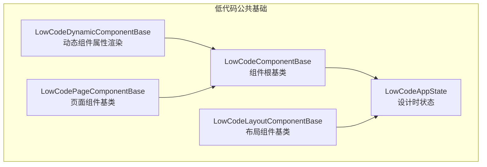
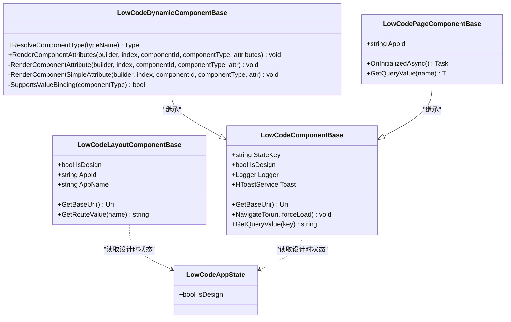
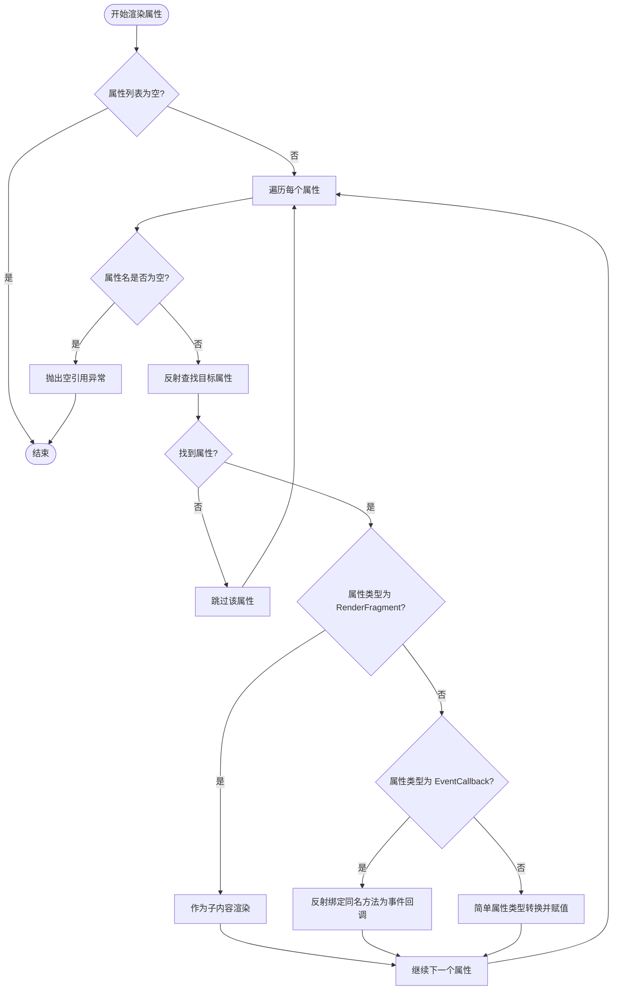
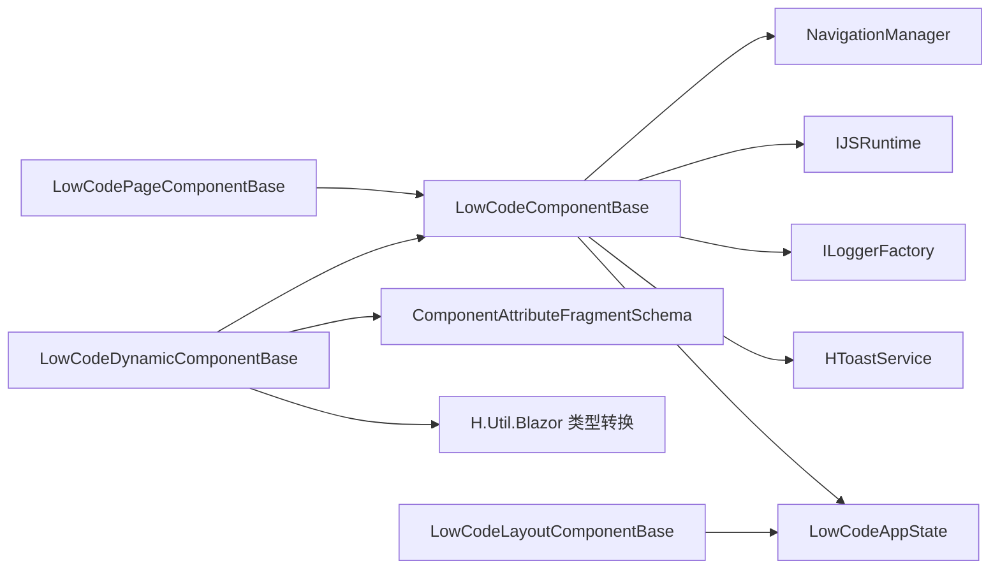

# 组件基类详解

<cite>
**本文引用的文件**   
- [LowCodeComponentBase.cs](file://src/LowCode/Common/H.LowCode.ComponentBase/LowCodeComponentBase.cs)
- [LowCodeDynamicComponentBase.cs](file://src/LowCode/Common/H.LowCode.ComponentBase/LowCodeDynamicComponentBase.cs)
- [LowCodeAppState.cs](file://src/LowCode/Common/H.LowCode.ComponentBase/LowCodeAppState.cs)
- [LowCodePageComponentBase.cs](file://src/LowCode/Common/H.LowCode.ComponentBase/LowCodePageComponentBase.cs)
- [LowCodeLayoutComponentBase.cs](file://src/LowCode/Common/H.LowCode.ComponentBase/LowCodeLayoutComponentBase.cs)
- [H.Util.Blazor/BlazorEventDispatcher.cs](file://src/Utils/H.Util.Blazor/BlazorEventDispatcher.cs)
- [H.Util.Blazor/HToastService.cs](file://src/Utils/H.Util.Blazor/HToastService.cs)
</cite>

## 目录
1. [引言](#引言)
2. [项目结构定位](#项目结构定位)
3. [核心组件总览](#核心组件总览)
4. [架构总览](#架构总览)
5. [详细组件分析](#详细组件分析)
6. [依赖关系分析](#依赖关系分析)
7. [性能与可维护性](#性能与可维护性)
8. [继承与扩展最佳实践](#继承与扩展最佳实践)
9. [常见问题排查](#常见问题排查)
10. [结论](#结论)

## 引言
本文面向 H.AppLab 低代码平台的组件开发者，系统性讲解组件基类的设计与使用：
- 抽象基类 LowCodeComponentBase：提供依赖注入、日志、导航、查询参数、设计时状态等通用能力。
- 动态组件基类 LowCodeDynamicComponentBase：负责从元数据中解析并渲染组件属性，包括类型转换、事件绑定、子内容渲染等高级特性。
- 页面与布局基类：为页面级和布局级组件提供路由、应用上下文等能力。
- 设计原则：以“约定优于配置”的方式，让自定义组件既能被低代码引擎动态驱动，又能保留 Blazor 原生开发体验。

## 项目结构定位
组件基类位于 LowCode 公共模块中，是渲染引擎与设计引擎共同依赖的基础设施：
- LowCodeComponentBase：所有运行时组件的根基类。
- LowCodeDynamicComponentBase：面向动态组件的属性渲染器。
- LowCodePageComponentBase / LowCodeLayoutComponentBase：面向页面与布局的专用基类。
- LowCodeAppState：全局设计时状态。

图表来源
- [LowCodeComponentBase.cs:1-61](file://src/LowCode/Common/H.LowCode.ComponentBase/LowCodeComponentBase.cs#L1-L61)
- [LowCodeDynamicComponentBase.cs:1-134](file://src/LowCode/Common/H.LowCode.ComponentBase/LowCodeDynamicComponentBase.cs#L1-L134)
- [LowCodePageComponentBase.cs:1-21](file://src/LowCode/Common/H.LowCode.ComponentBase/LowCodePageComponentBase.cs#L1-L21)
- [LowCodeLayoutComponentBase.cs:1-64](file://src/LowCode/Common/H.LowCode.ComponentBase/LowCodeLayoutComponentBase.cs#L1-L64)
- [LowCodeAppState.cs:1-14](file://src/LowCode/Common/H.LowCode.ComponentBase/LowCodeAppState.cs#L1-L14)

章节来源
- [LowCodeComponentBase.cs:1-61](file://src/LowCode/Common/H.LowCode.ComponentBase/LowCodeComponentBase.cs#L1-L61)
- [LowCodeDynamicComponentBase.cs:1-134](file://src/LowCode/Common/H.LowCode.ComponentBase/LowCodeDynamicComponentBase.cs#L1-L134)
- [LowCodePageComponentBase.cs:1-21](file://src/LowCode/Common/H.LowCode.ComponentBase/LowCodePageComponentBase.cs#L1-L21)
- [LowCodeLayoutComponentBase.cs:1-64](file://src/LowCode/Common/H.LowCode.ComponentBase/LowCodeLayoutComponentBase.cs#L1-L64)
- [LowCodeAppState.cs:1-14](file://src/LowCode/Common/H.LowCode.ComponentBase/LowCodeAppState.cs#L1-L14)

## 核心组件总览
- LowCodeComponentBase
  - 职责：统一注入日志、导航、JS 互操作、Toast 提示；暴露 IsDesign、StateKey、GetQueryValue、NavigateTo 等常用方法。
  - 关键依赖：NavigationManager、IJSRuntime、ILoggerFactory、HToastService、LowCodeAppState。
- LowCodeDynamicComponentBase
  - 职责：根据元数据中的 ComponentAttributeFragmentSchema 列表，动态为目标组件属性赋值，支持 RenderFragment、EventCallback、简单类型。
  - 关键能力：ResolveComponentType、RenderComponentAttributes、RenderComponentAttribute、RenderComponentSimpleAttribute。
- LowCodePageComponentBase
  - 职责：页面级基类，预留 AppId 与 GetQueryValue<T> 扩展点。
- LowCodeLayoutComponentBase
  - 职责：布局级基类，封装路由值读取、AppId/AppName 获取、IsDesign 判断、GetBaseUri 等。
- LowCodeAppState
  - 职责：承载是否处于设计时的全局状态，供组件与布局层判断 UI 行为差异。

章节来源
- [LowCodeComponentBase.cs:1-61](file://src/LowCode/Common/H.LowCode.ComponentBase/LowCodeComponentBase.cs#L1-L61)
- [LowCodeDynamicComponentBase.cs:1-134](file://src/LowCode/Common/H.LowCode.ComponentBase/LowCodeDynamicComponentBase.cs#L1-L134)
- [LowCodePageComponentBase.cs:1-21](file://src/LowCode/Common/H.LowCode.ComponentBase/LowCodePageComponentBase.cs#L1-L21)
- [LowCodeLayoutComponentBase.cs:1-64](file://src/LowCode/Common/H.LowCode.ComponentBase/LowCodeLayoutComponentBase.cs#L1-L64)
- [LowCodeAppState.cs:1-14](file://src/LowCode/Common/H.LowCode.ComponentBase/LowCodeAppState.cs#L1-L14)

## 架构总览
下图展示了组件基类的继承关系与依赖方向，以及它们如何与 Blazor 运行时协作。

图表来源
- [LowCodeComponentBase.cs:1-61](file://src/LowCode/Common/H.LowCode.ComponentBase/LowCodeComponentBase.cs#L1-L61)
- [LowCodeDynamicComponentBase.cs:1-134](file://src/LowCode/Common/H.LowCode.ComponentBase/LowCodeDynamicComponentBase.cs#L1-L134)
- [LowCodePageComponentBase.cs:1-21](file://src/LowCode/Common/H.LowCode.ComponentBase/LowCodePageComponentBase.cs#L1-L21)
- [LowCodeLayoutComponentBase.cs:1-64](file://src/LowCode/Common/H.LowCode.ComponentBase/LowCodeLayoutComponentBase.cs#L1-L64)
- [LowCodeAppState.cs:1-14](file://src/LowCode/Common/H.LowCode.ComponentBase/LowCodeAppState.cs#L1-L14)

## 详细组件分析

### LowCodeComponentBase：组件根基类
设计理念
- 将组件共用的基础设施通过依赖注入注入到基类，避免在每个组件重复编写样板代码。
- 暴露 IsDesign 与 StateKey 等状态标记，便于组件在“设计时/运行时”或“按需渲染”场景下差异化处理。
- 封装导航与查询参数解析，统一 URL 相关逻辑。

核心能力
- 依赖注入
  - NavigationManager：统一导航入口。
  - IJSRuntime：JS 互操作入口。
  - ILoggerFactory：按组件类型创建 ILogger。
  - HToastService：轻提示服务。
  - LowCodeAppState：设计时模式开关。
- 状态与渲染控制
  - StateKey：可用于 ShouldRender 判断，减少不必要的重渲染。
  - IsDesign：读取设计时状态，用于条件渲染或交互差异。
- 导航与地址
  - GetBaseUri：基于 NavigationManager.BaseUri 构建基础 URI。
  - NavigateTo：调用 NavigationManager.NavigateTo，支持强制加载。
  - GetQueryValue：从当前 URI 查询字符串中取值。

注意事项
- Logger 是通过 LoggerFactory.CreateLogger(GetType()) 创建的，因此日志类别天然包含组件类型名，便于分类检索。
- StateKey 需要由使用者自行设置并在 ShouldRender 中使用，否则不会自动生效。

章节来源
- [LowCodeComponentBase.cs:1-61](file://src/LowCode/Common/H.LowCode.ComponentBase/LowCodeComponentBase.cs#L1-L61)

### LowCodeDynamicComponentBase：动态组件属性渲染器
设计理念
- 将“组件类型 + 属性元数据”映射为真实 Blazor 组件实例与属性，实现低代码引擎对任意组件的动态驱动。
- 优先保证渲染健壮性：当类型解析失败或属性缺失时，跳过该节点，不导致整页崩溃。

核心流程
- ResolveComponentType：按程序集限定名称解析 Type，失败返回 null。
- RenderComponentAttributes：遍历属性元数据数组，逐个渲染。
- RenderComponentAttribute：根据目标属性类型分支处理：
  - RenderFragment：将 AttributeValue 作为子内容渲染。
  - EventCallback：在当前组件上查找同名方法，反射创建委托并绑定。
  - 其他类型：走 RenderComponentSimpleAttribute。
- RenderComponentSimpleAttribute：
  - 要求元数据中包含 AttributeClrType，以便进行类型转换。
  - 将 AttributeValue 转换为目标 CLR 类型后，通过 AddAttribute 设置。

异常与容错
- 空属性名会抛出 NullReferenceException。
- 缺少 AttributeClrType 会直接 return，不报错，但属性不会被渲染。
- 类型解析失败（Type.GetType）返回 null，调用方应跳过渲染。

图表来源
- [LowCodeDynamicComponentBase.cs:1-134](file://src/LowCode/Common/H.LowCode.ComponentBase/LowCodeDynamicComponentBase.cs#L1-L134)

章节来源
- [LowCodeDynamicComponentBase.cs:1-134](file://src/LowCode/Common/H.LowCode.ComponentBase/LowCodeDynamicComponentBase.cs#L1-L134)

### LowCodePageComponentBase：页面组件基类
职责
- 为页面组件提供 AppId 参数。
- 提供 OnInitializedAsync 扩展点，便于页面初始化逻辑。
- 提供 GetQueryValue<T> 泛型扩展点，目前返回默认值，可作为后续扩展位置。

建议用法
- 页面组件继承该类，并通过 [Parameter] 接收 AppId。
- 若需从路由或查询字符串强类型读取参数，可在子类中实现 GetQueryValue<T> 的具体逻辑。

章节来源
- [LowCodePageComponentBase.cs:1-21](file://src/LowCode/Common/H.LowCode.ComponentBase/LowCodePageComponentBase.cs#L1-L21)

### LowCodeLayoutComponentBase：布局组件基类
职责
- 提供 IsDesign 判断（同组件基类）。
- 提供 AppId、AppName 访问，其中 AppName 目前仅返回 AppId，后续可扩展为从服务获取。
- 提供 GetRouteValue：从 RouteView.RouteData 中读取路由参数。
- 提供 GetBaseUri：复用 NavigationManager.BaseUri。

典型场景
- 在布局中根据 IsDesign 切换编辑态/预览态 UI。
- 在布局中读取路由参数，结合 AppId 决定加载哪些菜单或资源。

章节来源
- [LowCodeLayoutComponentBase.cs:1-64](file://src/LowCode/Common/H.LowCode.ComponentBase/LowCodeLayoutComponentBase.cs#L1-L64)

### LowCodeAppState：设计时状态
职责
- 承载 IsDesign 字段，表示当前是否处于设计器环境。
- 通常由宿主应用在启动时注入，供组件与布局判断渲染策略。

章节来源
- [LowCodeAppState.cs:1-14](file://src/LowCode/Common/H.LowCode.ComponentBase/LowCodeAppState.cs#L1-L14)

## 依赖关系分析
- 组件基类依赖 Blazor 运行时服务：NavigationManager、IJSRuntime、ILoggerFactory。
- 业务辅助服务：HToastService 用于轻提示，BlazorEventDispatcher 可用于事件分发（视具体实现而定）。
- 低代码元模型：LowCodeDynamicComponentBase 依赖 ComponentAttributeFragmentSchema 描述属性元数据。
- 工具扩展：属性值类型转换依赖 H.Util.Blazor 的类型扩展能力。

图表来源
- [LowCodeComponentBase.cs:1-61](file://src/LowCode/Common/H.LowCode.ComponentBase/LowCodeComponentBase.cs#L1-L61)
- [LowCodeDynamicComponentBase.cs:1-134](file://src/LowCode/Common/H.LowCode.ComponentBase/LowCodeDynamicComponentBase.cs#L1-L134)
- [LowCodePageComponentBase.cs:1-21](file://src/LowCode/Common/H.LowCode.ComponentBase/LowCodePageComponentBase.cs#L1-L21)
- [LowCodeLayoutComponentBase.cs:1-64](file://src/LowCode/Common/H.LowCode.ComponentBase/LowCodeLayoutComponentBase.cs#L1-L64)
- [LowCodeAppState.cs:1-14](file://src/LowCode/Common/H.LowCode.ComponentBase/LowCodeAppState.cs#L1-L14)
- [H.Util.Blazor/BlazorEventDispatcher.cs](file://src/Utils/H.Util.Blazor/BlazorEventDispatcher.cs)
- [H.Util.Blazor/HToastService.cs](file://src/Utils/H.Util.Blazor/HToastService.cs)

章节来源
- [LowCodeComponentBase.cs:1-61](file://src/LowCode/Common/H.LowCode.ComponentBase/LowCodeComponentBase.cs#L1-L61)
- [LowCodeDynamicComponentBase.cs:1-134](file://src/LowCode/Common/H.LowCode.ComponentBase/LowCodeDynamicComponentBase.cs#L1-L134)
- [LowCodePageComponentBase.cs:1-21](file://src/LowCode/Common/H.LowCode.ComponentBase/LowCodePageComponentBase.cs#L1-L21)
- [LowCodeLayoutComponentBase.cs:1-64](file://src/LowCode/Common/H.LowCode.ComponentBase/LowCodeLayoutComponentBase.cs#L1-L64)
- [LowCodeAppState.cs:1-14](file://src/LowCode/Common/H.LowCode.ComponentBase/LowCodeAppState.cs#L1-L14)
- [H.Util.Blazor/BlazorEventDispatcher.cs](file://src/Utils/H.Util.Blazor/BlazorEventDispatcher.cs)
- [H.Util.Blazor/HToastService.cs](file://src/Utils/H.Util.Blazor/HToastService.cs)

## 性能与可维护性
- 渲染性能
  - 使用 StateKey 配合 ShouldRender 可减少无意义重渲染，适合频繁更新但局部变化的组件。
  - 动态属性渲染采用逐属性处理，应避免传递过大的属性元数据数组。
- 类型转换
  - RenderComponentSimpleAttribute 依赖 AttributeClrType 进行转换，建议在元数据生成阶段确保类型准确，避免运行时多次尝试解析。
- 事件绑定
  - 事件回调通过反射查找方法名，命名应尽量唯一且语义清晰，避免歧义。
- 可维护性
  - 将通用导航、日志、提示、设计时判断逻辑放在基类，减少重复代码。
  - 对动态渲染失败路径保持静默跳过，提升整体稳定性。

[本节为通用指导，无需源码引用]

## 继承与扩展最佳实践

### 如何选择基类
- 普通运行时组件：继承 LowCodeComponentBase。
- 由低代码引擎动态驱动的组件：继承 LowCodeDynamicComponentBase，并使用其属性渲染方法。
- 页面级组件：继承 LowCodePageComponentBase，使用 AppId 与页面生命周期。
- 布局级组件：继承 LowCodeLayoutComponentBase，使用路由参数与应用信息。

### 动态属性渲染要点
- 为需要动态赋值的组件暴露 [Parameter] 属性，并确保属性名与元数据一致。
- 对于事件属性，确保组件中存在与 AttributeValue 同名的方法，以便事件回调正确绑定。
- 对于复杂类型，确保元数据中的 AttributeClrType 与目标属性类型一致，以保证 ConvertToRealType 能正确转换。

### 设计时与运行时差异化
- 使用 IsDesign 判断是否在编辑器环境中，从而显示边框、占位符或编辑工具。
- 在布局层根据 IsDesign 切换菜单、侧边栏等行为。

### 日志与提示
- 使用 Logger 记录关键步骤，类别自动包含组件类型，便于追踪。
- 使用 Toast 提供轻量用户反馈，避免阻塞式弹窗影响渲染。

章节来源
- [LowCodeComponentBase.cs:1-61](file://src/LowCode/Common/H.LowCode.ComponentBase/LowCodeComponentBase.cs#L1-L61)
- [LowCodeDynamicComponentBase.cs:1-134](file://src/LowCode/Common/H.LowCode.ComponentBase/LowCodeDynamicComponentBase.cs#L1-L134)
- [LowCodePageComponentBase.cs:1-21](file://src/LowCode/Common/H.LowCode.ComponentBase/LowCodePageComponentBase.cs#L1-L21)
- [LowCodeLayoutComponentBase.cs:1-64](file://src/LowCode/Common/H.LowCode.ComponentBase/LowCodeLayoutComponentBase.cs#L1-L64)

## 常见问题排查
- 动态组件未渲染
  - 检查 ResolveComponentType 是否能解析到目标类型。
  - 检查 ComponentAttributeFragmentSchema 中的 AttributeName 是否与组件 [Parameter] 一致。
- 事件未触发
  - 确认组件中存在与 AttributeValue 同名的方法，且可见性允许反射访问。
- 属性值为空
  - 若 AttributeValue 为 null，组件基类会记录警告日志；请检查元数据是否正确填充。
- 类型转换失败
  - 确认 AttributeClrType 正确设置，并与目标属性类型匹配。
- 设计时状态异常
  - 检查 LowCodeAppState.IsDesign 是否被正确注入与初始化。

章节来源
- [LowCodeDynamicComponentBase.cs:1-134](file://src/LowCode/Common/H.LowCode.ComponentBase/LowCodeDynamicComponentBase.cs#L1-L134)
- [LowCodeAppState.cs:1-14](file://src/LowCode/Common/H.LowCode.ComponentBase/LowCodeAppState.cs#L1-L14)

## 结论
LowCodeComponentBase 与 LowCodeDynamicComponentBase 构成了 H.AppLab 低代码平台组件体系的核心：前者提供通用的运行时能力，后者打通了元数据到真实组件属性的桥梁。配合页面与布局基类，开发者可以以最小成本构建既支持低代码动态驱动、又具备良好可维护性的自定义组件。遵循本文的继承与扩展建议，可以在保证稳定性的同时，充分发挥低代码平台的灵活性与扩展性。