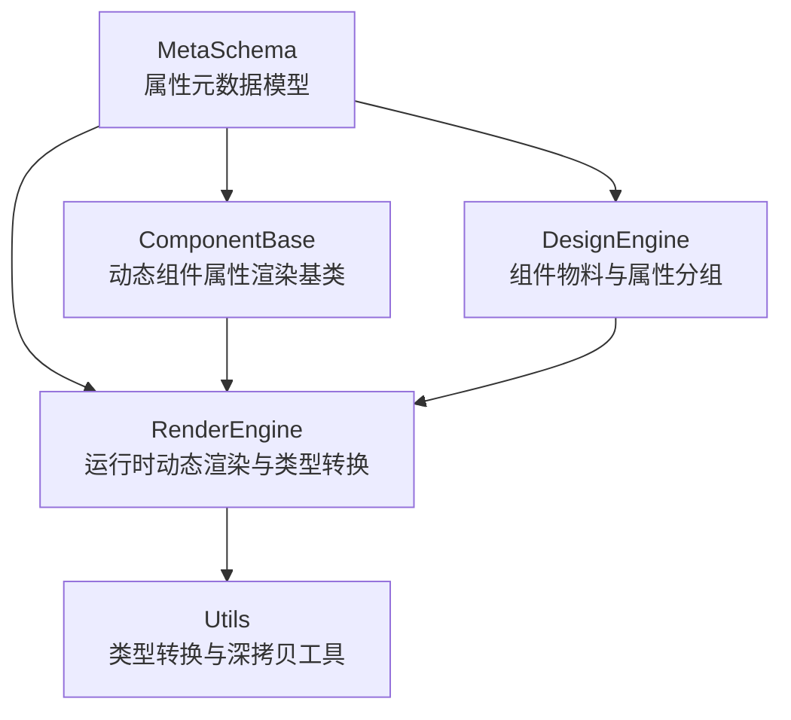
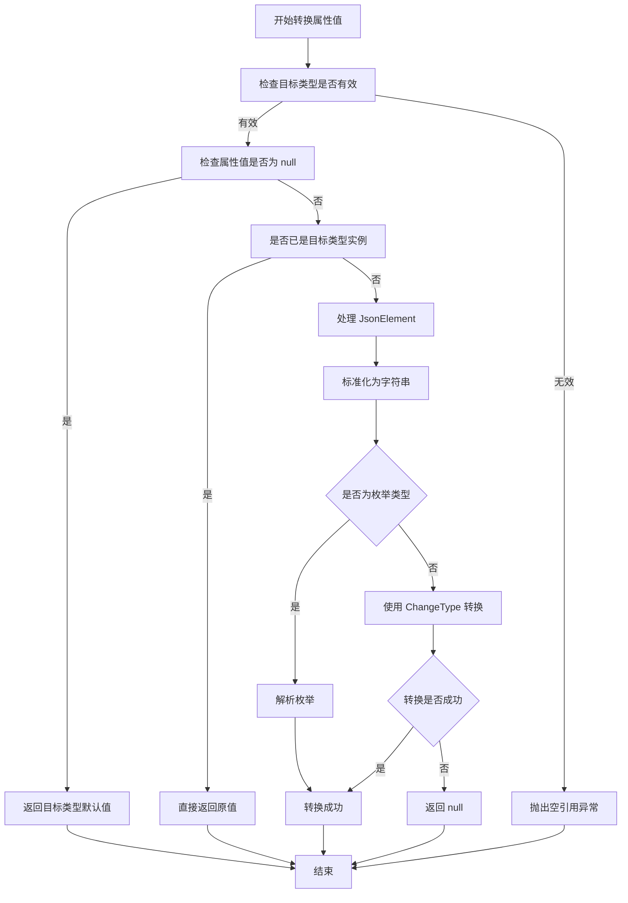
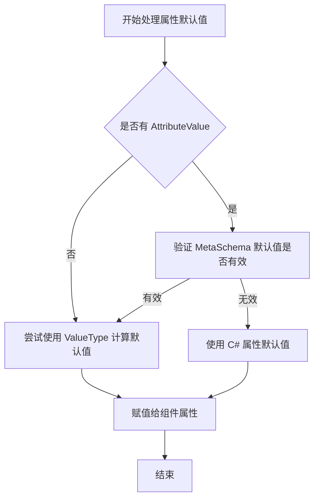
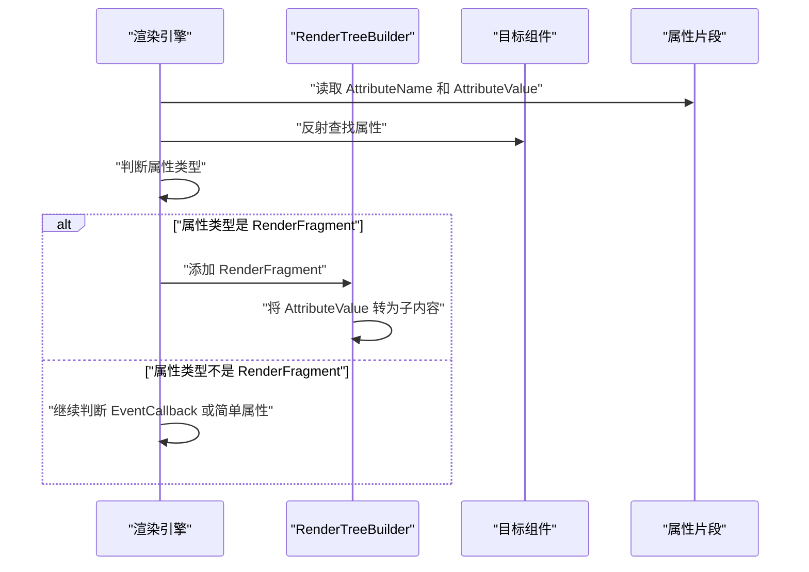
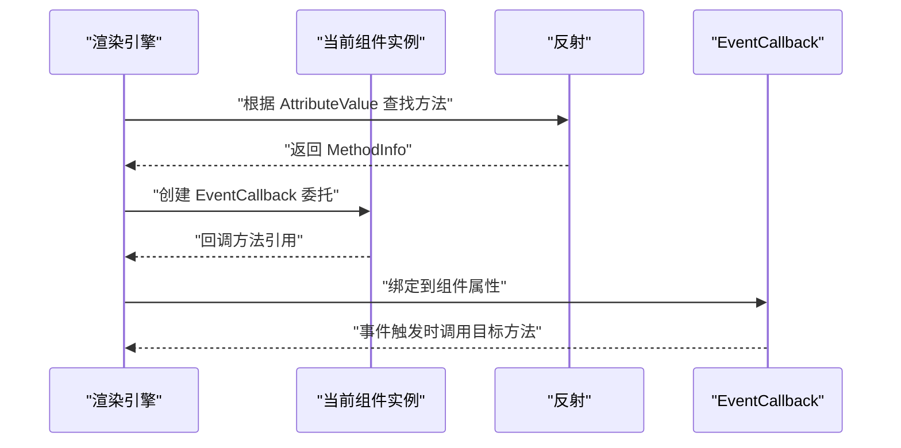
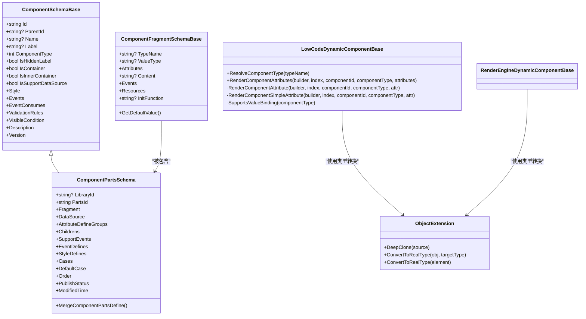
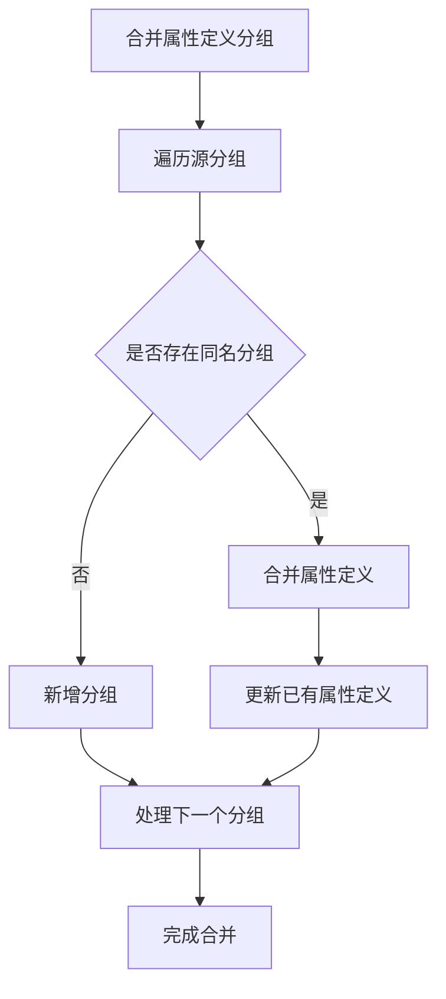
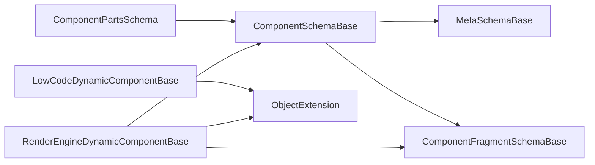

# 组件属性系统

<cite>
**本文引用的文件**   
- [ComponentSchemaBase.cs](file://src/LowCode/Common/H.LowCode.MetaSchema/ComponentSchemaBase.cs)
- [MetaSchemaBase.cs](file://src/LowCode/Common/H.LowCode.MetaSchema/MetaSchemaBase.cs)
- [ComponentFragmentSchemaBase.cs](file://src/LowCode/Common/H.LowCode.MetaSchema/PropertySchemas/ComponentFragmentSchemaBase.cs)
- [ComponentPartsSchema.cs](file://src/LowCode/Common/H.LowCode.MetaSchema.DesignEngine/ComponentPartsSchema.cs)
- [LowCodeDynamicComponentBase.cs](file://src/LowCode/Common/H.LowCode.ComponentBase/LowCodeDynamicComponentBase.cs)
- [RenderEngineDynamicComponentBase.cs](file://src/LowCode/RenderEngine/H.LowCode.RenderEngineBase/RenderEngineDynamicComponentBase.cs)
- [ObjectExtension.cs](file://src/Utils/H.Util.Base/ObjectExtension.cs)
- [ComponentValueTypeEnum.cs](file://src/LowCode/Common/H.LowCode.MetaSchema/Enums/ComponentValueTypeEnum.cs)
</cite>

## 目录
1. [引言](#引言)
2. [项目结构中的属性系统位置](#项目结构中的属性系统位置)
3. [核心概念：C# 参数属性与 MetaSchema 的双重定义](#核心概念c-参数属性与-metaschema-的双重定义)
4. [属性值自动类型转换流程](#属性值自动类型转换流程)
5. [验证规则执行与默认值处理](#验证规则执行与默认值处理)
6. [RenderFragment 子内容渲染机制](#renderfragment-子内容渲染机制)
7. [事件回调动态绑定过程](#事件回调动态绑定过程)
8. [架构总览](#架构总览)
9. [详细组件分析](#详细组件分析)
10. [依赖关系分析](#依赖关系分析)
11. [性能与健壮性特征](#性能与健壮性特征)
12. [扩展点与自定义属性类型开发指南](#扩展点与自定义属性类型开发指南)
13. [常见问题排查](#常见问题排查)
14. [结论](#结论)

## 引言
H.AppLab 低代码平台的组件属性系统，通过“C# 组件参数属性 + MetaSchema 元数据描述”双重声明方式，实现从设计器到运行时的统一属性建模、序列化、类型转换、渲染和事件绑定。其核心目标是让一个 C# Blazor 组件既能作为普通 UI 组件被开发者使用，也能作为低代码物料被设计器配置、运行时动态解析和渲染。

本文件重点解释：
- 属性如何在 C# 侧和 MetaSchema 侧同时声明。
- 属性值如何从 JSON 或表达式转换为真实 CLR 类型。
- 验证规则和默认值在何处生效。
- RenderFragment 子内容和事件回调如何由属性名动态绑定。
- 如何扩展新属性类型、自定义验证规则和渲染行为。

## 项目结构中的属性系统位置
属性系统横跨多个模块：
- MetaSchema 模块负责属性的元数据模型、枚举、通用片段结构和样式/事件等扩展字段。
- DesignEngine 模块负责组件物料定义、属性分组、默认值、选项和合并策略。
- ComponentBase 模块提供基础组件能力，包括动态组件属性渲染的轻量实现。
- RenderEngine 模块提供运行时动态组件渲染、属性值解析、类型转换和事件绑定。
- Utils 模块提供对象深拷贝和类型转换工具。

**图表来源**
- [ComponentSchemaBase.cs:1-110](file://src/LowCode/Common/H.LowCode.MetaSchema/ComponentSchemaBase.cs#L1-L110)
- [ComponentPartsSchema.cs:1-229](file://src/LowCode/Common/H.LowCode.MetaSchema.DesignEngine/ComponentPartsSchema.cs#L1-L229)
- [LowCodeDynamicComponentBase.cs:1-134](file://src/LowCode/Common/H.LowCode.ComponentBase/LowCodeDynamicComponentBase.cs#L1-L134)
- [RenderEngineDynamicComponentBase.cs:900-1020](file://src/LowCode/RenderEngine/H.LowCode.RenderEngineBase/RenderEngineDynamicComponentBase.cs#L900-L1020)
- [ObjectExtension.cs:1-105](file://src/Utils/H.Util.Base/ObjectExtension.cs#L1-L105)

**章节来源**
- [ComponentSchemaBase.cs:1-110](file://src/LowCode/Common/H.LowCode.MetaSchema/ComponentSchemaBase.cs#L1-L110)
- [ComponentPartsSchema.cs:1-229](file://src/LowCode/Common/H.LowCode.MetaSchema.DesignEngine/ComponentPartsSchema.cs#L1-L229)
- [LowCodeDynamicComponentBase.cs:1-134](file://src/LowCode/Common/H.LowCode.ComponentBase/LowCodeDynamicComponentBase.cs#L1-L134)
- [RenderEngineDynamicComponentBase.cs:900-1020](file://src/LowCode/RenderEngine/H.LowCode.RenderEngineBase/RenderEngineDynamicComponentBase.cs#L900-L1020)
- [ObjectExtension.cs:1-105](file://src/Utils/H.Util.Base/ObjectExtension.cs#L1-L105)

## 核心概念：C# 参数属性与 MetaSchema 的双重定义
### C# 参数属性
Blazor 组件通过 C# `@attribute` 或直接声明 `[Parameter]` 暴露属性。例如，组件可以暴露文本、数值、布尔值、列表、事件回调以及 `RenderFragment` 子内容。这些属性是运行时直接消费的类型契约。

### MetaSchema 属性定义
MetaSchema 通过 JSON 结构描述同一个属性，用于设计器和运行时：
- `attrn`：属性名称，必须与 C# 组件上的参数属性名一致。
- `attrt`：属性值的 CLR 类型字符串，用于反序列化和类型转换。
- `attrv`：属性值，可能是字符串、数字、布尔值、JSON 对象或数组。
- `t`：片段类型名，用于指定组件类型。
- `valt`：值类型，用于计算默认值。
- `attrs`：属性数组，描述该片段或组件实例的所有属性。
- `content`：子节点内容的静态文本表示。
- `evs`：事件配置。
- `stydefs`、`options`、`defaultValue`、`validationRules` 等：在设计器中展示校验、默认值和选项。

### 双重定义的作用
- **设计时**：设计器读取 MetaSchema，生成可视化表单、下拉选项、校验提示和属性分组。
- **运行时**：渲染引擎读取属性片段，查找对应 C# 组件的属性，将 `attrv` 转换为真实类型后赋值。
- **一致性**：只要 `AttributeName` 与 C# 属性名一致，就能保证设计器配置与运行时行为一致。

**章节来源**
- [ComponentFragmentSchemaBase.cs:1-82](file://src/LowCode/Common/H.LowCode.MetaSchema/PropertySchemas/ComponentFragmentSchemaBase.cs#L1-L82)
- [ComponentPartsSchema.cs:1-229](file://src/LowCode/Common/H.LowCode.MetaSchema.DesignEngine/ComponentPartsSchema.cs#L1-L229)
- [ComponentSchemaBase.cs:1-110](file://src/LowCode/Common/H.LowCode.MetaSchema/ComponentSchemaBase.cs#L1-L110)

## 属性值自动类型转换流程
属性值通常以字符串或 JSON 形式进入系统，最终需要变成 C# 组件期望的真实类型。转换逻辑主要由 `ObjectExtension.ConvertToRealType` 提供，并由渲染引擎在多处调用。

### 转换入口
- 在 `LowCodeDynamicComponentBase` 中，简单属性会通过 `AttributeClrType` 解析目标类型并调用转换方法。
- 在 `RenderEngineDynamicComponentBase` 中，渲染引擎会先根据反射获取属性的实际类型，再将值转换为该类型。

### 转换规则
1. 如果目标类型为 `null`，抛出异常。
2. 如果属性值为 `null`，返回目标类型的默认值。
3. 如果属性值已经是目标类型的实例，直接返回。
4. 如果是 `JsonElement`：
   - 字符串值取字符串。
   - 数值取原始文本。
5. 如果是枚举类型，按字符串解析为枚举。
6. 否则使用 `Convert.ChangeType` 进行基础类型转换。
7. 转换失败时返回 `null`，避免渲染崩溃。

**图表来源**
- [ObjectExtension.cs:1-105](file://src/Utils/H.Util.Base/ObjectExtension.cs#L1-L105)
- [RenderEngineDynamicComponentBase.cs:900-1020](file://src/LowCode/RenderEngine/H.LowCode.RenderEngineBase/RenderEngineDynamicComponentBase.cs#L900-L1020)
- [RenderEngineDynamicComponentBase.cs:1780-1935](file://src/LowCode/RenderEngine/H.LowCode.RenderEngineBase/RenderEngineDynamicComponentBase.cs#L1780-L1935)

**章节来源**
- [ObjectExtension.cs:1-105](file://src/Utils/H.Util.Base/ObjectExtension.cs#L1-L105)
- [RenderEngineDynamicComponentBase.cs:900-1020](file://src/LowCode/RenderEngine/H.LowCode.RenderEngineBase/RenderEngineDynamicComponentBase.cs#L900-L1020)
- [RenderEngineDynamicComponentBase.cs:1780-1935](file://src/LowCode/RenderEngine/H.LowCode.RenderEngineBase/RenderEngineDynamicComponentBase.cs#L1780-L1935)

## 验证规则执行与默认值处理
### 验证规则
组件级验证规则通过 `ValidationRuleSchema` 配置，常见场景包括必填、长度、格式、远程校验等。页面级表单验证服务会收集组件实例的验证规则并执行校验。

关键点：
- 验证规则属于组件实例的元数据，而不是 C# 组件内部逻辑。
- 设计器根据 `ValidationRuleSchema` 生成输入校验 UI。
- 运行时可调用表单验证服务对组件数据进行校验。

### 默认值处理
默认值有两个来源：
1. **MetaSchema 默认值**：`ComponentFragmentSchemaBase.GetDefaultValue` 根据 `ValueType` 和目标类型返回默认值。
2. **C# 属性默认值**：C# 参数属性本身可以设置默认值，渲染引擎未覆盖时直接使用。

当 `AttributeValue` 为 `null` 时：
- `LowCodeDynamicComponentBase` 会记录警告日志，不强制填充默认值。
- `ObjectExtension.ConvertToRealType` 在目标类型存在且值为 `null` 时返回目标类型默认值。
- 渲染引擎在部分路径中优先使用反射得到的属性类型，再进行转换。

**图表来源**
- [ComponentFragmentSchemaBase.cs:1-82](file://src/LowCode/Common/H.LowCode.MetaSchema/PropertySchemas/ComponentFragmentSchemaBase.cs#L1-L82)
- [ObjectExtension.cs:1-105](file://src/Utils/H.Util.Base/ObjectExtension.cs#L1-L105)
- [ComponentSchemaBase.cs:1-110](file://src/LowCode/Common/H.LowCode.MetaSchema/ComponentSchemaBase.cs#L1-L110)

**章节来源**
- [ComponentSchemaBase.cs:1-110](file://src/LowCode/Common/H.LowCode.MetaSchema/ComponentSchemaBase.cs#L1-L110)
- [ComponentFragmentSchemaBase.cs:1-82](file://src/LowCode/Common/H.LowCode.MetaSchema/PropertySchemas/ComponentFragmentSchemaBase.cs#L1-L82)
- [ObjectExtension.cs:1-105](file://src/Utils/H.Util.Base/ObjectExtension.cs#L1-L105)

## RenderFragment 子内容渲染机制
当组件属性是 `RenderFragment` 类型时，渲染引擎不会把它当作普通值，而是将其视为子内容。

### 渲染流程
1. 遍历属性数组。
2. 找到目标属性名对应的 C# 属性。
3. 判断属性类型是否为 `RenderFragment`。
4. 如果是，则构造一个 `RenderFragment`，把 `AttributeValue` 转为字符串后作为子内容渲染。
5. 如果不是，继续判断是否为 `EventCallback`。
6. 如果都不是，走简单属性类型转换流程。

**图表来源**
- [LowCodeDynamicComponentBase.cs:1-134](file://src/LowCode/Common/H.LowCode.ComponentBase/LowCodeDynamicComponentBase.cs#L1-L134)
- [ComponentFragmentSchemaBase.cs:1-82](file://src/LowCode/Common/H.LowCode.MetaSchema/PropertySchemas/ComponentFragmentSchemaBase.cs#L1-L82)

**章节来源**
- [LowCodeDynamicComponentBase.cs:1-134](file://src/LowCode/Common/H.LowCode.ComponentBase/LowCodeDynamicComponentBase.cs#L1-L134)

## 事件回调动态绑定过程
事件回调通过属性名动态绑定到当前组件实例的方法。

### 绑定流程
1. 渲染引擎读取 `AttributeName` 和 `AttributeValue`。
2. 判断属性类型是否为 `EventCallback`。
3. 使用 `AttributeValue` 作为方法名，在当前组件实例上查找公共或非公共方法。
4. 如果找到方法，则用 `Delegate.CreateDelegate` 创建 `EventCallback`。
5. 将该回调添加到渲染树属性中。

**图表来源**
- [LowCodeDynamicComponentBase.cs:1-134](file://src/LowCode/Common/H.LowCode.ComponentBase/LowCodeDynamicComponentBase.cs#L1-L134)

**章节来源**
- [LowCodeDynamicComponentBase.cs:1-134](file://src/LowCode/Common/H.LowCode.ComponentBase/LowCodeDynamicComponentBase.cs#L1-L134)

## 架构总览
属性系统的整体架构可以分为四层：

1. **元数据层**：`ComponentSchemaBase`、`MetaSchemaBase`、`ComponentFragmentSchemaBase` 定义组件实例、属性和片段的结构。
2. **物料定义层**：`ComponentPartsSchema` 定义组件物料、属性分组、事件、样式、数据源和子组件。
3. **渲染基底层**：`LowCodeDynamicComponentBase` 提供轻量动态属性渲染，支持 `RenderFragment` 和 `EventCallback`。
4. **运行时渲染层**：`RenderEngineDynamicComponentBase` 提供完整属性解析、表达式解析、类型转换和事件绑定。

**图表来源**
- [ComponentSchemaBase.cs:1-110](file://src/LowCode/Common/H.LowCode.MetaSchema/ComponentSchemaBase.cs#L1-L110)
- [ComponentFragmentSchemaBase.cs:1-82](file://src/LowCode/Common/H.LowCode.MetaSchema/PropertySchemas/ComponentFragmentSchemaBase.cs#L1-L82)
- [ComponentPartsSchema.cs:1-229](file://src/LowCode/Common/H.LowCode.MetaSchema.DesignEngine/ComponentPartsSchema.cs#L1-L229)
- [LowCodeDynamicComponentBase.cs:1-134](file://src/LowCode/Common/H.LowCode.ComponentBase/LowCodeDynamicComponentBase.cs#L1-L134)
- [ObjectExtension.cs:1-105](file://src/Utils/H.Util.Base/ObjectExtension.cs#L1-L105)

## 详细组件分析

### 组件属性元数据：ComponentSchemaBase
`ComponentSchemaBase` 是所有组件实例的基础元数据模型，包含：
- 组件唯一标识 `Id`。
- 父组件标识 `ParentId`。
- 组件名称和显示标签。
- 组件类型、容器标记。
- 样式、事件、事件消费、校验规则、可见条件、版本等。

它体现了低代码平台中“组件即数据”的思想：每个组件实例都可以被序列化、存储、传输和重新渲染。

**章节来源**
- [ComponentSchemaBase.cs:1-110](file://src/LowCode/Common/H.LowCode.MetaSchema/ComponentSchemaBase.cs#L1-L110)

### 属性片段与属性定义：ComponentFragmentSchemaBase 与 ComponentPartsSchema
`ComponentFragmentSchemaBase` 描述一个可渲染的片段，包含：
- 类型名。
- 值类型。
- 属性数组。
- 静态内容。
- 事件配置。
- 资源依赖。
- 初始化函数。
- 默认值计算。

`ComponentPartsSchema` 描述组件物料，包含：
- 组件库标识和物料标识。
- 渲染片段。
- 数据源。
- 属性定义分组。
- 子组件。
- 支持事件、事件定义、样式定义。
- 条件分支。
- 排序、发布状态、修改时间。
- 设计态状态。
- 深克隆和合并策略。

其中属性分组合并逻辑会：
- 按分组名称匹配。
- 新增不存在的分组。
- 更新已存在分组的属性定义。
- 保留 DisplayName、ItemType、Description、DefaultValue、Options 等设计器所需字段。

**图表来源**
- [ComponentPartsSchema.cs:1-229](file://src/LowCode/Common/H.LowCode.MetaSchema.DesignEngine/ComponentPartsSchema.cs#L1-L229)

**章节来源**
- [ComponentFragmentSchemaBase.cs:1-82](file://src/LowCode/Common/H.LowCode.MetaSchema/PropertySchemas/ComponentFragmentSchemaBase.cs#L1-L82)
- [ComponentPartsSchema.cs:1-229](file://src/LowCode/Common/H.LowCode.MetaSchema.DesignEngine/ComponentPartsSchema.cs#L1-L229)

### 动态属性渲染：LowCodeDynamicComponentBase
该类提供轻量动态属性渲染能力：
- 根据属性名反射查找 C# 属性。
- 区分 `RenderFragment`、`EventCallback` 和普通属性。
- 对普通属性使用 `AttributeClrType` 转换类型。
- 对 `RenderFragment` 注入子内容。
- 对 `EventCallback` 动态绑定方法。

注意：该实现较为基础，适合简单场景；生产环境更推荐使用 `RenderEngineDynamicComponentBase`，因为它具备完整的表达式解析、类型推断和错误处理。

**章节来源**
- [LowCodeDynamicComponentBase.cs:1-134](file://src/LowCode/Common/H.LowCode.ComponentBase/LowCodeDynamicComponentBase.cs#L1-L134)

### 运行时属性渲染：RenderEngineDynamicComponentBase
该类是属性系统的核心运行时实现，负责：
- 解析组件类型。
- 遍历属性片段。
- 根据反射获取属性实际类型。
- 将属性值转换为真实类型。
- 渲染简单属性、子内容和事件。
- 支持表达式解析。

典型流程：
1. 获取属性名、类型字符串和值。
2. 通过反射找到 C# 属性。
3. 使用属性实际类型进行类型转换。
4. 将转换后的值写入渲染树。
5. 对 `RenderFragment` 和 `EventCallback` 做特殊处理。

**章节来源**
- [RenderEngineDynamicComponentBase.cs:900-1020](file://src/LowCode/RenderEngine/H.LowCode.RenderEngineBase/RenderEngineDynamicComponentBase.cs#L900-L1020)
- [RenderEngineDynamicComponentBase.cs:1780-1935](file://src/LowCode/RenderEngine/H.LowCode.RenderEngineBase/RenderEngineDynamicComponentBase.cs#L1780-L1935)

## 依赖关系分析
属性系统的依赖关系如下：

- `ComponentSchemaBase` 依赖 `MetaSchemaBase` 的审计字段。
- `ComponentPartsSchema` 继承 `ComponentSchemaBase`。
- `LowCodeDynamicComponentBase` 依赖 `ObjectExtension` 进行类型转换。
- `RenderEngineDynamicComponentBase` 同时依赖 `ObjectExtension` 和 MetaSchema 模型。

**图表来源**
- [ComponentSchemaBase.cs:1-110](file://src/LowCode/Common/H.LowCode.MetaSchema/ComponentSchemaBase.cs#L1-L110)
- [ComponentPartsSchema.cs:1-229](file://src/LowCode/Common/H.LowCode.MetaSchema.DesignEngine/ComponentPartsSchema.cs#L1-L229)
- [LowCodeDynamicComponentBase.cs:1-134](file://src/LowCode/Common/H.LowCode.ComponentBase/LowCodeDynamicComponentBase.cs#L1-L134)
- [RenderEngineDynamicComponentBase.cs:900-1020](file://src/LowCode/RenderEngine/H.LowCode.RenderEngineBase/RenderEngineDynamicComponentBase.cs#L900-L1020)
- [ObjectExtension.cs:1-105](file://src/Utils/H.Util.Base/ObjectExtension.cs#L1-L105)

**章节来源**
- [ComponentSchemaBase.cs:1-110](file://src/LowCode/Common/H.LowCode.MetaSchema/ComponentSchemaBase.cs#L1-L110)
- [ComponentPartsSchema.cs:1-229](file://src/LowCode/Common/H.LowCode.MetaSchema.DesignEngine/ComponentPartsSchema.cs#L1-L229)
- [LowCodeDynamicComponentBase.cs:1-134](file://src/LowCode/Common/H.LowCode.ComponentBase/LowCodeDynamicComponentBase.cs#L1-L134)
- [RenderEngineDynamicComponentBase.cs:900-1020](file://src/LowCode/RenderEngine/H.LowCode.RenderEngineBase/RenderEngineDynamicComponentBase.cs#L900-L1020)
- [ObjectExtension.cs:1-105](file://src/Utils/H.Util.Base/ObjectExtension.cs#L1-L105)

## 性能与健壮性特征
### 性能特征
- 属性反射发生在渲染阶段，频繁渲染时可能产生一定开销。
- `ConvertToRealType` 会进行字符串转换和枚举解析，复杂对象建议使用结构化 JSON 并在更高层完成反序列化。
- `RenderFragment` 子内容会额外创建一个渲染上下文。

### 健壮性特征
- 类型转换失败返回 `null`，避免整个页面崩溃。
- 找不到组件类型时返回 `null`，调用方应跳过渲染。
- 找不到属性名时直接忽略，避免抛错。
- 找不到事件方法时不绑定回调，避免运行时异常。

**章节来源**
- [LowCodeDynamicComponentBase.cs:1-134](file://src/LowCode/Common/H.LowCode.ComponentBase/LowCodeDynamicComponentBase.cs#L1-L134)
- [ObjectExtension.cs:1-105](file://src/Utils/H.Util.Base/ObjectExtension.cs#L1-L105)

## 扩展点与自定义属性类型开发指南

### 扩展点一：自定义 C# 组件属性
步骤：
1. 在 Blazor 组件中声明 C# 参数属性。
2. 确保属性名与 MetaSchema 中 `AttributeName` 一致。
3. 如需子内容，使用 `RenderFragment` 类型。
4. 如需事件，使用 `EventCallback` 或带泛型的 `EventCallback<T>`。

示例方向：
- 文本输入组件：暴露 `Text`、`Disabled`、`OnTextChanged`。
- 容器组件：暴露 `ChildContent`。
- 表格组件：暴露列定义、数据源、事件回调。

### 扩展点二：自定义 MetaSchema 属性定义
步骤：
1. 在组件物料定义中添加属性分组。
2. 在分组中添加属性定义，设置 `AttributeName`、`DisplayName`、`DefaultValue`、`Options`、`Description`。
3. 在设计器中配置属性表单。
4. 在运行时确保 `AttributeClrType` 或反射类型能正确解析。

### 扩展点三：自定义类型转换
如果内置 `ConvertToRealType` 不支持复杂类型，可以在渲染前完成 JSON 反序列化，或者扩展转换逻辑：
- 针对特定业务类型增加显式转换分支。
- 在 `RenderEngineDynamicComponentBase` 中拦截属性赋值。
- 在 `ObjectExtension` 中增加新的转换规则。

### 扩展点四：自定义验证规则
步骤：
1. 在 `ValidationRuleSchema` 中定义规则。
2. 在设计器中配置表单校验。
3. 在运行时调用表单验证服务执行校验。
4. 对异步校验结果进行反馈。

### 扩展点五：自定义 RenderFragment 子内容
步骤：
1. 在组件中暴露 `RenderFragment` 属性。
2. 在 MetaSchema 中通过 `content` 或嵌套片段描述子内容。
3. 在渲染引擎中识别 `RenderFragment` 类型并注入子内容。

### 实际应用场景
- **表单组件**：属性包括字段名、类型、默认值、校验规则、占位符。
- **按钮组件**：属性包括文本、图标、禁用状态、点击事件。
- **布局组件**：属性包括间距、对齐方式、子区域。
- **数据表格**：属性包括列定义、分页、排序、筛选、行点击事件。
- **图表组件**：属性包括数据集、维度、指标、主题、导出事件。

**章节来源**
- [ComponentPartsSchema.cs:1-229](file://src/LowCode/Common/H.LowCode.MetaSchema.DesignEngine/ComponentPartsSchema.cs#L1-L229)
- [ComponentFragmentSchemaBase.cs:1-82](file://src/LowCode/Common/H.LowCode.MetaSchema/PropertySchemas/ComponentFragmentSchemaBase.cs#L1-L82)
- [ComponentSchemaBase.cs:1-110](file://src/LowCode/Common/H.LowCode.MetaSchema/ComponentSchemaBase.cs#L1-L110)
- [ComponentValueTypeEnum.cs:1-20](file://src/LowCode/Common/H.LowCode.MetaSchema/Enums/ComponentValueTypeEnum.cs#L1-L20)

## 常见问题排查

### 问题一：属性值类型不匹配
现象：
- 属性渲染为空。
- 控制台出现转换失败或警告。

排查：
- 检查 `AttributeName` 是否与 C# 属性名一致。
- 检查 `AttributeClrType` 是否正确。
- 检查 `AttributeValue` 是否能转换为目标类型。
- 查看 `ConvertToRealType` 的返回值是否为 `null`。

**章节来源**
- [ObjectExtension.cs:1-105](file://src/Utils/H.Util.Base/ObjectExtension.cs#L1-L105)
- [LowCodeDynamicComponentBase.cs:1-134](file://src/LowCode/Common/H.LowCode.ComponentBase/LowCodeDynamicComponentBase.cs#L1-L134)

### 问题二：事件回调未触发
现象：
- 用户操作组件没有触发预期方法。

排查：
- 检查 `AttributeValue` 是否为目标方法名。
- 检查当前组件实例上是否存在该方法。
- 检查方法访问修饰符是否允许反射访问。
- 确认属性类型是否为 `EventCallback`。

**章节来源**
- [LowCodeDynamicComponentBase.cs:1-134](file://src/LowCode/Common/H.LowCode.ComponentBase/LowCodeDynamicComponentBase.cs#L1-L134)

### 问题三：RenderFragment 子内容未渲染
现象：
- 子节点内容为空。
- 只看到字符串文本而不是组件树。

排查：
- 检查属性类型是否为 `RenderFragment`。
- 检查 `AttributeValue` 是否为字符串或可转换为字符串的内容。
- 确认渲染引擎是否走了 `RenderFragment` 分支。

**章节来源**
- [LowCodeDynamicComponentBase.cs:1-134](file://src/LowCode/Common/H.LowCode.ComponentBase/LowCodeDynamicComponentBase.cs#L1-L134)

### 问题四：默认值未生效
现象：
- 组件属性未设置时显示空白或异常。

排查：
- 检查 `ValueType` 是否有效。
- 检查 `GetDefaultValue` 是否能返回合理默认值。
- 检查 C# 属性是否设置了默认值。
- 检查渲染引擎是否在属性值为 `null` 时进行了回退。

**章节来源**
- [ComponentFragmentSchemaBase.cs:1-82](file://src/LowCode/Common/H.LowCode.MetaSchema/PropertySchemas/ComponentFragmentSchemaBase.cs#L1-L82)
- [ObjectExtension.cs:1-105](file://src/Utils/H.Util.Base/ObjectExtension.cs#L1-L105)

## 结论
H.AppLab 低代码平台的组件属性系统以 MetaSchema 为核心，实现了设计器与运行时的属性契约统一。通过 C# 参数属性与 MetaSchema 双重定义，平台能够：
- 在设计器中配置属性、默认值、选项和校验规则。
- 在运行时将 JSON 或表达式转换为真实 CLR 类型。
- 动态渲染 `RenderFragment` 子内容。
- 动态绑定事件回调。
- 在类型转换失败时保持系统健壮性。

对于扩展需求，建议优先从组件属性命名一致性、MetaSchema 属性分组、类型转换扩展和验证规则四个方向入手，逐步完善自定义属性类型和低代码物料体系。