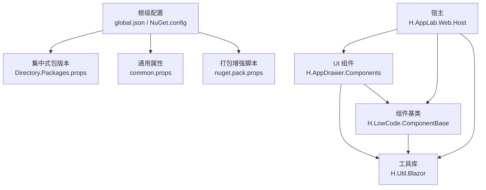
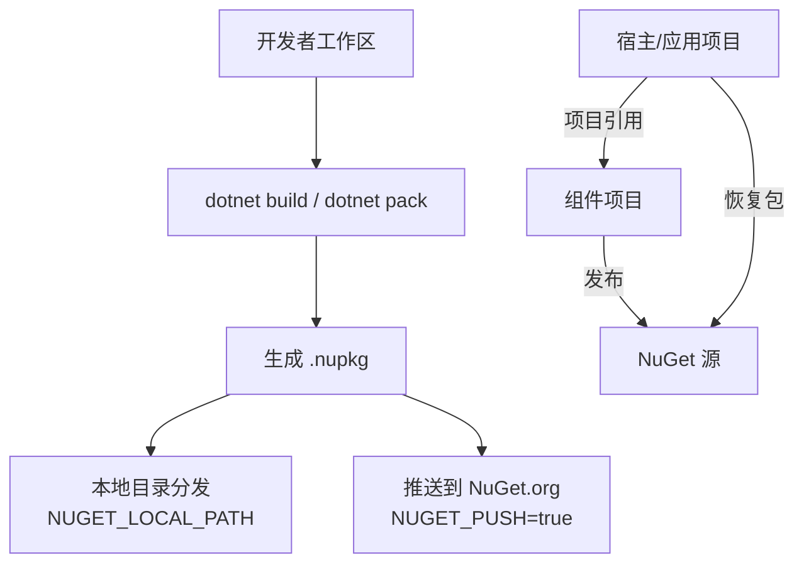
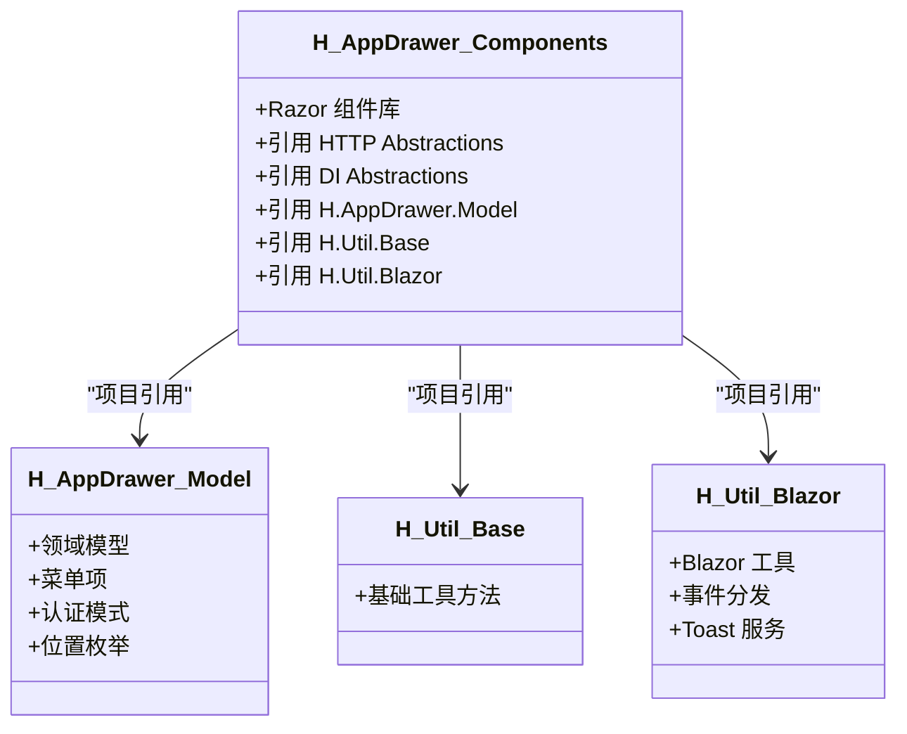
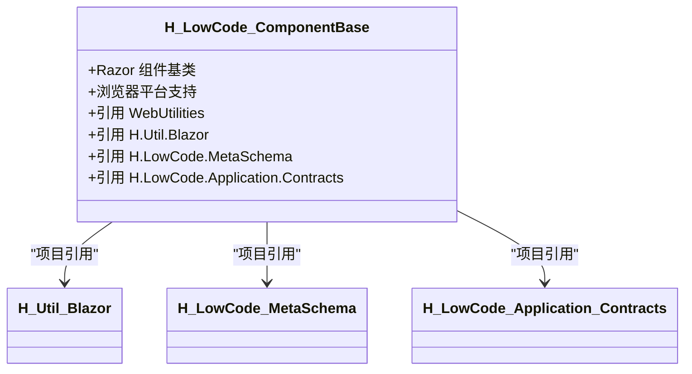
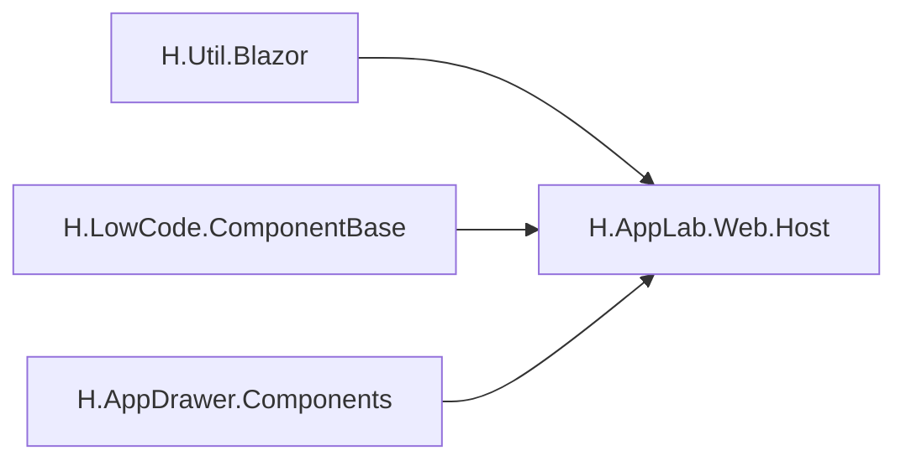
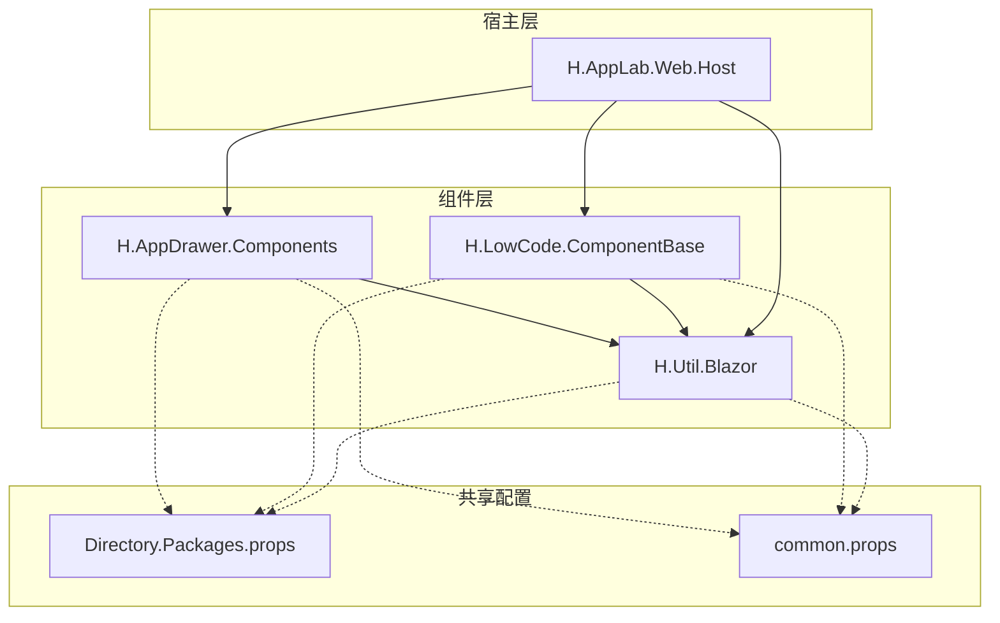

# 组件打包与发布

<cite>
**本文引用的文件**   
- [README.md](file://README.md)
- [global.json](file://src/global.json)
- [NuGet.config](file://src/NuGet.config)
- [Directory.Packages.props](file://src/Directory.Packages.props)
- [common.props](file://src/common.props)
- [nuget.pack.props](file://src/nuget.pack.props)
- [H.AppDrawer.Components.csproj](file://src/Components/AppDrawer/H.AppDrawer.Components/H.AppDrawer.Components.csproj)
- [H.LowCode.ComponentBase.csproj](file://src/LowCode/Common/H.LowCode.ComponentBase/H.LowCode.ComponentBase.csproj)
- [H.Util.Blazor.csproj](file://src/Utils/H.Util.Blazor/H.Util.Blazor.csproj)
- [H.AppLab.Web.Host.csproj](file://src/Host/H.AppLab.Web.Host/H.AppLab.Web.Host/H.AppLab.Web.Host.csproj)
</cite>

## 目录
1. [引言](#引言)
2. [项目结构](#项目结构)
3. [核心组件](#核心组件)
4. [架构总览](#架构总览)
5. [详细组件分析](#详细组件分析)
6. [依赖分析](#依赖分析)
7. [性能考虑](#性能考虑)
8. [故障排查指南](#故障排查指南)
9. [结论](#结论)

## 引言
本文面向 H.AppLab 低代码平台的“组件”打包与发布，围绕以下目标展开：
- 组件项目的结构组织与依赖管理：包括 NuGet 包源、集中式版本管理、SDK 与目标框架约束。
- 构建与打包流程：从编译到生成 .nupkg，以及本地复制与自动推送等扩展能力。
- 发布策略：包注册、版本管理与更新分发方式。
- 维护最佳实践：API 稳定性、向后兼容性与文档同步。

该仓库采用模块化架构，组件位于 Components、LowCode 公共库与 Utils 等目录中，宿主与业务服务通过引用这些组件实现复用与解耦。

## 项目结构
从组件打包与发布视角，关键结构与职责如下：
- 根级配置
  - SDK 与运行时版本锁定：[global.json](file://src/global.json)。
  - NuGet 包源：仅启用官方源，避免不可信镜像干扰打包与发布：[NuGet.config](file://src/NuGet.config)。
  - 集中式包版本管理：统一在 [Directory.Packages.props](file://src/Directory.Packages.props) 声明所有第三方包版本，并开启中央管理。
  - 通用项目属性：目标框架、语言特性、可空上下文、默认版本号、作者与公司信息等：[common.props](file://src/common.props)。
  - 打包增强脚本：构建后根据环境变量复制本地包或推送到 NuGet.org：[nuget.pack.props](file://src/nuget.pack.props)。
- 组件示例
  - UI 组件库：AppDrawer 组件与其模型：[H.AppDrawer.Components.csproj](file://src/Components/AppDrawer/H.AppDrawer.Components/H.AppDrawer.Components.csproj)。
  - 低代码组件基类：提供 Blazor 组件基类型与元数据相关能力：[H.LowCode.ComponentBase.csproj](file://src/LowCode/Common/H.LowCode.ComponentBase/H.LowCode.ComponentBase.csproj)。
  - 工具库：Blazor 工具集，作为多个组件的共享基础：[H.Util.Blazor.csproj](file://src/Utils/H.Util.Blazor/H.Util.Blazor.csproj)。
- 宿主与应用
  - Web 宿主聚合了设计引擎、渲染引擎与各业务应用，体现组件被上层应用消费的方式：[H.AppLab.Web.Host.csproj](file://src/Host/H.AppLab.Web.Host/H.AppLab.Web.Host/H.AppLab.Web.Host.csproj)。

**图表来源**
- [global.json:1-6](file://src/global.json#L1-L6)
- [NuGet.config:1-7](file://src/NuGet.config#L1-L7)
- [Directory.Packages.props:1-105](file://src/Directory.Packages.props#L1-L105)
- [common.props:1-15](file://src/common.props#L1-L15)
- [nuget.pack.props:1-22](file://src/nuget.pack.props#L1-L22)
- [H.AppDrawer.Components.csproj:1-13](file://src/Components/AppDrawer/H.AppDrawer.Components/H.AppDrawer.Components.csproj#L1-L13)
- [H.LowCode.ComponentBase.csproj:1-17](file://src/LowCode/Common/H.LowCode.ComponentBase/H.LowCode.ComponentBase.csproj#L1-L17)
- [H.Util.Blazor.csproj:1-11](file://src/Utils/H.Util.Blazor/H.Util.Blazor.csproj#L1-L11)
- [H.AppLab.Web.Host.csproj:1-64](file://src/Host/H.AppLab.Web.Host/H.AppLab.Web.Host/H.AppLab.Web.Host.csproj#L1-L64)

**章节来源**
- [README.md:1-73](file://README.md#L1-L73)
- [global.json:1-6](file://src/global.json#L1-L6)
- [NuGet.config:1-7](file://src/NuGet.config#L1-L7)
- [Directory.Packages.props:1-105](file://src/Directory.Packages.props#L1-L105)
- [common.props:1-15](file://src/common.props#L1-L15)
- [nuget.pack.props:1-22](file://src/nuget.pack.props#L1-L22)

## 核心组件
本节聚焦三类与打包发布密切相关的核心内容：SDK 与目标框架、NuGet 包版本治理、通用打包属性与增强脚本。

- SDK 与目标框架
  - SDK 版本锁定为固定版本，并通过 rollForward 限制升级范围，保证构建环境一致：[global.json](file://src/global.json)。
  - 通用项目目标框架为 net10.0，启用 ImplicitUsings、LangVersion=preview、Nullable=enable，并设置默认版本号与元信息：[common.props](file://src/common.props)。
- NuGet 包版本治理
  - 通过 Directory.Packages.props 启用集中式版本管理，统一管理官方、ABP、Avalonia、工作流、日志、数据库驱动等依赖版本：[Directory.Packages.props](file://src/Directory.Packages.props)。
  - NuGet.config 仅保留 nuget.org，减少镜像不一致导致的打包差异：[NuGet.config](file://src/NuGet.config)。
- 打包增强脚本
  - nuget.pack.props 在 Pack 完成后根据环境变量执行两种行为：
    - NUGET_LOCAL_PATH 非空时，将生成的 .nupkg 复制到指定本地目录，便于离线分发或人工审核。
    - NUGET_PUSH=true 且提供 NUGET_API_KEY 时，自动将包推送到 NuGet.org，并跳过重复包。

上述三项共同构成组件打包与发布的“基础设施层”，对后续具体组件的 csproj 而言，只需导入 common.props（以及可选的 nuget.pack.props）即可获得一致的构建与打包能力。

**章节来源**
- [global.json:1-6](file://src/global.json#L1-L6)
- [common.props:1-15](file://src/common.props#L1-L15)
- [Directory.Packages.props:1-105](file://src/Directory.Packages.props#L1-L105)
- [NuGet.config:1-7](file://src/NuGet.config#L1-L7)
- [nuget.pack.props:1-22](file://src/nuget.pack.props#L1-L22)

## 架构总览
下图展示“组件 → 宿主/应用 → NuGet”的打包与发布关系。组件以 Razor Class Library 形式输出程序集，宿主通过项目引用消费组件；当需要跨进程或跨仓库分发时，再将其打包为 NuGet 包并推送到官方源。

**图表来源**
- [nuget.pack.props:1-22](file://src/nuget.pack.props#L1-L22)
- [H.AppLab.Web.Host.csproj:1-64](file://src/Host/H.AppLab.Web.Host/H.AppLab.Web.Host/H.AppLab.Web.Host.csproj#L1-L64)

## 详细组件分析

### AppDrawer 组件打包分析
AppDrawer 是平台统一的抽屉导航组件，包含 UI 组件与模型两部分。其组件项目以 Razor Class Library 为目标，导入 common.props，并引用模型与工具库。

- 项目类型与依赖
  - 使用 Microsoft.NET.Sdk.Razor，适合输出 Blazor 组件。
  - 引用 ASP.NET Core Components、HTTP Abstractions 与 DI Abstractions。
  - 通过 ProjectReference 引入 H.AppDrawer.Model 与工具库。
- 构建产物
  - 编译输出为组件程序集，并在宿主或应用中作为项目引用直接消费。
  - 若需要跨仓库分发，可通过引入 nuget.pack.props 并执行 dotnet pack 生成 .nupkg。

**图表来源**
- [H.AppDrawer.Components.csproj:1-13](file://src/Components/AppDrawer/H.AppDrawer.Components/H.AppDrawer.Components.csproj#L1-L13)

**章节来源**
- [H.AppDrawer.Components.csproj:1-13](file://src/Components/AppDrawer/H.AppDrawer.Components/H.AppDrawer.Components.csproj#L1-L13)

### LowCode 组件基类打包分析
H.LowCode.ComponentBase 是低代码组件的基础库，提供 Blazor 组件基类型并与 MetaSchema、Application.Contracts 等模块协作。

- 项目类型与依赖
  - 使用 Microsoft.NET.Sdk.Razor，支持浏览器平台。
  - 引用 ASP.NET Core Components 与 WebUtilities。
  - 通过 ProjectReference 引入 H.Util.Blazor、H.LowCode.MetaSchema 与 H.LowCode.Application.Contracts。
- 构建产物
  - 作为低代码组件的公共基类，被其他组件引用；必要时也可打包为 NuGet 供外部使用。

**图表来源**
- [H.LowCode.ComponentBase.csproj:1-17](file://src/LowCode/Common/H.LowCode.ComponentBase/H.LowCode.ComponentBase.csproj#L1-L17)

**章节来源**
- [H.LowCode.ComponentBase.csproj:1-17](file://src/LowCode/Common/H.LowCode.ComponentBase/H.LowCode.ComponentBase.csproj#L1-L17)

### 工具库与宿主聚合分析
- H.Util.Blazor
  - 同样基于 Razor SDK，导入 common.props 与 nuget.pack.props，使工具库可直接参与打包与发布。
  - 提供 Blazor 工具、事件分发与 Toast 服务等通用能力，被多个组件复用。
- H.AppLab.Web.Host
  - 作为 Web 宿主，聚合设计引擎、渲染引擎与各业务应用，体现组件在宿主中的消费方式。
  - 通过大量 ProjectReference 将应用与服务装配到宿主中，便于本地开发与单体部署。

**图表来源**
- [H.Util.Blazor.csproj:1-11](file://src/Utils/H.Util.Blazor/H.Util.Blazor.csproj#L1-L11)
- [H.AppLab.Web.Host.csproj:1-64](file://src/Host/H.AppLab.Web.Host/H.AppLab.Web.Host/H.AppLab.Web.Host.csproj#L1-L64)

**章节来源**
- [H.Util.Blazor.csproj:1-11](file://src/Utils/H.Util.Blazor/H.Util.Blazor.csproj#L1-L11)
- [H.AppLab.Web.Host.csproj:1-64](file://src/Host/H.AppLab.Web.Host/H.AppLab.Web.Host/H.AppLab.Web.Host.csproj#L1-L64)

## 依赖分析
本节梳理组件与宿主之间的依赖关系，并说明集中式版本管理如何降低依赖冲突风险。

- 依赖耦合特点
  - 组件之间通过 ProjectReference 形成清晰的层次：工具库 → 组件基类 → 具体组件。
  - 宿主聚合多个应用与服务，但组件层保持相对独立，有利于独立测试、打包与发布。
- 版本一致性
  - 通过 Directory.Packages.props 统一第三方包版本，避免不同组件引用不同版本导致运行期冲突。
  - 默认版本号集中在 common.props，便于批量提升组件主版本或次版本。

**图表来源**
- [Directory.Packages.props:1-105](file://src/Directory.Packages.props#L1-L105)
- [common.props:1-15](file://src/common.props#L1-L15)
- [H.AppDrawer.Components.csproj:1-13](file://src/Components/AppDrawer/H.AppDrawer.Components/H.AppDrawer.Components.csproj#L1-L13)
- [H.LowCode.ComponentBase.csproj:1-17](file://src/LowCode/Common/H.LowCode.ComponentBase/H.LowCode.ComponentBase.csproj#L1-L17)
- [H.Util.Blazor.csproj:1-11](file://src/Utils/H.Util.Blazor/H.Util.Blazor.csproj#L1-L11)
- [H.AppLab.Web.Host.csproj:1-64](file://src/Host/H.AppLab.Web.Host/H.AppLab.Web.Host/H.AppLab.Web.Host.csproj#L1-L64)

**章节来源**
- [Directory.Packages.props:1-105](file://src/Directory.Packages.props#L1-L105)
- [common.props:1-15](file://src/common.props#L1-L15)
- [H.AppLab.Web.Host.csproj:1-64](file://src/Host/H.AppLab.Web.Host/H.AppLab.Web.Host/H.AppLab.Web.Host.csproj#L1-L64)

## 性能考虑
结合 README 与宿主配置，组件与宿主在性能方面有如下要点：

- 客户端懒加载
  - 宿主与客户端仅在首页加载必要程序集，其余契约库与第三方依赖按路由按需下载，有助于减少首屏体积。
- 裁剪与 AOT
  - Release 模式下启用 AOT 与裁剪，进一步降低前端程序集大小；Debug 模式额外加载调试符号以便调试。
- 宿主异常处理
  - 宿主项目中关闭导航异常抛出，以降低导航过程中的崩溃概率，提升用户体验。

这些优化主要影响最终运行时的体积与稳定性，与组件打包的关系在于：组件应保持最小依赖边界，避免把不必要的第三方库引入组件程序集，从而让宿主在懒加载与裁剪阶段获得更好的效果。

**章节来源**
- [README.md:1-73](file://README.md#L1-L73)
- [H.AppLab.Web.Host.csproj:1-64](file://src/Host/H.AppLab.Web.Host/H.AppLab.Web.Host/H.AppLab.Web.Host.csproj#L1-L64)

## 故障排查指南
本节针对组件打包与发布过程中常见问题进行定位与建议。

- 无法解析 NuGet 包
  - 检查 NuGet.config 是否仅指向官方源，避免私有镜像未配置导致的还原失败：[NuGet.config](file://src/NuGet.config)。
  - 确认 Directory.Packages.props 中已声明对应包的版本，且名称完全匹配：[Directory.Packages.props](file://src/Directory.Packages.props)。
- 构建环境不一致
  - 确认当前 SDK 版本与 global.json 一致，避免因 SDK 升级引发兼容性问题：[global.json](file://src/global.json)。
- 打包产物不符合预期
  - 若希望每次打包都生成 .nupkg，确保组件 csproj 导入 nuget.pack.props 或使用 GeneratePackageOnBuild：[nuget.pack.props](file://src/nuget.pack.props)、[H.Util.Blazor.csproj](file://src/Utils/H.Util.Blazor/H.Util.Blazor.csproj)。
- 本地分发失败
  - 若设置了 NUGET_LOCAL_PATH，请确认路径存在且具备写入权限，Pack 后会复制 .nupkg 到该目录：[nuget.pack.props](file://src/nuget.pack.props)。
- 自动推送失败
  - 若设置 NUGET_PUSH=true，需确保 NUGET_API_KEY 已正确配置，否则 dotnet nuget push 会失败：[nuget.pack.props](file://src/nuget.pack.props)。
- 宿主启动异常
  - 宿主的导航异常已被禁用，若仍出现导航相关问题，应优先检查路由与懒加载逻辑，而非组件本身：[H.AppLab.Web.Host.csproj](file://src/Host/H.AppLab.Web.Host/H.AppLab.Web.Host/H.AppLab.Web.Host.csproj)。

**章节来源**
- [NuGet.config:1-7](file://src/NuGet.config#L1-L7)
- [Directory.Packages.props:1-105](file://src/Directory.Packages.props#L1-L105)
- [global.json:1-6](file://src/global.json#L1-L6)
- [nuget.pack.props:1-22](file://src/nuget.pack.props#L1-L22)
- [H.Util.Blazor.csproj:1-11](file://src/Utils/H.Util.Blazor/H.Util.Blazor.csproj#L1-L11)
- [H.AppLab.Web.Host.csproj:1-64](file://src/Host/H.AppLab.Web.Host/H.AppLab.Web.Host/H.AppLab.Web.Host.csproj#L1-L64)

## 结论
H.AppLab 的组件打包与发布体系由“SDK 与目标框架锁定、NuGet 包源与集中式版本管理、通用项目属性与打包增强脚本”三部分构成。组件项目通过导入 common.props 获得一致的构建语义，通过 ProjectReference 保持清晰的内部依赖关系，通过 nuget.pack.props 获得本地复制与自动推送能力。

在实际运维中，建议遵循以下原则：
- 始终通过 Directory.Packages.props 管理第三方包版本，避免隐式版本漂移。
- 使用 common.props 统一管理版本号与元信息，配合语义化版本控制进行发布。
- 组件保持最小依赖边界，避免将宿主或业务无关的依赖引入组件程序集。
- 利用 README 所述的懒加载与裁剪机制，配合宿主配置提升前端性能与稳定性。
- 将组件 API 视为稳定契约，变更时遵循向后兼容原则，并通过文档同步降低下游集成成本。