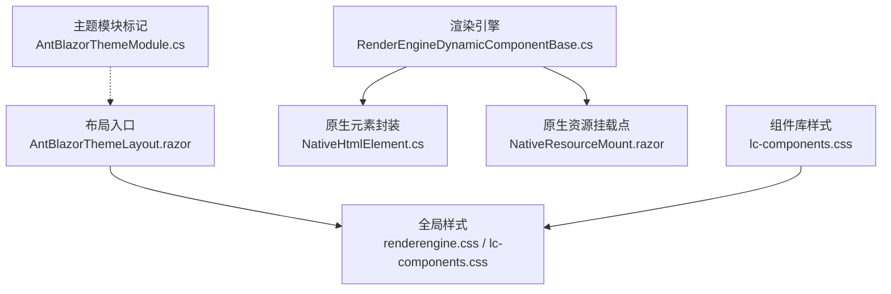
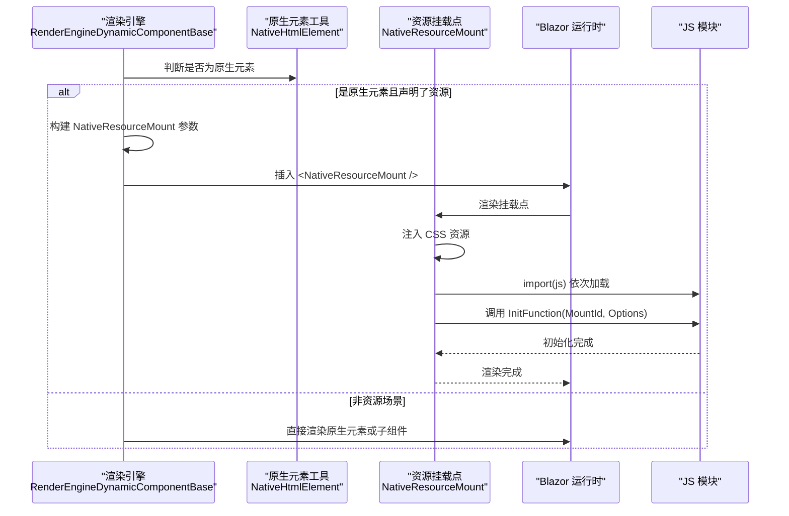
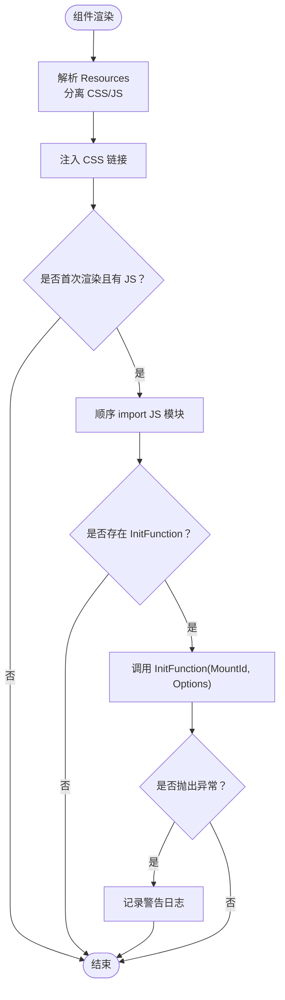
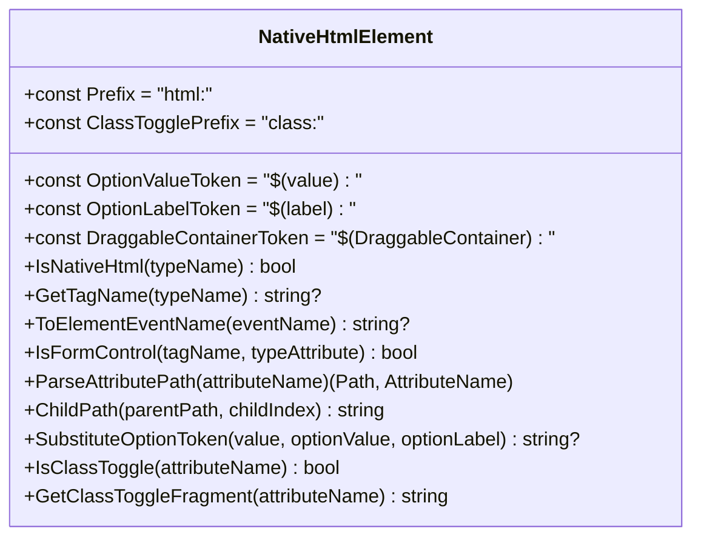
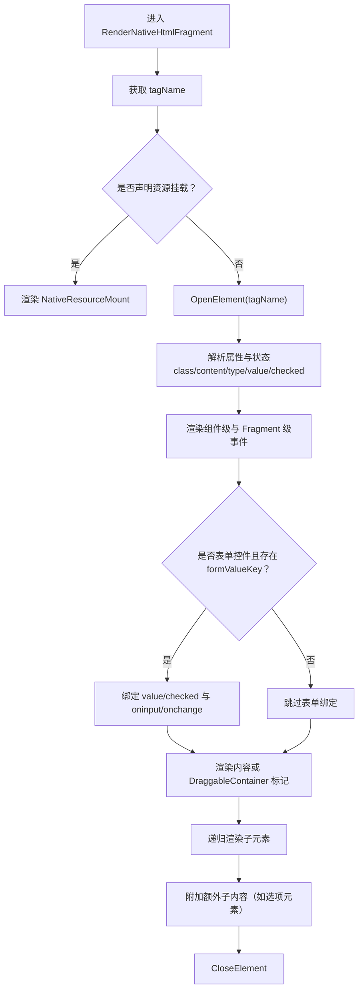
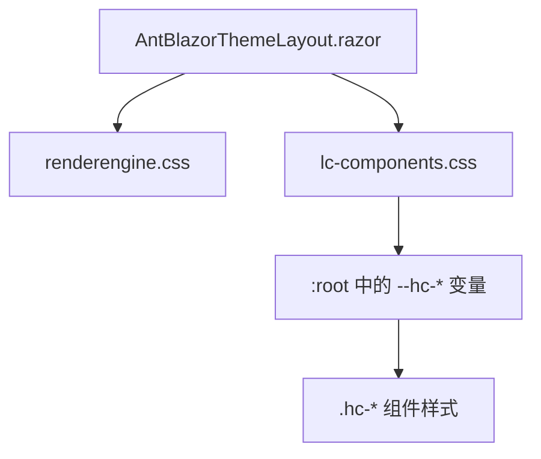
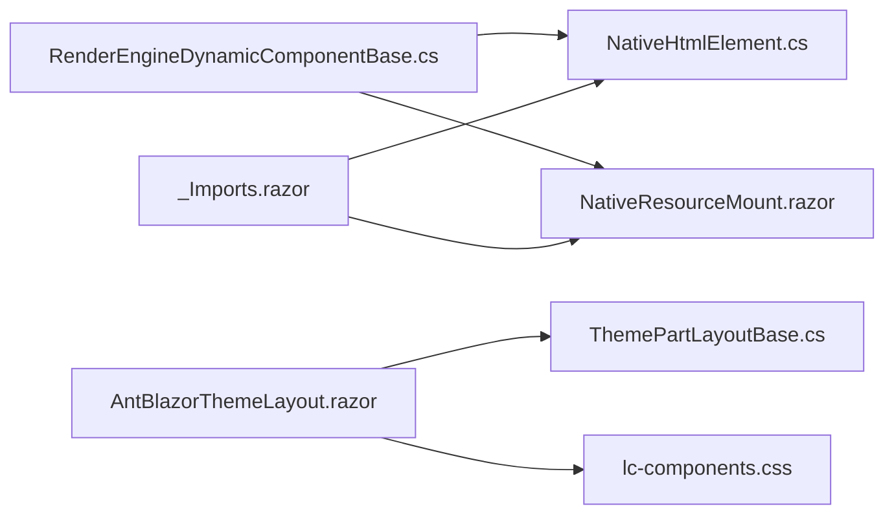

# 组件样式与主题

<cite>
**本文引用的文件**   
- [NativeResourceMount.razor](file://src/LowCode/Common/H.LowCode.ComponentBase/Components/NativeResourceMount.razor)
- [NativeHtmlElement.cs](file://src/LowCode/Common/H.LowCode.ComponentBase/NativeHtmlElement.cs)
- [RenderEngineDynamicComponentBase.cs](file://src/LowCode/RenderEngine/H.LowCode.RenderEngineBase/RenderEngineDynamicComponentBase.cs)
- [lc-components.css](file://src/LowCode/Common/H.LowCode.Components/wwwroot/lc-components.css)
- [AntBlazorThemeLayout.razor](file://src/LowCode/RenderEngine/H.LowCode.RenderEngine/Layout/AntBlazorThemeLayout.razor)
- [AntBlazorThemeModule.cs](file://src/LowCode/RenderEngine/H.LowCode.RenderEngine/AntBlazorThemeModule.cs)
- [ThemePartLayoutBase.cs](file://src/LowCode/RenderEngine/H.LowCode.RenderEngineBase/Layout/ThemePartLayoutBase.cs)
- [_Imports.razor](file://src/LowCode/Common/H.LowCode.Components/_Imports.razor)
</cite>

## 目录
1. [引言](#引言)
2. [项目结构](#项目结构)
3. [核心组件](#核心组件)
4. [架构总览](#架构总览)
5. [详细组件分析](#详细组件分析)
6. [依赖关系分析](#依赖关系分析)
7. [性能与可维护性建议](#性能与可维护性建议)
8. [故障排查指南](#故障排查指南)
9. [结论](#结论)

## 引言
本文面向 H.AppLab 低代码平台的样式与主题体系，聚焦以下目标：
- 讲解原生资源注入机制与 NativeResourceMount 组件的工作原理、参数约定与使用方式。
- 说明 NativeHtmlElement 在原生 HTML 元素封装中的作用，以及属性解析、事件映射、表单绑定和选项模板渲染等关键行为。
- 梳理主题系统现状：CSS 变量设计、样式资源加载入口、响应式与可定制扩展点。
- 给出样式模块化、命名规范与性能优化最佳实践，帮助开发者在不破坏渲染引擎的前提下进行主题定制。

## 项目结构
H.AppLab 的样式与主题能力由“渲染引擎 + 公共组件库 + 布局入口”三部分协同完成：
- 渲染引擎负责将物料元数据（Fragment）动态渲染为 Blazor 组件或原生 HTML 元素，并在必要时挂载外部 JS/CSS。
- 公共组件库提供一套基于 CSS 变量的基础样式与 UI 组件类名。
- 布局入口在应用启动时引入全局样式，构成主题可见的根上下文。

图示来源
- [AntBlazorThemeLayout.razor:1-87](file://src/LowCode/RenderEngine/H.LowCode.RenderEngine/Layout/AntBlazorThemeLayout.razor#L1-L87)
- [RenderEngineDynamicComponentBase.cs:180-260](file://src/LowCode/RenderEngine/H.LowCode.RenderEngineBase/RenderEngineDynamicComponentBase.cs#L180-L260)
- [NativeHtmlElement.cs:1-121](file://src/LowCode/Common/H.LowCode.ComponentBase/NativeHtmlElement.cs#L1-L121)
- [NativeResourceMount.razor:1-98](file://src/LowCode/Common/H.LowCode.ComponentBase/Components/NativeResourceMount.razor#L1-L98)
- [lc-components.css:1-322](file://src/LowCode/Common/H.LowCode.Components/wwwroot/lc-components.css#L1-L322)

章节来源
- [AntBlazorThemeLayout.razor:1-87](file://src/LowCode/RenderEngine/H.LowCode.RenderEngine/Layout/AntBlazorThemeLayout.razor#L1-L87)
- [lc-components.css:1-322](file://src/LowCode/Common/H.LowCode.Components/wwwroot/lc-components.css#L1-L322)
- [RenderEngineDynamicComponentBase.cs:180-260](file://src/LowCode/RenderEngine/H.LowCode.RenderEngineBase/RenderEngineDynamicComponentBase.cs#L180-L260)
- [NativeHtmlElement.cs:1-121](file://src/LowCode/Common/H.LowCode.ComponentBase/NativeHtmlElement.cs#L1-L121)
- [NativeResourceMount.razor:1-98](file://src/LowCode/Common/H.LowCode.ComponentBase/Components/NativeResourceMount.razor#L1-L98)

## 核心组件
- NativeResourceMount：原生资源挂载点，按声明的资源清单顺序注入 CSS/JS，并调用 JS 模块导出的初始化函数完成第三方库挂载。
- NativeHtmlElement：原生 HTML 元素物料支持工具类，定义标签前缀、属性解析、事件映射、表单控件识别与选项占位符替换等规则。
- RenderEngineDynamicComponentBase：渲染引擎动态组件基类，负责 Fragment 到组件/原生元素的转换、属性与事件处理、值双向绑定，以及在需要时插入 NativeResourceMount。
- AntBlazorThemeLayout：渲染引擎主题布局，负责引入全局样式与菜单、应用信息等页面外壳。
- lc-components.css：组件库样式，集中定义 CSS 变量与通用 UI 样式。

章节来源
- [NativeResourceMount.razor:1-98](file://src/LowCode/Common/H.LowCode.ComponentBase/Components/NativeResourceMount.razor#L1-L98)
- [NativeHtmlElement.cs:1-121](file://src/LowCode/Common/H.LowCode.ComponentBase/NativeHtmlElement.cs#L1-L121)
- [RenderEngineDynamicComponentBase.cs:180-260](file://src/LowCode/RenderEngine/H.LowCode.RenderEngineBase/RenderEngineDynamicComponentBase.cs#L180-L260)
- [AntBlazorThemeLayout.razor:1-87](file://src/LowCode/RenderEngine/H.LowCode.RenderEngine/Layout/AntBlazorThemeLayout.razor#L1-L87)
- [lc-components.css:1-322](file://src/LowCode/Common/H.LowCode.Components/wwwroot/lc-components.css#L1-L322)

## 架构总览
下图展示一次包含原生资源的 Fragment 从渲染到资源初始化的完整流程。

图示来源
- [RenderEngineDynamicComponentBase.cs:430-595](file://src/LowCode/RenderEngine/H.LowCode.RenderEngineBase/RenderEngineDynamicComponentBase.cs#L430-L595)
- [NativeResourceMount.razor:1-98](file://src/LowCode/Common/H.LowCode.ComponentBase/Components/NativeResourceMount.razor#L1-L98)

章节来源
- [RenderEngineDynamicComponentBase.cs:430-595](file://src/LowCode/RenderEngine/H.LowCode.RenderEngineBase/RenderEngineDynamicComponentBase.cs#L430-L595)
- [NativeResourceMount.razor:1-98](file://src/LowCode/Common/H.LowCode.ComponentBase/Components/NativeResourceMount.razor#L1-L98)

## 详细组件分析

### NativeResourceMount：原生资源挂载点
NativeResourceMount 是一个 Blazor 组件，作为“纯物料编辑器”等场景下加载外部 JS/CSS 的统一挂载点。其核心职责包括：
- 根据 Resources 清单过滤出 CSS 与 JS 资源并按序注入。
- 通过 IJSRuntime.import 顺序导入 JS 模块。
- 调用最后一个模块导出的 InitFunction，传入 MountId 与 Options，用于第三方库挂载。
- 捕获异常并通过日志记录，避免资源加载失败阻断页面渲染。
- 实现 IAsyncDisposable，释放已导入的 JS 对象引用，防止内存泄漏。

关键参数与行为
- MountId：挂载点元素 id，唯一标识，传递给 JS 初始化函数。
- Class/Style：挂载容器样式，允许覆盖默认样式。
- Resources：静态资源清单，按 Type=css/js 分类并保留声明顺序。
- InitFunction：JS 模块导出的初始化函数名。
- Options：传给初始化函数的组件选项，序列化后以 JS 对象形式传递。
- ChildContent：可选的子内容，供挂载点包裹内部结构。

生命周期要点
- OnParametersSet：解析 Resources，分离 CSS/JS 列表。
- OnAfterRenderAsync（首次渲染）：依次 import JS 模块；若存在 InitFunction，则调用初始化。
- DisposeAsync：释放 JS 模块引用。

图示来源
- [NativeResourceMount.razor:1-98](file://src/LowCode/Common/H.LowCode.ComponentBase/Components/NativeResourceMount.razor#L1-L98)

使用方式
- 在物料 Fragment 中声明 Resources 与 InitFunction，渲染引擎会自动将其包装为 NativeResourceMount。
- 在 JS 侧导出 InitFunction，接收 MountId 与 Options，完成 DOM 选择与第三方库初始化。

章节来源
- [NativeResourceMount.razor:1-98](file://src/LowCode/Common/H.LowCode.ComponentBase/Components/NativeResourceMount.razor#L1-L98)
- [RenderEngineDynamicComponentBase.cs:536-595](file://src/LowCode/RenderEngine/H.LowCode.RenderEngineBase/RenderEngineDynamicComponentBase.cs#L536-L595)

### NativeHtmlElement：原生 HTML 元素封装
NativeHtmlElement 定义了原生 HTML 元素物料的规则与辅助方法，使渲染引擎能够以统一方式处理“html:{tag}”形式的 Fragment。

主要职责
- 类型识别：IsNativeHtml、GetTagName 判断并提取标签名。
- 事件映射：ToElementEventName 将组件事件名转换为小写原生事件名。
- 表单控件识别：IsFormControl 识别 textarea/select/input 的可绑定类型。
- 属性路径解析：ParseAttributePath 与 ChildPath 支持 childs.{i}... 路径定位嵌套元素属性。
- 选项模板替换：SubstituteOptionToken 支持 $(value)/$(label) 占位符替换。
- 条件样式开关：ClassTogglePrefix 与 IsClassToggle/GetClassToggleFragment 支持 class:片段 布尔开关。

典型用法
- 在物料 JSON 中使用 frag.t="html:button"、frag.t="html:input" 等声明原生标签。
- 通过 attrn 指定普通属性或 childs.* 路径属性，控制文本、class、content、事件等。
- 在 radio/checkbox 选项中，使用 DataSourceFragment 为原生 HTML，渲染引擎会内联生成选项元素。

图示来源
- [NativeHtmlElement.cs:1-121](file://src/LowCode/Common/H.LowCode.ComponentBase/NativeHtmlElement.cs#L1-L121)

章节来源
- [NativeHtmlElement.cs:1-121](file://src/LowCode/Common/H.LowCode.ComponentBase/NativeHtmlElement.cs#L1-L121)
- [RenderEngineDynamicComponentBase.cs:180-260](file://src/LowCode/RenderEngine/H.LowCode.RenderEngineBase/RenderEngineDynamicComponentBase.cs#L180-L260)

### 渲染引擎对原生元素的处理流程
渲染引擎在遇到原生元素 Fragment 时，会执行以下逻辑：
- 判断是否为原生元素类型。
- 若是原生元素，优先检查是否声明了资源挂载（Resources 或 InitFunction），如存在则渲染 NativeResourceMount。
- 否则直接渲染原生元素，解析属性、事件、表单值绑定、内容文本与子元素。
- 对于选项数据源（如 radio/checkbox 的选项模板），当 DataSourceFragment 为原生 HTML 时，内联渲染各选项元素。

图示来源
- [RenderEngineDynamicComponentBase.cs:430-595](file://src/LowCode/RenderEngine/H.LowCode.RenderEngineBase/RenderEngineDynamicComponentBase.cs#L430-L595)
- [RenderEngineDynamicComponentBase.cs:630-765](file://src/LowCode/RenderEngine/H.LowCode.RenderEngineBase/RenderEngineDynamicComponentBase.cs#L630-L765)
- [RenderEngineDynamicComponentBase.cs:760-845](file://src/LowCode/RenderEngine/H.LowCode.RenderEngineBase/RenderEngineDynamicComponentBase.cs#L760-L845)

章节来源
- [RenderEngineDynamicComponentBase.cs:180-260](file://src/LowCode/RenderEngine/H.LowCode.RenderEngineBase/RenderEngineDynamicComponentBase.cs#L180-L260)
- [RenderEngineDynamicComponentBase.cs:430-595](file://src/LowCode/RenderEngine/H.LowCode.RenderEngineBase/RenderEngineDynamicComponentBase.cs#L430-L595)
- [RenderEngineDynamicComponentBase.cs:630-765](file://src/LowCode/RenderEngine/H.LowCode.RenderEngineBase/RenderEngineDynamicComponentBase.cs#L630-L765)
- [RenderEngineDynamicComponentBase.cs:760-845](file://src/LowCode/RenderEngine/H.LowCode.RenderEngineBase/RenderEngineDynamicComponentBase.cs#L760-L845)

### 主题系统与样式加载
主题系统当前以“CSS 变量 + 全局样式注入”的方式实现：
- 布局入口 AntBlazorThemeLayout 引入 renderengine.css 与 lc-components.css，作为全局样式根。
- lc-components.css 在 :root 中定义 hc-* 主题变量，如主色、边框、文本、背景、危险/成功色等。
- 组件样式通过 .hc-* 类名消费这些变量，便于整体换肤与局部覆盖。
- AntBlazorThemeModule 作为主题模块标记类，可用于后续扩展更多主题。

图示来源
- [AntBlazorThemeLayout.razor:1-87](file://src/LowCode/RenderEngine/H.LowCode.RenderEngine/Layout/AntBlazorThemeLayout.razor#L1-L87)
- [lc-components.css:1-322](file://src/LowCode/Common/H.LowCode.Components/wwwroot/lc-components.css#L1-L322)

章节来源
- [AntBlazorThemeLayout.razor:1-87](file://src/LowCode/RenderEngine/H.LowCode.RenderEngine/Layout/AntBlazorThemeLayout.razor#L1-L87)
- [lc-components.css:1-322](file://src/LowCode/Common/H.LowCode.Components/wwwroot/lc-components.css#L1-L322)
- [AntBlazorThemeModule.cs:1-8](file://src/LowCode/RenderEngine/H.LowCode.RenderEngine/AntBlazorThemeModule.cs#L1-L8)

### 响应式设计与可扩展性
- 响应式：组件库样式主要采用 Flexbox 布局与相对单位，未出现硬编码媒体查询，适合在不同屏幕尺寸下自适应。
- 可扩展：
  - 通过覆盖 :root 中的 --hc-* 变量可实现全局主题切换。
  - 可通过在布局层引入自定义 CSS 文件，覆盖 .hc-* 类名实现局部主题。
  - AntBlazorThemeModule 可作为扩展点，未来支持多主题注册与切换逻辑。

章节来源
- [lc-components.css:1-322](file://src/LowCode/Common/H.LowCode.Components/wwwroot/lc-components.css#L1-L322)
- [AntBlazorThemeLayout.razor:1-87](file://src/LowCode/RenderEngine/H.LowCode.RenderEngine/Layout/AntBlazorThemeLayout.razor#L1-L87)
- [AntBlazorThemeModule.cs:1-8](file://src/LowCode/RenderEngine/H.LowCode.RenderEngine/AntBlazorThemeModule.cs#L1-L8)

## 依赖关系分析
- NativeResourceMount 依赖 Blazor 运行时与 IJSRuntime，用于动态注入 CSS/JS 并调用 JS 模块。
- RenderEngineDynamicComponentBase 依赖 NativeHtmlElement 判定与解析原生元素，依赖 NativeResourceMount 完成资源挂载。
- AntBlazorThemeLayout 依赖 ThemePartLayoutBase 提供的菜单与导航能力，同时引入全局样式。
- _Imports.razor 为组件库提供常用命名空间与类型导入，确保组件能访问 H.LowCode.ComponentBase、H.LowCode.MetaSchema 等类型。

图示来源
- [RenderEngineDynamicComponentBase.cs:180-260](file://src/LowCode/RenderEngine/H.LowCode.RenderEngineBase/RenderEngineDynamicComponentBase.cs#L180-L260)
- [NativeHtmlElement.cs:1-121](file://src/LowCode/Common/H.LowCode.ComponentBase/NativeHtmlElement.cs#L1-L121)
- [NativeResourceMount.razor:1-98](file://src/LowCode/Common/H.LowCode.ComponentBase/Components/NativeResourceMount.razor#L1-L98)
- [AntBlazorThemeLayout.razor:1-87](file://src/LowCode/RenderEngine/H.LowCode.RenderEngine/Layout/AntBlazorThemeLayout.razor#L1-L87)
- [ThemePartLayoutBase.cs:1-44](file://src/LowCode/RenderEngine/H.LowCode.RenderEngineBase/Layout/ThemePartLayoutBase.cs#L1-L44)
- [_Imports.razor:1-10](file://src/LowCode/Common/H.LowCode.Components/_Imports.razor#L1-L10)

章节来源
- [RenderEngineDynamicComponentBase.cs:180-260](file://src/LowCode/RenderEngine/H.LowCode.RenderEngineBase/RenderEngineDynamicComponentBase.cs#L180-L260)
- [NativeHtmlElement.cs:1-121](file://src/LowCode/Common/H.LowCode.ComponentBase/NativeHtmlElement.cs#L1-L121)
- [NativeResourceMount.razor:1-98](file://src/LowCode/Common/H.LowCode.ComponentBase/Components/NativeResourceMount.razor#L1-L98)
- [AntBlazorThemeLayout.razor:1-87](file://src/LowCode/RenderEngine/H.LowCode.RenderEngine/Layout/AntBlazorThemeLayout.razor#L1-L87)
- [ThemePartLayoutBase.cs:1-44](file://src/LowCode/RenderEngine/H.LowCode.RenderEngineBase/Layout/ThemePartLayoutBase.cs#L1-L44)
- [_Imports.razor:1-10](file://src/LowCode/Common/H.LowCode.Components/_Imports.razor#L1-L10)

## 性能与可维护性建议
- 资源加载优化
  - 仅在首次渲染时加载 JS 模块，避免重复 import。
  - 合理拆分 JS 模块，减少单次加载体积；按需延迟初始化。
  - 在组件销毁时释放 JS 对象引用，避免内存泄漏。
- 样式组织
  - 遵循 .hc-* 命名空间，避免污染全局样式。
  - 尽量使用 CSS 变量覆盖主题，而非直接修改组件样式。
  - 对复杂组件样式使用独立文件管理，保持与组件逻辑同目录或集中管理。
- 原生元素属性
  - 使用 childs.* 路径属性精准定位嵌套元素，避免无谓重绘。
  - 合理使用 class:片段 开关，减少条件渲染分支。
  - 表单控件使用统一的 formValueKey，确保双向绑定一致性与联动性能。

[本节为通用指导，不直接分析具体文件]

## 故障排查指南
- 资源初始化失败
  - 现象：页面渲染正常但第三方库未生效。
  - 排查：检查 InitFunction 是否正确导出；确认 JS 模块路径可访问；查看日志中“资源挂载点初始化失败”警告。
  - 处理：修正 JS 模块导出名或路径；确保 Options 序列化正确。
- 原生元素事件未触发
  - 现象：在原生元素上绑定的事件无效。
  - 排查：确认事件名是否被转换为小写；确认事件目标是根元素还是 Fragment 级别。
  - 处理：调整事件绑定位置或使用 Data 类动作。
- 表单值未更新
  - 现象：输入框或复选框值不随用户操作变化。
  - 排查：确认是否为受支持的表单控件类型；检查 formValueKey 是否设置；核对 input[type] 与 value/checked 绑定逻辑。
  - 处理：补充支持的 input[type]；确保 FormState 中存在对应键。
- 样式未生效
  - 现象：自定义主题或组件样式不生效。
  - 排查：确认 lc-components.css 已被布局引入；检查变量覆盖优先级；确认类名未冲突。
  - 处理：在布局层引入自定义 CSS，提高覆盖优先级；谨慎使用 !important。

章节来源
- [NativeResourceMount.razor:1-98](file://src/LowCode/Common/H.LowCode.ComponentBase/Components/NativeResourceMount.razor#L1-L98)
- [RenderEngineDynamicComponentBase.cs:760-845](file://src/LowCode/RenderEngine/H.LowCode.RenderEngineBase/RenderEngineDynamicComponentBase.cs#L760-L845)
- [AntBlazorThemeLayout.razor:1-87](file://src/LowCode/RenderEngine/H.LowCode.RenderEngine/Layout/AntBlazorThemeLayout.razor#L1-L87)

## 结论
H.AppLab 的样式与主题体系以“CSS 变量 + 全局样式注入 + 原生资源挂载”为核心，既保证了渲染引擎的灵活性，又提供了良好的主题扩展点。NativeResourceMount 解决了纯物料的外部资源加载问题，NativeHtmlElement 让原生 HTML 元素具备与组件一致的属性、事件与表单绑定体验。通过覆盖主题变量与类名，开发者可以在不侵入渲染引擎的情况下实现品牌化与个性化。建议在项目中遵循现有命名与结构规范，优先使用 CSS 变量进行主题定制，并对原生资源加载进行严格的质量与性能把控。