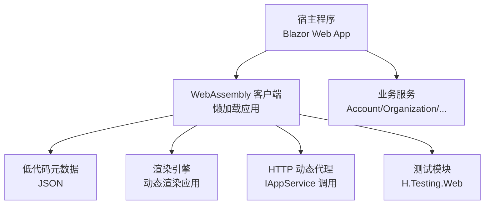
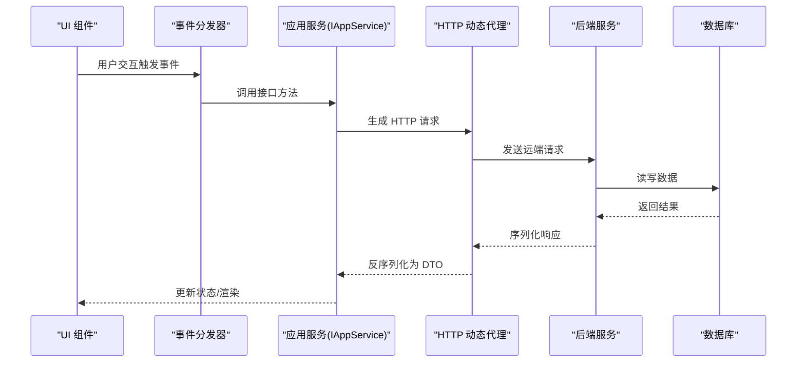
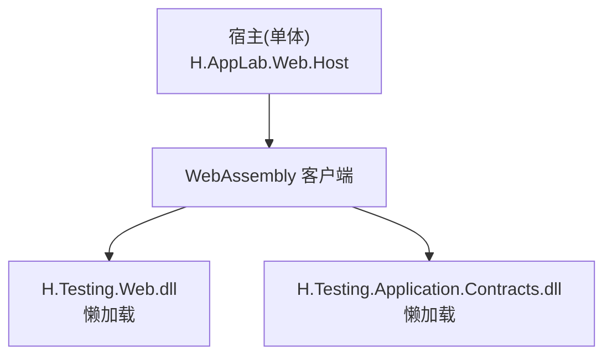
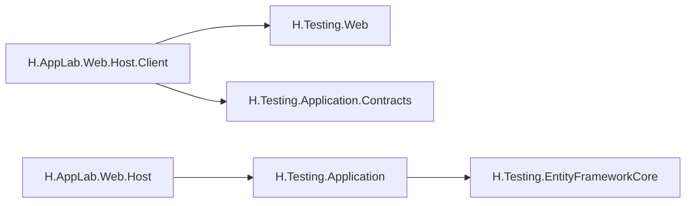

# 组件测试与调试

<cite>
**本文引用的文件**   
- [README.md](file://README.md)
- [H.AppLab.Web.Host.Client.csproj](file://src/Host/H.AppLab.Web.Host/H.AppLab.Web.Host.Client/H.AppLab.Web.Host.Client.csproj)
- [H.AppLab.Web.Host.csproj](file://src/Host/H.AppLab.Web.Host/H.AppLab.Web.Host/H.AppLab.Web.Host.csproj)
- [H.Testing.Web.csproj](file://src/Services/Testing/H.Testing.Web/H.Testing.Web.csproj)
- [H.Testing.Application.csproj](file://src/Services/Testing/H.Testing.Application/H.Testing.Application.csproj)
- [H.Testing.EntityFrameworkCore.csproj](file://src/Services/Testing/H.Testing.EntityFrameworkCore/H.Testing.EntityFrameworkCore.csproj)
</cite>

## 目录
1. [引言](#引言)
2. [项目结构](#项目结构)
3. [核心组件](#核心组件)
4. [架构总览](#架构总览)
5. [详细组件分析](#详细组件分析)
6. [依赖关系分析](#依赖关系分析)
7. [性能考虑](#性能考虑)
8. [故障排查指南](#故障排查指南)
9. [结论](#结论)

## 引言
本文件面向 H.AppLab 低代码平台的开发者，聚焦“组件测试与调试”这一主题。文档基于仓库现有结构与 README 中的技术说明，系统讲解如何为平台中的 Blazor 组件编写单元测试、集成测试与端到端测试，并给出调试技巧、常见问题排查思路与优化建议。内容从概念到实践逐层展开，帮助读者在保持组件稳定性的同时提升开发与迭代效率。

## 项目结构
H.AppLab 采用模块化架构，前端以 Blazor Web App（Server + WebAssembly）方式运行，宿主程序负责服务注册，业务以 Services 分层组织，LowCode 提供设计引擎与渲染引擎能力，Utils 提供通用工具与 HTTP 代理机制。

**图表来源**
- [README.md:1-73](file://README.md#L1-L73)

**章节来源**
- [README.md:1-73](file://README.md#L1-L73)

## 核心组件
围绕“组件测试与调试”，需要重点理解以下能力：
- Blazor 组件基类与默认组件库：位于 LowCode.Common 的 ComponentBase 与 Components，是单元测试与交互模拟的主要对象。
- HTTP 动态代理：通过 H.Abp.HttpClientProxy 将 IAppService 接口转为 HTTP 请求，便于在服务端与 WebAssembly 两端使用统一接口进行 Mock 与断言。
- WebAssembly 懒加载：按需加载程序集，便于隔离测试范围，减少首屏负载，提高测试稳定性。
- 测试模块：H.Testing.Web 作为独立应用模块，可被宿主懒加载，用于承载测试用例或演示场景。

这些能力共同构成“可测性”的基础：通过解耦外部依赖、统一接口契约、控制加载范围，使测试更容易构建、更稳定执行、更易于定位问题。

**章节来源**
- [README.md:1-73](file://README.md#L1-L73)

## 架构总览
下图展示测试相关的整体流程：从 UI 组件出发，经过事件分发、服务调用、远程代理、后端服务，再到数据库与外部资源；测试侧通过 Mock 与模拟环境覆盖关键路径。

该流程体现了组件与服务的解耦点，也是测试中需要重点 Mock 的位置：
- 对 Service 的实现进行替换，以验证 UI 行为。
- 对 Proxy 进行拦截，以验证 HTTP 调用与参数序列化。
- 对后端与数据库进行隔离，以加速测试并避免副作用。

[本节为概念性说明，不直接分析具体文件]

## 详细组件分析

### 组件单元测试策略
目标：在不启动完整后端的情况下，验证组件的输入输出、事件处理与渲染结果。

推荐步骤：
1. 构造组件实例：通过依赖注入或手动构造，传入测试所需的参数与上下文。
2. Mock 依赖：
   - 用内存实现替代 IAppService，或封装一个轻量代理拦截请求。
   - 若组件内部有日志或通知服务，可用记录器收集日志与消息以便断言。
3. 模拟用户交互：
   - 触发按钮点击、表单提交、下拉选择等事件。
   - 检查事件回调是否按预期调用 Mock 服务。
4. 断言渲染结果：
   - 断言 DOM 节点是否存在、文本是否正确、样式类是否符合预期。
   - 断言状态变更是否触发了子组件重新渲染。
5. 边界与异常：
   - 模拟空值、超长输入、网络错误、权限不足等场景。
   - 断言错误提示、重试逻辑与降级显示。

注意事项：
- 优先测试纯函数式逻辑（如计算、格式化），再测试与 UI 耦合的部分。
- 对外部时间、随机数、ID 生成器等不稳定因素进行注入与固定。
- 使用异步等待与同步刷新机制确保渲染完成后再断言。

[本节为方法论指导，不直接分析具体文件]

### 集成测试构建方式
目标：验证组件与服务契约之间的正确性，包括参数序列化、路由约定、错误码与分页等。

推荐步骤：
1. 搭建测试环境：
   - 使用 InMemory 数据库或轻量内存存储，避免真实数据库依赖。
   - 配置 H.Abp.HttpClientProxy，使其指向测试服务容器。
2. 服务模拟：
   - 提供 IAppService 的内存实现，支持基本 CRUD、分页与校验。
   - 对第三方服务（邮件、短信、文件上传）使用 Mock 或内存实现。
3. 端到端测试：
   - 在 TestServer 或浏览器自动化环境中启动宿主，导航至测试页面。
   - 执行用户操作，观察页面变化与服务日志。
   - 断言最终状态与持久化结果。

关键点：
- 使用统一的契约定义（Application.Contracts）确保前后端一致。
- 利用 LazyModuleRegistry 与 CompositeServiceProvider 在懒加载场景下注入测试服务。
- 通过配置 RemoteServices 切换不同后端地址，支持多环境测试。

**章节来源**
- [README.md:1-73](file://README.md#L1-L73)

### 端到端测试与调试
目标：在接近生产环境的条件下，验证关键业务流程的完整性。

推荐步骤：
1. 启动宿主与依赖服务：
   - 通过 Docker Compose 启动 Redis、RabbitMQ 等中间件。
   - 使用 DbMigrator 初始化数据库结构。
2. 运行端到端用例：
   - 使用浏览器自动化工具驱动页面，执行登录、创建、编辑、删除等操作。
   - 捕获控制台日志、网络请求与性能指标。
3. 断言与报告：
   - 断言页面元素、弹窗提示、表格数据与 API 响应。
   - 生成测试报告，包含失败截图与关键日志。

调试技巧：
- 在 Debug 模式启用 .pdb 以获得更精确的堆栈信息。
- 开启浏览器开发者工具的 Network、Console、Performance 面板，定位慢请求与阻塞脚本。
- 结合服务端日志，关联前端请求与后端处理链路。

**章节来源**
- [README.md:1-73](file://README.md#L1-L73)

### 测试模块与宿主集成
H.Testing.Web 作为独立应用模块，可通过宿主的懒加载机制在运行时按需加载，便于在开发主机上快速访问测试页面。

**图表来源**
- [H.AppLab.Web.Host.Client.csproj:20-85](file://src/Host/H.AppLab.Web.Host/H.AppLab.Web.Host.Client/H.AppLab.Web.Host.Client.csproj#L20-L85)

要点：
- 在客户端 csproj 中将 H.Testing.Web 与相关 Contracts 声明为懒加载程序集，避免影响主应用体积。
- 在宿主项目中引用 H.Testing.Application，以便在 Server 端运行测试服务。
- 通过路由与导航触发懒加载，按需加载测试模块。

**章节来源**
- [H.AppLab.Web.Host.Client.csproj:20-85](file://src/Host/H.AppLab.Web.Host/H.AppLab.Web.Host.Client/H.AppLab.Web.Host.Client.csproj#L20-L85)
- [H.AppLab.Web.Host.csproj:37-38](file://src/Host/H.AppLab.Web.Host/H.AppLab.Web.Host/H.AppLab.Web.Host.csproj#L37-L38)
- [H.Testing.Web.csproj:10](file://src/Services/Testing/H.Testing.Web/H.Testing.Web.csproj#L10)
- [H.Testing.Application.csproj:6-7](file://src/Services/Testing/H.Testing.Application/H.Testing.Application.csproj#L6-L7)
- [H.Testing.EntityFrameworkCore.csproj:4,13](file://src/Services/Testing/H.Testing.EntityFrameworkCore/H.Testing.EntityFrameworkCore.csproj#L4-L13)

### 组件基类与默认组件的可测性
LowCode.Common 下的 ComponentBase 与 Components 提供了组件的公共能力与默认实现。编写测试时，建议：
- 继承或组合基类提供的能力，避免重复实现通用逻辑。
- 将易变的外部依赖抽象为接口，便于在测试中替换。
- 针对默认组件的样式与行为编写快照测试或断言，防止回归。

[本节为方法论指导，不直接分析具体文件]

## 依赖关系分析
测试相关的项目依赖主要分布在 Host、Services/Testing 与 Utils 三个区域：

**图表来源**
- [H.AppLab.Web.Host.Client.csproj:128-129](file://src/Host/H.AppLab.Web.Host/H.AppLab.Web.Host.Client/H.AppLab.Web.Host.Client.csproj#L128-L129)
- [H.AppLab.Web.Host.csproj:37-38](file://src/Host/H.AppLab.Web.Host/H.AppLab.Web.Host/H.AppLab.Web.Host.csproj#L37-L38)
- [H.Testing.Web.csproj:10](file://src/Services/Testing/H.Testing.Web/H.Testing.Web.csproj#L10)
- [H.Testing.Application.csproj:6-7](file://src/Services/Testing/H.Testing.Application/H.Testing.Application.csproj#L6-L7)
- [H.Testing.EntityFrameworkCore.csproj:13](file://src/Services/Testing/H.Testing.EntityFrameworkCore/H.Testing.EntityFrameworkCore.csproj#L13)

依赖说明：
- 客户端懒加载 H.Testing.Web 与 H.Testing.Application.Contracts，降低主应用体积。
- 宿主引用 H.Testing.Application，以提供后端服务实现。
- H.Testing.Application 引用 EF Core 实现，便于在测试中使用内存数据库。

**章节来源**
- [H.AppLab.Web.Host.Client.csproj:128-129](file://src/Host/H.AppLab.Web.Host/H.AppLab.Web.Host.Client/H.AppLab.Web.Host.Client.csproj#L128-L129)
- [H.AppLab.Web.Host.csproj:37-38](file://src/Host/H.AppLab.Web.Host/H.AppLab.Web.Host/H.AppLab.Web.Host.csproj#L37-L38)
- [H.Testing.Web.csproj:10](file://src/Services/Testing/H.Testing.Web/H.Testing.Web.csproj#L10)
- [H.Testing.Application.csproj:6-7](file://src/Services/Testing/H.Testing.Application/H.Testing.Application.csproj#L6-L7)
- [H.Testing.EntityFrameworkCore.csproj:13](file://src/Services/Testing/H.Testing.EntityFrameworkCore/H.Testing.EntityFrameworkCore.csproj#L13)

## 性能考虑
- 懒加载测试模块：仅在需要时加载 H.Testing.Web 与相关 Contracts，避免增加主应用体积与启动时间。
- 内存数据库与内存服务：在单元测试与集成测试中尽量使用内存实现，缩短测试周期。
- AOT 与裁剪：Release 模式下启用 AOT 与 Trimming，有助于减小包体；测试时应关注裁剪导致的类型缺失问题。
- 日志与性能采集：在生产与预发环境开启性能采集，识别瓶颈；在测试环境仅保留必要日志以减少噪声。

[本节为一般性建议，不直接分析具体文件]

## 故障排查指南
常见问题与解决思路：
- 组件未渲染或状态不更新：
  - 检查事件回调是否被调用，Mock 服务是否返回预期数据。
  - 确认异步操作已完成，再进行断言。
- HTTP 调用失败：
  - 检查 RemoteServices 配置是否指向正确的后端地址。
  - 验证 AbpUrlConvention 生成的路由是否与后端一致。
- 懒加载失败：
  - 确认 H.Testing.Web 与 Contracts 已声明为 BlazorWebAssemblyLazyLoad。
  - 检查 OnNavigateAsync 是否正确触发程序集加载。
- 性能问题：
  - 使用浏览器 Performance 面板定位重渲染与长任务。
  - 检查是否有不必要的状态更新或频繁网络请求。
- 环境问题：
  - 确保依赖服务（Redis、RabbitMQ）已启动。
  - 使用 DbMigrator 初始化数据库结构，避免表缺失导致启动失败。

参考依据：
- 宿主与客户端懒加载配置见宿主客户端 csproj。
- 远程服务配置与 HTTP 代理机制见 README 的技术特性说明。

**章节来源**
- [H.AppLab.Web.Host.Client.csproj:20-85](file://src/Host/H.AppLab.Web.Host/H.AppLab.Web.Host.Client/H.AppLab.Web.Host.Client.csproj#L20-L85)
- [README.md:1-73](file://README.md#L1-L73)

## 结论
H.AppLab 的模块化架构与 Blazor Web App 模式为组件测试与调试提供了良好基础。通过 Mock 依赖、模拟用户交互、断言渲染结果以及构建集成与端到端测试，可以显著提升组件质量与迭代速度。配合懒加载、HTTP 动态代理与远程服务配置，测试可以在隔离、可控且接近生产的环境中进行。建议在团队内建立统一的测试规范与模板，持续完善测试覆盖率与调试经验沉淀。