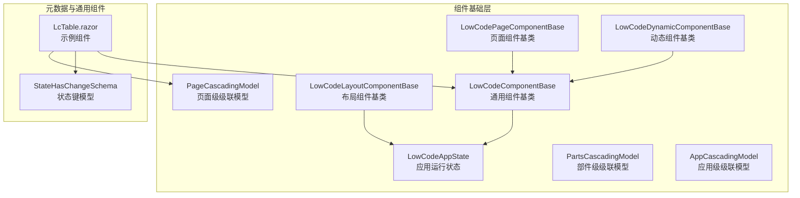
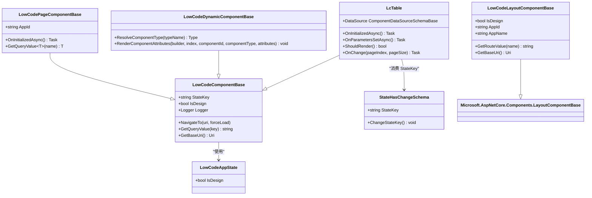
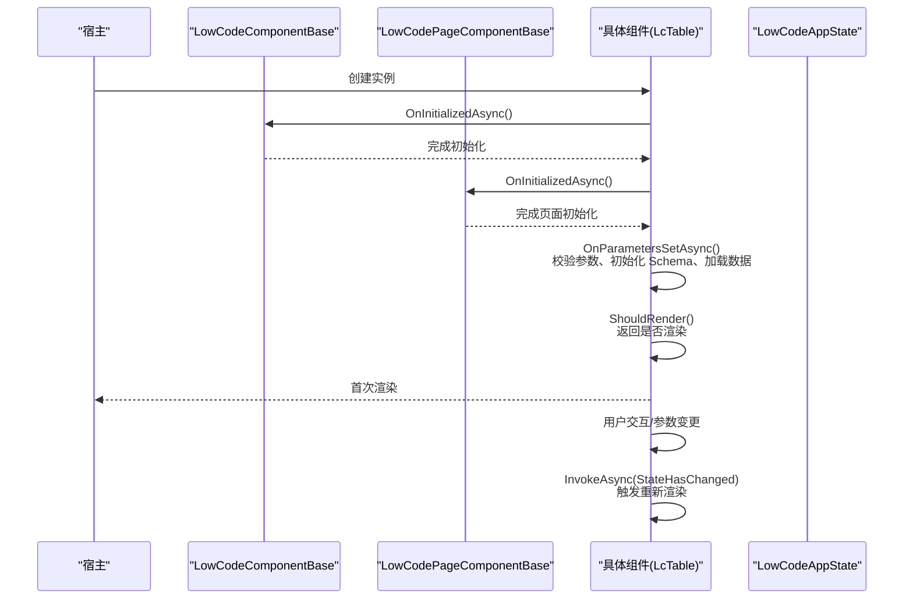
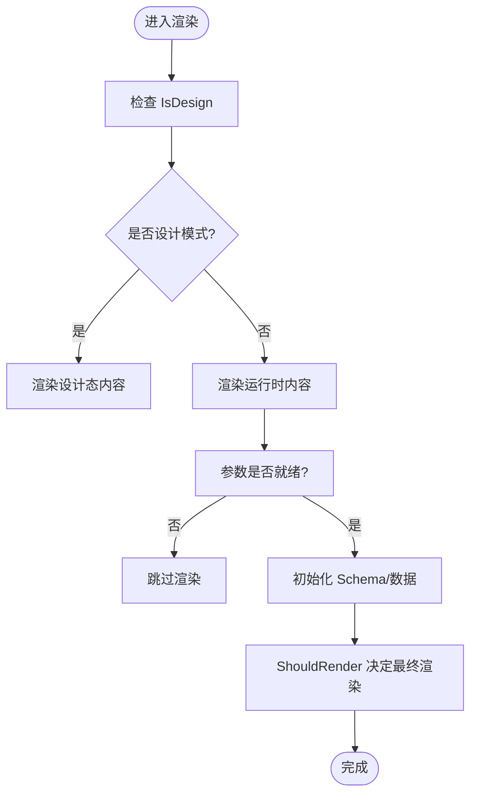
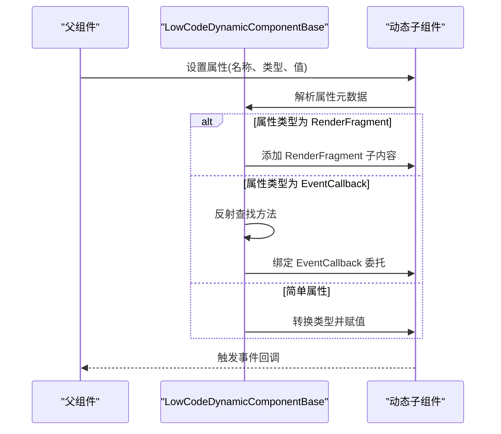
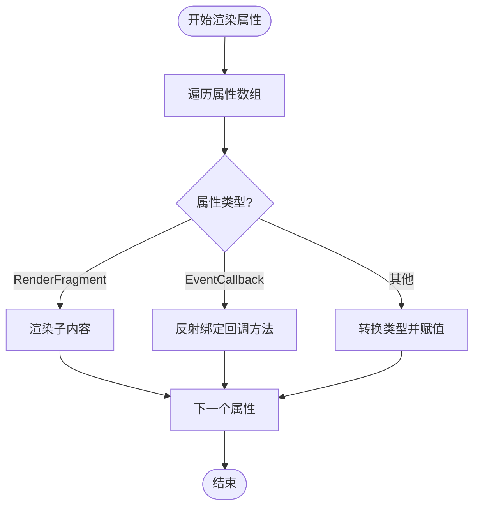
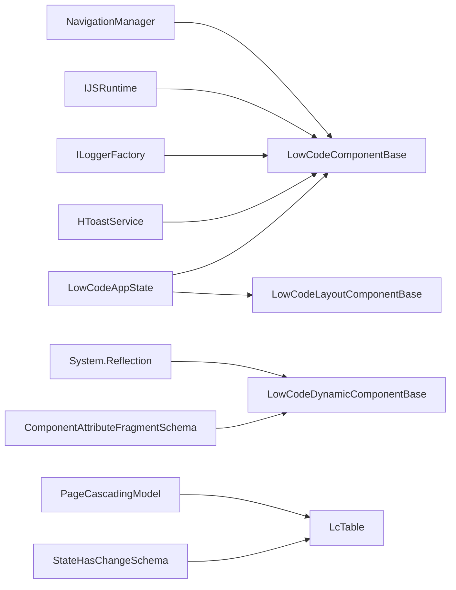

# 组件生命周期与事件

<cite>
**本文引用的文件**
- [LowCodeComponentBase.cs](file://src/LowCode/Common/H.LowCode.ComponentBase/LowCodeComponentBase.cs)
- [LowCodeLayoutComponentBase.cs](file://src/LowCode/Common/H.LowCode.ComponentBase/LowCodeLayoutComponentBase.cs)
- [LowCodePageComponentBase.cs](file://src/LowCode/Common/H.LowCode.ComponentBase/LowCodePageComponentBase.cs)
- [LowCodeDynamicComponentBase.cs](file://src/LowCode/Common/H.LowCode.ComponentBase/LowCodeDynamicComponentBase.cs)
- [LowCodeAppState.cs](file://src/LowCode/Common/H.LowCode.ComponentBase/LowCodeAppState.cs)
- [AppCascadingModel.cs](file://src/LowCode/Common/H.LowCode.ComponentBase/CascadingModels/AppCascadingModel.cs)
- [PageCascadingModel.cs](file://src/LowCode/Common/H.LowCode.ComponentBase/CascadingModels/PageCascadingModel.cs)
- [PartsCascadingModel.cs](file://src/LowCode/Common/H.LowCode.ComponentBase/CascadingModels/PartsCascadingModel.cs)
- [StateHasChangeSchema.cs](file://src/LowCode/Common/H.LowCode.MetaSchema/StateHasChangeSchema.cs)
- [LcTable.razor](file://src/LowCode/Common/H.LowCode.Components/Components/LcTable.razor)
</cite>

## 目录
1. [引言](#引言)
2. [项目结构与定位](#项目结构与定位)
3. [核心概念](#核心概念)
4. [架构总览](#架构总览)
5. [组件生命周期详解](#组件生命周期详解)
6. [组件状态管理机制](#组件状态管理机制)
7. [设计模式识别与渲染控制](#设计模式识别与渲染控制)
8. [组件间通信与事件机制](#组件间通信与事件机制)
9. [动态组件渲染流程](#动态组件渲染流程)
10. [依赖关系分析](#依赖关系分析)
11. [性能优化建议](#性能优化建议)
12. [故障排查指南](#故障排查指南)
13. [最佳实践清单](#最佳实践清单)
14. [结论](#结论)

## 引言
本文面向 H.AppLab 低代码平台的组件开发者，系统讲解组件生命周期、状态管理、设计模式识别、事件通信以及动态渲染机制。重点围绕以下目标展开：
- 明确初始化、参数设置、渲染、销毁等生命周期的执行时机与扩展点。
- 说明 StateKey、ShouldRender、IsDesign 等关键能力的使用方式。
- 解释事件触发、参数传递、异步处理在组件中的典型用法。
- 给出可复用的编程模式和性能优化策略，帮助开发稳定高效的低代码组件。

## 项目结构与定位
H.AppLab 的组件基类位于 LowCode.ComponentBase 模块中，提供通用的生命周期钩子、状态标识、导航、日志、提示和运行时环境判断；具体业务组件通过继承这些基类获得统一行为。MetaSchema 模块提供元数据模型，例如用于状态同步的 StateHasChangeSchema。通用 UI 组件如 LcTable 展示如何在实际组件中使用这些基础能力。

**图表来源**
- [LowCodeComponentBase.cs:1-61](file://src/LowCode/Common/H.LowCode.ComponentBase/LowCodeComponentBase.cs#L1-L61)
- [LowCodeLayoutComponentBase.cs:1-64](file://src/LowCode/Common/H.LowCode.ComponentBase/LowCodeLayoutComponentBase.cs#L1-L64)
- [LowCodePageComponentBase.cs:1-21](file://src/LowCode/Common/H.LowCode.ComponentBase/LowCodePageComponentBase.cs#L1-L21)
- [LowCodeDynamicComponentBase.cs:1-134](file://src/LowCode/Common/H.LowCode.ComponentBase/LowCodeDynamicComponentBase.cs#L1-L134)
- [LowCodeAppState.cs:1-14](file://src/LowCode/Common/H.LowCode.ComponentBase/LowCodeAppState.cs#L1-L14)
- [PageCascadingModel.cs:1-23](file://src/LowCode/Common/H.LowCode.ComponentBase/CascadingModels/PageCascadingModel.cs#L1-L23)
- [PartsCascadingModel.cs:1-10](file://src/LowCode/Common/H.LowCode.ComponentBase/CascadingModels/PartsCascadingModel.cs#L1-L10)
- [AppCascadingModel.cs:1-5](file://src/LowCode/Common/H.LowCode.ComponentBase/CascadingModels/AppCascadingModel.cs#L1-L5)
- [StateHasChangeSchema.cs:1-15](file://src/LowCode/Common/H.LowCode.MetaSchema/StateHasChangeSchema.cs#L1-L15)
- [LcTable.razor:1-200](file://src/LowCode/Common/H.LowCode.Components/Components/LcTable.razor#L1-L200)

**章节来源**
- [LowCodeComponentBase.cs:1-61](file://src/LowCode/Common/H.LowCode.ComponentBase/LowCodeComponentBase.cs#L1-L61)
- [LowCodeLayoutComponentBase.cs:1-64](file://src/LowCode/Common/H.LowCode.ComponentBase/LowCodeLayoutComponentBase.cs#L1-L64)
- [LowCodePageComponentBase.cs:1-21](file://src/LowCode/Common/H.LowCode.ComponentBase/LowCodePageComponentBase.cs#L1-L21)
- [LowCodeDynamicComponentBase.cs:1-134](file://src/LowCode/Common/H.LowCode.ComponentBase/LowCodeDynamicComponentBase.cs#L1-L134)
- [LowCodeAppState.cs:1-14](file://src/LowCode/Common/H.LowCode.ComponentBase/LowCodeAppState.cs#L1-L14)
- [StateHasChangeSchema.cs:1-15](file://src/LowCode/Common/H.LowCode.MetaSchema/StateHasChangeSchema.cs#L1-L15)
- [LcTable.razor:1-200](file://src/LowCode/Common/H.LowCode.Components/Components/LcTable.razor#L1-L200)

## 核心概念
- 组件基类：LowCodeComponentBase 提供注入的服务（导航、JS 互操作、日志、Toast）、状态键 StateKey、设计模式识别 IsDesign、路由查询值获取等通用能力。
- 布局基类：LowCodeLayoutComponentBase 为布局组件提供 AppId、AppName、路由值读取等能力，并同样支持 IsDesign。
- 页面基类：LowCodePageComponentBase 继承 LowCodeComponentBase，扩展 AppId 参数与页面初始化钩子。
- 动态组件基类：LowCodeDynamicComponentBase 负责按元数据解析组件类型、属性、事件回调，并安全地渲染到 RenderTreeBuilder。
- 应用状态：LowCodeAppState 暴露 IsDesign，区分设计器与运行时。
- 元数据状态：StateHasChangeSchema 维护 StateKey，便于外部触发 StateHasChanged 或细粒度更新。
- 级联模型：AppCascadingModel、PageCascadingModel、PartsCascadingModel 用于跨层级共享上下文信息。

**章节来源**
- [LowCodeComponentBase.cs:1-61](file://src/LowCode/Common/H.LowCode.ComponentBase/LowCodeComponentBase.cs#L1-L61)
- [LowCodeLayoutComponentBase.cs:1-64](file://src/LowCode/Common/H.LowCode.ComponentBase/LowCodeLayoutComponentBase.cs#L1-L64)
- [LowCodePageComponentBase.cs:1-21](file://src/LowCode/Common/H.LowCode.ComponentBase/LowCodePageComponentBase.cs#L1-L21)
- [LowCodeDynamicComponentBase.cs:1-134](file://src/LowCode/Common/H.LowCode.ComponentBase/LowCodeDynamicComponentBase.cs#L1-L134)
- [LowCodeAppState.cs:1-14](file://src/LowCode/Common/H.LowCode.ComponentBase/LowCodeAppState.cs#L1-L14)
- [StateHasChangeSchema.cs:1-15](file://src/LowCode/Common/H.LowCode.MetaSchema/StateHasChangeSchema.cs#L1-L15)
- [PageCascadingModel.cs:1-23](file://src/LowCode/Common/H.LowCode.ComponentBase/CascadingModels/PageCascadingModel.cs#L1-L23)
- [PartsCascadingModel.cs:1-10](file://src/LowCode/Common/H.LowCode.ComponentBase/CascadingModels/PartsCascadingModel.cs#L1-L10)
- [AppCascadingModel.cs:1-5](file://src/LowCode/Common/H.LowCode.ComponentBase/CascadingModels/AppCascadingModel.cs#L1-L5)

## 架构总览
下图展示了组件基类、状态模型与示例组件之间的依赖关系，以及它们如何支撑生命周期与事件机制。

**图表来源**
- [LowCodeComponentBase.cs:1-61](file://src/LowCode/Common/H.LowCode.ComponentBase/LowCodeComponentBase.cs#L1-L61)
- [LowCodeLayoutComponentBase.cs:1-64](file://src/LowCode/Common/H.LowCode.ComponentBase/LowCodeLayoutComponentBase.cs#L1-L64)
- [LowCodePageComponentBase.cs:1-21](file://src/LowCode/Common/H.LowCode.ComponentBase/LowCodePageComponentBase.cs#L1-L21)
- [LowCodeDynamicComponentBase.cs:1-134](file://src/LowCode/Common/H.LowCode.ComponentBase/LowCodeDynamicComponentBase.cs#L1-L134)
- [LowCodeAppState.cs:1-14](file://src/LowCode/Common/H.LowCode.ComponentBase/LowCodeAppState.cs#L1-L14)
- [StateHasChangeSchema.cs:1-15](file://src/LowCode/Common/H.LowCode.MetaSchema/StateHasChangeSchema.cs#L1-L15)
- [LcTable.razor:1-200](file://src/LowCode/Common/H.LowCode.Components/Components/LcTable.razor#L1-L200)

## 组件生命周期详解
以 Blazor 生命周期为基础，结合 H.AppLab 基类的增强能力，典型顺序如下：

关键点：
- 初始化阶段：优先在基类完成依赖注入与服务访问；页面组件可在 OnInitializedAsync 中做轻量准备。
- 参数设置阶段：OnParametersSetAsync 是加载数据、初始化 Schema、绑定 DataSource 的主入口。
- 渲染阶段：ShouldRender 仅做布尔判断，不应有副作用；复杂逻辑放在参数设置或异步方法中。
- 状态更新：通过 StateKey 与 ChangeStateKey 配合，或使用 InvokeAsync(StateHasChanged) 触发局部刷新。

**图表来源**
- [LowCodeComponentBase.cs:1-61](file://src/LowCode/Common/H.LowCode.ComponentBase/LowCodeComponentBase.cs#L1-L61)
- [LowCodePageComponentBase.cs:1-21](file://src/LowCode/Common/H.LowCode.ComponentBase/LowCodePageComponentBase.cs#L1-L21)
- [LcTable.razor:145-186](file://src/LowCode/Common/H.LowCode.Components/Components/LcTable.razor#L145-L186)

**章节来源**
- [LcTable.razor:145-186](file://src/LowCode/Common/H.LowCode.Components/Components/LcTable.razor#L145-L186)
- [LowCodeComponentBase.cs:1-61](file://src/LowCode/Common/H.LowCode.ComponentBase/LowCodeComponentBase.cs#L1-L61)
- [LowCodePageComponentBase.cs:1-21](file://src/LowCode/Common/H.LowCode.ComponentBase/LowCodePageComponentBase.cs#L1-L21)

## 组件状态管理机制
- StateKey：用于标识需要重新渲染的状态块。基类 LowCodeComponentBase 提供 protected string StateKey；StateHasChangeSchema 提供内部 StateKey 与 ChangeStateKey 方法，便于从外部修改状态键后触发更新。
- 状态来源：组件通常通过 DataSource 传入的 StateKey 与自身 StateKey 对齐，确保当数据源变化时，组件能正确感知并刷新。
- 持久化状态：组件可使用 PersistentState 保持界面状态，避免 SSR 到 WebAssembly 切换导致的数据丢失。
- 异步更新：数据加载完成后调用 InvokeAsync(StateHasChanged)，保证 UI 在正确的线程上刷新。

推荐模式：
- 将易变状态封装为独立对象，并通过 StateHasChangeSchema 管理其 StateKey。
- 在 OnParametersSetAsync 中根据 DataSource.StateKey 初始化 StateKey。
- 在异步任务完成后调用 InvokeAsync(StateHasChanged)，而非直接调用 StateHasChanged。

**章节来源**
- [LowCodeComponentBase.cs:1-61](file://src/LowCode/Common/H.LowCode.ComponentBase/LowCodeComponentBase.cs#L1-L61)
- [StateHasChangeSchema.cs:1-15](file://src/LowCode/Common/H.LowCode.MetaSchema/StateHasChangeSchema.cs#L1-L15)
- [LcTable.razor:145-186](file://src/LowCode/Common/H.LowCode.Components/Components/LcTable.razor#L145-L186)

## 设计模式识别与渲染控制
- IsDesign：LowCodeComponentBase 与 LowCodeLayoutComponentBase 均暴露 IsDesign，读取 LowCodeAppState.IsDesign，用于在设计器中显示占位、禁用交互或展示编辑态。
- 渲染控制：ShouldRender 应返回纯布尔值，不执行副作用；复杂判断逻辑应在参数设置或异步方法中完成。
- 典型用法：LcTable 的 ShouldRender 返回 true，并在 OnParametersSetAsync 中完成数据初始化，从而避免在 ShouldRender 中做重计算。

**图表来源**
- [LowCodeComponentBase.cs:1-61](file://src/LowCode/Common/H.LowCode.ComponentBase/LowCodeComponentBase.cs#L1-L61)
- [LowCodeLayoutComponentBase.cs:1-64](file://src/LowCode/Common/H.LowCode.ComponentBase/LowCodeLayoutComponentBase.cs#L1-L64)
- [LcTable.razor:172-186](file://src/LowCode/Common/H.LowCode.Components/Components/LcTable.razor#L172-L186)

**章节来源**
- [LowCodeComponentBase.cs:1-61](file://src/LowCode/Common/H.LowCode.ComponentBase/LowCodeComponentBase.cs#L1-L61)
- [LowCodeLayoutComponentBase.cs:1-64](file://src/LowCode/Common/H.LowCode.ComponentBase/LowCodeLayoutComponentBase.cs#L1-L64)
- [LcTable.razor:172-186](file://src/LowCode/Common/H.LowCode.Components/Components/LcTable.razor#L172-L186)

## 组件间通信与事件机制
H.AppLab 的事件机制基于 Blazor 的 EventCallback 与 Parameter 体系，并结合动态组件基类进行统一处理：

- 普通事件：组件通过 [Parameter] EventCallback<T> 暴露事件，父组件或配置中绑定回调方法名。
- 动态事件：LowCodeDynamicComponentBase 会扫描属性元数据，若属性类型为 EventCallback，则反射查找当前组件同名方法，并创建委托绑定。
- 参数传递：简单属性通过 AttributeValue 转换为 CLR 类型后设置；RenderFragment 属性支持子内容渲染；EventCallback 支持回调绑定。
- 异步处理：事件回调通常是异步友好的，组件内部可调用 InvokeAsync 保证 UI 更新。

**图表来源**
- [LowCodeDynamicComponentBase.cs:1-134](file://src/LowCode/Common/H.LowCode.ComponentBase/LowCodeDynamicComponentBase.cs#L1-L134)

**章节来源**
- [LowCodeDynamicComponentBase.cs:1-134](file://src/LowCode/Common/H.LowCode.ComponentBase/LowCodeDynamicComponentBase.cs#L1-L134)

## 动态组件渲染流程
LowCodeDynamicComponentBase 的核心职责是将元数据描述的安全、健壮地渲染为真实组件树：

- 组件类型解析：ResolveComponentType 根据类型名解析 Type，失败返回 null，调用方应跳过该节点。
- 属性批量渲染：RenderComponentAttributes 遍历属性数组，逐个调用 RenderComponentAttribute。
- 属性分支处理：
  - RenderFragment：将 AttributeValue 作为字符串内容渲染到子构建器。
  - EventCallback：反射查找当前组件方法并创建委托，绑定到子组件的属性。
  - 简单属性：根据 AttributeClrType 转换 AttributeValue 为真实类型后设置。
- 安全性：对空属性名抛异常；对无法解析的类型或属性直接跳过，避免整页崩溃。

**图表来源**
- [LowCodeDynamicComponentBase.cs:1-134](file://src/LowCode/Common/H.LowCode.ComponentBase/LowCodeDynamicComponentBase.cs#L1-L134)

**章节来源**
- [LowCodeDynamicComponentBase.cs:1-134](file://src/LowCode/Common/H.LowCode.ComponentBase/LowCodeDynamicComponentBase.cs#L1-L134)

## 依赖关系分析
- LowCodeComponentBase 依赖：
  - NavigationManager：导航与 URI 处理。
  - IJSRuntime：JS 互操作。
  - ILoggerFactory：按组件类型生成日志记录器。
  - H.ToastService：消息提示。
  - LowCodeAppState：设计模式判断。
- LowCodeLayoutComponentBase 依赖：
  - RouteView 与 RouteData：读取路由参数 AppId。
- LowCodeDynamicComponentBase 依赖：
  - System.Reflection：反射查找方法与属性。
  - ComponentAttributeFragmentSchema：属性元数据结构。
- LcTable 依赖：
  - PageCascadingModel：获取页面上下文。
  - StateHasChangeSchema：通过 DataSource 的 StateKey 管理状态。

**图表来源**
- [LowCodeComponentBase.cs:1-61](file://src/LowCode/Common/H.LowCode.ComponentBase/LowCodeComponentBase.cs#L1-L61)
- [LowCodeLayoutComponentBase.cs:1-64](file://src/LowCode/Common/H.LowCode.ComponentBase/LowCodeLayoutComponentBase.cs#L1-L64)
- [LowCodeDynamicComponentBase.cs:1-134](file://src/LowCode/Common/H.LowCode.ComponentBase/LowCodeDynamicComponentBase.cs#L1-L134)
- [LcTable.razor:1-200](file://src/LowCode/Common/H.LowCode.Components/Components/LcTable.razor#L1-L200)

**章节来源**
- [LowCodeComponentBase.cs:1-61](file://src/LowCode/Common/H.LowCode.ComponentBase/LowCodeComponentBase.cs#L1-L61)
- [LowCodeLayoutComponentBase.cs:1-64](file://src/LowCode/Common/H.LowCode.ComponentBase/LowCodeLayoutComponentBase.cs#L1-L64)
- [LowCodeDynamicComponentBase.cs:1-134](file://src/LowCode/Common/H.LowCode.ComponentBase/LowCodeDynamicComponentBase.cs#L1-L134)
- [LcTable.razor:1-200](file://src/LowCode/Common/H.LowCode.Components/Components/LcTable.razor#L1-L200)

## 性能优化建议
- 避免在 ShouldRender 中执行副作用或重计算，将其改为纯布尔判断。
- 将数据加载、Schema 初始化放入 OnParametersSetAsync，并确保仅在必要条件下执行。
- 使用 StateKey 与 DataSource.StateKey 对齐，减少不必要的整体刷新。
- 合理使用 InvokeAsync(StateHasChanged) 进行局部刷新，避免全量重建。
- 动态组件属性渲染时对空属性和不可解析类型进行快速跳过，降低反射开销。
- 对于频繁更新的列表组件，考虑分页、虚拟滚动与增量更新。

[本节为通用性能指导，不直接分析具体文件]

## 故障排查指南
- 组件未渲染：
  - 检查 ShouldRender 返回值是否为 false。
  - 检查参数是否齐全（如 DataSource、PageCascading）。
  - 查看 OnParametersSetAsync 中是否提前 return。
- 事件未触发：
  - 确认动态组件属性元数据中事件回调方法名是否存在。
  - 检查 EventCallback 类型与方法签名是否匹配。
- 状态不更新：
  - 确认 StateKey 是否与数据源一致。
  - 是否在异步任务完成后调用 InvokeAsync(StateHasChanged)。
- 设计模式下异常：
  - 检查 IsDesign 分支是否正确处理占位与禁用逻辑。
  - 避免在设计模式下执行网络请求或复杂计算。

**章节来源**
- [LcTable.razor:145-186](file://src/LowCode/Common/H.LowCode.Components/Components/LcTable.razor#L145-L186)
- [LowCodeDynamicComponentBase.cs:1-134](file://src/LowCode/Common/H.LowCode.ComponentBase/LowCodeDynamicComponentBase.cs#L1-L134)

## 最佳实践清单
- 生命周期：
  - 在 OnInitializedAsync 中完成轻量初始化。
  - 在 OnParametersSetAsync 中完成参数校验与数据加载。
  - ShouldRender 仅返回布尔值。
- 状态管理：
  - 使用 StateKey 对齐数据源，避免全局刷新。
  - 通过 ChangeStateKey 改变状态键，触发局部更新。
  - 使用 PersistentState 保持关键界面状态。
- 事件通信：
  - 使用 EventCallback 暴露事件，命名清晰。
  - 动态组件回调方法必须存在且签名匹配。
  - 异步事件回调使用 InvokeAsync 更新 UI。
- 设计模式：
  - 使用 IsDesign 区分设计器与运行时行为。
  - 设计模式下避免副作用操作。
- 动态组件：
  - 对空属性与不可解析类型进行防御性处理。
  - 对 RenderFragment 与 EventCallback 分别处理，提高稳定性。

[本节为通用实践指导，不直接分析具体文件]

## 结论
H.AppLab 的组件体系通过统一的基类、状态模型与动态渲染机制，为低代码平台提供了稳定的生命周期与事件基础设施。开发者应遵循生命周期职责分离、状态键管理与异步刷新原则，合理运用 IsDesign 与设计模式，确保组件在设计器与运行时的一致性与性能。同时，利用动态组件基类的属性与事件处理能力，可以构建灵活、可扩展的低代码组件生态。

[本节为总结性内容，不直接分析具体文件]