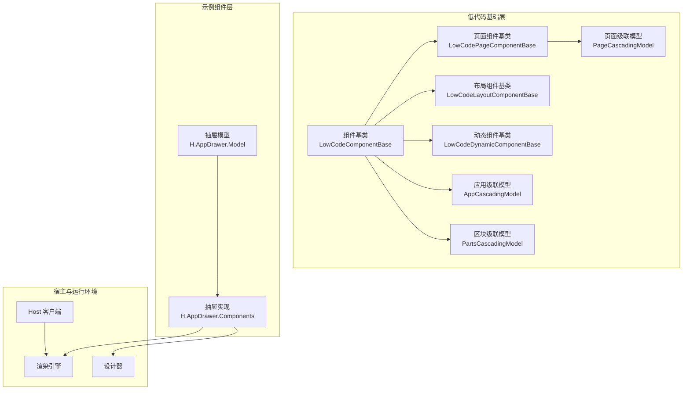
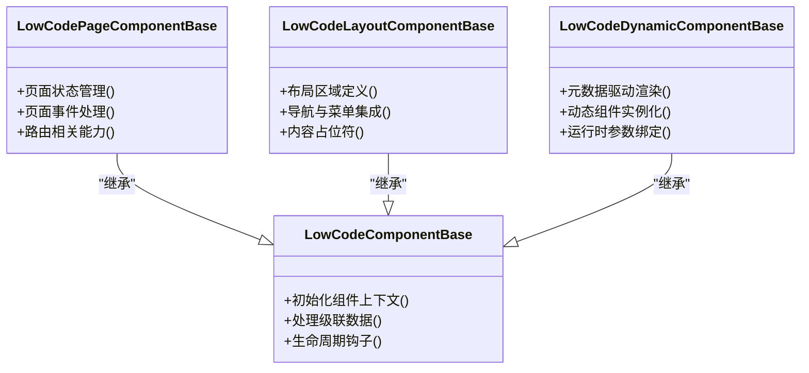
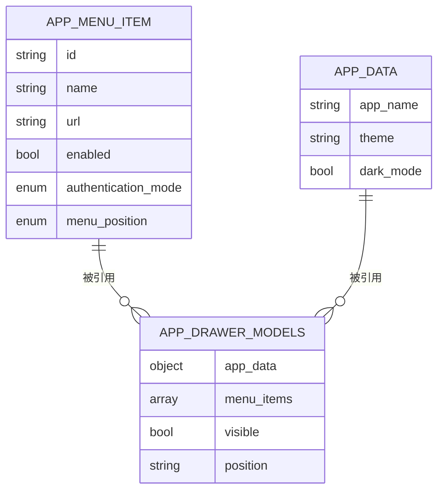
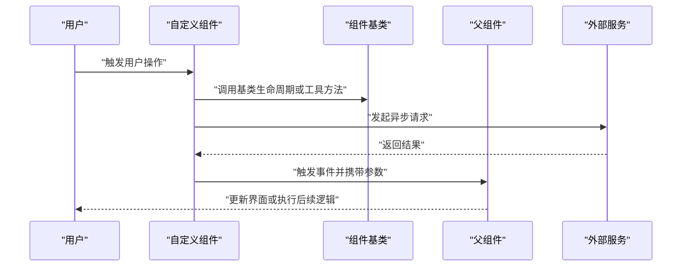
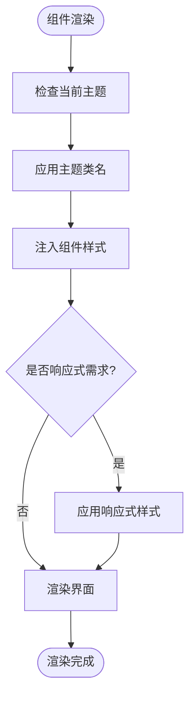
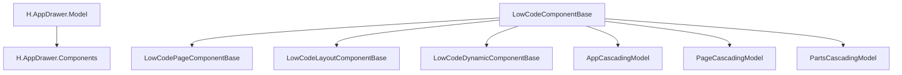

# 自定义组件开发指南

<cite>
**本文引用的文件**
- [LowCodeComponentBase.cs](file://src/src/LowCode/Common/H.LowCode.ComponentBase/LowCodeComponentBase.cs)
- [LowCodePageComponentBase.cs](file://src/src/LowCode/Common/H.LowCode.ComponentBase/LowCodePageComponentBase.cs)
- [LowCodeLayoutComponentBase.cs](file://src/src/LowCode/Common/H.LowCode.ComponentBase/LowCodeLayoutComponentBase.cs)
- [LowCodeDynamicComponentBase.cs](file://src/src/LowCode/Common/H.LowCode.ComponentBase/LowCodeDynamicComponentBase.cs)
- [NativeHtmlElement.cs](file://src/src/LowCode/Common/H.LowCode.ComponentBase/NativeHtmlElement.cs)
- [Conditional.razor](file://src/src/LowCode/Common/H.LowCode.ComponentBase/Components/Conditional.razor)
- [NativeResourceMount.razor](file://src/src/LowCode/Common/H.LowCode.ComponentBase/Components/NativeResourceMount.razor)
- [AppCascadingModel.cs](file://src/src/LowCode/Common/H.LowCode.ComponentBase/CascadingModels/AppCascadingModel.cs)
- [PageCascadingModel.cs](file://src/src/LowCode/Common/H.LowCode.ComponentBase/CascadingModels/PageCascadingModel.cs)
- [PartsCascadingModel.cs](file://src/src/LowCode/Common/H.LowCode.ComponentBase/CascadingModels/PartsCascadingModel.cs)
- [H.AppDrawer.Components.csproj](file://src/src/Components/AppDrawer/H.AppDrawer.Components/H.AppDrawer.Components.csproj)
- [H.AppDrawer.Model.csproj](file://src/src/Components/AppDrawer/H.AppDrawer.Model/H.AppDrawer.Model.csproj)
- [AppMenuItem.cs](file://src/src/Components/AppDrawer/H.AppDrawer.Model/AppMenuItem.cs)
- [AuthenticationMode.cs](file://src/src/Components/AppDrawer/H.AppDrawer.Model/AuthenticationMode.cs)
- [MenuPosition.cs](file://src/src/Components/AppDrawer/H.AppDrawer.Model/MenuPosition.cs)
- [AppDrawerModels.cs](file://src/src/Components/AppDrawer/H.AppDrawer.Model/AppDrawerModels.cs)
- [AppData.cs](file://src/src/Components/AppDrawer/H.AppDrawer.Model/AppData.cs)
</cite>

## 目录
1. [引言](#引言)
2. [项目结构](#项目结构)
3. [核心组件基类](#核心组件基类)
4. [元数据与属性系统](#元数据与属性系统)
5. [事件系统](#事件系统)
6. [样式定制机制](#样式定制机制)
7. [测试最佳实践](#测试最佳实践)
8. [打包、发布与版本管理](#打包发布与版本管理)
9. [实际案例](#实际案例)
10. [依赖关系分析](#依赖关系分析)
11. [性能注意事项](#性能注意事项)
12. [故障排查](#故障排查)
13. [结论](#结论)

## 引言
本指南面向从零开始使用 H.AppLab 低代码平台开发自定义组件的开发者。内容围绕仓库中已有的 Blazor 组件基类、级联模型、示例抽屉组件以及组件项目结构展开，帮助读者理解：
- 如何创建第一个自定义组件
- 如何定义组件元数据、属性和事件
- 如何在设计器与运行时渲染引擎中使用组件
- 如何进行样式定制、测试、打包与发布

## 项目结构
H.AppLab 的低代码相关能力集中在 `src/src/LowCode` 目录下，同时提供可复用的示例组件位于 `src/src/Components`。自定义组件开发通常涉及以下层次：

**图示来源**
- [LowCodeComponentBase.cs](file://src/src/LowCode/Common/H.LowCode.ComponentBase/LowCodeComponentBase.cs)
- [LowCodePageComponentBase.cs](file://src/src/LowCode/Common/H.LowCode.ComponentBase/LowCodePageComponentBase.cs)
- [LowCodeLayoutComponentBase.cs](file://src/src/LowCode/Common/H.LowCode.ComponentBase/LowCodeLayoutComponentBase.cs)
- [LowCodeDynamicComponentBase.cs](file://src/src/LowCode/Common/H.LowCode.ComponentBase/LowCodeDynamicComponentBase.cs)
- [AppCascadingModel.cs](file://src/src/LowCode/Common/H.LowCode.ComponentBase/CascadingModels/AppCascadingModel.cs)
- [PageCascadingModel.cs](file://src/src/LowCode/Common/H.LowCode.ComponentBase/CascadingModels/PageCascadingModel.cs)
- [PartsCascadingModel.cs](file://src/src/LowCode/Common/H.LowCode.ComponentBase/CascadingModels/PartsCascadingModel.cs)
- [H.AppDrawer.Components.csproj](file://src/src/Components/AppDrawer/H.AppDrawer.Components/H.AppDrawer.Components.csproj)
- [H.AppDrawer.Model.csproj](file://src/src/Components/AppDrawer/H.AppDrawer.Model/H.AppDrawer.Model.csproj)

**章节来源**
- [LowCodeComponentBase.cs](file://src/src/LowCode/Common/H.LowCode.ComponentBase/LowCodeComponentBase.cs)
- [LowCodePageComponentBase.cs](file://src/src/LowCode/Common/H.LowCode.ComponentBase/LowCodePageComponentBase.cs)
- [LowCodeLayoutComponentBase.cs](file://src/src/LowCode/Common/H.LowCode.ComponentBase/LowCodeLayoutComponentBase.cs)
- [LowCodeDynamicComponentBase.cs](file://src/src/LowCode/Common/H.LowCode.ComponentBase/LowCodeDynamicComponentBase.cs)
- [H.AppDrawer.Components.csproj](file://src/src/Components/AppDrawer/H.AppDrawer.Components/H.AppDrawer.Components.csproj)
- [H.AppDrawer.Model.csproj](file://src/src/Components/AppDrawer/H.AppDrawer.Model/H.AppDrawer.Model.csproj)

## 核心组件基类
H.AppLab 提供了多种组件基类，用于支撑不同场景下的自定义组件开发：

| 基类 | 职责 | 适用场景 |
| --- | --- | --- |
| LowCodeComponentBase | 通用低代码组件基类，提供组件上下文、级联数据和生命周期钩子 | 大多数业务组件 |
| LowCodePageComponentBase | 页面级组件基类，承载页面状态、路由和页面级事件 | 独立页面或页面容器 |
| LowCodeLayoutComponentBase | 布局组件基类，负责区域划分、导航和内容占位 | 主布局、侧边栏、顶部栏等 |
| LowCodeDynamicComponentBase | 动态组件基类，支持运行时根据元数据生成和渲染组件 | 表单渲染、可视化编排、插件化组件加载 |

这些基类共同构成自定义组件的基础设施。开发者在继承基类后，可以扩展渲染逻辑、绑定属性、触发事件，并与设计器和渲染引擎协作。

**图示来源**
- [LowCodeComponentBase.cs](file://src/src/LowCode/Common/H.LowCode.ComponentBase/LowCodeComponentBase.cs)
- [LowCodePageComponentBase.cs](file://src/src/LowCode/Common/H.LowCode.ComponentBase/LowCodePageComponentBase.cs)
- [LowCodeLayoutComponentBase.cs](file://src/src/LowCode/Common/H.LowCode.ComponentBase/LowCodeLayoutComponentBase.cs)
- [LowCodeDynamicComponentBase.cs](file://src/src/LowCode/Common/H.LowCode.ComponentBase/LowCodeDynamicComponentBase.cs)

**章节来源**
- [LowCodeComponentBase.cs](file://src/src/LowCode/Common/H.LowCode.ComponentBase/LowCodeComponentBase.cs)
- [LowCodePageComponentBase.cs](file://src/src/LowCode/Common/H.LowCode.ComponentBase/LowCodePageComponentBase.cs)
- [LowCodeLayoutComponentBase.cs](file://src/src/LowCode/Common/H.LowCode.ComponentBase/LowCodeLayoutComponentBase.cs)
- [LowCodeDynamicComponentBase.cs](file://src/src/LowCode/Common/H.LowCode.ComponentBase/LowCodeDynamicComponentBase.cs)

## 元数据与属性系统
H.AppLab 的属性系统由“基类能力 + 元数据描述 + 示例组件”共同体现。虽然仓库未直接展示元数据属性定义文件，但通过基类和示例组件可以归纳出以下体系：

- **数据类型定义**：组件属性类型来源于 C# 类型系统与 Blazor 参数绑定，例如字符串、数值、布尔值、枚举、对象和集合。
- **验证规则**：建议在属性上结合 Blazor 验证机制，并在组件内部进行二次校验，保证设计器输入与运行时行为一致。
- **默认值**：为关键属性设置合理默认值，提升组件开箱即用体验。
- **显示配置**：在设计器中，属性的显示名称、分组、提示文案、是否必填等可由元数据控制；在运行时，组件可通过条件渲染和样式切换响应属性变化。

参考示例组件的模型组织方式：

**图示来源**
- [AppMenuItem.cs](file://src/src/Components/AppDrawer/H.AppDrawer.Model/AppMenuItem.cs)
- [AppDrawerModels.cs](file://src/src/Components/AppDrawer/H.AppDrawer.Model/AppDrawerModels.cs)
- [AppData.cs](file://src/src/Components/AppDrawer/H.AppDrawer.Model/AppData.cs)
- [AuthenticationMode.cs](file://src/src/Components/AppDrawer/H.AppDrawer.Model/AuthenticationMode.cs)
- [MenuPosition.cs](file://src/src/Components/AppDrawer/H.AppDrawer.Model/MenuPosition.cs)

在实际开发中，建议将组件的属性分为三类：
1. **基础属性**：如标题、可见性、禁用状态。
2. **业务属性**：如数据来源、过滤条件、排序规则。
3. **展示属性**：如主题、尺寸、对齐方式、动画开关。

**章节来源**
- [AppMenuItem.cs](file://src/src/Components/AppDrawer/H.AppDrawer.Model/AppMenuItem.cs)
- [AppDrawerModels.cs](file://src/src/Components/AppDrawer/H.AppDrawer.Model/AppDrawerModels.cs)
- [AppData.cs](file://src/src/Components/AppDrawer/H.AppDrawer.Model/AppData.cs)
- [AuthenticationMode.cs](file://src/src/Components/AppDrawer/H.AppDrawer.Model/AuthenticationMode.cs)
- [MenuPosition.cs](file://src/src/Components/AppDrawer/H.AppDrawer.Model/MenuPosition.cs)

## 事件系统
H.AppLab 的事件系统通常由基类提供的生命周期与 Blazor 事件机制共同实现。自定义组件应遵循以下模式：

- **事件触发时机**：用户交互（点击、输入）、异步操作完成（接口返回）、状态变更（属性更新）。
- **参数传递**：通过事件回调的参数对象传递业务上下文，避免直接暴露内部状态。
- **异步处理**：对耗时操作使用异步方法，并在完成后触发成功或失败事件，便于上层处理错误与日志。

典型流程如下：

**图示来源**
- [LowCodeComponentBase.cs](file://src/src/LowCode/Common/H.LowCode.ComponentBase/LowCodeComponentBase.cs)
- [LowCodeDynamicComponentBase.cs](file://src/src/LowCode/Common/H.LowCode.ComponentBase/LowCodeDynamicComponentBase.cs)

**章节来源**
- [LowCodeComponentBase.cs](file://src/src/LowCode/Common/H.LowCode.ComponentBase/LowCodeComponentBase.cs)
- [LowCodeDynamicComponentBase.cs](file://src/src/LowCode/Common/H.LowCode.ComponentBase/LowCodeDynamicComponentBase.cs)

## 样式定制机制
H.AppLab 的样式定制机制主要依托 Blazor 的 CSS 隔离、主题变量和组件级样式注入。示例中的原生 HTML 元素封装和条件渲染组件展示了常见样式扩展点：

- **CSS 注入**：组件可将自身样式资源注册到静态资源挂载点，确保在不同宿主环境中正确加载。
- **主题支持**：通过主题变量或类名切换实现明暗主题、品牌色替换。
- **响应式设计**：使用媒体查询和弹性布局适配不同屏幕尺寸。

**图示来源**
- [NativeHtmlElement.cs](file://src/src/LowCode/Common/H.LowCode.ComponentBase/NativeHtmlElement.cs)
- [Conditional.razor](file://src/src/LowCode/Common/H.LowCode.ComponentBase/Components/Conditional.razor)
- [NativeResourceMount.razor](file://src/src/LowCode/Common/H.LowCode.ComponentBase/Components/NativeResourceMount.razor)

**章节来源**
- [NativeHtmlElement.cs](file://src/src/LowCode/Common/H.LowCode.ComponentBase/NativeHtmlElement.cs)
- [Conditional.razor](file://src/src/LowCode/Common/H.LowCode.ComponentBase/Components/Conditional.razor)
- [NativeResourceMount.razor](file://src/src/LowCode/Common/H.LowCode.ComponentBase/Components/NativeResourceMount.razor)

## 测试最佳实践
针对 H.AppLab 自定义组件，建议采用三层测试策略：

| 测试类型 | 目标 | 推荐做法 |
| --- | --- | --- |
| 单元测试 | 验证组件内部逻辑、属性校验、事件触发 | 模拟参数、断言回调是否按预期调用 |
| 集成测试 | 验证组件与设计器、渲染引擎协作 | 模拟级联模型、模拟外部服务返回 |
| 可视化测试 | 验证样式、主题、响应式表现 | 截图对比、断言关键 UI 元素存在 |

对于复杂业务组件，建议优先编写单元测试覆盖核心逻辑，再补充集成测试验证与基类、级联模型和外部服务的交互。

**章节来源**
- [LowCodeComponentBase.cs](file://src/src/LowCode/Common/H.LowCode.ComponentBase/LowCodeComponentBase.cs)
- [LowCodeDynamicComponentBase.cs](file://src/src/LowCode/Common/H.LowCode.ComponentBase/LowCodeDynamicComponentBase.cs)

## 打包、发布与版本管理
从仓库中的示例组件项目可以看出，Blazor 组件通常以 `.csproj` 为单位组织，并包含独立的模型项目和组件实现项目。发布流程建议如下：

1. **项目拆分**：将模型、组件实现、静态资源分离，提高复用性和可维护性。
2. **依赖声明**：在组件项目中声明对低代码基类、工具库和第三方 UI 库的依赖。
3. **构建产物**：生成 DLL 与静态资源包，供设计器和运行时引用。
4. **版本管理**：使用语义化版本号，记录破坏性变更和兼容性说明。
5. **发布渠道**：通过 NuGet 或私有包管理器发布，并在文档中说明引入方式和最低依赖版本。

示例项目结构体现了模型与实现的分离：

**图示来源**
- [H.AppDrawer.Model.csproj](file://src/src/Components/AppDrawer/H.AppDrawer.Model/H.AppDrawer.Model.csproj)
- [H.AppDrawer.Components.csproj](file://src/src/Components/AppDrawer/H.AppDrawer.Components/H.AppDrawer.Components.csproj)

**章节来源**
- [H.AppDrawer.Model.csproj](file://src/src/Components/AppDrawer/H.AppDrawer.Model/H.AppDrawer.Model.csproj)
- [H.AppDrawer.Components.csproj](file://src/src/Components/AppDrawer/H.AppDrawer.Components/H.AppDrawer.Components.csproj)

## 实际案例
### 案例一：简单展示组件
- 继承 `LowCodeComponentBase`
- 定义基础属性：标题、文本内容、是否可见
- 实现渲染逻辑：根据属性输出静态内容
- 添加事件：点击时触发展示事件

### 案例二：数据列表组件
- 继承 `LowCodeComponentBase`
- 定义属性：数据源、分页参数、排序字段
- 实现异步加载：调用服务获取数据并刷新视图
- 添加事件：行选择、分页变更、搜索提交

### 案例三：业务表单组件
- 继承 `LowCodeDynamicComponentBase`
- 使用元数据驱动表单字段渲染
- 实现字段验证、联动和提交
- 触发保存成功或失败事件

### 案例四：抽屉组件（仓库示例）
- 模型层：`AppMenuItem`、`AppData`、`AuthenticationMode`、`MenuPosition`
- 组件层：基于 Blazor 实现抽屉显示、菜单渲染、认证模式切换
- 集成层：与渲染引擎和设计器协作，支持属性配置与预览

**章节来源**
- [AppMenuItem.cs](file://src/src/Components/AppDrawer/H.AppDrawer.Model/AppMenuItem.cs)
- [AppData.cs](file://src/src/Components/AppDrawer/H.AppDrawer.Model/AppData.cs)
- [AuthenticationMode.cs](file://src/src/Components/AppDrawer/H.AppDrawer.Model/AuthenticationMode.cs)
- [MenuPosition.cs](file://src/src/Components/AppDrawer/H.AppDrawer.Model/MenuPosition.cs)
- [AppDrawerModels.cs](file://src/src/Components/AppDrawer/H.AppDrawer.Model/AppDrawerModels.cs)
- [H.AppDrawer.Components.csproj](file://src/src/Components/AppDrawer/H.AppDrawer.Components/H.AppDrawer.Components.csproj)
- [H.AppDrawer.Model.csproj](file://src/src/Components/AppDrawer/H.AppDrawer.Model/H.AppDrawer.Model.csproj)

## 依赖关系分析
自定义组件依赖低代码基类、级联模型和示例组件的组织方式。下图展示核心依赖：

**图示来源**
- [H.AppDrawer.Model.csproj](file://src/src/Components/AppDrawer/H.AppDrawer.Model/H.AppDrawer.Model.csproj)
- [H.AppDrawer.Components.csproj](file://src/src/Components/AppDrawer/H.AppDrawer.Components/H.AppDrawer.Components.csproj)
- [LowCodeComponentBase.cs](file://src/src/LowCode/Common/H.LowCode.ComponentBase/LowCodeComponentBase.cs)
- [LowCodePageComponentBase.cs](file://src/src/LowCode/Common/H.LowCode.ComponentBase/LowCodePageComponentBase.cs)
- [LowCodeLayoutComponentBase.cs](file://src/src/LowCode/Common/H.LowCode.ComponentBase/LowCodeLayoutComponentBase.cs)
- [LowCodeDynamicComponentBase.cs](file://src/src/LowCode/Common/H.LowCode.ComponentBase/LowCodeDynamicComponentBase.cs)
- [AppCascadingModel.cs](file://src/src/LowCode/Common/H.LowCode.ComponentBase/CascadingModels/AppCascadingModel.cs)
- [PageCascadingModel.cs](file://src/src/LowCode/Common/H.LowCode.ComponentBase/CascadingModels/PageCascadingModel.cs)
- [PartsCascadingModel.cs](file://src/src/LowCode/Common/H.LowCode.ComponentBase/CascadingModels/PartsCascadingModel.cs)

**章节来源**
- [H.AppDrawer.Model.csproj](file://src/src/Components/AppDrawer/H.AppDrawer.Model/H.AppDrawer.Model.csproj)
- [H.AppDrawer.Components.csproj](file://src/src/Components/AppDrawer/H.AppDrawer.Components/H.AppDrawer.Components.csproj)
- [LowCodeComponentBase.cs](file://src/src/LowCode/Common/H.LowCode.ComponentBase/LowCodeComponentBase.cs)
- [LowCodePageComponentBase.cs](file://src/src/LowCode/Common/H.LowCode.ComponentBase/LowCodePageComponentBase.cs)
- [LowCodeLayoutComponentBase.cs](file://src/src/LowCode/Common/H.LowCode.ComponentBase/LowCodeLayoutComponentBase.cs)
- [LowCodeDynamicComponentBase.cs](file://src/src/LowCode/Common/H.LowCode.ComponentBase/LowCodeDynamicComponentBase.cs)
- [AppCascadingModel.cs](file://src/src/LowCode/Common/H.LowCode.ComponentBase/CascadingModels/AppCascadingModel.cs)
- [PageCascadingModel.cs](file://src/src/LowCode/Common/H.LowCode.ComponentBase/CascadingModels/PageCascadingModel.cs)
- [PartsCascadingModel.cs](file://src/src/LowCode/Common/H.LowCode.ComponentBase/CascadingModels/PartsCascadingModel.cs)

## 性能注意事项
- 减少不必要的重渲染：合理使用条件渲染和局部更新。
- 避免在渲染函数中执行昂贵计算：将计算结果缓存或使用异步预取。
- 控制事件频率：对高频交互事件做防抖或节流。
- 合理拆分组件：将大组件拆分为小组件，降低渲染树复杂度。
- 注意静态资源体积：按需加载样式与脚本，避免一次性注入过多资源。

## 故障排查
常见问题及排查建议：

| 问题现象 | 可能原因 | 排查建议 |
| --- | --- | --- |
| 组件无法在设计器中预览 | 元数据缺失或属性类型不匹配 | 检查属性定义与基类约定 |
| 事件未触发 | 事件回调未绑定或异步异常被吞掉 | 检查事件绑定和异常处理 |
| 样式未生效 | 样式资源未正确注入或命名冲突 | 检查静态资源挂载点和 CSS 作用域 |
| 运行时报错 | 依赖版本不一致或缺少必要 DLL | 检查项目依赖和包版本 |

**章节来源**
- [LowCodeComponentBase.cs](file://src/src/LowCode/Common/H.LowCode.ComponentBase/LowCodeComponentBase.cs)
- [NativeResourceMount.razor](file://src/src/LowCode/Common/H.LowCode.ComponentBase/Components/NativeResourceMount.razor)

## 结论
H.AppLab 低代码平台的自定义组件开发以基类为核心，通过元数据、属性系统和事件机制实现设计器与运行时的统一体验。开发者应从简单展示组件入手，逐步掌握数据绑定、异步交互、样式定制和测试发布流程。仓库中的抽屉组件为业务组件开发提供了良好参考，结合基类能力和示例项目结构，可以快速构建高质量的可复用组件。