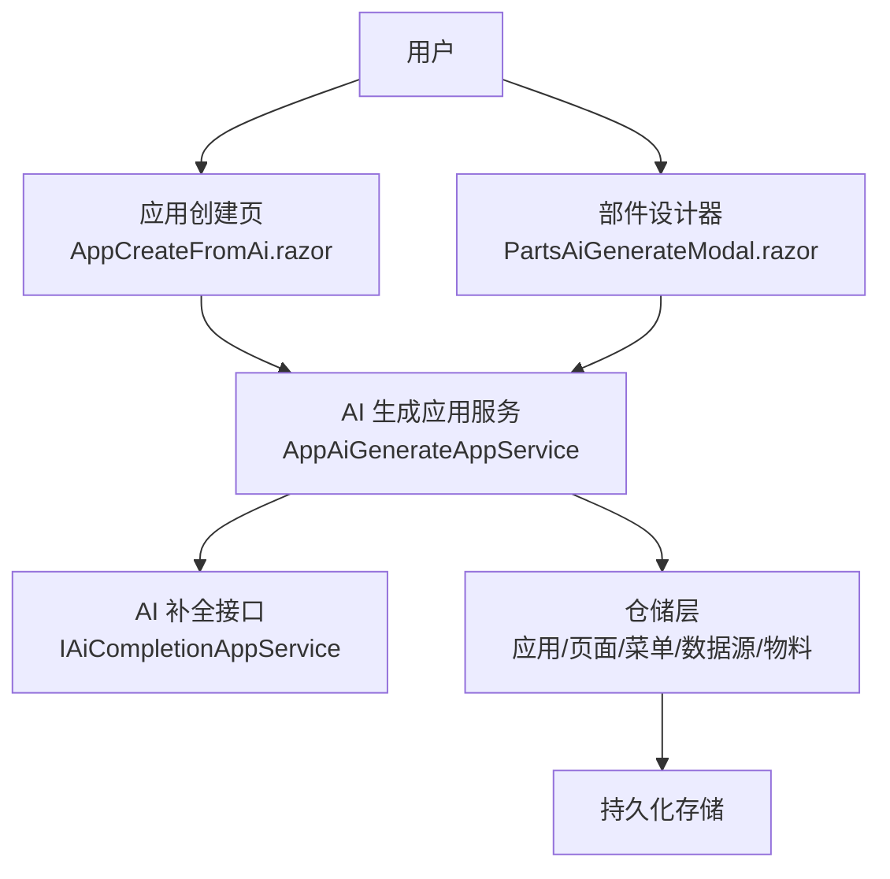
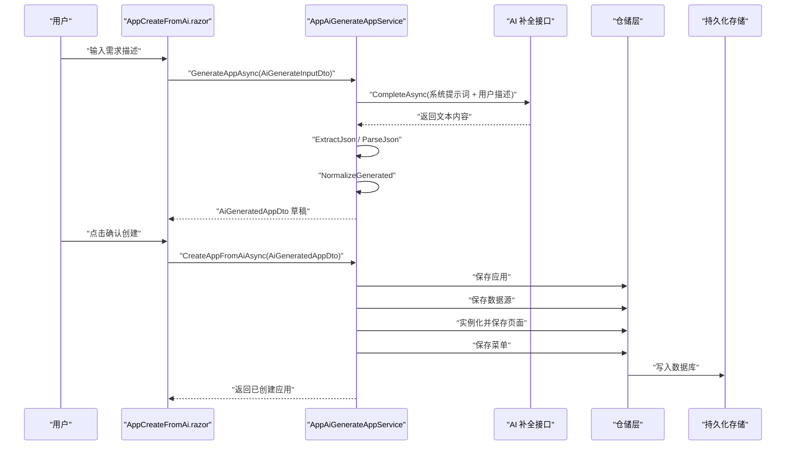
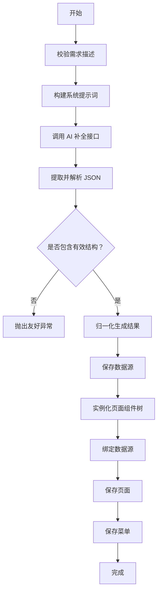
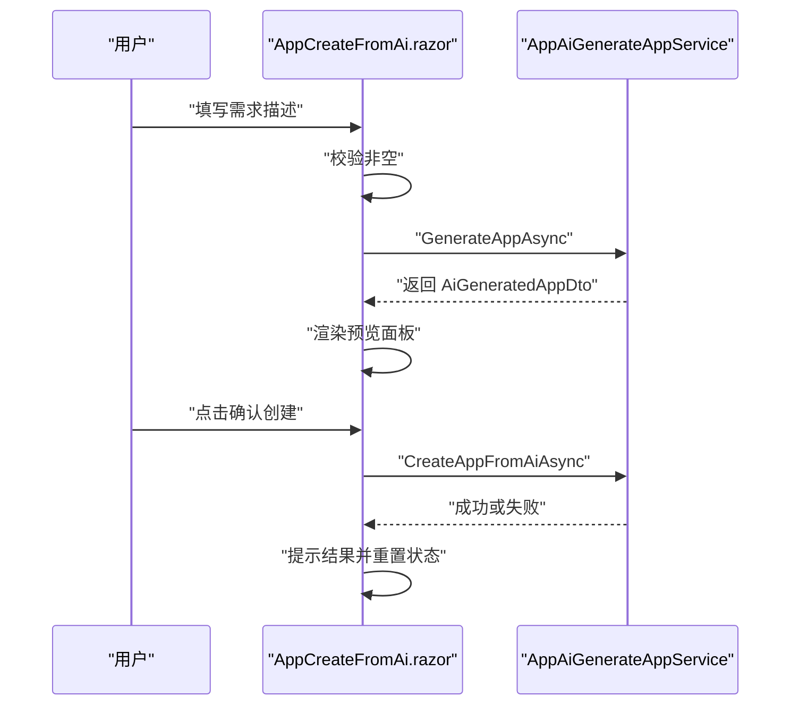
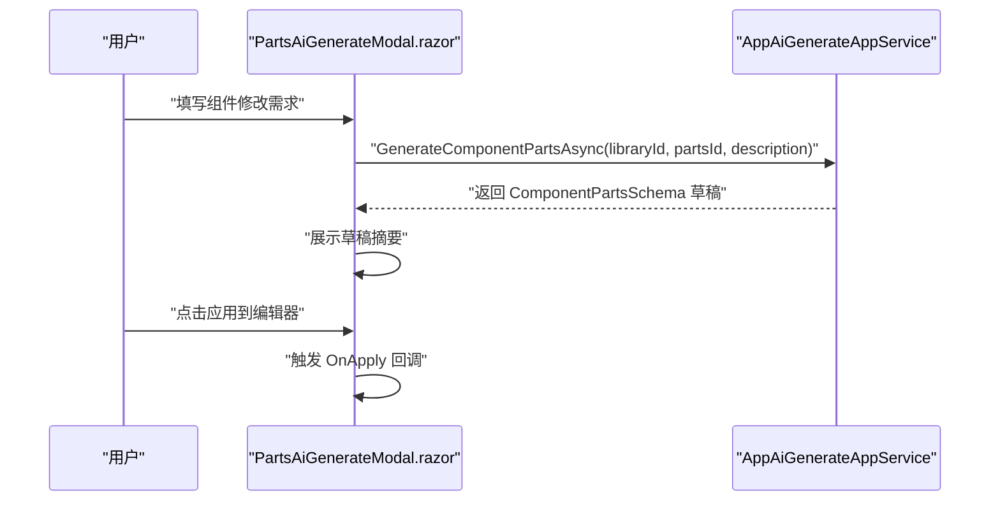
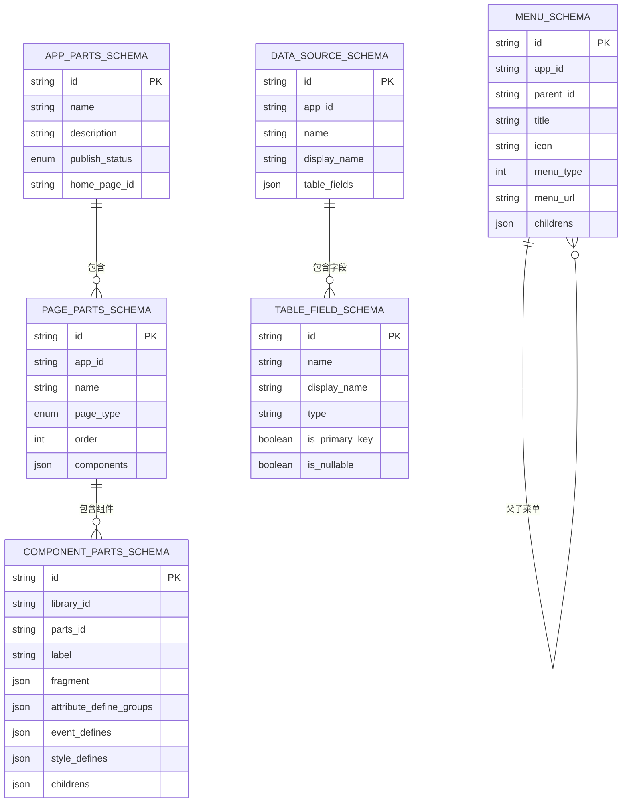
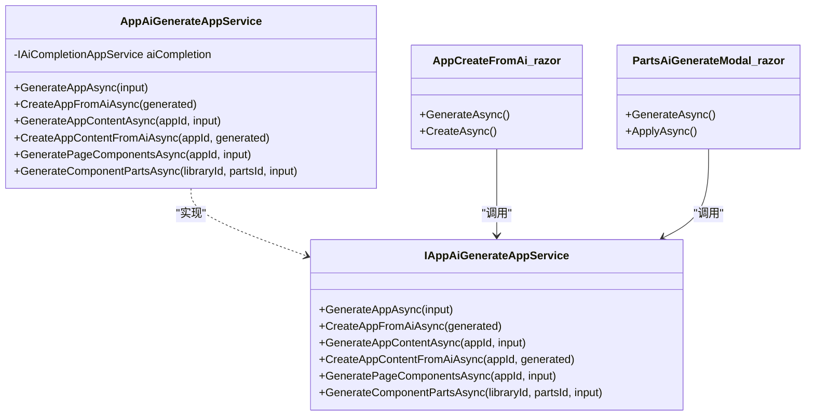

# AI 生成应用

<cite>
**本文引用的文件**   
- [AppAiGenerateAppService.cs](file://src/LowCode/DesignEngine/H.LowCode.DesignEngine.Application/AppServices/AppAiGenerateAppService.cs)
- [IAppAiGenerateAppService.cs](file://src/LowCode/DesignEngine/H.LowCode.DesignEngine.Application.Contracts/AppServices/IAppAiGenerateAppService.cs)
- [AppCreateFromAi.razor](file://src/LowCode/DesignEngine/H.LowCode.MyApp/Pages/MyApps/AppCreateFromAi.razor)
- [PartsAiGenerateModal.razor](file://src/LowCode/DesignEngine/H.LowCode.PartsDesignEngine/Pages/ComponentParts/Components/PartsAiGenerateModal.razor)
- [AppAiGenerateDtos.cs](file://src/LowCode/DesignEngine/H.LowCode.DesignEngine.Application.Contracts/Dtos/Ai/AppAiGenerateDtos.cs)
</cite>

## 目录
1. [引言](#引言)
2. [项目结构定位](#项目结构定位)
3. [核心职责与边界](#核心职责与边界)
4. [架构总览](#架构总览)
5. [关键组件详解](#关键组件详解)
6. [AI 产物到 MetaSchema 的映射](#ai-产物到-metaschema-的映射)
7. [提示词工程建议](#提示词工程建议)
8. [错误处理与降级策略](#错误处理与降级策略)
9. [扩展点：接入新 AI 提供商与替换模板](#扩展点接入新-ai-提供商与替换模板)
10. [性能与健壮性考量](#性能与健壮性考量)
11. [故障排查指南](#故障排查指南)
12. [结论](#结论)

## 引言
本文件围绕“AI 辅助生成应用功能”展开，重点解释以下目标：
- `AppAiGenerateAppService` 如何接收自然语言需求、调用 AI 服务、构造页面 Schema、菜单结构与数据源定义，并将结果持久化到当前应用。
- `AppCreateFromAi.razor` 的用户交互流程：输入需求 → 预览生成结果 → 确认创建或调整。
- `PartsAiGenerateModal.razor` 在部件设计器中的作用：根据组件描述生成组件 Fragment、属性定义、事件定义等物料修改草稿。
- AI 生成的中间产物如何映射到标准 `MetaSchema`，保证最终可被 RenderEngine 渲染。
- 提示词工程实践、错误处理策略和可扩展设计。

## 项目结构定位
该能力位于低代码设计引擎与应用管理相关模块中，核心由一个后端应用服务和两个前端 Razor 组件组成：
- 后端应用服务：`AppAiGenerateAppService`，负责与 AI 完成接口、解析 JSON、校验并持久化。
- 我的应用入口：`AppCreateFromAi.razor`，面向用户创建应用。
- 部件设计器弹窗：`PartsAiGenerateModal.razor`，面向组件物料编辑。
- DTO 模型：`AppAiGenerateDtos.cs`，描述 AI 生成输入和输出结构。

**图示来源**  
- [AppCreateFromAi.razor:1-218](file://src/LowCode/DesignEngine/H.LowCode.MyApp/Pages/MyApps/AppCreateFromAi.razor#L1-L218)
- [PartsAiGenerateModal.razor:1-150](file://src/LowCode/DesignEngine/H.LowCode.PartsDesignEngine/Pages/ComponentParts/Components/PartsAiGenerateModal.razor#L1-L150)
- [AppAiGenerateAppService.cs:1-955](file://src/LowCode/DesignEngine/H.LowCode.DesignEngine.Application/AppServices/AppAiGenerateAppService.cs#L1-L955)

**章节来源**  
- [AppCreateFromAi.razor:1-218](file://src/LowCode/DesignEngine/H.LowCode.MyApp/Pages/MyApps/AppCreateFromAi.razor#L1-L218)
- [PartsAiGenerateModal.razor:1-150](file://src/LowCode/DesignEngine/H.LowCode.PartsDesignEngine/Pages/ComponentParts/Components/PartsAiGenerateModal.razor#L1-L150)
- [AppAiGenerateAppService.cs:1-120](file://src/LowCode/DesignEngine/H.LowCode.DesignEngine.Application/AppServices/AppAiGenerateAppService.cs#L1-L120)

## 核心职责与边界
`AppAiGenerateAppService` 的职责可以概括为“翻译自然语言为可持久化的低代码应用元数据”，具体包括：
- 接收 `AiGenerateInputDto`，封装系统提示词和用户描述，调用 AI 补全接口。
- 将 AI 返回文本中的 JSON 提取、反序列化为 `AiGeneratedAppDto` 或 `AiGeneratedPageDto`、`ComponentPartsSchema`。
- 对生成内容进行归一化：截断超长字段、补齐临时 ID、校验引用关系、限制数量上限。
- 实例化组件树：按可用组件物料清单匹配 `partsId`，克隆真实 `ComponentPartsSchema`。
- 绑定数据源：将表格类组件的 `dataSourceRef` 转换为实际数据源 ID，并生成表格列配置。
- 持久化：保存应用、页面、菜单和数据源；默认首页选择第一个生成的页面。
- 提供部件物料修改能力：基于当前物料 JSON 生成完整 `ComponentPartsSchema` 修改草稿。

该服务不直接实现 UI，也不直接访问数据库，而是通过 ABP 仓储接口与 AI 接口协作。

**章节来源**  
- [IAppAiGenerateAppService.cs:1-42](file://src/LowCode/DesignEngine/H.LowCode.DesignEngine.Application.Contracts/AppServices/IAppAiGenerateAppService.cs#L1-L42)
- [AppAiGenerateAppService.cs:1-120](file://src/LowCode/DesignEngine/H.LowCode.DesignEngine.Application/AppServices/AppAiGenerateAppService.cs#L1-L120)

## 架构总览
下图展示一次典型“从自然语言创建应用”的调用链：

**图示来源**  
- [AppCreateFromAi.razor:1-218](file://src/LowCode/DesignEngine/H.LowCode.MyApp/Pages/MyApps/AppCreateFromAi.razor#L1-L218)
- [AppAiGenerateAppService.cs:60-120](file://src/LowCode/DesignEngine/H.LowCode.DesignEngine.Application/AppServices/AppAiGenerateAppService.cs#L60-L120)
- [AppAiGenerateAppService.cs:220-360](file://src/LowCode/DesignEngine/H.LowCode.DesignEngine.Application/AppServices/AppAiGenerateAppService.cs#L220-L360)

## 关键组件详解

### `AppAiGenerateAppService`：AI 生成应用服务
该服务是 AI 生成能力的核心编排者，主要方法如下：
- `GenerateAppAsync`：用于“我的应用”场景，根据描述生成应用信息、页面、菜单、数据源草稿，不落库。
- `CreateAppFromAiAsync`：确认落库，创建应用并保存页面、菜单、数据源。
- `GenerateAppContentAsync`：为已有应用增量生成页面、菜单、数据源草稿。
- `CreateAppContentFromAiAsync`：确认增量内容落库。
- `GeneratePageComponentsAsync`：在页面设计器中根据描述生成组件树，返回真实组件实例。
- `GenerateComponentPartsAsync`：在部件设计器中根据描述生成组件物料修改草稿。

内部关键处理步骤包括：
- 构建系统提示词，注入可用组件物料清单。
- 调用 AI 补全接口，设置较低温度值以减少随机性。
- 使用 `ExtractJson` 清理 Markdown 代码块包裹的 JSON。
- 使用 `NormalizeGenerated` 统一字段长度、补齐临时 ID、过滤悬空引用。
- 使用 `LoadComponentDefinesAsync` 加载全部组件物料，再通过 `BuildComponents` 递归实例化。
- 使用 `BindComponentsDataSource` 将表格组件的数据源引用转换为真实数据源和列配置。

**图示来源**  
- [AppAiGenerateAppService.cs:60-120](file://src/LowCode/DesignEngine/H.LowCode.DesignEngine.Application/AppServices/AppAiGenerateAppService.cs#L60-L120)
- [AppAiGenerateAppService.cs:220-360](file://src/LowCode/DesignEngine/H.LowCode.DesignEngine.Application/AppServices/AppAiGenerateAppService.cs#L220-L360)
- [AppAiGenerateAppService.cs:501-580](file://src/LowCode/DesignEngine/H.LowCode.DesignEngine.Application/AppServices/AppAiGenerateAppService.cs#L501-L580)
- [AppAiGenerateAppService.cs:807-955](file://src/LowCode/DesignEngine/H.LowCode.DesignEngine.Application/AppServices/AppAiGenerateAppService.cs#L807-L955)

**章节来源**  
- [AppAiGenerateAppService.cs:1-120](file://src/LowCode/DesignEngine/H.LowCode.DesignEngine.Application/AppServices/AppAiGenerateAppService.cs#L1-L120)
- [AppAiGenerateAppService.cs:220-360](file://src/LowCode/DesignEngine/H.LowCode.DesignEngine.Application/AppServices/AppAiGenerateAppService.cs#L220-L360)
- [AppAiGenerateAppService.cs:501-580](file://src/LowCode/DesignEngine/H.LowCode.DesignEngine.Application/AppServices/AppAiGenerateAppService.cs#L501-L580)
- [AppAiGenerateAppService.cs:807-955](file://src/LowCode/DesignEngine/H.LowCode.DesignEngine.Application/AppServices/AppAiGenerateAppService.cs#L807-L955)

### `AppCreateFromAi.razor`：应用创建交互流程
该组件承担用户输入、预览和确认创建职责：
- 输入阶段：提供多行文本框，提示用户用口语描述想创建的应用。
- 生成阶段：调用 `GenerateAppAsync`，显示加载中状态，捕获异常并显示错误。
- 预览阶段：展示应用名称、描述、数据源列表、页面列表及组件摘要、菜单层级。
- 确认阶段：调用 `CreateAppFromAiAsync`，成功后清空表单并触发回调。

它并不直接持久化数据，而是把生成结果交给后端服务处理。

**图示来源**  
- [AppCreateFromAi.razor:1-218](file://src/LowCode/DesignEngine/H.LowCode.MyApp/Pages/MyApps/AppCreateFromAi.razor#L1-L218)
- [AppAiGenerateAppService.cs:60-120](file://src/LowCode/DesignEngine/H.LowCode.DesignEngine.Application/AppServices/AppAiGenerateAppService.cs#L60-L120)

**章节来源**  
- [AppCreateFromAi.razor:1-218](file://src/LowCode/DesignEngine/H.LowCode.MyApp/Pages/MyApps/AppCreateFromAi.razor#L1-L218)

### `PartsAiGenerateModal.razor`：部件设计器中的 AI 生成
该弹窗服务于部件设计器，目标是“根据自然语言描述生成组件物料修改草稿”。其特点：
- 不直接保存物料，而是生成 `ComponentPartsSchema` 草稿并通过 `OnApply` 回调交给编辑器。
- 展示草稿的关键信息：渲染片段类型、元素属性数量、属性定义分组、事件定义、样式定义、子组件。
- 调用 `GenerateComponentPartsAsync`，传入组件库 ID、组件 ID 和需求描述。
- 支持“上一步”和“应用到编辑器”，适合用户在 AI 输出基础上继续手工调整。

**图示来源**  
- [PartsAiGenerateModal.razor:1-150](file://src/LowCode/DesignEngine/H.LowCode.PartsDesignEngine/Pages/ComponentParts/Components/PartsAiGenerateModal.razor#L1-L150)
- [AppAiGenerateAppService.cs:201-240](file://src/LowCode/DesignEngine/H.LowCode.DesignEngine.Application/AppServices/AppAiGenerateAppService.cs#L201-L240)

**章节来源**  
- [PartsAiGenerateModal.razor:1-150](file://src/LowCode/DesignEngine/H.LowCode.PartsDesignEngine/Pages/ComponentParts/Components/PartsAiGenerateModal.razor#L1-L150)
- [AppAiGenerateAppService.cs:201-240](file://src/LowCode/DesignEngine/H.LowCode.DesignEngine.Application/AppServices/AppAiGenerateAppService.cs#L201-L240)

## AI 产物到 MetaSchema 的映射
AI 本身并不直接输出 RenderEngine 可直接渲染的完整页面 Schema，而是输出一种中间 DTO，再由 `AppAiGenerateAppService` 转换为设计器和渲染器可用的结构。

### 中间 DTO 到持久化 MetaSchema 的转换
| 中间 DTO | 含义 | 转换规则 | 对应持久化结构 |
|---|---|---|---|
| `AiGeneratedAppDto` | 应用级草稿 | 应用名称、描述截断；若为空则拒绝 | `AppPartsSchema` |
| `AiGeneratedPageDto` | 页面草稿 | 名称截断、类型规范化、临时 ID 补齐 | `PagePartsSchema` |
| `AiGeneratedComponentDto` | 组件规格 | 必须匹配可用物料 `partsId`，否则丢弃 | `ComponentPartsSchema` |
| `AiGeneratedMenuDto` | 菜单草稿 | 父菜单先建、子菜单后建；目录无页面地址 | `MenuSchema` |
| `AiGeneratedDataSourceDto` | 数据表草稿 | 表名加 `tb_` 前缀，字段名加 `f_` 前缀 | `DataSourceSchema` |
| `AiGeneratedFieldDto` | 字段草稿 | 类型映射为允许集合，确保主键存在 | `TableFieldSchema` |

### 组件树映射关键点
- 组件实例来自组件物料定义：服务会加载所有组件库和组件，建立 `partsId` 到 `ComponentPartsSchema` 的映射。
- 无法匹配的组件规格会被跳过，而不是强制报错，从而提升容错性。
- 容器组件（如 `card`、`flex`、`layout`、`tabs`）才允许嵌套子组件，且层级最多两层。
- 对于输入组件，如果物料声明了 `placeholder` 属性，则设置输入提示。
- 对于按钮等组件，如果物料声明了 `content` 属性，则设置显示文本。

### 数据源绑定
- 表格类组件通过 `dataSourceRef` 引用数据源的临时 ID。
- 服务会在保存页面时将这些临时 ID 替换为真实数据源 ID。
- 同时自动生成表格列配置，列结构与 `TablePropertySchema` 一致，来源于数据源字段。

### 渲染引擎兼容性
RenderEngine 渲染的是标准 `MetaSchema`，即 `ComponentPartsSchema`、`PagePartsSchema`、`MenuSchema`、`DataSourceSchema` 等结构。由于 `AppAiGenerateAppService` 在落库前已经：
- 只使用已知 `partsId` 克隆真实组件；
- 填充合法属性名和属性值；
- 生成合法的表格列配置；
- 规范化页面类型和菜单结构；

因此，生成的页面可以被 RenderEngine 正常渲染，前提是组件物料本身注册正确、属性定义与 Fragment 属性一致。

**图示来源**  
- [AppAiGenerateAppService.cs:220-360](file://src/LowCode/DesignEngine/H.LowCode.DesignEngine.Application/AppServices/AppAiGenerateAppService.cs#L220-L360)
- [AppAiGenerateAppService.cs:501-580](file://src/LowCode/DesignEngine/H.LowCode.DesignEngine.Application/AppServices/AppAiGenerateAppService.cs#L501-L580)
- [AppAiGenerateAppService.cs:807-955](file://src/LowCode/DesignEngine/H.LowCode.DesignEngine.Application/AppServices/AppAiGenerateAppService.cs#L807-L955)

**章节来源**  
- [AppAiGenerateAppService.cs:220-360](file://src/LowCode/DesignEngine/H.LowCode.DesignEngine.Application/AppServices/AppAiGenerateAppService.cs#L220-L360)
- [AppAiGenerateAppService.cs:501-580](file://src/LowCode/DesignEngine/H.LowCode.DesignEngine.Application/AppServices/AppAiGenerateAppService.cs#L501-L580)
- [AppAiGenerateAppService.cs:807-955](file://src/LowCode/DesignEngine/H.LowCode.DesignEngine.Application/AppServices/AppAiGenerateAppService.cs#L807-L955)

## 提示词工程建议
为了让 AI 返回更稳定、更易解析的结构，建议在编写需求描述时遵循以下原则：

### 应用级需求
- 明确业务领域：例如“客户管理”“订单管理”“审批看板”。
- 说明核心页面：列表页、新增编辑页、详情页、报表页。
- 说明数据结构：需要保存哪些实体、关键字段是什么。
- 说明导航结构：有哪些一级菜单、二级菜单。
- 避免模糊词汇：尽量使用“列表”“表单”“按钮”“输入框”等与设计器组件对应的概念。

示例写法要点：
- “生成一个客户管理系统，包含客户列表、新增客户表单、客户详情。”
- “列表页需要显示姓名、手机号、状态；表单页需要提交按钮。”
- “菜单包含客户管理和跟进记录，其中客户管理下是客户列表和客户新增。”

### 页面组件级需求
- 说明布局顺序：从上到下有哪些区块。
- 说明组件类型：卡片、栅格、表格、统计卡片、提示框、按钮。
- 说明输入字段：标签、占位提示、是否必填。
- 不要指定未注册的组件 `partsId`，因为服务会过滤未知组件。

### 组件物料修改需求
- 说明要改什么：样式、属性、事件、文案。
- 说明是否需要新增可配置项：比如新增 `loading` 属性。
- 不要要求删除未被提及的功能，服务提示词会强调“不删除未提及的已有功能”。

### 为什么这些建议重要
`AppAiGenerateAppService` 的系统提示词会：
- 要求只输出 JSON，不使用 Markdown 代码块标记。
- 限定 `pageType` 枚举值。
- 限定 `partsId` 必须来自可用物料清单。
- 限定数据源字段命名规范。
- 限定菜单层级和引用关系。

因此，越接近这些约束的需求描述，越容易得到高质量结果。

**章节来源**  
- [AppAiGenerateAppService.cs:580-806](file://src/LowCode/DesignEngine/H.LowCode.DesignEngine.Application/AppServices/AppAiGenerateAppService.cs#L580-L806)

## 错误处理与降级策略
服务采用“快速失败 + 友好提示 + 局部容错”的策略：

| 场景 | 行为 | 用户体验 |
|---|---|---|
| 未输入需求描述 | 抛出友好异常 | 前端显示“请输入需求描述” |
| AI 返回文本无法提取 JSON | 抛出友好异常 | 提示“AI 返回的内容无法解析，请重试” |
| AI 返回 JSON 反序列化失败 | 抛出友好异常 | 提示“AI 返回的内容无法解析，请重试” |
| 应用名称为空 | 抛出友好异常 | 提示“应用名称不能为空” |
| 生成内容为空 | 抛出友好异常 | 提示“AI 生成内容为空” |
| 页面组件数量为 0 | 抛出友好异常 | 提示“AI 未生成任何组件” |
| 组件无法匹配可用物料 | 跳过该组件，不抛异常 | 前端可能看到更少组件 |
| 数据源引用无效 | 置空 `dataSourceRef` | 表格组件不会绑定数据源 |
| 菜单父引用无效 | 作为根菜单创建 | 菜单结构仍可用，但层级丢失 |
| 名称过长 | 自动截断 | 不影响保存 |
| 缺少主键字段 | 自动插入 `f_id` | 数据源仍可保存 |

需要注意：当前实现没有显式的数据库事务回滚逻辑。如果出现部分持久化失败，可能出现“应用已创建但页面/菜单/数据源未完全保存”的情况。未来可在落库阶段引入事务或补偿逻辑，以实现更严格的原子性。

**章节来源**  
- [AppAiGenerateAppService.cs:60-120](file://src/LowCode/DesignEngine/H.LowCode.DesignEngine.Application/AppServices/AppAiGenerateAppService.cs#L60-L120)
- [AppAiGenerateAppService.cs:220-360](file://src/LowCode/DesignEngine/H.LowCode.DesignEngine.Application/AppServices/AppAiGenerateAppService.cs#L220-L360)
- [AppAiGenerateAppService.cs:807-955](file://src/LowCode/DesignEngine/H.LowCode.DesignEngine.Application/AppServices/AppAiGenerateAppService.cs#L807-L955)

## 扩展点：接入新 AI 提供商与替换模板
当前 `AppAiGenerateAppService` 通过构造函数依赖 `IAiCompletionAppService`，这为替换 AI 提供商提供了天然扩展点。

### 接入新 AI 提供商
- 提供新的 `IAiCompletionAppService` 实现，封装不同 AI 厂商 SDK 或 HTTP 客户端。
- 在依赖注入容器中注册该实现。
- `AppAiGenerateAppService` 无需修改，因为它只依赖接口。

### 替换生成模板
服务内部通过多个方法构造提示词：
- `BuildSystemPromptAsync`：应用级提示词。
- `ComponentPartsSystemPrompt`：组件物料修改提示词。
- `BuildComponentsSystemPrompt`：页面组件树提示词。

如果需要调整 AI 的输出格式或约束，应优先修改这些方法，而不是修改调用流程。

### 扩展组件物料来源
组件实例化依赖 `LoadComponentDefinesAsync`，该方法从组件库仓库和组件部件仓库加载物料。若要接入新的组件库来源，可替换仓储实现或扩展加载逻辑。

**图示来源**  
- [IAppAiGenerateAppService.cs:1-42](file://src/LowCode/DesignEngine/H.LowCode.DesignEngine.Application.Contracts/AppServices/IAppAiGenerateAppService.cs#L1-L42)
- [AppAiGenerateAppService.cs:1-120](file://src/LowCode/DesignEngine/H.LowCode.DesignEngine.Application/AppServices/AppAiGenerateAppService.cs#L1-L120)
- [AppCreateFromAi.razor:1-218](file://src/LowCode/DesignEngine/H.LowCode.MyApp/Pages/MyApps/AppCreateFromAi.razor#L1-L218)
- [PartsAiGenerateModal.razor:1-150](file://src/LowCode/DesignEngine/H.LowCode.PartsDesignEngine/Pages/ComponentParts/Components/PartsAiGenerateModal.razor#L1-L150)

**章节来源**  
- [IAppAiGenerateAppService.cs:1-42](file://src/LowCode/DesignEngine/H.LowCode.DesignEngine.Application.Contracts/AppServices/IAppAiGenerateAppService.cs#L1-L42)
- [AppAiGenerateAppService.cs:1-120](file://src/LowCode/DesignEngine/H.LowCode.DesignEngine.Application/AppServices/AppAiGenerateAppService.cs#L1-L120)

## 性能与健壮性考量
- AI 调用是异步 IO 操作，服务使用 `async` 方法，避免阻塞线程池。
- 系统提示词会注入可用组件物料清单，组件越多，提示词越长，可能增加 LLM 请求大小。
- 服务对生成结果做了多项上限控制：
  - 应用名称最长 30。
  - 应用描述最长 200。
  - 组件标签最长 50。
  - 页面最多 10。
  - 数据源最多 15。
  - 菜单最多 30。
- 组件匹配失败不会中断整个流程，而是跳过该组件，提高鲁棒性。
- 菜单构建采用“先父后子”的方式，并在无法解析父引用时退化为根菜单，防止循环引用导致死循环。

潜在优化点：
- 当前落库过程未使用显式事务包装，建议在批量保存页面、菜单、数据源时引入事务，保证一致性。
- 组件物料清单每次生成都会重新加载，若组件库较大，可考虑缓存。
- 若 AI 返回大量无关页面或菜单，应在 `NormalizeGenerated` 之前加入更强的语义校验。

[本节为通用性能分析，不直接分析特定代码片段]

## 故障排查指南

### 常见问题与原因
| 现象 | 可能原因 | 排查建议 |
|---|---|---|
| 生成失败并提示“AI 返回的内容无法解析” | AI 返回了非 JSON 文本或 Markdown 代码块 | 检查 AI 提供商返回内容；优化提示词要求纯 JSON |
| 提示“AI 未生成任何组件” | 描述太模糊或未使用已知组件概念 | 补充具体组件类型，如“表格”“输入框”“按钮” |
| 生成的页面没有数据 | `dataSourceRef` 指向的数据源不存在 | 检查数据源 `tempId` 是否与组件引用一致 |
| 表格没有列配置 | 数据源字段缺失或组件未正确绑定 | 检查数据源字段数量和类型 |
| 菜单层级错乱 | 父菜单 tempId 未正确引用 | 检查菜单 `parentTempId` 和 `tempId` |
| 组件样式不生效 | 物料未声明对应属性或 Fragment 属性不一致 | 检查 `AttributeDefineGroups` 与 `Fragment.Attributes` |
| 组件无法渲染 | `partsId` 不在可用物料清单中 | 检查组件库是否注册、`partsId` 是否正确 |

### 推荐诊断步骤
1. 确认需求描述是否足够具体。
2. 查看 AI 返回原始文本，确认是否为合法 JSON。
3. 检查组件库是否包含所需 `partsId`。
4. 检查数据源是否已生成，且字段定义完整。
5. 检查菜单 tempId 与 pageTempId 是否对应。
6. 检查组件属性定义是否与 Fragment 属性一致。

**章节来源**  
- [AppAiGenerateAppService.cs:807-955](file://src/LowCode/DesignEngine/H.LowCode.DesignEngine.Application/AppServices/AppAiGenerateAppService.cs#L807-L955)
- [AppCreateFromAi.razor:1-218](file://src/LowCode/DesignEngine/H.LowCode.MyApp/Pages/MyApps/AppCreateFromAi.razor#L1-L218)
- [PartsAiGenerateModal.razor:1-150](file://src/LowCode/DesignEngine/H.LowCode.PartsDesignEngine/Pages/ComponentParts/Components/PartsAiGenerateModal.razor#L1-L150)

## 结论
`AppAiGenerateAppService` 是 AI 辅助生成应用的核心枢纽：它将自然语言转化为结构化 DTO，再将 DTO 转换为设计器和渲染器可用的 MetaSchema，并最终持久化到应用中。`AppCreateFromAi.razor` 提供用户友好的创建流程，`PartsAiGenerateModal.razor` 则将 AI 能力延伸到组件物料层面。

为了保证生成质量，开发者应：
- 编写清晰、具体、贴近设计器术语的需求描述。
- 保持组件物料定义完整、属性与 Fragment 一致。
- 关注 AI 返回内容的合法性，必要时增加校验和重试。
- 通过接口替换接入新的 AI 提供商，通过提示词方法扩展生成模板。
- 在未来版本中引入事务和更强校验，进一步提升一致性和安全性。

[本节为总结性内容，不直接分析特定文件]