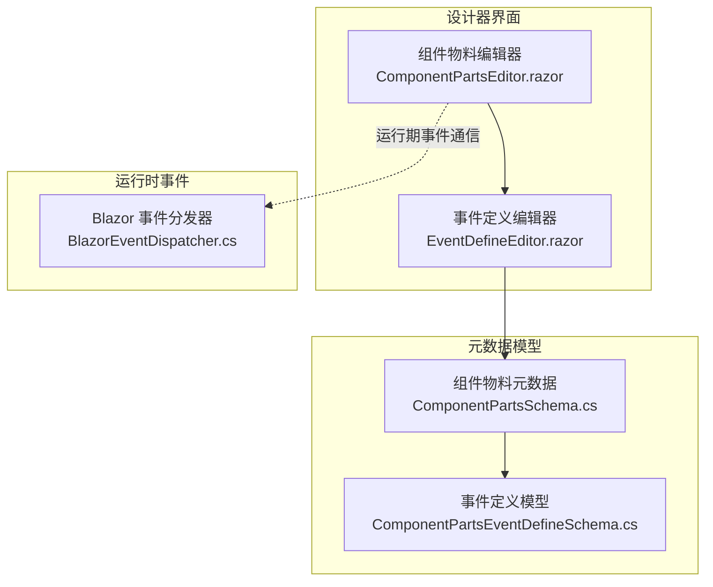
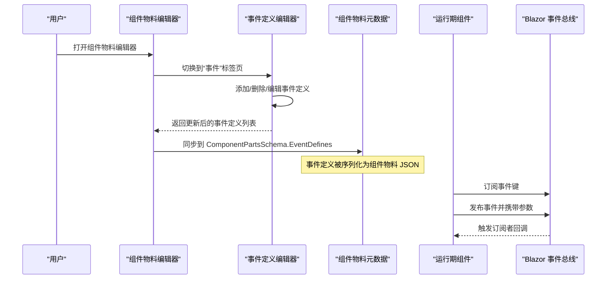
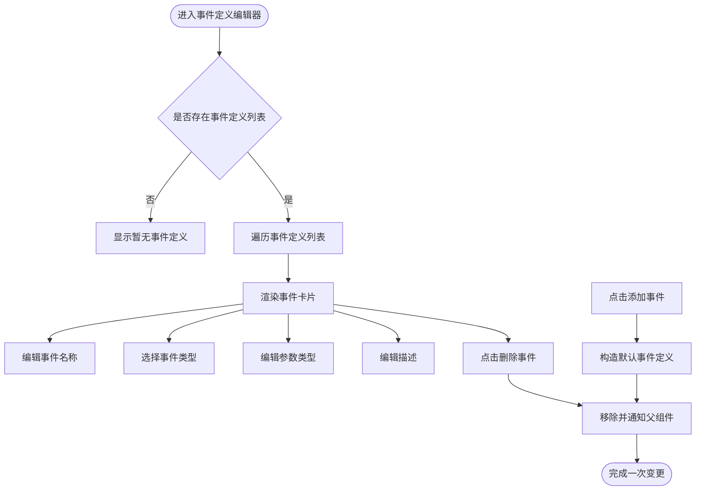
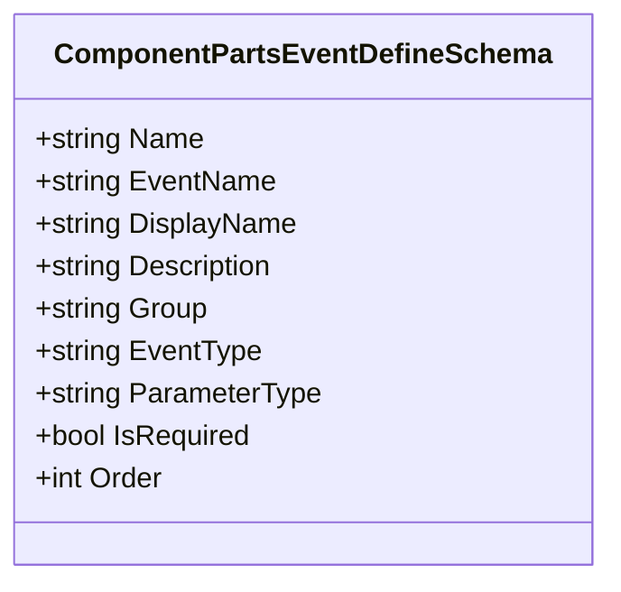
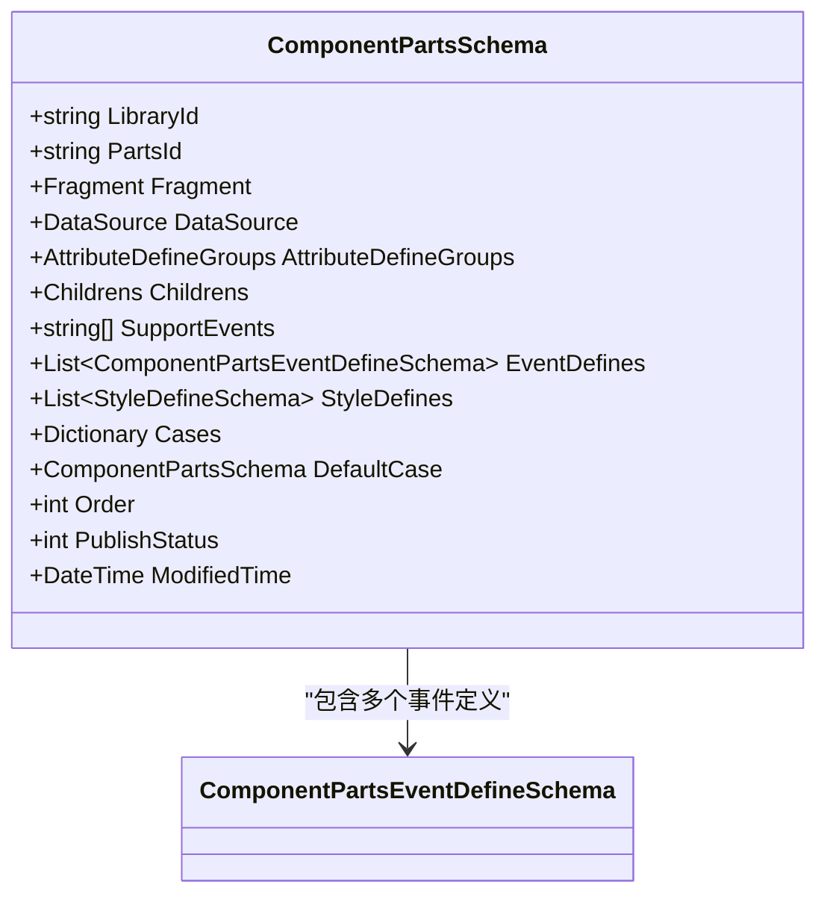
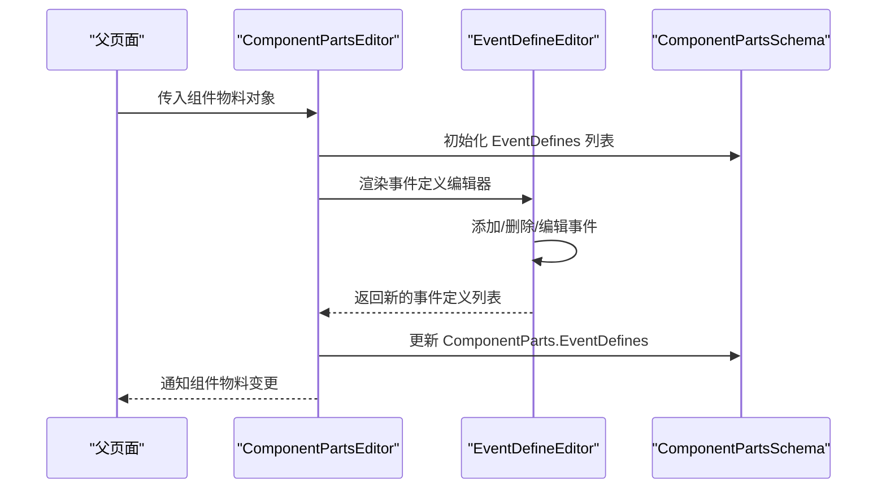
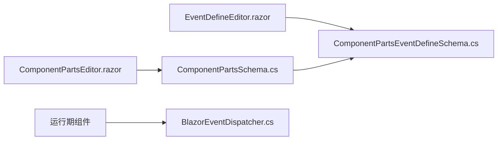
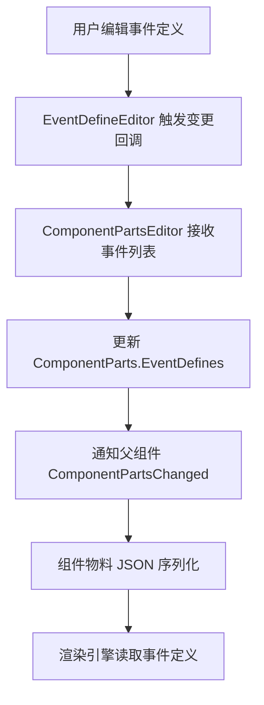
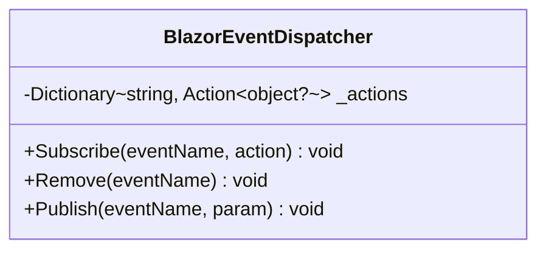
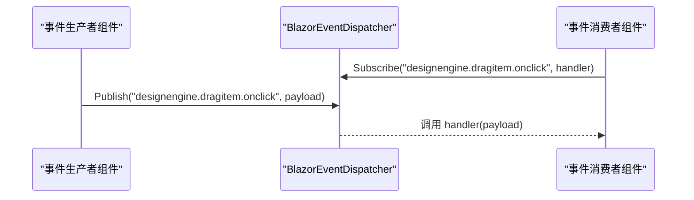

# 事件编辑器

<cite>
**本文引用的文件**   
- [EventDefineEditor.razor](file://src/LowCode/DesignEngine/H.LowCode.PartsDesignEngine/Pages/ComponentParts/Components/EventDefineEditor.razor)
- [ComponentPartsEventDefineSchema.cs](file://src/LowCode/Common/H.LowCode.MetaSchema.DesignEngine/PropertySchemas/ComponentPartsEventDefineSchema.cs)
- [ComponentPartsSchema.cs](file://src/LowCode/Common/H.LowCode.MetaSchema.DesignEngine/ComponentPartsSchema.cs)
- [ComponentPartsEditor.razor](file://src/LowCode/DesignEngine/H.LowCode.PartsDesignEngine/Pages/ComponentParts/Components/ComponentPartsEditor.razor)
- [BlazorEventDispatcher.cs](file://src/Utils/H.Util.Blazor/BlazorEventDispatcher.cs)
</cite>

## 目录
1. [简介](#简介)
2. [项目结构定位](#项目结构定位)
3. [核心组件概览](#核心组件概览)
4. [架构总览](#架构总览)
5. [详细组件分析](#详细组件分析)
6. [依赖关系分析](#依赖关系分析)
7. [事件定义与绑定机制](#事件定义与绑定机制)
8. [事件系统与 Blazor 集成方式](#事件系统与-blazor-集成方式)
9. [开发指南](#开发指南)
10. [性能考虑](#性能考虑)
11. [故障排查](#故障排查)
12. [结论](#结论)

## 简介
本技术文档聚焦 H.AppLab 设计引擎中的“事件编辑器”能力，围绕以下目标展开：
- 解释事件声明式定义的数据模型与编辑器交互流程。
- 说明事件定义如何从设计器进入组件物料元数据。
- 分析当前实现中与 Blazor 事件系统的集成点，包括跨组件事件通信的通用分发机制。
- 提供自定义事件、复杂处理逻辑和调试事件的实践建议。
- 给出设计规范、性能优化与常见问题解决方案。

需要特别说明的是：在已分析的实现中，“FragmentEventEditor”这一具体类名并未直接出现；但事件编辑能力由 `EventDefineEditor` 提供，并由更上层的组件编辑器组合使用。因此本文以实际代码为依据，重点解析 `EventDefineEditor` 及其相关数据模型与调用方。

## 项目结构定位
事件编辑器位于低代码设计引擎的前端部分，主要涉及两个层次：
- 设计器 UI 层：负责可视化创建、编辑、删除事件定义。
- 元数据层：负责将事件定义持久化为组件物料的结构化数据。

**图表来源**
- [ComponentPartsEditor.razor:1-120](file://src/LowCode/DesignEngine/H.LowCode.PartsDesignEngine/Pages/ComponentParts/Components/ComponentPartsEditor.razor#L1-L120)
- [EventDefineEditor.razor:1-92](file://src/LowCode/DesignEngine/H.LowCode.PartsDesignEngine/Pages/ComponentParts/Components/EventDefineEditor.razor#L1-L92)
- [ComponentPartsSchema.cs:1-80](file://src/LowCode/Common/H.LowCode.MetaSchema.DesignEngine/ComponentPartsSchema.cs#L1-L80)
- [ComponentPartsEventDefineSchema.cs:1-60](file://src/LowCode/Common/H.LowCode.MetaSchema.DesignEngine/PropertySchemas/ComponentPartsEventDefineSchema.cs#L1-L60)
- [BlazorEventDispatcher.cs:1-47](file://src/Utils/H.Util.Blazor/BlazorEventDispatcher.cs#L1-L47)

**章节来源**
- [ComponentPartsEditor.razor:1-120](file://src/LowCode/DesignEngine/H.LowCode.PartsDesignEngine/Pages/ComponentParts/Components/ComponentPartsEditor.razor#L1-L120)
- [EventDefineEditor.razor:1-92](file://src/LowCode/DesignEngine/H.LowCode.PartsDesignEngine/Pages/ComponentParts/Components/EventDefineEditor.razor#L1-L92)
- [ComponentPartsSchema.cs:1-80](file://src/LowCode/Common/H.LowCode.MetaSchema.DesignEngine/ComponentPartsSchema.cs#L1-L80)
- [ComponentPartsEventDefineSchema.cs:1-60](file://src/LowCode/Common/H.LowCode.MetaSchema.DesignEngine/PropertySchemas/ComponentPartsEventDefineSchema.cs#L1-L60)
- [BlazorEventDispatcher.cs:1-47](file://src/Utils/H.Util.Blazor/BlazorEventDispatcher.cs#L1-L47)

## 核心组件概览
| 组件 | 职责 | 关键输入 | 关键输出 |
|---|---|---|---|
| `ComponentPartsEditor` | 组件物料综合编辑器，包含基本信息、属性、事件、样式、数据源等标签页 | 组件物料对象、保存回调 | 变更后的组件物料对象 |
| `EventDefineEditor` | 可视化维护事件定义列表，支持添加、删除、双向绑定 | 事件定义列表、变更回调 | 更新后的事件定义列表 |
| `ComponentPartsEventDefineSchema` | 单个事件定义的元数据模型 | JSON 序列化字段 | 事件名称、显示名、分组、类型、参数类型、是否必需、排序等 |
| `ComponentPartsSchema` | 组件物料主模型，聚合事件定义、属性定义、样式定义、子组件等 | 组件物料配置 | 完整的组件物料元数据 |
| `BlazorEventDispatcher` | 全局静态事件总线，用于跨组件发布/订阅事件 | 事件键、参数 | 触发订阅者回调 |

**章节来源**
- [ComponentPartsEditor.razor:201-312](file://src/LowCode/DesignEngine/H.LowCode.PartsDesignEngine/Pages/ComponentParts/Components/ComponentPartsEditor.razor#L201-L312)
- [EventDefineEditor.razor:1-92](file://src/LowCode/DesignEngine/H.LowCode.PartsDesignEngine/Pages/ComponentParts/Components/EventDefineEditor.razor#L1-L92)
- [ComponentPartsEventDefineSchema.cs:1-60](file://src/LowCode/Common/H.LowCode.MetaSchema.DesignEngine/PropertySchemas/ComponentPartsEventDefineSchema.cs#L1-L60)
- [ComponentPartsSchema.cs:1-80](file://src/LowCode/Common/H.LowCode.MetaSchema.DesignEngine/ComponentPartsSchema.cs#L1-L80)
- [BlazorEventDispatcher.cs:1-47](file://src/Utils/H.Util.Blazor/BlazorEventDispatcher.cs#L1-L47)

## 架构总览
事件编辑器的工作流可以分为“设计期”和“运行期”两条主线：
- 设计期：用户在事件标签页中添加或修改事件定义，这些定义写入组件物料元数据。
- 运行期：渲染引擎根据组件物料生成真实组件；若需要跨组件事件通信，可通过 `BlazorEventDispatcher` 进行发布订阅。

**图表来源**
- [ComponentPartsEditor.razor:1-120](file://src/LowCode/DesignEngine/H.LowCode.PartsDesignEngine/Pages/ComponentParts/Components/ComponentPartsEditor.razor#L1-L120)
- [EventDefineEditor.razor:1-92](file://src/LowCode/DesignEngine/H.LowCode.PartsDesignEngine/Pages/ComponentParts/Components/EventDefineEditor.razor#L1-L92)
- [ComponentPartsSchema.cs:43-52](file://src/LowCode/Common/H.LowCode.MetaSchema.DesignEngine/ComponentPartsSchema.cs#L43-L52)
- [BlazorEventDispatcher.cs:1-47](file://src/Utils/H.Util.Blazor/BlazorEventDispatcher.cs#L1-L47)

## 详细组件分析

### 事件定义编辑器 EventDefineEditor
`EventDefineEditor` 是一个无状态表单组件，主要负责：
- 展示事件定义列表。
- 为每个事件提供名称、类型、参数类型、描述等字段的编辑。
- 支持添加新事件和删除已有事件。
- 通过 `EventDefinesChanged` 向父组件上报变更。

其数据绑定采用 Blazor 的双向绑定机制，内部维护一个索引循环来渲染多个事件卡片。

**图表来源**
- [EventDefineEditor.razor:1-92](file://src/LowCode/DesignEngine/H.LowCode.PartsDesignEngine/Pages/ComponentParts/Components/EventDefineEditor.razor#L1-L92)

该组件的关键交互行为包括：
- 添加事件时，若列表为空则初始化列表，再追加一个默认事件。
- 删除事件时，先校验索引范围，再移除元素并通知父组件。
- 所有变更都会调用 `EventDefinesChanged`，以便上层组件重新绑定。

**章节来源**
- [EventDefineEditor.razor:1-92](file://src/LowCode/DesignEngine/H.LowCode.PartsDesignEngine/Pages/ComponentParts/Components/EventDefineEditor.razor#L1-L92)

### 事件定义模型 ComponentPartsEventDefineSchema
`ComponentPartsEventDefineSchema` 是事件定义的轻量级数据结构，字段含义如下：
- `name`：事件名称。
- `en`：英文事件名。
- `disn`：显示名称。
- `desc`：事件描述。
- `group`：事件分组。
- `et`：事件类型，例如点击、值变更、焦点、提交、自定义。
- `pt`：参数类型，用于描述事件参数的类型信息。
- `required`：是否必需。
- `order`：排序。

该模型通过 JSON 序列化注解与外部配置或持久化格式对接，便于在设计器和渲染引擎之间传递。

**图表来源**
- [ComponentPartsEventDefineSchema.cs:1-60](file://src/LowCode/Common/H.LowCode.MetaSchema.DesignEngine/PropertySchemas/ComponentPartsEventDefineSchema.cs#L1-L60)

**章节来源**
- [ComponentPartsEventDefineSchema.cs:1-60](file://src/LowCode/Common/H.LowCode.MetaSchema.DesignEngine/PropertySchemas/ComponentPartsEventDefineSchema.cs#L1-L60)

### 组件物料元数据 ComponentPartsSchema
`ComponentPartsSchema` 是组件物料的核心模型，它聚合了：
- 组件 ID、片段、数据源。
- 属性定义分组。
- 子组件。
- 支持的事件集合 `SupportEvents`。
- 事件定义集合 `EventDefines`。
- 样式定义集合 `StyleDefines`。
- 条件分支配置。
- 排序、发布状态、修改时间等元信息。

其中与事件编辑器直接相关的字段是 `SupportEvents` 和 `EventDefines`。前者表示组件支持哪些事件键，后者表示事件的具体定义。

**图表来源**
- [ComponentPartsSchema.cs:1-80](file://src/LowCode/Common/H.LowCode.MetaSchema.DesignEngine/ComponentPartsSchema.cs#L1-L80)
- [ComponentPartsEventDefineSchema.cs:1-60](file://src/LowCode/Common/H.LowCode.MetaSchema.DesignEngine/PropertySchemas/ComponentPartsEventDefineSchema.cs#L1-L60)

**章节来源**
- [ComponentPartsSchema.cs:1-80](file://src/LowCode/Common/H.LowCode.MetaSchema.DesignEngine/ComponentPartsSchema.cs#L1-L80)

### 组件物料编辑器 ComponentPartsEditor
`ComponentPartsEditor` 是更上层的容器组件，它将基本信息、属性、事件、样式、数据源等子编辑器组合在一起。对于事件编辑：
- 当用户切换到“事件”标签页时，渲染 `EventDefineEditor`。
- 将 `ComponentParts.EventDefines` 传入 `EventDefineEditor`。
- 接收 `EventDefinesChanged` 回调，并将结果写回 `ComponentParts.EventDefines`。
- 最终通过 `ComponentPartsChanged` 向上层页面暴露完整组件物料对象。

**图表来源**
- [ComponentPartsEditor.razor:1-120](file://src/LowCode/DesignEngine/H.LowCode.PartsDesignEngine/Pages/ComponentParts/Components/ComponentPartsEditor.razor#L1-L120)
- [ComponentPartsEditor.razor:201-312](file://src/LowCode/DesignEngine/H.LowCode.PartsDesignEngine/Pages/ComponentParts/Components/ComponentPartsEditor.razor#L201-L312)
- [EventDefineEditor.razor:1-92](file://src/LowCode/DesignEngine/H.LowCode.PartsDesignEngine/Pages/ComponentParts/Components/EventDefineEditor.razor#L1-L92)

**章节来源**
- [ComponentPartsEditor.razor:1-120](file://src/LowCode/DesignEngine/H.LowCode.PartsDesignEngine/Pages/ComponentParts/Components/ComponentPartsEditor.razor#L1-L120)
- [ComponentPartsEditor.razor:201-312](file://src/LowCode/DesignEngine/H.LowCode.PartsDesignEngine/Pages/ComponentParts/Components/ComponentPartsEditor.razor#L201-L312)

## 依赖关系分析
事件编辑器的依赖关系可概括为：
- UI 层依赖元数据模型：`EventDefineEditor` 依赖 `ComponentPartsEventDefineSchema`，`ComponentPartsEditor` 依赖 `ComponentPartsSchema`。
- 运行期事件通信依赖公共工具：`BlazorEventDispatcher` 提供静态事件总线能力，供运行期组件使用。

**图表来源**
- [EventDefineEditor.razor:1-92](file://src/LowCode/DesignEngine/H.LowCode.PartsDesignEngine/Pages/ComponentParts/Components/EventDefineEditor.razor#L1-L92)
- [ComponentPartsEditor.razor:1-120](file://src/LowCode/DesignEngine/H.LowCode.PartsDesignEngine/Pages/ComponentParts/Components/ComponentPartsEditor.razor#L1-L120)
- [ComponentPartsSchema.cs:43-52](file://src/LowCode/Common/H.LowCode.MetaSchema.DesignEngine/ComponentPartsSchema.cs#L43-L52)
- [ComponentPartsEventDefineSchema.cs:1-60](file://src/LowCode/Common/H.LowCode.MetaSchema.DesignEngine/PropertySchemas/ComponentPartsEventDefineSchema.cs#L1-L60)
- [BlazorEventDispatcher.cs:1-47](file://src/Utils/H.Util.Blazor/BlazorEventDispatcher.cs#L1-L47)

**章节来源**
- [EventDefineEditor.razor:1-92](file://src/LowCode/DesignEngine/H.LowCode.PartsDesignEngine/Pages/ComponentParts/Components/EventDefineEditor.razor#L1-L92)
- [ComponentPartsEditor.razor:1-120](file://src/LowCode/DesignEngine/H.LowCode.PartsDesignEngine/Pages/ComponentParts/Components/ComponentPartsEditor.razor#L1-L120)
- [ComponentPartsSchema.cs:43-52](file://src/LowCode/Common/H.LowCode.MetaSchema.DesignEngine/ComponentPartsSchema.cs#L43-L52)
- [ComponentPartsEventDefineSchema.cs:1-60](file://src/LowCode/Common/H.LowCode.MetaSchema.DesignEngine/PropertySchemas/ComponentPartsEventDefineSchema.cs#L1-L60)
- [BlazorEventDispatcher.cs:1-47](file://src/Utils/H.Util.Blazor/BlazorEventDispatcher.cs#L1-L47)

## 事件定义与绑定机制
事件定义在系统中的流转路径如下：
1. 用户在 `EventDefineEditor` 中编辑事件名称、类型、参数类型和描述。
2. 编辑器通过 `EventDefinesChanged` 将新的列表返回给 `ComponentPartsEditor`。
3. `ComponentPartsEditor` 将新列表赋值给 `ComponentParts.EventDefines`。
4. 上层页面或服务接收 `ComponentPartsChanged`，从而获得完整的组件物料对象。
5. 组件物料最终被序列化为 JSON，并在渲染阶段驱动组件实例。

**图表来源**
- [EventDefineEditor.razor:1-92](file://src/LowCode/DesignEngine/H.LowCode.PartsDesignEngine/Pages/ComponentParts/Components/EventDefineEditor.razor#L1-L92)
- [ComponentPartsEditor.razor:201-312](file://src/LowCode/DesignEngine/H.LowCode.PartsDesignEngine/Pages/ComponentParts/Components/ComponentPartsEditor.razor#L201-L312)
- [ComponentPartsSchema.cs:43-52](file://src/LowCode/Common/H.LowCode.MetaSchema.DesignEngine/ComponentPartsSchema.cs#L43-L52)

**章节来源**
- [EventDefineEditor.razor:1-92](file://src/LowCode/DesignEngine/H.LowCode.PartsDesignEngine/Pages/ComponentParts/Components/EventDefineEditor.razor#L1-L92)
- [ComponentPartsEditor.razor:201-312](file://src/LowCode/DesignEngine/H.LowCode.PartsDesignEngine/Pages/ComponentParts/Components/ComponentPartsEditor.razor#L201-L312)
- [ComponentPartsSchema.cs:43-52](file://src/LowCode/Common/H.LowCode.MetaSchema.DesignEngine/ComponentPartsSchema.cs#L43-L52)

## 事件系统与 Blazor 集成方式
当前仓库中提供了一个通用的 Blazor 事件分发器 `BlazorEventDispatcher`，用于跨组件事件通信。它的核心特点如下：
- 使用静态字典维护事件键到委托的映射。
- 提供订阅、取消订阅、发布三个方法。
- 发布时如果事件键不存在，会抛出异常。
- 官方注释建议使用小写命名空间风格，例如 `{组件库名称}.{组件名称}.{事件名称}`。

**图表来源**
- [BlazorEventDispatcher.cs:1-47](file://src/Utils/H.Util.Blazor/BlazorEventDispatcher.cs#L1-L47)

需要注意的是，`BlazorEventDispatcher` 与 `EventDefineEditor` 之间没有直接的代码耦合。它更像是一个运行期基础设施：事件定义由设计器生成，而运行期组件可以根据业务需求选择是否使用该事件总线进行跨组件通信。

**图表来源**
- [BlazorEventDispatcher.cs:1-47](file://src/Utils/H.Util.Blazor/BlazorEventDispatcher.cs#L1-L47)

**章节来源**
- [BlazorEventDispatcher.cs:1-47](file://src/Utils/H.Util.Blazor/BlazorEventDispatcher.cs#L1-L47)

## 开发指南

### 如何定义自定义事件
推荐步骤：
1. 在组件物料元数据中确认或扩展 `SupportEvents`，列出组件对外暴露的事件键。
2. 在 `EventDefines` 中添加对应的事件定义，填写名称、显示名称、分组、类型、参数类型、是否必需、排序等信息。
3. 在组件渲染逻辑中，根据事件类型和参数类型绑定 Blazor 原生事件或自定义事件。
4. 如果需要跨组件通信，可在运行期使用 `BlazorEventDispatcher.Publish` 发布事件，并在其他组件中 `Subscribe`。

要点：
- 事件名称应保持稳定，避免频繁改名导致历史配置失效。
- 参数类型应尽量保持简单，例如字符串、数字、布尔值或标准 DTO 名称。
- 对于复杂参数，建议在运行时做类型转换或反序列化。

**章节来源**
- [ComponentPartsSchema.cs:43-52](file://src/LowCode/Common/H.LowCode.MetaSchema.DesignEngine/ComponentPartsSchema.cs#L43-L52)
- [ComponentPartsEventDefineSchema.cs:1-60](file://src/LowCode/Common/H.LowCode.MetaSchema.DesignEngine/PropertySchemas/ComponentPartsEventDefineSchema.cs#L1-L60)
- [BlazorEventDispatcher.cs:1-47](file://src/Utils/H.Util.Blazor/BlazorEventDispatcher.cs#L1-L47)

### 如何实现复杂的事件处理逻辑
建议分层处理：
- UI 层只负责触发事件，不承载复杂业务逻辑。
- 业务层封装事件处理器，负责参数校验、状态更新、副作用处理。
- 跨组件通信优先使用明确的事件键和稳定的参数结构。
- 对异步操作使用 Blazor 的异步回调机制，避免阻塞渲染线程。

参考实现模式：
- 使用 `BlazorEventDispatcher.Subscribe` 注册处理器。
- 在组件销毁或不需要监听时调用 `Remove`，避免内存泄漏。
- 对批量事件进行节流或合并，减少重复计算。

**章节来源**
- [BlazorEventDispatcher.cs:1-47](file://src/Utils/H.Util.Blazor/BlazorEventDispatcher.cs#L1-L47)

### 如何调试事件流
建议：
- 在订阅处增加日志输出，记录事件键、参数和时间戳。
- 在发布前校验事件键是否已存在，避免未注册事件导致的异常。
- 在设计器中检查 `EventDefines` 是否正确生成，确保事件定义与运行时一致。
- 对复杂事件链绘制时序图，帮助理解调用顺序。

常见调试手段：
- 打印 `BlazorEventDispatcher` 内部事件键集合（需扩展工具方法）。
- 使用浏览器开发者工具观察组件重渲染次数。
- 将事件参数序列化为 JSON 文本，方便比对前后变化。

**章节来源**
- [BlazorEventDispatcher.cs:1-47](file://src/Utils/H.Util.Blazor/BlazorEventDispatcher.cs#L1-L47)

## 性能考虑
- 事件定义列表较大时，应避免频繁重建整个列表，尽量就地增删改。
- `EventDefineEditor` 中使用索引循环渲染，适合中等规模事件数量；若事件数量很大，应考虑分页或虚拟滚动。
- 使用 `BlazorEventDispatcher` 时，避免在同一事件键上注册过多订阅者，必要时按业务域拆分事件键。
- 事件参数过大时，避免传递完整对象，优先传递必要字段或标识符。
- 对高频事件进行防抖或节流，降低渲染压力。

[本节为通用性能建议，不直接分析具体代码文件]

## 故障排查

### 事件定义未生效
可能原因：
- `EventDefines` 未正确初始化或未被父组件接收。
- 事件键未在 `SupportEvents` 中声明。
- 运行时组件未绑定对应事件处理器。

排查步骤：
1. 检查 `ComponentPartsEditor` 是否正确接收 `EventDefinesChanged`。
2. 检查 `ComponentParts.EventDefines` 是否为空。
3. 检查渲染组件是否根据事件定义绑定了 Blazor 事件。

**章节来源**
- [ComponentPartsEditor.razor:201-312](file://src/LowCode/DesignEngine/H.LowCode.PartsDesignEngine/Pages/ComponentParts/Components/ComponentPartsEditor.razor#L201-L312)
- [EventDefineEditor.razor:1-92](file://src/LowCode/DesignEngine/H.LowCode.PartsDesignEngine/Pages/ComponentParts/Components/EventDefineEditor.razor#L1-L92)
- [ComponentPartsSchema.cs:43-52](file://src/LowCode/Common/H.LowCode.MetaSchema.DesignEngine/ComponentPartsSchema.cs#L43-L52)

### 跨组件事件未触发
可能原因：
- 未调用 `Subscribe` 或未传入正确事件键。
- 调用了 `Publish` 但未订阅相应事件键。
- 组件生命周期管理不当，订阅后未及时清理。

排查步骤：
1. 确认事件键命名规范一致。
2. 检查订阅是否在组件初始化阶段执行。
3. 检查发布前是否发生异常。
4. 检查组件销毁时是否移除订阅。

**章节来源**
- [BlazorEventDispatcher.cs:1-47](file://src/Utils/H.Util.Blazor/BlazorEventDispatcher.cs#L1-L47)

### 事件参数类型不匹配
可能原因：
- 事件定义中 `ParameterType` 与实际参数不一致。
- 运行时未做类型转换。
- 事件定义变更后未同步到运行时代码。

解决建议：
- 统一事件参数结构，使用稳定 DTO。
- 在处理器入口增加类型校验。
- 对 JSON 参数进行反序列化并设置默认值。

**章节来源**
- [ComponentPartsEventDefineSchema.cs:1-60](file://src/LowCode/Common/H.LowCode.MetaSchema.DesignEngine/PropertySchemas/ComponentPartsEventDefineSchema.cs#L1-L60)

## 结论
H.AppLab 设计引擎的事件编辑器以 `EventDefineEditor` 为核心 UI 组件，以 `ComponentPartsEventDefineSchema` 和 `ComponentPartsSchema` 为核心数据模型，形成“设计期事件定义 → 组件物料元数据 → 运行期事件处理”的完整链路。虽然当前实现中没有直接出现 `FragmentEventEditor` 类，但事件编辑能力已经通过 `EventDefineEditor` 与上层组件编辑器紧密协作。

对于跨组件事件通信，系统提供了 `BlazorEventDispatcher` 作为通用基础设施。开发者可以基于该分发器构建稳定、可扩展的事件系统，并结合事件定义模型实现可视化配置与运行期行为的统一。

在实际开发中，建议遵循以下原则：
- 事件命名清晰、稳定、可追溯。
- 事件参数简洁、类型明确。
- 事件处理器职责单一、易于测试。
- 设计器与运行期保持一致的事件契约。
- 合理使用事件总线，避免过度耦合。

[本节为总结性内容，不直接分析具体代码文件]