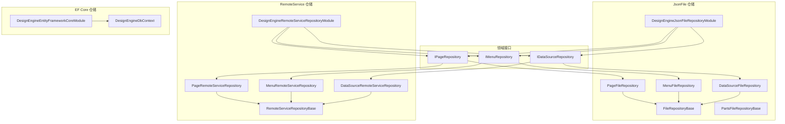
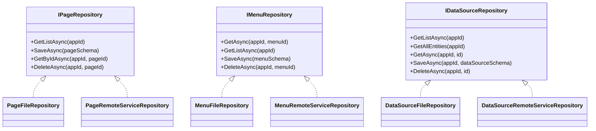
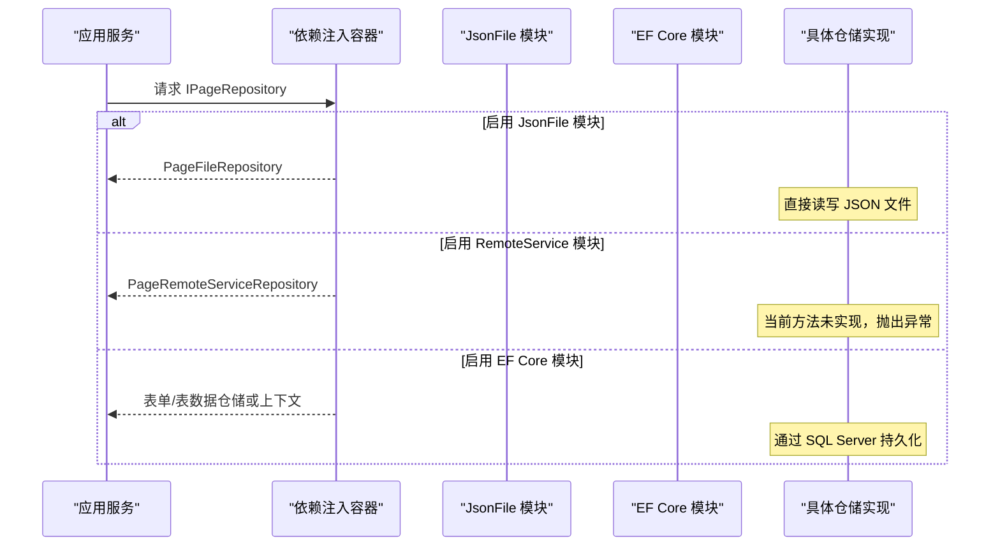
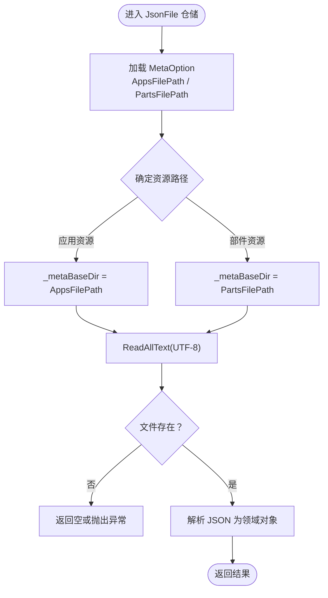
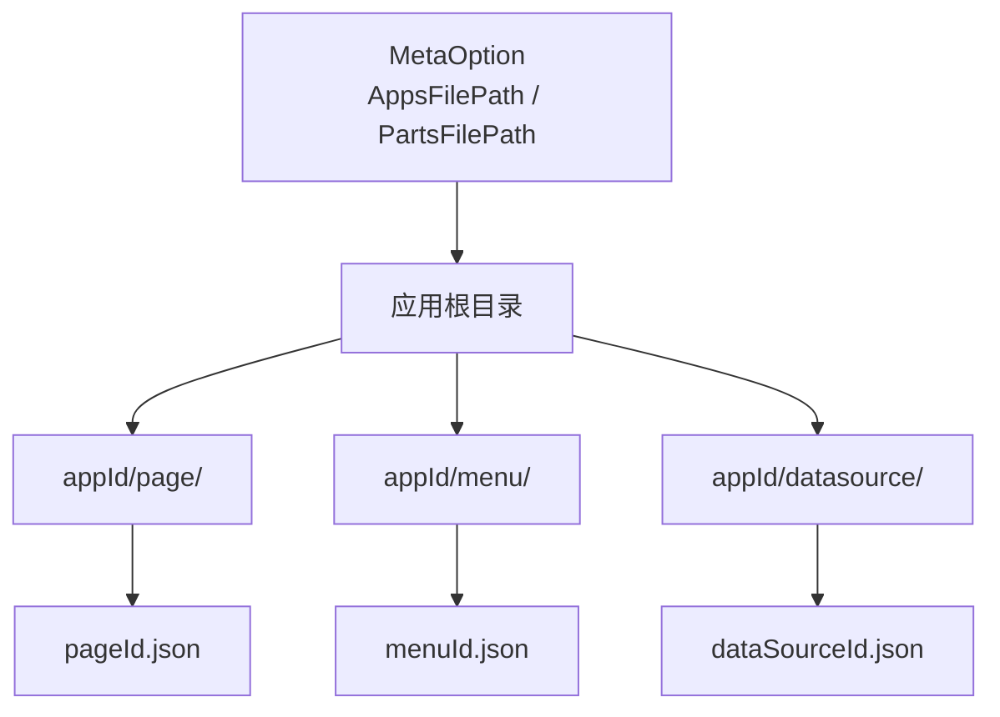
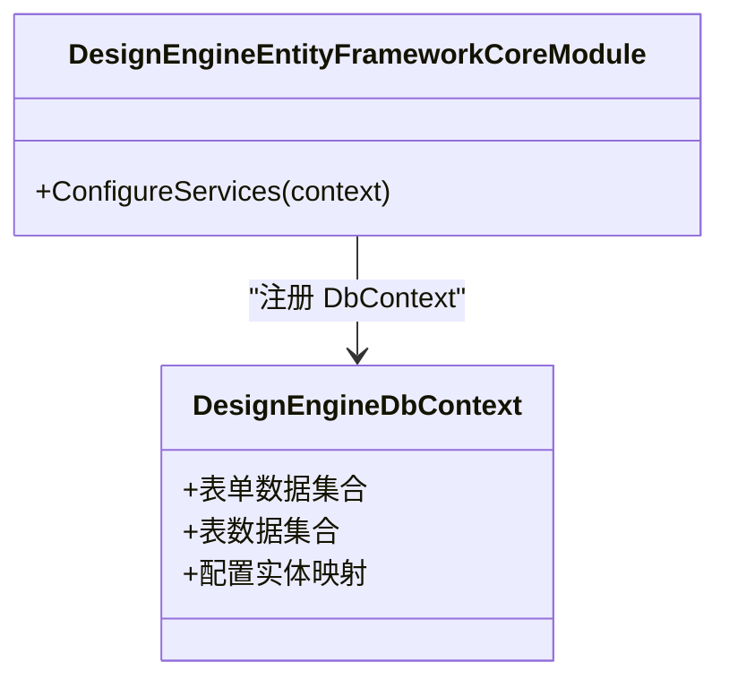
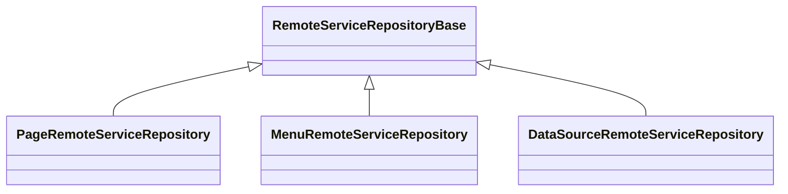
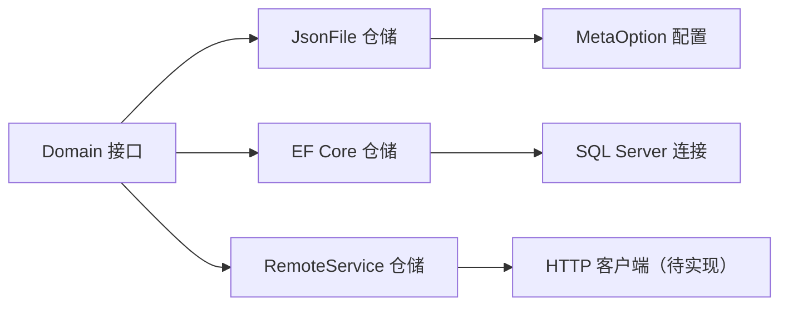
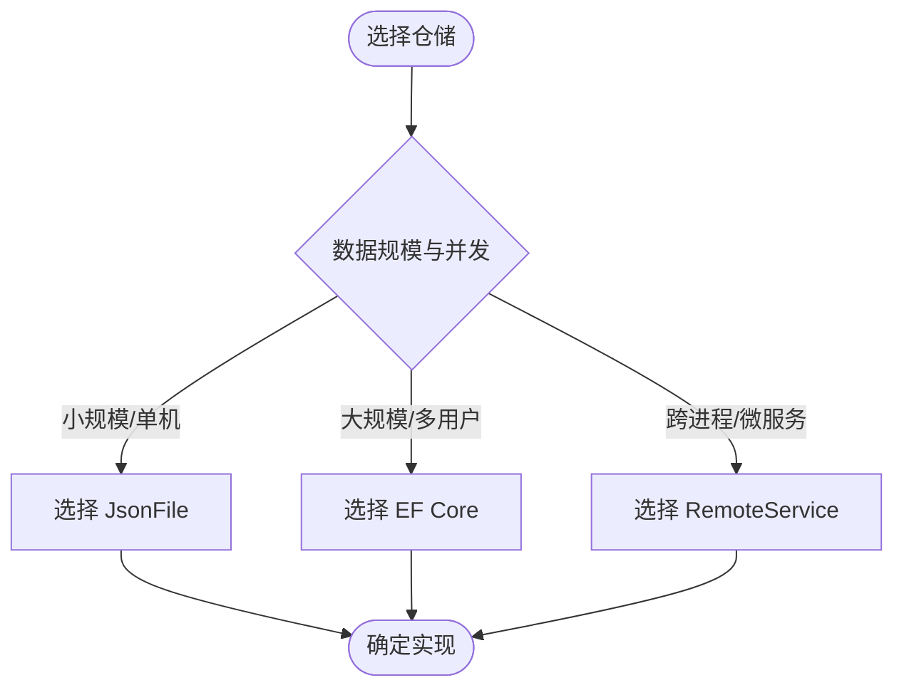
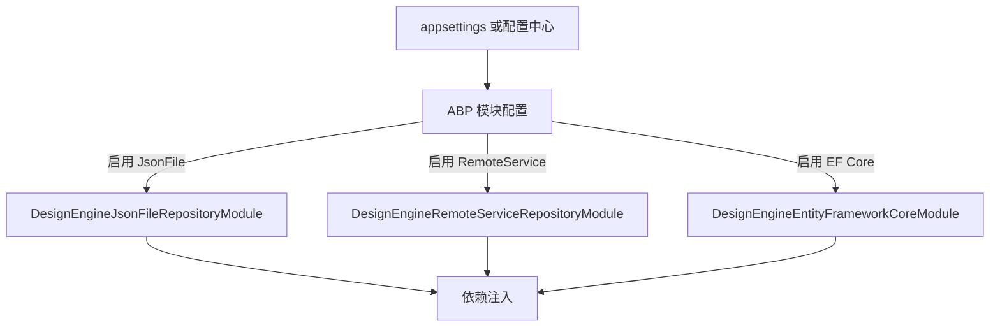

# 仓储实现

<cite>
**本文引用的文件**   
- [IPageRepository.cs](file://src/LowCode/DesignEngine/H.LowCode.DesignEngine.Domain/MetaRepositories/IPageRepository.cs)
- [IMenuRepository.cs](file://src/LowCode/DesignEngine/H.LowCode.DesignEngine.Domain/MetaRepositories/IMenuRepository.cs)
- [IDataSourceRepository.cs](file://src/LowCode/DesignEngine/H.LowCode.DesignEngine.Domain/MetaRepositories/IDataSourceRepository.cs)
- [FileRepositoryBase.cs](file://src/LowCode/DesignEngine/H.LowCode.DesignEngine.Repository.JsonFile/Base/FileRepositoryBase.cs)
- [PartsFileRepositoryBase.cs](file://src/LowCode/DesignEngine/H.LowCode.DesignEngine.Repository.JsonFile/Base/PartsFileRepositoryBase.cs)
- [DesignEngineJsonFileRepositoryModule.cs](file://src/LowCode/DesignEngine/H.LowCode.DesignEngine.Repository.JsonFile/DesignEngineJsonFileRepositoryModule.cs)
- [PageFileRepository.cs](file://src/LowCode/DesignEngine/H.LowCode.DesignEngine.Repository.JsonFile\Repositories/PageFileRepository.cs)
- [MenuFileRepository.cs](file://src/LowCode/DesignEngine/H.LowCode.DesignEngine.Repository.JsonFile\Repositories/MenuFileRepository.cs)
- [DataSourceFileRepository.cs](file://src/LowCode/DesignEngine/H.LowCode.DesignEngine.Repository.JsonFile/DataRepositories/DataSourceFileRepository.cs)
- [RemoteServiceRepositoryBase.cs](file://src/LowCode/DesignEngine/H.LowCode.DesignEngine.Repository.RemoteService/Base/RemoteServiceRepositoryBase.cs)
- [DesignEngineRemoteServiceRepositoryModule.cs](file://src/LowCode/DesignEngine/H.LowCode.DesignEngine.Repository.RemoteService/DesignEngineRemoteServiceRepositoryModule.cs)
- [PageRemoteServiceRepository.cs](file://src/LowCode/DesignEngine/H.LowCode.DesignEngine.Repository.RemoteService/Repositories/PageRemoteServiceRepository.cs)
- [MenuRemoteServiceRepository.cs](file://src/LowCode/DesignEngine/H.LowCode.DesignEngine.Repository.RemoteService/Repositories/MenuRemoteServiceRepository.cs)
- [DataSourceRemoteServiceRepository.cs](file://src/LowCode/DesignEngine/H.LowCode.DesignEngine.Repository.RemoteService/Repositories/DataSourceRemoteServiceRepository.cs)
- [DesignEngineEntityFrameworkCoreModule.cs](file://src/LowCode/DesignEngine/H.LowCode.DesignEngine.EntityFrameworkCore/DesignEngineEntityFrameworkCoreModule.cs)
- [DesignEngineDbContext.cs](file://src/LowCode/DesignEngine/H.LowCode.DesignEngine.EntityFrameworkCore/EntityFrameworkCore/DesignEngineDbContext.cs)
</cite>

## 目录
1. [引言](#引言)
2. [项目结构](#项目结构)
3. [核心组件](#核心组件)
4. [架构总览](#架构总览)
5. [详细组件分析](#详细组件分析)
6. [依赖关系分析](#依赖关系分析)
7. [性能与选型建议](#性能与选型建议)
8. [配置与切换仓储](#配置与切换仓储)
9. [扩展新仓储的步骤](#扩展新仓储的步骤)
10. [从 JsonFile 迁移到 EF Core 的注意事项](#从-jsonfile-迁移到-ef-core-的注意事项)
11. [故障排查指南](#故障排查指南)
12. [结论](#结论)

## 引言
本文面向设计引擎的仓储层，围绕三类 IPageRepository、IMenuRepository、IDataSourceRepository 的实现进行系统化说明：
- JsonFile 仓储：基于文件系统 JSON 序列化，适合单机开发、快速原型和轻量部署。
- EntityFrameworkCore 仓储：基于 SQL Server 数据库，适合生产环境、多用户并发、事务与审计追踪。
- RemoteService 仓储：通过 HTTP 调用远程设计服务，适合微服务架构与跨进程共享设计资产。

本文同时给出文件目录约定、并发写入策略、EF Core 上下文配置、远程代理与错误处理模式、配置切换方式、扩展新仓储步骤、性能对比与迁移注意事项。

## 项目结构
设计引擎仓储按“领域接口 + 多种实现”组织：
- 领域接口定义在 Domain 层的 MetaRepositories。
- JsonFile 实现在 Repository.JsonFile 模块中，提供基于文件的持久化。
- RemoteService 实现在 Repository.RemoteService 模块中，为未来 HTTP 客户端预留骨架。
- EF Core 实现在 EntityFrameworkCore 模块中，提供表单数据与表数据的持久化能力，并注册 DbContext。

图表来源
- [DesignEngineJsonFileRepositoryModule.cs:1-30](file://src/LowCode/DesignEngine/H.LowCode.DesignEngine.Repository.JsonFile/DesignEngineJsonFileRepositoryModule.cs#L1-L30)
- [DesignEngineRemoteServiceRepositoryModule.cs:1-18](file://src/LowCode/DesignEngine/H.LowCode.DesignEngine.Repository.RemoteService/DesignEngineRemoteServiceRepositoryModule.cs#L1-L18)
- [DesignEngineEntityFrameworkCoreModule.cs:1-28](file://src/LowCode/DesignEngine/H.LowCode.DesignEngine.EntityFrameworkCore/DesignEngineEntityFrameworkCoreModule.cs#L1-L28)
- [PageFileRepository.cs:10-17](file://src/LowCode/DesignEngine/H.LowCode.DesignEngine.Repository.JsonFile/Repositories/PageFileRepository.cs#L10-L17)
- [MenuFileRepository.cs:1-33](file://src/LowCode/DesignEngine/H.LowCode.DesignEngine.Repository.JsonFile/Repositories/MenuFileRepository.cs#L1-L33)
- [DataSourceFileRepository.cs:1-38](file://src/LowCode/DesignEngine/H.LowCode.DesignEngine.Repository.JsonFile/DataRepositories/DataSourceFileRepository.cs#L1-L38)
- [PageRemoteServiceRepository.cs:9-39](file://src/LowCode/DesignEngine/H.LowCode.DesignEngine.Repository.RemoteService/Repositories/PageRemoteServiceRepository.cs#L9-L39)
- [MenuRemoteServiceRepository.cs:8-33](file://src/LowCode/DesignEngine/H.LowCode.DesignEngine.Repository.RemoteService/Repositories/MenuRemoteServiceRepository.cs#L8-L33)
- [DataSourceRemoteServiceRepository.cs:8-38](file://src/LowCode/DesignEngine/H.LowCode.DesignEngine.Repository.RemoteService/Repositories/DataSourceRemoteServiceRepository.cs#L8-L38)

章节来源
- [DesignEngineJsonFileRepositoryModule.cs:1-30](file://src/LowCode/DesignEngine/H.LowCode.DesignEngine.Repository.JsonFile/DesignEngineJsonFileRepositoryModule.cs#L1-L30)
- [DesignEngineRemoteServiceRepositoryModule.cs:1-18](file://src/LowCode/DesignEngine/H.LowCode.DesignEngine.Repository.RemoteService/DesignEngineRemoteServiceRepositoryModule.cs#L1-L18)
- [DesignEngineEntityFrameworkCoreModule.cs:1-28](file://src/LowCode/DesignEngine/H.LowCode.DesignEngine.EntityFrameworkCore/DesignEngineEntityFrameworkCoreModule.cs#L1-L28)

## 核心组件
本仓储体系以三个领域接口为核心，三种实现分别对应不同运行场景：
- IPageRepository：页面模型的分页列表、保存、按应用与页面标识获取、删除。
- IMenuRepository：菜单模型的按应用与菜单标识获取、批量列表、保存、删除。
- IDataSourceRepository：数据源模型的批量列表、实体枚举、按标识获取、保存、删除。

图表来源
- [IPageRepository.cs:1-15](file://src/LowCode/DesignEngine/H.LowCode.DesignEngine.Domain/MetaRepositories/IPageRepository.cs#L1-L15)
- [IMenuRepository.cs:1-14](file://src/LowCode/DesignEngine/H.LowCode.DesignEngine.Domain/MetaRepositories/IMenuRepository.cs#L1-L14)
- [IDataSourceRepository.cs:1-16](file://src/LowCode/DesignEngine/H.LowCode.DesignEngine.Domain/MetaRepositories/IDataSourceRepository.cs#L1-L16)
- [PageFileRepository.cs:10-17](file://src/LowCode/DesignEngine/H.LowCode.DesignEngine.Repository.JsonFile/Repositories/PageFileRepository.cs#L10-L17)
- [MenuFileRepository.cs:1-33](file://src/LowCode/DesignEngine/H.LowCode.DesignEngine.Repository.JsonFile/Repositories/MenuFileRepository.cs#L1-L33)
- [DataSourceFileRepository.cs:1-38](file://src/LowCode/DesignEngine/H.LowCode.DesignEngine.Repository.JsonFile/DataRepositories/DataSourceFileRepository.cs#L1-L38)
- [PageRemoteServiceRepository.cs:9-39](file://src/LowCode/DesignEngine/H.LowCode.DesignEngine.Repository.RemoteService/Repositories/PageRemoteServiceRepository.cs#L9-L39)
- [MenuRemoteServiceRepository.cs:8-33](file://src/LowCode/DesignEngine/H.LowCode.DesignEngine.Repository.RemoteService/Repositories/MenuRemoteServiceRepository.cs#L8-L33)
- [DataSourceRemoteServiceRepository.cs:8-38](file://src/LowCode/DesignEngine/H.LowCode.DesignEngine.Repository.RemoteService/Repositories/DataSourceRemoteServiceRepository.cs#L8-L38)

章节来源
- [IPageRepository.cs:1-15](file://src/LowCode/DesignEngine/H.LowCode.DesignEngine.Domain/MetaRepositories/IPageRepository.cs#L1-L15)
- [IMenuRepository.cs:1-14](file://src/LowCode/DesignEngine/H.LowCode.DesignEngine.Domain/MetaRepositories/IMenuRepository.cs#L1-L14)
- [IDataSourceRepository.cs:1-16](file://src/LowCode/DesignEngine/H.LowCode.DesignEngine.Domain/MetaRepositories/IDataSourceRepository.cs#L1-L16)

## 架构总览
仓储层采用 ABP 模块化装配，通过模块将领域接口绑定到具体实现：
- JsonFile 模块将 IPageRepository、IMenuRepository、IDataSourceRepository 等绑定到文件仓库实现，并注入 MetaOption 配置。
- RemoteService 模块将相同接口绑定到远程服务仓库实现，作为 HTTP 客户端占位。
- EF Core 模块注册表单与表数据仓储以及 DbContext，连接字符串优先使用 DesignEngineDb，回退 Default。

图表来源
- [DesignEngineJsonFileRepositoryModule.cs:1-30](file://src/LowCode/DesignEngine/H.LowCode.DesignEngine.Repository.JsonFile/DesignEngineJsonFileRepositoryModule.cs#L1-L30)
- [DesignEngineRemoteServiceRepositoryModule.cs:1-18](file://src/LowCode/DesignEngine/H.LowCode.DesignEngine.Repository.RemoteService/DesignEngineRemoteServiceRepositoryModule.cs#L1-L18)
- [DesignEngineEntityFrameworkCoreModule.cs:1-28](file://src/LowCode/DesignEngine/H.LowCode.DesignEngine.EntityFrameworkCore/DesignEngineEntityFrameworkCoreModule.cs#L1-L28)

## 详细组件分析

### JsonFile 仓储
JsonFile 仓储通过 FileRepositoryBase 与 PartsFileRepositoryBase 提供统一的基础能力：
- 从配置读取基础路径：应用元数据根目录用于页面、菜单、数据源；部件元数据根目录用于组件库与模板。
- 提供 ReadAllText 静态方法，按 UTF-8 读取文本，并在文件不存在时返回空或抛出异常（取决于基类）。
- IsChangeTrackingEnabled 字段默认关闭，表明文件仓储不启用复杂变更跟踪。

图表来源
- [FileRepositoryBase.cs:7-26](file://src/LowCode/DesignEngine/H.LowCode.DesignEngine.Repository.JsonFile/Base/FileRepositoryBase.cs#L7-L26)
- [PartsFileRepositoryBase.cs:7-26](file://src/LowCode/DesignEngine/H.LowCode.DesignEngine.Repository.JsonFile/Base/PartsFileRepositoryBase.cs#L7-L26)

#### 文件目录结构与命名约定
- 应用资源根目录由 MetaOption.AppsFilePath 提供。
- 部件资源根目录由 MetaOption.PartsFilePath 提供。
- 页面文件路径包含 appId 与 page 子目录，并使用 .json 扩展名。
- 菜单、数据源等其它资源也遵循类似的 appId 隔离结构，并通过各自仓储构造文件路径。

图表来源
- [PageFileRepository.cs:10-17](file://src/LowCode/DesignEngine/H.LowCode.DesignEngine.Repository.JsonFile/Repositories/PageFileRepository.cs#L10-L17)
- [MenuFileRepository.cs:1-33](file://src/LowCode/DesignEngine/H.LowCode.DesignEngine.Repository.JsonFile/Repositories/MenuFileRepository.cs#L1-L33)
- [DataSourceFileRepository.cs:1-38](file://src/LowCode/DesignEngine/H.LowCode.DesignEngine.Repository.JsonFile/DataRepositories/DataSourceFileRepository.cs#L1-L38)

#### 并发写入策略与文件锁机制
- 当前代码没有显式实现文件锁或并发控制。
- 并发写场景可能产生竞态条件，应引入互斥锁、乐观版本或幂等写入策略。
- 建议在保存前校验版本号或生成唯一快照，避免覆盖。

#### 适用场景
- 单机开发、快速原型、轻量部署。
- 数据量较小、访问并发低、无需复杂查询的场景。

章节来源
- [FileRepositoryBase.cs:7-26](file://src/LowCode/DesignEngine/H.LowCode.DesignEngine.Repository.JsonFile/Base/FileRepositoryBase.cs#L7-L26)
- [PartsFileRepositoryBase.cs:7-26](file://src/LowCode/DesignEngine/H.LowCode.DesignEngine.Repository.JsonFile/Base/PartsFileRepositoryBase.cs#L7-L26)
- [PageFileRepository.cs:10-17](file://src/LowCode/DesignEngine/H.LowCode.DesignEngine.Repository.JsonFile/Repositories/PageFileRepository.cs#L10-L17)
- [MenuFileRepository.cs:1-33](file://src/LowCode/DesignEngine/H.LowCode.DesignEngine.Repository.JsonFile/Repositories/MenuFileRepository.cs#L1-L33)
- [DataSourceFileRepository.cs:1-38](file://src/LowCode/DesignEngine/H.LowCode.DesignEngine.Repository.JsonFile/DataRepositories/DataSourceFileRepository.cs#L1-L38)

### EntityFrameworkCore 仓储
EF Core 仓储主要提供表单数据与表数据的持久化，并通过模块注册 DbContext：
- 连接字符串解析：优先使用 DesignEngineDb，若不存在则回退 Default。
- 使用 UseSqlServer 配置 SQL Server 提供者。
- 注册 EntityTypeManager，便于动态实体类型管理。

图表来源
- [DesignEngineEntityFrameworkCoreModule.cs:1-28](file://src/LowCode/DesignEngine/H.LowCode.DesignEngine.EntityFrameworkCore/DesignEngineEntityFrameworkCoreModule.cs#L1-L28)
- [DesignEngineDbContext.cs:1-200](file://src/LowCode/DesignEngine/H.LowCode.DesignEngine.EntityFrameworkCore/EntityFrameworkCore/DesignEngineDbContext.cs#L1-L200)

#### DbContext 配置与实体映射
- 连接字符串优先级明确，有利于在不同环境（开发、测试、生产）灵活切换。
- 实体映射应在 DbContext 中完成，包括实体关系、键、索引与约束。
- 可结合 EF Core 拦截器、验证器、只读优化等进行增强。

#### 迁移与索引策略
- 迁移文件应由 DbMigrator 工具生成与管理，确保数据库结构演进可控。
- 针对高频查询字段（如 appId、entityType、version）建立索引，提升分页与过滤性能。
- 对大对象字段考虑分表或外部存储，避免行过大影响性能。

#### 适用场景
- 生产环境、多用户并发、事务一致性要求高。
- 需要审计追踪、历史版本、权限控制的场景。

章节来源
- [DesignEngineEntityFrameworkCoreModule.cs:1-28](file://src/LowCode/DesignEngine/H.LowCode.DesignEngine.EntityFrameworkCore/DesignEngineEntityFrameworkCoreModule.cs#L1-L28)
- [DesignEngineDbContext.cs:1-200](file://src/LowCode/DesignEngine/H.LowCode.DesignEngine.EntityFrameworkCore/EntityFrameworkCore/DesignEngineDbContext.cs#L1-L200)

### RemoteService 仓储
RemoteService 仓储目前提供了三类仓储的类骨架：
- PageRemoteServiceRepository、MenuRemoteServiceRepository、DataSourceRemoteServiceRepository 均继承自 RemoteServiceRepositoryBase。
- 当前所有方法体均为未实现状态，抛出 NotImplementedException。
- 模块已将接口绑定到这些远程服务实现，等待后续 HTTP 客户端接入。

图表来源
- [RemoteServiceRepositoryBase.cs:3-5](file://src/LowCode/DesignEngine/H.LowCode.DesignEngine.Repository.RemoteService/Base/RemoteServiceRepositoryBase.cs#L3-L5)
- [PageRemoteServiceRepository.cs:9-39](file://src/LowCode/DesignEngine/H.LowCode.DesignEngine.Repository.RemoteService/Repositories/PageRemoteServiceRepository.cs#L9-L39)
- [MenuRemoteServiceRepository.cs:8-33](file://src/LowCode/DesignEngine/H.LowCode.DesignEngine.Repository.RemoteService/Repositories/MenuRemoteServiceRepository.cs#L8-L33)
- [DataSourceRemoteServiceRepository.cs:8-38](file://src/LowCode/DesignEngine/H.LowCode.DesignEngine.Repository.RemoteService/Repositories/DataSourceRemoteServiceRepository.cs#L8-L38)

#### 客户端代理、认证传递、重试与错误处理
- 当前未实现 HTTP 客户端代理，需在仓储中注入 HttpClient 或抽象代理。
- 认证传递建议通过 HTTP 头或令牌中间件统一注入。
- 重试建议使用指数退避与最大重试次数，区分可重试与不可重试错误。
- 错误处理应封装为统一异常或响应码，便于上层业务判断与降级。

#### 适用场景
- 微服务架构、跨进程共享设计资产。
- 需要将设计引擎能力作为独立服务暴露给多个系统消费。

章节来源
- [RemoteServiceRepositoryBase.cs:3-5](file://src/LowCode/DesignEngine/H.LowCode.DesignEngine.Repository.RemoteService/Base/RemoteServiceRepositoryBase.cs#L3-L5)
- [PageRemoteServiceRepository.cs:9-39](file://src/LowCode/DesignEngine/H.LowCode.DesignEngine.Repository.RemoteService/Repositories/PageRemoteServiceRepository.cs#L9-L39)
- [MenuRemoteServiceRepository.cs:8-33](file://src/LowCode/DesignEngine/H.LowCode.DesignEngine.Repository.RemoteService/Repositories/MenuRemoteServiceRepository.cs#L8-L33)
- [DataSourceRemoteServiceRepository.cs:8-38](file://src/LowCode/DesignEngine/H.LowCode.DesignEngine.Repository.RemoteService/Repositories/DataSourceRemoteServiceRepository.cs#L8-L38)

## 依赖关系分析
仓储模块之间的耦合点主要体现在：
- 领域接口定义在 Domain 层，仓储实现依赖该接口。
- JsonFile 模块依赖配置模块注入 MetaOption。
- EF Core 模块依赖数据库连接配置与 EF Core 运行时。
- RemoteService 模块依赖未来 HTTP 客户端实现。

图表来源
- [DesignEngineJsonFileRepositoryModule.cs:1-30](file://src/LowCode/DesignEngine/H.LowCode.DesignEngine.Repository.JsonFile/DesignEngineJsonFileRepositoryModule.cs#L1-L30)
- [DesignEngineEntityFrameworkCoreModule.cs:1-28](file://src/LowCode/DesignEngine/H.LowCode.DesignEngine.EntityFrameworkCore/DesignEngineEntityFrameworkCoreModule.cs#L1-L28)
- [DesignEngineRemoteServiceRepositoryModule.cs:1-18](file://src/LowCode/DesignEngine/H.LowCode.DesignEngine.Repository.RemoteService/DesignEngineRemoteServiceRepositoryModule.cs#L1-L18)

章节来源
- [DesignEngineJsonFileRepositoryModule.cs:1-30](file://src/LowCode/DesignEngine/H.LowCode.DesignEngine.Repository.JsonFile/DesignEngineJsonFileRepositoryModule.cs#L1-L30)
- [DesignEngineEntityFrameworkCoreModule.cs:1-28](file://src/LowCode/DesignEngine/H.LowCode.DesignEngine.EntityFrameworkCore/DesignEngineEntityFrameworkCoreModule.cs#L1-L28)
- [DesignEngineRemoteServiceRepositoryModule.cs:1-18](file://src/LowCode/DesignEngine/H.LowCode.DesignEngine.Repository.RemoteService/DesignEngineRemoteServiceRepositoryModule.cs#L1-L18)

## 性能与选型建议
- JsonFile：
  - 优点：零依赖、易部署、易于版本化管理文件。
  - 缺点：并发弱、查询能力有限、不适合大规模数据与多用户并发。
  - 建议：单机开发、原型阶段、小团队内部协作。
- EF Core：
  - 优点：强一致、支持事务、可扩展查询与索引、利于审计与迁移。
  - 缺点：需要数据库运维、部署复杂度更高。
  - 建议：生产环境、多用户并发、合规与审计需求。
- RemoteService：
  - 优点：服务解耦、跨进程共享、便于水平扩展。
  - 缺点：网络开销、需处理超时与重试、链路更长。
  - 建议：微服务架构、跨系统共享设计资产。

选型决策流程：

[本节为概念性指导，不直接分析具体文件]

## 配置与切换仓储
切换仓储的关键在于启用不同的 Abp 模块：
- 启用 JsonFile 模块：注册 IPageRepository、IMenuRepository、IDataSourceRepository 的文件实现，并注入 MetaOption。
- 启用 RemoteService 模块：注册对应的远程服务仓储实现（当前未实现）。
- 启用 EF Core 模块：注册表单与表数据仓储及 DbContext，连接字符串优先 DesignEngineDb，否则 Default。

图表来源
- [DesignEngineJsonFileRepositoryModule.cs:1-30](file://src/LowCode/DesignEngine/H.LowCode.DesignEngine.Repository.JsonFile/DesignEngineJsonFileRepositoryModule.cs#L1-L30)
- [DesignEngineRemoteServiceRepositoryModule.cs:1-18](file://src/LowCode/DesignEngine/H.LowCode.DesignEngine.Repository.RemoteService/DesignEngineRemoteServiceRepositoryModule.cs#L1-L18)
- [DesignEngineEntityFrameworkCoreModule.cs:1-28](file://src/LowCode/DesignEngine/H.LowCode.DesignEngine.EntityFrameworkCore/DesignEngineEntityFrameworkCoreModule.cs#L1-L28)

章节来源
- [DesignEngineJsonFileRepositoryModule.cs:1-30](file://src/LowCode/DesignEngine/H.LowCode.DesignEngine.Repository.JsonFile/DesignEngineJsonFileRepositoryModule.cs#L1-L30)
- [DesignEngineRemoteServiceRepositoryModule.cs:1-18](file://src/LowCode/DesignEngine/H.LowCode.DesignEngine.Repository.RemoteService/DesignEngineRemoteServiceRepositoryModule.cs#L1-L18)
- [DesignEngineEntityFrameworkCoreModule.cs:1-28](file://src/LowCode/DesignEngine/H.LowCode.DesignEngine.EntityFrameworkCore/DesignEngineEntityFrameworkCoreModule.cs#L1-L28)

## 扩展新仓储的步骤
以 Redis 或对象存储为例：
1. 定义仓储接口契约：
   - 若已有领域接口（如 IPageRepository），可直接复用。
   - 若需要新增操作，扩展接口并保持向后兼容。
2. 创建仓储实现：
   - Redis：使用连接池、序列化为 JSON 字符串，键空间按 appId 与资源类型划分。
   - 对象存储：按目录与文件名组织对象，注意大对象分片与元数据分离。
3. 注册模块：
   - 创建新的 Abp 模块，将接口绑定到新仓储实现。
   - 在模块 ConfigureServices 中注入必要配置与服务。
4. 替换实现：
   - 在启动模块中启用新模块，禁用旧模块，完成切换。
5. 测试与监控：
   - 编写单元测试与集成测试，覆盖读、写、删除、并发与异常路径。
   - 加入指标与日志，观察延迟、吞吐与错误率。

[本节为通用扩展指导，不直接分析具体文件]

## 从 JsonFile 迁移到 EF Core 的注意事项
- 数据迁移方案：
  - 先构建 JsonFile 到领域对象的导入程序，再批量写入 EF Core 仓储。
  - 保持幂等性，避免重复导入造成数据不一致。
- 字段与类型映射：
  - 核对 Json 字段与数据库列的类型映射，尤其是时间戳、布尔值、枚举与大对象。
- 索引与查询：
  - 根据常用查询建立索引，避免全表扫描。
  - 对分页与排序字段进行优化。
- 并发与一致性：
  - 引入版本号或时间戳，解决并发更新冲突。
  - 使用事务保证批量写入的一致性。
- 配置与部署：
  - 配置 DesignEngineDb 连接字符串，确保数据库可用。
  - 执行迁移脚本，初始化或升级数据库结构。
- 回滚计划：
  - 保留 Json 备份，必要时可回滚到文件存储。
  - 灰度发布，逐步切流，降低风险。

[本节为迁移指导，不直接分析具体文件]

## 故障排查指南
- JsonFile 常见问题：
  - 文件不存在：ReadAllText 会抛出异常或返回空，检查 _metaBaseDir 与 appId 是否正确。
  - 并发写入冲突：无文件锁，可能出现覆盖；增加锁或版本号校验。
  - 编码问题：确保 UTF-8 一致，避免乱码。
- EF Core 常见问题：
  - 连接失败：检查 DesignEngineDb 或 Default 连接字符串是否配置正确。
  - 迁移缺失：运行迁移工具，确保数据库结构与应用一致。
  - 性能瓶颈：检查索引、慢查询与连接池参数。
- RemoteService 常见问题：
  - 未实现异常：当前仓储方法抛出 NotImplementedException，需实现 HTTP 客户端。
  - 认证失败：确认 HTTP 头或令牌传递是否正确。
  - 网络超时：配置重试与超时策略，记录链路日志。

章节来源
- [FileRepositoryBase.cs:7-26](file://src/LowCode/DesignEngine/H.LowCode.DesignEngine.Repository.JsonFile/Base/FileRepositoryBase.cs#L7-L26)
- [DesignEngineEntityFrameworkCoreModule.cs:1-28](file://src/LowCode/DesignEngine/H.LowCode.DesignEngine.EntityFrameworkCore/DesignEngineEntityFrameworkCoreModule.cs#L1-L28)
- [PageRemoteServiceRepository.cs:9-39](file://src/LowCode/DesignEngine/H.LowCode.DesignEngine.Repository.RemoteService/Repositories/PageRemoteServiceRepository.cs#L9-L39)

## 结论
设计引擎仓储层通过领域接口与多实现解耦，满足不同运行场景：
- JsonFile 适合轻量开发与原型。
- EF Core 适合生产级并发与一致性。
- RemoteService 适合微服务与跨进程共享。

实际落地时，应根据数据规模、并发、部署环境与运维能力选择合适的仓储实现，并按本文提供的目录约定、配置方式与扩展步骤进行落地与维护。