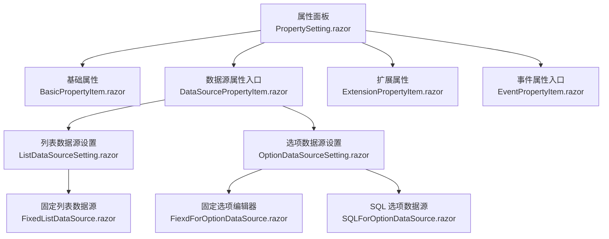
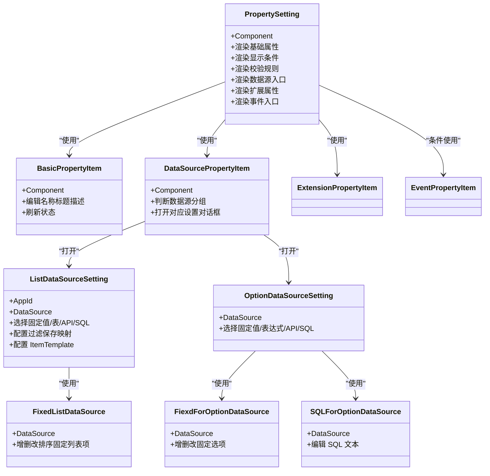
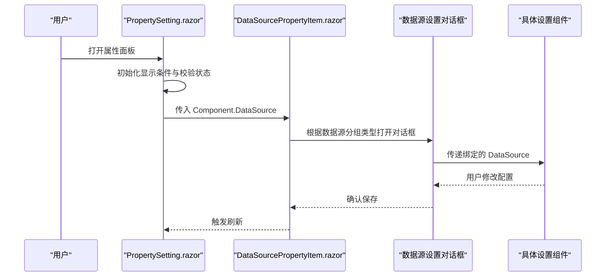
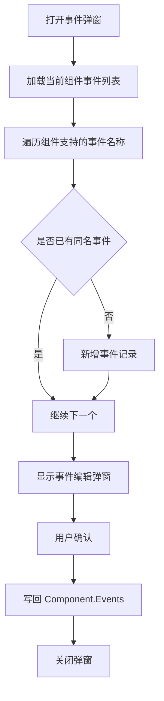
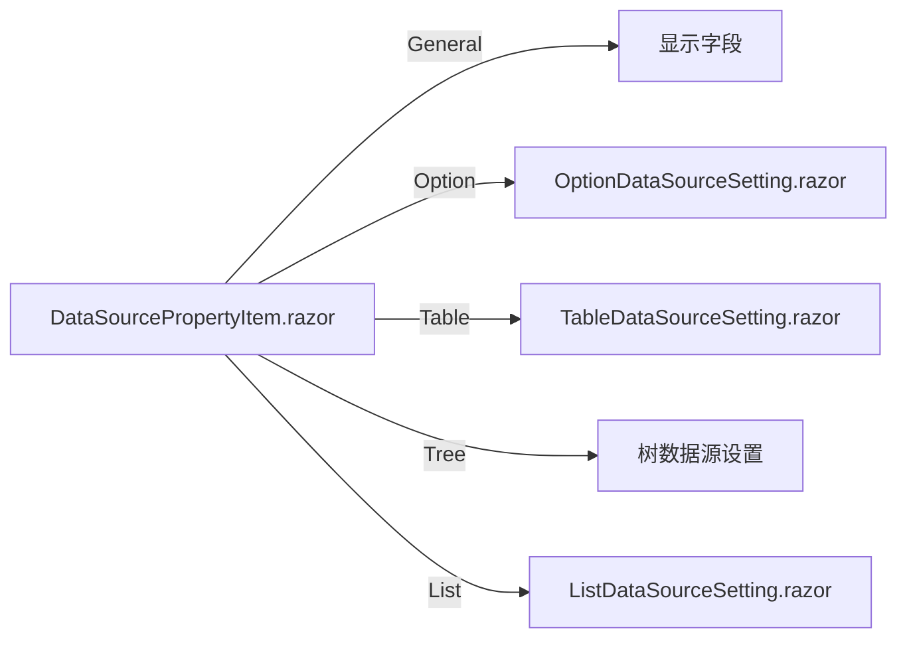
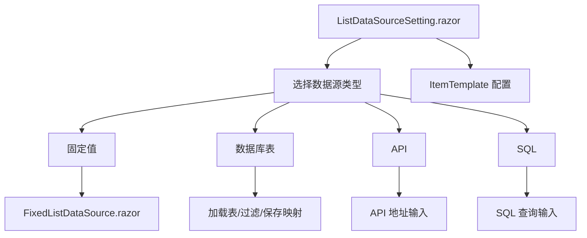
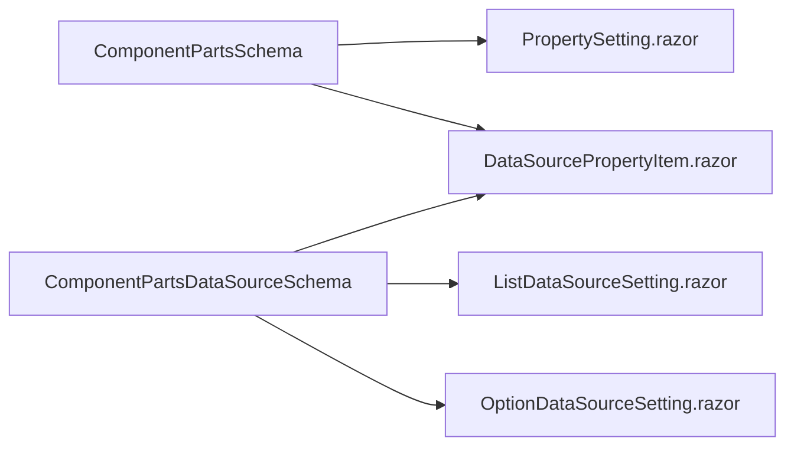

# 属性系统与事件系统

<cite>
**本文引用的文件**   
- [PropertySetting.razor](file://src/LowCode/DesignEngine/H.LowCode.DesignEngine/SettingPanel/PropertySetting.razor)
- [BasicPropertyItem.razor](file://src/LowCode/DesignEngine/H.LowCode.DesignEngine/SettingPanel/PropertySettingItems/BasicPropertyItem.razor)
- [EventPropertyItem.razor](file://src/LowCode/DesignEngine/H.LowCode.DesignEngine/SettingPanel/PropertySettingItems/EventPropertyItem.razor)
- [ExtensionPropertyItem.razor](file://src/LowCode/DesignEngine/H.LowCode.DesignEngine/SettingPanel/PropertySettingItems/ExtensionPropertyItem.razor)
- [DataSourcePropertyItem.razor](file://src/LowCode/DesignEngine/H.LowCode.DesignEngine/SettingPanel/PropertySettingItems/DataSourcePropertyItem.razor)
- [ListDataSourceSetting.razor](file://src/LowCode/DesignEngine/H.LowCode.DesignEngine/SettingPanel/PropertySettingItems/ListDataSource/ListDataSourceSetting.razor)
- [FixedListDataSource.razor](file://src/LowCode/DesignEngine/H.LowCode.DesignEngine/SettingPanel/PropertySettingItems/ListDataSource/FixedListDataSource.razor)
- [OptionDataSourceSetting.razor](file://src/LowCode/DesignEngine/H.LowCode.DesignEngine/SettingPanel/PropertySettingItems/OptionDataSource/OptionDataSourceSetting.razor)
- [FiexdForOptionDataSource.razor](file://src/LowCode/DesignEngine/H.LowCode.DesignEngine/SettingPanel/PropertySettingItems/OptionDataSource/FiexdForOptionDataSource.razor)
- [SQLForOptionDataSource.razor](file://src/LowCode/DesignEngine/H.LowCode.DesignEngine/SettingPanel/PropertySettingItems/OptionDataSource/SQLForOptionDataSource.razor)
</cite>

## 目录
1. [引言](#引言)
2. [项目结构](#项目结构)
3. [核心组件](#核心组件)
4. [架构总览](#架构总览)
5. [详细组件分析](#详细组件分析)
6. [依赖关系分析](#依赖关系分析)
7. [性能与可扩展性](#性能与可扩展性)
8. [故障排查](#故障排查)
9. [结论](#结论)
10. [附录：自定义扩展指南与示例](#附录自定义扩展指南与示例)

## 引言
本文面向低代码设计引擎的属性系统与事件系统，重点说明以下问题：
- 属性面板如何根据组件的元数据描述动态渲染不同的属性项。
- 基础文本、数字、布尔值等基础属性由哪个组件处理。
- 事件定义、事件注册与运行时触发约定。
- 列表数据源与选项数据源的职责边界，以及固定列表、SQL 选项等子组件的作用。
- 如何为自定义 Blazor 组件扩展属性、绑定数据源并声明事件。

## 项目结构
属性系统的入口是设计引擎的属性面板 `PropertySetting.razor`。它负责：
- 渲染基础属性。
- 渲染显示条件、校验规则。
- 渲染数据源配置入口。
- 渲染扩展属性组。
- 在组件声明支持事件时，渲染事件配置入口。

**图表来源**
- [PropertySetting.razor:1-200](file://src/LowCode/DesignEngine/H.LowCode.DesignEngine/SettingPanel/PropertySetting.razor#L1-L200)
- [DataSourcePropertyItem.razor:1-163](file://src/LowCode/DesignEngine/H.LowCode.DesignEngine/SettingPanel/PropertySettingItems/DataSourcePropertyItem.razor#L1-L163)
- [ListDataSourceSetting.razor:1-200](file://src/LowCode/DesignEngine/H.LowCode.DesignEngine/SettingPanel/PropertySettingItems/ListDataSource/ListDataSourceSetting.razor#L1-L200)
- [OptionDataSourceSetting.razor:1-57](file://src/LowCode/DesignEngine/H.LowCode.DesignEngine/SettingPanel/PropertySettingItems/OptionDataSource/OptionDataSourceSetting.razor#L1-L57)
- [FixedListDataSource.razor:1-133](file://src/LowCode/DesignEngine/H.LowCode.DesignEngine/SettingPanel/PropertySettingItems/ListDataSource/FixedListDataSource.razor#L1-L133)
- [FiexdForOptionDataSource.razor:1-138](file://src/LowCode/DesignEngine/H.LowCode.DesignEngine/SettingPanel/PropertySettingItems/OptionDataSource/FiexdForOptionDataSource.razor#L1-L138)
- [SQLForOptionDataSource.razor:1-25](file://src/LowCode/DesignEngine/H.LowCode.DesignEngine/SettingPanel/PropertySettingItems/OptionDataSource/SQLForOptionDataSource.razor#L1-L25)

**章节来源**
- [PropertySetting.razor:1-200](file://src/LowCode/DesignEngine/H.LowCode.DesignEngine/SettingPanel/PropertySetting.razor#L1-L200)

## 核心组件
- `PropertySetting.razor`：属性面板编排器，组合基础属性、显示条件、校验、数据源、扩展属性、事件。
- `BasicPropertyItem.razor`：编辑组件标识、名称、标题、描述等基础信息；容器组件与普通组件行为略有差异。
- `EventPropertyItem.razor`：打开事件弹窗，从组件元数据支持的列表中补齐未注册的事件，并将用户编辑后的事件集合写回组件。
- `DataSourcePropertyItem.razor`：根据数据源分组类型决定打开“选项数据源”“表数据源”“树数据源”或“列表数据源”对话框，并把当前组件的数据源对象传递给对应设置组件。
- `ListDataSourceSetting.razor`：列表数据源的主设置页，支持固定值、数据库表、API、SQL，并提供 ItemTemplate 配置入口。
- `FixedListDataSource.razor`：用于在设计时维护 JSON 数组形式的固定列表数据。
- `OptionDataSourceSetting.razor`：选项数据源的主设置页，支持固定值、表达式、API、SQL。
- `FiexdForOptionDataSource.razor`：表格化编辑固定选项的标签与值。
- `SQLForOptionDataSource.razor`：编辑 SQL 选项数据源语句。

**章节来源**
- [PropertySetting.razor:1-200](file://src/LowCode/DesignEngine/H.LowCode.DesignEngine/SettingPanel/PropertySetting.razor#L1-L200)
- [BasicPropertyItem.razor:1-38](file://src/LowCode/DesignEngine/H.LowCode.DesignEngine/SettingPanel/PropertySettingItems/BasicPropertyItem.razor#L1-L38)
- [EventPropertyItem.razor:1-40](file://src/LowCode/DesignEngine/H.LowCode.DesignEngine/SettingPanel/PropertySettingItems/EventPropertyItem.razor#L1-L40)
- [DataSourcePropertyItem.razor:1-163](file://src/LowCode/DesignEngine/H.LowCode.DesignEngine/SettingPanel/PropertySettingItems/DataSourcePropertyItem.razor#L1-L163)
- [ListDataSourceSetting.razor:1-200](file://src/LowCode/DesignEngine/H.LowCode.DesignEngine/SettingPanel/PropertySettingItems/ListDataSource/ListDataSourceSetting.razor#L1-L200)
- [FixedListDataSource.razor:1-133](file://src/LowCode/DesignEngine/H.LowCode.DesignEngine/SettingPanel/PropertySettingItems/ListDataSource/FixedListDataSource.razor#L1-L133)
- [OptionDataSourceSetting.razor:1-57](file://src/LowCode/DesignEngine/H.LowCode.DesignEngine/SettingPanel/PropertySettingItems/OptionDataSource/OptionDataSourceSetting.razor#L1-L57)
- [FiexdForOptionDataSource.razor:1-138](file://src/LowCode/DesignEngine/H.LowCode.DesignEngine/SettingPanel/PropertySettingItems/OptionDataSource/FiexdForOptionDataSource.razor#L1-L138)
- [SQLForOptionDataSource.razor:1-25](file://src/LowCode/DesignEngine/H.LowCode.DesignEngine/SettingPanel/PropertySettingItems/OptionDataSource/SQLForOptionDataSource.razor#L1-L25)

## 架构总览
属性系统采用“面板 + 属性项 + 数据源设置”的分层结构。

**图表来源**
- [PropertySetting.razor:1-200](file://src/LowCode/DesignEngine/H.LowCode.DesignEngine/SettingPanel/PropertySetting.razor#L1-L200)
- [BasicPropertyItem.razor:1-38](file://src/LowCode/DesignEngine/H.LowCode.DesignEngine/SettingPanel/PropertySettingItems/BasicPropertyItem.razor#L1-L38)
- [DataSourcePropertyItem.razor:1-163](file://src/LowCode/DesignEngine/H.LowCode.DesignEngine/SettingPanel/PropertySettingItems/DataSourcePropertyItem.razor#L1-L163)
- [ListDataSourceSetting.razor:1-200](file://src/LowCode/DesignEngine/H.LowCode.DesignEngine/SettingPanel/PropertySettingItems/ListDataSource/ListDataSourceSetting.razor#L1-L200)
- [OptionDataSourceSetting.razor:1-57](file://src/LowCode/DesignEngine/H.LowCode.DesignEngine/SettingPanel/PropertySettingItems/OptionDataSource/OptionDataSourceSetting.razor#L1-L57)
- [FixedListDataSource.razor:1-133](file://src/LowCode/DesignEngine/H.LowCode.DesignEngine/SettingPanel/PropertySettingItems/ListDataSource/FixedListDataSource.razor#L1-L133)
- [FiexdForOptionDataSource.razor:1-138](file://src/LowCode/DesignEngine/H.LowCode.DesignEngine/SettingPanel/PropertySettingItems/OptionDataSource/FiexdForOptionDataSource.razor#L1-L138)
- [SQLForOptionDataSource.razor:1-25](file://src/LowCode/DesignEngine/H.LowCode.DesignEngine/SettingPanel/PropertySettingItems/OptionDataSource/SQLForOptionDataSource.razor#L1-L25)

## 详细组件分析

### 属性面板：PropertySetting.razor
该组件是属性系统的编排中心，主要职责包括：
- 始终渲染 `BasicPropertyItem`，用于编辑组件标识、名称、标题和描述。
- 提供显示条件开关、比较符与期望值表达式。
- 通过 `DataSourcePropertyItem` 打开数据源配置对话框。
- 渲染 `ExtensionPropertyItem`，展示按组组织的扩展属性。
- 当 `Component.SupportEvents` 非空且存在元素时，渲染 `EventPropertyItem`。
- 管理校验规则的启用、添加、删除、排序与触发时机。

**图表来源**
- [PropertySetting.razor:1-200](file://src/LowCode/DesignEngine/H.LowCode.DesignEngine/SettingPanel/PropertySetting.razor#L1-L200)
- [DataSourcePropertyItem.razor:1-163](file://src/LowCode/DesignEngine/H.LowCode.DesignEngine/SettingPanel/PropertySettingItems/DataSourcePropertyItem.razor#L1-L163)

**章节来源**
- [PropertySetting.razor:1-200](file://src/LowCode/DesignEngine/H.LowCode.DesignEngine/SettingPanel/PropertySetting.razor#L1-L200)

### 基础属性：BasicPropertyItem.razor
- 对容器组件只展示组件标识，避免误改名称。
- 对普通组件提供名称、标题、描述的编辑入口。
- 每次编辑后调用组件状态刷新，保证属性变更能传播到父级。

适用场景：所有组件都需要的基础标识与展示信息。

**章节来源**
- [BasicPropertyItem.razor:1-38](file://src/LowCode/DesignEngine/H.LowCode.DesignEngine/SettingPanel/PropertySettingItems/BasicPropertyItem.razor#L1-L38)

### 事件系统：EventPropertyItem.razor
事件系统在当前实现中表现为“组件可支持哪些事件”和“页面中已注册哪些事件”。

- 组件元数据通过 `SupportEvents` 声明该组件支持的事件名称集合。
- 面板打开事件弹窗时，会读取当前组件的 `Events`，并为每个 `SupportEvents` 中的事件名称补充一条事件记录，除非已经存在同名事件。
- 确认后，把弹窗内编辑后的事件列表重新赋值给 `Component.Events`。

**图表来源**
- [EventPropertyItem.razor:1-40](file://src/LowCode/DesignEngine/H.LowCode.DesignEngine/SettingPanel/PropertySettingItems/EventPropertyItem.razor#L1-L40)

事件字段约定（基于现有实现推断）：
- 事件名称：字符串，通常来自组件元数据声明。
- 回调绑定：当前实现仅维护事件名称列表；实际参数类型、冒泡、页面事件注册等字段未在本文档可直接定位的代码片段中体现，需结合更完整的模型定义进一步确认。
- 运行时触发：应由运行时的渲染引擎根据页面 Schema 中的事件绑定调用组件方法；本文档依据现有 UI 文件只能确认“设计期声明”，不能断言运行期具体触发方式。

**章节来源**
- [EventPropertyItem.razor:1-40](file://src/LowCode/DesignEngine/H.LowCode.DesignEngine/SettingPanel/PropertySettingItems/EventPropertyItem.razor#L1-L40)

### 扩展属性：ExtensionPropertyItem.razor
扩展属性来源于组件的 `AttributeDefineGroups`，按组组织多个 `AttributeDefines`。渲染逻辑根据 `AttributeItemType` 选择不同输入控件：
- 文本输入。
- 数字输入。
- 复选框。
- 开关。
- 其他类型如单选、下拉、日期、多行文本等在当前文件中存在分支但未完整实现。

用途：为特定组件提供可配置的附加属性，例如样式、主题、行为开关等。

**章节来源**
- [ExtensionPropertyItem.razor:1-87](file://src/LowCode/DesignEngine/H.LowCode.DesignEngine/SettingPanel/PropertySettingItems/ExtensionPropertyItem.razor#L1-L87)

### 数据源系统：DataSourcePropertyItem.razor 与相关设置组件
`DataSourcePropertyItem.razor` 根据 `Component.DataSource.DataSourceGroupType` 决定渲染策略：
- 通用分组：直接显示字段名。
- 选项分组：打开选项数据源对话框。
- 表格分组：打开表数据源对话框，并嵌入 `TablePropertyItem` 展示表格相关属性。
- 树分组：打开树数据源对话框。
- 列表分组：打开列表数据源对话框。

#### 列表数据源 vs 选项数据源
- 列表数据源：用于表格、列表等需要数据行的场景。其设置组件支持固定值、数据库表、API、SQL，并支持过滤条件、保存映射、排序、分页及 ItemTemplate。
- 选项数据源：用于下拉框、单选框、多选框等选项来源。其设置组件支持固定值、表达式、API、SQL。

**图表来源**
- [DataSourcePropertyItem.razor:1-163](file://src/LowCode/DesignEngine/H.LowCode.DesignEngine/SettingPanel/PropertySettingItems/DataSourcePropertyItem.razor#L1-L163)

**章节来源**
- [DataSourcePropertyItem.razor:1-163](file://src/LowCode/DesignEngine/H.LowCode.DesignEngine/SettingPanel/PropertySettingItems/DataSourcePropertyItem.razor#L1-L163)

#### 列表数据源设置：ListDataSourceSetting.razor
该组件是列表数据源的核心编辑界面，关键能力包括：
- 数据源类型切换：固定值、数据库表、API、SQL。
- 固定值模式：委托 `FixedListDataSource` 维护 JSON 数组。
- 数据库表模式：
  - 选择加载数据表。
  - 配置排序字段与倒序。
  - 配置加载过滤条件。
  - 配置保存目标表、保存模式。
  - 配置保存字段映射。
- API 模式：预留接口地址输入。
- SQL 模式：预留 SQL 查询输入。
- ItemTemplate 模式：允许通过组件片段编辑器配置列表项模板。

**图表来源**
- [ListDataSourceSetting.razor:1-200](file://src/LowCode/DesignEngine/H.LowCode.DesignEngine/SettingPanel/PropertySettingItems/ListDataSource/ListDataSourceSetting.razor#L1-L200)

**章节来源**
- [ListDataSourceSetting.razor:1-200](file://src/LowCode/DesignEngine/H.LowCode.DesignEngine/SettingPanel/PropertySettingItems/ListDataSource/ListDataSourceSetting.razor#L1-L200)

#### 固定列表数据源：FixedListDataSource.razor
用于设计时快速构建测试数据：
- 支持添加、删除、上移、下移数据项。
- 每个数据项以 JSON 对象形式编辑。
- 自动创建默认键值，便于预览。

**章节来源**
- [FixedListDataSource.razor:1-133](file://src/LowCode/DesignEngine/H.LowCode.DesignEngine/SettingPanel/PropertySettingItems/ListDataSource/FixedListDataSource.razor#L1-L133)

#### 选项数据源设置：OptionDataSourceSetting.razor
选项数据源设置组件负责：
- 选择数据源类型：固定值、表达式、API、SQL。
- 固定值：委托 `FiexdForOptionDataSource` 编辑选项标签与值。
- 表达式：提供表达式输入框，用于从表达式求值得到选项。
- API：委托外部 API 数据源组件。
- SQL：委托 `SQLForOptionDataSource` 编辑 SQL。

**章节来源**
- [OptionDataSourceSetting.razor:1-57](file://src/LowCode/DesignEngine/H.LowCode.DesignEngine/SettingPanel/PropertySettingItems/OptionDataSource/OptionDataSourceSetting.razor#L1-L57)

#### 固定选项编辑器：FiexdForOptionDataSource.razor
提供表格化的选项编辑界面：
- 新增选项。
- 编辑选项名与选项值。
- 删除选项。
- 本地编辑缓存避免频繁状态闪烁。

**章节来源**
- [FiexdForOptionDataSource.razor:1-138](file://src/LowCode/DesignEngine/H.LowCode.DesignEngine/SettingPanel/PropertySettingItems/OptionDataSource/FiexdForOptionDataSource.razor#L1-L138)

#### SQL 选项数据源：SQLForOptionDataSource.razor
提供大文本框用于编写 SQL 查询语句，作为选项数据源的 SQL 类型配置载体。

**章节来源**
- [SQLForOptionDataSource.razor:1-25](file://src/LowCode/DesignEngine/H.LowCode.DesignEngine/SettingPanel/PropertySettingItems/OptionDataSource/SQLForOptionDataSource.razor#L1-L25)

## 依赖关系分析
属性系统的关键依赖关系如下：
- `PropertySetting.razor` 依赖 `ComponentPartsSchema` 表示当前编辑组件。
- `DataSourcePropertyItem.razor` 依赖 `ComponentPartsDataSourceSchema` 表示数据源配置。
- 列表数据源与选项数据源分别依赖各自设置组件，并通过 `bind-DataSource` 双向绑定。
- 事件系统依赖组件元数据中的支持事件集合与当前事件列表。

**图表来源**
- [PropertySetting.razor:1-200](file://src/LowCode/DesignEngine/H.LowCode.DesignEngine/SettingPanel/PropertySetting.razor#L1-L200)
- [DataSourcePropertyItem.razor:1-163](file://src/LowCode/DesignEngine/H.LowCode.DesignEngine/SettingPanel/PropertySettingItems/DataSourcePropertyItem.razor#L1-L163)
- [ListDataSourceSetting.razor:1-200](file://src/LowCode/DesignEngine/H.LowCode.DesignEngine/SettingPanel/PropertySettingItems/ListDataSource/ListDataSourceSetting.razor#L1-L200)
- [OptionDataSourceSetting.razor:1-57](file://src/LowCode/DesignEngine/H.LowCode.DesignEngine/SettingPanel/PropertySettingItems/OptionDataSource/OptionDataSourceSetting.razor#L1-L57)

**章节来源**
- [PropertySetting.razor:1-200](file://src/LowCode/DesignEngine/H.LowCode.DesignEngine/SettingPanel/PropertySetting.razor#L1-L200)
- [DataSourcePropertyItem.razor:1-163](file://src/LowCode/DesignEngine/H.LowCode.DesignEngine/SettingPanel/PropertySettingItems/DataSourcePropertyItem.razor#L1-L163)

## 性能与可扩展性
- 属性面板采用组合式组件，有利于按功能拆分、独立测试与维护。
- 数据源设置通过模态框隔离复杂表单，避免主面板过于臃肿。
- 列表数据源支持 ItemTemplate，可以在不改动底层数据源逻辑的前提下扩展列表项渲染。
- 扩展属性按组组织，适合按业务域扩展组件配置。
- 当前部分输入类型分支未完全实现，建议后续完善单选、下拉、日期、多行文本等扩展属性控件，以保证扩展属性的统一体验。

[本节为一般性讨论，不涉及具体文件分析]

## 故障排查
常见问题与建议：
- 事件未出现在事件弹窗中：检查组件元数据是否正确声明 `SupportEvents`，并确保组件实例存在。
- 数据源配置未生效：确认 `DataSourceGroupType` 与实际数据源类型匹配，并在对应设置组件中完成必填配置。
- 固定列表 JSON 编辑无效：检查 JSON 格式是否正确；当前实现会在解析失败时忽略更新。
- 扩展属性控件不显示：检查 `AttributeItemType` 是否在 `ExtensionPropertyItem.razor` 中存在对应分支。

**章节来源**
- [FixedListDataSource.razor:1-133](file://src/LowCode/DesignEngine/H.LowCode.DesignEngine/SettingPanel/PropertySettingItems/ListDataSource/FixedListDataSource.razor#L1-L133)
- [ExtensionPropertyItem.razor:1-87](file://src/LowCode/DesignEngine/H.LowCode.DesignEngine/SettingPanel/PropertySettingItems/ExtensionPropertyItem.razor#L1-L87)
- [EventPropertyItem.razor:1-40](file://src/LowCode/DesignEngine/H.LowCode.DesignEngine/SettingPanel/PropertySettingItems/EventPropertyItem.razor#L1-L40)

## 结论
属性系统围绕 `PropertySetting.razor` 展开，将基础属性、显示条件、校验、数据源、扩展属性和事件拆分为独立的属性项与设置组件。列表数据源与选项数据源职责清晰：前者面向行数据与表格交互，后者面向下拉等选项来源。事件系统在现有实现中主要负责设计期的事件名称声明与注册；更复杂的参数类型、冒泡、页面事件绑定等语义应在模型与运行期渲染引擎中进一步定义。

[本节为总结性内容，不涉及具体文件分析]

## 附录：自定义扩展指南与示例

### 一、为自定义 Blazor 组件定义属性
步骤：
1. 在组件元数据中声明该组件支持的基础属性、扩展属性、数据源分组类型、支持事件等。
2. 如果组件有独特属性，可在 `ExtensionPropertyItem.razor` 中添加新的 `AttributeItemType` 分支，或使用 `BasicPropertyItem.razor` 已有的输入类型。
3. 确保 `DataSourcePropertyItem.razor` 能识别该组件的数据源分组类型，并打开正确的设置对话框。

参考路径：
- [PropertySetting.razor:1-200](file://src/LowCode/DesignEngine/H.LowCode.DesignEngine/SettingPanel/PropertySetting.razor#L1-L200)
- [ExtensionPropertyItem.razor:1-87](file://src/LowCode/DesignEngine/H.LowCode.DesignEngine/SettingPanel/PropertySettingItems/ExtensionPropertyItem.razor#L1-L87)
- [BasicPropertyItem.razor:1-38](file://src/LowCode/DesignEngine/H.LowCode.DesignEngine/SettingPanel/PropertySettingItems/BasicPropertyItem.razor#L1-L38)
- [DataSourcePropertyItem.razor:1-163](file://src/LowCode/DesignEngine/H.LowCode.DesignEngine/SettingPanel/PropertySettingItems/DataSourcePropertyItem.razor#L1-L163)

### 二、绑定数据源
- 若组件需要表格或列表数据，选择“列表数据源”，并在 `ListDataSourceSetting.razor` 中选择固定值、数据库表、API 或 SQL。
- 若组件只需要下拉选项，选择“选项数据源”，并在 `OptionDataSourceSetting.razor` 中选择固定值、表达式、API 或 SQL。
- 设计时可使用固定列表或固定选项快速验证交互，运行时再切换到真实数据源。

参考路径：
- [ListDataSourceSetting.razor:1-200](file://src/LowCode/DesignEngine/H.LowCode.DesignEngine/SettingPanel/PropertySettingItems/ListDataSource/ListDataSourceSetting.razor#L1-L200)
- [OptionDataSourceSetting.razor:1-57](file://src/LowCode/DesignEngine/H.LowCode.DesignEngine/SettingPanel/PropertySettingItems/OptionDataSource/OptionDataSourceSetting.razor#L1-L57)
- [FixedListDataSource.razor:1-133](file://src/LowCode/DesignEngine/H.LowCode.DesignEngine/SettingPanel/PropertySettingItems/ListDataSource/FixedListDataSource.razor#L1-L133)
- [FiexdForOptionDataSource.razor:1-138](file://src/LowCode/DesignEngine/H.LowCode.DesignEngine/SettingPanel/PropertySettingItems/OptionDataSource/FiexdForOptionDataSource.razor#L1-L138)

### 三、声明事件
步骤：
1. 在组件元数据中声明 `SupportEvents`，列出该组件支持的事件名称。
2. 在页面中使用该组件时，通过 `EventPropertyItem.razor` 打开事件弹窗，勾选并绑定事件。
3. 在运行期，由渲染引擎根据页面 Schema 中的事件绑定调用组件相应方法。

注意：当前实现主要维护事件名称；如需支持参数类型、冒泡、页面事件注册等，需要在模型与渲染引擎中补充相应字段与逻辑。

参考路径：
- [EventPropertyItem.razor:1-40](file://src/LowCode/DesignEngine/H.LowCode.DesignEngine/SettingPanel/PropertySettingItems/EventPropertyItem.razor#L1-L40)
- [PropertySetting.razor:1-200](file://src/LowCode/DesignEngine/H.LowCode.DesignEngine/SettingPanel/PropertySetting.razor#L1-L200)

### 四、示例：为一个自定义 Blazor 组件定义属性、绑定数据源、声明事件
假设有一个“商品卡片”组件：
- 基础属性：组件名称、标题、描述。
- 扩展属性：是否显示价格、是否显示库存。
- 数据源：列表数据源，用于获取商品列表。
- 事件：点击商品、加入购物车。

实现要点：
- 在组件元数据中声明上述属性、数据源分组类型为列表、事件名称为“点击商品”“加入购物车”。
- 在 `BasicPropertyItem.razor` 中编辑名称、标题、描述。
- 在 `ExtensionPropertyItem.razor` 中为“是否显示价格”“是否显示库存”增加布尔开关分支。
- 在 `DataSourcePropertyItem.razor` 中识别列表数据源分组，打开 `ListDataSourceSetting.razor`。
- 在 `EventPropertyItem.razor` 中打开事件弹窗，让用户绑定这两个事件。

参考路径：
- [BasicPropertyItem.razor:1-38](file://src/LowCode/DesignEngine/H.LowCode.DesignEngine/SettingPanel/PropertySettingItems/BasicPropertyItem.razor#L1-L38)
- [ExtensionPropertyItem.razor:1-87](file://src/LowCode/DesignEngine/H.LowCode.DesignEngine/SettingPanel/PropertySettingItems/ExtensionPropertyItem.razor#L1-L87)
- [DataSourcePropertyItem.razor:1-163](file://src/LowCode/DesignEngine/H.LowCode.DesignEngine/SettingPanel/PropertySettingItems/DataSourcePropertyItem.razor#L1-L163)
- [ListDataSourceSetting.razor:1-200](file://src/LowCode/DesignEngine/H.LowCode.DesignEngine/SettingPanel/PropertySettingItems/ListDataSource/ListDataSourceSetting.razor#L1-L200)
- [EventPropertyItem.razor:1-40](file://src/LowCode/DesignEngine/H.LowCode.DesignEngine/SettingPanel/PropertySettingItems/EventPropertyItem.razor#L1-L40)