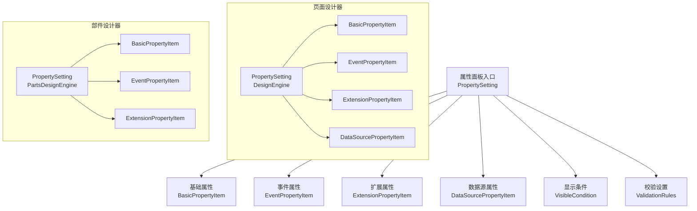
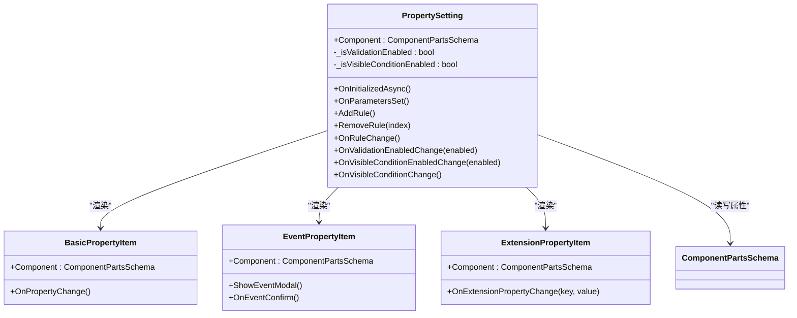
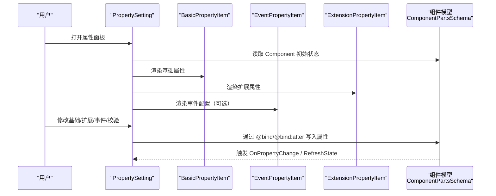
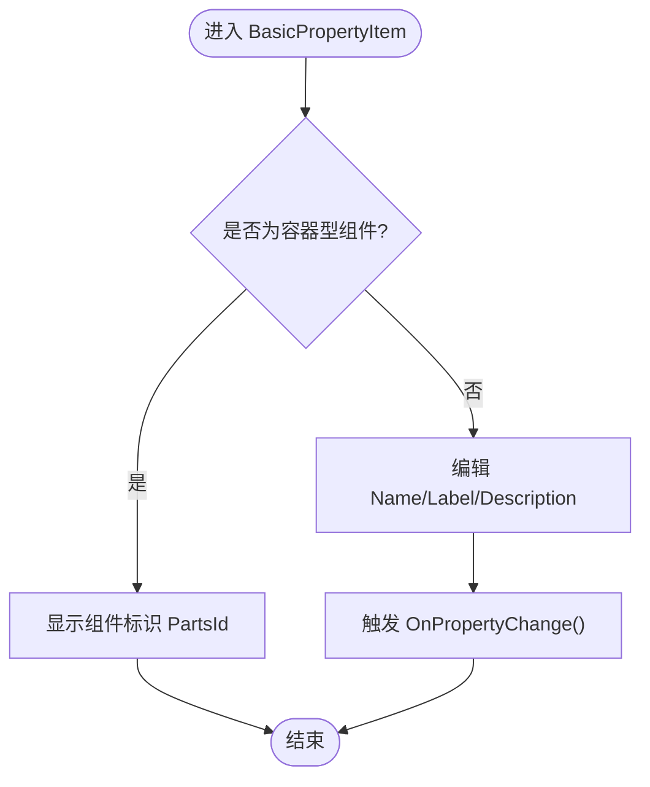
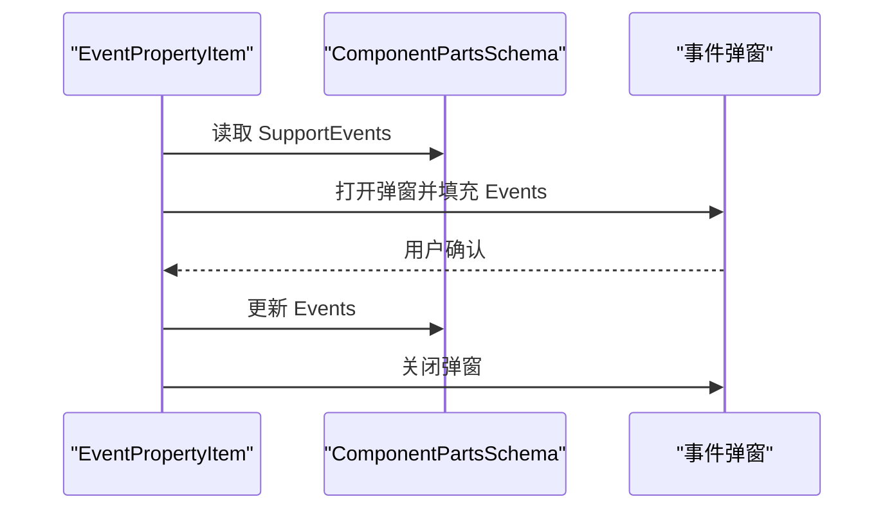
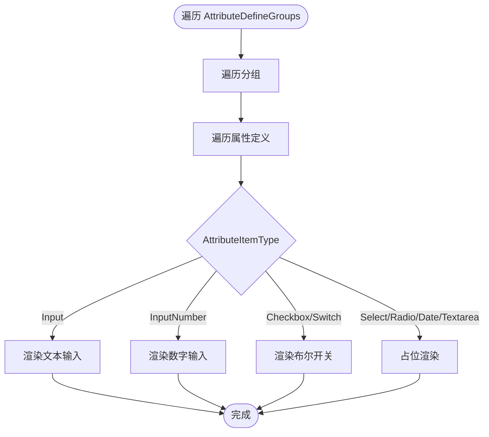
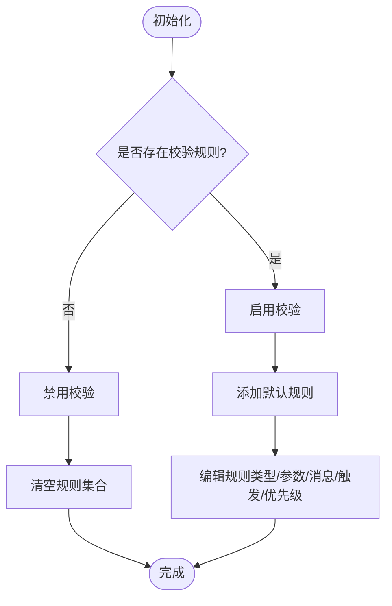
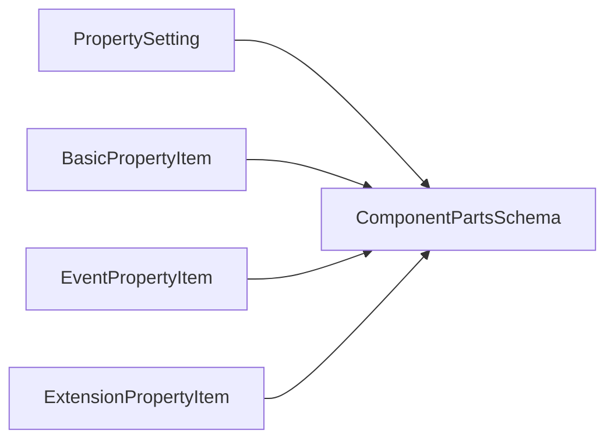

# 属性面板

<cite>
**本文引用的文件**
- [src/LowCode/DesignEngine/H.LowCode.DesignEngine/SettingPanel/PropertySetting.razor](file://src/LowCode/DesignEngine/H.LowCode.DesignEngine/SettingPanel/PropertySetting.razor)
- [src/LowCode/DesignEngine/H.LowCode.DesignEngine/SettingPanel/PropertySettingItems/BasicPropertyItem.razor](file://src/LowCode/DesignEngine/H.LowCode.DesignEngine/SettingPanel/PropertySettingItems/BasicPropertyItem.razor)
- [src/LowCode/DesignEngine/H.LowCode.DesignEngine/SettingPanel/PropertySettingItems/EventPropertyItem.razor](file://src/LowCode/DesignEngine/H.LowCode.DesignEngine/SettingPanel/PropertySettingItems/EventPropertyItem.razor)
- [src/LowCode/DesignEngine/H.LowCode.DesignEngine/SettingPanel/PropertySettingItems/ExtensionPropertyItem.razor](file://src/LowCode/DesignEngine/H.LowCode.DesignEngine/SettingPanel/PropertySettingItems/ExtensionPropertyItem.razor)
- [src/LowCode/DesignEngine/H.LowCode.PartsDesignEngine/SettingPanel/PropertySetting.razor](file://src/LowCode/DesignEngine/H.LowCode.PartsDesignEngine/SettingPanel/PropertySetting.razor)
</cite>

## 目录
1. [引言](#引言)
2. [项目结构](#项目结构)
3. [核心组件](#核心组件)
4. [架构总览](#架构总览)
5. [详细组件分析](#详细组件分析)
6. [依赖关系分析](#依赖关系分析)
7. [性能与体验优化](#性能与体验优化)
8. [故障排查指南](#故障排查指南)
9. [结论](#结论)

## 引言
本文件面向 H.AppLab 设计引擎的属性面板，聚焦其分层架构与扩展机制。文档围绕以下目标展开：
- 解释 PropertySetting 主面板、StyleSetting（样式设置）、ValidationSetting（校验规则设置）等子模块的职责与协作方式。
- 说明属性项类型系统：BasicPropertyItem（基础属性）、EventPropertyItem（事件属性）、ExtensionPropertyItem（扩展属性）的工作机制。
- 阐述属性绑定与实时同步到组件实例的实现路径。
- 提供开发指南：自定义属性编辑器、复杂验证规则、扩展属性面板布局。
- 总结属性设计规范、用户体验优化建议与常见问题解决方案。

## 项目结构
H.AppLab 的设计引擎在 Blazor 前端中通过 Razor 组件组织属性面板。当前仓库中与属性面板直接相关的核心代码位于 DesignEngine 与 PartsDesignEngine 两个项目中，均基于同一套属性编辑范式。

**图示来源**
- [src/LowCode/DesignEngine/H.LowCode.DesignEngine/SettingPanel/PropertySetting.razor:1-200](file://src/LowCode/DesignEngine/H.LowCode.DesignEngine/SettingPanel/PropertySetting.razor#L1-L200)
- [src/LowCode/DesignEngine/H.LowCode.PartsDesignEngine/SettingPanel/PropertySetting.razor:1-200](file://src/LowCode/DesignEngine/H.LowCode.PartsDesignEngine/SettingPanel/PropertySetting.razor#L1-L200)

**章节来源**
- [src/LowCode/DesignEngine/H.LowCode.DesignEngine/SettingPanel/PropertySetting.razor:1-200](file://src/LowCode/DesignEngine/H.LowCode.DesignEngine/SettingPanel/PropertySetting.razor#L1-L200)
- [src/LowCode/DesignEngine/H.LowCode.PartsDesignEngine/SettingPanel/PropertySetting.razor:1-200](file://src/LowCode/DesignEngine/H.LowCode.PartsDesignEngine/SettingPanel/PropertySetting.razor#L1-L200)

## 核心组件
- PropertySetting：属性面板的主容器，负责组合基础属性、显示条件、数据源、扩展属性、校验规则与事件属性，并维护本地状态（如是否启用校验、显示条件开关）。
- BasicPropertyItem：渲染组件的基础元信息，如名称、标题、描述；对容器型组件还展示标识。
- EventPropertyItem：打开弹窗配置事件列表，初始化支持的事件并回写至组件实例。
- ExtensionPropertyItem：根据组件定义的属性分组和类型动态渲染输入控件，实现“声明式扩展属性”。
- DataSourcePropertyItem：用于配置组件的数据源（在页面设计器中存在）。
- VisibleCondition：控制组件的显隐联动，包含值表达式、比较符与期望值。
- ValidationRules：校验规则集合，支持必填、长度、数值范围、正则、邮箱、手机、URL 与自定义规则。

**章节来源**
- [src/LowCode/DesignEngine/H.LowCode.DesignEngine/SettingPanel/PropertySetting.razor:1-200](file://src/LowCode/DesignEngine/H.LowCode.DesignEngine/SettingPanel/PropertySetting.razor#L1-L200)
- [src/LowCode/DesignEngine/H.LowCode.DesignEngine/SettingPanel/PropertySettingItems/BasicPropertyItem.razor:1-38](file://src/LowCode/DesignEngine/H.LowCode.DesignEngine/SettingPanel/PropertySettingItems/BasicPropertyItem.razor#L1-L38)
- [src/LowCode/DesignEngine/H.LowCode.DesignEngine/SettingPanel/PropertySettingItems/EventPropertyItem.razor:1-40](file://src/LowCode/DesignEngine/H.LowCode.DesignEngine/SettingPanel/PropertySettingItems/EventPropertyItem.razor#L1-L40)
- [src/LowCode/DesignEngine/H.LowCode.DesignEngine/SettingPanel/PropertySettingItems/ExtensionPropertyItem.razor:1-87](file://src/LowCode/DesignEngine/H.LowCode.DesignEngine/SettingPanel/PropertySettingItems/ExtensionPropertyItem.razor#L1-L87)

## 架构总览
属性面板采用“容器 + 分面”的分层架构：
- 顶层容器 PropertySetting 聚合多个分面子组件。
- 每个子组件关注单一职责：基础属性、事件、扩展属性、校验、数据源、显示条件。
- 所有编辑操作通过 @bind 与 @bind:after 将用户输入直接写入 Component 对象，再由上层服务监听变更并同步到运行时组件实例。

**图示来源**
- [src/LowCode/DesignEngine/H.LowCode.DesignEngine/SettingPanel/PropertySetting.razor:1-200](file://src/LowCode/DesignEngine/H.LowCode.DesignEngine/SettingPanel/PropertySetting.razor#L1-L200)
- [src/LowCode/DesignEngine/H.LowCode.DesignEngine/SettingPanel/PropertySettingItems/BasicPropertyItem.razor:1-38](file://src/LowCode/DesignEngine/H.LowCode.DesignEngine/SettingPanel/PropertySettingItems/BasicPropertyItem.razor#L1-L38)
- [src/LowCode/DesignEngine/H.LowCode.DesignEngine/SettingPanel/PropertySettingItems/EventPropertyItem.razor:1-40](file://src/LowCode/DesignEngine/H.LowCode.DesignEngine/SettingPanel/PropertySettingItems/EventPropertyItem.razor#L1-L40)
- [src/LowCode/DesignEngine/H.LowCode.DesignEngine/SettingPanel/PropertySettingItems/ExtensionPropertyItem.razor:1-87](file://src/LowCode/DesignEngine/H.LowCode.DesignEngine/SettingPanel/PropertySettingItems/ExtensionPropertyItem.razor#L1-L87)

## 详细组件分析

### PropertySetting 主面板
- 职责：组合各子模块，管理“校验启用开关”“显示条件启用开关”，并在参数变化时初始化本地状态。
- 显示条件：支持启用/禁用、值表达式、比较符与期望值的编辑，适用于组件可见性联动。
- 数据源：集成 DataSourcePropertyItem 以配置数据来源。
- 扩展属性：渲染 AttributeDefineGroups 中的声明式属性定义。
- 校验规则：提供规则增删改、启用/禁用、触发时机、优先级等能力。
- 事件：当 Component.SupportEvents 存在时渲染 EventPropertyItem。

**图示来源**
- [src/LowCode/DesignEngine/H.LowCode.DesignEngine/SettingPanel/PropertySetting.razor:1-200](file://src/LowCode/DesignEngine/H.LowCode.DesignEngine/SettingPanel/PropertySetting.razor#L1-L200)
- [src/LowCode/DesignEngine/H.LowCode.PartsDesignEngine/SettingPanel/PropertySetting.razor:1-200](file://src/LowCode/DesignEngine/H.LowCode.PartsDesignEngine/SettingPanel/PropertySetting.razor#L1-L200)

**章节来源**
- [src/LowCode/DesignEngine/H.LowCode.DesignEngine/SettingPanel/PropertySetting.razor:1-200](file://src/LowCode/DesignEngine/H.LowCode.DesignEngine/SettingPanel/PropertySetting.razor#L1-L200)
- [src/LowCode/DesignEngine/H.LowCode.PartsDesignEngine/SettingPanel/PropertySetting.razor:1-200](file://src/LowCode/DesignEngine/H.LowCode.PartsDesignEngine/SettingPanel/PropertySetting.razor#L1-L200)

### BasicPropertyItem 基础属性
- 针对非容器型组件：提供 Name（字段名/英文）、Label（标题）、Description（描述）的编辑。
- 针对容器型组件：仅展示 ComponentsId（PartsId），避免误改关键标识。
- 每次修改后调用 Component.RefreshState()，确保关联视图状态刷新。

**图示来源**
- [src/LowCode/DesignEngine/H.LowCode.DesignEngine/SettingPanel/PropertySettingItems/BasicPropertyItem.razor:1-38](file://src/LowCode/DesignEngine/H.LowCode.DesignEngine/SettingPanel/PropertySettingItems/BasicPropertyItem.razor#L1-L38)

**章节来源**
- [src/LowCode/DesignEngine/H.LowCode.DesignEngine/SettingPanel/PropertySettingItems/BasicPropertyItem.razor:1-38](file://src/LowCode/DesignEngine/H.LowCode.DesignEngine/SettingPanel/PropertySettingItems/BasicPropertyItem.razor#L1-L38)

### EventPropertyItem 事件属性
- 打开事件配置弹窗，初始化事件列表：若已存在同名事件则跳过，否则从 Component.SupportEvents 补充默认事件。
- 确认后回写 Component.Events，关闭弹窗。

**图示来源**
- [src/LowCode/DesignEngine/H.LowCode.DesignEngine/SettingPanel/PropertySettingItems/EventPropertyItem.razor:1-40](file://src/LowCode/DesignEngine/H.LowCode.DesignEngine/SettingPanel/PropertySettingItems/EventPropertyItem.razor#L1-L40)

**章节来源**
- [src/LowCode/DesignEngine/H.LowCode.DesignEngine/SettingPanel/PropertySettingItems/EventPropertyItem.razor:1-40](file://src/LowCode/DesignEngine/H.LowCode.DesignEngine/SettingPanel/PropertySettingItems/EventPropertyItem.razor#L1-L40)

### ExtensionPropertyItem 扩展属性
- 基于 Component.AttributeDefineGroups 遍历渲染，支持多种 AttributeItemType：
  - Input：字符串输入
  - InputNumber：数值输入
  - Checkbox/Switch：布尔值开关
  - Select/Radio/Date/Textarea：占位实现（可继续扩展）
- 支持 Description 提示文案展示。
- 提供 OnExtensionPropertyChange 方法，便于后续统一处理扩展属性变更。

**图示来源**
- [src/LowCode/DesignEngine/H.LowCode.DesignEngine/SettingPanel/PropertySettingItems/ExtensionPropertyItem.razor:1-87](file://src/LowCode/DesignEngine/H.LowCode.DesignEngine/SettingPanel/PropertySettingItems/ExtensionPropertyItem.razor#L1-L87)

**章节来源**
- [src/LowCode/DesignEngine/H.LowCode.DesignEngine/SettingPanel/PropertySettingItems/ExtensionPropertyItem.razor:1-87](file://src/LowCode/DesignEngine/H.LowCode.DesignEngine/SettingPanel/PropertySettingItems/ExtensionPropertyItem.razor#L1-L87)

### 校验规则设置（ValidationSetting）
- 由 PropertySetting 内部直接实现，未拆分为独立子组件，但具备完整的校验配置界面：
  - 启用/禁用校验
  - 添加/删除规则
  - 规则类型：必填、最小/最大长度、最小/最大值、正则、邮箱、手机、URL、自定义
  - 错误消息、触发时机（输入时/失去焦点时）、优先级
- 自动初始化：当存在校验规则时默认启用校验，否则清空规则集合。

**图示来源**
- [src/LowCode/DesignEngine/H.LowCode.DesignEngine/SettingPanel/PropertySetting.razor:1-200](file://src/LowCode/DesignEngine/H.LowCode.DesignEngine/SettingPanel/PropertySetting.razor#L1-L200)
- [src/LowCode/DesignEngine/H.LowCode.PartsDesignEngine/SettingPanel/PropertySetting.razor:1-200](file://src/LowCode/DesignEngine/H.LowCode.PartsDesignEngine/SettingPanel/PropertySetting.razor#L1-L200)

**章节来源**
- [src/LowCode/DesignEngine/H.LowCode.DesignEngine/SettingPanel/PropertySetting.razor:1-200](file://src/LowCode/DesignEngine/H.LowCode.DesignEngine/SettingPanel/PropertySetting.razor#L1-L200)
- [src/LowCode/DesignEngine/H.LowCode.PartsDesignEngine/SettingPanel/PropertySetting.razor:1-200](file://src/LowCode/DesignEngine/H.LowCode.PartsDesignEngine/SettingPanel/PropertySetting.razor#L1-L200)

## 依赖关系分析
- PropertySetting 依赖 ComponentPartsSchema，读写组件元数据与行为配置。
- BasicPropertyItem 依赖 ComponentPartsSchema 的 Name、Label、Description 与 IsContainer、PartsId。
- EventPropertyItem 依赖 ComponentPartsSchema 的 SupportEvents 与 Events。
- ExtensionPropertyItem 依赖 ComponentPartsSchema 的 AttributeDefineGroups 及 AttributeDefine 的类型枚举。
- PropertySetting 内部还依赖校验规则相关枚举与类型（如 ValidationRuleTypeEnum、ValidationTriggerEnum 等）。

**图示来源**
- [src/LowCode/DesignEngine/H.LowCode.DesignEngine/SettingPanel/PropertySetting.razor:1-200](file://src/LowCode/DesignEngine/H.LowCode.DesignEngine/SettingPanel/PropertySetting.razor#L1-L200)
- [src/LowCode/DesignEngine/H.LowCode.DesignEngine/SettingPanel/PropertySettingItems/BasicPropertyItem.razor:1-38](file://src/LowCode/DesignEngine/H.LowCode.DesignEngine/SettingPanel/PropertySettingItems/BasicPropertyItem.razor#L1-L38)
- [src/LowCode/DesignEngine/H.LowCode.DesignEngine/SettingPanel/PropertySettingItems/EventPropertyItem.razor:1-40](file://src/LowCode/DesignEngine/H.LowCode.DesignEngine/SettingPanel/PropertySettingItems/EventPropertyItem.razor#L1-L40)
- [src/LowCode/DesignEngine/H.LowCode.DesignEngine/SettingPanel/PropertySettingItems/ExtensionPropertyItem.razor:1-87](file://src/LowCode/DesignEngine/H.LowCode.DesignEngine/SettingPanel/PropertySettingItems/ExtensionPropertyItem.razor#L1-L87)

**章节来源**
- [src/LowCode/DesignEngine/H.LowCode.DesignEngine/SettingPanel/PropertySetting.razor:1-200](file://src/LowCode/DesignEngine/H.LowCode.DesignEngine/SettingPanel/PropertySetting.razor#L1-L200)
- [src/LowCode/DesignEngine/H.LowCode.DesignEngine/SettingPanel/PropertySettingItems/BasicPropertyItem.razor:1-38](file://src/LowCode/DesignEngine/H.LowCode.DesignEngine/SettingPanel/PropertySettingItems/BasicPropertyItem.razor#L1-L38)
- [src/LowCode/DesignEngine/H.LowCode.DesignEngine/SettingPanel/PropertySettingItems/EventPropertyItem.razor:1-40](file://src/LowCode/DesignEngine/H.LowCode.DesignEngine/SettingPanel/PropertySettingItems/EventPropertyItem.razor#L1-L40)
- [src/LowCode/DesignEngine/H.LowCode.DesignEngine/SettingPanel/PropertySettingItems/ExtensionPropertyItem.razor:1-87](file://src/LowCode/DesignEngine/H.LowCode.DesignEngine/SettingPanel/PropertySettingItems/ExtensionPropertyItem.razor#L1-L87)

## 性能与体验优化
- 使用 @bind:after 进行增量更新，减少不必要的重渲染。
- 对长列表（如校验规则）采用分页或虚拟滚动策略（可扩展）。
- 扩展属性渲染应尽量避免深层嵌套循环带来的重复计算，必要时缓存分组结果。
- 事件弹窗应避免重复初始化，仅在首次打开时加载 SupportEvents。
- 为复杂校验规则提供默认错误消息模板，减少用户输入成本。
- 在属性面板顶部提供“重置”“应用”按钮，增强用户掌控感。

[本节为通用指导，不直接分析具体文件]

## 故障排查指南
- 问题：扩展属性未渲染
  - 检查 Component.AttributeDefineGroups 是否正确注入，以及 AttributeItemType 是否匹配实现分支。
  - 参考实现位置：[src/LowCode/DesignEngine/H.LowCode.DesignEngine/SettingPanel/PropertySettingItems/ExtensionPropertyItem.razor:1-87](file://src/LowCode/DesignEngine/H.LowCode.DesignEngine/SettingPanel/PropertySettingItems/ExtensionPropertyItem.razor#L1-L87)
- 问题：校验规则无法生效
  - 确认“启用校验”开关已打开且至少有一条启用的规则。
  - 检查 RuleType 对应的参数（MinLength/MaxLength/MinValue/MaxValue/Pattern）是否填写正确。
  - 参考实现位置：[src/LowCode/DesignEngine/H.LowCode.DesignEngine/SettingPanel/PropertySetting.razor:1-200](file://src/LowCode/DesignEngine/H.LowCode.DesignEngine/SettingPanel/PropertySetting.razor#L1-L200)
- 问题：事件未出现在事件中
  - 确认 Component.SupportEvents 已正确声明，且弹窗确认后 Component.Events 已被更新。
  - 参考实现位置：[src/LowCode/DesignEngine/H.LowCode.DesignEngine/SettingPanel/PropertySettingItems/EventPropertyItem.razor:1-40](file://src/LowCode/DesignEngine/H.LowCode.DesignEngine/SettingPanel/PropertySettingItems/EventPropertyItem.razor#L1-L40)
- 问题：基础属性修改未生效
  - 检查 OnPropertyChange 是否调用 Component.RefreshState()。
  - 参考实现位置：[src/LowCode/DesignEngine/H.LowCode.DesignEngine/SettingPanel/PropertySettingItems/BasicPropertyItem.razor:1-38](file://src/LowCode/DesignEngine/H.LowCode.DesignEngine/SettingPanel/PropertySettingItems/BasicPropertyItem.razor#L1-L38)

**章节来源**
- [src/LowCode/DesignEngine/H.LowCode.DesignEngine/SettingPanel/PropertySettingItems/ExtensionPropertyItem.razor:1-87](file://src/LowCode/DesignEngine/H.LowCode.DesignEngine/SettingPanel/PropertySettingItems/ExtensionPropertyItem.razor#L1-L87)
- [src/LowCode/DesignEngine/H.LowCode.DesignEngine/SettingPanel/PropertySetting.razor:1-200](file://src/LowCode/DesignEngine/H.LowCode.DesignEngine/SettingPanel/PropertySetting.razor#L1-L200)
- [src/LowCode/DesignEngine/H.LowCode.DesignEngine/SettingPanel/PropertySettingItems/EventPropertyItem.razor:1-40](file://src/LowCode/DesignEngine/H.LowCode.DesignEngine/SettingPanel/PropertySettingItems/EventPropertyItem.razor#L1-L40)
- [src/LowCode/DesignEngine/H.LowCode.DesignEngine/SettingPanel/PropertySettingItems/BasicPropertyItem.razor:1-38](file://src/LowCode/DesignEngine/H.LowCode.DesignEngine/SettingPanel/PropertySettingItems/BasicPropertyItem.razor#L1-L38)

## 结论
H.AppLab 的属性面板通过 PropertySetting 主面板组合多个子组件，形成清晰的分层架构。BasicPropertyItem、EventPropertyItem、ExtensionPropertyItem 分别承担基础属性、事件与扩展属性的职责，并通过 @bind/@bind:after 与 ComponentPartsSchema 保持实时同步。校验规则由 PropertySetting 内聚实现，提供丰富的内置规则与灵活的触发时机。在此基础上，开发者可通过扩展 AttributeDefineGroups、完善 ExtensionPropertyItem 的渲染分支、自定义校验规则与事件弹窗，构建更强大的属性面板体系。