# 我的应用管理

<cite>
**本文引用的文件**   
- [MyAppLayout.razor](file://src/LowCode/DesignEngine/H.LowCode.MyApp/Layout/MyAppLayout.razor)
- [MyApps.razor](file://src/LowCode/DesignEngine/H.LowCode.MyApp/Pages/MyApps.razor)
- [AppForm.razor](file://src/LowCode/DesignEngine/H.LowCode.MyApp/Pages/MyApps/AppForm.razor)
- [AppCreateFromTemplate.razor](file://src/LowCode/DesignEngine/H.LowCode.MyApp/Pages/MyApps/AppCreateFromTemplate.razor)
- [AppPopularTemplates.razor](file://src/LowCode/DesignEngine/H.LowCode.MyApp/Pages/MyApps/AppPopularTemplates.razor)
- [AppCreateFromAi.razor](file://src/LowCode/DesignEngine/H.LowCode.MyApp/Pages/MyApps/AppCreateFromAi.razor)
- [AppPublish.razor](file://src/LowCode/DesignEngine/H.LowCode.MyApp/Pages/AppPublish.razor)
- [AppSettings.razor](file://src/LowCode/DesignEngine/H.LowCode.MyApp/Pages/AppSettings.razor)
- [AppMembers.razor](file://src/LowCode/DesignEngine/H.LowCode.MyApp/Pages/AppMembers.razor)
- [AppIntegration.razor](file://src/LowCode/DesignEngine/H.LowCode.MyApp/Pages/AppIntegration.razor)
- [AutoFlow.razor](file://src/LowCode/DesignEngine/H.LowCode.MyApp/Pages/AutoFlow.razor)
- [IAppApplicationService.cs](file://src/LowCode/DesignEngine/H.LowCode.DesignEngine.Application.Contracts/AppServices/IAppApplicationService.cs)
- [AppApplicationService.cs](file://src/LowCode/DesignEngine/H.LowCode.DesignEngine.Application/AppServices/AppApplicationService.cs)
- [MenuAppService.cs](file://src/LowCode/DesignEngine/H.LowCode.DesignEngine.Application/AppServices/MenuAppService.cs)
- [AppPublishAppService.cs](file://src/LowCode/DesignEngine/H.LowCode.DesignEngine.Application/AppServices/AppPublishAppService.cs)
- [AppRbacAppService.cs](file://src/LowCode/DesignEngine/H.LowCode.DesignEngine.Application/AppServices/AppRbacAppService.cs)
</cite>

## 目录
1. [简介](#简介)
2. [项目结构](#项目结构)
3. [核心组件](#核心组件)
4. [架构总览](#架构总览)
5. [详细组件分析](#详细组件分析)
6. [依赖关系分析](#依赖关系分析)
7. [性能与可扩展性](#性能与可扩展性)
8. [故障排查](#故障排查)
9. [结论](#结论)

## 简介
“我的应用”是低代码设计引擎中的应用管理中心。它提供应用的创建、编辑、模板化、AI 生成、页面与菜单配置、数据源管理、成员权限控制、集成开关、自动化流程入口以及发布版本管理等能力。每个应用对应一个独立的应用元数据对象，拥有自己的页面、菜单和数据源集合；应用发布后由渲染引擎加载运行。

该功能在前端通过 Blazor 页面组织，在后端通过 ABP 风格的 AppService 暴露接口。典型用户包括：
- 业务人员：从模板或 AI 快速创建应用。
- 低代码开发者：配置页面、菜单、数据源和集成。
- 管理员：分配成员角色与权限，控制访问方式并发布版本。

## 项目结构
“我的应用”相关的前端页面集中在 `H.LowCode.MyApp` 中，后端服务集中在 `H.LowCode.DesignEngine.Application` 及其契约层中。

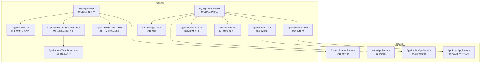

**图表来源**
- [MyApps.razor:1-221](file://src/LowCode/DesignEngine/H.LowCode.MyApp/Pages/MyApps.razor#L1-L221)
- [AppForm.razor:1-81](file://src/LowCode/DesignEngine/H.LowCode.MyApp/Pages/MyApps/AppForm.razor#L1-L81)
- [AppCreateFromTemplate.razor:1-42](file://src/LowCode/DesignEngine/H.LowCode.MyApp/Pages/MyApps/AppCreateFromTemplate.razor#L1-L42)
- [AppPopularTemplates.razor:1-100](file://src/LowCode/DesignEngine/H.LowCode.MyApp/Pages/MyApps/AppPopularTemplates.razor#L1-L100)
- [AppCreateFromAi.razor:1-218](file://src/LowCode/DesignEngine/H.LowCode.MyApp/Pages/MyApps/AppCreateFromAi.razor#L1-L218)
- [MyAppLayout.razor:1-100](file://src/LowCode/DesignEngine/H.LowCode.MyApp/Layout/MyAppLayout.razor#L1-L100)
- [AppPublish.razor:1-177](file://src/LowCode/DesignEngine/H.LowCode.MyApp/Pages/AppPublish.razor#L1-L177)
- [AppSettings.razor:1-228](file://src/LowCode/DesignEngine/H.LowCode.MyApp/Pages/AppSettings.razor#L1-L228)
- [AppMembers.razor:1-270](file://src/LowCode/DesignEngine/H.LowCode.MyApp/Pages/AppMembers.razor#L1-L270)
- [AppIntegration.razor:1-58](file://src/LowCode/DesignEngine/H.LowCode.MyApp/Pages/AppIntegration.razor#L1-L58)
- [AutoFlow.razor:1-76](file://src/LowCode/DesignEngine/H.LowCode.MyApp/Pages/AutoFlow.razor#L1-L76)
- [AppApplicationService.cs:1-67](file://src/LowCode/DesignEngine/H.LowCode.DesignEngine.Application/AppServices/AppApplicationService.cs#L1-L67)
- [MenuAppService.cs:1-40](file://src/LowCode/DesignEngine/H.LowCode.DesignEngine.Application/AppServices/MenuAppService.cs#L1-L40)
- [AppPublishAppService.cs:1-76](file://src/LowCode/DesignEngine/H.LowCode.DesignEngine.Application/AppServices/AppPublishAppService.cs#L1-L76)
- [AppRbacAppService.cs:1-72](file://src/LowCode/DesignEngine/H.LowCode.DesignEngine.Application/AppServices/AppRbacAppService.cs#L1-L72)

**章节来源**
- [MyApps.razor:1-221](file://src/LowCode/DesignEngine/H.LowCode.MyApp/Pages/MyApps.razor#L1-L221)
- [MyAppLayout.razor:1-100](file://src/LowCode/DesignEngine/H.LowCode.MyApp/Layout/MyAppLayout.razor#L1-L100)

## 核心组件
- **MyApps.razor**：应用列表页与统一入口。负责加载应用列表、展示卡片状态（开发中/已发布）、打开编辑对话框、触发创建应用和 AI 生成、另存为模板。
- **MyAppLayout.razor**：应用内布局与导航。加载应用元数据，注入 `appCascading` 上下文，并生成页面管理、菜单管理、数据源、集成、自动化、成员权限、发布、应用设置等固定导航项。
- **AppForm.razor**：应用基本信息表单。维护应用标识、名称、描述、支持平台、排序，并通过 `AppApplicationService.SaveAsync` 保存。
- **AppCreateFromTemplate.razor / AppPopularTemplates.razor**：模板创建路径。前者提供“空白应用”入口，后者展示可用模板，调用模板服务创建新应用。
- **AppCreateFromAi.razor**：AI 生成路径。根据自然语言描述调用 AI 服务生成应用、页面、菜单和数据源预览，确认后持久化。
- **AppPublish.razor**：发布页。校验版本号，调用发布服务创建发布记录并更新应用状态；支持回滚。
- **AppSettings.razor**：应用设置页。维护基础信息、访问模式、默认首页、主题色，并提供删除入口。
- **AppMembers.razor**：成员与角色管理。基于 RBAC 服务管理成员、角色和权限。
- **AppIntegration.razor / AutoFlow.razor**：集成与自动化入口页，当前以占位和能力预告为主。

**章节来源**
- [MyApps.razor:1-221](file://src/LowCode/DesignEngine/H.LowCode.MyApp/Pages/MyApps.razor#L1-L221)
- [MyAppLayout.razor:1-100](file://src/LowCode/DesignEngine/H.LowCode.MyApp/Layout/MyAppLayout.razor#L1-L100)
- [AppForm.razor:1-81](file://src/LowCode/DesignEngine/H.LowCode.MyApp/Pages/MyApps/AppForm.razor#L1-L81)
- [AppCreateFromTemplate.razor:1-42](file://src/LowCode/DesignEngine/H.LowCode.MyApp/Pages/MyApps/AppCreateFromTemplate.razor#L1-L42)
- [AppPopularTemplates.razor:1-100](file://src/LowCode/DesignEngine/H.LowCode.MyApp/Pages/MyApps/AppPopularTemplates.razor#L1-L100)
- [AppCreateFromAi.razor:1-218](file://src/LowCode/DesignEngine/H.LowCode.MyApp/Pages/MyApps/AppCreateFromAi.razor#L1-L218)
- [AppPublish.razor:1-177](file://src/LowCode/DesignEngine/H.LowCode.MyApp/Pages/AppPublish.razor#L1-L177)
- [AppSettings.razor:1-228](file://src/LowCode/DesignEngine/H.LowCode.MyApp/Pages/AppSettings.razor#L1-L228)
- [AppMembers.razor:1-270](file://src/LowCode/DesignEngine/H.LowCode.MyApp/Pages/AppMembers.razor#L1-L270)
- [AppIntegration.razor:1-58](file://src/LowCode/DesignEngine/H.LowCode.MyApp/Pages/AppIntegration.razor#L1-L58)
- [AutoFlow.razor:1-76](file://src/LowCode/DesignEngine/H.LowCode.MyApp/Pages/AutoFlow.razor#L1-L76)

## 架构总览
“我的应用”采用前后端分层架构：前端 Blazor 页面负责交互与视图状态，后端 AppService 负责领域操作和数据持久化。应用生命周期分为：
1. 创建：空白创建、模板创建、AI 生成。
2. 编排：页面、菜单、数据源、集成、自动化。
3. 管控：成员、角色、权限、访问模式。
4. 发布：版本化发布与回滚。
5. 运行：渲染引擎加载已发布应用元数据。

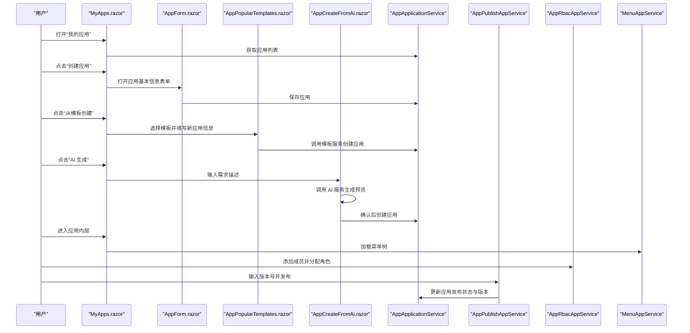

**图表来源**
- [MyApps.razor:1-221](file://src/LowCode/DesignEngine/H.LowCode.MyApp/Pages/MyApps.razor#L1-L221)
- [AppForm.razor:1-81](file://src/LowCode/DesignEngine/H.LowCode.MyApp/Pages/MyApps/AppForm.razor#L1-L81)
- [AppPopularTemplates.razor:1-100](file://src/LowCode/DesignEngine/H.LowCode.MyApp/Pages/MyApps/AppPopularTemplates.razor#L1-L100)
- [AppCreateFromAi.razor:1-218](file://src/LowCode/DesignEngine/H.LowCode.MyApp/Pages/MyApps/AppCreateFromAi.razor#L1-L218)
- [AppApplicationService.cs:1-67](file://src/LowCode/DesignEngine/H.LowCode.DesignEngine.Application/AppServices/AppApplicationService.cs#L1-L67)
- [AppPublishAppService.cs:1-76](file://src/LowCode/DesignEngine/H.LowCode.DesignEngine.Application/AppServices/AppPublishAppService.cs#L1-L76)
- [AppRbacAppService.cs:1-72](file://src/LowCode/DesignEngine/H.LowCode.DesignEngine.Application/AppServices/AppRbacAppService.cs#L1-L72)
- [MenuAppService.cs:1-40](file://src/LowCode/DesignEngine/H.LowCode.DesignEngine.Application/AppServices/MenuAppService.cs#L1-L40)

## 详细组件分析

### MyAppLayout.razor：导航结构与权限控制
MyAppLayout 是应用内页面的统一布局容器。其职责包括：
- 注入 `IAppApplicationService`，通过 `GetByIdAsync(AppId)` 加载当前应用元数据。
- 将应用元数据以级联值 `appCascading` 传递给子组件，使页面、菜单、数据源等子模块共享应用上下文。
- 初始化固定导航菜单：页面管理、菜单管理、数据源、集成、自动化、成员权限、应用发布、应用设置。
- 当前实现未对菜单项做显式权限过滤，但通过 `DefaultLayoutComponent` 渲染菜单，实际权限控制可由上层布局或路由守卫扩展。

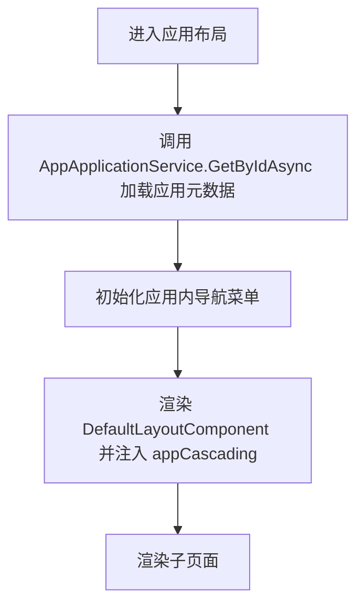

**图表来源**
- [MyAppLayout.razor:1-100](file://src/LowCode/DesignEngine/H.LowCode.MyApp/Layout/MyAppLayout.razor#L1-L100)
- [IAppApplicationService.cs:1-19](file://src/LowCode/DesignEngine/H.LowCode.DesignEngine.Application.Contracts/AppServices/IAppApplicationService.cs#L1-L19)

**章节来源**
- [MyAppLayout.razor:1-100](file://src/LowCode/DesignEngine/H.LowCode.MyApp/Layout/MyAppLayout.razor#L1-L100)

### MyApps.razor：应用列表与入口页
MyApps.razor 是“我的应用”的首页，承担以下职责：
- 展示应用卡片网格，包含应用名称、描述、发布状态、站点链接、开发入口、编辑入口、另存为模板和应用设置入口。
- 提供“创建应用”按钮，打开 `AppCreateFromTemplate` 模态框。
- 提供“AI 生成”按钮，打开 `AppCreateFromAi` 模态框。
- 提供搜索与状态筛选工具栏。
- 调用 `AppApplicationService.GetAppsAsync` 加载应用列表，并在创建、编辑成功后刷新。

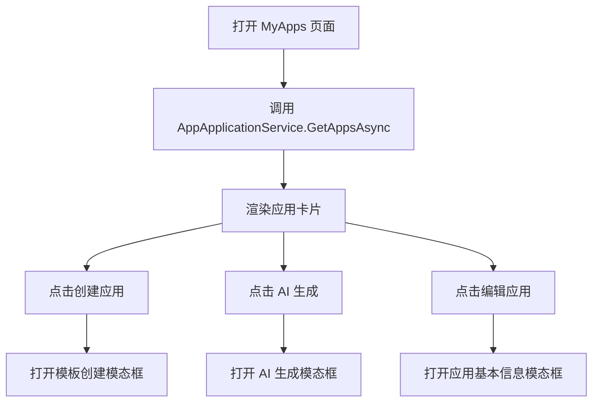

**图表来源**
- [MyApps.razor:1-221](file://src/LowCode/DesignEngine/H.LowCode.MyApp/Pages/MyApps.razor#L1-L221)

**章节来源**
- [MyApps.razor:1-221](file://src/LowCode/DesignEngine/H.LowCode.MyApp/Pages/MyApps.razor#L1-L221)

### AppForm.razor：应用基本信息表单
AppForm.razor 用于新建或编辑应用的基本信息，字段包括：
- 应用标识：唯一键，通常使用雪花短 ID。
- 应用名称与描述。
- 支持平台：Web、App、小程序。
- 排序：用于应用列表排序。

提交时调用 `AppApplicationService.SaveAsync`，成功后触发父级回调刷新列表。

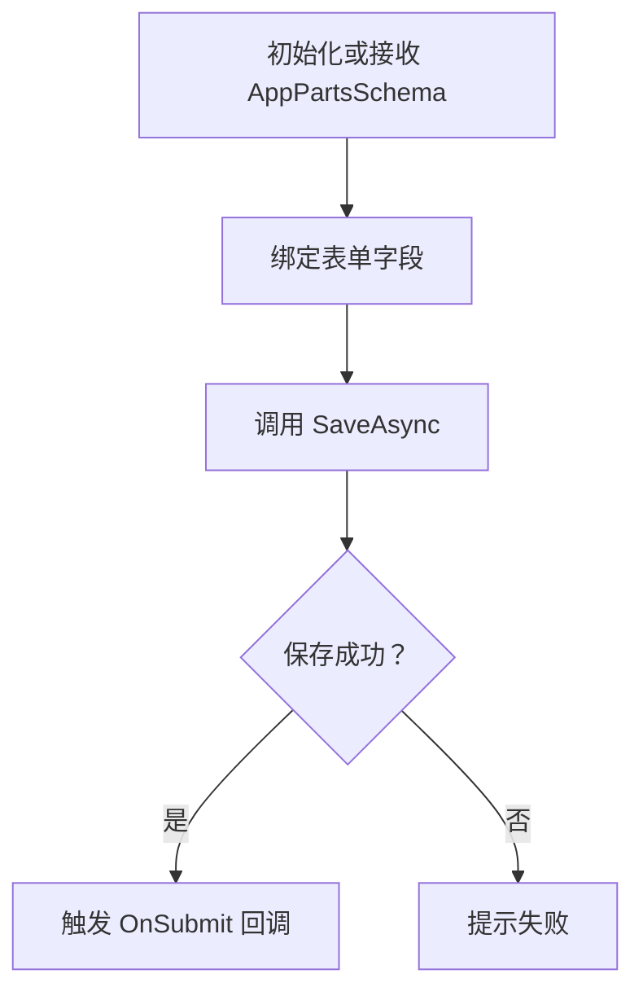

**图表来源**
- [AppForm.razor:1-81](file://src/LowCode/DesignEngine/H.LowCode.MyApp/Pages/MyApps/AppForm.razor#L1-L81)
- [AppApplicationService.cs:1-67](file://src/LowCode/DesignEngine/H.LowCode.DesignEngine.Application/AppServices/AppApplicationService.cs#L1-L67)

**章节来源**
- [AppForm.razor:1-81](file://src/LowCode/DesignEngine/H.LowCode.MyApp/Pages/MyApps/AppForm.razor#L1-L81)
- [IAppApplicationService.cs:1-19](file://src/LowCode/DesignEngine/H.LowCode.DesignEngine.Application.Contracts/AppServices/IAppApplicationService.cs#L1-L19)

### 模板创建路径：AppCreateFromTemplate.razor 与 AppPopularTemplates.razor
模板创建路径提供两种能力：
- “创建空白应用”：直接打开 `AppForm` 表单。
- “从模板创建”：打开 `AppPopularTemplates`，展示已有模板列表，用户选择模板后填写新应用标识和名称，调用模板服务创建应用并跳转到新应用的页面管理页。

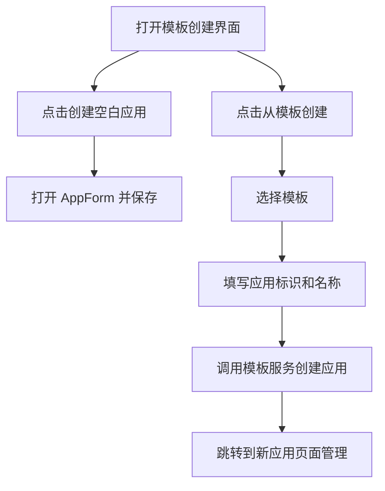

**图表来源**
- [AppCreateFromTemplate.razor:1-42](file://src/LowCode/DesignEngine/H.LowCode.MyApp/Pages/MyApps/AppCreateFromTemplate.razor#L1-L42)
- [AppPopularTemplates.razor:1-100](file://src/LowCode/DesignEngine/H.LowCode.MyApp/Pages/MyApps/AppPopularTemplates.razor#L1-L100)

**章节来源**
- [AppCreateFromTemplate.razor:1-42](file://src/LowCode/DesignEngine/H.LowCode.MyApp/Pages/MyApps/AppCreateFromTemplate.razor#L1-L42)
- [AppPopularTemplates.razor:1-100](file://src/LowCode/DesignEngine/H.LowCode.MyApp/Pages/MyApps/AppPopularTemplates.razor#L1-L100)

### AI 生成路径：AppCreateFromAi.razor
AI 生成路径允许用户用自然语言描述应用需求，系统返回生成的应用、页面、菜单和数据源预览，用户确认后创建真实应用。关键流程：
- 输入需求描述。
- 调用 AI 生成服务，显示生成结果摘要，包括数据源、页面类型与组件、菜单层级。
- 确认后调用创建接口，成功后通知并触发父级刷新。

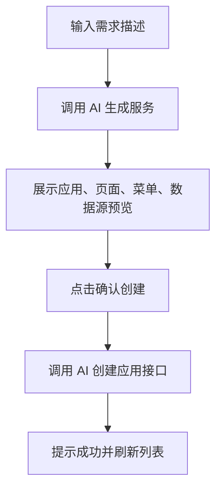

**图表来源**
- [AppCreateFromAi.razor:1-218](file://src/LowCode/DesignEngine/H.LowCode.MyApp/Pages/MyApps/AppCreateFromAi.razor#L1-L218)

**章节来源**
- [AppCreateFromAi.razor:1-218](file://src/LowCode/DesignEngine/H.LowCode.MyApp/Pages/MyApps/AppCreateFromAi.razor#L1-L218)

### 应用生命周期管理

#### 应用基本信息
通过 `AppForm.razor` 和 `AppApplicationService` 完成应用基本信息的创建与保存。应用标识作为主键，应用名称、描述、支持平台和排序构成应用元数据的核心字段。

**章节来源**
- [AppForm.razor:1-81](file://src/LowCode/DesignEngine/H.LowCode.MyApp/Pages/MyApps/AppForm.razor#L1-L81)
- [AppApplicationService.cs:1-67](file://src/LowCode/DesignEngine/H.LowCode.DesignEngine.Application/AppServices/AppApplicationService.cs#L1-L67)

#### 页面管理与菜单管理
- 页面管理由应用内导航中的“页面管理”入口进入，具体页面在后续开发中承载页面建模、组件树与数据绑定。
- 菜单管理通过 `MenuAppService` 提供菜单的增删改查，按应用维度隔离。

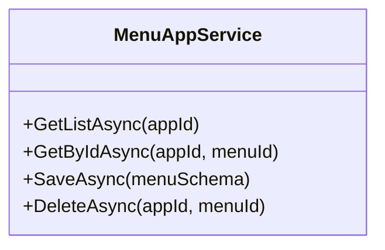

**图表来源**
- [MenuAppService.cs:1-40](file://src/LowCode/DesignEngine/H.LowCode.DesignEngine.Application/AppServices/MenuAppService.cs#L1-L40)

**章节来源**
- [MyAppLayout.razor:1-100](file://src/LowCode/DesignEngine/H.LowCode.MyApp/Layout/MyAppLayout.razor#L1-L100)
- [MenuAppService.cs:1-40](file://src/LowCode/DesignEngine/H.LowCode.DesignEngine.Application/AppServices/MenuAppService.cs#L1-L40)

#### 数据源管理
应用内导航提供“数据源”入口，用于管理应用的数据模型与连接。数据源与应用解耦，但受应用上下文约束，确保不同应用的数据模型互不干扰。

**章节来源**
- [MyAppLayout.razor:1-100](file://src/LowCode/DesignEngine/H.LowCode.MyApp/Layout/MyAppLayout.razor#L1-L100)

#### 发布流程：AppPublish.razor
发布流程负责：
- 校验版本号。
- 调用 `AppPublishAppService.PublishAsync` 创建发布记录。
- 更新应用发布状态为“已发布”，并写入版本号。
- 展示发布历史，支持回滚到开发状态。

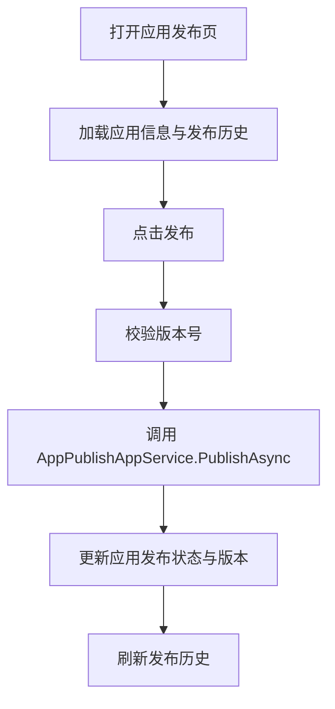

**图表来源**
- [AppPublish.razor:1-177](file://src/LowCode/DesignEngine/H.LowCode.MyApp/Pages/AppPublish.razor#L1-L177)
- [AppPublishAppService.cs:1-76](file://src/LowCode/DesignEngine/H.LowCode.DesignEngine.Application/AppServices/AppPublishAppService.cs#L1-L76)

**章节来源**
- [AppPublish.razor:1-177](file://src/LowCode/DesignEngine/H.LowCode.MyApp/Pages/AppPublish.razor#L1-L177)
- [AppPublishAppService.cs:1-76](file://src/LowCode/DesignEngine/H.LowCode.DesignEngine.Application/AppServices/AppPublishAppService.cs#L1-L76)

#### 应用设置：AppSettings.razor
应用设置页提供：
- 基础信息：名称、图标、描述、版本、支持平台。
- 访问控制：公开访问、登录后可访问、仅应用成员可访问。
- 默认首页：从应用页面中选择。
- 外观主题：预设主题色。
- 危险操作：删除应用。

**章节来源**
- [AppSettings.razor:1-228](file://src/LowCode/DesignEngine/H.LowCode.MyApp/Pages/AppSettings.razor#L1-L228)

#### 成员权限：AppMembers.razor 与 AppRbacAppService
成员权限模块通过 RBAC 模型管理应用内成员与角色：
- 内置默认角色：管理员、普通成员、只读访客，在未保存时临时返回。
- 成员管理：添加、编辑、移除成员并分配角色。
- 角色管理：新增、编辑、删除自定义角色，内置角色不可删除。
- 权限点：应用管理、页面查看、数据读取、数据写入。

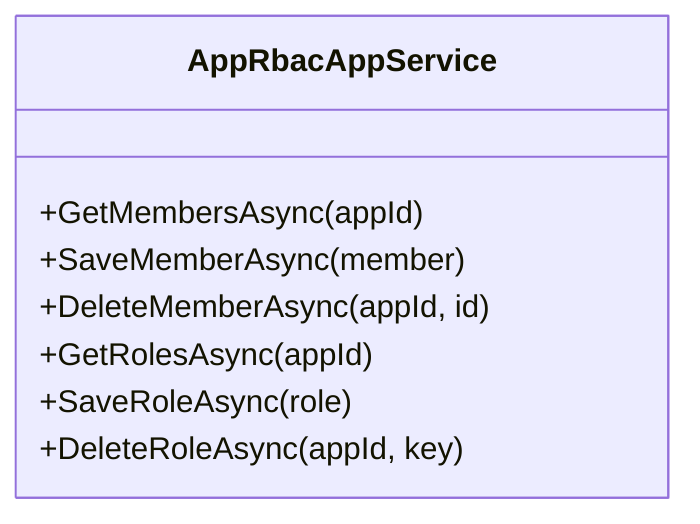

**图表来源**
- [AppRbacAppService.cs:1-72](file://src/LowCode/DesignEngine/H.LowCode.DesignEngine.Application/AppServices/AppRbacAppService.cs#L1-L72)

**章节来源**
- [AppMembers.razor:1-270](file://src/LowCode/DesignEngine/H.LowCode.MyApp/Pages/AppMembers.razor#L1-L270)
- [AppRbacAppService.cs:1-72](file://src/LowCode/DesignEngine/H.LowCode.DesignEngine.Application/AppServices/AppRbacAppService.cs#L1-L72)

#### 集成配置：AppIntegration.razor
集成页当前提供能力入口与说明，包括审批流、开放 API、Webhook、第三方登录等，启用状态以本地状态模拟，后续版本开放配置能力。

**章节来源**
- [AppIntegration.razor:1-58](file://src/LowCode/DesignEngine/H.LowCode.MyApp/Pages/AppIntegration.razor#L1-L58)

#### 自动工作流：AutoFlow.razor
自动化流程页提供模板入口，如定时任务、数据触发器、消息通知，当前处于能力预告阶段，后续开放编排器。

**章节来源**
- [AutoFlow.razor:1-76](file://src/LowCode/DesignEngine/H.LowCode.MyApp/Pages/AutoFlow.razor#L1-L76)

## 依赖关系分析
“我的应用”模块依赖以下服务边界：
- **AppApplicationService**：应用元数据 CRUD。对外暴露获取所有应用、按应用获取、保存、删除。
- **MenuAppService**：菜单树管理。按应用维度查询、保存、删除菜单。
- **AppPublishAppService**：发布版本控制。创建发布记录、更新应用发布状态、回滚。
- **AppRbacAppService**：RBAC 权限分配。成员与角色管理，内置角色兜底。

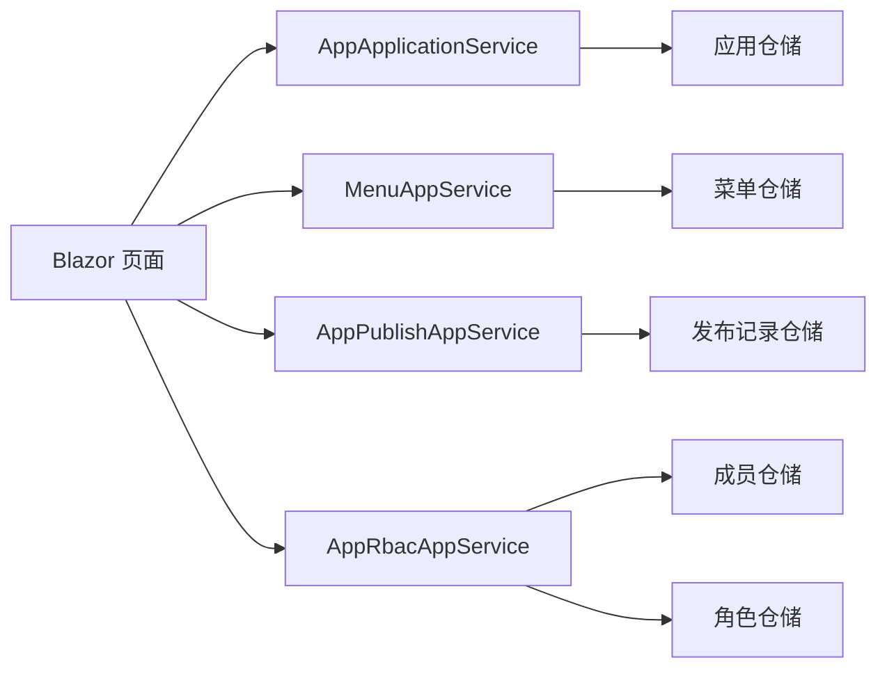

**图表来源**
- [AppApplicationService.cs:1-67](file://src/LowCode/DesignEngine/H.LowCode.DesignEngine.Application/AppServices/AppApplicationService.cs#L1-L67)
- [MenuAppService.cs:1-40](file://src/LowCode/DesignEngine/H.LowCode.DesignEngine.Application/AppServices/MenuAppService.cs#L1-L40)
- [AppPublishAppService.cs:1-76](file://src/LowCode/DesignEngine/H.LowCode.DesignEngine.Application/AppServices/AppPublishAppService.cs#L1-L76)
- [AppRbacAppService.cs:1-72](file://src/LowCode/DesignEngine/H.LowCode.DesignEngine.Application/AppServices/AppRbacAppService.cs#L1-L72)

**章节来源**
- [IAppApplicationService.cs:1-19](file://src/LowCode/DesignEngine/H.LowCode.DesignEngine.Application.Contracts/AppServices/IAppApplicationService.cs#L1-L19)
- [AppApplicationService.cs:1-67](file://src/LowCode/DesignEngine/H.LowCode.DesignEngine.Application/AppServices/AppApplicationService.cs#L1-L67)
- [MenuAppService.cs:1-40](file://src/LowCode/DesignEngine/H.LowCode.DesignEngine.Application/AppServices/MenuAppService.cs#L1-L40)
- [AppPublishAppService.cs:1-76](file://src/LowCode/DesignEngine/H.LowCode.DesignEngine.Application/AppServices/AppPublishAppService.cs#L1-L76)
- [AppRbacAppService.cs:1-72](file://src/LowCode/DesignEngine/H.LowCode.DesignEngine.Application/AppServices/AppRbacAppService.cs#L1-L72)

## 性能与可扩展性
- 应用列表分页与排序：当前 `AppApplicationService.GetAppsAsync` 按排序字段排序并返回应用列表，可在数据量较大时增加分页参数。
- 菜单树加载：`MenuAppService` 按需按应用加载菜单，避免跨应用耦合。
- 发布幂等性：发布流程应保证同一版本号多次发布的幂等处理，避免重复记录。
- 缓存策略：应用元数据与菜单树可在渲染引擎侧进行短期缓存，减少频繁请求。
- 可扩展点：
  - 在 `MyAppLayout` 中增加菜单权限过滤逻辑。
  - 在 `AppIntegration` 与 `AutoFlow` 接入真实配置与编排服务。
  - 在 `AppSettings` 中扩展更多访问控制策略与多租户隔离选项。

[本节为通用建议，不涉及具体文件分析]

## 故障排查
- 创建应用失败：检查 `AppForm` 是否填写必填字段，确认 `AppApplicationService.SaveAsync` 返回成功。
- 模板创建失败：确认模板存在且应用标识唯一，检查 `AppPopularTemplates` 的错误提示。
- AI 生成失败：检查描述是否为空，查看异常信息并重试。
- 发布失败：确认版本号非空，检查发布记录是否存在。
- 回滚失败：确认发布记录存在且状态为已发布。
- 成员权限异常：检查角色是否为内置角色，内置角色不可删除；确认成员关联的角色存在。

**章节来源**
- [AppForm.razor:1-81](file://src/LowCode/DesignEngine/H.LowCode.MyApp/Pages/MyApps/AppForm.razor#L1-L81)
- [AppPopularTemplates.razor:1-100](file://src/LowCode/DesignEngine/H.LowCode.MyApp/Pages/MyApps/AppPopularTemplates.razor#L1-L100)
- [AppCreateFromAi.razor:1-218](file://src/LowCode/DesignEngine/H.LowCode.MyApp/Pages/MyApps/AppCreateFromAi.razor#L1-L218)
- [AppPublish.razor:1-177](file://src/LowCode/DesignEngine/H.LowCode.MyApp/Pages/AppPublish.razor#L1-L177)
- [AppMembers.razor:1-270](file://src/LowCode/DesignEngine/H.LowCode.MyApp/Pages/AppMembers.razor#L1-L270)

## 结论
“我的应用”模块围绕应用元数据展开，提供从创建到发布的完整生命周期管理。MyAppLayout 提供应用内导航，MyApps 提供入口与列表，AppForm 管理基本信息，模板与 AI 两条路径满足多样化创建场景。发布流程通过版本化记录保障可追溯，RBAC 成员权限模块提供细粒度访问控制。集成与自动化目前以能力入口为主，后续可接入真实编排与外部系统。在多租户或企业场景中，可通过应用标识、访问模式和成员角色实现应用隔离与权限控制，并结合渲染引擎加载已发布应用元数据进行运行。

[本节为总结性内容，不涉及具体文件分析]