# 数据源绑定

<cite>
**本文引用的文件**   
- [IDataSourceAppService.cs](file://src/src/LowCode/DesignEngine/H.LowCode.DesignEngine.Application.Contracts/AppServices/IDataSourceAppService.cs)
- [DataSourceAppService.cs](file://src/src/LowCode/DesignEngine/H.LowCode.DesignEngine.Application/AppServices/DataSourceAppService.cs)
- [ITableDataAppService.cs](file://src/src/LowCode/Common/H.LowCode.Application.Contracts/AppServices/ITableDataAppService.cs)
- [TableDataAppService.cs（设计引擎）](file://src/src/LowCode/DesignEngine/H.LowCode.DesignEngine.Application/AppServices/TableDataAppService.cs)
- [TableDataAppService.cs（渲染引擎）](file://src/src/LowCode/RenderEngine/H.LowCode.RenderEngine.Application/DataAppServices/TableDataAppService.cs)
- [ComponentDataSourceSchema.cs](file://src/src/LowCode/Common/H.LowCode.MetaSchema/DataSourceSchemas/ComponentDataSourceSchema.cs)
- [ListDataSourceSchema.cs](file://src/src/LowCode/Common/H.LowCode.MetaSchema/DataSourceSchemas/ListDataSourceSchema.cs)
- [APIDataSourceSchema.cs](file://src/src/LowCode/Common/H.LowCode.MetaSchema/DataSourceSchemas/APIDataSourceSchema.cs)
- [DataSourceSchema.cs](file://src/src/LowCode/Common/H.LowCode.MetaSchema/DataSourceSchema.cs)
- [LcTable.razor](file://src/src/LowCode/Common/H.LowCode.Components/Components/LcTable.razor)
- [RenderEngineDynamicComponentBase.cs](file://src/src/LowCode/RenderEngine/H.LowCode.RenderEngineBase/RenderEngineDynamicComponentBase.cs)
- [HttpClientProxyInterceptor.cs](file://src/src/Utils/H.Abp.HttpClientProxy/HttpClientProxyInterceptor.cs)
- [AbpUrlConvention.cs](file://src/src/Utils/H.Abp.HttpClientProxy/AbpUrlConvention.cs)
- [RemoteServiceOptions.cs](file://src/src/Utils/H.Abp.HttpClientProxy/RemoteServiceOptions.cs)
- [ICrudAppService.cs](file://src/src/Utils/H.Abp.Application.Contracts/ICrudAppService.cs)
- [PagedResultRequestDto.cs](file://src/src/Utils/H.Abp.Application.Contracts/PagedResultRequestDto.cs)
- [PagedAndSortedResultRequestDto.cs](file://src/src/Utils/H.Abp.Application.Contracts/PagedAndSortedResultRequestDto.cs)
- [PagedResultDto.cs](file://src/src/Utils/H.Abp.Application.Contracts/PagedResultDto.cs)
- [H.Abp.Application.Contracts/IAppService.cs](file://src/src/Utils/H.Abp.Application.Contracts/IAppService.cs)
</cite>

## 目录

1. [引言](#引言)
2. [项目结构与定位](#项目结构与定位)
3. [核心组件总览](#核心组件总览)
4. [架构与数据流](#架构与数据流)
5. [数据源类型与模型](#数据源类型与模型)
6. [数据源管理：DataSourceAppService](#数据源管理datasourceappservice)
7. [表格数据查询：TableDataAppService](#表格数据查询tabledataappservice)
8. [前端解析与绑定流程](#前端解析与绑定流程)
9. [数据源选择与表单校验](#数据源选择与表单校验)
10. [完整示例：创建表数据源并实现分页搜索](#完整示例创建表数据源并实现分页搜索)
11. [依赖关系分析](#依赖关系分析)
12. [性能优化建议](#性能优化建议)
13. [故障排查](#故障排查)
14. [结论](#结论)

## 引言

本文件围绕低代码设计引擎与渲染引擎中的“数据源绑定”能力展开，重点说明以下内容：

- 设计引擎如何提供数据源的增删改查能力。
- 渲染引擎如何根据页面 Schema 中的 dataSource 配置执行分页、筛选、排序查询。
- 三种主要数据源类型的职责边界：固定列表、API 数据源、SQL 数据源。
- 从页面 Schema 到表格列、下拉选项、表单字段的数据映射路径。
- TableDataSourceSelector 如何选择已定义数据源，以及新增数据源时的校验点。
- 结合 HttpClientProxy 和后端 IAppService 的远程调用机制。
- 面向列表渲染、缓存、N+1 查询等场景的性能建议。

## 项目结构与定位

数据源绑定涉及三个关键区域：

| 区域 | 职责 | 典型位置 |
|---|---|---|
| 设计引擎应用层 | 定义数据源元数据的 CRUD 接口与实现；提供设计器可用的数据源管理能力 | `H.LowCode.DesignEngine.Application` |
| 公共契约与元数据 | 定义数据源抽象、分页请求响应、通用 AppService 契约 | `H.LowCode.Common.H.LowCode.Application.Contracts`、`H.LowCode.Common.H.LowCode.MetaSchema` |
| 渲染引擎应用层 | 在运行时解析页面 Schema，把 dataSource 转换为实际数据请求，并把结果交给组件渲染 | `H.LowCode.RenderEngine.Application` |

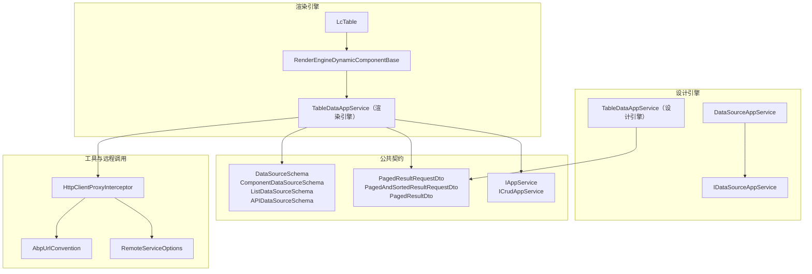

**图表来源**
- [DataSourceAppService.cs](file://src/src/LowCode/DesignEngine/H.LowCode.DesignEngine.Application/AppServices/DataSourceAppService.cs)
- [IDataSourceAppService.cs](file://src/src/LowCode/DesignEngine/H.LowCode.DesignEngine.Application.Contracts/AppServices/IDataSourceAppService.cs)
- [TableDataAppService.cs（设计引擎）](file://src/src/LowCode/DesignEngine/H.LowCode.DesignEngine.Application/AppServices/TableDataAppService.cs)
- [TableDataAppService.cs（渲染引擎）](file://src/src/LowCode/RenderEngine/H.LowCode.RenderEngine.Application/DataAppServices/TableDataAppService.cs)
- [ComponentDataSourceSchema.cs](file://src/src/LowCode/Common/H.LowCode.MetaSchema/DataSourceSchemas/ComponentDataSourceSchema.cs)
- [ListDataSourceSchema.cs](file://src/src/LowCode/Common/H.LowCode.MetaSchema/DataSourceSchemas/ListDataSourceSchema.cs)
- [APIDataSourceSchema.cs](file://src/src/LowCode/Common/H.LowCode.MetaSchema/DataSourceSchemas/APIDataSourceSchema.cs)
- [DataSourceSchema.cs](file://src/src/LowCode/Common/H.LowCode.MetaSchema/DataSourceSchema.cs)
- [HttpClientProxyInterceptor.cs](file://src/src/Utils/H.Abp.HttpClientProxy/HttpClientProxyInterceptor.cs)
- [AbpUrlConvention.cs](file://src/src/Utils/H.Abp.HttpClientProxy/AbpUrlConvention.cs)
- [RemoteServiceOptions.cs](file://src/src/Utils/H.Abp.HttpClientProxy/RemoteServiceOptions.cs)

**章节来源**
- [IDataSourceAppService.cs](file://src/src/LowCode/DesignEngine/H.LowCode.DesignEngine.Application.Contracts/AppServices/IDataSourceAppService.cs)
- [DataSourceAppService.cs](file://src/src/LowCode/DesignEngine/H.LowCode.DesignEngine.Application/AppServices/DataSourceAppService.cs)
- [ITableDataAppService.cs](file://src/src/LowCode/Common/H.LowCode.Application.Contracts/AppServices/ITableDataAppService.cs)
- [TableDataAppService.cs（设计引擎）](file://src/src/LowCode/DesignEngine/H.LowCode.DesignEngine.Application/AppServices/TableDataAppService.cs)
- [TableDataAppService.cs（渲染引擎）](file://src/src/LowCode/RenderEngine/H.LowCode.RenderEngine.Application/DataAppServices/TableDataAppService.cs)
- [ComponentDataSourceSchema.cs](file://src/src/LowCode/Common/H.LowCode.MetaSchema/DataSourceSchemas/ComponentDataSourceSchema.cs)
- [ListDataSourceSchema.cs](file://src/src/LowCode/Common/H.LowCode.MetaSchema/DataSourceSchemas/ListDataSourceSchema.cs)
- [APIDataSourceSchema.cs](file://src/src/LowCode/Common/H.LowCode.MetaSchema/DataSourceSchemas/APIDataSourceSchema.cs)
- [DataSourceSchema.cs](file://src/src/LowCode/Common/H.LowCode.MetaSchema/DataSourceSchema.cs)

## 核心组件总览

| 组件 | 类型 | 主要职责 | 关键输入 | 关键输出 |
|---|---|---|---|---|
| `IDataSourceAppService` | 设计引擎接口 | 暴露数据源元数据的统一操作契约 | 数据源实体或 DTO | 数据源列表、详情、创建、更新、删除结果 |
| `DataSourceAppService` | 设计引擎服务 | 实现数据源 CRUD，通常基于仓储或远程数据源存储 | 数据源对象 | 标准 CRUD 响应 |
| `ITableDataAppService` | 公共契约接口 | 定义表格数据查询的统一分页 API | 分页、排序、筛选参数 | 分页结果 |
| `TableDataAppService（设计引擎）` | 设计时服务 | 为设计器预览、调试、验证数据源提供查询能力 | 数据源标识 + 查询条件 | 分页数据 |
| `TableDataAppService（渲染引擎）` | 运行时服务 | 根据页面 dataSource 配置执行真实查询 | 页面上下文、dataSource 配置、分页参数 | 表格数据、总数、状态 |
| `ComponentDataSourceSchema / ListDataSourceSchema / APIDataSourceSchema` | 元数据模型 | 描述组件级数据源、固定列表、API 数据源的配置结构 | JSON Schema / C# 类 | 可序列化的配置对象 |
| `LcTable` | 前端组件 | 展示分页表格，触发加载、翻页、搜索、排序 | 数据源绑定、列定义、查询参数 | 渲染后的表格 UI |
| `RenderEngineDynamicComponentBase` | 渲染基类 | 解析动态组件属性，包括 dataSource | 组件属性字典、页面 Schema | 组件可用数据 |
| `HttpClientProxyInterceptor` | HTTP 代理拦截器 | 将远程 IAppService 调用转为 HTTP 请求 | Abp 服务契约、URL 约定、远程选项 | HTTP 响应 |

**章节来源**
- [IDataSourceAppService.cs](file://src/src/LowCode/DesignEngine/H.LowCode.DesignEngine.Application.Contracts/AppServices/IDataSourceAppService.cs)
- [DataSourceAppService.cs](file://src/src/LowCode/DesignEngine/H.LowCode.DesignEngine.Application/AppServices/DataSourceAppService.cs)
- [ITableDataAppService.cs](file://src/src/LowCode/Common/H.LowCode.Application.Contracts/AppServices/ITableDataAppService.cs)
- [TableDataAppService.cs（设计引擎）](file://src/src/LowCode/DesignEngine/H.LowCode.DesignEngine.Application/AppServices/TableDataAppService.cs)
- [TableDataAppService.cs（渲染引擎）](file://src/src/LowCode/RenderEngine/H.LowCode.RenderEngine.Application/DataAppServices/TableDataAppService.cs)
- [ComponentDataSourceSchema.cs](file://src/src/LowCode/Common/H.LowCode.MetaSchema/DataSourceSchemas/ComponentDataSourceSchema.cs)
- [ListDataSourceSchema.cs](file://src/src/LowCode/Common/H.LowCode.MetaSchema/DataSourceSchemas/ListDataSourceSchema.cs)
- [APIDataSourceSchema.cs](file://src/src/LowCode/Common/H.LowCode.MetaSchema/DataSourceSchemas/APIDataSourceSchema.cs)
- [LcTable.razor](file://src/src/LowCode/Common/H.LowCode.Components/Components/LcTable.razor)
- [RenderEngineDynamicComponentBase.cs](file://src/src/LowCode/RenderEngine/H.LowCode.RenderEngineBase/RenderEngineDynamicComponentBase.cs)

## 架构与数据流

数据源绑定的整体流程可以分为两条主线：

1. **设计期数据源管理**：通过 `IDataSourceAppService` 与 `DataSourceAppService` 完成数据源定义的持久化。
2. **运行期数据查询**：通过页面 Schema 中的 dataSource 配置，由渲染引擎的 `TableDataAppService` 执行查询，并将结果交给 `LcTable` 或其他组件显示。

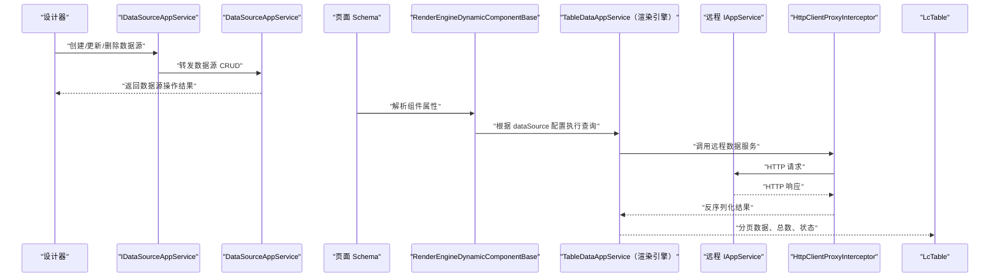

**图表来源**
- [IDataSourceAppService.cs](file://src/src/LowCode/DesignEngine/H.LowCode.DesignEngine.Application.Contracts/AppServices/IDataSourceAppService.cs)
- [DataSourceAppService.cs](file://src/src/LowCode/DesignEngine/H.LowCode.DesignEngine.Application/AppServices/DataSourceAppService.cs)
- [TableDataAppService.cs（渲染引擎）](file://src/src/LowCode/RenderEngine/H.LowCode.RenderEngine.Application/DataAppServices/TableDataAppService.cs)
- [HttpClientProxyInterceptor.cs](file://src/src/Utils/H.Abp.HttpClientProxy/HttpClientProxyInterceptor.cs)
- [AbpUrlConvention.cs](file://src/src/Utils/H.Abp.HttpClientProxy/AbpUrlConvention.cs)
- [RemoteServiceOptions.cs](file://src/src/Utils/H.Abp.HttpClientProxy/RemoteServiceOptions.cs)
- [LcTable.razor](file://src/src/LowCode/Common/H.LowCode.Components/Components/LcTable.razor)
- [RenderEngineDynamicComponentBase.cs](file://src/src/LowCode/RenderEngine/H.LowCode.RenderEngineBase/RenderEngineDynamicComponentBase.cs)

## 数据源类型与模型

### 数据源抽象

所有数据源都继承自统一的元数据基类，用于表达“这个数据从哪里来”。常见字段包括数据源名称、标识、启用状态、备注等。不同子类型则扩展各自的查询方式：

- 固定列表：直接提供静态选项。
- API 数据源：通过远程 API 获取数据。
- SQL 数据源：通过 SQL 或后端表查询获取数据。

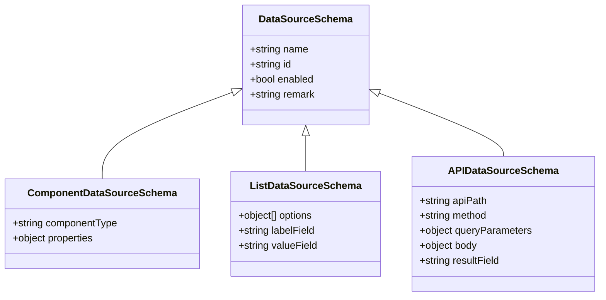

**图表来源**
- [DataSourceSchema.cs](file://src/src/LowCode/Common/H.LowCode.MetaSchema/DataSourceSchema.cs)
- [ComponentDataSourceSchema.cs](file://src/src/LowCode/Common/H.LowCode.MetaSchema/DataSourceSchemas/ComponentDataSourceSchema.cs)
- [ListDataSourceSchema.cs](file://src/src/LowCode/Common/H.LowCode.MetaSchema/DataSourceSchemas/ListDataSourceSchema.cs)
- [APIDataSourceSchema.cs](file://src/src/LowCode/Common/H.LowCode.MetaSchema/DataSourceSchemas/APIDataSourceSchema.cs)

### 固定列表数据源

固定列表适合小型、稳定、不需要远端同步的选项集合，例如状态枚举、颜色列表、简单下拉项。

| 配置项 | 含义 | 典型值 |
|---|---|---|
| `options` | 固定选项数组 | `[{"label":"A","value":1}, {"label":"B","value":2}]` |
| `labelField` | 显示字段 | `label` |
| `valueField` | 值字段 | `value` |

优点：无需网络请求，渲染速度快。  
限制：无法承载大数据量，不适合频繁变化的业务数据。

### API 数据源

API 数据源通过远程服务获取数据，适合需要权限控制、实时数据、跨系统集成的场景。

| 配置项 | 含义 | 典型值 |
|---|---|---|
| `apiPath` | 远程接口路径 | `/api/app/order/list` |
| `method` | HTTP 方法 | `GET`、`POST` |
| `queryParameters` | 查询参数模板 | `{status: "$status", keyword: "$keyword"}` |
| `body` | 请求体模板 | 适用于 POST/PUT |
| `resultField` | 结果字段映射 | `items`、`rows` |

查询参数支持将前端控件的值注入，例如用户输入的关键词、当前页码、排序字段。

### SQL 数据源

SQL 数据源在仓库中对应的是“通过后端表或 SQL 能力获取数据”的数据源类型。其典型实现包括：

- `SQLForOptionDataSource`：用于下拉、复选框等选项型控件。
- `TableDataSource`：用于表格分页数据。

共同特征：

- 不鼓励在前端拼接 SQL。
- 应通过后端服务进行权限校验、参数转义、分页处理。
- 返回结构应与 `PagedResultDto` 保持一致。

### 分页模型

系统使用 ABP 风格的分页模型：

| 模型 | 用途 | 关键字段 |
|---|---|---|
| `PagedResultRequestDto` | 基础分页请求 | `skipCount`、`maxResultCount` |
| `PagedAndSortedResultRequestDto` | 分页加排序请求 | `sorting`、`orderBy` |
| `PagedResultDto` | 分页响应 | `items`、`totalCount` |

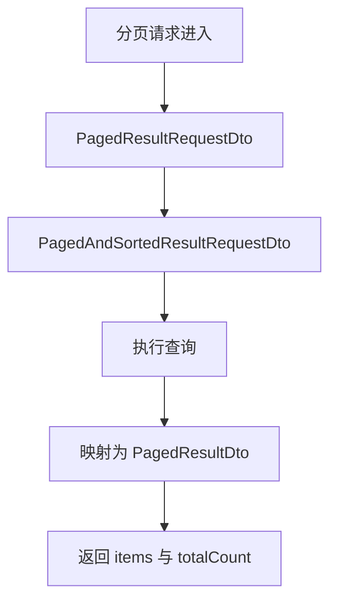

**图表来源**
- [PagedResultRequestDto.cs](file://src/src/Utils/H.Abp.Application.Contracts/PagedResultRequestDto.cs)
- [PagedAndSortedResultRequestDto.cs](file://src/src/Utils/H.Abp.Application.Contracts/PagedAndSortedResultRequestDto.cs)
- [PagedResultDto.cs](file://src/src/Utils/H.Abp.Application.Contracts/PagedResultDto.cs)

**章节来源**
- [DataSourceSchema.cs](file://src/src/LowCode/Common/H.LowCode.MetaSchema/DataSourceSchema.cs)
- [ComponentDataSourceSchema.cs](file://src/src/LowCode/Common/H.LowCode.MetaSchema/DataSourceSchemas/ComponentDataSourceSchema.cs)
- [ListDataSourceSchema.cs](file://src/src/LowCode/Common/H.LowCode.MetaSchema/DataSourceSchemas/ListDataSourceSchema.cs)
- [APIDataSourceSchema.cs](file://src/src/LowCode/Common/H.LowCode.MetaSchema/DataSourceSchemas/APIDataSourceSchema.cs)
- [PagedResultRequestDto.cs](file://src/src/Utils/H.Abp.Application.Contracts/PagedResultRequestDto.cs)
- [PagedAndSortedResultRequestDto.cs](file://src/src/Utils/H.Abp.Application.Contracts/PagedAndSortedResultRequestDto.cs)
- [PagedResultDto.cs](file://src/src/Utils/H.Abp.Application.Contracts/PagedResultDto.cs)

## 数据源管理：DataSourceAppService

`DataSourceAppService` 是设计引擎中负责数据源管理的核心服务。它对外暴露的能力可以理解为“数据源元数据的 CRUD”，而不是表格数据的查询。

### 主要职责

- 创建数据源：保存数据源名称、类型、配置、权限标记等。
- 读取数据源：按 ID 或条件查询某个数据源的定义。
- 更新数据源：修改数据源配置，如 API 路径、SQL 语句、选项列表。
- 删除数据源：删除不再使用的数据源定义。
- 校验数据源：在保存前检查配置是否合法。

### 与 IDataSourceAppService 的关系

`IDataSourceAppService` 是设计引擎暴露给设计器的接口契约，`DataSourceAppService` 是其具体实现。这样设计的好处是：

- 设计器只依赖接口，不依赖具体仓储或服务实现。
- 可以在不同环境替换数据源存储方式，例如本地 JSON、远程数据库、远程服务。
- 便于单元测试与 Mock。

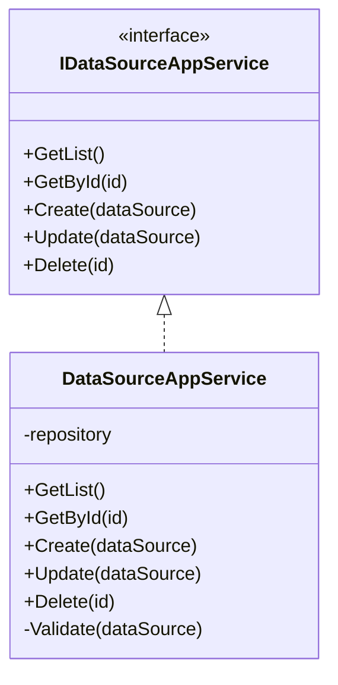

**图表来源**
- [IDataSourceAppService.cs](file://src/src/LowCode/DesignEngine/H.LowCode.DesignEngine.Application.Contracts/AppServices/IDataSourceAppService.cs)
- [DataSourceAppService.cs](file://src/src/LowCode/DesignEngine/H.LowCode.DesignEngine.Application/AppServices/DataSourceAppService.cs)

### 校验规则建议

新增或更新数据源时，应至少校验以下规则：

| 数据源类型 | 校验项 | 失败原因 |
|---|---|---|
| 固定列表 | `options` 非空 | 没有选项 |
| 固定列表 | `labelField`、`valueField` 存在 | 无法映射显示值 |
| API 数据源 | `apiPath` 非空且格式正确 | 缺少或非法路径 |
| API 数据源 | HTTP 方法合法 | 不支持的方法 |
| API 数据源 | 权限标记有效 | 未授权访问 |
| SQL 数据源 | SQL 语句非空 | 缺少 SQL |
| SQL 数据源 | SQL 语法合法 | 语法错误 |
| SQL 数据源 | 权限与数据范围可控 | 安全风险 |

**章节来源**
- [IDataSourceAppService.cs](file://src/src/LowCode/DesignEngine/H.LowCode.DesignEngine.Application.Contracts/AppServices/IDataSourceAppService.cs)
- [DataSourceAppService.cs](file://src/src/LowCode/DesignEngine/H.LowCode.DesignEngine.Application/AppServices/DataSourceAppService.cs)

## 表格数据查询：TableDataAppService

`TableDataAppService` 有两个重要角色：

1. **设计引擎中的版本**：供设计器预览数据源，验证分页、排序、筛选是否能正常工作。
2. **渲染引擎中的版本**：供运行时页面根据 dataSource 配置真正发起数据查询。

### 设计引擎中的 TableDataAppService

它主要用于：

- 根据数据源 ID 查找已定义的数据源。
- 将前端传入的分页参数转换为后端可接受的分页请求。
- 调用对应的数据源处理器。
- 返回符合 `PagedResultDto` 的结果。

### 渲染引擎中的 TableDataAppService

它主要负责：

- 接收页面组件传过来的 dataSource 配置。
- 判断数据源类型。
- 构造查询参数。
- 调用远程 IAppService 或直接查询数据。
- 将结果映射为表格需要的数据结构。
- 向 LcTable 返回数据、总数和加载状态。

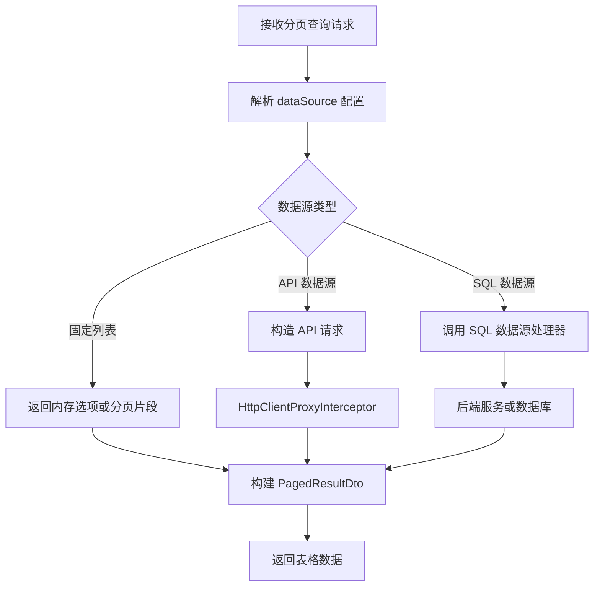

**图表来源**
- [TableDataAppService.cs（设计引擎）](file://src/src/LowCode/DesignEngine/H.LowCode.DesignEngine.Application/AppServices/TableDataAppService.cs)
- [TableDataAppService.cs（渲染引擎）](file://src/src/LowCode/RenderEngine/H.LowCode.RenderEngine.Application/DataAppServices/TableDataAppService.cs)
- [HttpClientProxyInterceptor.cs](file://src/src/Utils/H.Abp.HttpClientProxy/HttpClientProxyInterceptor.cs)
- [PagedResultDto.cs](file://src/src/Utils/H.Abp.Application.Contracts/PagedResultDto.cs)

### 支持的查询能力

| 能力 | 前端参数 | 后端处理 |
|---|---|---|
| 分页 | `page`、`pageSize` 或 `skipCount`、`maxResultCount` | 转换为 `PagedResultRequestDto` |
| 排序 | `sortField`、`sortOrder` 或 `sorting` | 转换为 `PagedAndSortedResultRequestDto` |
| 筛选 | `filters`、`keyword`、自定义字段 | 注入到查询条件 |
| 数据映射 | `resultField`、列映射 | 将 API/SQL 返回字段映射为标准结果 |

**章节来源**
- [TableDataAppService.cs（设计引擎）](file://src/src/LowCode/DesignEngine/H.LowCode.DesignEngine.Application/AppServices/TableDataAppService.cs)
- [TableDataAppService.cs（渲染引擎）](file://src/src/LowCode/RenderEngine/H.LowCode.RenderEngine.Application/DataAppServices/TableDataAppService.cs)
- [PagedResultRequestDto.cs](file://src/src/Utils/H.Abp.Application.Contracts/PagedResultRequestDto.cs)
- [PagedAndSortedResultRequestDto.cs](file://src/src/Utils/H.Abp.Application.Contracts/PagedAndSortedResultRequestDto.cs)
- [PagedResultDto.cs](file://src/src/Utils/H.Abp.Application.Contracts/PagedResultDto.cs)

## 前端解析与绑定流程

### 页面 Schema 中的 dataSource

页面 Schema 会在组件属性中声明 dataSource，例如：

- 表格组件：绑定表数据源。
- 下拉组件：绑定固定列表或 API 数据源。
- 表单字段：绑定字典、枚举或远程选项。

Schema 中通常包含：

- `type`：数据源类型。
- `id`：已定义数据源 ID。
- `config`：数据源配置，如 API 路径、SQL、选项数组。
- `mapping`：字段映射。
- `pagination`：是否分页、每页大小。
- `filters`：默认筛选条件。

### RenderEngineDynamicComponentBase 的解析

`RenderEngineDynamicComponentBase` 是渲染引擎中动态组件的基础类，它会：

1. 读取组件属性。
2. 识别 dataSource 配置。
3. 将 dataSource 配置转换为运行时可用的查询对象。
4. 调用 `TableDataAppService` 或对应数据源处理器。
5. 把结果赋给组件属性，例如 `data`、`options`、`loading`、`total`。

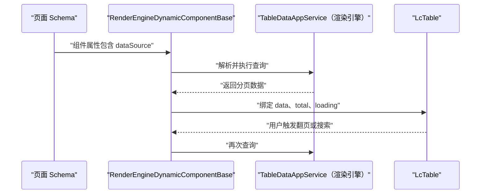

**图表来源**
- [RenderEngineDynamicComponentBase.cs](file://src/src/LowCode/RenderEngine/H.LowCode.RenderEngineBase/RenderEngineDynamicComponentBase.cs)
- [TableDataAppService.cs（渲染引擎）](file://src/src/LowCode/RenderEngine/H.LowCode.RenderEngine.Application/DataAppServices/TableDataAppService.cs)
- [LcTable.razor](file://src/src/LowCode/Common/H.LowCode.Components/Components/LcTable.razor)

### 结果映射到表格列、下拉选项、表单字段

| 目标组件 | 绑定字段 | 映射规则 |
|---|---|---|
| 表格 | `data`、`columns` | 行对象字段映射到列显示字段 |
| 下拉框 | `options` | 使用 `labelField`、`valueField` |
| 单选/多选 | `options` | 同上，增加选中值绑定 |
| 表单字段 | `value`、`options` | 表单值与数据源选项双向绑定 |

**章节来源**
- [RenderEngineDynamicComponentBase.cs](file://src/src/LowCode/RenderEngine/H.LowCode.RenderEngineBase/RenderEngineDynamicComponentBase.cs)
- [LcTable.razor](file://src/src/LowCode/Common/H.LowCode.Components/Components/LcTable.razor)
- [ComponentDataSourceSchema.cs](file://src/src/LowCode/Common/H.LowCode.MetaSchema/DataSourceSchemas/ComponentDataSourceSchema.cs)

## 数据源选择与表单校验

### TableDataSourceSelector

`TableDataSourceSelector` 是设计器中用于选择已定义数据源的组件。它的职责是：

- 列出所有可用的数据源。
- 让用户选择一个数据源作为表格的数据来源。
- 将选择的 `id` 写回页面 Schema 的 dataSource 配置。
- 在切换数据源时，自动提示该数据源的类型、字段结构。

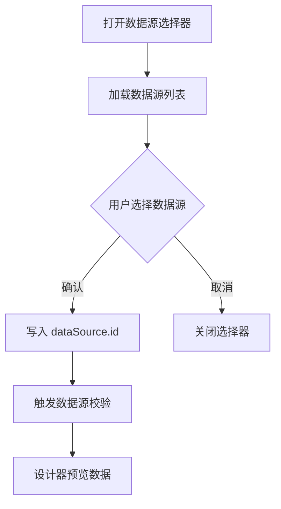

**图表来源**
- [TableDataSourceSetting.razor](file://src/src/LowCode/DesignEngine/H.LowCode.DesignEngine/SettingPanel/PropertySettingItems/TableDataSource/TableDataSourceSetting.razor)

### 新增数据源时的校验要点

新增数据源时，表单应至少覆盖以下校验：

| 字段 | 校验规则 | 说明 |
|---|---|---|
| 名称 | 必填、唯一 | 避免重复命名 |
| 类型 | 必填 | 固定列表、API、SQL |
| API 路径 | 必填、URL 合法 | 防止无效远程调用 |
| SQL 语句 | 必填、语法合法 | 防止 SQL 错误或注入 |
| 权限 | 必填、有效 | 确保只有授权用户可访问 |
| 选项列表 | 必填、每项含 label/value | 固定列表必须可渲染 |
| 分页开关 | 布尔值 | 控制是否启用分页 |

**章节来源**
- [TableDataSourceSetting.razor](file://src/src/LowCode/DesignEngine/H.LowCode.DesignEngine/SettingPanel/PropertySettingItems/TableDataSource/TableDataSourceSetting.razor)
- [ListDataSourceSetting.razor](file://src/src/LowCode/DesignEngine/H.LowCode.DesignEngine/SettingPanel/PropertySettingItems/ListDataSource/ListDataSourceSetting.razor)
- [OptionDataSourceSetting.razor](file://src/src/LowCode/DesignEngine/H.LowCode.DesignEngine/SettingPanel/PropertySettingItems/OptionDataSource/OptionDataSourceSetting.razor)

## 完整示例：创建表数据源并实现分页搜索

### 第一步：创建表数据源

在设计器中创建一个表数据源，例如命名为“订单列表”。

推荐配置：

| 配置项 | 值 |
|---|---|
| 类型 | SQL 数据源或 API 数据源 |
| 名称 | 订单列表 |
| 分页 | 开启 |
| 每页大小 | 20 |
| 默认排序 | 创建时间倒序 |
| 筛选字段 | 订单号、状态、客户名称 |

如果使用 API 数据源，`apiPath` 应指向一个支持分页和筛选的后端接口。

### 第二步：在页面表格中绑定数据源

在页面 Schema 的表格组件中：

- 将 `dataSource.type` 设置为已创建的数据源类型。
- 将 `dataSource.id` 设置为“订单列表”的 ID。
- 将表格列绑定到返回对象的字段，例如 `orderNo`、`customerName`、`status`、`createdAt`。
- 开启表格分页。

### 第三步：实现带分页和搜索的查询

当用户在表格中输入关键词并点击搜索时：

1. LcTable 收集当前筛选条件。
2. RenderEngineDynamicComponentBase 将筛选条件注入到查询参数。
3. TableDataAppService 将分页、排序、筛选参数传给后端。
4. 后端返回 `PagedResultDto`，包含 `items` 和 `totalCount`。
5. 表格刷新当前页数据，并更新总页数。

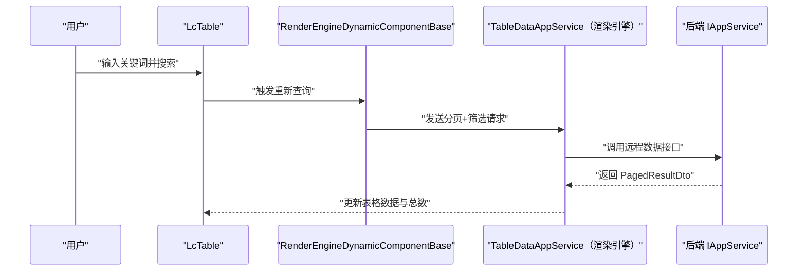

**图表来源**
- [LcTable.razor](file://src/src/LowCode/Common/H.LowCode.Components/Components/LcTable.razor)
- [RenderEngineDynamicComponentBase.cs](file://src/src/LowCode/RenderEngine/H.LowCode.RenderEngineBase/RenderEngineDynamicComponentBase.cs)
- [TableDataAppService.cs（渲染引擎）](file://src/src/LowCode/RenderEngine/H.LowCode.RenderEngine.Application/DataAppServices/TableDataAppService.cs)
- [ITableDataAppService.cs](file://src/src/LowCode/Common/H.LowCode.Application.Contracts/AppServices/ITableDataAppService.cs)

**章节来源**
- [ITableDataAppService.cs](file://src/src/LowCode/Common/H.LowCode.Application.Contracts/AppServices/ITableDataAppService.cs)
- [LcTable.razor](file://src/src/LowCode/Common/H.LowCode.Components/Components/LcTable.razor)
- [RenderEngineDynamicComponentBase.cs](file://src/src/LowCode/RenderEngine/H.LowCode.RenderEngineBase/RenderEngineDynamicComponentBase.cs)
- [TableDataAppService.cs（渲染引擎）](file://src/src/LowCode/RenderEngine/H.LowCode.RenderEngine.Application/DataAppServices/TableDataAppService.cs)

## 依赖关系分析

### 远程调用链

渲染引擎通常不会直接拼接 HTTP 请求，而是通过 Abp 风格的远程服务契约调用后端。`HttpClientProxyInterceptor` 会根据 `AbpUrlConvention` 和 `RemoteServiceOptions` 生成正确的 URL 并发起请求。

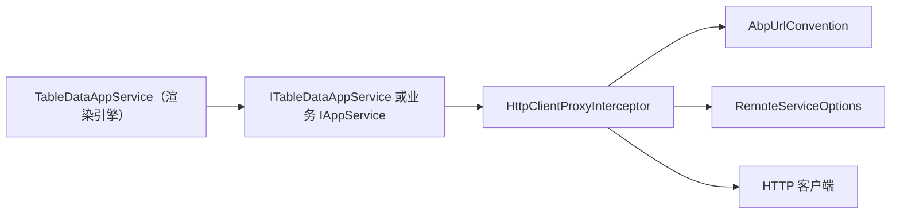

**图表来源**
- [TableDataAppService.cs（渲染引擎）](file://src/src/LowCode/RenderEngine/H.LowCode.RenderEngine.Application/DataAppServices/TableDataAppService.cs)
- [HttpClientProxyInterceptor.cs](file://src/src/Utils/H.Abp.HttpClientProxy/HttpClientProxyInterceptor.cs)
- [AbpUrlConvention.cs](file://src/src/Utils/H.Abp.HttpClientProxy/AbpUrlConvention.cs)
- [RemoteServiceOptions.cs](file://src/src/Utils/H.Abp.HttpClientProxy/RemoteServiceOptions.cs)
- [H.Abp.Application.Contracts/IAppService.cs](file://src/src/Utils/H.Abp.Application.Contracts/IAppService.cs)

### 分页模型依赖

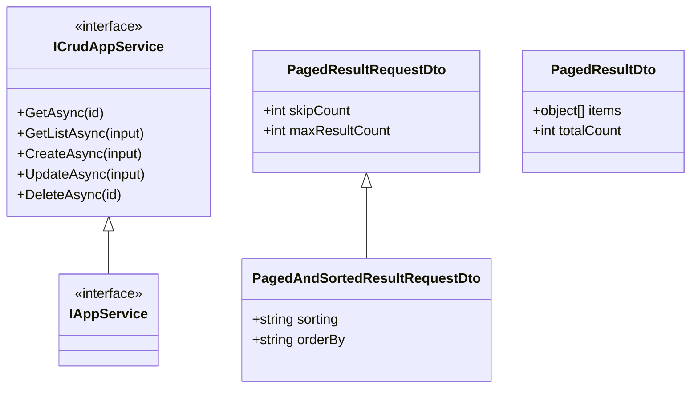

**图表来源**
- [H.Abp.Application.Contracts/IAppService.cs](file://src/src/Utils/H.Abp.Application.Contracts/IAppService.cs)
- [ICrudAppService.cs](file://src/src/Utils/H.Abp.Application.Contracts/ICrudAppService.cs)
- [PagedResultRequestDto.cs](file://src/src/Utils/H.Abp.Application.Contracts/PagedResultRequestDto.cs)
- [PagedAndSortedResultRequestDto.cs](file://src/src/Utils/H.Abp.Application.Contracts/PagedAndSortedResultRequestDto.cs)
- [PagedResultDto.cs](file://src/src/Utils/H.Abp.Application.Contracts/PagedResultDto.cs)

**章节来源**
- [HttpClientProxyInterceptor.cs](file://src/src/Utils/H.Abp.HttpClientProxy/HttpClientProxyInterceptor.cs)
- [AbpUrlConvention.cs](file://src/src/Utils/H.Abp.HttpClientProxy/AbpUrlConvention.cs)
- [RemoteServiceOptions.cs](file://src/src/Utils/H.Abp.HttpClientProxy/RemoteServiceOptions.cs)
- [H.Abp.Application.Contracts/IAppService.cs](file://src/src/Utils/H.Abp.Application.Contracts/IAppService.cs)
- [ICrudAppService.cs](file://src/src/Utils/H.Abp.Application.Contracts/ICrudAppService.cs)
- [PagedResultRequestDto.cs](file://src/src/Utils/H.Abp.Application.Contracts/PagedResultRequestDto.cs)
- [PagedAndSortedResultRequestDto.cs](file://src/src/Utils/H.Abp.Application.Contracts/PagedAndSortedResultRequestDto.cs)
- [PagedResultDto.cs](file://src/src/Utils/H.Abp.Application.Contracts/PagedResultDto.cs)

## 性能优化建议

### 避免在列表渲染中重复请求

常见问题：

- 每次单元格渲染都发起一次详情请求。
- 父组件重新渲染导致子组件重新查询。
- 搜索框无防抖，每次按键都触发请求。

建议：

- 对列表主数据使用一次性分页查询。
- 对详情页采用懒加载，只在用户点击查看详情时请求。
- 对高频搜索添加防抖。
- 对不可变数据使用组件级缓存。

### 合理使用缓存

适用缓存的场景：

- 固定列表数据。
- 字典数据。
- 下拉选项。
- 不频繁变化的配置数据。

不适用缓存的场景：

- 实时订单状态。
- 与当前用户强相关的敏感数据。
- 高频变更的业务列表。

### 避免 N+1 查询

N+1 查询的典型表现：

- 列表加载后，再逐个请求详情。
- 每个订单再查一次客户信息。
- 每个行记录再查一次关联状态。

优化方式：

- 在后端使用批量查询。
- 使用 JOIN 或预加载减少往返次数。
- 将关联数据扁平化返回，例如在每条记录中附带必要字段。
- 如果必须懒加载，应在前端做去重与缓存。

### 分页与索引

- 分页查询应始终携带分页参数，避免拉取全表。
- 筛选字段应建立数据库索引。
- 排序字段应避免无索引的大文本字段。
- 大数据量列表应限制最大页大小。

[本节为通用性能指导，不直接分析具体文件]

## 故障排查

| 现象 | 可能原因 | 排查步骤 |
|---|---|---|
| 表格不加载数据 | dataSource.id 为空或未选择 | 检查 TableDataSourceSelector 是否正确写入配置 |
| 表格数据为空 | 后端返回的 items 为空 | 查看后端日志与 SQL/API 响应 |
| 分页总数不正确 | totalCount 未返回或字段名不一致 | 检查 PagedResultDto 映射 |
| 搜索无效 | 筛选参数未注入查询 | 检查 RenderEngineDynamicComponentBase 的参数拼装 |
| API 数据源报错 | apiPath 错误或权限不足 | 检查 HttpClientProxyInterceptor 生成的 URL 和权限 |
| SQL 数据源报错 | SQL 语法错误或注入风险 | 检查 SQL 语句和后端的参数化处理 |
| 下拉选项不显示 | labelField/valueField 配置错误 | 检查 ListDataSourceSchema 或 API 返回结构 |
| 前端重复请求 | 组件重新渲染触发查询 | 检查组件生命周期与缓存策略 |

**章节来源**
- [TableDataAppService.cs（渲染引擎）](file://src/src/LowCode/RenderEngine/H.LowCode.RenderEngine.Application/DataAppServices/TableDataAppService.cs)
- [HttpClientProxyInterceptor.cs](file://src/src/Utils/H.Abp.HttpClientProxy/HttpClientProxyInterceptor.cs)
- [AbpUrlConvention.cs](file://src/src/Utils/H.Abp.HttpClientProxy/AbpUrlConvention.cs)
- [RemoteServiceOptions.cs](file://src/src/Utils/H.Abp.HttpClientProxy/RemoteServiceOptions.cs)
- [LcTable.razor](file://src/src/LowCode/Common/H.LowCode.Components/Components/LcTable.razor)
- [RenderEngineDynamicComponentBase.cs](file://src/src/LowCode/RenderEngine/H.LowCode.RenderEngineBase/RenderEngineDynamicComponentBase.cs)

## 结论

数据源绑定是整个低代码引擎的关键能力之一。它把“页面长什么样”和“数据从哪里来”解耦开来：

- 设计引擎通过 `DataSourceAppService` 管理数据源定义。
- 渲染引擎通过 `TableDataAppService` 将 dataSource 配置转化为真实查询。
- 固定列表、API 数据源、SQL 数据源分别承担静态选项、远程集成、数据库查询的职责。
- 分页模型统一了前后端的数据交换格式。
- HttpClientProxy 让前端能够以契约方式调用后端 IAppService。
- 性能优化的核心在于减少重复请求、合理使用缓存、避免 N+1 查询。

在实际项目中，建议优先使用 API 数据源和 SQL 数据源承载业务数据，用固定列表承载少量静态选项；同时严格校验数据源配置，确保安全性、可维护性和可观测性。