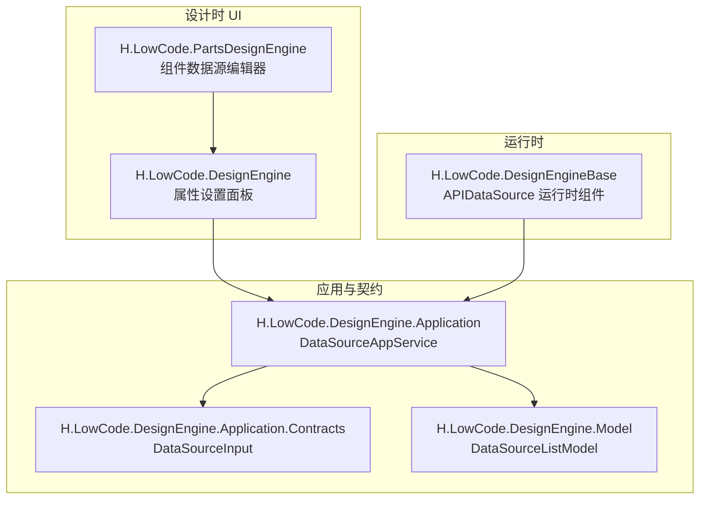
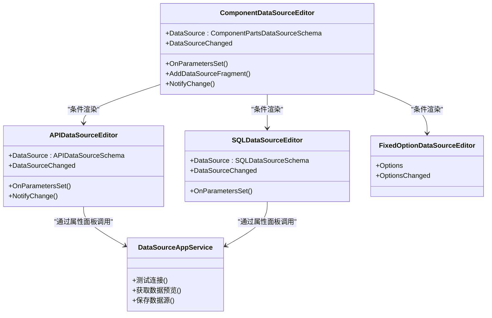
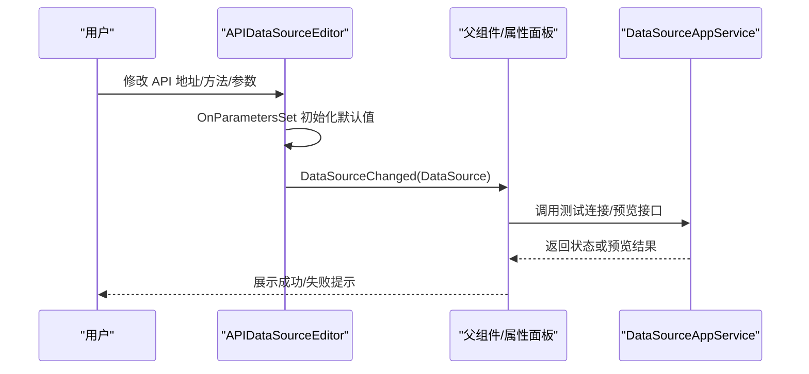
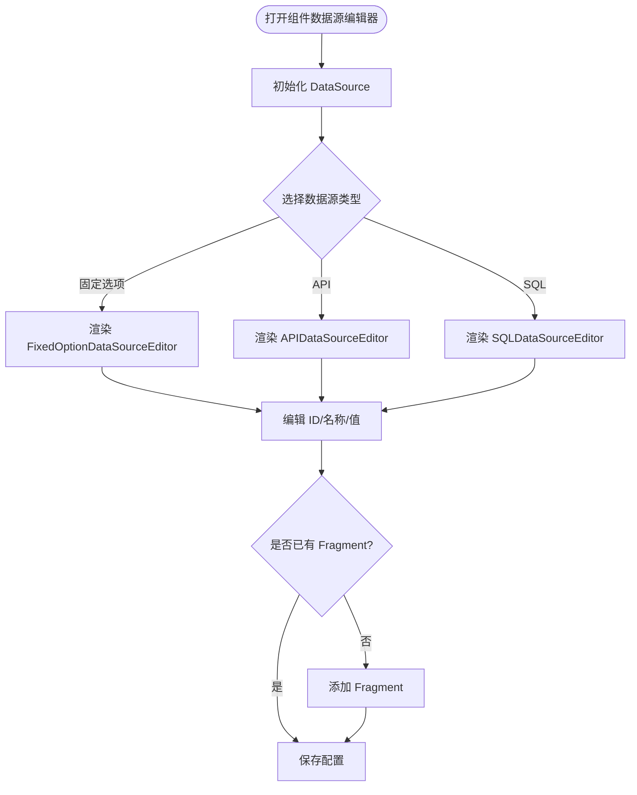
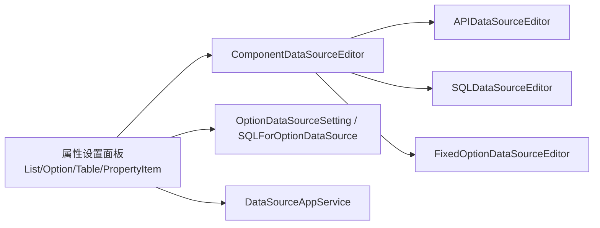
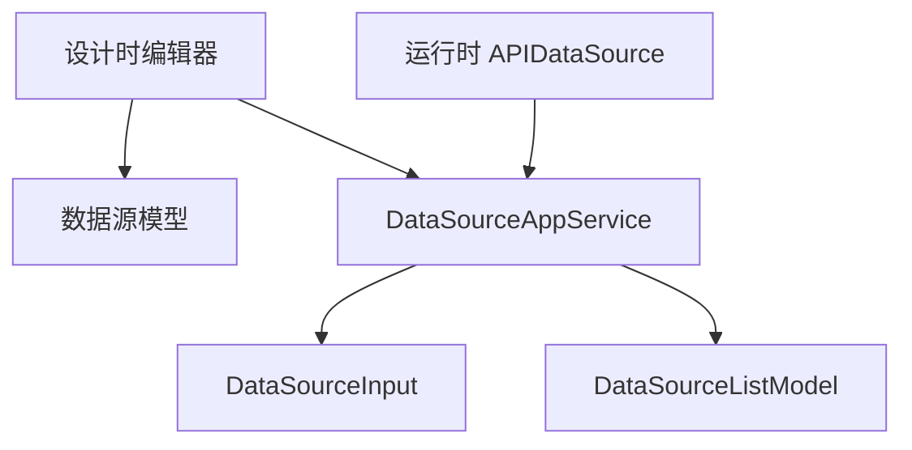
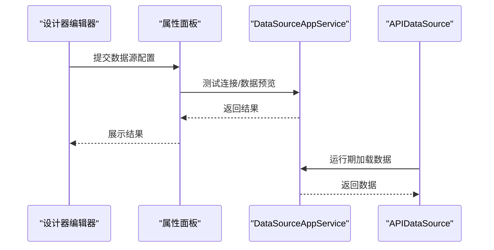
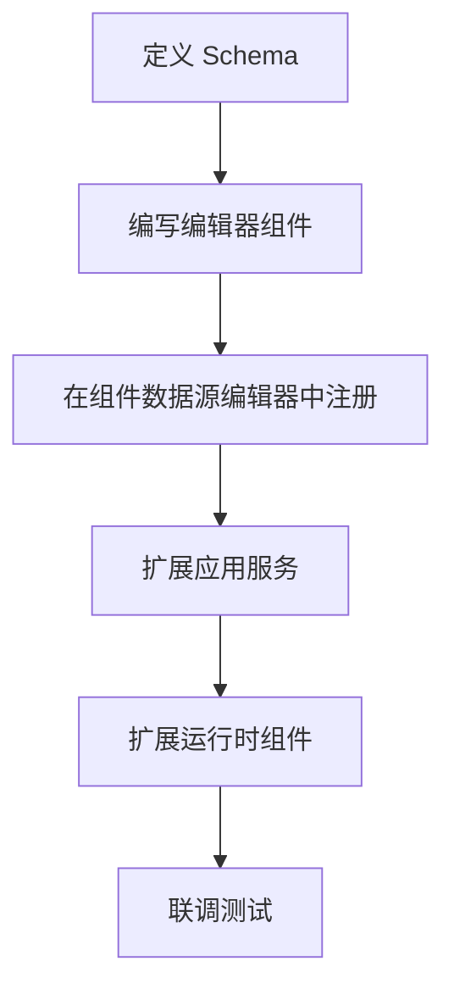

# 数据源编辑器

<cite>
**本文引用的文件**   
- [APIDataSourceEditor.razor](file://src/LowCode/DesignEngine/H.LowCode.PartsDesignEngine/Pages/ComponentParts/Components/APIDataSourceEditor.razor)
- [SQLDataSourceEditor.razor](file://src/LowCode/DesignEngine/H.LowCode.PartsDesignEngine/Pages/ComponentParts/Components/SQLDataSourceEditor.razor)
- [ComponentDataSourceEditor.razor](file://src/LowCode/DesignEngine/H.LowCode.PartsDesignEngine/Pages/ComponentParts/Components/ComponentDataSourceEditor.razor)
- [AttributeDefineGroupEditor.razor](file://src/LowCode/DesignEngine/H.LowCode.PartsDesignEngine/Pages/ComponentParts/Components/AttributeDefineGroupEditor.razor)
- [ListDataSourceSetting.razor](file://src/LowCode/DesignEngine/H.LowCode.DesignEngine/SettingPanel/PropertySettingItems/ListDataSource/ListDataSourceSetting.razor)
- [OptionDataSourceSetting.razor](file://src/LowCode/DesignEngine/H.LowCode.DesignEngine/SettingPanel/PropertySettingItems/OptionDataSource/OptionDataSourceSetting.razor)
- [SQLForOptionDataSource.razor](file://src/LowCode/DesignEngine/H.LowCode.DesignEngine/SettingPanel/PropertySettingItems/OptionDataSource/SQLForOptionDataSource.razor)
- [DataSourcePropertyItem.razor](file://src/LowCode/DesignEngine/H.LowCode.DesignEngine/SettingPanel/PropertySettingItems/DataSourcePropertyItem.razor)
- [TableDataSourceSetting.razor](file://src/LowCode/DesignEngine/H.LowCode.DesignEngine/SettingPanel/PropertySettingItems/TableDataSource/TableDataSourceSetting.razor)
- [DataSourceAppService.cs](file://src/LowCode/DesignEngine/H.LowCode.DesignEngine.Application/AppServices/DataSourceAppService.cs)
- [DataSourceInput.cs](file://src/LowCode/DesignEngine/H.LowCode.DesignEngine.Application.Contracts/Inputs/DataSourceInput.cs)
- [DataSourceListModel.cs](file://src/LowCode/DesignEngine/H.LowCode.DesignEngine.Model/Models/DataSourceListModel.cs)
- [APIDataSource.razor](file://src/LowCode/DesignEngine/H.LowCode.DesignEngineBase/Components/DataSources/APIDataSource.razor)
</cite>

## 目录
1. [引言](#引言)
2. [项目结构定位](#项目结构定位)
3. [核心组件总览](#核心组件总览)
4. [架构总览](#架构总览)
5. [详细组件分析](#详细组件分析)
6. [依赖关系分析](#依赖关系分析)
7. [生命周期与运行期行为](#生命周期与运行期行为)
8. [性能与安全设计建议](#性能与安全设计建议)
9. [扩展开发指南](#扩展开发指南)
10. [故障排查](#故障排查)
11. [结论](#结论)

## 引言
本文件面向 H.AppLab 低代码设计引擎中的数据源编辑器，系统性说明以下编辑器的实现原理和使用方式：
- APIDataSourceEditor：API 数据源编辑器
- SQLDataSourceEditor：SQL 数据源编辑器
- FixedOptionDataSourceEditor：固定选项数据源编辑器（在组件数据源中作为子编辑器使用）
- ComponentDataSourceEditor：组件数据源编排器，聚合上述三种具体数据源类型

文档覆盖数据源连接配置、参数绑定、数据预览、缓存策略、错误处理等关键能力，并给出扩展新数据源类型的开发指南以及性能优化和安全建议。

## 项目结构定位
数据源编辑器主要位于“部件设计器”模块，属于设计时 UI 层；与之配套的数据源模型、应用服务、运行时数据源组件分布在 DesignEngine、Application、Model 和 DesignEngineBase 等项目中。

**图表来源**
- [ComponentDataSourceEditor.razor:1-118](file://src/LowCode/DesignEngine/H.LowCode.PartsDesignEngine/Pages/ComponentParts/Components/ComponentDataSourceEditor.razor#L1-L118)
- [ListDataSourceSetting.razor](file://src/LowCode/DesignEngine/H.LowCode.DesignEngine/SettingPanel/PropertySettingItems/ListDataSource/ListDataSourceSetting.razor)
- [OptionDataSourceSetting.razor](file://src/LowCode/DesignEngine/H.LowCode.DesignEngine/SettingPanel/PropertySettingItems/OptionDataSource/OptionDataSourceSetting.razor)
- [DataSourceAppService.cs](file://src/LowCode/DesignEngine/H.LowCode.DesignEngine.Application/AppServices/DataSourceAppService.cs)
- [DataSourceInput.cs](file://src/LowCode/DesignEngine/H.LowCode.DesignEngine.Application.Contracts/Inputs/DataSourceInput.cs)
- [DataSourceListModel.cs](file://src/LowCode/DesignEngine/H.LowCode.DesignEngine.Model/Models/DataSourceListModel.cs)
- [APIDataSource.razor](file://src/LowCode/DesignEngine/H.LowCode.DesignEngineBase/Components/DataSources/APIDataSource.razor)

**章节来源**
- [ComponentDataSourceEditor.razor:1-118](file://src/LowCode/DesignEngine/H.LowCode.PartsDesignEngine/Pages/ComponentParts/Components/ComponentDataSourceEditor.razor#L1-L118)
- [ListDataSourceSetting.razor](file://src/LowCode/DesignEngine/H.LowCode.DesignEngine/SettingPanel/PropertySettingItems/ListDataSource/ListDataSourceSetting.razor)
- [OptionDataSourceSetting.razor](file://src/LowCode/DesignEngine/H.LowCode.DesignEngine/SettingPanel/PropertySettingItems/OptionDataSource/OptionDataSourceSetting.razor)

## 核心组件总览
- APIDataSourceEditor：负责 API 数据源的地址、方法、请求头、查询参数、请求体等编辑与校验。
- SQLDataSourceEditor：负责数据库类型、SQL 语句等编辑。
- ComponentDataSourceEditor：负责组件级数据源分组、类型选择、ID/名称/值等元信息编辑，并动态挂载固定选项、API、SQL 三类子编辑器。
- FixedOptionDataSourceEditor：由组件数据源或属性定义组调用，用于维护固定键值选项列表。

这些编辑器通过 Blazor 参数绑定与事件回调机制与上层属性设置面板交互，将用户配置转化为可持久化的数据源模型。

**章节来源**
- [APIDataSourceEditor.razor:1-78](file://src/LowCode/DesignEngine/H.LowCode.PartsDesignEngine/Pages/ComponentParts/Components/APIDataSourceEditor.razor#L1-L78)
- [SQLDataSourceEditor.razor:1-48](file://src/LowCode/DesignEngine/H.LowCode.PartsDesignEngine/Pages/ComponentParts/Components/SQLDataSourceEditor.razor#L1-L48)
- [ComponentDataSourceEditor.razor:1-118](file://src/LowCode/DesignEngine/H.LowCode.PartsDesignEngine/Pages/ComponentParts/Components/ComponentDataSourceEditor.razor#L1-L118)
- [AttributeDefineGroupEditor.razor](file://src/LowCode/DesignEngine/H.LowCode.PartsDesignEngine/Pages/ComponentParts/Components/AttributeDefineGroupEditor.razor)

## 架构总览
数据源编辑器在设计时形成“编排层 + 具体编辑器 + 模型层”的分层结构；在运行时由运行时数据源组件消费配置执行请求或查询。

**图表来源**
- [APIDataSourceEditor.razor:1-78](file://src/LowCode/DesignEngine/H.LowCode.PartsDesignEngine/Pages/ComponentParts/Components/APIDataSourceEditor.razor#L1-L78)
- [SQLDataSourceEditor.razor:1-48](file://src/LowCode/DesignEngine/H.LowCode.PartsDesignEngine/Pages/ComponentParts/Components/SQLDataSourceEditor.razor#L1-L48)
- [ComponentDataSourceEditor.razor:1-118](file://src/LowCode/DesignEngine/H.LowCode.PartsDesignEngine/Pages/ComponentParts/Components/ComponentDataSourceEditor.razor#L1-L118)
- [AttributeDefineGroupEditor.razor](file://src/LowCode/DesignEngine/H.LowCode.PartsDesignEngine/Pages/ComponentParts/Components/AttributeDefineGroupEditor.razor)
- [DataSourceAppService.cs](file://src/LowCode/DesignEngine/H.LowCode.DesignEngine.Application/AppServices/DataSourceAppService.cs)

## 详细组件分析

### APIDataSourceEditor：API 数据源编辑器
职责
- 编辑 API 地址、HTTP 方法、请求头、查询参数、请求体。
- 提供默认初始化逻辑，确保集合字段非空。
- 通过 DataSourceChanged 向父组件同步变更。

关键实现要点
- 表单字段与 APIDataSourceSchema 双向绑定。
- OnParametersSet 中进行空对象与集合的默认初始化，避免后续渲染异常。
- NotifyChange 统一触发事件回调与界面刷新。

典型交互流程

**图表来源**
- [APIDataSourceEditor.razor:1-78](file://src/LowCode/DesignEngine/H.LowCode.PartsDesignEngine/Pages/ComponentParts/Components/APIDataSourceEditor.razor#L1-L78)
- [DataSourceAppService.cs](file://src/LowCode/DesignEngine/H.LowCode.DesignEngine.Application/AppServices/DataSourceAppService.cs)

**章节来源**
- [APIDataSourceEditor.razor:1-78](file://src/LowCode/DesignEngine/H.LowCode.PartsDesignEngine/Pages/ComponentParts/Components/APIDataSourceEditor.razor#L1-L78)

### SQLDataSourceEditor：SQL 数据源编辑器
职责
- 编辑数据库类型与 SQL 语句。
- 提供默认 DbType 初始化。

关键实现要点
- 下拉框绑定数据库类型，文本域绑定 SQL 语句。
- OnParametersSet 确保 DataSource 对象存在并赋予默认值。

适用场景
- 需要直接通过 SQL 查询结构化数据的场景，例如表格、下拉选项等。

**章节来源**
- [SQLDataSourceEditor.razor:1-48](file://src/LowCode/DesignEngine/H.LowCode.PartsDesignEngine/Pages/ComponentParts/Components/SQLDataSourceEditor.razor#L1-L48)

### ComponentDataSourceEditor：组件数据源编排器
职责
- 管理组件级数据源的分组类型、数据源类型、唯一标识、显示名称、值。
- 根据数据源类型动态渲染固定选项、API、SQL 三类子编辑器。
- 支持添加数据源 Fragment，用于更复杂的结构扩展。

关键实现要点
- 使用枚举下拉选择数据源分组与类型。
- 通过 if/else 分支渲染对应子编辑器，并将子编辑器绑定到 DataSource 的不同字段。
- AddDataSourceFragment 创建空的 Fragment 结构并通过事件回调通知父组件。

**图表来源**
- [ComponentDataSourceEditor.razor:1-118](file://src/LowCode/DesignEngine/H.LowCode.PartsDesignEngine/Pages/ComponentParts/Components/ComponentDataSourceEditor.razor#L1-L118)

**章节来源**
- [ComponentDataSourceEditor.razor:1-118](file://src/LowCode/DesignEngine/H.LowCode.PartsDesignEngine/Pages/ComponentParts/Components/ComponentDataSourceEditor.razor#L1-L118)

### FixedOptionDataSourceEditor：固定选项数据源编辑器
角色定位
- 在组件数据源中选择“固定选项”类型时，由 ComponentDataSourceEditor 渲染该子编辑器。
- 在属性定义组中也可复用，用于维护静态键值选项。

设计要点
- 以 Options 为输入输出，通过 @bind-Options 与父组件双向绑定。
- 通常包含增删改查选项项的能力，并在变更后通过事件回调通知父组件。

使用位置
- ComponentDataSourceEditor 中当 DataSourceType 为固定选项时渲染。
- AttributeDefineGroupEditor 中也可引用，用于属性组的静态选项配置。

**章节来源**
- [ComponentDataSourceEditor.razor:1-118](file://src/LowCode/DesignEngine/H.LowCode.PartsDesignEngine/Pages/ComponentParts/Components/ComponentDataSourceEditor.razor#L1-L118)
- [AttributeDefineGroupEditor.razor](file://src/LowCode/DesignEngine/H.LowCode.PartsDesignEngine/Pages/ComponentParts/Components/AttributeDefineGroupEditor.razor)

### 与属性设置面板和数据预览的关系
设计时的属性设置面板通过 ListDataSourceSetting、OptionDataSourceSetting、TableDataSourceSetting、DataSourcePropertyItem 等组件组合不同数据源编辑器，并最终与 DataSourceAppService 交互完成测试、预览、保存等操作。OptionDataSourceSetting 内还包含 SQLForOptionDataSource，用于针对选项类数据源的 SQL 配置入口。

**图表来源**
- [ListDataSourceSetting.razor](file://src/LowCode/DesignEngine/H.LowCode.DesignEngine/SettingPanel/PropertySettingItems/ListDataSource/ListDataSourceSetting.razor)
- [OptionDataSourceSetting.razor](file://src/LowCode/DesignEngine/H.LowCode.DesignEngine/SettingPanel/PropertySettingItems/OptionDataSource/OptionDataSourceSetting.razor)
- [SQLForOptionDataSource.razor](file://src/LowCode/DesignEngine/H.LowCode.DesignEngine/SettingPanel/PropertySettingItems/OptionDataSource/SQLForOptionDataSource.razor)
- [DataSourcePropertyItem.razor](file://src/LowCode/DesignEngine/H.LowCode.DesignEngine/SettingPanel/PropertySettingItems/DataSourcePropertyItem.razor)
- [TableDataSourceSetting.razor](file://src/LowCode/DesignEngine/H.LowCode.DesignEngine/SettingPanel/PropertySettingItems/TableDataSource/TableDataSourceSetting.razor)
- [ComponentDataSourceEditor.razor:1-118](file://src/LowCode/DesignEngine/H.LowCode.PartsDesignEngine/Pages/ComponentParts/Components/ComponentDataSourceEditor.razor#L1-L118)

## 依赖关系分析
- 设计时 UI 依赖模型契约：编辑器通过 APIDataSourceSchema、SQLDataSourceSchema、ComponentPartsDataSourceSchema 等模型与属性面板和应用服务协作。
- 应用服务集中封装数据源相关操作：DataSourceAppService 对外暴露测试连接、数据预览、保存等能力。
- 运行时组件消费配置：APIDataSource 运行时组件在页面渲染阶段根据配置发起 HTTP 请求。

**图表来源**
- [DataSourceAppService.cs](file://src/LowCode/DesignEngine/H.LowCode.DesignEngine.Application/AppServices/DataSourceAppService.cs)
- [DataSourceInput.cs](file://src/LowCode/DesignEngine/H.LowCode.DesignEngine.Application.Contracts/Inputs/DataSourceInput.cs)
- [DataSourceListModel.cs](file://src/LowCode/DesignEngine/H.LowCode.DesignEngine.Model/Models/DataSourceListModel.cs)
- [APIDataSource.razor](file://src/LowCode/DesignEngine/H.LowCode.DesignEngineBase/Components/DataSources/APIDataSource.razor)

**章节来源**
- [DataSourceAppService.cs](file://src/LowCode/DesignEngine/H.LowCode.DesignEngine.Application/AppServices/DataSourceAppService.cs)
- [DataSourceInput.cs](file://src/LowCode/DesignEngine/H.LowCode.DesignEngine.Application.Contracts/Inputs/DataSourceInput.cs)
- [DataSourceListModel.cs](file://src/LowCode/DesignEngine/H.LowCode.DesignEngine.Model/Models/DataSourceListModel.cs)
- [APIDataSource.razor](file://src/LowCode/DesignEngine/H.LowCode.DesignEngineBase/Components/DataSources/APIDataSource.razor)

## 生命周期与运行期行为
- 编辑器初始化：各编辑器在 OnParametersSet 中对 DataSource 进行空值保护与默认值填充，保证渲染稳定。
- 变更传播：通过 DataSourceChanged 或 OptionsChanged 等事件回调将最新配置推送给父组件。
- 测试连接与预览：由属性面板或数据源管理页调用 DataSourceAppService，服务端执行连接测试与数据预览。
- 运行时加载：APIDataSource 运行时组件根据配置的 API 地址、方法与参数发起网络请求，得到数据后交由组件渲染。

**图表来源**
- [APIDataSourceEditor.razor:1-78](file://src/LowCode/DesignEngine/H.LowCode.PartsDesignEngine/Pages/ComponentParts/Components/APIDataSourceEditor.razor#L1-L78)
- [SQLDataSourceEditor.razor:1-48](file://src/LowCode/DesignEngine/H.LowCode.PartsDesignEngine/Pages/ComponentParts/Components/SQLDataSourceEditor.razor#L1-L48)
- [ComponentDataSourceEditor.razor:1-118](file://src/LowCode/DesignEngine/H.LowCode.PartsDesignEngine/Pages/ComponentParts/Components/ComponentDataSourceEditor.razor#L1-L118)
- [DataSourceAppService.cs](file://src/LowCode/DesignEngine/H.LowCode.DesignEngine.Application/AppServices/DataSourceAppService.cs)
- [APIDataSource.razor](file://src/LowCode/DesignEngine/H.LowCode.DesignEngineBase/Components/DataSources/APIDataSource.razor)

**章节来源**
- [APIDataSourceEditor.razor:1-78](file://src/LowCode/DesignEngine/H.LowCode.PartsDesignEngine/Pages/ComponentParts/Components/APIDataSourceEditor.razor#L1-L78)
- [SQLDataSourceEditor.razor:1-48](file://src/LowCode/DesignEngine/H.LowCode.PartsDesignEngine/Pages/ComponentParts/Components/SQLDataSourceEditor.razor#L1-L48)
- [ComponentDataSourceEditor.razor:1-118](file://src/LowCode/DesignEngine/H.LowCode.PartsDesignEngine/Pages/ComponentParts/Components/ComponentDataSourceEditor.razor#L1-L118)
- [DataSourceAppService.cs](file://src/LowCode/DesignEngine/H.LowCode.DesignEngine.Application/AppServices/DataSourceAppService.cs)
- [APIDataSource.razor](file://src/LowCode/DesignEngine/H.LowCode.DesignEngineBase/Components/DataSources/APIDataSource.razor)

## 性能与安全设计建议
- 参数化查询：SQL 数据源应优先使用参数化查询，避免拼接注入风险，同时提升执行计划复用率。
- 分页与限流：对大数据集启用分页与上限限制，防止一次性加载过多数据导致前端卡顿。
- 请求超时与重试：为 API 数据源配置合理的超时时间与重试次数，避免长时间阻塞。
- 响应缓存：对稳定且变化不频繁的数据源启用响应缓存，减少重复请求压力。
- 敏感信息脱敏：日志与调试输出中避免打印密钥、令牌等敏感信息。
- 输入校验：在编辑器侧对必填字段、URL 格式、JSON 合法性进行校验，降低后端出错概率。
- 最小权限原则：数据库账号仅授予必要权限，避免宽泛访问造成安全风险。

[本节为通用指导，不涉及具体文件]

## 扩展开发指南

### 新增一种数据源类型
步骤
1. 定义数据源 Schema：新增对应 Schema 类型，承载连接配置、参数、认证信息等。
2. 新增编辑器组件：参考 APIDataSourceEditor 与 SQLDataSourceEditor，新建 Blazor 组件，实现：
   - 参数 DataSource 与 DataSourceChanged
   - OnParametersSet 默认初始化
   - 表单字段与 Schema 双向绑定
   - 统一变更通知
3. 在 ComponentDataSourceEditor 中注册：
   - 扩展数据源类型枚举
   - 在对应分支渲染新的编辑器
4. 在服务端扩展：
   - 在 DataSourceAppService 中新增测试连接、数据预览、保存逻辑
   - 在 DataSourceInput、DataSourceListModel 中扩展相应 DTO
5. 在运行时扩展：
   - 如需运行期自动拉取数据，新增运行时数据源组件或在现有组件中增加分支处理

**图表来源**
- [APIDataSourceEditor.razor:1-78](file://src/LowCode/DesignEngine/H.LowCode.PartsDesignEngine/Pages/ComponentParts/Components/APIDataSourceEditor.razor#L1-L78)
- [SQLDataSourceEditor.razor:1-48](file://src/LowCode/DesignEngine/H.LowCode.PartsDesignEngine/Pages/ComponentParts/Components/SQLDataSourceEditor.razor#L1-L48)
- [ComponentDataSourceEditor.razor:1-118](file://src/LowCode/DesignEngine/H.LowCode.PartsDesignEngine/Pages/ComponentParts/Components/ComponentDataSourceEditor.razor#L1-L118)
- [DataSourceAppService.cs](file://src/LowCode/DesignEngine/H.LowCode.DesignEngine.Application/AppServices/DataSourceAppService.cs)
- [DataSourceInput.cs](file://src/LowCode/DesignEngine/H.LowCode.DesignEngine.Application.Contracts/Inputs/DataSourceInput.cs)
- [DataSourceListModel.cs](file://src/LowCode/DesignEngine/H.LowCode.DesignEngine.Model/Models/DataSourceListModel.cs)

### 实现复杂数据转换逻辑
建议在应用服务层实现数据转换：
- 将外部 API/SQL 返回数据映射为标准数据结构。
- 支持过滤、排序、分页、字段映射等常用转换。
- 对转换过程记录关键指标，便于性能分析与问题定位。

### 优化数据加载性能
- 按需加载：仅在需要时触发数据预览与加载。
- 增量更新：对列表型数据采用增量合并，避免全量替换。
- 去重与缓存：对相同请求参数的响应进行短期缓存。
- 并发控制：限制并行请求数，避免资源争用。

[本节为通用指导，不涉及具体文件]

## 故障排查
常见问题与建议
- 编辑器未初始化：确认 OnParametersSet 中已对 DataSource 及集合字段进行默认初始化，避免空引用异常。
- 绑定失效：检查 @bind 是否正确，DataSourceChanged 是否在变更后被触发。
- 测试连接失败：检查 API 地址与方法、请求头、鉴权信息；查看 DataSourceAppService 返回的错误信息。
- 数据预览为空：检查 SQL 语法、参数绑定、分页条件；确认运行时权限与网络连通性。
- 内存占用过高：检查是否存在大对象缓存或未释放的订阅；对大数据集启用分页与节流。

**章节来源**
- [APIDataSourceEditor.razor:1-78](file://src/LowCode/DesignEngine/H.LowCode.PartsDesignEngine/Pages/ComponentParts/Components/APIDataSourceEditor.razor#L1-L78)
- [SQLDataSourceEditor.razor:1-48](file://src/LowCode/DesignEngine/H.LowCode.PartsDesignEngine/Pages/ComponentParts/Components/SQLDataSourceEditor.razor#L1-L48)
- [ComponentDataSourceEditor.razor:1-118](file://src/LowCode/DesignEngine/H.LowCode.PartsDesignEngine/Pages/ComponentParts/Components/ComponentDataSourceEditor.razor#L1-L118)
- [DataSourceAppService.cs](file://src/LowCode/DesignEngine/H.LowCode.DesignEngine.Application/AppServices/DataSourceAppService.cs)

## 结论
H.AppLab 数据源编辑器通过清晰的组件分层与约定式的数据绑定，实现了 API、SQL、固定选项三类数据源的设计时配置与运行期使用。ComponentDataSourceEditor 提供了统一的编排入口，配合 DataSourceAppService 完成连接测试、数据预览与保存。遵循本文的扩展指南、安全与性能建议，可以快速、稳健地扩展更多数据源类型并优化整体体验。