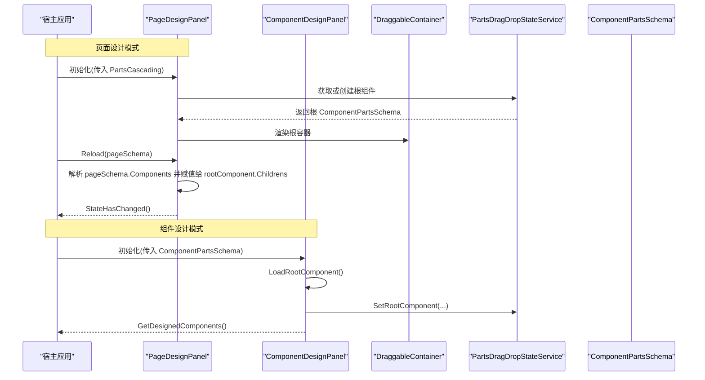
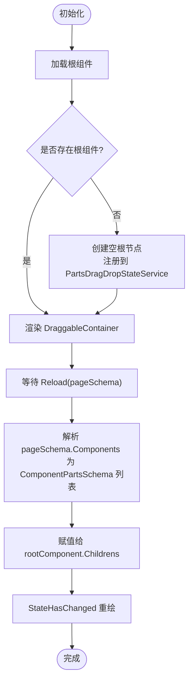
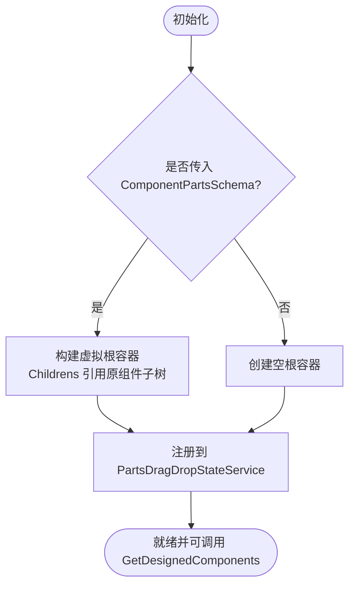
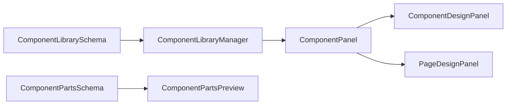
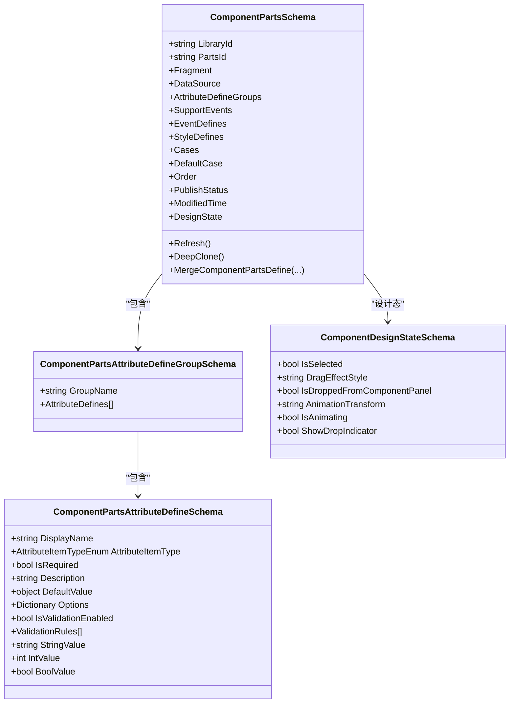
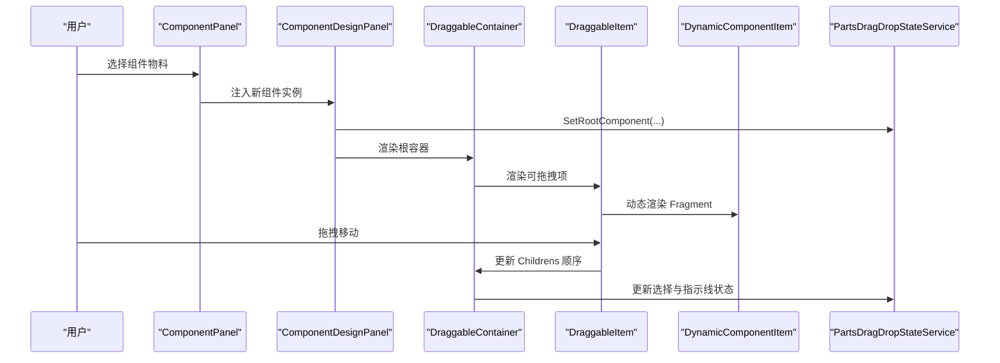
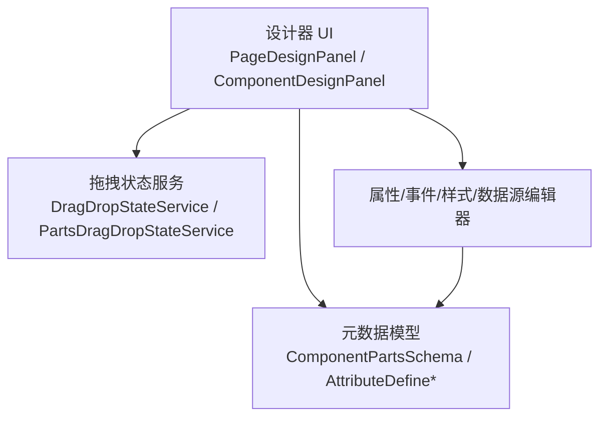

# 组件设计器

<cite>
**本文引用的文件**   
- [PageDesignPanel.razor](file://src/LowCode/DesignEngine/H.LowCode.PartsDesignEngine/DesignPanel/PageDesignPanel.razor)
- [ComponentDesignPanel.razor](file://src/LowCode/DesignEngine/H.LowCode.PartsDesignEngine/DesignPanel/ComponentDesignPanel.razor)
- [ComponentLibrarySchema.cs](file://src/LowCode/Common/H.LowCode.MetaSchema.DesignEngine/ComponentLibrarySchema.cs)
- [ComponentPartsSchema.cs](file://src/LowCode/Common/H.LowCode.MetaSchema.DesignEngine/ComponentPartsSchema.cs)
- [ComponentDesignStateSchema.cs](file://src/LowCode/Common/H.LowCode.MetaSchema.DesignEngine/PropertySchemas/ComponentDesignStateSchema.cs)
- [ComponentPartsAttributeDefineGroupSchema.cs](file://src/LowCode/Common/H.LowCode.MetaSchema.DesignEngine/PropertySchemas/ComponentPartsAttributeDefineGroupSchema.cs)
- [ComponentPartsAttributeDefineSchema.cs](file://src/LowCode/Common/H.LowCode.MetaSchema.DesignEngine/PropertySchemas/ComponentPartsAttributeDefineSchema.cs)
- [ComponentPartsEventDefineSchema.cs](file://src/LowCode/Common/H.LowCode.MetaSchema.DesignEngine/PropertySchemas/ComponentPartsEventDefineSchema.cs)
- [ComponentPartsStyleDefineSchema.cs](file://src/LowCode/Common/H.LowCode.MetaSchema.DesignEngine/PropertySchemas/ComponentPartsStyleDefineSchema.cs)
- [ComponentPartsDataSourceSchema.cs](file://src/LowCode/Common/H.LowCode.MetaSchema.DesignEngine/DataSourceSchemas/ComponentPartsDataSourceSchema.cs)
- [ComponentAttributeItemTypeEnum.cs](file://src/LowCode/Common/H.LowCode.MetaSchema.DesignEngine/Enums/ComponentAttributeItemTypeEnum.cs)
- [DragDropStateService.cs](file://src/LowCode/DesignEngine/H.LowCode.DesignEngine.Services/DragDropStateService.cs)
- [PartsDragDropStateService.cs](file://src/LowCode/DesignEngine/H.LowCode.PartsDesignEngine/DraggableComponents/PartsDragDropStateService.cs)
- [DraggableContainer.razor](file://src/LowCode/DesignEngine/H.LowCode.PartsDesignEngine/DraggableComponents/DraggableContainer.razor)
- [DraggableItem.razor](file://src/LowCode/DesignEngine/H.LowCode.PartsDesignEngine/DraggableComponents/DraggableItem.razor)
- [DynamicComponentItem.razor](file://src/LowCode/DesignEngine/H.LowCode.PartsDesignEngine/DraggableComponents/DynamicComponentItem.razor)
- [ComponentPanel.razor](file://src/LowCode/DesignEngine/H.LowCode.PartsDesignEngine/ComponentPanel/ComponentPanel.razor)
- [ComponentLibraryManager.razor](file://src/LowCode/DesignEngine/H.LowCode.PartsDesignEngine/Pages/ComponentParts/ComponentLibraryManager.razor)
- [ComponentPartsPreview.razor](file://src/LowCode/DesignEngine/H.LowCode.PartsDesignEngine/Pages/ComponentParts/Components/ComponentPartsPreview.razor)
- [PartsSettingPanel.razor](file://src/LowCode/DesignEngine/H.LowCode.PartsDesignEngine/SettingPanel/PartsSettingPanel.razor)
- [PropertySetting.razor](file://src/LowCode/DesignEngine/H.LowCode.PartsDesignEngine/SettingPanel/PropertySetting.razor)
- [BasicPropertyItem.razor](file://src/LowCode/DesignEngine/H.LowCode.PartsDesignEngine/SettingPanel/PropertySettingItems/BasicPropertyItem.razor)
- [EventPropertyItem.razor](file://src/LowCode/DesignEngine/H.LowCode.PartsDesignEngine/SettingPanel/PropertySettingItems/EventPropertyItem.razor)
- [ExtensionPropertyItem.razor](file://src/LowCode/DesignEngine/H.LowCode.PartsDesignEngine/SettingPanel/PropertySettingItems/ExtensionPropertyItem.razor)
</cite>

## 目录
1. [引言](#引言)
2. [项目结构](#项目结构)
3. [核心组件](#核心组件)
4. [架构总览](#架构总览)
5. [详细组件分析](#详细组件分析)
6. [依赖关系分析](#依赖关系分析)
7. [性能考虑](#性能考虑)
8. [故障排查指南](#故障排查指南)
9. [结论](#结论)
10. [附录：开发指南与规范](#附录开发指南与规范)

## 引言
本技术文档聚焦 H.AppLab 低代码引擎中的“组件设计器”子系统，重点解释其双重模式架构：页面设计模式与组件设计模式。我们将围绕以下主题展开：
- 组件设计器的两种模式差异及其职责边界
- 组件库管理、组件预览、属性定义与属性面板
- 组件设计器与页面设计器的协作方式
- 如何基于现有能力创建可复用的业务组件
- 开发规范、最佳实践与性能优化建议

该设计器以 Blazor 组件为核心载体，通过元数据驱动的方式组织组件树、事件、样式与数据源，并在设计时提供拖拽、选择、分组编辑等交互体验。

## 项目结构
与本主题直接相关的代码分布在以下模块中：
- 设计器运行时 UI：H.LowCode.PartsDesignEngine
- 设计期元数据模型：H.LowCode.MetaSchema.DesignEngine
- 拖拽状态服务：H.LowCode.DesignEngine.Services 与 H.LowCode.PartsDesignEngine

```mermaid
graph TB
    subgraph "设计器 UI"
        PDP["PageDesignPanel.razor"]
        CDP["ComponentDesignPanel.razor"]
        CPN["ComponentPanel.razor"]
        CLM["ComponentLibraryManager.razor"]
        PSP["PartsSettingPanel.razor"]
        PS["PropertySetting.razor"]
        DPI["DraggableItem.razor"]
        DCI["DynamicComponentItem.razor"]
        DTC["DraggableContainer.razor"]
    end

    subgraph "设计期元数据"
        CPS["ComponentPartsSchema.cs"]
        CLS["ComponentLibrarySchema.cs"]
        CDSS["ComponentDesignStateSchema.cs"]
        APG["ComponentPartsAttributeDefineGroupSchema.cs"]
        APD["ComponentPartsAttributeDefineSchema.cs"]
        EDS["ComponentPartsEventDefineSchema.cs"]
        SDS["ComponentPartsStyleDefineSchema.cs"]
        DSS["ComponentPartsDataSourceSchema.cs"]
        AIE["ComponentAttributeItemTypeEnum.cs"]
    end

    subgraph "拖拽状态服务"
        DDS["DragDropStateService.cs"]
        PDDS["PartsDragDropStateService.cs"]
    end

    PDP --> DTC
    CDP --> DTC
    CPN --> CLM
    PSP --> PS
    PS --> APD
    DPS["PartsDragDropStateService.cs"] --> PDP
    PDDS --> CDP
    CPS --> DPI
    CPS --> DCI
    CLS --> CPN
```

图表来源
- [PageDesignPanel.razor:1-59](file://src/LowCode/DesignEngine/H.LowCode.PartsDesignEngine/DesignPanel/PageDesignPanel.razor#L1-L59)
- [ComponentDesignPanel.razor:1-92](file://src/LowCode/DesignEngine/H.LowCode.PartsDesignEngine/DesignPanel/ComponentDesignPanel.razor#L1-L92)
- [ComponentLibrarySchema.cs:1-33](file://src/LowCode/Common/H.LowCode.MetaSchema.DesignEngine/ComponentLibrarySchema.cs#L1-L33)
- [ComponentPartsSchema.cs:1-229](file://src/LowCode/Common/H.LowCode.MetaSchema.DesignEngine/ComponentPartsSchema.cs#L1-L229)
- [ComponentDesignStateSchema.cs:1-40](file://src/LowCode/Common/H.LowCode.MetaSchema.DesignEngine/PropertySchemas/ComponentDesignStateSchema.cs#L1-L40)
- [ComponentPartsAttributeDefineGroupSchema.cs:1-12](file://src/LowCode/Common/H.LowCode.MetaSchema.DesignEngine/PropertySchemas/ComponentPartsAttributeDefineGroupSchema.cs#L1-L12)
- [ComponentPartsAttributeDefineSchema.cs:1-98](file://src/LowCode/Common/H.LowCode.MetaSchema.DesignEngine/PropertySchemas/ComponentPartsAttributeDefineSchema.cs#L1-L98)
- [ComponentPartsEventDefineSchema.cs](file://src/LowCode/Common/H.LowCode.MetaSchema.DesignEngine/PropertySchemas/ComponentPartsEventDefineSchema.cs)
- [ComponentPartsStyleDefineSchema.cs](file://src/LowCode/Common/H.LowCode.MetaSchema.DesignEngine/PropertySchemas/ComponentPartsStyleDefineSchema.cs)
- [ComponentPartsDataSourceSchema.cs](file://src/LowCode/Common/H.LowCode.MetaSchema.DesignEngine/DataSourceSchemas/ComponentPartsDataSourceSchema.cs)
- [ComponentAttributeItemTypeEnum.cs](file://src/LowCode/Common/H.LowCode.MetaSchema.DesignEngine/Enums/ComponentAttributeItemTypeEnum.cs)
- [DragDropStateService.cs](file://src/LowCode/DesignEngine/H.LowCode.DesignEngine.Services/DragDropStateService.cs)
- [PartsDragDropStateService.cs](file://src/LowCode/DesignEngine/H.LowCode.PartsDesignEngine/DraggableComponents/PartsDragDropStateService.cs)
- [DraggableContainer.razor](file://src/LowCode/DesignEngine/H.LowCode.PartsDesignEngine/DraggableComponents/DraggableContainer.razor)
- [DraggableItem.razor](file://src/LowCode/DesignEngine/H.LowCode.PartsDesignEngine/DraggableComponents/DraggableItem.razor)
- [DynamicComponentItem.razor](file://src/LowCode/DesignEngine/H.LowCode.PartsDesignEngine/DraggableComponents/DynamicComponentItem.razor)
- [ComponentPanel.razor](file://src/LowCode/DesignEngine/H.LowCode.PartsDesignEngine/ComponentPanel/ComponentPanel.razor)
- [ComponentLibraryManager.razor](file://src/LowCode/DesignEngine/H.LowCode.PartsDesignEngine/Pages/ComponentParts/ComponentLibraryManager.razor)
- [PartsSettingPanel.razor](file://src/LowCode/DesignEngine/H.LowCode.PartsDesignEngine/SettingPanel/PartsSettingPanel.razor)
- [PropertySetting.razor](file://src/LowCode/DesignEngine/H.LowCode.PartsDesignEngine/SettingPanel/PropertySetting.razor)

章节来源
- [PageDesignPanel.razor:1-59](file://src/LowCode/DesignEngine/H.LowCode.PartsDesignEngine/DesignPanel/PageDesignPanel.razor#L1-L59)
- [ComponentDesignPanel.razor:1-92](file://src/LowCode/DesignEngine/H.LowCode.PartsDesignEngine/DesignPanel/ComponentDesignPanel.razor#L1-L92)

## 核心组件
- PageDesignPanel：页面设计模式的根容器，负责加载并渲染页面的根组件树，并提供 Reload 能力以同步外部页面 schema。
- ComponentDesignPanel：组件设计模式的根容器，支持以传入的组件定义作为子树进行编辑，同时暴露 GetDesignedComponents 供宿主获取当前设计的组件树。
- ComponentPartsSchema：设计期组件节点的核心数据结构，包含 Fragment（渲染片段）、DataSource（数据源）、AttributeDefineGroups（属性定义分组）、SupportEvents/EventDefines（事件）、StyleDefines（样式）、Cases/DefaultCase（条件分支）以及仅用于设计期的 DesignState。
- ComponentLibrarySchema：组件库级别的元数据，包括 LibraryId、LibraryName、PublishStatus、Description、SupportPlatforms。
- 属性定义体系：通过 AttributeDefineGroupSchema 与 AttributeDefineSchema 描述属性分组与具体属性项，结合 ComponentAttributeItemTypeEnum 控制编辑器类型。
- 设计状态：ComponentDesignStateSchema 记录选中、拖拽动画、放置指示线等纯设计态信息。
- 拖拽与预览：DraggableContainer/DraggableItem/DynamicComponentItem 负责树形结构的拖拽与动态渲染；ComponentPartsPreview 提供组件预览；ComponentPanel/ComponentLibraryManager 提供组件库浏览与管理。

章节来源
- [ComponentPartsSchema.cs:1-229](file://src/LowCode/Common/H.LowCode.MetaSchema.DesignEngine/ComponentPartsSchema.cs#L1-L229)
- [ComponentLibrarySchema.cs:1-33](file://src/LowCode/Common/H.LowCode.MetaSchema.DesignEngine/ComponentLibrarySchema.cs#L1-L33)
- [ComponentDesignStateSchema.cs:1-40](file://src/LowCode/Common/H.LowCode.MetaSchema.DesignEngine/PropertySchemas/ComponentDesignStateSchema.cs#L1-L40)
- [ComponentPartsAttributeDefineGroupSchema.cs:1-12](file://src/LowCode/Common/H.LowCode.MetaSchema.DesignEngine/PropertySchemas/ComponentPartsAttributeDefineGroupSchema.cs#L1-L12)
- [ComponentPartsAttributeDefineSchema.cs:1-98](file://src/LowCode/Common/H.LowCode.MetaSchema.DesignEngine/PropertySchemas/ComponentPartsAttributeDefineSchema.cs#L1-L98)

## 架构总览
组件设计器采用“元数据驱动 + 双模式容器”的架构。两个设计面板共享相同的渲染与拖拽基础设施，但承担不同的职责：
- 页面设计模式：以“页面”为上下文，维护页面级根组件树，支持从外部 pageSchema 同步更新。
- 组件设计模式：以“组件”为上下文，允许将某个组件的定义作为编辑入口，输出该组件的子树结构。

图表来源
- [PageDesignPanel.razor:1-59](file://src/LowCode/DesignEngine/H.LowCode.PartsDesignEngine/DesignPanel/PageDesignPanel.razor#L1-L59)
- [ComponentDesignPanel.razor:1-92](file://src/LowCode/DesignEngine/H.LowCode.PartsDesignEngine/DesignPanel/ComponentDesignPanel.razor#L1-L92)
- [PartsDragDropStateService.cs](file://src/LowCode/DesignEngine/H.LowCode.PartsDesignEngine/DraggableComponents/PartsDragDropStateService.cs)

章节来源
- [PageDesignPanel.razor:1-59](file://src/LowCode/DesignEngine/H.LowCode.PartsDesignEngine/DesignPanel/PageDesignPanel.razor#L1-L59)
- [ComponentDesignPanel.razor:1-92](file://src/LowCode/DesignEngine/H.LowCode.PartsDesignEngine/DesignPanel/ComponentDesignPanel.razor#L1-L92)

## 详细组件分析

### 页面设计模式：PageDesignPanel
- 职责
  - 接收 PartsCascading 上下文，计算并持有页面根组件。
  - 通过 DragDropStateService 与 PartsDragDropStateService 协同工作，确保拖拽与选择状态一致。
  - 提供 Reload(pageSchema) 方法，将外部页面 schema 的 Components 列表反序列化为 ComponentPartsSchema 树并挂载到根节点。
- 关键流程
  - OnInitializedAsync：加载根组件，若不存在则创建空根节点并注册到拖拽状态服务。
  - Reload：遍历 pageSchema.Components，逐个转换为 ComponentPartsSchema，设置到 rootComponent.Childrens，触发重绘。

图表来源
- [PageDesignPanel.razor:1-59](file://src/LowCode/DesignEngine/H.LowCode.PartsDesignEngine/DesignPanel/PageDesignPanel.razor#L1-L59)

章节来源
- [PageDesignPanel.razor:1-59](file://src/LowCode/DesignEngine/H.LowCode.PartsDesignEngine/DesignPanel/PageDesignPanel.razor#L1-L59)

### 组件设计模式：ComponentDesignPanel
- 职责
  - 以传入的 ComponentPartsSchema 作为编辑入口，构造虚拟根容器承载其子树。
  - 在参数变化时重新加载根组件，保证宿主传入的组件定义变更后能及时反映。
  - 暴露 GetDesignedComponents 让宿主读取当前设计的组件子树，便于保存或发布。
- 关键流程
  - OnParametersSetAsync：当传入的 ComponentPartsSchema 变更时重建根容器。
  - LoadRootComponent：若传入组件定义存在，则以 Childrens 直接引用构建虚拟根；否则创建空根容器，并设置 Refresh 回调。
  - GetDesignedComponents：返回虚拟根的 Childrens 副本，避免宿主误修改内部状态。

图表来源
- [ComponentDesignPanel.razor:1-92](file://src/LowCode/DesignEngine/H.LowCode.PartsDesignEngine/DesignPanel/ComponentDesignPanel.razor#L1-L92)

章节来源
- [ComponentDesignPanel.razor:1-92](file://src/LowCode/DesignEngine/H.LowCode.PartsDesignEngine/DesignPanel/ComponentDesignPanel.razor#L1-L92)

### 组件库管理与组件预览
- 组件库元数据
  - ComponentLibrarySchema 提供库标识、名称、发布状态、描述与支持平台等信息，用于 UI 展示与过滤。
- 组件库管理界面
  - ComponentLibraryManager 与 ComponentPanel 负责展示组件库、筛选、搜索与选择组件，并将选中的组件实例化到设计面板。
- 组件预览
  - ComponentPartsPreview 根据 ComponentPartsSchema 渲染组件预览内容，通常与属性面板联动，实现所见即所得。

图表来源
- [ComponentLibrarySchema.cs:1-33](file://src/LowCode/Common/H.LowCode.MetaSchema.DesignEngine/ComponentLibrarySchema.cs#L1-L33)
- [ComponentLibraryManager.razor](file://src/LowCode/DesignEngine/H.LowCode.PartsDesignEngine/Pages/ComponentParts/ComponentLibraryManager.razor)
- [ComponentPanel.razor](file://src/LowCode/DesignEngine/H.LowCode.PartsDesignEngine/ComponentPanel/ComponentPanel.razor)
- [ComponentPartsPreview.razor](file://src/LowCode/DesignEngine/H.LowCode.PartsDesignEngine/Pages/ComponentParts/Components/ComponentPartsPreview.razor)

章节来源
- [ComponentLibrarySchema.cs:1-33](file://src/LowCode/Common/H.LowCode.MetaSchema.DesignEngine/ComponentLibrarySchema.cs#L1-L33)
- [ComponentLibraryManager.razor](file://src/LowCode/DesignEngine/H.LowCode.PartsDesignEngine/Pages/ComponentParts/ComponentLibraryManager.razor)
- [ComponentPanel.razor](file://src/LowCode/DesignEngine/H.LowCode.PartsDesignEngine/ComponentPanel/ComponentPanel.razor)
- [ComponentPartsPreview.razor](file://src/LowCode/DesignEngine/H.LowCode.PartsDesignEngine/Pages/ComponentParts/Components/ComponentPartsPreview.razor)

### 组件属性定义与属性面板
- 属性定义分组与属性项
  - AttributeDefineGroupSchema 表示一组属性的分组名及属性数组。
  - AttributeDefineSchema 表示单个属性项，包括显示名、类型、必填、描述、默认值、选项集合、校验开关与规则。
  - AttributeItemTypeEnum 决定属性面板渲染的具体控件类型（如文本、数字、布尔、下拉、对象、数组等）。
- 属性面板
  - PartsSettingPanel 作为设计器右侧的属性面板容器。
  - PropertySetting 根据 ComponentPartsSchema 的 AttributeDefineGroups 渲染属性项。
  - BasicPropertyItem、EventPropertyItem、ExtensionPropertyItem 分别对应基础属性、事件属性与扩展属性的编辑逻辑。

图表来源
- [ComponentPartsSchema.cs:1-229](file://src/LowCode/Common/H.LowCode.MetaSchema.DesignEngine/ComponentPartsSchema.cs#L1-L229)
- [ComponentPartsAttributeDefineGroupSchema.cs:1-12](file://src/LowCode/Common/H.LowCode.MetaSchema.DesignEngine/PropertySchemas/ComponentPartsAttributeDefineGroupSchema.cs#L1-L12)
- [ComponentPartsAttributeDefineSchema.cs:1-98](file://src/LowCode/Common/H.LowCode.MetaSchema.DesignEngine/PropertySchemas/ComponentPartsAttributeDefineSchema.cs#L1-L98)
- [ComponentDesignStateSchema.cs:1-40](file://src/LowCode/Common/H.LowCode.MetaSchema.DesignEngine/PropertySchemas/ComponentDesignStateSchema.cs#L1-L40)

章节来源
- [ComponentPartsSchema.cs:1-229](file://src/LowCode/Common/H.LowCode.MetaSchema.DesignEngine/ComponentPartsSchema.cs#L1-L229)
- [ComponentPartsAttributeDefineGroupSchema.cs:1-12](file://src/LowCode/Common/H.LowCode.MetaSchema.DesignEngine/PropertySchemas/ComponentPartsAttributeDefineGroupSchema.cs#L1-L12)
- [ComponentPartsAttributeDefineSchema.cs:1-98](file://src/LowCode/Common/H.LowCode.MetaSchema.DesignEngine/PropertySchemas/ComponentPartsAttributeDefineSchema.cs#L1-L98)
- [ComponentDesignStateSchema.cs:1-40](file://src/LowCode/Common/H.LowCode.MetaSchema.DesignEngine/PropertySchemas/ComponentDesignStateSchema.cs#L1-L40)
- [PartsSettingPanel.razor](file://src/LowCode/DesignEngine/H.LowCode.PartsDesignEngine/SettingPanel/PartsSettingPanel.razor)
- [PropertySetting.razor](file://src/LowCode/DesignEngine/H.LowCode.PartsDesignEngine/SettingPanel/PropertySetting.razor)
- [BasicPropertyItem.razor](file://src/LowCode/DesignEngine/H.LowCode.PartsDesignEngine/SettingPanel/PropertySettingItems/BasicPropertyItem.razor)
- [EventPropertyItem.razor](file://src/LowCode/DesignEngine/H.LowCode.PartsDesignEngine/SettingPanel/PropertySettingItems/EventPropertyItem.razor)
- [ExtensionPropertyItem.razor](file://src/LowCode/DesignEngine/H.LowCode.PartsDesignEngine/SettingPanel/PropertySettingItems/ExtensionPropertyItem.razor)

### 事件与样式定义
- 事件定义
  - ComponentPartsEventDefineSchema 描述组件对外暴露的事件定义，配合 SupportEvents 与事件编辑器进行配置。
- 样式定义
  - ComponentPartsStyleDefineSchema 描述组件可配置的样式变量或主题键，配合样式编辑器进行可视化配置。

章节来源
- [ComponentPartsEventDefineSchema.cs](file://src/LowCode/Common/H.LowCode.MetaSchema.DesignEngine/PropertySchemas/ComponentPartsEventDefineSchema.cs)
- [ComponentPartsStyleDefineSchema.cs](file://src/LowCode/Common/H.LowCode.MetaSchema.DesignEngine/PropertySchemas/ComponentPartsStyleDefineSchema.cs)

### 数据源定义
- ComponentPartsDataSourceSchema 描述组件的数据源配置，例如 SQL、API、固定选项等，配合相应的数据源编辑器在属性面板中进行可视化配置。

章节来源
- [ComponentPartsDataSourceSchema.cs](file://src/LowCode/Common/H.LowCode.MetaSchema.DesignEngine/DataSourceSchemas/ComponentPartsDataSourceSchema.cs)

### 拖拽与动态渲染
- DraggableContainer：容器组件，递归渲染子节点，处理容器级拖拽目标、插入位置与占位动画。
- DraggableItem：单项组件，封装拖拽手柄、选中态、删除与复制等操作。
- DynamicComponentItem：根据 ComponentPartsSchema.Fragment 动态渲染真实业务组件，使设计器具备“所见即所得”的能力。
- PartsDragDropStateService：维护当前库与部件的根组件、选择状态、拖拽状态等，与全局 DragDropStateService 协作，保证跨层级一致性。

图表来源
- [DraggableContainer.razor](file://src/LowCode/DesignEngine/H.LowCode.PartsDesignEngine/DraggableComponents/DraggableContainer.razor)
- [DraggableItem.razor](file://src/LowCode/DesignEngine/H.LowCode.PartsDesignEngine/DraggableComponents/DraggableItem.razor)
- [DynamicComponentItem.razor](file://src/LowCode/DesignEngine/H.LowCode.PartsDesignEngine/DraggableComponents/DynamicComponentItem.razor)
- [PartsDragDropStateService.cs](file://src/LowCode/DesignEngine/H.LowCode.PartsDesignEngine/DraggableComponents/PartsDragDropStateService.cs)

章节来源
- [DraggableContainer.razor](file://src/LowCode/DesignEngine/H.LowCode.PartsDesignEngine/DraggableComponents/DraggableContainer.razor)
- [DraggableItem.razor](file://src/LowCode/DesignEngine/H.LowCode.PartsDesignEngine/DraggableComponents/DraggableItem.razor)
- [DynamicComponentItem.razor](file://src/LowCode/DesignEngine/H.LowCode.PartsDesignEngine/DraggableComponents/DynamicComponentItem.razor)
- [PartsDragDropStateService.cs](file://src/LowCode/DesignEngine/H.LowCode.PartsDesignEngine/DraggableComponents/PartsDragDropStateService.cs)

## 依赖关系分析
- 组件设计器 UI 依赖拖拽状态服务与元数据模型，不直接持久化数据，而是通过宿主服务与仓储层完成保存与发布。
- 属性面板与事件/样式/数据源编辑器均依赖 AttributeDefineSchema 与对应枚举类型，形成“声明式属性 + 动态编辑器”的解耦结构。
- 页面设计与组件设计共用同一套拖拽与渲染基础设施，降低重复实现成本，提高一致性。

图表来源
- [DragDropStateService.cs](file://src/LowCode/DesignEngine/H.LowCode.DesignEngine.Services/DragDropStateService.cs)
- [PartsDragDropStateService.cs](file://src/LowCode/DesignEngine/H.LowCode.PartsDesignEngine/DraggableComponents/PartsDragDropStateService.cs)
- [ComponentPartsSchema.cs:1-229](file://src/LowCode/Common/H.LowCode.MetaSchema.DesignEngine/ComponentPartsSchema.cs#L1-L229)
- [ComponentPartsAttributeDefineSchema.cs:1-98](file://src/LowCode/Common/H.LowCode.MetaSchema.DesignEngine/PropertySchemas/ComponentPartsAttributeDefineSchema.cs#L1-L98)

章节来源
- [DragDropStateService.cs](file://src/LowCode/DesignEngine/H.LowCode.DesignEngine.Services/DragDropStateService.cs)
- [PartsDragDropStateService.cs](file://src/LowCode/DesignEngine/H.LowCode.PartsDesignEngine/DraggableComponents/PartsDragDropStateService.cs)
- [ComponentPartsSchema.cs:1-229](file://src/LowCode/Common/H.LowCode.MetaSchema.DesignEngine/ComponentPartsSchema.cs#L1-L229)
- [ComponentPartsAttributeDefineSchema.cs:1-98](file://src/LowCode/Common/H.LowCode.MetaSchema.DesignEngine/PropertySchemas/ComponentPartsAttributeDefineSchema.cs#L1-L98)

## 性能考虑
- 深度克隆与 ID 生成：ComponentPartsSchema.DeepClone 会递归克隆子树并为每个节点生成新 ID，建议在批量操作前评估复杂度，必要时使用增量更新策略。
- 序列化开销：属性值与复杂对象（Options、ValidationRules）频繁序列化/反序列化可能带来性能瓶颈，建议缓存常见模板与合并结果。
- 渲染优化：在设计器中使用懒加载与虚拟化渲染大量组件节点，减少初始渲染压力。
- 状态最小化：仅在设计时使用 DesignState，避免将其纳入持久化结构，减小存储与传输体积。

[本节为通用性能指导，不直接分析具体文件]

## 故障排查指南
- 根组件未渲染
  - 检查 PageDesignPanel 是否在初始化阶段成功加载根组件；确认 PartsCascading.LibraryId 与 PartsCascading.PartsId 正确传入。
  - 在组件设计模式下，确认传入的 ComponentPartsSchema 非空且 Childrens 不为 null。
- 拖拽无效或选择状态异常
  - 检查 PartsDragDropStateService.SetRootComponent 是否被调用；确认拖拽容器与项的父子关系是否正确。
  - 查看 ComponentDesignStateSchema 的 IsSelected、ShowDropIndicator、IsAnimating 等字段是否符合预期。
- 属性面板不显示或无法编辑
  - 确认 ComponentPartsSchema.AttributeDefineGroups 已正确填充；检查 AttributeItemTypeEnum 是否与编辑器匹配。
  - 验证 Required、DefaultValue、Options、ValidationRules 等字段是否完整。
- 预览与真实渲染不一致
  - 检查 Fragment 配置是否正确；确认 DynamicComponentItem 能根据 Fragment 找到对应的组件类型。
- 条件分支渲染异常
  - 核对 Cases 与 DefaultCase 配置，确保条件值与业务逻辑一致。

章节来源
- [PageDesignPanel.razor:1-59](file://src/LowCode/DesignEngine/H.LowCode.PartsDesignEngine/DesignPanel/PageDesignPanel.razor#L1-L59)
- [ComponentDesignPanel.razor:1-92](file://src/LowCode/DesignEngine/H.LowCode.PartsDesignEngine/DesignPanel/ComponentDesignPanel.razor#L1-L92)
- [ComponentDesignStateSchema.cs:1-40](file://src/LowCode/Common/H.LowCode.MetaSchema.DesignEngine/PropertySchemas/ComponentDesignStateSchema.cs#L1-L40)
- [ComponentPartsAttributeDefineSchema.cs:1-98](file://src/LowCode/Common/H.LowCode.MetaSchema.DesignEngine/PropertySchemas/ComponentPartsAttributeDefineSchema.cs#L1-L98)

## 结论
组件设计器通过双模式容器与统一的元数据模型，实现了页面设计与组件设计的一致体验。它以属性定义驱动属性面板，以 Fragment 驱动动态渲染，以拖拽状态服务协调交互，从而为业务组件的可复用化提供了坚实基础。遵循本文的开发规范与最佳实践，可以快速构建高质量、可维护的业务组件，并顺畅地与页面设计器协作。

[本节为总结性内容，不直接分析具体文件]

## 附录：开发指南与规范

### 定义组件元数据
- 在组件定义中提供 AttributeDefineGroups，按功能分组组织属性；为每个属性指定 AttributeItemTypeEnum、DisplayName、IsRequired、Description、DefaultValue、Options、IsValidationEnabled、ValidationRules。
- 如需支持事件与样式，提供 EventDefines 与 StyleDefines，并在 UI 侧提供相应编辑器。
- 若组件需要数据源，配置 DataSource，并在属性面板集成数据源编辑器。

章节来源
- [ComponentPartsSchema.cs:1-229](file://src/LowCode/Common/H.LowCode.MetaSchema.DesignEngine/ComponentPartsSchema.cs#L1-L229)
- [ComponentPartsAttributeDefineGroupSchema.cs:1-12](file://src/LowCode/Common/H.LowCode.MetaSchema.DesignEngine/PropertySchemas/ComponentPartsAttributeDefineGroupSchema.cs#L1-L12)
- [ComponentPartsAttributeDefineSchema.cs:1-98](file://src/LowCode/Common/H.LowCode.MetaSchema.DesignEngine/PropertySchemas/ComponentPartsAttributeDefineSchema.cs#L1-L98)
- [ComponentPartsEventDefineSchema.cs](file://src/LowCode/Common/H.LowCode.MetaSchema.DesignEngine/PropertySchemas/ComponentPartsEventDefineSchema.cs)
- [ComponentPartsStyleDefineSchema.cs](file://src/LowCode/Common/H.LowCode.MetaSchema.DesignEngine/PropertySchemas/ComponentPartsStyleDefineSchema.cs)
- [ComponentPartsDataSourceSchema.cs](file://src/LowCode/Common/H.LowCode.MetaSchema.DesignEngine/DataSourceSchemas/ComponentPartsDataSourceSchema.cs)
- [ComponentAttributeItemTypeEnum.cs](file://src/LowCode/Common/H.LowCode.MetaSchema.DesignEngine/Enums/ComponentAttributeItemTypeEnum.cs)

### 实现组件预览
- 在 ComponentPartsSchema 中提供 Fragment，指向实际业务组件的渲染片段。
- 使用 DynamicComponentItem 渲染 Fragment，确保设计器与运行时的渲染行为一致。
- 通过 ComponentPartsPreview 提供预览入口，并与属性面板联动，实现实时预览。

章节来源
- [DynamicComponentItem.razor](file://src/LowCode/DesignEngine/H.LowCode.PartsDesignEngine/DraggableComponents/DynamicComponentItem.razor)
- [ComponentPartsPreview.razor](file://src/LowCode/DesignEngine/H.LowCode.PartsDesignEngine/Pages/ComponentParts/Components/ComponentPartsPreview.razor)
- [ComponentPartsSchema.cs:1-229](file://src/LowCode/Common/H.LowCode.MetaSchema.DesignEngine/ComponentPartsSchema.cs#L1-L229)

### 配置属性面板
- 在 PartsSettingPanel 中根据 ComponentPartsSchema.AttributeDefineGroups 渲染属性项。
- 使用 BasicPropertyItem、EventPropertyItem、ExtensionPropertyItem 分别处理不同类别的属性编辑。
- 对于复杂类型，实现自定义编辑器，并确保与 AttributeItemTypeEnum 的类型映射正确。

章节来源
- [PartsSettingPanel.razor](file://src/LowCode/DesignEngine/H.LowCode.PartsDesignEngine/SettingPanel/PartsSettingPanel.razor)
- [PropertySetting.razor](file://src/LowCode/DesignEngine/H.LowCode.PartsDesignEngine/SettingPanel/PropertySetting.razor)
- [BasicPropertyItem.razor](file://src/LowCode/DesignEngine/H.LowCode.PartsDesignEngine/SettingPanel/PropertySettingItems/BasicPropertyItem.razor)
- [EventPropertyItem.razor](file://src/LowCode/DesignEngine/H.LowCode.PartsDesignEngine/SettingPanel/PropertySettingItems/EventPropertyItem.razor)
- [ExtensionPropertyItem.razor](file://src/LowCode/DesignEngine/H.LowCode.PartsDesignEngine/SettingPanel/PropertySettingItems/ExtensionPropertyItem.razor)

### 组件设计规范与最佳实践
- 单一职责：每个组件只关注一个业务场景，属性尽量内聚。
- 可扩展性：预留 Extension 属性组，便于后续扩展。
- 可配置性：所有影响外观与行为的配置都应暴露为属性或样式变量。
- 可测试性：Fragment 与事件应明确输入输出，便于单元测试与集成测试。
- 命名规范：PartsId、AttributeName、GroupName 等命名保持清晰、稳定。
- 版本兼容：对 AttributeDefineSchema 进行向后兼容处理，避免破坏已有配置。

[本节为通用规范与建议，不直接分析具体文件]

### 与页面设计器的协作
- 页面设计器通过 PageDesignPanel 管理页面根组件树，组件设计器通过 ComponentDesignPanel 管理组件子树。
- 组件设计器输出的子树可被页面设计器作为页面的一部分进行组合与编排。
- 使用 PartsDragDropStateService 统一维护设计态，避免状态不一致。

章节来源
- [PageDesignPanel.razor:1-59](file://src/LowCode/DesignEngine/H.LowCode.PartsDesignEngine/DesignPanel/PageDesignPanel.razor#L1-L59)
- [ComponentDesignPanel.razor:1-92](file://src/LowCode/DesignEngine/H.LowCode.PartsDesignEngine/DesignPanel/ComponentDesignPanel.razor#L1-L92)
- [PartsDragDropStateService.cs](file://src/LowCode/DesignEngine/H.LowCode.PartsDesignEngine/DraggableComponents/PartsDragDropStateService.cs)