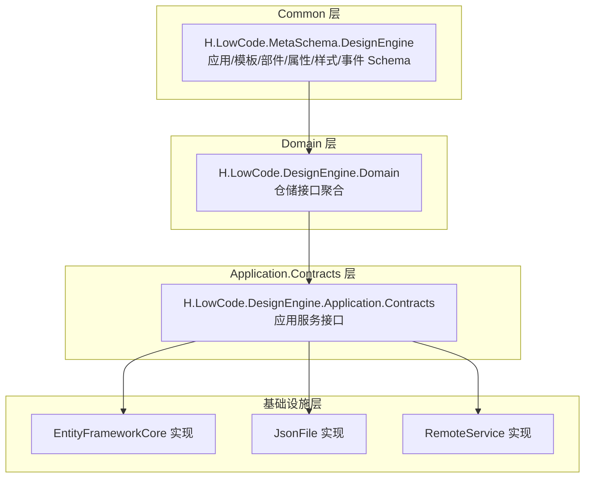
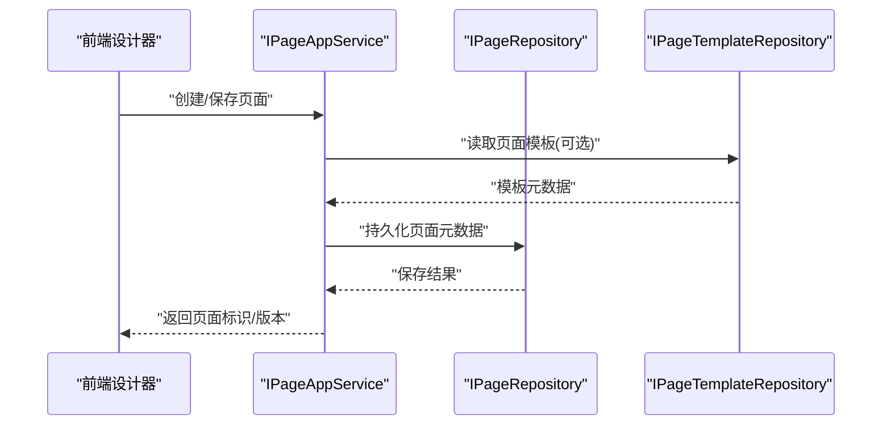
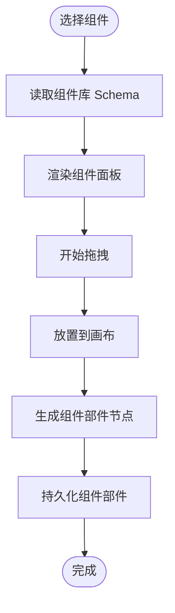
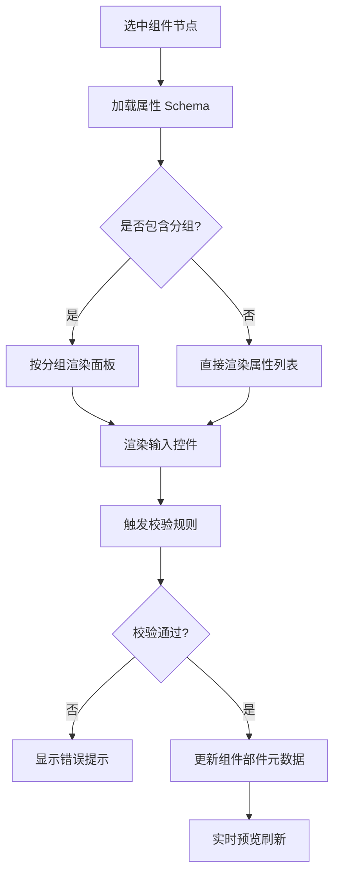
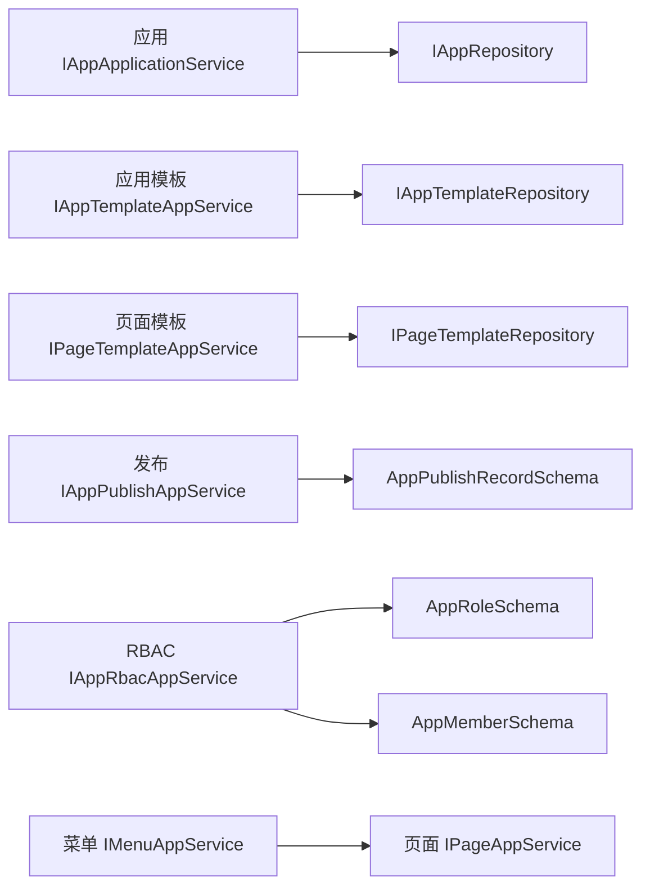
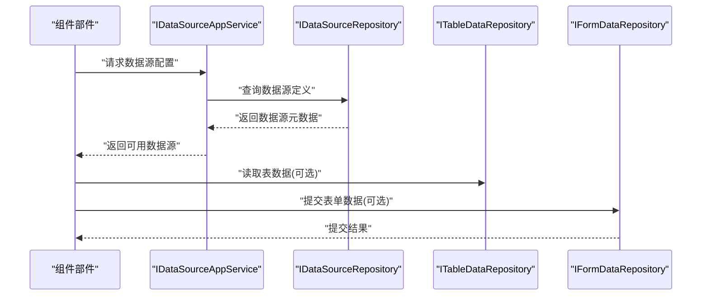

# 设计引擎

<cite>
**本文引用的文件**   
- [DesignEngineDomainModule.cs](file://src/LowCode/DesignEngine/H.LowCode.DesignEngine.Domain/DesignEngineDomainModule.cs)
- [IPageRepository.cs](file://src/LowCode/DesignEngine/H.LowCode.DesignEngine.Domain/MetaRepositories/IPageRepository.cs)
- [IAppRepository.cs](file://src/LowCode/DesignEngine/H.LowCode.DesignEngine.Domain/MetaRepositories/IAppRepository.cs)
- [IComponentLibraryRepository.cs](file://src/LowCode/DesignEngine/H.LowCode.DesignEngine.Domain/PartsRepositories/IComponentLibraryRepository.cs)
- [IComponentPartsRepository.cs](file://src/LowCode/DesignEngine/H.LowCode.DesignEngine.Domain/PartsRepositories/IComponentPartsRepository.cs)
- [IAppTemplateRepository.cs](file://src/LowCode/DesignEngine/H.LowCode.DesignEngine.Domain/PartsRepositories/IAppTemplateRepository.cs)
- [IPageTemplateRepository.cs](file://src/LowCode/DesignEngine/H.LowCode.DesignEngine.Domain/PartsRepositories/IPageTemplateRepository.cs)
- [IDataSourceRepository.cs](file://src/LowCode/DesignEngine/H.LowCode.DesignEngine.Domain/MetaRepositories/IDataSourceRepository.cs)
- [ITableDataRepository.cs](file://src/LowCode/DesignEngine/H.LowCode.DesignEngine.Domain/DataRepositories/ITableDataRepository.cs)
- [IFormDataRepository.cs](file://src/LowCode/DesignEngine/H.LowCode.DesignEngine.Domain/DataRepositories/IFormDataRepository.cs)
- [DesignEngineApplicationContractsModule.cs](file://src/LowCode/DesignEngine/H.LowCode.DesignEngine.Application.Contracts/DesignEngineApplicationContractsModule.cs)
- [IPageAppService.cs](file://src/LowCode/DesignEngine/H.LowCode.DesignEngine.Application.Contracts/AppServices/IPageAppService.cs)
- [IAppApplicationService.cs](file://src/LowCode/DesignEngine/H.LowCode.DesignEngine.Application.Contracts/AppServices/IAppApplicationService.cs)
- [IAppPublishAppService.cs](file://src/LowCode/DesignEngine/H.LowCode.DesignEngine.Application.Contracts/AppServices/IAppPublishAppService.cs)
- [IAppRbacAppService.cs](file://src/LowCode/DesignEngine/H.LowCode.DesignEngine.Application.Contracts/AppServices/IAppRbacAppService.cs)
- [IMenuAppService.cs](file://src/LowCode/DesignEngine/H.LowCode.DesignEngine.Application.Contracts/AppServices/IMenuAppService.cs)
- [IDataSourceAppService.cs](file://src/LowCode/DesignEngine/H.LowCode.DesignEngine.Application.Contracts/AppServices/IDataSourceAppService.cs)
- [IComponentLibraryAppService.cs](file://src/LowCode/DesignEngine/H.LowCode.DesignEngine.Application.Contracts/PartsAppServices/IComponentLibraryAppService.cs)
- [IComponentPartsAppService.cs](file://src/LowCode/DesignEngine/H.LowCode.DesignEngine.Application.Contracts/PartsAppServices/IComponentPartsAppService.cs)
- [IAppTemplateAppService.cs](file://src/LowCode/DesignEngine/H.LowCode.DesignEngine.Application.Contracts/PartsAppServices/IAppTemplateAppService.cs)
- [IPageTemplateAppService.cs](file://src/LowCode/DesignEngine/H.LowCode.DesignEngine.Application.Contracts/PartsAppServices/IPageTemplateAppService.cs)
- [DataSourceInput.cs](file://src/LowCode/DesignEngine/H.LowCode.DesignEngine.Application.Contracts/Inputs/DataSourceInput.cs)
- [ComponentLibrarySchema.cs](file://src/LowCode/Common/H.LowCode.MetaSchema.DesignEngine/ComponentLibrarySchema.cs)
- [ComponentPartsSchema.cs](file://src/LowCode/Common/H.LowCode.MetaSchema.DesignEngine/ComponentPartsSchema.cs)
- [PagePartsSchema.cs](file://src/LowCode/Common/H.LowCode.MetaSchema.DesignEngine/PagePartsSchema.cs)
- [AppPartsSchema.cs](file://src/LowCode/Common/H.LowCode.MetaSchema.DesignEngine/AppPartsSchema.cs)
- [AppTemplateSchema.cs](file://src/LowCode/Common/H.LowCode.MetaSchema.DesignEngine/AppTemplateSchema.cs)
- [PageTemplateSchema.cs](file://src/LowCode/Common/H.LowCode.MetaSchema.DesignEngine/PageTemplateSchema.cs)
- [AppRoleSchema.cs](file://src/LowCode/Common/H.LowCode.MetaSchema.DesignEngine/AppRoleSchema.cs)
- [AppMemberSchema.cs](file://src/LowCode/Common/H.LowCode.MetaSchema.DesignEngine/AppMemberSchema.cs)
- [AppPublishRecordSchema.cs](file://src/LowCode/Common/H.LowCode.MetaSchema.DesignEngine/AppPublishRecordSchema.cs)
- [PartsMetaSchemaBase.cs](file://src/LowCode/Common/H.LowCode.MetaSchema.DesignEngine/PartsMetaSchemaBase.cs)
- [ComponentFragmentEventSchema.cs](file://src/LowCode/Common/H.LowCode.MetaSchema.DesignEngine/PropertySchemas/ComponentFragmentEventSchema.cs)
- [ComponentFragmentStyleSchema.cs](file://src/LowCode/Common/H.LowCode.MetaSchema.DesignEngine/PropertySchemas/ComponentFragmentStyleSchema.cs)
- [ComponentPartsAttributeDefineGroupSchema.cs](file://src/LowCode/Common/H.LowCode.MetaSchema.DesignEngine/PropertySchemas/ComponentPartsAttributeDefineGroupSchema.cs)
- [ComponentPartsStyleDefineSchema.cs](file://src/LowCode/Common/H.LowCode.MetaSchema.DesignEngine/PropertySchemas/ComponentPartsStyleDefineSchema.cs)
- [ComponentPartsEventDefineSchema.cs](file://src/LowCode/Common/H.LowCode.MetaSchema.DesignEngine/PropertySchemas/ComponentPartsEventDefineSchema.cs)
- [ComponentPartsAttributeDefineSchema.cs](file://src/LowCode/Common/H.LowCode.MetaSchema.DesignEngine/PropertySchemas/ComponentPartsAttributeDefineSchema.cs)
- [ComponentPartsStyleSchema.cs](file://src/LowCode/Common/H.LowCode.MetaSchema.DesignEngine/PropertySchemas/ComponentPartsStyleSchema.cs)
- [ComponentPartsEventSchema.cs](file://src/LowCode/Common/H.LowCode.MetaSchema.DesignEngine/PropertySchemas/ComponentPartsEventSchema.cs)
- [ComponentDesignStateSchema.cs](file://src/LowCode/Common/H.LowCode.MetaSchema.DesignEngine/PropertySchemas/ComponentDesignStateSchema.cs)
- [ComponentPartsFragmentSchema.cs](file://src/LowCode/Common/H.LowCode.MetaSchema.DesignEngine/PropertySchemas/ComponentPartsFragmentSchema.cs)
- [ComponentPartsDataSourceSchema.cs](file://src/LowCode/Common/H.LowCode.MetaSchema.DesignEngine/DataSourceSchemas/ComponentPartsDataSourceSchema.cs)
</cite>

## 目录
1. [引言](#引言)
2. [项目结构](#项目结构)
3. [核心组件](#核心组件)
4. [架构总览](#架构总览)
5. [详细组件分析](#详细组件分析)
6. [依赖关系分析](#依赖关系分析)
7. [性能考虑](#性能考虑)
8. [故障排查指南](#故障排查指南)
9. [结论](#结论)
10. [附录：扩展开发指南](#附录扩展开发指南)

## 引言
本技术文档面向 H.AppLab 低代码平台的设计引擎，聚焦可视化设计器的分层架构与运行机制。文档围绕页面设计器、组件设计器、属性面板等核心模块，解释 Application、Domain、EntityFrameworkCore 三层如何协作；说明如何通过 JSON Schema 驱动 UI 组件的可视化编辑；阐明设计引擎与元数据 Schema 的交互机制（组件属性定义、验证规则、绑定关系）；并提供扩展自定义组件、配置属性面板、实现拖拽功能等的完整开发指南与最佳实践。

## 项目结构
设计引擎相关代码主要分布在以下模块中：
- Common 层提供共享的元数据 Schema，包括应用、模板、部件、组件库以及属性/样式/事件等可视化配置元数据。
- DesignEngine 域模块定义仓储接口，抽象页面、应用、菜单、数据源、表单数据、表数据、组件库、组件部件、应用模板、页面模板等持久化能力。
- DesignEngine.Application.Contracts 暴露应用服务接口，作为前端或宿主调用设计引擎能力的契约层。
- EntityFrameworkCore 层负责具体数据库映射（在本仓库快照中未列出具体实现类，但命名约定清晰）。
- Repository.JsonFile 与 Repository.RemoteService 提供可插拔的数据存储后端。

**图示来源**
- [DesignEngineDomainModule.cs:1-200](file://src/LowCode/DesignEngine/H.LowCode.DesignEngine.Domain/DesignEngineDomainModule.cs#L1-L200)
- [DesignEngineApplicationContractsModule.cs:1-200](file://src/LowCode/DesignEngine/H.LowCode.DesignEngine.Application.Contracts/DesignEngineApplicationContractsModule.cs#L1-L200)

**章节来源**
- [DesignEngineDomainModule.cs:1-200](file://src/LowCode/DesignEngine/H.LowCode.DesignEngine.Domain/DesignEngineDomainModule.cs#L1-L200)
- [DesignEngineApplicationContractsModule.cs:1-200](file://src/LowCode/DesignEngine/H.LowCode.DesignEngine.Application.Contracts/DesignEngineApplicationContractsModule.cs#L1-L200)

## 核心组件
本节从“领域实体 + 仓储 + 应用服务 + 元数据 Schema”四个维度梳理设计引擎的核心组件。

- 领域仓储接口
  - 页面：[IPageRepository.cs](file://src/LowCode/DesignEngine/H.LowCode.DesignEngine.Domain/MetaRepositories/IPageRepository.cs)
  - 应用：[IAppRepository.cs](file://src/LowCode/DesignEngine/H.LowCode.DesignEngine.Domain/MetaRepositories/IAppRepository.cs)
  - 组件库：[IComponentLibraryRepository.cs](file://src/LowCode/DesignEngine/H.LowCode.DesignEngine.Domain/PartsRepositories/IComponentLibraryRepository.cs)
  - 组件部件：[IComponentPartsRepository.cs](file://src/LowCode/DesignEngine/H.LowCode.DesignEngine.Domain/PartsRepositories/IComponentPartsRepository.cs)
  - 应用模板：[IAppTemplateRepository.cs](file://src/LowCode/DesignEngine/H.LowCode.DesignEngine.Domain/PartsRepositories/IAppTemplateRepository.cs)
  - 页面模板：[IPageTemplateRepository.cs](file://src/LowCode/DesignEngine/H.LowCode.DesignEngine.Domain/PartsRepositories/IPageTemplateRepository.cs)
  - 数据源：[IDataSourceRepository.cs](file://src/LowCode/DesignEngine/H.LowCode.DesignEngine.Domain/MetaRepositories/IDataSourceRepository.cs)
  - 表数据：[ITableDataRepository.cs](file://src/LowCode/DesignEngine/H.LowCode.DesignEngine.Domain/DataRepositories/ITableDataRepository.cs)
  - 表单数据：[IFormDataRepository.cs](file://src/LowCode/DesignEngine/H.LowCode.DesignEngine.Domain/DataRepositories/IFormDataRepository.cs)

- 应用服务接口
  - 页面：[IPageAppService.cs](file://src/LowCode/DesignEngine/H.LowCode.DesignEngine.Application.Contracts/AppServices/IPageAppService.cs)
  - 应用：[IAppApplicationService.cs](file://src/LowCode/DesignEngine/H.LowCode.DesignEngine.Application.Contracts/AppServices/IAppApplicationService.cs)
  - 发布记录：[IAppPublishAppService.cs](file://src/LowCode/DesignEngine/H.LowCode.DesignEngine.Application.Contracts/AppServices/IAppPublishAppAppService.cs)
  - 权限角色：[IAppRbacAppService.cs](file://src/LowCode/DesignEngine/H.LowCode.DesignEngine.Application.Contracts/AppServices/IAppRbacAppService.cs)
  - 菜单：[IMenuAppService.cs](file://src/LowCode/DesignEngine/H.LowCode.DesignEngine.Application.Contracts/AppServices/IMenuAppService.cs)
  - 数据源：[IDataSourceAppService.cs](file://src/LowCode/DesignEngine/H.LowCode.DesignEngine.Application.Contracts/AppServices/IDataSourceAppService.cs)
  - 组件库：[IComponentLibraryAppService.cs](file://src/LowCode/DesignEngine/H.LowCode.DesignEngine.Application.Contracts/PartsAppServices/IComponentLibraryAppService.cs)
  - 组件部件：[IComponentPartsAppService.cs](file://src/LowCode/DesignEngine/H.LowCode.DesignEngine.Application.Contracts/PartsAppServices/IComponentPartsAppService.cs)
  - 应用模板：[IAppTemplateAppService.cs](file://src/LowCode/DesignEngine/H.LowCode.DesignEngine.Application.Contracts/PartsAppServices/IAppTemplateAppService.cs)
  - 页面模板：[IPageTemplateAppService.cs](file://src/LowCode/DesignEngine/H.LowCode.DesignEngine.Application.Contracts/PartsAppServices/IPageTemplateAppService.cs)

- 元数据 Schema
  - 组件库：[ComponentLibrarySchema.cs](file://src/LowCode/Common/H.LowCode.MetaSchema.DesignEngine/ComponentLibrarySchema.cs)
  - 组件部件：[ComponentPartsSchema.cs](file://src/LowCode/Common/H.LowCode.MetaSchema.DesignEngine/ComponentPartsSchema.cs)
  - 页面部件：[PagePartsSchema.cs](file://src/LowCode/Common/H.LowCode.MetaSchema.DesignEngine/PagePartsSchema.cs)
  - 应用部件：[AppPartsSchema.cs](file://src/LowCode/Common/H.LowCode.MetaSchema.DesignEngine/AppPartsSchema.cs)
  - 应用模板：[AppTemplateSchema.cs](file://src/LowCode/Common/H.LowCode.MetaSchema.DesignEngine/AppTemplateSchema.cs)
  - 页面模板：[PageTemplateSchema.cs](file://src/LowCode/Common/H.LowCode.MetaSchema.DesignEngine/PageTemplateSchema.cs)
  - 角色/成员/发布记录：[AppRoleSchema.cs](file://src/LowCode/Common/H.LowCode.MetaSchema.DesignEngine/AppRoleSchema.cs)、[AppMemberSchema.cs](file://src/LowCode/Common/H.LowCode.MetaSchema.DesignEngine/AppMemberSchema.cs)、[AppPublishRecordSchema.cs](file://src/LowCode/Common/H.LowCode.MetaSchema.DesignEngine/AppPublishRecordSchema.cs)
  - 部件基类：[PartsMetaSchemaBase.cs](file://src/LowCode/Common/H.LowCode.MetaSchema.DesignEngine/PartsMetaSchemaBase.cs)
  - 属性/样式/事件等属性 Schema：见下方“属性 Schema 子图”。

**章节来源**
- [IPageRepository.cs](file://src/LowCode/DesignEngine/H.LowCode.DesignEngine.Domain/MetaRepositories/IPageRepository.cs)
- [IAppRepository.cs](file://src/LowCode/DesignEngine/H.LowCode.DesignEngine.Domain/MetaRepositories/IAppRepository.cs)
- [IComponentLibraryRepository.cs](file://src/LowCode/DesignEngine/H.LowCode.DesignEngine.Domain/PartsRepositories/IComponentLibraryRepository.cs)
- [IComponentPartsRepository.cs](file://src/LowCode/DesignEngine/H.LowCode.DesignEngine.Domain/PartsRepositories/IComponentPartsRepository.cs)
- [IAppTemplateRepository.cs](file://src/LowCode/DesignEngine/H.LowCode.DesignEngine.Domain/PartsRepositories/IAppTemplateRepository.cs)
- [IPageTemplateRepository.cs](file://src/LowCode/DesignEngine/H.LowCode.DesignEngine.Domain/PartsRepositories/IPageTemplateRepository.cs)
- [IDataSourceRepository.cs](file://src/LowCode/DesignEngine/H.LowCode.DesignEngine.Domain/MetaRepositories/IDataSourceRepository.cs)
- [ITableDataRepository.cs](file://src/LowCode/DesignEngine/H.LowCode.DesignEngine.Domain/DataRepositories/ITableDataRepository.cs)
- [IFormDataRepository.cs](file://src/LowCode/DesignEngine/H.LowCode.DesignEngine.Domain/DataRepositories/IFormDataRepository.cs)
- [IPageAppService.cs](file://src/LowCode/DesignEngine/H.LowCode.DesignEngine.Application.Contracts/AppServices/IPageAppService.cs)
- [IAppApplicationService.cs](file://src/LowCode/DesignEngine/H.LowCode.DesignEngine.Application.Contracts/AppServices/IAppApplicationService.cs)
- [IAppPublishAppService.cs](file://src/LowCode/DesignEngine/H.LowCode.DesignEngine.Application.Contracts/AppServices/IAppPublishAppService.cs)
- [IAppRbacAppService.cs](file://src/LowCode/DesignEngine/H.LowCode.DesignEngine.Application.Contracts/AppServices/IAppRbacAppService.cs)
- [IMenuAppService.cs](file://src/LowCode/DesignEngine/H.LowCode.DesignEngine.Application.Contracts/AppServices/IMenuAppService.cs)
- [IDataSourceAppService.cs](file://src/LowCode/DesignEngine/H.LowCode.DesignEngine.Application.Contracts/AppServices/IDataSourceAppService.cs)
- [IComponentLibraryAppService.cs](file://src/LowCode/DesignEngine/H.LowCode.DesignEngine.Application.Contracts/PartsAppServices/IComponentLibraryAppService.cs)
- [IComponentPartsAppService.cs](file://src/LowCode/DesignEngine/H.LowCode.DesignEngine.Application.Contracts/PartsAppServices/IComponentPartsAppService.cs)
- [IAppTemplateAppService.cs](file://src/LowCode/DesignEngine/H.LowCode.DesignEngine.Application.Contracts/PartsAppServices/IAppTemplateAppService.cs)
- [IPageTemplateAppService.cs](file://src/LowCode/DesignEngine/H.LowCode.DesignEngine.Application.Contracts/PartsAppServices/IPageTemplateAppService.cs)
- [ComponentLibrarySchema.cs](file://src/LowCode/Common/H.LowCode.MetaSchema.DesignEngine/ComponentLibrarySchema.cs)
- [ComponentPartsSchema.cs](file://src/LowCode/Common/H.LowCode.MetaSchema.DesignEngine/ComponentPartsSchema.cs)
- [PagePartsSchema.cs](file://src/LowCode/Common/H.LowCode.MetaSchema.DesignEngine/PagePartsSchema.cs)
- [AppPartsSchema.cs](file://src/LowCode/Common/H.LowCode.MetaSchema.DesignEngine/AppPartsSchema.cs)
- [AppTemplateSchema.cs](file://src/LowCode/Common/H.LowCode.MetaSchema.DesignEngine/AppTemplateSchema.cs)
- [PageTemplateSchema.cs](file://src/LowCode/Common/H.LowCode.MetaSchema.DesignEngine/PageTemplateSchema.cs)
- [AppRoleSchema.cs](file://src/LowCode/Common/H.LowCode.MetaSchema.DesignEngine/AppRoleSchema.cs)
- [AppMemberSchema.cs](file://src/LowCode/Common/H.LowCode.MetaSchema.DesignEngine/AppMemberSchema.cs)
- [AppPublishRecordSchema.cs](file://src/LowCode/Common/H.LowCode.MetaSchema.DesignEngine/AppPublishRecordSchema.cs)
- [PartsMetaSchemaBase.cs](file://src/LowCode/Common/H.LowCode.MetaSchema.DesignEngine/PartsMetaSchemaBase.cs)

## 架构总览
设计引擎采用 ABP 风格的典型分层：
- Application.Contracts：对外暴露的应用服务接口，是可视化设计器与后端的能力边界。
- Domain：以仓储接口为核心，聚合页面、应用、组件库、组件部件、模板、数据源、表数据、表单数据等持久化契约。
- Infrastructure（EntityFrameworkCore / JsonFile / RemoteService）：仓储接口的多种实现，支持数据库、本地文件或远程服务。
- Common：共享的元数据 Schema，描述组件库、组件部件、页面部件、应用部件、模板、角色、成员、发布记录、属性/样式/事件等结构化定义。

```mermaid
classDiagram
    class IPageAppService
    class IAppApplicationService
    class IAppPublishAppService
    class IAppRbacAppService
    class IMenuAppService
    class IDataSourceAppService
    class IComponentLibraryAppService
    class IComponentPartsAppService
    class IAppTemplateAppService
    class IPageTemplateAppService

    class IPageRepository
    class IAppRepository
    class IComponentLibraryRepository
    class IComponentPartsRepository
    class IAppTemplateRepository
    class IPageTemplateRepository
    class IDataSourceRepository
    class ITableDataRepository
    class IFormDataRepository

    class ComponentLibrarySchema
    class ComponentPartsSchema
    class PagePartsSchema
    class AppPartsSchema
    class AppTemplateSchema
    class PageTemplateSchema
    class PartsMetaSchemaBase

    IPageAppService --> IPageRepository : "使用"
    IAppApplicationService --> IAppRepository : "使用"
    IComponentLibraryAppService --> IComponentLibraryRepository : "使用"
    IComponentPartsAppService --> IComponentPartsRepository : "使用"
    IAppTemplateAppService --> IAppTemplateRepository : "使用"
    IPageTemplateAppService --> IPageTemplateRepository : "使用"
    IDataSourceAppService --> IDataSourceRepository : "使用"

    ComponentPartsSchema --|> PartsMetaSchemaBase
    PagePartsSchema --|> PartsMetaSchemaBase
    AppPartsSchema --|> PartsMetaSchemaBase
    AppTemplateSchema --|> PartsMetaSchemaBase
    PageTemplateSchema --|> PartsMetaSchemaBase
```

**图示来源**
- [IPageAppService.cs](file://src/LowCode/DesignEngine/H.LowCode.DesignEngine.Application.Contracts/AppServices/IPageAppService.cs)
- [IAppApplicationService.cs](file://src/LowCode/DesignEngine/H.LowCode.DesignEngine.Application.Contracts/AppServices/IAppApplicationService.cs)
- [IComponentLibraryAppService.cs](file://src/LowCode/DesignEngine/H.LowCode.DesignEngine.Application.Contracts/PartsAppServices/IComponentLibraryAppService.cs)
- [IComponentPartsAppService.cs](file://src/LowCode/DesignEngine/H.LowCode.DesignEngine.Application.Contracts/PartsAppServices/IComponentPartsAppService.cs)
- [IAppTemplateAppService.cs](file://src/LowCode/DesignEngine/H.LowCode.DesignEngine.Application.Contracts/PartsAppServices/IAppTemplateAppService.cs)
- [IPageTemplateAppService.cs](file://src/LowCode/DesignEngine/H.LowCode.DesignEngine.Application.Contracts/PartsAppServices/IPageTemplateAppService.cs)
- [IPageRepository.cs](file://src/LowCode/DesignEngine/H.LowCode.DesignEngine.Domain/MetaRepositories/IPageRepository.cs)
- [IAppRepository.cs](file://src/LowCode/DesignEngine/H.LowCode.DesignEngine.Domain/MetaRepositories/IAppRepository.cs)
- [IComponentLibraryRepository.cs](file://src/LowCode/DesignEngine/H.LowCode.DesignEngine.Domain/PartsRepositories/IComponentLibraryRepository.cs)
- [IComponentPartsRepository.cs](file://src/LowCode/DesignEngine/H.LowCode.DesignEngine.Domain/PartsRepositories/IComponentPartsRepository.cs)
- [IAppTemplateRepository.cs](file://src/LowCode/DesignEngine/H.LowCode.DesignEngine.Domain/PartsRepositories/IAppTemplateRepository.cs)
- [IPageTemplateRepository.cs](file://src/LowCode/DesignEngine/H.LowCode.DesignEngine.Domain/PartsRepositories/IPageTemplateRepository.cs)
- [ComponentPartsSchema.cs](file://src/LowCode/Common/H.LowCode.MetaSchema.DesignEngine/ComponentPartsSchema.cs)
- [PagePartsSchema.cs](file://src/LowCode/Common/H.LowCode.MetaSchema.DesignEngine/PagePartsSchema.cs)
- [AppPartsSchema.cs](file://src/LowCode/Common/H.LowCode.MetaSchema.DesignEngine/AppPartsSchema.cs)
- [AppTemplateSchema.cs](file://src/LowCode/Common/H.LowCode.MetaSchema.DesignEngine/AppTemplateSchema.cs)
- [PageTemplateSchema.cs](file://src/LowCode/Common/H.LowCode.MetaSchema.DesignEngine/PageTemplateSchema.cs)
- [PartsMetaSchemaBase.cs](file://src/LowCode/Common/H.LowCode.MetaSchema.DesignEngine/PartsMetaSchemaBase.cs)

## 详细组件分析

### 页面设计器与页面元数据
- 页面在领域层通过 [IPageRepository.cs](file://src/LowCode/DesignEngine/H.LowCode.DesignEngine.Domain/MetaRepositories/IPageRepository.cs) 抽象，表示页面的增删改查、版本、状态等能力。
- 页面设计器的应用服务由 [IPageAppService.cs](file://src/LowCode/DesignEngine/H.LowCode.DesignEngine.Application.Contracts/AppServices/IPageAppService.cs) 暴露，承载页面保存、预览、复制、导入导出等编排操作。
- 页面与模板的关系：页面可以基于 [PageTemplateSchema.cs](file://src/LowCode/Common/H.LowCode.MetaSchema.DesignEngine/PageTemplateSchema.cs) 进行快速创建；模板本身受 [IPageTemplateRepository.cs](file://src/LowCode/DesignEngine/H.LowCode.DesignEngine.Domain/PartsRepositories/IPageTemplateRepository.cs) 管理。

**图示来源**
- [IPageAppService.cs](file://src/LowCode/DesignEngine/H.LowCode.DesignEngine.Application.Contracts/AppServices/IPageAppService.cs)
- [IPageRepository.cs](file://src/LowCode/DesignEngine/H.LowCode.DesignEngine.Domain/MetaRepositories/IPageRepository.cs)
- [IPageTemplateRepository.cs](file://src/LowCode/DesignEngine/H.LowCode.DesignEngine.Domain/PartsRepositories/IPageTemplateRepository.cs)

**章节来源**
- [IPageAppService.cs](file://src/LowCode/DesignEngine/H.LowCode.DesignEngine.Application.Contracts/AppServices/IPageAppService.cs)
- [IPageRepository.cs](file://src/LowCode/DesignEngine/H.LowCode.DesignEngine.Domain/MetaRepositories/IPageRepository.cs)
- [IPageTemplateRepository.cs](file://src/LowCode/DesignEngine/H.LowCode.DesignEngine.Domain/PartsRepositories/IPageTemplateRepository.cs)
- [PageTemplateSchema.cs](file://src/LowCode/Common/H.LowCode.MetaSchema.DesignEngine/PageTemplateSchema.cs)

### 组件设计器与组件库
- 组件库在领域层由 [IComponentLibraryRepository.cs](file://src/LowCode/DesignEngine/H.LowCode.DesignEngine.Domain/PartsRepositories/IComponentLibraryRepository.cs) 管理，包含组件分类、图标、默认配置、可见性、排序等。
- 组件实例/部件由 [IComponentPartsRepository.cs](file://src/LowCode/DesignEngine/H.LowCode.DesignEngine.Domain/PartsRepositories/IComponentPartsRepository.cs) 管理，用于保存页面中的组件节点树、布局、样式、事件绑定等运行时元数据。
- 组件库与组件部件均继承自公共元数据基类 [PartsMetaSchemaBase.cs](file://src/LowCode/Common/H.LowCode.MetaSchema.DesignEngine/PartsMetaSchemaBase.cs)，确保统一的扩展点与校验行为。
- 组件库 Schema 由 [ComponentLibrarySchema.cs](file://src/LowCode/Common/H.LowCode.MetaSchema.DesignEngine/ComponentLibrarySchema.cs) 定义，组件部件 Schema 由 [ComponentPartsSchema.cs](file://src/LowCode/Common/H.LowCode.MetaSchema.DesignEngine/ComponentPartsSchema.cs) 定义。

**图示来源**
- [ComponentLibrarySchema.cs](file://src/LowCode/Common/H.LowCode.MetaSchema.DesignEngine/ComponentLibrarySchema.cs)
- [ComponentPartsSchema.cs](file://src/LowCode/Common/H.LowCode.MetaSchema.DesignEngine/ComponentPartsSchema.cs)
- [IComponentLibraryRepository.cs](file://src/LowCode/DesignEngine/H.LowCode.DesignEngine.Domain/PartsRepositories/IComponentLibraryRepository.cs)
- [IComponentPartsRepository.cs](file://src/LowCode/DesignEngine/H.LowCode.DesignEngine.Domain/PartsRepositories/IComponentPartsRepository.cs)

**章节来源**
- [ComponentLibrarySchema.cs](file://src/LowCode/Common/H.LowCode.MetaSchema.DesignEngine/ComponentLibrarySchema.cs)
- [ComponentPartsSchema.cs](file://src/LowCode/Common/H.LowCode.MetaSchema.DesignEngine/ComponentPartsSchema.cs)
- [IComponentLibraryRepository.cs](file://src/LowCode/DesignEngine/H.LowCode.DesignEngine.Domain/PartsRepositories/IComponentLibraryRepository.cs)
- [IComponentPartsRepository.cs](file://src/LowCode/DesignEngine/H.LowCode.DesignEngine.Domain/PartsRepositories/IComponentPartsRepository.cs)
- [PartsMetaSchemaBase.cs](file://src/LowCode/Common/H.LowCode.MetaSchema.DesignEngine/PartsMetaSchemaBase.cs)

### 属性面板与可视化编辑
属性面板由一组属性 Schema 驱动，覆盖属性分组、类型、验证、默认值、联动显示、样式、事件等：
- 属性分组：[ComponentPartsAttributeDefineGroupSchema.cs](file://src/LowCode/Common/H.LowCode.MetaSchema.DesignEngine/PropertySchemas/ComponentPartsAttributeDefineGroupSchema.cs)
- 属性定义：[ComponentPartsAttributeDefineSchema.cs](file://src/LowCode/Common/H.LowCode.MetaSchema.DesignEngine/PropertySchemas/ComponentPartsAttributeDefineSchema.cs)
- 样式定义：[ComponentPartsStyleDefineSchema.cs](file://src/LowCode/Common/H.LowCode.MetaSchema.DesignEngine/PropertySchemas/ComponentPartsStyleDefineSchema.cs)
- 样式对象：[ComponentPartsStyleSchema.cs](file://src/LowCode/Common/H.LowCode.MetaSchema.DesignEngine/PropertySchemas/ComponentPartsStyleSchema.cs)
- 事件定义：[ComponentPartsEventDefineSchema.cs](file://src/LowCode/Common/H.LowCode.MetaSchema.DesignEngine/PropertySchemas/ComponentPartsEventDefineSchema.cs)
- 事件对象：[ComponentPartsEventSchema.cs](file://src/LowCode/Common/H.LowCode.MetaSchema.DesignEngine/PropertySchemas/ComponentPartsEventSchema.cs)
- 片段级样式/事件：[ComponentFragmentStyleSchema.cs](file://src/LowCode/Common/H.LowCode.MetaSchema.DesignEngine/PropertySchemas/ComponentFragmentStyleSchema.cs)、[ComponentFragmentEventSchema.cs](file://src/LowCode/Common/H.LowCode.MetaSchema.DesignEngine/PropertySchemas/ComponentFragmentEventSchema.cs)
- 设计态状态：[ComponentDesignStateSchema.cs](file://src/LowCode/Common/H.LowCode.MetaSchema.DesignEngine/PropertySchemas/ComponentDesignStateSchema.cs)
- 片段容器：[ComponentPartsFragmentSchema.cs](file://src/LowCode/Common/H.LowCode.MetaSchema.DesignEngine/PropertySchemas/ComponentPartsFragmentSchema.cs)
- 数据源绑定（组件部件）：[ComponentPartsDataSourceSchema.cs](file://src/LowCode/Common/H.LowCode.MetaSchema.DesignEngine/DataSourceSchemas/ComponentPartsDataSourceSchema.cs)

**图示来源**
- [ComponentPartsAttributeDefineGroupSchema.cs](file://src/LowCode/Common/H.LowCode.MetaSchema.DesignEngine/PropertySchemas/ComponentPartsAttributeDefineGroupSchema.cs)
- [ComponentPartsAttributeDefineSchema.cs](file://src/LowCode/Common/H.LowCode.MetaSchema.DesignEngine/PropertySchemas/ComponentPartsAttributeDefineSchema.cs)
- [ComponentPartsStyleDefineSchema.cs](file://src/LowCode/Common/H.LowCode.MetaSchema.DesignEngine/PropertySchemas/ComponentPartsStyleDefineSchema.cs)
- [ComponentPartsStyleSchema.cs](file://src/LowCode/Common/H.LowCode.MetaSchema.DesignEngine/PropertySchemas/ComponentPartsStyleSchema.cs)
- [ComponentPartsEventDefineSchema.cs](file://src/LowCode/Common/H.LowCode.MetaSchema.DesignEngine/PropertySchemas/ComponentPartsEventDefineSchema.cs)
- [ComponentPartsEventSchema.cs](file://src/LowCode/Common/H.LowCode.MetaSchema.DesignEngine/PropertySchemas/ComponentPartsEventSchema.cs)
- [ComponentFragmentStyleSchema.cs](file://src/LowCode/Common/H.LowCode.MetaSchema.DesignEngine/PropertySchemas/ComponentFragmentStyleSchema.cs)
- [ComponentFragmentEventSchema.cs](file://src/LowCode/Common/H.LowCode.MetaSchema.DesignEngine/PropertySchemas/ComponentFragmentEventSchema.cs)
- [ComponentDesignStateSchema.cs](file://src/LowCode/Common/H.LowCode.MetaSchema.DesignEngine/PropertySchemas/ComponentDesignStateSchema.cs)
- [ComponentPartsFragmentSchema.cs](file://src/LowCode/Common/H.LowCode.MetaSchema.DesignEngine/PropertySchemas/ComponentPartsFragmentSchema.cs)
- [ComponentPartsDataSourceSchema.cs](file://src/LowCode/Common/H.LowCode.MetaSchema.DesignEngine/DataSourceSchemas/ComponentPartsDataSourceSchema.cs)

**章节来源**
- [ComponentPartsAttributeDefineGroupSchema.cs](file://src/LowCode/Common/H.LowCode.MetaSchema.DesignEngine/PropertySchemas/ComponentPartsAttributeDefineGroupSchema.cs)
- [ComponentPartsAttributeDefineSchema.cs](file://src/LowCode/Common/H.LowCode.MetaSchema.DesignEngine/PropertySchemas/ComponentPartsAttributeDefineSchema.cs)
- [ComponentPartsStyleDefineSchema.cs](file://src/LowCode/Common/H.LowCode.MetaSchema.DesignEngine/PropertySchemas/ComponentPartsStyleDefineSchema.cs)
- [ComponentPartsStyleSchema.cs](file://src/LowCode/Common/H.LowCode.MetaSchema.DesignEngine/PropertySchemas/ComponentPartsStyleSchema.cs)
- [ComponentPartsEventDefineSchema.cs](file://src/LowCode/Common/H.LowCode.MetaSchema.DesignEngine/PropertySchemas/ComponentPartsEventDefineSchema.cs)
- [ComponentPartsEventSchema.cs](file://src/LowCode/Common/H.LowCode.MetaSchema.DesignEngine/PropertySchemas/ComponentPartsEventSchema.cs)
- [ComponentFragmentStyleSchema.cs](file://src/LowCode/Common/H.LowCode.MetaSchema.DesignEngine/PropertySchemas/ComponentFragmentStyleSchema.cs)
- [ComponentFragmentEventSchema.cs](file://src/LowCode/Common/H.LowCode.MetaSchema.DesignEngine/PropertySchemas/ComponentFragmentEventSchema.cs)
- [ComponentDesignStateSchema.cs](file://src/LowCode/Common/H.LowCode.MetaSchema.DesignEngine/PropertySchemas/ComponentDesignStateSchema.cs)
- [ComponentPartsFragmentSchema.cs](file://src/LowCode/Common/H.LowCode.MetaSchema.DesignEngine/PropertySchemas/ComponentPartsFragmentSchema.cs)
- [ComponentPartsDataSourceSchema.cs](file://src/LowCode/Common/H.LowCode.MetaSchema.DesignEngine/DataSourceSchemas/ComponentPartsDataSourceSchema.cs)

### 应用、模板与发布
- 应用由 [IAppApplicationService.cs](file://src/LowCode/DesignEngine/H.LowCode.DesignEngine.Application.Contracts/AppServices/IAppApplicationService.cs) 和 [IAppRepository.cs](file://src/LowCode/DesignEngine/H.LowCode.DesignEngine.Domain/MetaRepositories/IAppRepository.cs) 管理。
- 应用模板由 [IAppTemplateAppService.cs](file://src/LowCode/DesignEngine/H.LowCode.DesignEngine.Application.Contracts/PartsAppServices/IAppTemplateAppService.cs) 与 [IAppTemplateRepository.cs](file://src/LowCode/DesignEngine/H.LowCode.DesignEngine.Domain/PartsRepositories/IAppTemplateRepository.cs) 管理，模板 Schema 为 [AppTemplateSchema.cs](file://src/LowCode/Common/H.LowCode.MetaSchema.DesignEngine/AppTemplateSchema.cs)。
- 页面模板由 [IPageTemplateAppService.cs](file://src/LowCode/DesignEngine/H.LowCode.DesignEngine.Application.Contracts/PartsAppServices/IPageTemplateAppService.cs) 与 [IPageTemplateRepository.cs](file://src/LowCode/DesignEngine/H.LowCode.DesignEngine.Domain/PartsRepositories/IPageTemplateRepository.cs) 管理，模板 Schema 为 [PageTemplateSchema.cs](file://src/LowCode/Common/H.LowCode.MetaSchema.DesignEngine/PageTemplateSchema.cs)。
- 发布记录由 [IAppPublishAppService.cs](file://src/LowCode/DesignEngine/H.LowCode.DesignEngine.Application.Contracts/AppServices/IAppPublishAppService.cs) 管理，并发布记录模型为 [AppPublishRecordSchema.cs](file://src/LowCode/Common/H.LowCode.MetaSchema.DesignEngine/AppPublishRecordSchema.cs)。
- 角色与成员分别由 [AppRoleSchema.cs](file://src/LowCode/Common/H.LowCode.MetaSchema.DesignEngine/AppRoleSchema.cs) 与 [AppMemberSchema.cs](file://src/LowCode/Common/H.LowCode.MetaSchema.DesignEngine/AppMemberSchema.cs) 描述，并通过 [IAppRbacAppService.cs](file://src/LowCode/DesignEngine/H.LowCode.DesignEngine.Application.Contracts/AppServices/IAppRbacAppService.cs) 提供服务。
- 菜单由 [IMenuAppService.cs](file://src/LowCode/DesignEngine/H.LowCode.DesignEngine.Application.Contracts/AppServices/IMenuAppService.cs) 暴露。

**图示来源**
- [IAppApplicationService.cs](file://src/LowCode/DesignEngine/H.LowCode.DesignEngine.Application.Contracts/AppServices/IAppApplicationService.cs)
- [IAppRepository.cs](file://src/LowCode/DesignEngine/H.LowCode.DesignEngine.Domain/MetaRepositories/IAppRepository.cs)
- [IAppTemplateAppService.cs](file://src/LowCode/DesignEngine/H.LowCode.DesignEngine.Application.Contracts/PartsAppServices/IAppTemplateAppService.cs)
- [IAppTemplateRepository.cs](file://src/LowCode/DesignEngine/H.LowCode.DesignEngine.Domain/PartsRepositories/IAppTemplateRepository.cs)
- [IPageTemplateAppService.cs](file://src/LowCode/DesignEngine/H.LowCode.DesignEngine.Application.Contracts/PartsAppServices/IPageTemplateAppService.cs)
- [IPageTemplateRepository.cs](file://src/LowCode/DesignEngine/H.LowCode.DesignEngine.Domain/PartsRepositories/IPageTemplateRepository.cs)
- [IAppPublishAppService.cs](file://src/LowCode/DesignEngine/H.LowCode.DesignEngine.Application.Contracts/AppServices/IAppPublishAppService.cs)
- [AppPublishRecordSchema.cs](file://src/LowCode/Common/H.LowCode.MetaSchema.DesignEngine/AppPublishRecordSchema.cs)
- [AppRoleSchema.cs](file://src/LowCode/Common/H.LowCode.MetaSchema.DesignEngine/AppRoleSchema.cs)
- [AppMemberSchema.cs](file://src/LowCode/Common/H.LowCode.MetaSchema.DesignEngine/AppMemberSchema.cs)
- [IMenuAppService.cs](file://src/LowCode/DesignEngine/H.LowCode.DesignEngine.Application.Contracts/AppServices/IMenuAppService.cs)
- [IPageAppService.cs](file://src/LowCode/DesignEngine/H.LowCode.DesignEngine.Application.Contracts/AppServices/IPageAppService.cs)

**章节来源**
- [IAppApplicationService.cs](file://src/LowCode/DesignEngine/H.LowCode.DesignEngine.Application.Contracts/AppServices/IAppApplicationService.cs)
- [IAppRepository.cs](file://src/LowCode/DesignEngine/H.LowCode.DesignEngine.Domain/MetaRepositories/IAppRepository.cs)
- [IAppTemplateAppService.cs](file://src/LowCode/DesignEngine/H.LowCode.DesignEngine.Application.Contracts/PartsAppServices/IAppTemplateAppService.cs)
- [IAppTemplateRepository.cs](file://src/LowCode/DesignEngine/H.LowCode.DesignEngine.Domain/PartsRepositories/IAppTemplateRepository.cs)
- [IPageTemplateAppService.cs](file://src/LowCode/DesignEngine/H.LowCode.DesignEngine.Application.Contracts/PartsAppServices/IPageTemplateAppService.cs)
- [IPageTemplateRepository.cs](file://src/LowCode/DesignEngine/H.LowCode.DesignEngine.Domain/PartsRepositories/IPageTemplateRepository.cs)
- [IAppPublishAppService.cs](file://src/LowCode/DesignEngine/H.LowCode.DesignEngine.Application.Contracts/AppServices/IAppPublishAppService.cs)
- [AppPublishRecordSchema.cs](file://src/LowCode/Common/H.LowCode.MetaSchema.DesignEngine/AppPublishRecordSchema.cs)
- [AppRoleSchema.cs](file://src/LowCode/Common/H.LowCode.MetaSchema.DesignEngine/AppRoleSchema.cs)
- [AppMemberSchema.cs](file://src/LowCode/Common/H.LowCode.MetaSchema.DesignEngine/AppMemberSchema.cs)
- [IMenuAppService.cs](file://src/LowCode/DesignEngine/H.LowCode.DesignEngine.Application.Contracts/AppServices/IMenuAppService.cs)

### 数据源与表单/表数据
- 数据源由 [IDataSourceAppService.cs](file://src/LowCode/DesignEngine/H.LowCode.DesignEngine.Application.Contracts/AppServices/IDataSourceAppService.cs) 与 [IDataSourceRepository.cs](file://src/LowCode/DesignEngine/H.LowCode.DesignEngine.Domain/MetaRepositories/IDataSourceRepository.cs) 管理，输入参数由 [DataSourceInput.cs](file://src/LowCode/DesignEngine/H.LowCode.DesignEngine.Application.Contracts/Inputs/DataSourceInput.cs) 描述。
- 表数据与表单数据分别由 [ITableDataRepository.cs](file://src/LowCode/DesignEngine/H.LowCode.DesignEngine.Domain/DataRepositories/ITableDataRepository.cs) 与 [IFormDataRepository.cs](file://src/LowCode/DesignEngine/H.LowCode.DesignEngine.Domain/DataRepositories/IFormDataRepository.cs) 管理，支撑组件的数据绑定与提交流程。

**图示来源**
- [IDataSourceAppService.cs](file://src/LowCode/DesignEngine/H.LowCode.DesignEngine.Application.Contracts/AppServices/IDataSourceAppService.cs)
- [IDataSourceRepository.cs](file://src/LowCode/DesignEngine/H.LowCode.DesignEngine.Domain/MetaRepositories/IDataSourceRepository.cs)
- [ITableDataRepository.cs](file://src/LowCode/DesignEngine/H.LowCode.DesignEngine.Domain/DataRepositories/ITableDataRepository.cs)
- [IFormDataRepository.cs](file://src/LowCode/DesignEngine/H.LowCode.DesignEngine.Domain/DataRepositories/IFormDataRepository.cs)
- [DataSourceInput.cs](file://src/LowCode/DesignEngine/H.LowCode.DesignEngine.Application.Contracts/Inputs/DataSourceInput.cs)

**章节来源**
- [IDataSourceAppService.cs](file://src/LowCode/DesignEngine/H.LowCode.DesignEngine.Application.Contracts/AppServices/IDataSourceAppService.cs)
- [IDataSourceRepository.cs](file://src/LowCode/DesignEngine/H.LowCode.DesignEngine.Domain/MetaRepositories/IDataSourceRepository.cs)
- [ITableDataRepository.cs](file://src/LowCode/DesignEngine/H.LowCode.DesignEngine.Domain/DataRepositories/ITableDataRepository.cs)
- [IFormDataRepository.cs](file://src/LowCode/DesignEngine/H.LowCode.DesignEngine.Domain/DataRepositories/IFormDataRepository.cs)
- [DataSourceInput.cs](file://src/LowCode/DesignEngine/H.LowCode.DesignEngine.Application.Contracts/Inputs/DataSourceInput.cs)

## 依赖关系分析
- 应用服务对仓储的依赖是单向的：Application.Contracts → Domain。
- Domain 仅声明接口，不耦合具体存储实现，便于替换为 EntityFrameworkCore、JsonFile 或 RemoteService。
- Common 层的 Schema 被 Domain 与 Application.Contracts 共同引用，作为前后端一致的元数据契约。

**图示来源**
- [DesignEngineApplicationContractsModule.cs:1-200](file://src/LowCode/DesignEngine/H.LowCode.DesignEngine.Application.Contracts/DesignEngineApplicationContractsModule.cs#L1-L200)
- [DesignEngineDomainModule.cs:1-200](file://src/LowCode/DesignEngine/H.LowCode.DesignEngine.Domain/DesignEngineDomainModule.cs#L1-L200)

**章节来源**
- [DesignEngineApplicationContractsModule.cs:1-200](file://src/LowCode/DesignEngine/H.LowCode.DesignEngine.Application.Contracts/DesignEngineApplicationContractsModule.cs#L1-L200)
- [DesignEngineDomainModule.cs:1-200](file://src/LowCode/DesignEngine/H.LowCode.DesignEngine.Domain/DesignEngineDomainModule.cs#L1-L200)

## 性能考虑
- 元数据缓存：组件库、模板、属性 Schema 建议在前端或服务端进行缓存，减少重复解析开销。
- 增量更新：属性变更时仅重绘受影响节点，避免整棵树重建。
- 批量操作：保存页面或组件部件时使用批量写入，降低 IO 次数。
- 懒加载：长列表的属性分组按需展开，减少初始渲染压力。
- 数据源分页：表格数据与表单数据在大数据量场景下应启用分页与虚拟滚动。

## 故障排查指南
- 组件无法拖拽到画布：检查组件库 Schema 是否注册，确认组件部件节点结构是否符合 [ComponentPartsSchema.cs](file://src/LowCode/Common/H.LowCode.MetaSchema.DesignEngine/ComponentPartsSchema.cs) 的约束。
- 属性面板不显示或校验失败：核对属性分组与属性定义的 Schema 是否一致，确认 [ComponentPartsAttributeDefineGroupSchema.cs](file://src/LowCode/Common/H.LowCode.MetaSchema.DesignEngine/PropertySchemas/ComponentPartsAttributeDefineGroupSchema.cs) 与 [ComponentPartsAttributeDefineSchema.cs](file://src/LowCode/Common/H.LowCode.MetaSchema.DesignEngine/PropertySchemas/ComponentPartsAttributeDefineSchema.cs) 的配置正确。
- 数据源绑定无效：检查 [ComponentPartsDataSourceSchema.cs](file://src/LowCode/Common/H.LowCode.MetaSchema.DesignEngine/DataSourceSchemas/ComponentPartsDataSourceSchema.cs) 的配置与 [IDataSourceAppService.cs](file://src/LowCode/DesignEngine/H.LowCode.DesignEngine.Application.Contracts/AppServices/IDataSourceAppService.cs) 提供的数据源定义是否匹配。
- 页面模板不可用：确认 [PageTemplateSchema.cs](file://src/LowCode/Common/H.LowCode.MetaSchema.DesignEngine/PageTemplateSchema.cs) 与 [IPageTemplateRepository.cs](file://src/LowCode/DesignEngine/H.LowCode.DesignEngine.Domain/PartsRepositories/IPageTemplateRepository.cs) 的实现是否正确返回模板元数据。

**章节来源**
- [ComponentPartsSchema.cs](file://src/LowCode/Common/H.LowCode.MetaSchema.DesignEngine/ComponentPartsSchema.cs)
- [ComponentPartsAttributeDefineGroupSchema.cs](file://src/LowCode/Common/H.LowCode.MetaSchema.DesignEngine/PropertySchemas/ComponentPartsAttributeDefineGroupSchema.cs)
- [ComponentPartsAttributeDefineSchema.cs](file://src/LowCode/Common/H.LowCode.MetaSchema.DesignEngine/PropertySchemas/ComponentPartsAttributeDefineSchema.cs)
- [ComponentPartsDataSourceSchema.cs](file://src/LowCode/Common/H.LowCode.MetaSchema.DesignEngine/DataSourceSchemas/ComponentPartsDataSourceSchema.cs)
- [IDataSourceAppService.cs](file://src/LowCode/DesignEngine/H.LowCode.DesignEngine.Application.Contracts/AppServices/IDataSourceAppService.cs)
- [PageTemplateSchema.cs](file://src/LowCode/Common/H.LowCode.MetaSchema.DesignEngine/PageTemplateSchema.cs)
- [IPageTemplateRepository.cs](file://src/LowCode/DesignEngine/H.LowCode.DesignEngine.Domain/PartsRepositories/IPageTemplateRepository.cs)

## 结论
H.AppLab 设计引擎以清晰的三层架构与强契约化的元数据 Schema 为基础，将可视化设计器的页面、组件、属性、事件、样式、模板、数据源等能力解耦并标准化。通过仓储接口抽象，系统具备灵活的存储后端扩展能力；通过 Schema 驱动的属性面板与组件面板，开发者可以快速构建稳定的可视化编辑体验。

## 附录：扩展开发指南

### 扩展自定义组件
- 定义组件库项：在 [ComponentLibrarySchema.cs](file://src/LowCode/Common/H.LowCode.MetaSchema.DesignEngine/ComponentLibrarySchema.cs) 中添加新的组件元数据，包括名称、图标、默认配置、可见性等。
- 定义组件部件节点：在 [ComponentPartsSchema.cs](file://src/LowCode/Common/H.LowCode.MetaSchema.DesignEngine/ComponentPartsSchema.cs) 中新增组件节点结构，确保与画布渲染器兼容。
- 注册仓储与服务：若需要独立持久化，可在 Domain 层新增仓储接口，并在 Application.Contracts 层新增对应应用服务。

**章节来源**
- [ComponentLibrarySchema.cs](file://src/LowCode/Common/H.LowCode.MetaSchema.DesignEngine/ComponentLibrarySchema.cs)
- [ComponentPartsSchema.cs](file://src/LowCode/Common/H.LowCode.MetaSchema.DesignEngine/ComponentPartsSchema.cs)

### 配置属性面板
- 新增属性分组：在 [ComponentPartsAttributeDefineGroupSchema.cs](file://src/LowCode/Common/H.LowCode.MetaSchema.DesignEngine/PropertySchemas/ComponentPartsAttributeDefineGroupSchema.cs) 中定义分组。
- 新增属性定义：在 [ComponentPartsAttributeDefineSchema.cs](file://src/LowCode/Common/H.LowCode.MetaSchema.DesignEngine/PropertySchemas/ComponentPartsAttributeDefineSchema.cs) 中定义属性键、类型、默认值、校验规则、可见性条件等。
- 添加样式/事件：分别在 [ComponentPartsStyleDefineSchema.cs](file://src/LowCode/Common/H.LowCode.MetaSchema.DesignEngine/PropertySchemas/ComponentPartsStyleDefineSchema.cs)、[ComponentPartsEventDefineSchema.cs](file://src/LowCode/Common/H.LowCode.MetaSchema.DesignEngine/PropertySchemas/ComponentPartsEventDefineSchema.cs) 中扩展。

**章节来源**
- [ComponentPartsAttributeDefineGroupSchema.cs](file://src/LowCode/Common/H.LowCode.MetaSchema.DesignEngine/PropertySchemas/ComponentPartsAttributeDefineGroupSchema.cs)
- [ComponentPartsAttributeDefineSchema.cs](file://src/LowCode/Common/H.LowCode.MetaSchema.DesignEngine/PropertySchemas/ComponentPartsAttributeDefineSchema.cs)
- [ComponentPartsStyleDefineSchema.cs](file://src/LowCode/Common/H.LowCode.MetaSchema.DesignEngine/PropertySchemas/ComponentPartsStyleDefineSchema.cs)
- [ComponentPartsEventDefineSchema.cs](file://src/LowCode/Common/H.LowCode.MetaSchema.DesignEngine/PropertySchemas/ComponentPartsEventDefineSchema.cs)

### 实现拖拽功能
- 在画布上监听拖放事件，当用户从组件面板拖入节点时，根据 [ComponentLibrarySchema.cs](file://src/LowCode/Common/H.LowCode.MetaSchema.DesignEngine/ComponentLibrarySchema.cs) 生成对应的 [ComponentPartsSchema.cs](file://src/LowCode/Common/H.LowCode.MetaSchema.DesignEngine/ComponentPartsSchema.cs) 节点。
- 将生成的组件部件保存到 [IComponentPartsRepository.cs](file://src/LowCode/DesignEngine/H.LowCode.DesignEngine.Domain/PartsRepositories/IComponentPartsRepository.cs) 管理的结构中，并触发预览刷新。

**章节来源**
- [ComponentLibrarySchema.cs](file://src/LowCode/Common/H.LowCode.MetaSchema.DesignEngine/ComponentLibrarySchema.cs)
- [ComponentPartsSchema.cs](file://src/LowCode/Common/H.LowCode.MetaSchema.DesignEngine/ComponentPartsSchema.cs)
- [IComponentPartsRepository.cs](file://src/LowCode/DesignEngine/H.LowCode.DesignEngine.Domain/PartsRepositories/IComponentPartsRepository.cs)